# H Chat 아키텍처

> 최종 업데이트: 2026-03-07 | Phase 35 완료 기준

## 시스템 개요

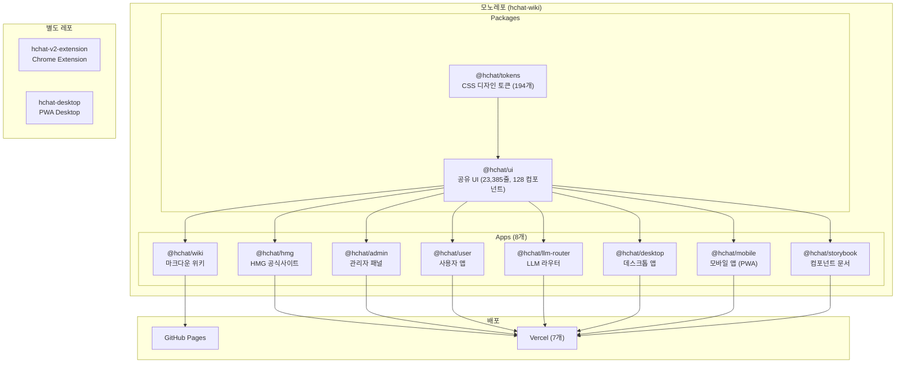

## 패키지 의존성

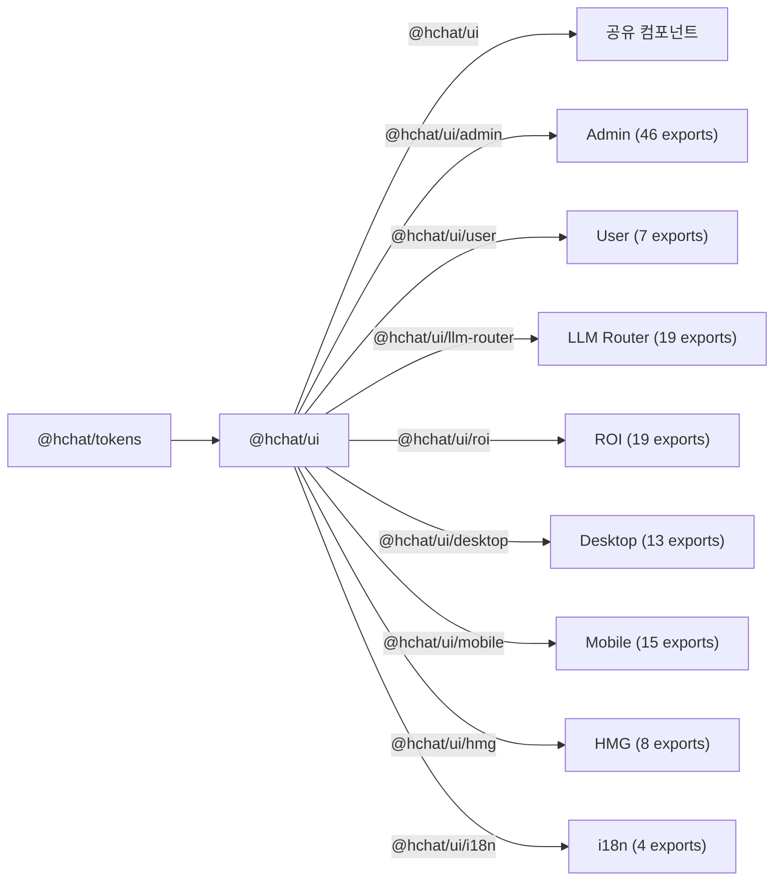

## @hchat/ui 내부 구조 (195파일, 23,385줄)

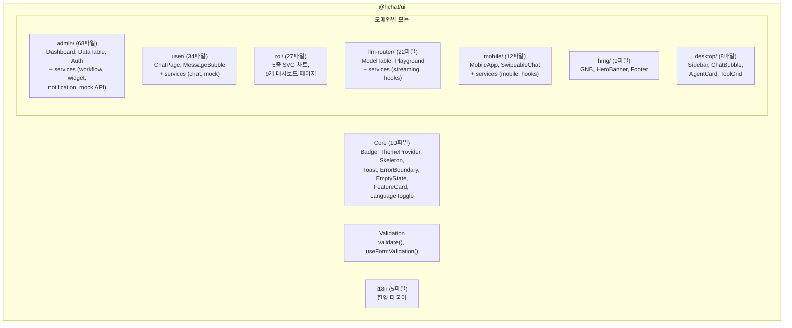

## 서비스 레이어 패턴

3개 앱(Admin, User, LLM Router) + Mobile에 동일한 Provider Pattern 적용:

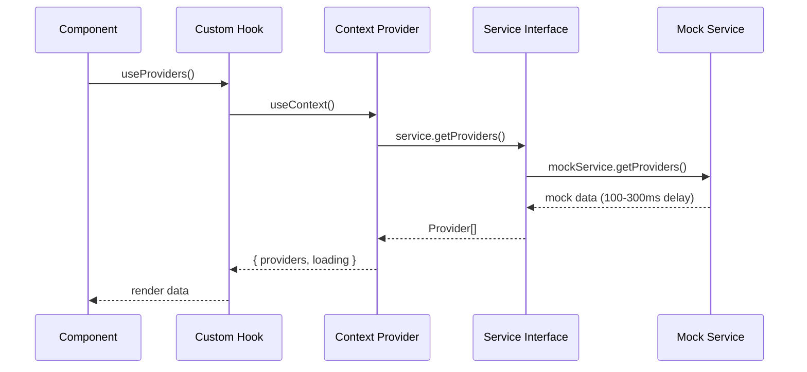

실제 API 전환 시 Mock Service를 API Service로 교체 (Interface 불변).

## 실시간 데이터 흐름

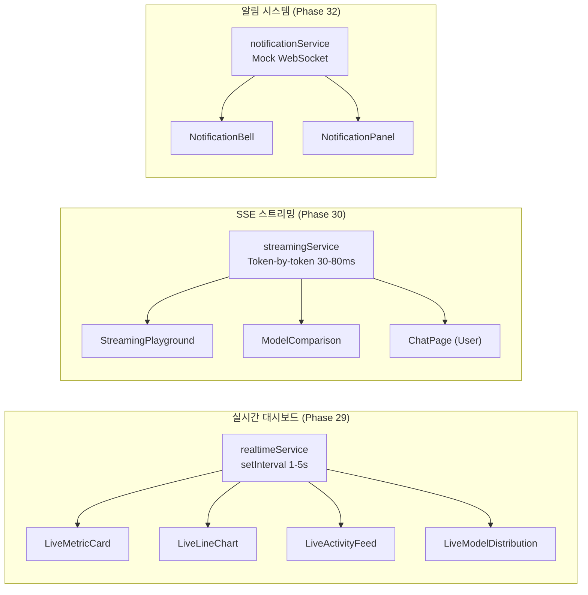

## 워크플로우 빌더 (Phase 34)

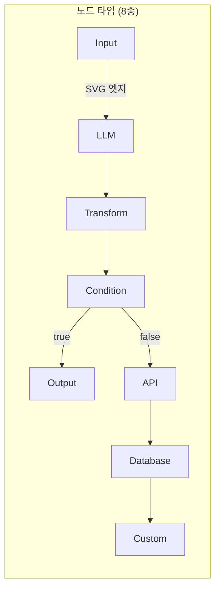

## 위젯 시스템 (Phase 33)

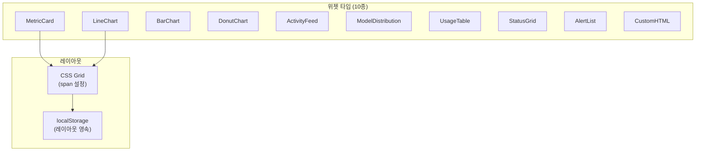

## 성능 최적화

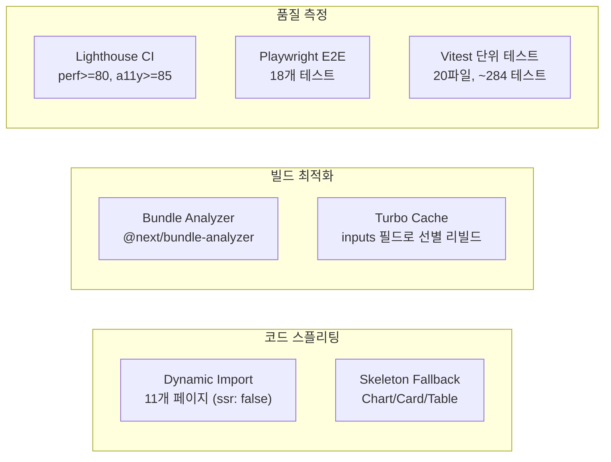

## 디자인 토큰 흐름

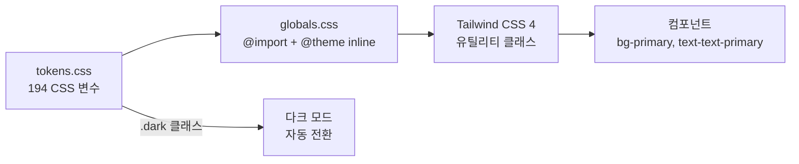

**토큰 접두사**: Wiki (`--wiki-*`), HMG (`--hmg-*`), Admin (`--admin-*`), ROI (`--roi-*`), User (`--user-*`), LLM Router (`--lr-*`), Desktop (`--dt-*`)

## 앱별 라우트 구조

### Admin (24 routes)
```
/ (Dashboard)
/usage, /statistics, /users, /settings
/providers, /models, /features, /prompts, /agents
/departments, /audit-logs, /sso
/login
/realtime (실시간 대시보드)
/notifications (알림 센터)
/workflows (워크플로우 빌더)
/custom-dashboard (커스텀 대시보드)
/roi/overview, /roi/adoption, /roi/productivity
/roi/analysis, /roi/organization, /roi/sentiment
/roi/reports, /roi/upload, /roi/settings
```

### User (5 routes)
```
/ (Chat), /docs, /ocr, /translation, /my
```

### LLM Router (10+ routes)
```
/ (Landing), /models, /docs, /playground, /compare
/dashboard, /api-keys, /usage, /settings, /login, /signup
```

### Desktop (5 routes)
```
/ (Chat), /agents, /swarm, /debate, /tools
```

### Mobile (4 tabs)
```
Chat, Assistants, History, Settings
```

### HMG (4 routes)
```
/ (Home), /publications, /guide, /dashboard
```

### Wiki (catch-all)
```
/ (home.md), /[...slug] (28 마크다운 페이지)
```

## CI/CD 파이프라인

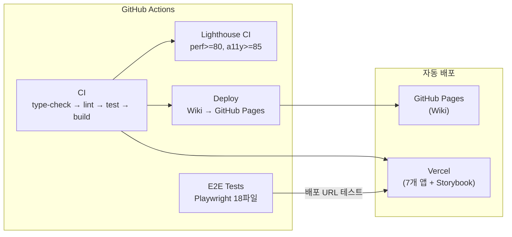

## 보안 아키텍처

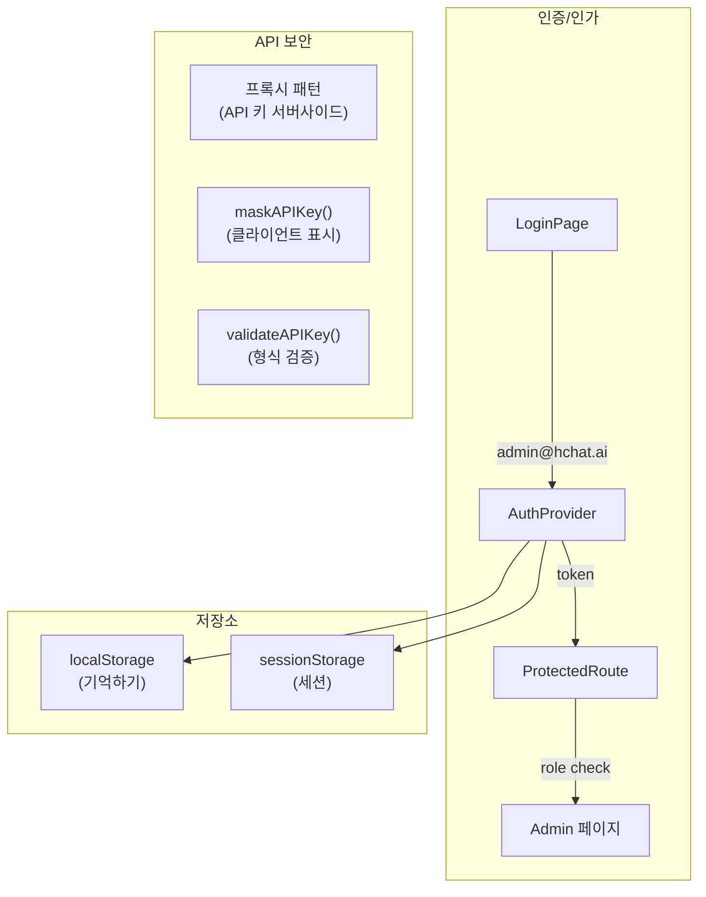
