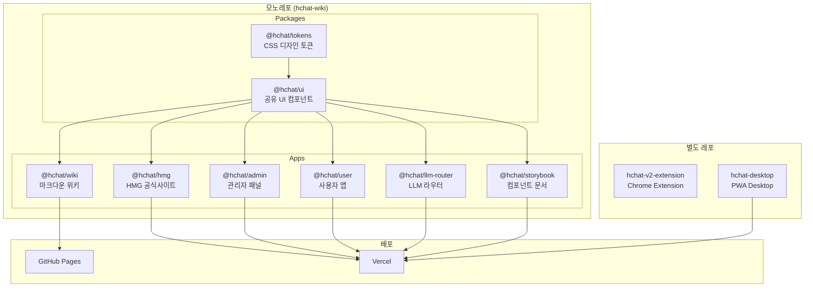
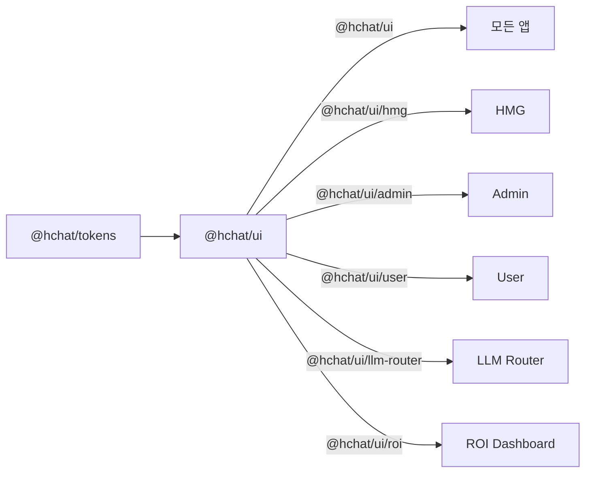
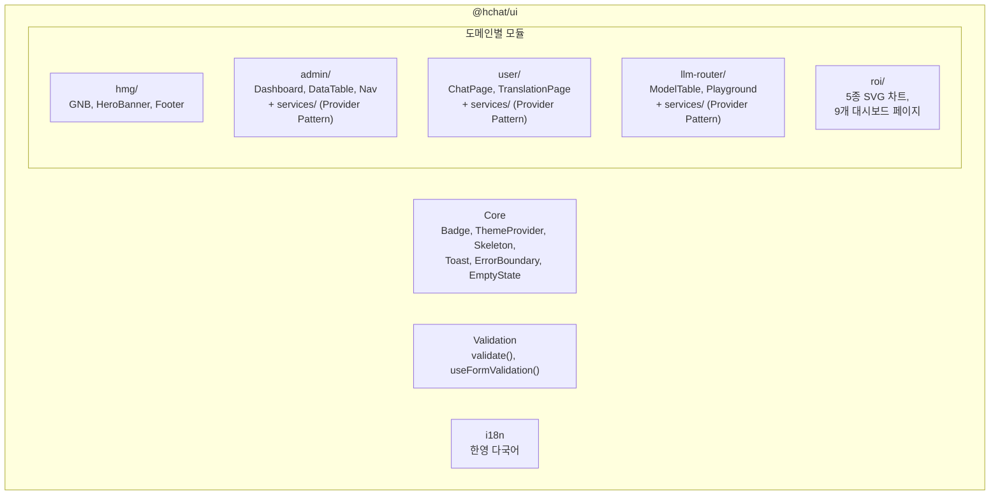
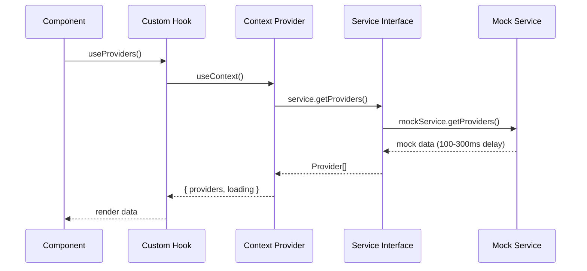
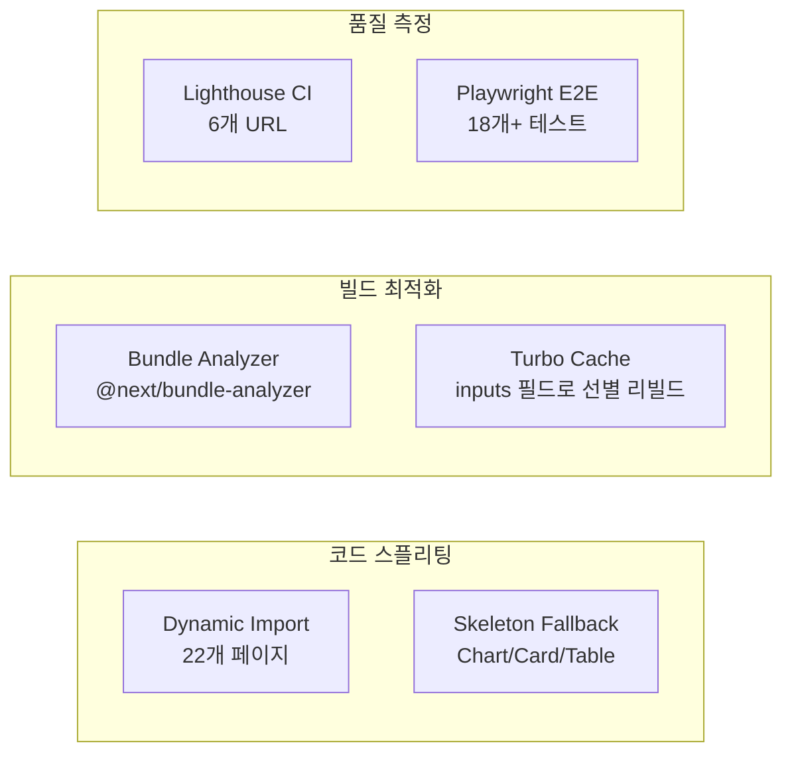
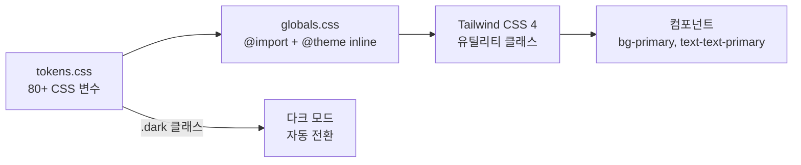
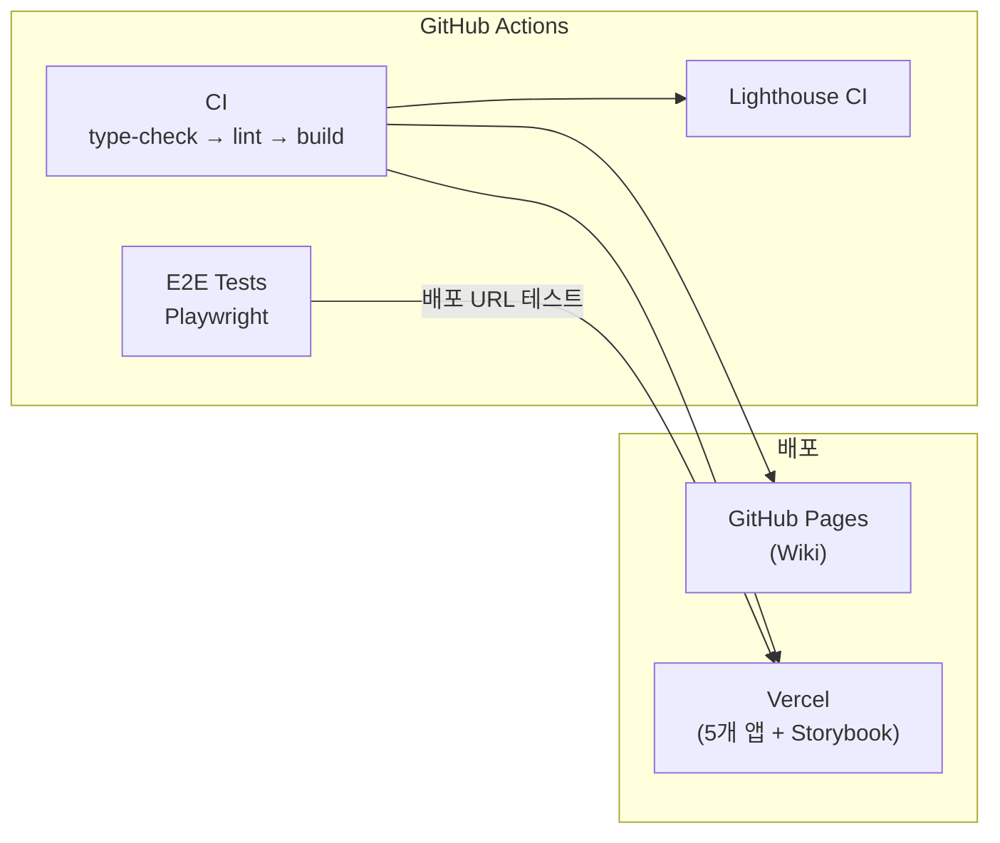

# H Chat 아키텍처

## 시스템 개요



## 패키지 의존성



## @hchat/ui 내부 구조



## 서비스 레이어 패턴

3개 앱(Admin, User, LLM Router)에 동일한 Provider Pattern 적용:



실제 API 전환 시 Mock Service를 API Service로 교체.

## 성능 최적화



## 디자인 토큰 흐름



## 앱별 라우트 구조

### Admin (17 routes)
```
/ (Dashboard)
/usage, /statistics, /users, /settings
/providers, /models, /features, /prompts, /agents
/departments, /audit-logs, /sso
/login
/roi/overview, /roi/adoption, /roi/productivity
/roi/analysis, /roi/organization, /roi/sentiment
/roi/reports, /roi/upload, /roi/settings
```

### User (5 routes)
```
/ (Chat), /translate, /docs, /ocr, /my-page
```

### LLM Router (10 routes)
```
/ (Landing), /dashboard, /models, /playground
/api-keys, /usage, /docs, /settings, /login, /register
```

### HMG (4 routes)
```
/ (Home), /publications, /guide, /dashboard
```

## CI/CD 파이프라인


