# H Chat AI Browser OS -- 종합분석서 (Comprehensive Analysis)

> **작성일**: 2026-03-15
> **분석 범위**: docs/ 폴더 전체 문서 (분석 2건, 구현 설계 11건, 개발 계획 6건, 서비스 기획 5건, 에코시스템 보정 4건 등)
> **대상 독자**: CTO, CPO, 경영진, 아키텍트, 투자 의사결정자
> **문서 성격**: 프로젝트 전체를 조감하는 종합 판단 보고서

---

## 목차

| # | 섹션 | 내용 |
|---|------|------|
| 1 | [Executive Summary](#1-executive-summary) | 프로젝트 핵심 1페이지 요약 |
| 2 | [프로젝트 배경 및 비전](#2-프로젝트-배경-및-비전) | 시장 동향, 문제 정의, 비전 선언 |
| 3 | [문서 체계 분석](#3-문서-체계-분석) | 28개 문서의 분류, 상호 관계, 커버리지 매트릭스 |
| 4 | [기술 아키텍처 종합분석](#4-기술-아키텍처-종합분석) | 4-Layer + Cross-cutting 상세, 기술 스택 평가 |
| 5 | [비즈니스 모델 분석](#5-비즈니스-모델-분석) | BMC, 수익 모델, GTM, 경쟁 분석 |
| 6 | [리스크 종합 평가](#6-리스크-종합-평가) | 기술/비즈니스/조직 리스크 통합, 대응 전략 |
| 7 | [강점-기회 분석](#7-강점-기회-분석) | SWOT 변형, 기존 자산 활용도 평가 |
| 8 | [GAP 분석](#8-gap-분석) | 현재 상태 vs 목표 상태, 14개 영역 매트릭스 |
| 9 | [핵심 성과 지표 체계](#9-핵심-성과-지표-체계) | KPI 대시보드 설계, 측정 방법론 |
| 10 | [결론 및 권고사항](#10-결론-및-권고사항) | 전략적 판단, 실행 우선순위, 의사결정 포인트 |

---

## 1. Executive Summary

### 프로젝트 한 줄 정의

**H Chat AI Browser OS는 현대차그룹 임직원 5만명이 Chrome 브라우저를 떠나지 않고 Side Panel의 AI와 대화하며 정보 탐색-분석-의사결정-실행을 완결하는 자율형 엔터프라이즈 AI 플랫폼이다.**

### 핵심 수치 대시보드

```
 투자        $645.5K        팀 규모       13명 (11+2)        개발 기간     30주
 손익분기     12~14개월      3년 ROI       220~270%           연간 절감     $550K
 24개월 ARR  $12.1M         타겟 사용자   50,000명           MARS 비용    $0.27/세션
 Smart DOM   $0.12/작업     테스트 목표   9,350+건           앱 수         10개 (기존)
```

### 4대 전략적 판단

| # | 판단 항목 | 결론 | 근거 |
|---|----------|------|------|
| 1 | **기술 타당성** | 조건부 YES | SAP Fiori Shadow DOM PoC 성공이 전제 조건 |
| 2 | **비즈니스 타당성** | YES | ROI 220-270%, $12.1M ARR 시나리오 합리적 |
| 3 | **구현 가능성** | YES | 기존 모노레포 자산(12개 모듈) 재활용으로 30% 단축 |
| 4 | **리스크 수준** | MEDIUM | Smart DOM 정확도와 MARS 비용이 최대 변수 |

### 권장 행동

**Sprint 0 착수를 승인하고, 2주 내 Go/No-Go 의사결정을 실시한다.** Sprint 0의 4대 검증 항목(SAP Fiori DOM 접근, Readability.js 통합, MARS 비용 시뮬레이션, PII 11패턴)이 모두 통과하면 Phase 1로 진행한다.

---

## 2. 프로젝트 배경 및 비전

### 2.1 시장 동향

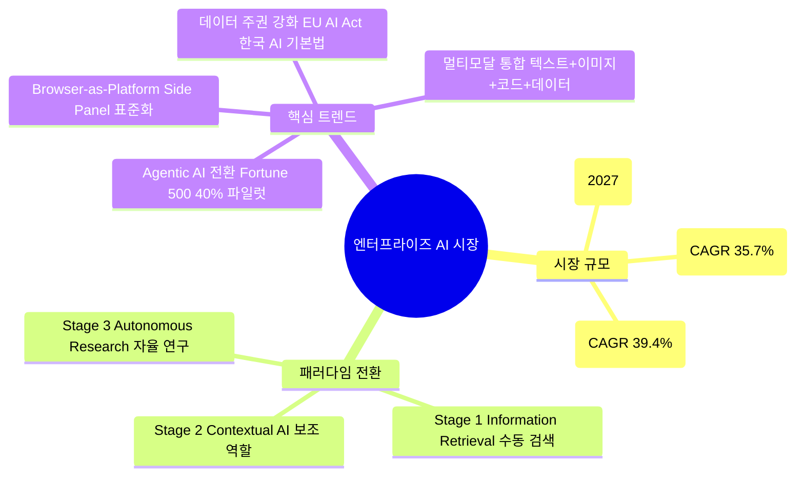

**핵심 인사이트**: AI 브라우저 시장은 CAGR 48.2%로 성장 중이며, 엔터프라이즈에서는 "단순 챗봇"에서 "자율형 에이전트"로의 패러다임 전환이 가속되고 있다. 한국 기업의 AI 도입 장벽 1위(데이터 보안 68%)와 2위(기존 시스템 연동 57%)를 정면으로 해결하는 솔루션은 시장에 부재하다.

### 2.2 문제 정의 -- 4대 업무 병목

| 문제 영역 | 현재 상황 (Pain Point) | 정량 지표 | H Chat 해결 방식 |
|-----------|----------------------|----------|-----------------|
| **컨텍스트 분절** | 평균 7개 이상 시스템 탭 전환 | 일 300회+ 탭 전환, 47분/일 | Side Panel 단일 인터페이스 |
| **정보 과부하** | 검색 결과 60-70% 노이즈 | 평균 23분/건 정보 탐색 | Smart DOM 노이즈 60-70% 제거 |
| **반복 업무** | 보고서, 데이터 수집 반복 작업 | 주당 8-12시간 낭비 | MARS 자율 에이전트 |
| **데이터 주권** | 퍼블릭 AI에 사내 데이터 입력 | 유출 위험 68% (설문 기반) | Zero Trust 원천 차단 |

**악순환 구조**: 이 4가지 문제는 독립적이지 않다. 컨텍스트 분절이 정보 과부하를 악화시키고, 정보 과부하가 반복 업무를 증가시키며, 반복 업무 과정에서 데이터 주권 리스크가 발생한다.

### 2.3 비전 선언

> **"가장 완벽한 사내 전용 AI 에이전트: 브라우저가 곧 새로운 업무 환경"**
>
> 임직원의 업무 시간 중 90% 이상이 Chrome 브라우저 안에서 흐른다. H Chat은 Chrome Extension의 Side Panel이라는 단일 접점에서 이 모든 시스템을 AI로 통합한다. 별도의 앱 설치도, 별도의 창 전환도 필요 없다.

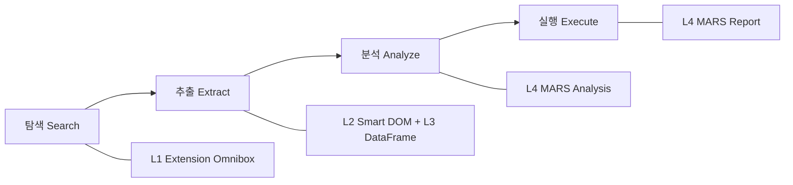

### 2.4 4대 핵심 태그

| 태그 | 의미 | 기술 기반 |
|------|------|----------|
| **Chrome Extension Only** | 별도 앱 불필요, 단일 접점 | MV3 Side Panel, Content Script |
| **Zero Trust** | 데이터 외부 유출 원천 차단 | PII Scrubbing, 블록리스트, 사내 Proxy |
| **MARS Multi-Agent** | 다중 에이전트 자율 리서치 | LangGraph + CrewAI 6단계 파이프라인 |
| **Dynamic Multi-Model** | 작업별 최적 LLM 동적 할당 | Orchestrator Node, 5~19개 모델 |

---

## 3. 문서 체계 분석

### 3.1 문서 분류 체계

전체 프로젝트 문서를 6개 카테고리로 분류한다.

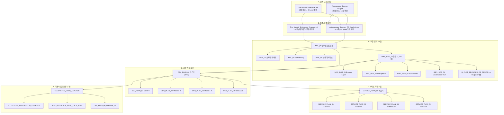

### 3.2 문서 커버리지 매트릭스

| 영역 | 전략/비전 | 기술 설계 | 개발 계획 | 비즈니스 | 리스크 | 테스트 | 커버리지 |
|------|---------|---------|---------|---------|-------|-------|---------|
| L1 Hybrid Extension | A | A | A | B | A | A | **완전** |
| L2 Smart DOM | A | A | A | B | A | B | **완전** |
| L3 DataFrame Engine | B | A | A | C | B | B | **양호** |
| L4 MARS Agent | A | A | A | B | A | B | **완전** |
| Dynamic Multi-Model | A | A | A | B | B | C | **양호** |
| Self-Healing | A | A | A | C | A | B | **양호** |
| Zero Trust 보안 | A | A | B | B | A | B | **양호** |
| 소버린 데이터 | A | A | A | C | B | C | **양호** |
| 배포 전략 | A | B | A | A | B | C | **양호** |
| 비즈니스 모델 | B | - | - | A | A | - | **양호** |
| 팀 구성/조직 | C | - | A | B | B | B | **보통** |
| 운영/모니터링 | C | B | B | C | B | B | **보통** |
| 사용자 교육/변화관리 | D | - | - | C | B | - | **미흡** |
| 법규/컴플라이언스 | C | B | - | C | C | - | **미흡** |

> A=충분, B=양호, C=부족, D=미흡, -=미다룸

### 3.3 문서 총 현황

| 카테고리 | 문서 수 | 총 라인수 (추정) | 주요 산출물 |
|---------|--------|----------------|-----------|
| 원본 자료 (PDF) | 2 | - | 비전 + 기술 방향 |
| 심층 분석 | 2 | ~880줄 | Todo List + 코드 매핑 |
| 구현 설계 | 11 | ~4,500줄 | 아키텍처 + 모듈 설계 |
| 개발 계획 | 6 | ~2,600줄 | 스프린트 계획 + Gantt |
| 서비스 기획 | 5 | ~2,500줄 | BMC + 기능 명세 + KPI |
| 에코시스템 보정 | 4 | ~1,500줄 | 리스크 + 통합 전략 |
| **합계** | **~30건** | **~12,000줄** | |

---

## 4. 기술 아키텍처 종합분석

### 4.1 4-Layer Stack 개요

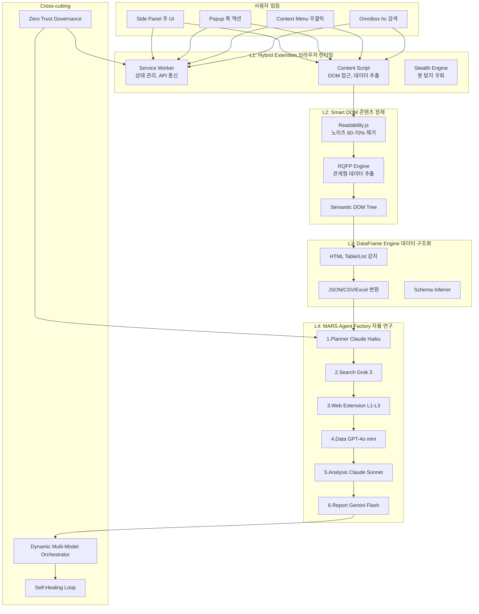

### 4.2 각 레이어 상세 평가

#### L1: Hybrid Chrome Extension

| 평가 항목 | 판정 | 근거 |
|----------|------|------|
| **기술 성숙도** | HIGH | Chrome MV3는 안정 API, 기존 `apps/extension/` 운영 중 |
| **차별화 가치** | VERY HIGH | 세션 충실도 + 봇 탐지 우회 = 사내 시스템 접근의 핵심 |
| **구현 난이도** | MEDIUM | Service Worker 5분 비활성 종료, CSP 제약 관리 필요 |
| **리스크** | MEDIUM | CWS 심사 1-3일 소요, Manifest V3 API 제한 변동 |

**핵심 구성 요소**: Side Panel(`chrome.sidePanel`), Popup(`chrome.action`), Context Menu(`chrome.contextMenus`), Background SW(`chrome.runtime`), Content Script(DOM API), Omnibox(`chrome.omnibox`), Offscreen Doc(`chrome.offscreen`)

#### L2: Smart DOM (Page Intelligence)

| 평가 항목 | 판정 | 근거 |
|----------|------|------|
| **기술 성숙도** | MEDIUM | Readability.js 검증됨, RQFP는 도메인별 최적화 필요 |
| **차별화 가치** | VERY HIGH | Vision 대비 88% 비용 절감($1.00 vs $0.12), 14배 속도 향상 |
| **구현 난이도** | HIGH | SAP Fiori Shadow DOM, SPA 동적 DOM, iframe 중첩 처리 |
| **리스크** | HIGH | SAP Fiori PoC 실패 시 프로젝트 Go/No-Go에 직접 영향 |

**사이트 유형별 난이도**:

| 사이트 유형 | 난이도 | 접근 전략 |
|-----------|--------|---------|
| 정적 HTML (위키, 블로그) | LOW | Readability.js 단독 |
| SPA (React/Angular) | MEDIUM | MutationObserver + 안정화 대기 |
| Shadow DOM (SAP Fiori) | HIGH | `chrome.scripting.executeScript` + `world: 'MAIN'` |
| iframe 중첩 (ERP) | HIGH | Cross-origin 제약 → CDP Fallback |
| 동적 렌더링 (Charts) | VERY HIGH | Canvas/SVG 데이터 추출 → Vision Fallback |

#### L3: DataFrame Engine

| 평가 항목 | 판정 | 근거 |
|----------|------|------|
| **기술 성숙도** | MEDIUM | 기존 SheetJS 활용 가능, 자동 감지는 신규 |
| **차별화 가치** | HIGH | 웹 전체를 구조화 데이터셋으로 변환 — 경쟁사 미보유 |
| **구현 난이도** | MEDIUM | 테이블 구조 다양성, 스키마 추론 정확도 |
| **리스크** | LOW | 독립 모듈, 다른 레이어와 낮은 결합도 |

**신규 모듈 4개**: `HtmlTableDetector`, `DataFrameConverter`, `SchemaInferrer`, `DataFrameWorker` (~1,150줄)

#### L4: MARS Agent Factory

| 평가 항목 | 판정 | 근거 |
|----------|------|------|
| **기술 성숙도** | LOW-MEDIUM | LangGraph + CrewAI 결합은 검증 필요 |
| **차별화 가치** | VERY HIGH | 6단계 자율 리서치 파이프라인 = 핵심 경쟁력 |
| **구현 난이도** | HIGH | 에이전트 간 상태 관리, HITL 통합, 비용 통제 |
| **리스크** | HIGH | 비용 폭증, 환각, 에이전트 교착 상태 |

**MARS 1회 리서치 비용 분석 ($0.27/세션)**:

| 단계 | 모델 | 토큰 | 비용 |
|------|------|------|------|
| 1. Planner | Claude Haiku | 2K/1K | $0.003 |
| 2. Search | Grok 3 | 1K/0.5K | $0.001 |
| 3. Web (x5 URL) | Extension L1-L3 | 로컬 | $0.00 |
| 4. Data | GPT-4o mini | 8K/2K | $0.008 |
| 5. Analysis | Claude Sonnet | 10K/3K | $0.10 |
| 6. Report | Gemini Flash | 5K/3K | $0.005 |
| 오버헤드 | - | 캐싱, 재시도 | $0.15 |
| **합계** | | | **~$0.27** |

### 4.3 Cross-cutting 시스템 평가

#### Dynamic Multi-Model Orchestrator

| 프로바이더 | 모델 | 역할 | 비용 등급 |
|----------|------|------|---------|
| Anthropic | Claude Opus 4.6 | Reasoning, 전략 기획 | $$$$ |
| OpenAI | GPT-5.2 | 장문 요약, 보고서 | $$$ |
| Google | Gemini 2.5 | 웹 검색, 팩트체크 | $$ |
| xAI | Grok 3 | Fast Ops, 번역 | $ |
| Local | Nano (on-device) | 오프라인, 프라이버시 | Free |

**Orchestrator 모델 선택 점수**:
```
score = quality_score * 0.4 + latency_score * 0.3 + cost_score * 0.2 + availability_score * 0.1
```
- Rate Limiter의 `getWaitTime()` 연동: 대기 30초 이상 모델 자동 제외
- Circuit Breaker: CLOSED → OPEN (에러율 30% 초과) → HALF-OPEN (30초 후)

#### Self-Healing System

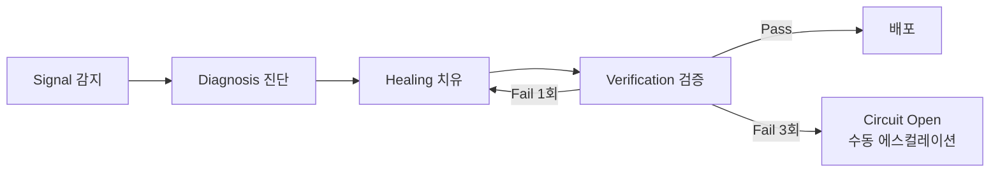

**3-Strike Circuit Breaker 정책**:
- `MAX_HEAL_ATTEMPTS`: 3회
- `COOLDOWN_BASE_SEC`: 300초 (지수 백오프: 5min → 15min → 45min)
- `CIRCUIT_OPEN_DURATION_SEC`: 3600초 (1시간)
- 목표: 복구 시간 55-70% 단축, 구문 오류 수정 85-90%

#### Zero Trust Security Governance

| 보안 계층 | 구성 요소 | 상태 |
|----------|---------|------|
| PII Scrubbing | 11개 패턴 (주민번호~건강보험번호) | 7개 구현 → 11개 확장 필요 |
| 블록리스트 | 20도메인 + 6와일드카드 패턴 | **충족** |
| L1~L4 감사 로그 | SHA-256 해시 체인, INSERT ONLY | 신규 구현 필요 |
| 사내 프록시 | DLP, Rate Limiting, 비용 관리 | 신규 구현 필요 |
| 에이전트 권한 | OPA 정책 엔진 + Vault 비밀 관리 | 신규 구현 필요 |

### 4.4 기술 스택 종합 평가

| 계층 | 기술 | 성숙도 | 대안 | 평가 |
|------|------|--------|------|------|
| L1 | Chrome Extension MV3 | 안정 | Edge Add-on | 적합 |
| L1 | Playwright CDP | 안정 | Puppeteer | 적합 |
| L2 | Readability.js | 검증됨 | Mozilla 라이브러리 | 적합 |
| L2 | RQFP 알고리즘 | 신규 | 커스텀 구현 필요 | 리스크 |
| L3 | Pandas (서버) / JSON (클라이언트) | 안정 | DuckDB | 적합 |
| L4 | LangGraph 0.2 | 초기 | AutoGen, DSPy | 적합 |
| L4 | CrewAI 0.5 | 초기 | LangGraph 단독 | 적합 |
| Cross | OpenTelemetry | 안정 | Datadog 직접 | 적합 |
| Cross | Tree-sitter | 안정 | AST 파싱 대안 없음 | 적합 |
| Cross | pgvector | 안정 | Qdrant, Pinecone | 적합 |
| Infra | OPA | 안정 | Cedar (AWS) | 적합 |
| Infra | HashiCorp Vault | 안정 | AWS Secrets Manager | 적합 |
| Infra | PostgreSQL 16 + Redis 7 | 안정 | - | 적합 |

---

## 5. 비즈니스 모델 분석

### 5.1 비즈니스 모델 캔버스 (BMC) 요약

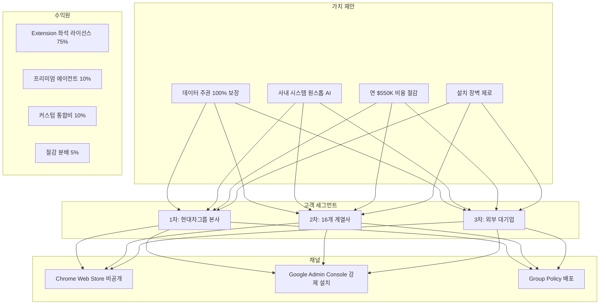

### 5.2 3-Tier 가격 구조

| | **Basic** $8/월 | **Pro** $18/월 | **Enterprise** $30/월 |
|---|---|---|---|
| AI 모델 | GPT-4o-mini, Haiku | + GPT-4o, Sonnet | + Opus, o3, 전체 |
| 일 쿼리 | 50회 | 200회 | 무제한 |
| 에이전트 | 기본 Q&A | + 리서치, 문서 요약 | + MARS 풀스택 |
| 배포 방식 | CWS 수동 설치 | + Admin Console | + Forcelist 강제 |
| SLA | 99.5% | 99.9% | 99.95% |

### 5.3 ARR 전망

| 시점 | 사용자 | 티어 분포 (B/P/E) | 월 매출 | **ARR** |
|------|--------|-------------------|---------|---------|
| 6개월 (Beta) | 2,000명 | 60/30/10 | $26K | **$312K** |
| 12개월 (GA) | 8,000명 | 40/40/20 | $128K | **$1.54M** |
| 18개월 (Scale) | 25,000명 | 30/40/30 | $470K | **$5.64M** |
| 24개월 (Expand) | 50,000명 | 25/40/35 | $1.01M | **$12.1M** |

### 5.4 Go-To-Market 3단계

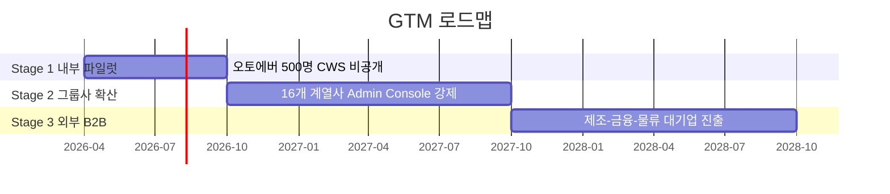

| Stage | 기간 | 대상 | 배포 방식 | 성공 기준 |
|-------|------|------|----------|---------|
| **1. 파일럿** | 0-6M | 오토에버 500명 | CWS 수동 설치 | DAU 55%+, 파싱 80%+ |
| **2. 확산** | 6-18M | 16개 계열사 25,000석 | ExtensionInstallForcelist | 설치율 95%+, DAU 60%+ |
| **3. 외부** | 18-30M | 외부 대기업 50,000+석 | 고객사 Chrome 정책 | ARR $10M+, 고객 10개+ |

### 5.5 경쟁 포지셔닝

| 차원 | ChatGPT Atlas | Perplexity Comet | Arc Search | eesel AI | **H Chat** |
|------|-------------|-----------------|------------|----------|-----------|
| 데이터 주권 | 옵트아웃 필요 | 제한적 | 없음 | 부분적 | **Zero Trust** |
| 사내 시스템 | API 연동 필요 | 불가 | 불가 | Slack/Wiki | **직접 접근** |
| 배포 | 앱 스토어 | 앱 스토어 | 앱 스토어 | 웹 | **강제 일괄** |
| 에이전트 | 중간 | 중간 | 낮음 | 낮음 | **MARS 자율** |
| 비용/작업 | ~$1.00 | ~$0.80 | N/A | $0.50 | **$0.12** |

### 5.6 4-Layer Moat (경쟁 해자)

| Layer | 해자 | 모방 난이도 | 구축 기간 |
|-------|------|-----------|---------|
| 1. 배포 | ExtensionInstallForcelist 강제 정책 | 높음 | 3개월 |
| 2. 연동 | 브라우저 DOM 직접 접근 (API 불필요) | 매우 높음 | 12개월 |
| 3. 지능 | L1~L4 수직 통합 파이프라인 | 극히 높음 | 18개월+ |
| 4. 보안 | Zero Trust 사내망 격리 | 높음 | 6개월 |

---

## 6. 리스크 종합 평가

### 6.1 통합 리스크 레지스터

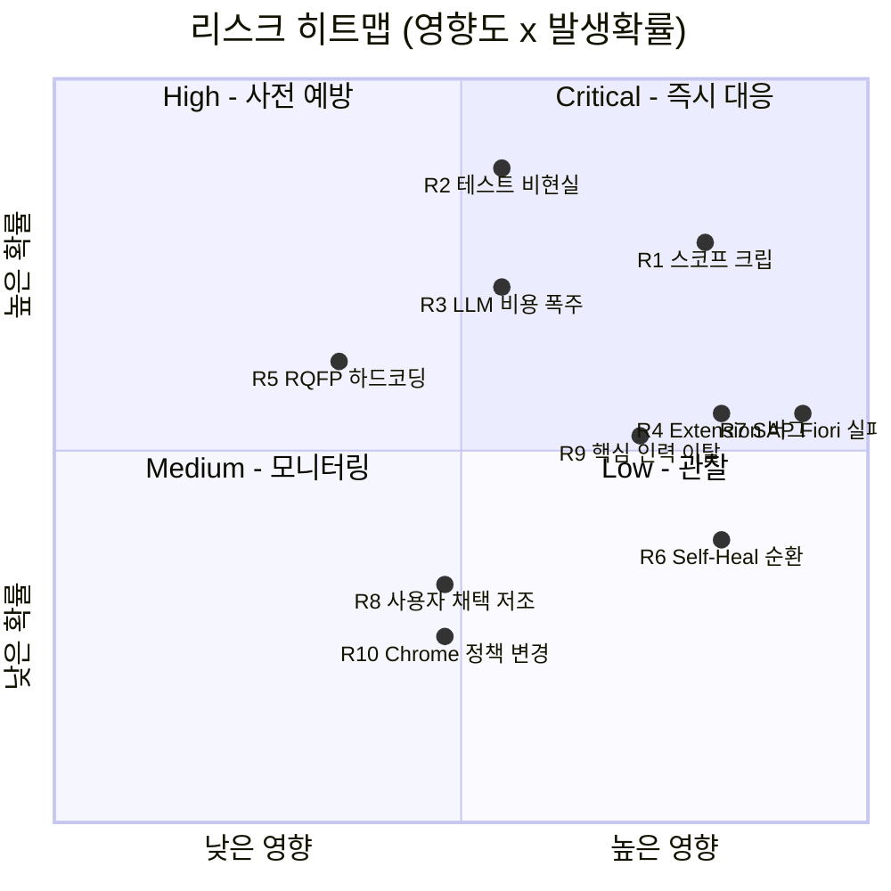

### 6.2 리스크 상세 및 대응 전략

| # | 리스크 | 영향 | 확률 | 등급 | 대응 전략 |
|---|--------|------|------|------|---------|
| R1 | **스코프 크립** -- Browser OS 30주 + PWA 동시 진행 | 높음 | 높음 | **Critical** | Phase Gate Go/No-Go, "Parking Lot" 백로그 격리 |
| R2 | **테스트 목표 비현실** -- 주당 483건 (기존 대비 9.8배) | 중간 | 매우 높음 | **Critical** | 9,350+건으로 현실 보정, TDD 범위 Core Path 한정 |
| R3 | **LLM 비용 폭주** -- $36K 예산, 개발/테스트 과다 호출 | 중간 | 높음 | **High** | Mock LLM 80% + 실제 20%, 주당 $1,500 Hard Cap |
| R4 | **Extension PRISM 버그** -- CRIT 2건 + HIGH 4건 재현 | 매우 높음 | 중간 | **Critical** | PR 체크리스트 의무화, CI gate 차단 |
| R5 | **RQFP 가중치 하드코딩** -- 도메인별 최적값 상이 | 낮음 | 높음 | **Medium** | AutoResearch 기반 적응형 가중치, EMA 조정 |
| R6 | **Self-Healing 순환 장애** -- 잘못된 패치 무한 루프 | 매우 높음 | 중간 | **Critical** | 3-Strike Circuit Breaker, 쿨다운 + 에스컬레이션 |
| R7 | **SAP Fiori DOM 접근 실패** -- 프로젝트 Go/No-Go | 매우 높음 | 중간 | **Critical** | Sprint 0 Day 1 최우선 검증, CDP Fallback 준비 |
| R8 | **사용자 채택 저조** -- 변화 저항, 기존 도구 관성 | 중간 | 낮음 | **Medium** | Forcelist 강제 설치, 챔피언 프로그램, Side Panel UX |
| R9 | **핵심 인력 이탈** -- AI 인재 경쟁 심화 | 높음 | 중간 | **High** | RSU 인센티브, Bus Factor 3+, 지식 문서화 |
| R10 | **Chrome 정책 변경** -- MV3 이후 API 제한 | 중간 | 낮음 | **Low** | MV3 최신 스펙 준수, Edge 호환 준비 |

### 6.3 리스크 대응 비용 추정

| 대응 활동 | 일회성 비용 | 지속 비용 (월) | 효과 |
|----------|-----------|-------------|------|
| PRISM 체크리스트 CI Gate | $2K | $0 | R4 Critical 방지 |
| Mock LLM + 비용 대시보드 | $5K | $0.5K | R3 비용 60% 절감 |
| Self-Healing Circuit Breaker | $3K | $0 | R6 순환 장애 차단 |
| 테스트 목표 재설정 | $0 | $0 | R2 팀 모럴 보호 |
| SAP Fiori PoC (Sprint 0) | $5K | $0 | R7 Go/No-Go 근거 |
| **합계** | **$15K** | **$0.5K** | |

---

## 7. 강점-기회 분석

### 7.1 SWOT 매트릭스

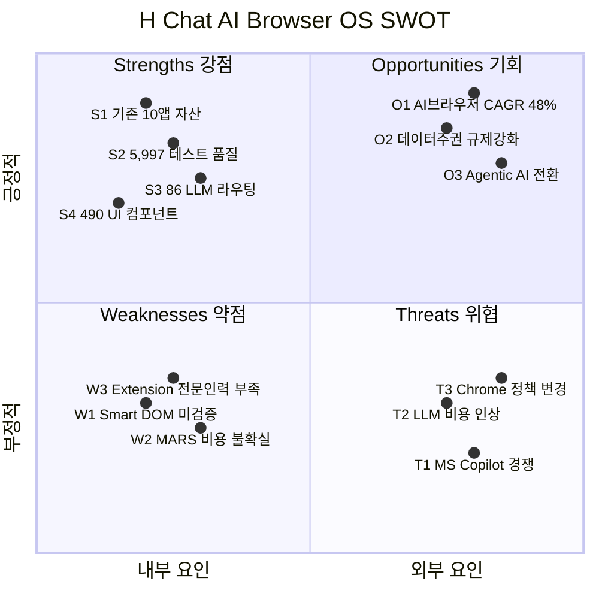

### 7.2 강점 상세 분석

| # | 강점 | 정량 근거 | 전략적 활용 |
|---|------|---------|-----------|
| S1 | **10개 앱 프로덕션 자산** | 10앱, Phase 101 완료, 90% 커버리지 | Extension, Admin, Desktop 컴포넌트 재활용 |
| S2 | **5,997개 테스트** | 239 파일, 89.24% stmts | Self-Healing 검증 인프라로 직접 활용 |
| S3 | **86개 LLM 모델 라우팅** | `apps/llm-router/` 운영 중 | Dynamic Multi-Model Orchestrator 기반 |
| S4 | **490 UI 컴포넌트** | @hchat/ui 패키지 | L1 Extension UI 즉시 구축 |
| S5 | **Docker 인프라** | PG16 + Redis 7 운영 중 | Multi-Tenant RLS 확장 |
| S6 | **보안 기반** | RBAC, SSO, JWT, PII 7패턴 | Zero Trust 확장의 출발점 |

### 7.3 기존 자산 활용도 평가

| 기존 모듈 | Browser OS 활용 | 활용도 |
|----------|----------------|-------|
| `useCircuitBreaker.ts` | Multi-Model Fallback 확장 | **직접 재사용** |
| `useHealthMonitor.ts` | Self-Healing 헬스체크 | **직접 재사용** |
| `sanitize.ts` | PII 7→11패턴 확장 | **확장 활용** |
| `ServiceFactory.ts` | Dynamic Model Registry Mock/Real 전환 | **직접 재사용** |
| `apps/ai-core/` | MARS 백엔드 베이스 | **확장 활용** |
| `apps/extension/` | L1 Extension Shell | **확장 활용** |
| `workerUtils.ts` | DataFrame Worker | **직접 재사용** |
| `mocks/handlers.ts` | MARS/DataFrame 엔드포인트 | **확장 활용** |
| `useOfflineQueue.ts` | HITL 승인 대기 큐 | **직접 재사용** |
| `EventBusProvider.tsx` | Agent 간 통신 버스 | **직접 재사용** |
| `schemas/` | DataFrame 타입 검증 | **확장 활용** |
| `docker/init.sql` | Multi-Tenant RLS 베이스 | **확장 활용** |

**총 12개 모듈 재활용 → 개발 기간 약 30% 단축 효과**

### 7.4 기회 활용 전략

| 기회 | 활용 전략 | 기대 효과 |
|------|---------|---------|
| AI 브라우저 시장 CAGR 48.2% | First-mover로 사내 전용 시장 선점 | 경쟁사 진입 전 락인 효과 |
| 데이터 주권 규제 강화 | Zero Trust를 마케팅 핵심 메시지로 | 보안 중시 기업의 자연 수요 |
| Agentic AI 전환 | MARS 6단계 파이프라인으로 차별화 | 단순 챗봇 대비 압도적 가치 |
| ExtensionInstallForcelist | 설치율 95%+ 달성으로 채택 장벽 제거 | 기존 SaaS 대비 2.5배 실사용률 |

---

## 8. GAP 분석

### 8.1 전체 GAP 매트릭스 (14개 영역)

| # | 영역 | 현재 상태 | 목표 상태 (PDF 요구) | GAP 크기 | 우선순위 |
|---|------|---------|-------------------|---------|---------|
| 1 | **L2 Smart DOM** | 기본 sanitize.ts | Readability.js, RQFP, Shadow DOM | **대** | P0 |
| 2 | **L3 DataFrame** | SheetJS Excel만 | HTML 테이블/리스트 자동 감지→JSON | **대** | P0 |
| 3 | **PII Scrubbing** | 7패턴 | 11패턴 | 중 | P0 |
| 4 | **Lens View UX** | 없음 | 87%/95%/85% 업무 절감 | **대** | P0 |
| 5 | **L4 MARS Agent** | 단일 연구 API | LangGraph 6단계, HITL | **대** | P1 |
| 6 | **Multi-Tenant** | 없음 | PostgreSQL RLS | **대** | P1 |
| 7 | **Multi-Model** | 3프로바이더 9모델 | 5+ 프로바이더, Dynamic 라우팅 | 중 | P1 |
| 8 | **감사 로그** | 토큰 추적만 | L1~L4 불변 감사 로그 | 중 | P1 |
| 9 | **HITL** | 없음 | L3+ 승인 게이트 | 중 | P1 |
| 10 | **L1 Extension** | MV3 기본 | Omnibox, Context Menu 3-depth | 중 | P1 |
| 11 | **배포** | CWS Unlisted | ExtensionInstallForcelist | 중 | P2 |
| 12 | **가격 모델** | KRW 내부용 | USD 3-Tier, B2B SaaS | 중 | P2 |
| 13 | **Self-Healing** | useCircuitBreaker 훅만 | AI DOM 변경 감지 + 자동 복구 | 중 | P2 |
| 14 | **블록리스트** | 20도메인 + 6패턴 | 동일 | **충족** | -- |

### 8.2 GAP 해소 로드맵

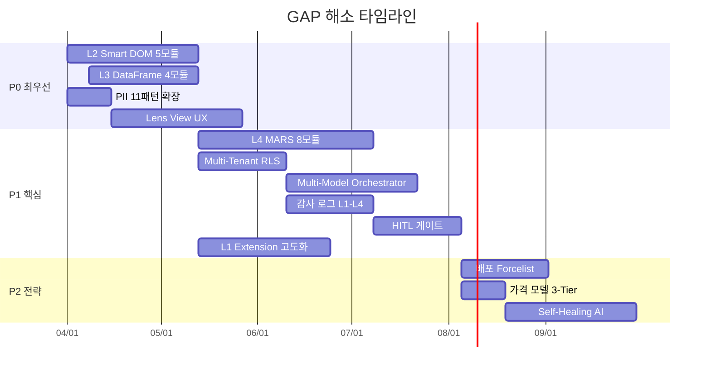

### 8.3 신규 개발 모듈 총괄 (19개)

| 레이어 | 모듈 수 | 주요 모듈 | 예상 규모 |
|--------|--------|---------|---------|
| L2 Smart DOM | 5 | SmartDomExtractor, RqfpEngine, ShadowDomTraverser, SapFioriAdapter, MutationStabilizer | ~1,500줄 |
| L3 DataFrame | 4 | HtmlTableDetector, DataFrameConverter, SchemaInferrer, DataFrameWorker | ~1,150줄 |
| L4 MARS Agent | 8 | MarsPlanner, MarsSearchAgent, MarsWebAgent, MarsDataAgent, MarsAnalysisAgent, MarsReportAgent, HitlGate, AgentOrchestrator | ~2,700줄 (Python) |
| 인프라 | 2 | DynamicModelRegistry, MultiTenantIsolator | ~750줄 |
| **합계** | **19** | | **~6,100줄** |

---

## 9. 핵심 성과 지표 체계

### 9.1 KPI 계층 구조

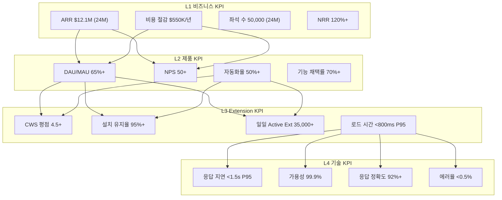

### 9.2 단계별 KPI 대시보드

| KPI | Sprint 0 | Alpha (W10) | Beta (W18) | GA (W30) | Scale (12M) |
|-----|---------|-------------|------------|---------|------------|
| **Smart DOM 정확도** | PoC | 80%+ | 90%+ | 95%+ | 97%+ |
| **MARS 비용/세션** | 시뮬레이션 | -- | $0.27 | $0.20 | $0.15 |
| **PII 탐지율** | 11패턴 | 95%+ | 99%+ | 99.9%+ | 99.9%+ |
| **DAU** | -- | 50 | 500+ | 2,000+ | 5,200+ |
| **SLA** | -- | -- | 99.5% | 99.9% | 99.9% |
| **Self-Healing 복구율** | -- | -- | 50% | 70% | 85% |
| **NPS** | -- | 35+ | 40+ | 50+ | 55+ |
| **CWS 평점** | -- | -- | 4.0+ | 4.5+ | 4.5+ |
| **자동화율** | -- | -- | 25%+ | 50%+ | 60%+ |
| **LLM 비용/쿼리** | -- | -- | $0.05 | $0.03 | $0.02 |
| **E2E 테스트** | +10건 | +20건 | +30건 | +50건 | 80+ |

### 9.3 Go/No-Go 판정 기준

| 시점 | Go 조건 | No-Go 시 대응 |
|------|---------|---------------|
| **Sprint 0 (2주)** | 핵심 유스케이스 3개 라이브 시연 + SAP Fiori PoC 성공 | 기술 스택 재검토, 범위 축소 |
| **Alpha (10주)** | 50명 NPS 35+, 정확도 80%+, CWS 게시 완료 | 2주 집중 개선 스프린트 |
| **Beta (18주)** | DAU 55%+, 자동화 25%+, 보안 감사 통과 | GA 4주 연기 |
| **GA (30주)** | SLA 99.9%, 부하 테스트 통과, NPS 45+ | 소프트 런치 전환 |
| **12개월** | ARR $1M+, 계열사 5개+ 도입 | GTM 전략 피벗 |

### 9.4 KPI 측정 방법론

| KPI 유형 | 수집 방법 | 저장소 | 대시보드 |
|---------|---------|-------|---------|
| 비즈니스 | 월별 재무 리포트 | PostgreSQL | Grafana |
| 제품 | Extension 이벤트 로깅 | PostgreSQL + Redis | Grafana |
| Extension 특화 | Chrome Extension API + 서버 집계 | PostgreSQL | 전용 Admin |
| 기술 | OpenTelemetry + Prometheus | TimescaleDB | Grafana |
| 비용 | LLM API 콜 태깅 | PostgreSQL | 비용 대시보드 |

### 9.5 Lens View 비용 절감 지표

| 업무 유형 | Before | After | 절감률 | 연간 환산 |
|----------|--------|-------|------|---------|
| 정보 탐색 (경쟁사 분석) | 23분 | 3분 | **87%** | $120K |
| 데이터 수집 (SAP 재고) | 4시간 | 10분 | **95%** | $200K |
| 보고서 작성 (회의록) | 5시간 | 30분 | **85%** | $150K |
| IT 인시던트 대응 | 2시간 | 36분 | **70%** | $80K |
| **합계** | | | | **$550K** |

---

## 10. 결론 및 권고사항

### 10.1 종합 판단

```
┌─────────────────────────────────────────────────────────────┐
│                   종합 판단: GO (조건부)                      │
│                                                             │
│  기술 타당성    ████████░░ 80%  SAP Fiori PoC 전제          │
│  비즈니스 타당  █████████░ 90%  ROI + ARR 합리적            │
│  구현 가능성    ████████░░ 80%  12개 모듈 재활용             │
│  팀 역량       ███████░░░ 70%  Extension 전문가 보강 필요    │
│  시장 타이밍    █████████░ 90%  AI 브라우저 시장 급성장       │
│  리스크 수준    ██████░░░░ 60%  MEDIUM (관리 가능)           │
│                                                             │
│  종합 점수: 78/100 → Sprint 0 착수 승인 권고                │
└─────────────────────────────────────────────────────────────┘
```

### 10.2 전략적 권고사항 (5대 권고)

| # | 권고사항 | 근거 | 긴급도 |
|---|---------|------|-------|
| **1** | **Sprint 0 즉시 착수** -- 2주 내 4대 기술 검증 실시 | SAP Fiori PoC가 전체 프로젝트 타당성 좌우 | 즉시 |
| **2** | **레이어 확장 모델 채택** -- hchat-pwa 위에 Browser OS 레이어 | 62K+ LOC, 1,479 테스트 재활용 vs 재작성 비용 | Sprint 0 |
| **3** | **테스트 목표 현실화** -- 14,500건 → 9,350건 | 주당 483건은 기존 대비 9.8배, 비현실적 | Sprint 0 |
| **4** | **Extension 전문가 1명 조기 확보** -- FE 3명 중 1명은 MV3 전문 | PRISM Critical 버그 재현 방지, Service Worker 전문성 | Phase 1 |
| **5** | **LLM Mock 전략 선제 구축** -- 테스트 비용 $0 달성 | $36K 예산 중 개발/테스트 소비 통제 필수 | Sprint 0 |

### 10.3 실행 우선순위 매트릭스

```
[즉시 + 중요 -- Sprint 0] ━━━━━━━━━━━━━━━━━━━━━━━━
  1. SAP Fiori Shadow DOM 접근 검증 (Go/No-Go 결정)
  2. Readability.js 통합 테스트 (5개 사내 사이트)
  3. PII 11패턴 정규식 구현 + 테스트
  4. MARS 비용 시뮬레이션 ($45K/월)
  5. PRISM 체크리스트 CI Gate 구축

[중요 + 계획적 -- Phase 1-2] ━━━━━━━━━━━━━━━━━━━━━
  6. Smart DOM 고도화 (SPA, Shadow DOM)
  7. DataFrame Engine (HTML→JSON 변환)
  8. MARS 멀티 에이전트 (LangGraph + CrewAI)
  9. Dynamic Multi-Model Orchestrator
  10. HITL 워크플로우 + Teams 연동

[전략적 투자 -- Phase 3-4] ━━━━━━━━━━━━━━━━━━━━━━━
  11. Self-Healing 85-90% 복구율
  12. Enterprise Governance + 보안 심사
  13. ExtensionInstallForcelist 강제 배포
  14. 외부 B2B SaaS 가격 모델
  15. Karpathy AutoResearch 자율 실험 루프
```

### 10.4 투자 의사결정 요약

| 의사결정 포인트 | 시점 | 투자 규모 | 판단 기준 |
|---------------|------|---------|---------|
| **Sprint 0 착수** | 즉시 | $37.4K | 본 종합분석서 기반 승인 |
| **Phase 1 진행** | Week 2 | $337.5K (누적) | Sprint 0 Go/No-Go 4항목 통과 |
| **Phase 3 진행** | Week 18 | $608K (누적) | DAU 55%+, 보안 감사 통과 |
| **GA 출시** | Week 30 | $645.5K (전체) | SLA 99.9%, NPS 45+ |
| **Scale 확산** | Week 30+ | 운영비 $100K/년 | ARR $1M+ 달성 |

### 10.5 예상 투자 회수 시나리오

| 시나리오 | 누적 투자 | 누적 절감 | 순 ROI | 확률 |
|---------|---------|---------|-------|------|
| **낙관 (Best)** | $645.5K | $2,750K (3년) | **326%** | 20% |
| **기본 (Base)** | $645.5K | $2,200K (3년) | **241%** | 50% |
| **보수 (Conservative)** | $745.5K (+$100K 지연) | $1,650K (3년) | **121%** | 25% |
| **비관 (Worst)** | $800K (+$155K 스코프) | $825K (3년) | **3%** | 5% |

### 10.6 최종 성공 정의

> **H Chat이 성공한 상태란**:
> - 현대차그룹 임직원의 Chrome 브라우저에 기본 탑재 (Extension 설치율 95%+)
> - 일상 업무 도구로 자리잡아 (DAU 70%+)
> - 연간 $550K 이상의 비용을 절감하며 (자동화율 60%+)
> - 데이터 주권을 완벽히 보장하면서 (보안 사고 0건)
> - 24개월 내 ARR $12M을 달성하고
> - Chrome Web Store 평점 4.5+를 유지하며
> - 외부 대기업 3개사 이상에 Chrome Extension 기반 B2B SaaS로 확장된 상태

---

## 부록 A: 문서 인덱스

| # | 카테고리 | 문서명 | 핵심 내용 |
|---|---------|--------|---------|
| 1 | 분석 | The_Agentic_Enterprise_Analysis.md | 패러다임 전환, 블루프린트 4대 구성요소 |
| 2 | 분석 | Autonomous_Browser_OS_Analysis.md | 4-Layer Stack, 3 Pillars, 코드 매핑 |
| 3 | 설계 | IMPL_00_AGENTIC_ENTERPRISE_BLUEPRINT.md | 통합 구현방안 (5개 IMPL) |
| 4 | 설계 | IMPL_01_SOVEREIGN_DATA_PIPELINE.md | 소버린 데이터 (Kafka+Flink+Qdrant) |
| 5 | 설계 | IMPL_04_SELF_HEALING_SYSTEM.md | 자가 치유 루프 |
| 6 | 설계 | IMPL_05_SECURITY_GOVERNANCE_FRAMEWORK.md | Zero Trust + OPA + Vault |
| 7 | 설계 | IMPL_BROWSER_OS_00_INTEGRATED.md | Browser OS 통합 (1,758줄) |
| 8 | 설계 | IMPL_BROWSER_OS_01_BROWSER_LAYER.md | L1+L2 상세 설계 (478줄) |
| 9 | 설계 | IMPL_BROWSER_OS_02_INTELLIGENCE_LAYER.md | L3+L4 상세 설계 (501줄) |
| 10 | 설계 | IMPL_BROWSER_OS_03_MULTIMODEL_HEALING.md | Multi-Model+Self-Healing (433줄) |
| 11 | 설계 | IMPL_BROWSER_OS_04_GOVERNANCE_MVP.md | Governance+MVP (346줄) |
| 12 | 설계 | H_CHAT_BROWSER_OS_DESIGN.md | 10섹션 프로젝트 적용 설계안 (652줄) |
| 13 | 계획 | DEV_PLAN_00_MASTER.md | 마스터 개발 계획 v1 |
| 14 | 계획 | DEV_PLAN_00_MASTER_v2.md | 보정판 (에코시스템 반영) |
| 15 | 계획 | DEV_PLAN_01_SPRINT_0.md | 42 태스크, Go/No-Go (475줄) |
| 16 | 계획 | DEV_PLAN_02_PHASE_1_2.md | S1~S8, 31 스토리, 153 SP |
| 17 | 계획 | DEV_PLAN_03_PHASE_3_4.md | S9~S15, 28 스토리, 162 SP |
| 18 | 계획 | DEV_PLAN_04_TEST_CICD_TEAM.md | 테스트 피라미드, 15 CI/CD |
| 19 | 기획 | SERVICE_PLAN_00_MASTER.md | 서비스 기획 총괄 |
| 20 | 기획 | SERVICE_PLAN_01_OVERVIEW.md | 비전, 시장, 페르소나 |
| 21 | 기획 | SERVICE_PLAN_02_FEATURES.md | 15개 기능, 10개 UX 시나리오 |
| 22 | 기획 | SERVICE_PLAN_03_ARCHITECTURE.md | 시스템 아키텍처, API, 보안 |
| 23 | 기획 | SERVICE_PLAN_04_BUSINESS.md | BMC, 수익, GTM, KPI, ROI |
| 24 | 보정 | ECOSYSTEM_DEEP_ANALYSIS.md | 에코시스템 심층분석, 6대 리스크 |
| 25 | 보정 | ECOSYSTEM_INTEGRATION_STRATEGY.md | hchat-pwa 통합 전략, 마이그레이션 |
| 26 | 보정 | RISK_MITIGATION_AND_QUICK_WINS.md | 리스크 대응, Quick Wins |
| 27 | 보정 | DEV_PLAN_00_MASTER_v2.md | 예산/팀/테스트 보정 |
| 28 | 종합 | COMPREHENSIVE_ANALYSIS.md (본 문서) | 종합분석서 |

## 부록 B: 핵심 수치 빠른 참조

| 항목 | 수치 |
|------|------|
| 총 투자 | **$645.5K** |
| 손익분기점 | **12~14개월** |
| 3년 ROI | **220~270%** |
| 24개월 ARR | **$12.1M** |
| 연간 절감 | **$550K** |
| 개발 기간 | **30주** (Sprint 0 2주 + Phase 1-4 28주) |
| 팀 규모 | **13명** (11 전담 + 2 유지보수) |
| 타겟 사용자 | **50,000명** (16개 계열사) |
| MARS 비용 | **$0.27/세션** |
| Smart DOM 비용 | **$0.12/작업** (Vision 대비 88% 절감) |
| Smart DOM 속도 | **0.9분** (Vision 대비 14배 빠름) |
| 스토리 포인트 | **315+ SP** (15에픽, 59+ 스토리) |
| 테스트 목표 | **9,350+건** (기존 5,997 + 신규 3,353) |
| CI/CD 워크플로우 | **15개** (기존 6 + 신규 9) |
| 신규 모듈 | **19개** (~6,100줄) |
| 재활용 모듈 | **12개** (개발 기간 30% 단축) |

---

*문서 끝 -- H Chat AI Browser OS 종합분석서, 2026-03-15 작성*
