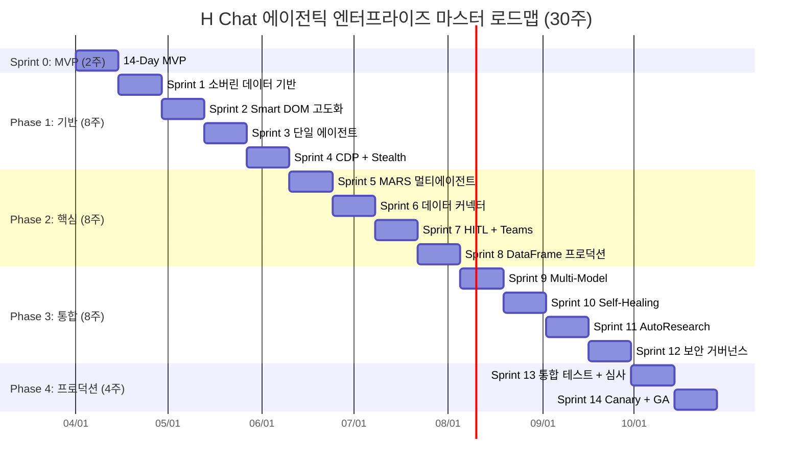
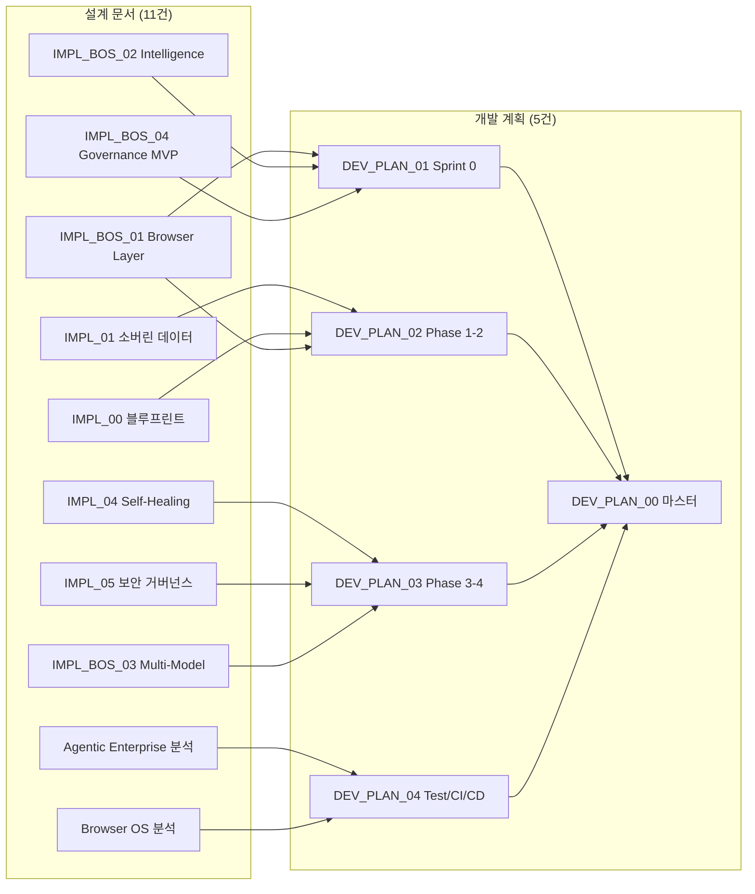

# H Chat 에이전틱 엔터프라이즈 — 마스터 개발 계획

> 작성일: 2026-03-14 | PM 총괄 | Worker A~D 병렬 작성 통합
> 기반: The Agentic Enterprise + Autonomous Browser OS 설계 문서 11건

---

## 1. 프로젝트 개요

### 비전
> "The Browser is the New OS" + "To move fast but to govern faster"

기업 내부 데이터 주권을 보장하면서, 웹을 데이터베이스로 활용하는 자율형 AI 에이전트 플랫폼을 구축한다.

### 범위

| 영역 | 설계 문서 | 핵심 산출물 |
|------|----------|-----------|
| Browser OS 4-Layer | IMPL_BROWSER_OS_01~04 | Extension + Smart DOM + DataFrame + MARS |
| 소버린 데이터 | IMPL_01 | RAG 파이프라인 (Qdrant + Kafka + Flink) |
| 에이전트 오케스트레이션 | IMPL_02 (블루프린트) | LangGraph + CrewAI 멀티 에이전트 |
| Self-Healing | IMPL_04 | 자가 치유 루프 (진단→치유→검증→배포) |
| 보안 거버넌스 | IMPL_05 | Zero Trust + Kill Switch + 감사 |
| Multi-Model | IMPL_BROWSER_OS_03 | Orchestrator Node 동적 라우팅 |

---

## 2. 통합 로드맵 총괄

---

## 3. Phase 요약

| Phase | 기간 | 스프린트 | 핵심 목표 | 상세 계획 |
|-------|------|---------|----------|----------|
| **Sprint 0** | 2주 | — | Browser OS 14일 MVP, 기술 검증 | [DEV_PLAN_01](./DEV_PLAN_01_SPRINT_0.md) |
| **Phase 1** | 8주 | S1~S4 | 소버린 데이터, 3 Pillars, 단일 에이전트 | [DEV_PLAN_02](./DEV_PLAN_02_PHASE_1_2.md) |
| **Phase 2** | 8주 | S5~S8 | MARS 멀티 에이전트, HITL, 커넥터 | [DEV_PLAN_02](./DEV_PLAN_02_PHASE_1_2.md) |
| **Phase 3** | 8주 | S9~S12 | Multi-Model, Self-Healing, 거버넌스 | [DEV_PLAN_03](./DEV_PLAN_03_PHASE_3_4.md) |
| **Phase 4** | 4주 | S13~S14 | 통합 테스트, Canary 배포, GA | [DEV_PLAN_03](./DEV_PLAN_03_PHASE_3_4.md) |
| **Cross-cutting** | 전 구간 | — | 테스트, CI/CD, 팀 구성 | [DEV_PLAN_04](./DEV_PLAN_04_TEST_CICD_TEAM.md) |

---

## 4. 에픽 총괄 (15개 에픽)

| # | 에픽 | Phase | 스토리 수 | 핵심 기술 |
|---|------|-------|----------|----------|
| E01 | Chrome Extension Hybrid + Stealth | S0+P1 | 5 | MV3, CDP, Stealth |
| E02 | Smart DOM (Readability.js + RQFP) | S0+P1 | 4 | Readability.js, RQFP |
| E03 | DataFrame Engine | S0+P2 | 4 | HTML→JSON, Pandas |
| E04 | MARS 기본 파이프라인 | S0+P2 | 5 | LangGraph, CrewAI |
| E05 | 소버린 데이터 파이프라인 | P1 | 5 | Kafka, Flink, Qdrant |
| E06 | RAG 통합 | P1 | 4 | Embedding, Retrieval |
| E07 | 단일 에이전트 오케스트레이션 | P1 | 3 | LangGraph StateGraph |
| E08 | MARS 멀티 에이전트 (5종) | P2 | 5 | CrewAI, LangGraph |
| E09 | Human-in-the-Loop | P2 | 4 | Teams, 승인 플로우 |
| E10 | 데이터 커넥터 (Confluence/SharePoint/ERP) | P2 | 4 | Kafka Connect |
| E11 | Dynamic Multi-Model Orchestrator | P3 | 5 | Orchestrator Node |
| E12 | Self-Healing 루프 | P3 | 5 | AST, Tree-sitter, OTel |
| E13 | 보안 거버넌스 프레임워크 | P3 | 5 | OPA, Vault, Zero Trust |
| E14 | 통합 테스트 + 보안 심사 | P4 | 3 | Playwright, k6, OWASP |
| E15 | Canary 배포 + GA | P4 | 3 | Docker, Actions, Grafana |

---

## 5. 마일스톤 및 판정 기준

| 마일스톤 | 시점 | 판정 기준 |
|---------|------|----------|
| **M0: MVP 완료** | Day 14 | Smart DOM 작동, 단일 에이전트 보고서 생성, 데모 가능 |
| **M1: P1 완료** | Week 10 | RAG 정확도 85%+, 자동화 성공률 60%+, 단일 에이전트 안정 |
| **M2: P2 완료** | Week 18 | 5종 에이전트 가동, HITL Teams 연동, DataFrame 프로덕션 |
| **M3: P3 완료** | Week 26 | Multi-Model 동적 라우팅, Self-Healing 55%+, Kill Switch |
| **M4: GA 릴리스** | Week 30 | 보안 심사 통과, Canary 100%, SLA 달성 |

---

## 6. 팀 구성 요약

| 역할 | 인원 | 주요 책임 | 필요 스킬 |
|------|------|---------|----------|
| PM | 1 | 전체 조율, 스프린트 관리, 이해관계자 소통 | Agile, 기술 이해 |
| FE 엔지니어 | 2 | Extension, Desktop, Admin UI | React 19, TypeScript, MV3 |
| BE 엔지니어 | 3 | ai-core, 에이전트, 파이프라인 | Python, FastAPI, LangGraph |
| ML 엔지니어 | 1 | 임베딩, RAG, Self-Healing 진단 | LLM, Tree-sitter, pgvector |
| Infra/DevOps | 1 | CI/CD, Docker, 모니터링 | Actions, OTel, Grafana |
| QA | 1 | 테스트 전략, E2E, 보안 테스트 | Playwright, k6, OWASP |
| **합계** | **9명** | | |

---

## 7. 예산 총괄

| 항목 | Sprint 0 | Phase 1-2 | Phase 3-4 | 총계 |
|------|---------|----------|----------|------|
| 인건비 (9명) | $30K | $240K | $180K | **$450K** |
| LLM API | $1K | $15K | $20K | **$36K** |
| 인프라 (클라우드/DB) | $1K | $10K | $15K | **$26K** |
| 도구/라이선스 | $0 | $5K | $5K | **$10K** |
| **합계** | **$32K** | **$270K** | **$220K** | **$522K** |

### 연간 기대 절감

| 항목 | 절감액 |
|------|--------|
| 웹 리서치 자동화 | $200K |
| IT 헬프데스크 자동화 | $150K |
| 인시던트 자동 복구 | $100K |
| 데이터 입력 자동화 | $100K |
| **총 절감** | **$550K/년** |
| **투자 회수** | **~12개월** |
| **3년 ROI** | **~270%** |

---

## 8. 상세 계획 문서 인덱스

| # | 문서 | Worker | 내용 |
|---|------|--------|------|
| 01 | [DEV_PLAN_01_SPRINT_0.md](./DEV_PLAN_01_SPRINT_0.md) | A | Day 1~14 일별 태스크, Gantt, Go/No-Go |
| 02 | [DEV_PLAN_02_PHASE_1_2.md](./DEV_PLAN_02_PHASE_1_2.md) | B | Sprint 1~8, 에픽/스토리, 의존성 |
| 03 | [DEV_PLAN_03_PHASE_3_4.md](./DEV_PLAN_03_PHASE_3_4.md) | C | Sprint 9~14, 통합테스트, Canary |
| 04 | [DEV_PLAN_04_TEST_CICD_TEAM.md](./DEV_PLAN_04_TEST_CICD_TEAM.md) | D | 테스트피라미드, CI/CD, RACI |
| 00 | [DEV_PLAN_00_MASTER.md](./DEV_PLAN_00_MASTER.md) (본 문서) | PM | 마스터 플랜 통합 |

---

## 9. 설계 문서 → 개발 계획 연결 맵

---

> **"검색을 넘어선 자율형 리서치의 시대. 30주 후, H Chat은 에이전틱 엔터프라이즈의 핵심 플랫폼이 됩니다."**
