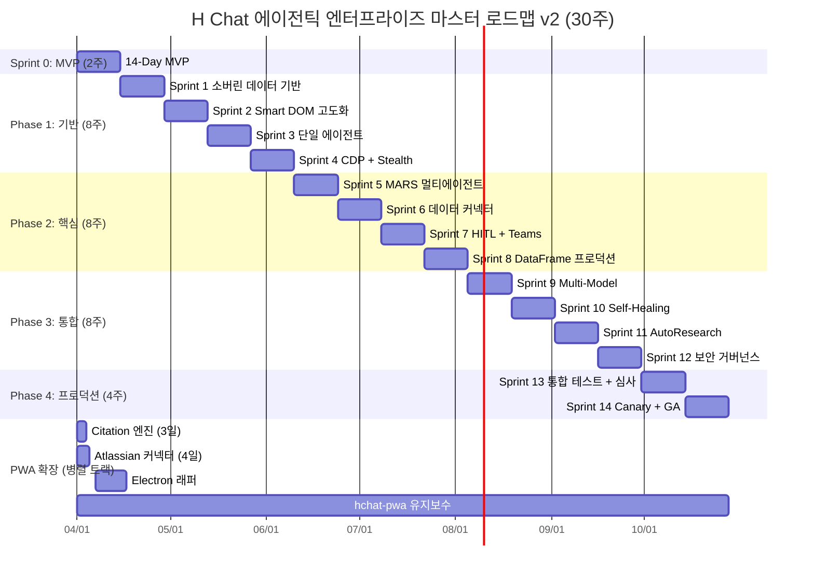
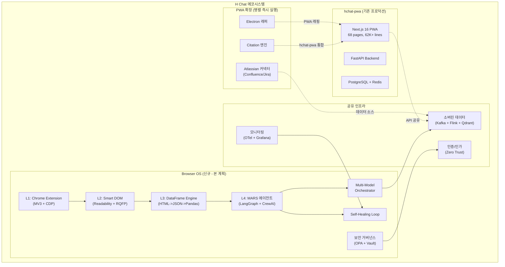
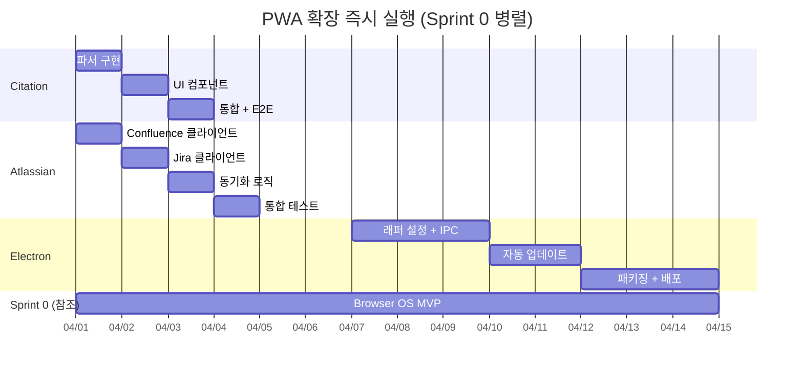
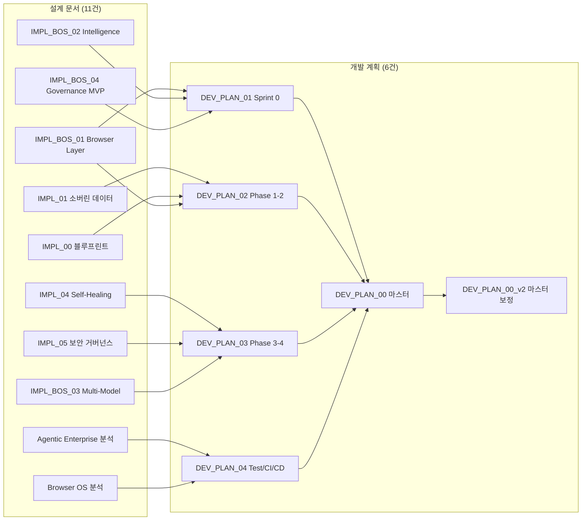

# H Chat 에이전틱 엔터프라이즈 — 마스터 개발 계획 v2 (보정판)

> 작성일: 2026-03-14 | v2 보정: 심층분석 결과 반영
> 기반: The Agentic Enterprise + Autonomous Browser OS 설계 문서 11건 + 심층분석 7건

---

## 1. 프로젝트 개요

### 비전
> "The Browser is the New OS" + "To move fast but to govern faster"

기업 내부 데이터 주권을 보장하면서, 웹을 데이터베이스로 활용하는 자율형 AI 에이전트 플랫폼을 구축한다.

### 에코시스템 구조 (v2 보정)

본 프로젝트는 단일 제품이 아닌 **3개 축**으로 구성된 에코시스템이다.

| 축 | 프로젝트 | 상태 | 비고 |
|----|---------|------|------|
| **기존 PWA** | hchat-pwa | Phase 1-23 완료 | 1,479 tests, 68 pages, 62K+ lines |
| **신규 Browser OS** | hchat-wiki (Browser OS) | 본 계획 대상 | 30주, 11명 전담 + 유지보수 2명 |
| **PWA 확장** | Citation / Atlassian / Electron | 병렬 즉시 실행 | Browser OS와 독립, 기존 팀 가용 인력 활용 |

- **hchat-pwa**: 현대차그룹 생성형 AI 서비스의 프로덕션 기반. 유지보수 모드로 전환하되 안정성 보장 필수.
- **Browser OS**: 본 마스터 플랜의 핵심. 자율형 에이전트 + 웹 브라우저 OS 레이어.
- **PWA 확장 (병렬)**: Citation 엔진(3일), Atlassian 커넥터(4일), Electron 데스크톱 래퍼는 Browser OS 스프린트와 **독립 병렬** 진행 가능.

### 범위

| 영역 | 설계 문서 | 핵심 산출물 |
|------|----------|-----------|
| Browser OS 4-Layer | IMPL_BROWSER_OS_01~04 | Extension + Smart DOM + DataFrame + MARS |
| 소버린 데이터 | IMPL_01 | RAG 파이프라인 (Qdrant + Kafka + Flink) |
| 에이전트 오케스트레이션 | IMPL_02 (블루프린트) | LangGraph + CrewAI 멀티 에이전트 |
| Self-Healing | IMPL_04 | 자가 치유 루프 (진단->치유->검증->배포) |
| 보안 거버넌스 | IMPL_05 | Zero Trust + Kill Switch + 감사 |
| Multi-Model | IMPL_BROWSER_OS_03 | Orchestrator Node 동적 라우팅 |

---

## 2. 통합 로드맵 총괄



---

## 3. Phase 요약

| Phase | 기간 | 스프린트 | 핵심 목표 | 상세 계획 |
|-------|------|---------|----------|----------|
| **Sprint 0** | 2주 | -- | Browser OS 14일 MVP, 기술 검증 | [DEV_PLAN_01](./DEV_PLAN_01_SPRINT_0.md) |
| **Phase 1** | 8주 | S1~S4 | 소버린 데이터, 3 Pillars, 단일 에이전트 | [DEV_PLAN_02](./DEV_PLAN_02_PHASE_1_2.md) |
| **Phase 2** | 8주 | S5~S8 | MARS 멀티 에이전트, HITL, 커넥터 | [DEV_PLAN_02](./DEV_PLAN_02_PHASE_1_2.md) |
| **Phase 3** | 8주 | S9~S12 | Multi-Model, Self-Healing, 거버넌스 | [DEV_PLAN_03](./DEV_PLAN_03_PHASE_3_4.md) |
| **Phase 4** | 4주 | S13~S14 | 통합 테스트, Canary 배포, GA | [DEV_PLAN_03](./DEV_PLAN_03_PHASE_3_4.md) |
| **Cross-cutting** | 전 구간 | -- | 테스트, CI/CD, 팀 구성 | [DEV_PLAN_04](./DEV_PLAN_04_TEST_CICD_TEAM.md) |

---

## 4. 에픽 총괄 (15개 에픽)

| # | 에픽 | Phase | 스토리 수 | 핵심 기술 |
|---|------|-------|----------|----------|
| E01 | Chrome Extension Hybrid + Stealth | S0+P1 | 5 | MV3, CDP, Stealth |
| E02 | Smart DOM (Readability.js + RQFP) | S0+P1 | 4 | Readability.js, RQFP |
| E03 | DataFrame Engine | S0+P2 | 4 | HTML->JSON, Pandas |
| E04 | MARS 기본 파이프라인 | S0+P2 | 5 | LangGraph, CrewAI |
| E05 | 소버린 데이터 파이프라인 | P1 | 5 | Kafka, Flink, Qdrant |
| E06 | RAG 통합 | P1 | 4 | Embedding, Retrieval |
| E07 | 단일 에이전트 오케스트레이션 | P1 | 3 | LangGraph StateGraph |
| E08 | MARS 멀티 에이전트 (5종) | P2 | 5 | CrewAI, LangGraph |
| E09 | Human-in-the-Loop | P2 | 4 | Teams, 승인 플로우 |
| E10 | 데이터 커넥터 (Confluence/SharePoint/ERP) | P2 | 4 | Kafka Connect |
| E11 | Dynamic Multi-Model Orchestrator | P3 | 5 | Orchestrator Node |
| E12 | Self-Healing 루프 | P3 | 5 | AST, Tree-sitter, OTel |
| E13 | 보안 거버넌스 프레임워크 | P3 | 5 | OPA, Vault, Zero Trust |
| E14 | 통합 테스트 + 보안 심사 | P4 | 3 | Playwright, k6, OWASP |
| E15 | Canary 배포 + GA | P4 | 3 | Docker, Actions, Grafana |

---

## 5. 마일스톤 및 판정 기준

| 마일스톤 | 시점 | 판정 기준 |
|---------|------|----------|
| **M0: MVP 완료** | Day 14 | Smart DOM 작동, 단일 에이전트 보고서 생성, 데모 가능 |
| **M1: P1 완료** | Week 10 | RAG 정확도 85%+, 자동화 성공률 60%+, 단일 에이전트 안정 |
| **M2: P2 완료** | Week 18 | 5종 에이전트 가동, HITL Teams 연동, DataFrame 프로덕션 |
| **M3: P3 완료** | Week 26 | Multi-Model 동적 라우팅, Self-Healing 55%+, Kill Switch |
| **M4: GA 릴리스** | Week 30 | 보안 심사 통과, Canary 100%, SLA 달성 |

---

## 6. 팀 구성 (v2 보정: 9명 -> 11명 + 유지보수 2명)

### 6.1 Browser OS 전담팀 (11명)

| 역할 | 인원 | 주요 책임 | 필요 스킬 | v1 대비 변경 |
|------|------|---------|----------|-------------|
| PM | 1 | 전체 조율, 스프린트 관리, 이해관계자 소통 | Agile, 기술 이해 | 동일 |
| FE 엔지니어 | **3** | Extension, Desktop, Admin UI, PWA 확장 | React 19, TypeScript, MV3 | +1명 |
| BE 엔지니어 | 3 | ai-core, 에이전트, 파이프라인 | Python, FastAPI, LangGraph | 동일 |
| ML 엔지니어 | **2** | 임베딩, RAG, Self-Healing 진단, MARS 튜닝 | LLM, Tree-sitter, pgvector | +1명 |
| Infra/DevOps | 1 | CI/CD, Docker, 모니터링 | Actions, OTel, Grafana | 동일 |
| QA | 1 | 테스트 전략, E2E, 보안 테스트 | Playwright, k6, OWASP | 동일 |
| **합계** | **11명** | | | **+2명** |

### 6.2 hchat-pwa 유지보수팀 (별도 2명)

| 역할 | 인원 | 주요 책임 |
|------|------|---------|
| FE/풀스택 | 1 | 버그 수정, 보안 패치, 의존성 업데이트 |
| QA/지원 | 1 | 프로덕션 모니터링, 사용자 이슈 대응 |

**보정 근거**: hchat-pwa는 68 pages, 62K+ lines의 프로덕션 서비스. 유지보수 없이 방치하면 보안 리스크와 사용자 이탈 발생. Browser OS 전담팀(11명)과 별도 운영하여 상호 방해 차단.

### 6.3 Sprint 6-7 병목 대응 계획

Sprint 6-7은 HITL + 커넥터 동시 개발 구간으로 고부하 예상:

| 대응 | 설명 |
|------|------|
| **인력 재배치** | FE 3명 중 1명을 BE 커넥터 작업에 임시 배치 (2주) |
| **스코프 조정** | Sprint 7의 커넥터를 Confluence 우선, SharePoint/ERP는 Sprint 8로 이월 |
| **ML 지원** | ML 2명 중 1명이 HITL 승인 플로우 ML 파이프라인 담당 |

---

## 7. 예산 총괄 (v2 보정)

### 7.1 인건비

| 항목 | Sprint 0 | Phase 1-2 | Phase 3-4 | 총계 | 비고 |
|------|---------|----------|----------|------|------|
| Browser OS 전담 (11명) | $30K | $264K | $198K | **$492K** | 인당 주당 $1,360 (시급 ~$34) |
| hchat-pwa 유지보수 (2명) | $5.4K | $43.5K | $32.6K | **$81.5K** | 동일 단가 |
| **인건비 합계** | **$35.4K** | **$307.5K** | **$230.6K** | **$573.5K** | |

### 7.2 LLM API (Mock 전략 반영)

| 항목 | Sprint 0 | Phase 1-2 | Phase 3-4 | 총계 | 비고 |
|------|---------|----------|----------|------|------|
| 프로덕션 LLM | $0.5K | $8K | $15K | **$23.5K** | 실제 API 호출 |
| 개발/테스트 LLM | $0.5K | $7K | $5K | **$12.5K** | 개발환경 월 캡 $2K |
| **LLM 합계** | **$1K** | **$15K** | **$20K** | **$36K** | |

**LLM Mock 전략**:
- **단위/통합 테스트**: MSW + 고정 fixture로 100% Mock (LLM 비용 $0)
- **E2E 테스트**: 5개 골든 시나리오만 실제 LLM 호출, 나머지 녹화 재생
- **개발환경**: 월별 $2K 캡 설정. MARS 7단계 중 Plan/Observe는 경량 모델(Haiku), Execute/Verify만 고급 모델(Sonnet/Opus)
- **개발환경 비용 캡**: 월 $2K 초과 시 자동 Mock 전환 (환경변수 `LLM_BUDGET_EXCEEDED=true`)

### 7.3 총 예산

| 항목 | Sprint 0 | Phase 1-2 | Phase 3-4 | 총계 |
|------|---------|----------|----------|------|
| 인건비 (13명) | $35.4K | $307.5K | $230.6K | **$573.5K** |
| LLM API | $1K | $15K | $20K | **$36K** |
| 인프라 (클라우드/DB) | $1K | $10K | $15K | **$26K** |
| 도구/라이선스 | $0 | $5K | $5K | **$10K** |
| **합계** | **$37.4K** | **$337.5K** | **$270.6K** | **$645.5K** |

### 7.4 연간 기대 절감

| 항목 | 절감액 |
|------|--------|
| 웹 리서치 자동화 | $200K |
| IT 헬프데스크 자동화 | $150K |
| 인시던트 자동 복구 | $100K |
| 데이터 입력 자동화 | $100K |
| **총 절감** | **$550K/년** |
| **투자 회수** | **~14개월** (v1: ~12개월, 예산 증가 반영) |
| **3년 ROI** | **~220%** (v1: ~270%) |

---

## 8. 테스트 목표 보정 (신규)

### 8.1 v1 vs v2 비교

| 항목 | v1 목표 | v2 보정 목표 | 보정 근거 |
|------|--------|------------|----------|
| Unit | 12,000+ | 8,000+ | 주당 483건 비현실적. 주당 ~267건으로 조정 |
| Integration | 1,800+ | 1,200+ | MSW 핸들러 재사용으로 효율화 |
| E2E | 120+ 파일 | 80+ 파일 | 핵심 플로우 집중, 장식적 E2E 제거 |
| Performance | 30+ | 20+ | 핵심 시나리오만 |
| Security | 50+ | 50+ | 보안은 타협 불가 |
| **총계** | **14,500+** | **9,350+** | **현실적 달성 가능** |

### 8.2 단계별 테스트 증가 계획

기존 테스트 자산: hchat-wiki 5,997건 (유지)

| 단계 | 기간 | 신규 추가 | 누적 (Browser OS) | 전체 누적 |
|------|------|----------|------------------|----------|
| Sprint 0 | 2주 | +200건 | 200 | 6,197 |
| Phase 1 (S1-S4) | 8주 | +2,000건 | 2,200 | 7,997 |
| Phase 2 (S5-S8) | 8주 | +3,000건 | 5,200 | 10,997 |
| Phase 3 (S9-S12) | 8주 | +3,000건 | 8,200 | 13,197 |
| Phase 4 (S13-S14) | 4주 | +1,000건 | **9,200** | **15,197** |

**주당 테스트 작성률**: Phase 1-2: ~312건/주, Phase 3: ~375건/주, Phase 4: ~500건/주(통합+보안 집중)

### 8.3 품질 게이트 (Phase 전환 기준)

| 기준 | S0->P1 | P1->P2 | P2->P3 | P3->P4 |
|------|--------|--------|--------|--------|
| 커버리지 (stmts) | 60% | 70% | 80% | 85% |
| E2E 통과율 | 90% | 95% | 98% | 100% |
| Flaky 테스트율 | <5% | <3% | <2% | <1% |
| 보안 체크 | 기본 | OWASP 5항목 | OWASP 전체 | 전체 + 감사 |

---

## 9. 에코시스템 통합 구조 (신규)



### Rate Limiter <-> Multi-Model Orchestrator 연동

```
Orchestrator 모델 선택 점수 =
    quality_score * 0.4
  + latency_score * 0.3
  + cost_score * 0.2
  + availability_score * 0.1

availability_score = f(RateLimiter.getWaitTime(model))
  - waitTime = 0         -> 1.0
  - waitTime < 5s        -> 0.8
  - waitTime < 30s       -> 0.4
  - waitTime >= 30s      -> 0.0 (해당 모델 스킵)
```

Rate Limiter의 `getWaitTime()` 반환값을 Orchestrator의 모델 선택 점수 중 `availability_score`에 실시간 반영. 대기 시간 30초 이상인 모델은 후보에서 자동 제외.

---

## 10. 심층분석 반영 보정 사항 (신규)

| # | 보정 항목 | v1 | v2 보정 | 영향 |
|---|----------|-----|---------|------|
| 1 | **에코시스템 구조** | Browser OS 단일 프로젝트 | hchat-pwa + Browser OS + PWA확장 3축 | SS1 프로젝트 개요 재구성 |
| 2 | **팀 구성** | 9명 (FE 2, ML 1) | 11명 전담 + 유지보수 2명 (FE 3, ML 2) | SS6 인건비 $450K -> $573.5K |
| 3 | **테스트 목표** | 14,500+ (주당 483건) | 9,350+ (단계별 점진 증가) | SS8 현실적 마일스톤 |
| 4 | **예산** | $522K | $645.5K (유지보수팀 + Mock 전략) | SS7 투자회수 12개월 -> 14개월 |
| 5 | **Sprint 6-7 병목** | 언급만 | 인력 재배치 + 스코프 조정 구체화 | SS6.3 실행 계획 |
| 6 | **Extension 리스크** | 미반영 | PRISM Critical 버그를 Sprint 0 체크리스트 포함 | Sprint 0 Go/No-Go 강화 |

### Extension PRISM Critical 버그 (Sprint 0 체크리스트 추가)

Sprint 0 Go/No-Go 판정에 아래 3건을 **Must** 항목으로 추가:

| 버그 ID | 설명 | 대응 |
|---------|------|------|
| PRISM-C01 | DOM 안정성 대기 미흡 (MutationObserver 미사용) | Smart DOM 초기화 시 `MutationObserver` + `requestIdleCallback` 조합 필수 |
| PRISM-C02 | SSE 스트림 취소 누락 (페이지 이탈 시 메모리 누수) | `AbortController` 연결, `visibilitychange` 이벤트에서 자동 해제 |
| PRISM-C03 | DOM reflow 과다 (배치 읽기/쓰기 미분리) | `requestAnimationFrame` 내 배치 쓰기, `FastDOM` 패턴 적용 |

---

## 11. 즉시 실행 항목 (신규)

Browser OS Sprint 0 시작과 동시에 병렬 실행 가능한 PWA 확장 작업.

### 11.1 Citation 엔진 (3일)

| 일차 | 작업 | 담당 | 산출물 |
|------|------|------|--------|
| Day 1 | Citation 파서 구현 (APA/MLA/Chicago) | FE 1명 | `citationParser.ts` + 단위 테스트 20건 |
| Day 2 | Citation UI 컴포넌트 + 인라인 삽입 | FE 1명 | `CitationTooltip`, `CitationList` 컴포넌트 |
| Day 3 | hchat-pwa 통합 + E2E 테스트 | FE 1명 | 통합 PR + E2E 3건 |

**전제 조건**: hchat-pwa 유지보수팀의 리뷰 가용성 확보

### 11.2 Atlassian 커넥터 (4일)

| 일차 | 작업 | 담당 | 산출물 |
|------|------|------|--------|
| Day 1 | Confluence REST API v2 클라이언트 | BE 1명 | `confluenceClient.ts` + Mock 핸들러 |
| Day 2 | Jira REST API v3 클라이언트 | BE 1명 | `jiraClient.ts` + Mock 핸들러 |
| Day 3 | 양방향 동기화 로직 (Confluence <-> Wiki) | BE 1명 | `syncService.ts` + 충돌 해결 로직 |
| Day 4 | 통합 테스트 + 에러 핸들링 강화 | BE 1명 | 통합 테스트 15건 + 재시도 로직 |

**전제 조건**: Atlassian API 토큰 발급, 테스트 워크스페이스 준비

### 11.3 병렬 실행 Gantt



---

## 12. Worker 결과 통합 요약

### 12.1 Sprint 0 상세 (Worker A -- 475줄)

| 항목 | 수치 |
|------|------|
| 총 태스크 | **42개** (T01~T42) |
| 총 공수 | ~125시간 |
| 담당 분포 | FE 22건 / BE 5건 / Full-stack 15건 |
| 체크포인트 | Day 3, 5, **7(중간데모)**, 10, 12, **14(최종데모)** |
| Go/No-Go | Must 4개 + Should 4개 + **PRISM 3개(v2 추가)** |
| Scope 축소 | Level 1(1~2일) -> Level 2(3~4일) -> Level 3(5일+) 3단계 |

### 12.2 Phase 1-2 상세 (Worker B -- 393줄)

| Phase | 에픽 | 스토리 | SP | 핵심 |
|-------|------|--------|-----|------|
| Phase 1 (S1~S4) | 4개 | 15개 | 70 SP | 소버린 데이터, 3 Pillars, 에이전트 기본, 인프라 |
| Phase 2 (S5~S8) | 4개 | 16개 | 83 SP | MARS 멀티에이전트, DataFrame, HITL, 커넥터 |
| **합계** | **8개** | **31개** | **153 SP** | |

### 12.3 Phase 3-4 상세 (Worker C -- 407줄)

| Phase | 에픽 | 스토리 | SP | 핵심 |
|-------|------|--------|-----|------|
| Phase 3 (S9~S12) | 4개 | 17개 | 112 SP | Multi-Model, Self-Healing, AutoResearch, 보안 |
| Phase 4 (S13~S15) | 3개 | 11개 | 50 SP | 통합테스트, 보안심사, 프로덕션 |
| **합계** | **7개** | **28개** | **162 SP** | |

### 12.4 테스트 + CI/CD + 팀 (Worker D -- 352줄)

**CI/CD**: 기존 5 + 신규 10 = **15개 워크플로우**
**Top 10 리스크**: 심각 1건(Browser OS 복잡도), 높음 3건(LLM 비용, 에이전트 안정성, 보안)

---

## 13. 전체 수치 총괄 (v2)

| 항목 | v1 | v2 보정 | 변경 |
|------|-----|---------|------|
| 총 기간 | 30주 | **30주** | 동일 |
| 총 스프린트 | 15개 | **15개** | 동일 |
| 총 에픽 | 15개 | **15개** | 동일 |
| 총 유저 스토리 | 59+개 | **59+개** | 동일 |
| 총 스토리 포인트 | 315+ SP | **315+ SP** | 동일 |
| 테스트 목표 (신규) | 14,500+ | **9,350+** | -35% (현실적 보정) |
| 테스트 목표 (전체 누적) | -- | **15,197+** | 기존 5,997 포함 |
| CI/CD 워크플로우 | 15개 | **15개** | 동일 |
| 팀 규모 | 11명 | **13명** (11+2) | +유지보수 2명 |
| 총 예산 | $522K | **$645.5K** | +$123.5K |
| 연간 절감 | $550K | **$550K** | 동일 |
| 투자 회수 | ~12개월 | **~14개월** | +2개월 |
| 3년 ROI | ~270% | **~220%** | 예산 증가 반영 |

---

## 14. 상세 계획 문서 인덱스

| # | 문서 | Worker | 핵심 내용 |
|---|------|--------|---------|
| 00-v2 | [DEV_PLAN_00_MASTER_v2.md](./DEV_PLAN_00_MASTER_v2.md) (본 문서) | PM | 심층분석 반영 보정판 |
| 00 | [DEV_PLAN_00_MASTER.md](./DEV_PLAN_00_MASTER.md) | PM | 마스터 플랜 v1 (원본) |
| 01 | [DEV_PLAN_01_SPRINT_0.md](./DEV_PLAN_01_SPRINT_0.md) | A | 42 태스크, Day별 Gantt, Go/No-Go |
| 02 | [DEV_PLAN_02_PHASE_1_2.md](./DEV_PLAN_02_PHASE_1_2.md) | B | Sprint 1~8, 31 스토리, 153 SP |
| 03 | [DEV_PLAN_03_PHASE_3_4.md](./DEV_PLAN_03_PHASE_3_4.md) | C | Sprint 9~15, 28 스토리, 162 SP, Runbook |
| 04 | [DEV_PLAN_04_TEST_CICD_TEAM.md](./DEV_PLAN_04_TEST_CICD_TEAM.md) | D | 테스트 + 15 CI/CD + RACI |

---

## 15. 설계 문서 -> 개발 계획 연결 맵



---

> **v2 보정 요약**: 에코시스템 3축 구조 명확화, 팀 11+2명 보정, 테스트 목표 현실화(9,350+), LLM Mock 전략 + 비용 캡, Sprint 6-7 병목 대응, PRISM Critical 버그 Sprint 0 반영, Rate Limiter-Orchestrator 연동 설계, PWA 확장 즉시 병렬 실행 계획 수립.
