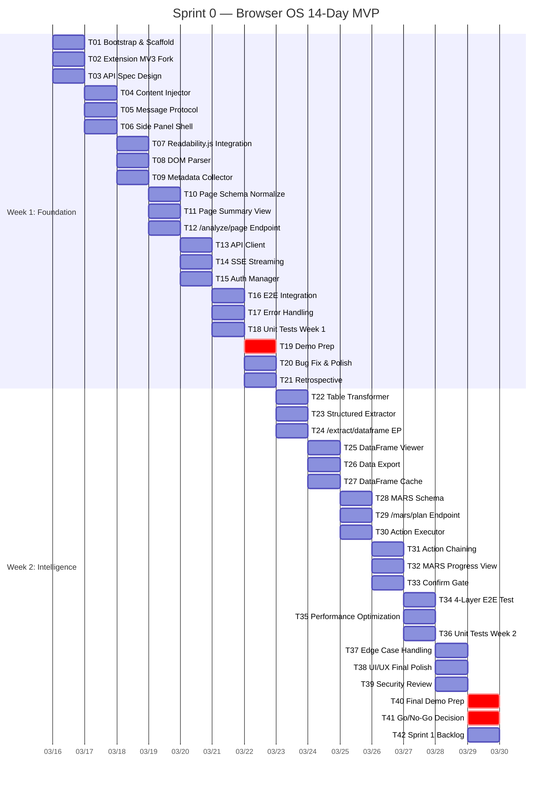
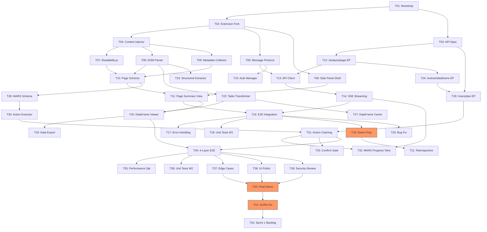

# Sprint 0: Browser OS 14-Day MVP — Daily Development Plan

> **Period**: Day 1 ~ Day 14 (2 weeks)
> **Goal**: 기술 검증 + 팀 학습 — 4-Layer Stack (L1 Extension, L2 Smart DOM, L3 DataFrame, L4 MARS) 동작 데모
> **Team Roles**: FE (Frontend), BE (Backend), Full (Full-stack)

---

## 1. Day 1~14 Daily Task Breakdown

### Week 1: Foundation & Data Layer

#### Day 1 — Project Bootstrap & Dev Environment

| ID | Task | Role | Deliverable | Done Condition | Hours | Depends |
|----|------|------|-------------|----------------|-------|---------|
| T01 | Monorepo workspace 설정 (browser-os 앱 추가) | Full | `apps/browser-os/` scaffold | `npm run dev:browser-os` 정상 기동 | 3h | - |
| T02 | Extension MV3 기반 scaffolding (기존 `apps/extension/` fork) | FE | background.ts, content.ts, popup 뼈대 | Extension 로드 후 console.log 출력 확인 | 3h | - |
| T03 | FastAPI ai-core 엔드포인트 설계 (OpenAPI spec) | BE | `docs/api-spec-sprint0.yaml` | Swagger UI에서 4개 엔드포인트 확인 | 2h | - |

#### Day 2 — L1 Hybrid Extension Core

| ID | Task | Role | Deliverable | Done Condition | Hours | Depends |
|----|------|------|-------------|----------------|-------|---------|
| T04 | Content Script 주입 엔진 (기존 sanitize.ts, blocklist.ts 확장) | FE | `contentInjector.ts` | 허용 도메인에서 DOM 접근 성공, 차단 도메인에서 무동작 | 4h | T02 |
| T05 | Background ↔ Content 메시징 프로토콜 (기존 messaging.ts 확장) | FE | `messageProtocol.ts` | 양방향 메시지 왕복 < 50ms 확인 | 3h | T02 |
| T06 | Side Panel UI shell (React 19) | FE | `SidePanel.tsx` | Side Panel 열림/닫힘 + 빈 상태 렌더링 | 2h | T02 |

#### Day 3 — L2 Smart DOM: Page Intelligence

| ID | Task | Role | Deliverable | Done Condition | Hours | Depends |
|----|------|------|-------------|----------------|-------|---------|
| T07 | Readability.js 통합 — 본문 추출 엔진 | FE | `pageExtractor.ts` | 뉴스 사이트 3종에서 본문 정확도 > 85% | 4h | T04 |
| T08 | DOM 구조 파싱 (heading, table, list, form 식별) | FE | `domParser.ts` | 5개 요소 타입 정확 분류 테스트 통과 | 4h | T04 |
| T09 | 페이지 메타데이터 수집 (title, OG tags, language) | FE | `metadataCollector.ts` | 메타데이터 객체 스키마 검증 통과 | 2h | T04 |

#### Day 4 — L2 Smart DOM: Structured Output

| ID | Task | Role | Deliverable | Done Condition | Hours | Depends |
|----|------|------|-------------|----------------|-------|---------|
| T10 | Page Intelligence 결과를 JSON 스키마로 정규화 | Full | `pageSchema.ts` + Zod 스키마 | 10개 URL 샘플에서 스키마 검증 100% 통과 | 3h | T07, T08, T09 |
| T11 | Side Panel에 Page Intelligence 결과 표시 | FE | `PageSummaryView.tsx` | 실시간 페이지 분석 결과 렌더링 확인 | 3h | T06, T10 |
| T12 | ai-core `/analyze/page` 엔드포인트 구현 | BE | `routers/page_analyze.py` | POST 요청 → 분석 결과 JSON 응답 < 2s | 3h | T03 |

#### Day 5 — Extension ↔ Backend 통신

| ID | Task | Role | Deliverable | Done Condition | Hours | Depends |
|----|------|------|-------------|----------------|-------|---------|
| T13 | Extension → ai-core API 클라이언트 | FE | `apiClient.ts` | Health check + analyze 호출 성공 | 3h | T05, T12 |
| T14 | SSE 스트리밍 연결 (기존 streamingService 패턴 활용) | Full | `sseClient.ts` | 스트리밍 응답 Side Panel에 실시간 표시 | 4h | T13 |
| T15 | 인증/API Key 관리 (extension storage) | FE | `authManager.ts` | API Key 저장/로드/갱신 플로우 정상 | 2h | T05 |

#### Day 6 — Integration & Stabilization

| ID | Task | Role | Deliverable | Done Condition | Hours | Depends |
|----|------|------|-------------|----------------|-------|---------|
| T16 | E2E 통합: 페이지 방문 → 분석 → 결과 표시 전체 플로우 | Full | 통합 테스트 시나리오 | 3개 사이트에서 전체 플로우 성공 | 4h | T11, T14 |
| T17 | 에러 핸들링 + Offline 대응 (기존 useNetworkStatus 패턴) | FE | `errorBoundary.ts` | 네트워크 단절 시 graceful degradation | 3h | T16 |
| T18 | 유닛 테스트 작성 (Week 1 핵심 모듈) | Full | 테스트 파일 8개+ | 커버리지 > 70% (Week 1 신규 코드) | 3h | T07~T15 |

#### Day 7 — Week 1 Demo & Polish

| ID | Task | Role | Deliverable | Done Condition | Hours | Depends |
|----|------|------|-------------|----------------|-------|---------|
| T19 | Week 1 데모 준비 (시나리오 리허설) | Full | 데모 스크립트 | 3분 데모 리허설 완료 | 2h | T16 |
| T20 | 버그 수정 + UX 개선 (Side Panel 반응성) | FE | 패치 커밋 | Critical/High 버그 0건 | 3h | T16 |
| T21 | Week 1 회고 + Week 2 계획 조정 | Full | 회고록 | Go/No-Go 6개 항목 중 5개+ 통과 | 1h | T19 |

---

### Week 2: Intelligence & Autonomy

#### Day 8 — L3 DataFrame: 데이터 추출 엔진

| ID | Task | Role | Deliverable | Done Condition | Hours | Depends |
|----|------|------|-------------|----------------|-------|---------|
| T22 | Table → DataFrame 변환기 (HTML table 파싱) | Full | `tableTransformer.ts` | 5개 테이블 샘플에서 정확도 > 90% | 4h | T08 |
| T23 | List/Form → 구조화 데이터 변환기 | Full | `structuredExtractor.ts` | list, form 데이터 JSON 변환 검증 | 3h | T08 |
| T24 | ai-core `/extract/dataframe` 엔드포인트 | BE | `routers/dataframe.py` | POST 요청 → DataFrame JSON 응답 | 3h | T12 |

#### Day 9 — L3 DataFrame: 데이터 조작 UI

| ID | Task | Role | Deliverable | Done Condition | Hours | Depends |
|----|------|------|-------------|----------------|-------|---------|
| T25 | DataFrame 뷰어 컴포넌트 (Side Panel 내) | FE | `DataFrameView.tsx` | 테이블 렌더링 + 정렬/필터 동작 | 4h | T22, T11 |
| T26 | 데이터 내보내기 (CSV, JSON) | FE | `exportService.ts` | CSV/JSON 다운로드 정상 동작 | 2h | T25 |
| T27 | DataFrame 캐싱 (IndexedDB, 기존 idb 패턴) | FE | `dataFrameCache.ts` | 동일 페이지 재방문 시 캐시 히트 확인 | 2h | T22 |

#### Day 10 — L4 MARS: 기본 파이프라인 설계

| ID | Task | Role | Deliverable | Done Condition | Hours | Depends |
|----|------|------|-------------|----------------|-------|---------|
| T28 | MARS 파이프라인 스키마 정의 (Action → Result) | Full | `marsSchema.ts` + Zod | 파이프라인 3단계 스키마 검증 통과 | 3h | T10 |
| T29 | ai-core `/mars/plan` 엔드포인트 (LLM 기반 액션 계획) | BE | `routers/mars.py` | 자연어 → 액션 플랜 JSON 생성 확인 | 4h | T03, T24 |
| T30 | Action Executor 프레임워크 (기존 SwarmPanel 패턴 참고) | Full | `actionExecutor.ts` | 단일 액션 실행 + 결과 반환 확인 | 3h | T28 |

#### Day 11 — L4 MARS: 자율 실행 엔진

| ID | Task | Role | Deliverable | Done Condition | Hours | Depends |
|----|------|------|-------------|----------------|-------|---------|
| T31 | Multi-step 액션 체이닝 (Plan → Execute → Verify) | Full | `marsOrchestrator.ts` | 2단계 이상 체인 실행 성공 | 4h | T29, T30 |
| T32 | 실행 결과 Side Panel 실시간 표시 (스트리밍) | FE | `MarsProgressView.tsx` | 단계별 진행률 + 결과 실시간 렌더링 | 3h | T14, T31 |
| T33 | 안전장치: 사용자 확인 게이트 (destructive action 전) | FE | `confirmGate.ts` | 위험 액션에서 확인 다이얼로그 표시 | 2h | T31 |

#### Day 12 — End-to-End Integration

| ID | Task | Role | Deliverable | Done Condition | Hours | Depends |
|----|------|------|-------------|----------------|-------|---------|
| T34 | 4-Layer 전체 통합 테스트 | Full | E2E 테스트 시나리오 3개 | L1→L2→L3→L4 전체 플로우 성공 | 4h | T31, T25 |
| T35 | 성능 최적화 (DOM 파싱 < 500ms, API 응답 < 3s) | Full | 성능 벤치마크 리포트 | 목표 수치 달성 | 3h | T34 |
| T36 | 유닛 테스트 작성 (Week 2 핵심 모듈) | Full | 테스트 파일 8개+ | Week 2 신규 코드 커버리지 > 70% | 3h | T22~T33 |

#### Day 13 — Polish & Edge Cases

| ID | Task | Role | Deliverable | Done Condition | Hours | Depends |
|----|------|------|-------------|----------------|-------|---------|
| T37 | Edge case 처리 (SPA, iframe, shadow DOM) | FE | 패치 커밋 | SPA 3종에서 정상 동작 확인 | 4h | T34 |
| T38 | UI/UX 최종 다듬기 (로딩 상태, 에러 상태, 빈 상태) | FE | UI 패치 | 모든 상태 전환 자연스러움 확인 | 3h | T34 |
| T39 | 보안 검토 (PII 패턴 확장, CSP 호환성) | Full | 보안 체크리스트 | 기존 7PII 패턴 + 신규 3패턴 동작 확인 | 2h | T34 |

#### Day 14 — MVP Demo & Retrospective

| ID | Task | Role | Deliverable | Done Condition | Hours | Depends |
|----|------|------|-------------|----------------|-------|---------|
| T40 | 최종 데모 준비 (E2E 시나리오 리허설) | Full | 데모 스크립트 + 녹화 | 5분 데모 리허설 완료 | 2h | T34~T39 |
| T41 | Sprint 0 회고 + Go/No-Go 판정 | Full | 판정서 | 8개 항목 체크리스트 완성 | 2h | T40 |
| T42 | Sprint 1 백로그 작성 + 우선순위 지정 | Full | 백로그 문서 | 상위 20개 스토리 포인트 산정 완료 | 2h | T41 |

---

## 2. Gantt Chart

---

## 3. Dependency Graph

---

## 4. Standup Checkpoints

### Day 3 Checkpoint — L2 Smart DOM 기본 완성

| # | 판정 항목 | Pass Criteria |
|---|----------|---------------|
| 1 | Extension 로드 및 Content Script 주입 | 허용 도메인 3종에서 정상 동작 |
| 2 | DOM 파싱 엔진 동작 | heading, table, list 요소 정확 분류 |
| 3 | Readability.js 본문 추출 | 뉴스 사이트 2종 이상에서 본문 추출 성공 |
| **Decision** | 3/3 통과 시 계속, 2/3이면 Day 4에 보충, 1/3이면 scope 축소 검토 |

### Day 5 Checkpoint — Extension ↔ Backend 연결

| # | 판정 항목 | Pass Criteria |
|---|----------|---------------|
| 1 | Page Intelligence JSON 출력 | 10개 URL에서 스키마 검증 통과 |
| 2 | ai-core API 호출 성공 | Extension → FastAPI 왕복 < 3s |
| 3 | SSE 스트리밍 연결 | 실시간 응답 Side Panel 표시 |
| **Decision** | 3/3 통과 시 정상 진행, 2/3이면 Day 6 집중 수정, 1/3이면 아키텍처 재검토 |

### Day 7 Checkpoint — Week 1 완료 판정

| # | 판정 항목 | Pass Criteria |
|---|----------|---------------|
| 1 | L1 Extension 안정 동작 | 5개 사이트에서 crash 0건 |
| 2 | L2 Page Intelligence E2E | 페이지 → 분석 → 표시 전체 플로우 |
| 3 | Side Panel UI 반응성 | 로딩/에러/결과 상태 전환 자연스러움 |
| 4 | 유닛 테스트 커버리지 | Week 1 신규 코드 > 70% |
| 5 | 중간 데모 성공 | 3분 라이브 데모 완주 |
| 6 | Zero Critical Bug | P0/P1 버그 0건 |
| **Decision** | 5/6 이상 → Week 2 정상 진행, 4/6 → 조건부 진행, 3/6 이하 → scope 축소 |

### Day 10 Checkpoint — L3 DataFrame 완성

| # | 판정 항목 | Pass Criteria |
|---|----------|---------------|
| 1 | Table → DataFrame 변환 | 5개 테이블에서 정확도 > 90% |
| 2 | DataFrame UI 표시 | 정렬/필터/내보내기 동작 |
| 3 | MARS 스키마 정의 완료 | 파이프라인 3단계 Zod 검증 통과 |
| **Decision** | 3/3 → MARS 본격 개발, 2/3 → Day 11에 보충, 1/3 → MARS scope 최소화 |

### Day 12 Checkpoint — 4-Layer 통합

| # | 판정 항목 | Pass Criteria |
|---|----------|---------------|
| 1 | L1→L2→L3→L4 전체 플로우 | 3개 시나리오 성공 |
| 2 | 성능 기준 충족 | DOM < 500ms, API < 3s |
| 3 | Week 2 테스트 커버리지 | 신규 코드 > 70% |
| **Decision** | 3/3 → Day 13 polish, 2/3 → Day 13 집중 수정, 1/3 → 데모 scope 축소 |

### Day 14 Checkpoint — MVP 최종 판정

| # | 판정 항목 | Pass Criteria |
|---|----------|---------------|
| 1 | 최종 데모 성공 | 5분 E2E 데모 완주 |
| 2 | Go/No-Go 8항목 | 6/8 이상 통과 |
| 3 | Sprint 1 백로그 | 상위 20개 스토리 준비 완료 |
| **Decision** | Go/No-Go 판정서 발행 → Sprint 1 진입 여부 결정 |

---

## 5. Day 7 Mid-Sprint Demo

### Demo Title: "Page Intelligence Live"

**Duration**: 3분

**Demo Flow**:

1. **(0:00~0:30) Extension 설치 & 활성화**
   - Chrome에서 Extension 로드
   - Side Panel 열기 → 빈 상태(Empty State) 표시 확인

2. **(0:30~1:30) 뉴스 사이트 분석**
   - 뉴스 기사 페이지 방문
   - Content Script 자동 실행 → DOM 파싱 시작
   - Side Panel에 실시간 분석 결과 표시: 제목, 본문 요약, 구조 분석(heading 트리, 테이블 수, 링크 수)

3. **(1:30~2:30) AI 분석 요청**
   - "이 페이지 핵심 요약해줘" 입력
   - ai-core `/analyze/page` 호출 → SSE 스트리밍 응답
   - Side Panel에 실시간 타이핑 효과로 응답 표시

4. **(2:30~3:00) 다른 사이트 전환**
   - 차단 도메인(은행 사이트) 방문 → 비활성화 상태 표시
   - 허용 도메인(위키 사이트) 방문 → 자동 분석 재개

**Success Criteria**: 전체 플로우 중단 없이 완주, 응답 시간 체감 3초 이내

---

## 6. Day 14 Final Demo — MVP Scenario

### Demo Title: "Browser OS: See → Extract → Act"

**Duration**: 5분

**E2E Demo Scenario**:

1. **(0:00~0:45) L1 — Extension Activation**
   - Extension 설치 완료 상태에서 시작
   - 쇼핑 비교 사이트 접속
   - Side Panel 자동 오픈 → 페이지 분석 시작 표시

2. **(0:45~1:45) L2 — Page Intelligence**
   - 페이지 구조 분석 결과 표시: 상품 테이블 감지, 가격 목록 감지
   - 메타데이터 표시: 페이지 언어, 최종 수정일, 콘텐츠 타입
   - AI 요약: "이 페이지는 노트북 5종의 가격 비교 테이블을 포함합니다"

3. **(1:45~3:00) L3 — DataFrame Extraction**
   - "테이블 데이터 추출" 버튼 클릭
   - HTML 테이블 → DataFrame 변환 → Side Panel 테이블 뷰에 표시
   - 정렬 (가격 오름차순) → 필터 (특정 브랜드) → CSV 다운로드

4. **(3:00~4:30) L4 — MARS Autonomous Action**
   - 자연어 입력: "가장 저렴한 제품 3개를 비교표로 정리하고 추천 이유를 작성해줘"
   - MARS 파이프라인 실행 표시:
     - Step 1: DataFrame에서 가격 정렬 → Top 3 추출 (완료)
     - Step 2: 각 제품 스펙 비교표 생성 (진행 중 → 완료)
     - Step 3: 추천 이유 생성 (LLM 스트리밍)
   - 사용자 확인 게이트: "결과를 클립보드에 복사할까요?" → 확인

5. **(4:30~5:00) Wrap-up**
   - 다른 탭(뉴스 사이트) 전환 → 즉시 새 페이지 분석 시작
   - 캐시된 이전 DataFrame 조회 가능 확인
   - "Browser OS가 웹을 이해하고, 데이터를 추출하고, 자율적으로 행동합니다"

**Success Criteria**: 5분 내 전체 4-Layer 시연 완료, 치명적 오류 0건, 모든 단계 3초 이내 응답

---

## 7. Go/No-Go Checklist

Sprint 0 성공 판정을 위한 8개 항목. **6/8 이상 통과 시 Go**.

| # | Category | Criteria | Weight | Pass/Fail |
|---|----------|----------|--------|-----------|
| 1 | **L1 Stability** | Extension 10개 사이트에서 crash 0건, 메모리 누수 없음 | Must | |
| 2 | **L2 Accuracy** | Page Intelligence 정확도 > 85% (10개 URL 샘플) | Must | |
| 3 | **L3 Extraction** | Table → DataFrame 변환 정확도 > 90% (5개 테이블) | Must | |
| 4 | **L4 Pipeline** | MARS 2단계 이상 체인 실행 성공 (3개 시나리오 중 2개+) | Should | |
| 5 | **Performance** | DOM 파싱 < 500ms, API 응답 < 3s (P95) | Should | |
| 6 | **Test Coverage** | 신규 코드 전체 커버리지 > 70% | Should | |
| 7 | **Security** | PII 패턴 필터링 정상, 차단 도메인 무동작, CSP 호환 | Must | |
| 8 | **Demo Success** | Day 14 E2E 데모 5분 완주, 치명적 중단 0건 | Must | |

**판정 기준**:
- **Go**: 8개 중 6개 이상 통과 (Must 4개 전부 포함)
- **Conditional Go**: Must 4개 통과 + Should 1개 → Sprint 1 첫 주에 미달 항목 보완
- **No-Go**: Must 항목 1개라도 미통과 → 1주 추가 Sprint 0.5 진행

---

## 8. Risk & Contingency Plan

### Risk Matrix

| ID | Risk | Probability | Impact | Mitigation |
|----|------|-------------|--------|------------|
| R1 | Readability.js가 SPA에서 동작 불안정 | High | High | MutationObserver 기반 재파싱 + 수동 트리거 폴백 |
| R2 | Chrome Extension MV3 서비스 워커 30초 타임아웃 | Medium | High | Offscreen Document API 활용, 장시간 작업은 ai-core로 위임 |
| R3 | LLM 응답 지연 (> 5초) | Medium | Medium | 스트리밍 강제 적용 + 로컬 캐시 + 타임아웃 후 부분 결과 표시 |
| R4 | 복잡한 테이블 파싱 실패 (colspan, nested table) | High | Medium | 단순 테이블 우선 지원, 복잡 테이블은 Sprint 1로 이관 |
| R5 | MARS 멀티스텝 실행 중 중간 실패 | Medium | High | 각 스텝 독립 실행 + 부분 결과 보존 + 수동 재개 지원 |
| R6 | 팀원 학습 곡선 (Extension API 미경험) | Medium | Medium | Day 1 페어 프로그래밍 + 내부 위키 Quick Start 문서 |

### Scope Reduction Strategy (일정 지연 시)

지연 정도에 따라 3단계 scope 축소를 적용합니다.

**Level 1 — 1~2일 지연 (경미)**
- MARS 멀티스텝을 2단계로 제한 (원래 3단계+)
- Edge case 처리(SPA, iframe, shadow DOM) Sprint 1 이관
- UI 애니메이션/전환 효과 생략

**Level 2 — 3~4일 지연 (중간)**
- L4 MARS를 "단일 액션 실행"으로 축소 (체이닝 제거)
- DataFrame 내보내기를 JSON만 지원 (CSV 제거)
- 성능 최적화(T35) 생략 → Sprint 1에서 수행
- Day 14 데모를 L1+L2+L3까지만 시연

**Level 3 — 5일+ 지연 (심각)**
- L3, L4 전체를 Sprint 1로 이관
- Sprint 0 목표를 "L1 Extension + L2 Page Intelligence" 기술 검증으로 재정의
- Day 14 데모를 Day 7 데모 확장 버전으로 대체
- Go/No-Go 기준을 L1+L2 안정성으로 재조정 (4개 항목)

### Recovery Actions

| Trigger | Action | Owner |
|---------|--------|-------|
| Day 3 checkpoint 2/3 미만 | Day 4 전체 팀 페어 프로그래밍으로 전환 | Tech Lead |
| Day 5 API 연결 실패 | Mock API로 전환, 실제 연동은 Day 8로 이관 | BE |
| Day 7 데모 실패 | Level 1 scope 축소 즉시 적용, Week 2 계획 재수립 | PM |
| Day 10 DataFrame 정확도 < 70% | 수동 셀렉터 모드 추가 (AI 파싱 대신 CSS selector 지정) | FE |
| Day 12 통합 테스트 1/3 미만 | Level 2 scope 축소, 데모 범위 재조정 | Tech Lead |

---

## Appendix: Summary Statistics

| Metric | Value |
|--------|-------|
| Total Tasks | 42 |
| Total Estimated Hours | ~125h |
| FE Tasks | 22 |
| BE Tasks | 5 |
| Full-stack Tasks | 15 |
| Checkpoints | 6 |
| Demos | 2 (Day 7, Day 14) |
| Go/No-Go Items | 8 |
| Risk Items | 6 |
