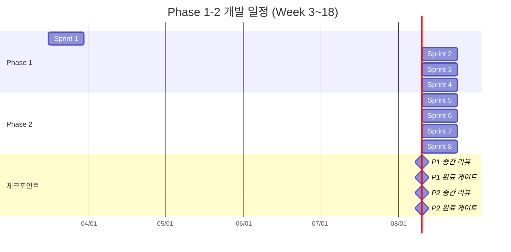
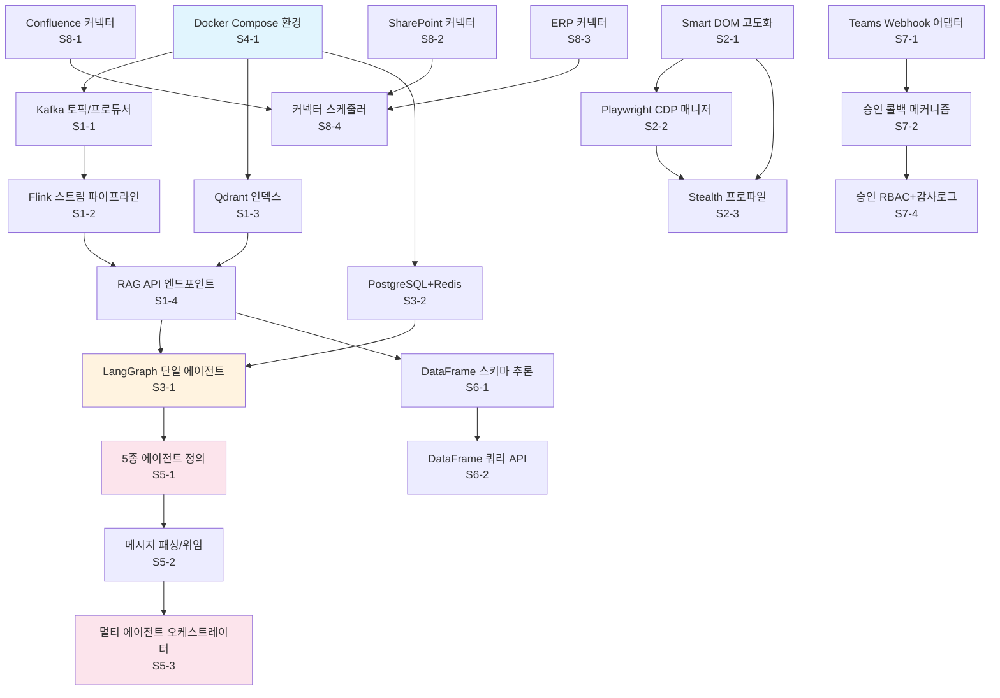

# Phase 1-2 스프린트별 상세 개발 계획

> 문서 버전: 1.0 | 작성일: 2026-03-14 | 범위: Week 3~18 (16주, 8 스프린트)

---

## 1. Phase 1 에픽 분해 (Week 3~10, Sprint 1~4)

### Epic 1-1: 소버린 데이터 파이프라인

| ID | 유저 스토리 | SP |
|----|------------|-----|
| S1-1 | 데이터 엔지니어로서, Kafka 3.7 토픽 설계 및 프로듀서/컨슈머를 구축하여 실시간 데이터 수집을 시작할 수 있다 | 5 |
| S1-2 | 데이터 엔지니어로서, Flink 1.19 스트림 파이프라인을 구성하여 수집된 데이터를 실시간 변환/정제할 수 있다 | 8 |
| S1-3 | ML 엔지니어로서, Qdrant 1.10 컬렉션과 임베딩 인덱스를 설정하여 벡터 검색 기반 RAG를 수행할 수 있다 | 5 |
| S1-4 | 백엔드 개발자로서, RAG 파이프라인 API(질의-검색-생성)를 FastAPI 엔드포인트로 노출하여 프론트엔드가 호출할 수 있다 | 5 |
| **소계** | | **23** |

### Epic 1-2: 3 Pillars 완성 (Smart DOM / Playwright CDP / Stealth)

| ID | 유저 스토리 | SP |
|----|------------|-----|
| S2-1 | 프론트엔드 개발자로서, Smart DOM 고도화(시맨틱 셀렉터 + Shadow DOM 지원)를 통해 안정적 요소 추출을 보장할 수 있다 | 5 |
| S2-2 | 백엔드 개발자로서, Playwright CDP 세션 매니저를 구축하여 브라우저 인스턴스를 풀링하고 병렬 크롤링할 수 있다 | 8 |
| S2-3 | 보안 엔지니어로서, Stealth 프로파일(핑거프린트 로테이션, 프록시 체인)을 강화하여 탐지 우회율 95% 이상을 달성할 수 있다 | 5 |
| S2-4 | QA 엔지니어로서, 3 Pillars 통합 테스트 스위트를 작성하여 회귀를 자동 검출할 수 있다 | 3 |
| **소계** | | **21** |

### Epic 1-3: 에이전트 오케스트레이션 기본

| ID | 유저 스토리 | SP |
|----|------------|-----|
| S3-1 | ML 엔지니어로서, LangGraph 0.2 기반 단일 에이전트 그래프(State/Node/Edge)를 정의하여 기본 태스크를 실행할 수 있다 | 5 |
| S3-2 | 백엔드 개발자로서, 에이전트 상태 저장소(PostgreSQL + Redis)를 구현하여 실행 이력과 체크포인트를 관리할 수 있다 | 5 |
| S3-3 | 프론트엔드 개발자로서, 에이전트 실행 상태를 실시간 모니터링하는 대시보드 UI를 제공할 수 있다 | 3 |
| **소계** | | **13** |

### Epic 1-4: 인프라 및 관측성

| ID | 유저 스토리 | SP |
|----|------------|-----|
| S4-1 | 인프라 엔지니어로서, Docker Compose 개발 환경(Kafka+Flink+Qdrant+PostgreSQL+Redis)을 원커맨드로 기동할 수 있다 | 5 |
| S4-2 | 인프라 엔지니어로서, OpenTelemetry 트레이싱/메트릭/로그를 수집하여 Grafana 대시보드에서 파이프라인 상태를 확인할 수 있다 | 5 |
| S4-3 | DevOps 엔지니어로서, GitHub Actions CI/CD에 Phase 1 빌드/테스트/배포 파이프라인을 추가할 수 있다 | 3 |
| **소계** | | **13** |

**Phase 1 총 스토리 포인트: 70 SP** (스프린트당 평균 ~18 SP)

---

## 2. Phase 2 에픽 분해 (Week 11~18, Sprint 5~8)

### Epic 2-1: MARS 멀티 에이전트 시스템

| ID | 유저 스토리 | SP |
|----|------------|-----|
| S5-1 | ML 엔지니어로서, LangGraph+CrewAI 기반 5종 에이전트(Planner/Researcher/Analyzer/Writer/Reviewer)를 정의하고 역할을 분리할 수 있다 | 8 |
| S5-2 | ML 엔지니어로서, 에이전트 간 메시지 패싱과 위임(Delegation) 프로토콜을 구현하여 협업 태스크를 수행할 수 있다 | 8 |
| S5-3 | 백엔드 개발자로서, 멀티 에이전트 실행 오케스트레이터(스케줄링, 재시도, 타임아웃)를 구현하여 안정적 실행을 보장할 수 있다 | 5 |
| S5-4 | 프론트엔드 개발자로서, 멀티 에이전트 실행 흐름을 시각화(DAG 뷰)하여 사용자가 진행 상황을 파악할 수 있다 | 5 |
| **소계** | | **26** |

### Epic 2-2: DataFrame Engine 프로덕션화

| ID | 유저 스토리 | SP |
|----|------------|-----|
| S6-1 | 데이터 엔지니어로서, DataFrame Engine의 스키마 자동 추론과 타입 캐스팅을 구현하여 비정형 데이터를 정형화할 수 있다 | 5 |
| S6-2 | 백엔드 개발자로서, DataFrame 쿼리 API(필터/집계/조인)를 RESTful 엔드포인트로 노출하여 프론트엔드가 데이터를 탐색할 수 있다 | 5 |
| S6-3 | 프론트엔드 개발자로서, DataFrame 결과를 인터랙티브 테이블+차트로 렌더링하여 사용자가 시각적으로 분석할 수 있다 | 5 |
| S6-4 | QA 엔지니어로서, 100만 행 스케일 부하 테스트를 수행하여 P95 응답 시간 2초 이내를 검증할 수 있다 | 3 |
| **소계** | | **18** |

### Epic 2-3: Human-in-the-Loop (Teams 연동)

| ID | 유저 스토리 | SP |
|----|------------|-----|
| S7-1 | 백엔드 개발자로서, Microsoft Teams Webhook/Bot Framework 연동 어댑터를 구현하여 에이전트가 승인 요청을 전송할 수 있다 | 5 |
| S7-2 | 백엔드 개발자로서, 승인/거부/수정 응답을 에이전트 실행 흐름에 반영하는 콜백 메커니즘을 구현할 수 있다 | 5 |
| S7-3 | 프론트엔드 개발자로서, 승인 대기열 UI와 이력 조회 화면을 구현하여 관리자가 웹에서도 승인할 수 있다 | 3 |
| S7-4 | 보안 엔지니어로서, 승인 프로세스에 RBAC와 감사 로그를 적용하여 권한 기반 제어를 보장할 수 있다 | 3 |
| **소계** | | **16** |

### Epic 2-4: 소버린 데이터 커넥터

| ID | 유저 스토리 | SP |
|----|------------|-----|
| S8-1 | 백엔드 개발자로서, Confluence REST API 커넥터를 구현하여 위키 페이지를 자동 수집/인덱싱할 수 있다 | 5 |
| S8-2 | 백엔드 개발자로서, SharePoint Graph API 커넥터를 구현하여 문서 라이브러리를 동기화할 수 있다 | 5 |
| S8-3 | 백엔드 개발자로서, ERP(SAP RFC/OData) 커넥터를 구현하여 기준 데이터를 주기적으로 적재할 수 있다 | 8 |
| S8-4 | 인프라 엔지니어로서, 커넥터 스케줄러(증분 동기화, 재시도, 데드레터 큐)를 구현하여 안정적 수집을 보장할 수 있다 | 5 |
| **소계** | | **23** |

**Phase 2 총 스토리 포인트: 83 SP** (스프린트당 평균 ~21 SP)

---

## 3. 2주 스프린트 단위 계획

### Sprint 1 (Week 3~4) — 데이터 파이프라인 기반 + 인프라 셋업

**목표:** Kafka/Qdrant 인프라 기동, Smart DOM 고도화 착수

| 태스크 | 담당 | SP |
|--------|------|-----|
| S4-1: Docker Compose 통합 환경 구성 | Infra | 5 |
| S1-1: Kafka 토픽 설계 및 프로듀서/컨슈머 | BE-1 | 5 |
| S1-3: Qdrant 컬렉션 + 임베딩 인덱스 설정 | BE-2 | 5 |
| S2-1: Smart DOM 시맨틱 셀렉터 고도화 | FE-1 | 5 |

**산출물:** docker-compose 개발 환경, Kafka 토픽 3종, Qdrant 인덱스, Smart DOM v2 모듈
**완료 기준:** `docker-compose up` 1분 내 전체 기동, Kafka produce/consume 라운드트립 확인, Qdrant upsert/search 정상

---

### Sprint 2 (Week 5~6) — RAG 파이프라인 + Playwright CDP [Phase 1 중간 체크포인트]

**목표:** Flink 스트림 처리, RAG API MVP, CDP 세션 매니저

| 태스크 | 담당 | SP |
|--------|------|-----|
| S1-2: Flink 스트림 파이프라인 구성 | BE-1 | 8 |
| S1-4: RAG 파이프라인 FastAPI 엔드포인트 | BE-2 | 5 |
| S2-2: Playwright CDP 세션 매니저 | BE-3 | 8 |
| S4-2: OpenTelemetry 트레이싱 수집 설정 | Infra | 5 |

**산출물:** Flink 잡 3종, `/api/v1/rag/query` 엔드포인트, CDP 풀 매니저, Grafana 대시보드
**완료 기준:** 엔드투엔드 RAG 질의 응답 시간 3초 이내, CDP 동시 5세션 안정 유지

> **Sprint 2 리뷰 체크포인트 (P1 중간):** 데이터 파이프라인 정상 가동 여부, RAG 정확도 기본 벤치마크 (Hit@5 > 0.6), CDP 안정성 확인

---

### Sprint 3 (Week 7~8) — 에이전트 기본 + Stealth 강화

**목표:** LangGraph 단일 에이전트, Stealth 프로파일, CI/CD

| 태스크 | 담당 | SP |
|--------|------|-----|
| S3-1: LangGraph 단일 에이전트 그래프 정의 | BE-1 | 5 |
| S3-2: 에이전트 상태 저장소 (PG+Redis) | BE-2 | 5 |
| S2-3: Stealth 프로파일 강화 | BE-3 | 5 |
| S3-3: 에이전트 모니터링 대시보드 UI | FE-1 | 3 |
| S4-3: GitHub Actions CI/CD 파이프라인 | Infra | 3 |

**산출물:** 단일 에이전트 실행 가능, 상태 체크포인트 저장, Stealth 탐지 우회율 리포트, 모니터링 UI, CI 파이프라인
**완료 기준:** 에이전트 단일 태스크 성공률 > 90%, Stealth 탐지 우회율 > 95%

---

### Sprint 4 (Week 9~10) — Phase 1 통합 및 안정화 [Phase 1 완료 체크포인트]

**목표:** 3 Pillars 통합 테스트, 전체 파이프라인 E2E 검증

| 태스크 | 담당 | SP |
|--------|------|-----|
| S2-4: 3 Pillars 통합 테스트 스위트 | BE-1 | 3 |
| P1 통합 E2E 시나리오 테스트 | BE-2 | 5 |
| P1 성능 튜닝 (Kafka 파티션, Qdrant HNSW) | BE-3 | 5 |
| 에이전트 모니터링 UI 고도화 | FE-1 | 3 |
| Smart DOM + Stealth 에지 케이스 처리 | FE-2 | 3 |
| 문서화 및 운영 가이드 | PM | 2 |

**산출물:** 통합 테스트 리포트, 성능 벤치마크 문서, 운영 가이드
**완료 기준:** E2E 성공률 > 95%, RAG P95 < 3초, 에이전트 태스크 성공률 > 90%, 코드 커버리지 > 80%

> **Sprint 4 리뷰 체크포인트 (P1 완료):** Phase 1 전체 데모, 기술 부채 정리, Phase 2 진입 판단 게이트

---

### Sprint 5 (Week 11~12) — MARS 멀티 에이전트 시작 + DataFrame 기초

**목표:** 5종 에이전트 정의, 메시지 패싱, DataFrame 스키마 추론

| 태스크 | 담당 | SP |
|--------|------|-----|
| S5-1: 5종 에이전트 역할 정의 (LangGraph+CrewAI) | BE-1 | 8 |
| S6-1: DataFrame 스키마 자동 추론 | BE-2 | 5 |
| S8-1: Confluence 커넥터 | BE-3 | 5 |
| 멀티 에이전트 DAG 뷰 UI 설계 | FE-1 | 3 |

**산출물:** 5종 에이전트 클래스, 스키마 추론 엔진, Confluence 수집기, UI 와이어프레임
**완료 기준:** 각 에이전트 독립 실행 성공, 10개 샘플 데이터셋 스키마 추론 정확도 > 90%

---

### Sprint 6 (Week 13~14) — 에이전트 협업 + HITL + DataFrame API [Phase 2 중간 체크포인트]

**목표:** 에이전트 간 위임, Teams 연동, DataFrame 쿼리 API

| 태스크 | 담당 | SP |
|--------|------|-----|
| S5-2: 에이전트 메시지 패싱/위임 프로토콜 | BE-1 | 8 |
| S7-1: Teams Webhook/Bot 어댑터 | BE-2 | 5 |
| S6-2: DataFrame 쿼리 API | BE-3 | 5 |
| S5-4: 멀티 에이전트 DAG 시각화 UI | FE-1 | 5 |
| S6-3: DataFrame 인터랙티브 테이블/차트 | FE-2 | 5 |

**산출물:** 에이전트 협업 데모, Teams 승인 봇, DataFrame REST API, DAG 뷰, 데이터 시각화
**완료 기준:** 2개 에이전트 연쇄 실행 성공, Teams 메시지 수신/응답 확인, DataFrame 쿼리 10종 통과

> **Sprint 6 리뷰 체크포인트 (P2 중간):** MARS 2-에이전트 데모, Teams 승인 플로우 데모, DataFrame 쿼리 성능 벤치마크

---

### Sprint 7 (Week 15~16) — 오케스트레이터 + 커넥터 확장 + HITL 고도화

**목표:** 멀티 에이전트 오케스트레이터, SharePoint/ERP 커넥터, 승인 UI

| 태스크 | 담당 | SP |
|--------|------|-----|
| S5-3: 멀티 에이전트 오케스트레이터 | BE-1 | 5 |
| S8-2: SharePoint Graph API 커넥터 | BE-2 | 5 |
| S8-3: ERP(SAP) 커넥터 | BE-3 | 8 |
| S7-2: 승인/거부 콜백 메커니즘 | BE-2 | 5 |
| S7-3: 승인 대기열 UI + 이력 조회 | FE-1 | 3 |
| S7-4: 승인 RBAC + 감사 로그 | FE-2 | 3 |

**산출물:** 오케스트레이터(재시도/타임아웃), SharePoint/ERP 수집기, 승인 UI, 감사 로그
**완료 기준:** 5종 에이전트 파이프라인 E2E 실행, 커넥터 3종 증분 동기화 정상, RBAC 권한 테스트 통과

---

### Sprint 8 (Week 17~18) — Phase 2 통합 및 안정화 [Phase 2 완료 체크포인트]

**목표:** 전체 통합 테스트, 부하 테스트, 프로덕션 준비

| 태스크 | 담당 | SP |
|--------|------|-----|
| S8-4: 커넥터 스케줄러 (증분 동기화/재시도/DLQ) | Infra | 5 |
| S6-4: DataFrame 100만 행 부하 테스트 | BE-1 | 3 |
| Phase 2 통합 E2E 시나리오 테스트 | BE-2 | 5 |
| MARS 5종 에이전트 풀 시나리오 테스트 | BE-3 | 5 |
| UI 통합 및 크로스브라우저 테스트 | FE-1, FE-2 | 5 |
| 운영 가이드 + 릴리즈 노트 | PM | 2 |

**산출물:** 부하 테스트 리포트, E2E 테스트 리포트, 릴리즈 노트, 운영 가이드
**완료 기준:** MARS 전체 시나리오 성공률 > 90%, DataFrame P95 < 2초 (100만 행), 커넥터 3종 72시간 무중단, 전체 코드 커버리지 > 80%

> **Sprint 8 리뷰 체크포인트 (P2 완료):** 전체 시스템 데모, 프로덕션 배포 판단 게이트, Phase 3 계획 킥오프

---

## 4. Mermaid Gantt 차트



---

## 5. 기술 의존성 그래프



---

## 6. 스프린트 리뷰 체크포인트

| 시점 | 스프린트 | 리뷰 항목 | 판단 기준 | Go/No-Go |
|------|---------|-----------|----------|----------|
| **P1 중간** | Sprint 2 완료 | RAG E2E 동작, CDP 세션 안정성, OTel 메트릭 | RAG Hit@5 > 0.6, CDP 5세션 안정, Grafana 대시보드 가동 | 미달시 Sprint 3에 버퍼 할당 |
| **P1 완료** | Sprint 4 완료 | 3 Pillars 통합, 단일 에이전트, 파이프라인 성능 | E2E 성공률 > 95%, RAG P95 < 3초, 커버리지 > 80% | Phase 2 진입 게이트 |
| **P2 중간** | Sprint 6 완료 | MARS 2-에이전트 협업, Teams HITL, DataFrame API | 에이전트 연쇄 성공, Teams 응답 수신, DF 쿼리 10종 통과 | 미달시 Sprint 7에 버퍼 할당 |
| **P2 완료** | Sprint 8 완료 | 전체 시스템 통합, 부하 테스트, 보안 감사 | MARS 성공률 > 90%, DF P95 < 2초, 커넥터 72h 무중단 | 프로덕션 배포 게이트 |

**에스컬레이션 기준:** 스프린트 번다운이 계획 대비 120% 초과시 PM이 스코프 조정 회의 소집

---

## 7. 병렬 작업 식별

### FE / BE / Infra 동시 진행 매핑

```
Sprint  | Frontend (FE-1, FE-2)          | Backend (BE-1, BE-2, BE-3)              | Infra
--------|--------------------------------|------------------------------------------|------------------
S1      | Smart DOM 고도화 (S2-1)        | Kafka 구축 (S1-1), Qdrant 설정 (S1-3)   | Docker Compose (S4-1)
S2      | (Sprint 3 UI 사전 설계)        | Flink (S1-2), RAG API (S1-4), CDP (S2-2)| OTel 설정 (S4-2)
S3      | 에이전트 모니터링 UI (S3-3)     | LangGraph (S3-1), 상태저장 (S3-2), Stealth (S2-3) | CI/CD (S4-3)
S4      | 모니터링 고도화, 에지케이스     | 통합테스트, E2E, 성능튜닝                | (Sprint 5 환경 준비)
S5      | DAG 뷰 UI 설계                 | 5종 에이전트 (S5-1), DF 스키마 (S6-1), Confluence (S8-1) | —
S6      | DAG 시각화 (S5-4), DF 차트 (S6-3) | 위임 프로토콜 (S5-2), Teams (S7-1), DF API (S6-2) | —
S7      | 승인 UI (S7-3), RBAC UI (S7-4) | 오케스트레이터 (S5-3), SharePoint (S8-2), ERP (S8-3), 콜백 (S7-2) | —
S8      | UI 통합 + 크로스브라우저        | 부하테스트, E2E, MARS 풀 테스트          | 스케줄러 (S8-4)
```

**핵심 병렬화 포인트:**
- Sprint 1~2: FE의 Smart DOM과 BE의 데이터 파이프라인은 독립적이므로 완전 병렬
- Sprint 5~6: FE의 DAG 시각화와 BE의 에이전트 구현은 API 인터페이스 합의 후 병렬
- Sprint 6~7: 커넥터 3종(Confluence/SharePoint/ERP)은 BE 3명이 각각 병렬 담당
- Sprint 전체: Infra는 환경 구성 완료 후 모니터링/CI에 집중하며 BE와 비동기 협업

---

## 8. 인력 배치

### 역할별 배정 (총 7명)

| 역할 | 인원 | 주요 책임 | Phase 1 집중 | Phase 2 집중 |
|------|------|----------|-------------|-------------|
| **FE-1** | 1 | Smart DOM, 에이전트 UI, DAG 시각화 | S2-1, S3-3 | S5-4, S7-3 |
| **FE-2** | 1 | Stealth 에지케이스, DataFrame UI, 승인 UI | S2-1 지원 | S6-3, S7-4 |
| **BE-1** | 1 | Kafka/Flink 파이프라인, LangGraph 에이전트 | S1-1, S1-2, S3-1 | S5-1, S5-2, S5-3 |
| **BE-2** | 1 | Qdrant/RAG API, 상태 저장소, Teams 연동 | S1-3, S1-4, S3-2 | S6-1, S6-2, S7-1 |
| **BE-3** | 1 | Playwright CDP, Stealth, 커넥터 | S2-2, S2-3 | S8-1, S8-2, S8-3 |
| **Infra** | 1 | Docker, OTel, CI/CD, 스케줄러 | S4-1, S4-2, S4-3 | S8-4 |
| **PM** | 1 | 스프린트 관리, 리뷰, 문서화, 이해관계자 소통 | 전 스프린트 | 전 스프린트 |

### 스프린트별 부하 분포 (SP/인원)

| 스프린트 | FE-1 | FE-2 | BE-1 | BE-2 | BE-3 | Infra | 합계 |
|---------|------|------|------|------|------|-------|------|
| S1 | 5 | — | 5 | 5 | — | 5 | 20 |
| S2 | — | — | 8 | 5 | 8 | 5 | 26 |
| S3 | 3 | — | 5 | 5 | 5 | 3 | 21 |
| S4 | 3 | 3 | 3 | 5 | 5 | — | 19 |
| S5 | 3 | — | 8 | 5 | 5 | — | 21 |
| S6 | 5 | 5 | 8 | 5 | 5 | — | 28 |
| S7 | 3 | 3 | 5 | 10 | 8 | — | 29 |
| S8 | 3 | 2 | 3 | 5 | 5 | 5 | 23 |

**리스크:** Sprint 6~7은 부하가 높음 (28~29 SP). BE-2는 Sprint 7에서 SharePoint + 콜백 동시 담당으로 10 SP — 필요시 BE-3의 ERP 커넥터 일정을 Sprint 6으로 앞당겨 Sprint 7 부하 분산.

---

## 부록: 용어 정리

| 약어 | 설명 |
|------|------|
| MARS | Multi-Agent Research System |
| HITL | Human-in-the-Loop |
| RAG | Retrieval-Augmented Generation |
| CDP | Chrome DevTools Protocol |
| DLQ | Dead Letter Queue |
| DAG | Directed Acyclic Graph |
| SP | Story Point |
| OTel | OpenTelemetry |
