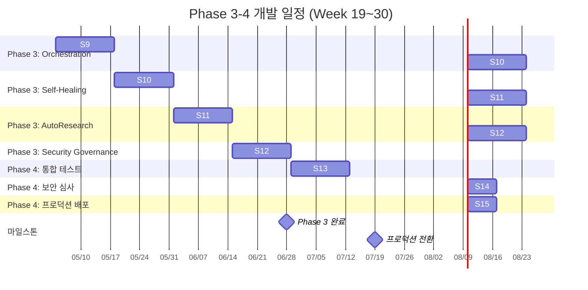

# Phase 3-4 스프린트별 상세 개발 계획

> 작성일: 2026-03-14 | 범위: Week 19~30 (Sprint 9~15) | 총 12주

---

## 1. Phase 3 에픽 분해 (Week 19~26, 8주)

### Epic 3-1: Dynamic Multi-Model Orchestration (34 SP)

| ID | 유저 스토리 | SP |
|----|------------|-----|
| S3-1-1 | 운영자로서 Orchestrator Node를 통해 5개 모델(GPT-4o, Claude Opus, Gemini, Command R+, Llama 3)을 단일 파이프라인에서 동적 라우팅하고 싶다 | 8 |
| S3-1-2 | 시스템으로서 요청 특성(토큰 길이, 도메인, 비용 제약)에 따라 최적 모델을 자동 선택하고 싶다 | 8 |
| S3-1-3 | 운영자로서 모델별 가중치와 폴백 순서를 실시간으로 조정하고 싶다 | 5 |
| S3-1-4 | 시스템으로서 모델 응답을 앙상블하여 최종 답변 품질을 높이고 싶다 | 8 |
| S3-1-5 | 운영자로서 모델별 레이턴시, 비용, 품질 메트릭을 대시보드에서 확인하고 싶다 | 5 |

### Epic 3-2: Self-Healing Loop (29 SP)

| ID | 유저 스토리 | SP |
|----|------------|-----|
| S3-2-1 | 시스템으로서 에이전트 오류 시그널(타임아웃, 에러율 급증, 메모리 초과)을 실시간 감지하고 싶다 | 5 |
| S3-2-2 | 시스템으로서 감지된 시그널로부터 근본 원인을 자동 진단하고 싶다 | 8 |
| S3-2-3 | 시스템으로서 진단 결과에 따라 자동 복구(재시작, 모델 전환, 파라미터 조정)를 수행하고 싶다 | 8 |
| S3-2-4 | 시스템으로서 복구 후 정상 상태를 검증하고 자동 배포하고 싶다 | 5 |
| S3-2-5 | 운영자로서 Self-Healing 이력과 성공률을 조회하고 싶다 | 3 |

### Epic 3-3: AutoResearch Agent (26 SP)

| ID | 유저 스토리 | SP |
|----|------------|-----|
| S3-3-1 | 연구자로서 실험 가설을 입력하면 자율적으로 실험을 설계/실행하고 싶다 | 8 |
| S3-3-2 | 시스템으로서 실험 결과를 자동 평가하고 다음 실험을 제안하고 싶다 | 8 |
| S3-3-3 | 연구자로서 실험 히스토리와 인사이트를 구조화된 보고서로 받고 싶다 | 5 |
| S3-3-4 | 시스템으로서 실험 비용과 리소스 사용량을 예산 한도 내로 제어하고 싶다 | 5 |

### Epic 3-4: Security Governance Framework (23 SP)

| ID | 유저 스토리 | SP |
|----|------------|-----|
| S3-4-1 | 보안팀으로서 Zero Trust 아키텍처로 에이전트 간 통신을 mTLS로 보호하고 싶다 | 8 |
| S3-4-2 | 운영자로서 Kill Switch로 문제 에이전트를 즉시 격리/중단하고 싶다 | 5 |
| S3-4-3 | 시스템으로서 Prompt Injection 공격을 실시간 탐지/차단하고 싶다 | 5 |
| S3-4-4 | 보안팀으로서 에이전트 권한을 최소 권한 원칙으로 관리하고 싶다 | 5 |

**Phase 3 합계: 112 SP**

---

## 2. Phase 4 에픽 분해 (Week 27~30, 4주)

### Epic 4-1: 통합 테스트 (21 SP)

| ID | 유저 스토리 | SP |
|----|------------|-----|
| S4-1-1 | QA로서 전체 에이전트 파이프라인 E2E 테스트를 자동화하고 싶다 | 8 |
| S4-1-2 | QA로서 동시 사용자 500명 부하 테스트로 시스템 한계를 검증하고 싶다 | 5 |
| S4-1-3 | QA로서 Self-Healing + Orchestration 연동 시나리오를 검증하고 싶다 | 5 |
| S4-1-4 | QA로서 보안 거버넌스 정책이 런타임에 올바르게 적용되는지 검증하고 싶다 | 3 |

### Epic 4-2: 보안 심사 (13 SP)

| ID | 유저 스토리 | SP |
|----|------------|-----|
| S4-2-1 | 보안팀으로서 외부 침투 테스트로 취약점을 식별하고 싶다 | 5 |
| S4-2-2 | 보안팀으로서 데이터 주권과 컴플라이언스를 감사하고 싶다 | 5 |
| S4-2-3 | 보안팀으로서 에이전트 보안 하드닝 결과를 검증하고 싶다 | 3 |

### Epic 4-3: 프로덕션 배포 (16 SP)

| ID | 유저 스토리 | SP |
|----|------------|-----|
| S4-3-1 | DevOps로서 Canary 배포(5%-25%-100%)로 안전하게 릴리스하고 싶다 | 5 |
| S4-3-2 | 운영자로서 통합 모니터링 대시보드로 전체 시스템 상태를 파악하고 싶다 | 5 |
| S4-3-3 | 운영자로서 운영 가이드와 Runbook으로 장애에 신속 대응하고 싶다 | 3 |
| S4-3-4 | DevOps로서 자동 롤백 파이프라인으로 배포 실패 시 즉시 복구하고 싶다 | 3 |

**Phase 4 합계: 50 SP | 전체 합계: 162 SP**

---

## 3. Sprint 9~15 상세 계획

### Sprint 9 (Week 19-20): Orchestrator 기반 구축

**목표:** Multi-Model Orchestrator Node 핵심 라우팅 엔진 구현

| 태스크 | 담당 | SP |
|--------|------|-----|
| Orchestrator Node 아키텍처 설계 및 인터페이스 정의 | Backend | 3 |
| 5모델 어댑터 레이어 구현 (GPT-4o, Claude, Gemini, Command R+, Llama 3) | Backend | 5 |
| 요청 특성 분석기 (토큰 길이, 도메인 분류, 비용 제약 파싱) | Backend | 3 |
| 라우팅 정책 엔진 (규칙 기반 + 가중치) | Backend | 5 |
| 단위 테스트 (라우팅 로직, 어댑터) | QA | 3 |

- **산출물:** Orchestrator Node MVP, 모델 어댑터 5종, 라우팅 정책 엔진
- **완료 기준:** 5개 모델에 대해 규칙 기반 라우팅 성공, 단위 테스트 통과율 95%+

### Sprint 10 (Week 21-22): Orchestrator 고도화 + Self-Healing 시작

**목표:** 앙상블 응답, 실시간 가중치 조정, Self-Healing 시그널 감지

| 태스크 | 담당 | SP |
|--------|------|-----|
| 모델 응답 앙상블 엔진 (투표, 가중 합산, 체인 전략) | Backend | 8 |
| 실시간 가중치/폴백 순서 조정 API | Backend | 5 |
| Self-Healing 시그널 수집기 (타임아웃, 에러율, 메모리 모니터링) | Infra | 5 |
| Orchestrator 메트릭 대시보드 (모델별 레이턴시, 비용, 품질) | Frontend | 5 |
| 통합 테스트 (라우팅 + 앙상블 시나리오) | QA | 3 |

- **산출물:** 앙상블 엔진, 가중치 조정 API, 시그널 수집기, 메트릭 대시보드
- **완료 기준:** 앙상블 응답 품질 단일 모델 대비 5%+ 향상, 시그널 감지 지연 < 10초

### Sprint 11 (Week 23-24): Self-Healing 완성 + AutoResearch 시작

**목표:** Self-Healing 전체 루프 구현, AutoResearch 실험 설계 엔진

| 태스크 | 담당 | SP |
|--------|------|-----|
| 자동 진단 엔진 (근본 원인 분석, 패턴 매칭) | Backend | 8 |
| 자동 복구 액션 (재시작, 모델 전환, 파라미터 조정) | Backend | 8 |
| 복구 후 검증 + 자동 배포 파이프라인 | Infra | 5 |
| Self-Healing 이력 대시보드 | Frontend | 3 |
| AutoResearch 실험 설계 엔진 (가설 파싱, 실험 계획 생성) | Backend | 5 |
| Self-Healing 루프 E2E 테스트 | QA | 3 |

- **산출물:** Self-Healing 전체 루프, 이력 대시보드, AutoResearch 설계 엔진
- **완료 기준:** Self-Healing 장애 감소율 55%+, 자동 복구 성공률 80%+

### Sprint 12 (Week 25-26): AutoResearch 완성 + Security Governance

**목표:** AutoResearch 자율 실험 루프, Zero Trust + Kill Switch + Prompt Injection 방어

| 태스크 | 담당 | SP |
|--------|------|-----|
| 실험 자동 실행 + 결과 평가 + 다음 실험 제안 루프 | Backend | 8 |
| 실험 보고서 생성기 (구조화된 인사이트 출력) | Backend | 5 |
| 실험 비용/리소스 제어기 (예산 한도 적용) | Backend | 5 |
| Zero Trust mTLS 에이전트 간 통신 | Infra | 8 |
| Kill Switch 격리/중단 메커니즘 | Infra | 5 |
| Prompt Injection 탐지/차단 미들웨어 | Security | 5 |
| 최소 권한 에이전트 권한 관리 시스템 | Security | 5 |

- **산출물:** AutoResearch 전체 루프, 보안 거버넌스 프레임워크 4종
- **완료 기준:** 자율 실험 5회 연속 성공, mTLS 100% 적용, Prompt Injection 차단율 95%+

### Sprint 13 (Week 27-28): 통합 테스트

**목표:** 전체 시스템 E2E, 부하, 보안, 연동 테스트 완료

| 태스크 | 담당 | SP |
|--------|------|-----|
| 에이전트 파이프라인 E2E 테스트 스위트 (Playwright 확장) | QA | 8 |
| k6 부하 테스트 확장 (500 동시 사용자, 10분 지속) | QA | 5 |
| Self-Healing + Orchestration 연동 시나리오 테스트 | QA | 5 |
| 보안 정책 런타임 적용 검증 테스트 | Security | 3 |
| 테스트 결과 보고서 및 결함 수정 | All | 5 |

- **산출물:** 통합 테스트 스위트, 부하 테스트 보고서, 결함 수정 완료
- **완료 기준:** E2E 통과율 98%+, p95 레이턴시 < 2초 (500유저), 보안 테스트 PASS

### Sprint 14 (Week 29): 보안 심사 + Canary 준비

**목표:** 외부 침투 테스트, 컴플라이언스 감사, Canary 인프라 구축

| 태스크 | 담당 | SP |
|--------|------|-----|
| 외부 침투 테스트 실행 및 취약점 리포트 | Security | 5 |
| 데이터 주권 + 컴플라이언스 감사 (GDPR, 개인정보보호법) | Security | 5 |
| 에이전트 보안 하드닝 검증 | Security | 3 |
| Canary 배포 인프라 구축 (트래픽 분할, 메트릭 수집) | Infra | 3 |
| 발견 취약점 핫픽스 | Backend | 3 |

- **산출물:** 침투 테스트 보고서, 컴플라이언스 감사 보고서, Canary 인프라
- **완료 기준:** Critical/High 취약점 0건, 컴플라이언스 적합 판정, Canary 인프라 검증 완료

### Sprint 15 (Week 30): 프로덕션 전환

**목표:** Canary 배포 실행, 모니터링 대시보드, 운영 가이드 완성

| 태스크 | 담당 | SP |
|--------|------|-----|
| Canary 배포 실행 (5% -> 25% -> 100%) | DevOps | 5 |
| 통합 모니터링 대시보드 구축 (Grafana + 커스텀 패널) | Infra | 5 |
| 운영 가이드 + Runbook 작성 | All | 3 |
| 자동 롤백 파이프라인 구현 및 검증 | DevOps | 3 |
| 최종 KPI 검증 및 회고 | All | 2 |

- **산출물:** 프로덕션 배포 완료, 모니터링 대시보드, 운영 Runbook
- **완료 기준:** Canary 100% 전환, 자동화 성공률 81%+, 작업비용 < $0.12

---

## 4. Gantt 차트

---

## 5. 통합 테스트 전략

### 5.1 테스트 유형별 범위

| 유형 | 범위 | 도구 | 통과 기준 |
|------|------|------|-----------|
| **단위 테스트** | Orchestrator 라우팅 로직, Self-Healing 진단 엔진, AutoResearch 파서, 보안 미들웨어 | Vitest | 커버리지 85%+ (stmts), 통과율 100% |
| **통합 테스트** | 모델 어댑터-Orchestrator 연동, Self-Healing 시그널-진단-복구 체인, 보안 정책 적용 검증 | Vitest + MSW | 주요 시나리오 50개+ 통과 |
| **E2E 테스트** | 사용자 요청 → Orchestrator → 모델 응답 전체 경로, Self-Healing 장애 주입 시나리오 | Playwright | 통과율 98%+, 시나리오 30개+ |
| **부하 테스트** | 동시 500유저 10분 지속, 스파이크 (100→1000→100), Orchestrator 라우팅 처리량 | k6 | p95 < 2초, 에러율 < 1%, 처리량 200 RPS+ |
| **보안 테스트** | Prompt Injection 100패턴, mTLS 인증서 유효성, Kill Switch 응답 시간, 권한 에스컬레이션 | OWASP ZAP + 커스텀 스크립트 | Injection 차단율 95%+, Kill Switch < 5초 |
| **카오스 테스트** | 모델 장애 주입, 네트워크 파티션, 메모리 압박, 디스크 풀 시나리오 | Chaos Toolkit | Self-Healing 자동 복구 80%+ |

### 5.2 테스트 실행 전략

- **CI 파이프라인:** 단위 + 통합 테스트는 PR마다 자동 실행
- **일일 빌드:** E2E + 보안 테스트 매일 새벽 3시 자동 실행
- **주간 실행:** 부하 테스트 + 카오스 테스트 매주 토요일 실행
- **게이트:** E2E 통과율 98% 미만 시 배포 차단

---

## 6. Canary 배포 계획

### 6.1 단계별 트래픽 비율

| 단계 | 트래픽 | 기간 | 대상 사용자 | 진입 조건 |
|------|--------|------|------------|-----------|
| **Canary 1** | 5% | 48시간 | 내부 QA + 얼리어답터 | 통합 테스트 100% PASS, 보안 심사 PASS |
| **Canary 2** | 25% | 72시간 | 부서별 파일럿 그룹 | Canary 1 메트릭 정상 48시간 유지 |
| **GA** | 100% | - | 전체 사용자 | Canary 2 메트릭 정상 72시간 유지 |

### 6.2 모니터링 지표

| 지표 | 임계값 (정상) | 경고 | 롤백 트리거 |
|------|-------------|------|-------------|
| 에러율 | < 0.5% | 0.5~1.0% | > 1.0% |
| p95 레이턴시 | < 2초 | 2~3초 | > 3초 |
| Self-Healing 성공률 | > 80% | 70~80% | < 70% |
| 모델 라우팅 실패율 | < 0.1% | 0.1~0.5% | > 0.5% |
| CPU 사용률 | < 70% | 70~85% | > 85% |
| 메모리 사용률 | < 80% | 80~90% | > 90% |

### 6.3 롤백 트리거 및 절차

**자동 롤백 조건 (1개 이상 충족 시):**
- 에러율 > 1.0% 이 5분 이상 지속
- p95 레이턴시 > 3초가 10분 이상 지속
- Self-Healing 루프 무한 반복 감지 (3회 연속 실패)
- Kill Switch 수동 발동

**롤백 절차:**
1. 트래픽을 이전 안정 버전으로 즉시 전환 (< 30초)
2. Canary 인스턴스 격리 및 로그 보존
3. 장애 알림 발송 (Slack #ops-alerts + PagerDuty)
4. 포스트모템 이슈 자동 생성

---

## 7. 보안 심사 체크리스트

### 7.1 OWASP Top 10 (2021)

| # | 항목 | 검증 방법 | 상태 |
|---|------|----------|------|
| A01 | Broken Access Control | 권한 에스컬레이션 테스트, 수평/수직 접근 제어 검증 | [ ] |
| A02 | Cryptographic Failures | TLS 1.3 강제, 미사용 암호 스위트 차단, 키 로테이션 확인 | [ ] |
| A03 | Injection | Prompt Injection 100패턴, SQL Injection, XSS 자동 스캔 | [ ] |
| A04 | Insecure Design | 위협 모델링 문서 검토, 에이전트 신뢰 경계 검증 | [ ] |
| A05 | Security Misconfiguration | 디폴트 자격증명 스캔, 불필요 포트/서비스 점검 | [ ] |
| A06 | Vulnerable Components | Dependabot 알림 0건, npm audit clean, pip audit clean | [ ] |
| A07 | Auth Failures | 세션 관리, JWT 만료/갱신, 브루트포스 방어 검증 | [ ] |
| A08 | Software/Data Integrity | CI/CD 파이프라인 서명 검증, 의존성 무결성 체크 | [ ] |
| A09 | Logging Failures | 보안 이벤트 로깅 완전성, 로그 변조 방지 검증 | [ ] |
| A10 | SSRF | 에이전트 외부 호출 화이트리스트, 내부망 접근 차단 검증 | [ ] |

### 7.2 에이전트 보안

| 항목 | 검증 방법 | 상태 |
|------|----------|------|
| 에이전트 간 mTLS 인증 | 인증서 체인 검증, 만료 알림 확인 | [ ] |
| Kill Switch 응답 시간 | 격리 명령 후 5초 이내 완전 중단 확인 | [ ] |
| Prompt Injection 방어 | 악성 프롬프트 100패턴 주입 → 차단율 95%+ | [ ] |
| 최소 권한 적용 | 에이전트별 허용 API 목록 검증, 미인가 호출 차단 | [ ] |
| 토큰/비용 한도 | 에이전트별 일일 토큰 한도 초과 시 자동 중단 | [ ] |
| 데이터 유출 방지 | 응답에 PII 포함 여부 스캔, 외부 전송 차단 | [ ] |

### 7.3 데이터 주권

| 항목 | 검증 방법 | 상태 |
|------|----------|------|
| 데이터 저장 위치 | 국내 리전 한정 (ap-northeast-2) 확인 | [ ] |
| 외부 모델 전송 데이터 | PII 제거 후 전송, 전송 로그 보존 확인 | [ ] |
| 개인정보보호법 준수 | 동의 수집, 보존 기한, 파기 절차 검증 | [ ] |
| 감사 로그 보존 | 최소 1년 보존, 변조 방지 (append-only) 확인 | [ ] |
| 데이터 암호화 | 저장 시 AES-256, 전송 시 TLS 1.3 적용 확인 | [ ] |

---

## 8. 프로덕션 전환 Runbook

### 8.1 배포 전 절차 (D-3 ~ D-1)

| 시점 | 절차 | 담당 | 확인 |
|------|------|------|------|
| D-3 | 통합 테스트 최종 실행, 결과 리포트 공유 | QA Lead | [ ] |
| D-3 | 보안 심사 체크리스트 전항목 PASS 확인 | Security Lead | [ ] |
| D-2 | 릴리스 노트 작성, 변경 사항 목록 확정 | PM | [ ] |
| D-2 | DB 마이그레이션 스크립트 스테이징 검증 | DBA | [ ] |
| D-2 | 롤백 스크립트 스테이징 실행 검증 | DevOps | [ ] |
| D-1 | 배포 리허설 (스테이징 환경 전체 과정) | DevOps + QA | [ ] |
| D-1 | Go/No-Go 미팅: 모든 게이트 통과 여부 최종 확인 | All Leads | [ ] |
| D-1 | 비상 연락망 갱신 및 On-call 로테이션 확정 | Ops | [ ] |

### 8.2 배포 중 절차 (D-Day)

| 단계 | 시간 | 절차 | 담당 |
|------|------|------|------|
| 1 | T+0 | 배포 시작 선언, War Room 채널 오픈 | DevOps Lead |
| 2 | T+5m | DB 마이그레이션 실행 | DBA |
| 3 | T+15m | Canary 5% 배포, 헬스체크 확인 | DevOps |
| 4 | T+15m~T+48h | Canary 5% 모니터링 (에러율, 레이턴시, Self-Healing) | Ops |
| 5 | T+48h | 메트릭 검증 후 Canary 25% 확장 | DevOps |
| 6 | T+48h~T+120h | Canary 25% 모니터링 | Ops |
| 7 | T+120h | 최종 메트릭 검증 후 GA 100% 전환 | DevOps Lead |
| 8 | T+120h+1h | GA 전환 후 1시간 집중 모니터링 | All |
| 9 | T+120h+1h | 배포 완료 선언, War Room 해제 | DevOps Lead |

### 8.3 배포 후 절차 (D+1 ~ D+7)

| 시점 | 절차 | 담당 |
|------|------|------|
| D+1 | 24시간 메트릭 리뷰, 이상 징후 확인 | Ops |
| D+1 | 사용자 피드백 수집 채널 모니터링 시작 | PM |
| D+3 | KPI 중간 점검 (자동화 성공률, 작업비용, Self-Healing) | PM + Backend |
| D+7 | 최종 KPI 검증 및 회고 미팅 | All |
| D+7 | 포스트모템 작성 (발생 이슈, 교훈, 개선 사항) | All Leads |

### 8.4 비상 연락망

| 역할 | 1차 | 2차 | 에스컬레이션 |
|------|-----|-----|-------------|
| DevOps Lead | On-call 엔지니어 A | On-call 엔지니어 B | CTO (30분 미응답 시) |
| Backend Lead | 백엔드 엔지니어 A | 백엔드 엔지니어 B | VP Engineering |
| Security Lead | 보안 엔지니어 A | 외부 보안 컨설턴트 | CISO |
| DBA | DBA A | DBA B | Infra Lead |

**연락 채널 우선순위:** PagerDuty → Slack #ops-critical → 전화

### 8.5 롤백 절차

| 단계 | 절차 | 소요 시간 | 담당 |
|------|------|----------|------|
| 1 | 롤백 결정 (자동 트리거 또는 수동 판단) | 즉시 | DevOps Lead |
| 2 | 트래픽을 이전 버전으로 전환 | < 30초 | DevOps |
| 3 | 신규 버전 인스턴스 격리 | < 1분 | DevOps |
| 4 | DB 롤백 마이그레이션 실행 (필요 시) | < 5분 | DBA |
| 5 | 헬스체크 확인 (이전 버전 정상 동작) | < 2분 | QA |
| 6 | 롤백 완료 선언, 장애 알림 발송 | < 1분 | DevOps Lead |
| 7 | 로그/메트릭 보존 및 포스트모템 이슈 생성 | < 10분 | Ops |

**총 롤백 목표 시간: 10분 이내**

---

## 부록: KPI 검증 매트릭스

| KPI | 목표 | 측정 방법 | 측정 시점 |
|-----|------|----------|----------|
| 자동화 성공률 | 81%+ | (자동 처리 건수 / 전체 요청) x 100 | GA 후 D+7 |
| 작업 비용 | < $0.12 | 일일 총 API 비용 / 일일 처리 건수 | GA 후 D+7 |
| Self-Healing 장애 감소율 | 55~70% | (이전 수동 대응 건수 - 현재 수동 대응 건수) / 이전 건수 | GA 후 D+7 |
| 구문 오류율 | 85~90% 감소 | 에이전트 출력 구문 오류 건수 비교 (Phase 2 vs Phase 4) | GA 후 D+7 |
| 시스템 가용성 | 99.9%+ | 월간 업타임 / (업타임 + 다운타임) | GA 후 D+30 |
