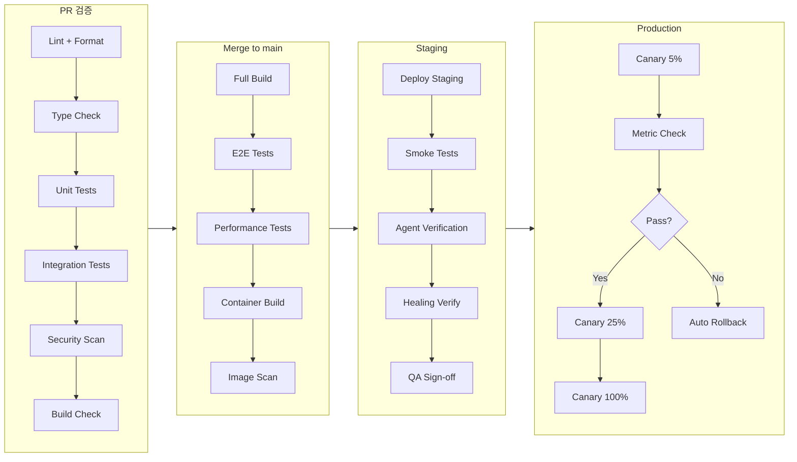

# DEV_PLAN_04: 전체 테스트 전략 + CI/CD + 팀 구성 계획

> Worker D | 2026-03-14 | 30주 프로젝트 (Sprint 0 2주 + Phase 1-4 28주)

---

## 1. 테스트 피라미드

### 1.1 계층별 전략

| 계층 | 범위 | 도구 | 목표 커버리지 | 예상 테스트 수 |
|------|------|------|-------------|--------------|
| **Unit** | 컴포넌트, 훅, 유틸, 서비스 로직, 스키마 검증 | Vitest, React Testing Library | 90% stmts, 82% branches | 12,000+ |
| **Integration** | API 라우트, DB 쿼리, 서비스 간 통신, Kafka 컨슈머 | Vitest + MSW, pytest + httpx, testcontainers | 75% | 1,800+ |
| **E2E** | 사용자 흐름, 크로스 브라우저, 에이전트 시나리오, PWA | Playwright (6 프로젝트) | 주요 흐름 100% | 120+ 파일 |
| **Performance** | API 응답 시간, 렌더링 성능, 스트리밍 처리량 | k6, Lighthouse CI, Web Vitals | P95 < 200ms API, LCP < 2.5s | 30+ 시나리오 |
| **Security** | OWASP Top 10, 의존성 취약점, PII 노출, CSP | OWASP ZAP, Trivy, Snyk, custom scanners | Critical 0, High 0 | 50+ 체크 |

### 1.2 신규 테스트 영역

| 영역 | 테스트 유형 | 예상 수량 |
|------|-----------|----------|
| Browser OS 4-Layer | Unit + Integration (커널/서비스/프레임워크/앱) | 2,500+ |
| 에이전트 오케스트레이션 | LangGraph 워크플로우, CrewAI 태스크, 도구 호출 | 800+ |
| Self-Healing | 장애 주입, 복구 검증, 카오스 테스트 | 200+ |
| 소버린 데이터 | 암호화, 접근 제어, 감사 로그, GDPR 준수 | 400+ |
| 보안 거버넌스 | RBAC, 정책 엔진, 토큰 관리, 감사 추적 | 300+ |
| Chrome Extension | 콘텐츠 스크립트, 백그라운드 워커, 메시지 패싱 | 200+ |

### 1.3 테스트 수량 로드맵

| Phase | 누적 Unit | 누적 Integration | 누적 E2E | 누적 총합 |
|-------|----------|-----------------|---------|----------|
| 기존 (P101) | 5,997 | 포함 | 21 파일 | ~6,000 |
| Phase 1 (W1-8) | 7,500 | 600 | 45 파일 | ~8,500 |
| Phase 2 (W9-16) | 9,500 | 1,200 | 75 파일 | ~11,200 |
| Phase 3 (W17-24) | 11,500 | 1,600 | 100 파일 | ~13,800 |
| Phase 4 (W25-28) | 12,000+ | 1,800+ | 120+ 파일 | ~14,500+ |

---

## 2. CI/CD 파이프라인 설계

### 2.1 파이프라인 전체 흐름



### 2.2 PR 검증 단계 상세

| 단계 | 시간 목표 | 실패 시 |
|------|----------|---------|
| Lint + Format (Prettier, ESLint, Ruff) | < 1분 | PR 블록 |
| Type Check (tsc, mypy) | < 2분 | PR 블록 |
| Unit Tests (Vitest + pytest) | < 5분 | PR 블록 |
| Integration Tests (affected only) | < 8분 | PR 블록 |
| Security Scan (Trivy, Snyk) | < 3분 | Critical/High 시 블록 |
| Build Check (Turbo dry-run) | < 5분 | PR 블록 |
| **총 PR 시간** | **< 15분** (병렬 실행) | — |

### 2.3 스테이징/프로덕션 배포

| 단계 | 조건 | 자동/수동 |
|------|------|----------|
| Staging 배포 | main 머지 시 자동 | 자동 |
| Smoke Test | 배포 후 핵심 10개 시나리오 | 자동 |
| Agent Verification | 에이전트 파이프라인 정상 응답 확인 | 자동 |
| Healing Verify | 장애 주입 → 자동 복구 검증 | 자동 |
| QA Sign-off | 스테이징 검증 완료 확인 | 수동 |
| Canary 5% | QA 승인 후 | 수동 트리거 |
| Canary 25% → 100% | 메트릭 정상 시 | 자동 (15분 간격) |
| Rollback | 에러율 > 1% 또는 P95 > 500ms | 자동 |

---

## 3. GitHub Actions 워크플로우

### 3.1 기존 워크플로우 (유지)

| 파일 | 트리거 | 용도 |
|------|--------|------|
| `ci.yml` | push, PR | type-check + lint + build |
| `deploy.yml` | push to main | Wiki → GitHub Pages |
| `e2e.yml` | push, PR | Playwright E2E |
| `lighthouse.yml` | 주간 + 수동 | 성능 예산 검증 |
| `dependabot-auto-merge.yml` | Dependabot PR | patch/minor 자동 머지 |

### 3.2 신규 워크플로우

| 파일 | 트리거 | 용도 | Phase |
|------|--------|------|-------|
| `agent-test.yml` | PR (apps/ai-core/**) | LangGraph/CrewAI 에이전트 워크플로우 테스트 | P1 |
| `healing-verify.yml` | 수동 + 스케줄(일간) | 장애 주입 → Self-Healing 검증 | P2 |
| `canary-deploy.yml` | 수동 트리거 | 프로덕션 카나리 배포 (5%→25%→100%) | P2 |
| `security-gate.yml` | PR + 주간 스케줄 | OWASP ZAP + Trivy + Snyk 통합 스캔 | P1 |
| `integration-test.yml` | PR (packages/**, apps/**) | Testcontainers 기반 통합 테스트 | P1 |
| `performance-test.yml` | 주간 + 수동 | k6 부하 테스트 (6 시나리오 → 15 시나리오) | P2 |
| `extension-test.yml` | PR (apps/extension/**) | Chrome Extension MV3 빌드 + 테스트 | P1 |
| `sovereign-audit.yml` | 일간 스케줄 | 데이터 암호화 검증 + 접근 제어 감사 | P3 |
| `release-notes.yml` | 태그 push | 자동 릴리스 노트 생성 | P1 |
| `chaos-test.yml` | 주간 스케줄 | 카오스 엔지니어링 (네트워크, DB, 서비스 장애) | P3 |

---

## 4. 팀 구성 및 역할

### 4.1 필요 인원

| 역할 | 인원 | 핵심 책임 |
|------|------|----------|
| **PM / Tech Lead** | 1 | 전체 일정 관리, 아키텍처 결정, 이해관계자 소통 |
| **Frontend Engineer** | 3 | Browser OS UI, 컴포넌트, 상태 관리, Extension |
| **Backend Engineer** | 3 | FastAPI, Kafka, DB 설계, API 개발 |
| **ML/AI Engineer** | 2 | LangGraph, CrewAI, 에이전트 오케스트레이션, LLM 통합 |
| **Infra/DevOps Engineer** | 1 | CI/CD, Docker, 모니터링, Self-Healing 인프라 |
| **QA Engineer** | 1 | 테스트 자동화, E2E, 성능/보안 테스트 |
| **총합** | **11명** | — |

### 4.2 Phase별 인력 투입 계획

| 역할 | Sprint 0 (2주) | Phase 1 (8주) | Phase 2 (8주) | Phase 3 (6주) | Phase 4 (6주) |
|------|---------------|--------------|--------------|--------------|--------------|
| PM/TL | 1 | 1 | 1 | 1 | 1 |
| FE | 2 | 3 | 3 | 3 | 2 |
| BE | 1 | 3 | 3 | 3 | 2 |
| ML/AI | 1 | 2 | 2 | 2 | 1 |
| Infra | 1 | 1 | 1 | 1 | 1 |
| QA | 0 | 1 | 1 | 1 | 1 |
| **가동 인원** | **6** | **11** | **11** | **11** | **8** |

### 4.3 RACI 매트릭스

| 활동 | PM/TL | FE | BE | ML/AI | Infra | QA |
|------|-------|----|----|-------|-------|-----|
| 아키텍처 설계 | A | C | C | C | C | I |
| Browser OS 4-Layer | I | R | C | I | I | C |
| 에이전트 오케스트레이션 | I | C | C | R | I | C |
| API / DB 설계 | A | I | R | C | I | I |
| CI/CD 파이프라인 | I | I | I | I | R | C |
| Self-Healing 인프라 | I | I | C | C | R | C |
| 소버린 데이터 | A | C | R | I | C | C |
| 보안 거버넌스 | A | C | R | I | C | R |
| 테스트 자동화 | I | C | C | C | C | R |
| E2E / 성능 테스트 | I | C | C | I | C | R |
| 릴리스 관리 | A | I | I | I | R | C |
| 문서화 | A | R | R | R | R | R |

> R=Responsible, A=Accountable, C=Consulted, I=Informed

---

## 5. 스킬 매트릭스

### 5.1 역할별 필수 기술

| 기술 | FE | BE | ML/AI | Infra | QA |
|------|:--:|:--:|:-----:|:-----:|:--:|
| TypeScript 5 / React 19 | **필수** | — | — | — | 중급 |
| Next.js 16 (App Router) | **필수** | — | — | — | 기초 |
| Tailwind CSS 4 | **필수** | — | — | — | — |
| Chrome Extension MV3 | **필수** (1명+) | — | — | — | 기초 |
| FastAPI / Python 3.12 | — | **필수** | 중급 | — | 기초 |
| PostgreSQL + pgvector | — | **필수** | 중급 | 기초 | — |
| Qdrant / Neo4j | — | 중급 | **필수** | — | — |
| TimescaleDB | — | **필수** | — | 기초 | — |
| Kafka / Flink | — | **필수** | 중급 | 중급 | — |
| Redis 7 | 기초 | **필수** | — | 중급 | — |
| LangGraph | — | 중급 | **필수** | — | 기초 |
| CrewAI | — | 기초 | **필수** | — | 기초 |
| Docker / Compose | 기초 | 중급 | 기초 | **필수** | 중급 |
| GitHub Actions | 기초 | 기초 | — | **필수** | 중급 |
| OpenTelemetry / Prometheus | — | 기초 | — | **필수** | 기초 |
| Grafana | — | — | — | **필수** | 중급 |
| Vitest / Playwright | 중급 | — | — | — | **필수** |
| k6 / OWASP ZAP | — | — | — | 기초 | **필수** |

### 5.2 교차 교육 계획

| 주차 | 주제 | 대상 | 진행자 |
|------|------|------|--------|
| Sprint 0 W1 | LangGraph/CrewAI 기초 | BE, QA | ML/AI |
| Sprint 0 W2 | Browser OS 아키텍처 | 전원 | PM/TL + FE |
| Phase 1 W2 | Kafka 이벤트 스트리밍 | FE, ML/AI | BE |
| Phase 1 W4 | Playwright E2E 작성법 | FE, BE | QA |
| Phase 2 W2 | Self-Healing 패턴 | BE, ML/AI | Infra |
| Phase 2 W4 | 소버린 데이터 보안 모델 | 전원 | BE + Infra |

---

## 6. 리스크 관리 계획

### 6.1 Top 10 리스크 레지스터

| # | 리스크 | 영향 | 확률 | 등급 | 대응 전략 | 담당 |
|---|--------|------|------|------|----------|------|
| R1 | LangGraph/CrewAI 학습 곡선으로 에이전트 개발 지연 | 높음 | 중간 | **높음** | Sprint 0에 집중 교육, PoC 우선 진행, 외부 컨설팅 예산 확보 | ML/AI |
| R2 | Kafka/Flink 스트리밍 안정성 미달 | 높음 | 중간 | **높음** | Testcontainers 기반 통합 테스트 강화, 폴백 메커니즘 (Redis Streams) | BE + Infra |
| R3 | Browser OS 4-Layer 복잡도로 FE 일정 초과 | 높음 | 높음 | **심각** | 레이어별 독립 개발, 주간 통합 빌드, 범위 축소 플랜 B 준비 | FE + PM |
| R4 | 벡터 DB(Qdrant, pgvector) 대규모 검색 성능 저하 | 중간 | 중간 | **중간** | 인덱스 튜닝 가이드 사전 작성, 벤치마크 테스트 Phase 1에 수행 | BE + ML/AI |
| R5 | Chrome Extension MV3 정책 변경 | 중간 | 낮음 | **낮음** | Chrome 릴리스 노트 모니터링, 격주 호환성 검증 자동화 | FE |
| R6 | Self-Healing 오탐으로 불필요한 롤백 발생 | 높음 | 중간 | **높음** | 단계적 임계값 조정, 수동 오버라이드, 드라이런 모드 2주 운영 | Infra |
| R7 | 소버린 데이터 암호화로 API 지연 증가 | 중간 | 중간 | **중간** | 암호화 범위 분류 (필수/선택), 하드웨어 가속 검토, 캐시 전략 | BE + Infra |
| R8 | 11명 팀 커뮤니케이션 오버헤드 | 중간 | 높음 | **높음** | 2-3명 서브팀 구성, 비동기 소통 원칙, 주간 전체 싱크 | PM |
| R9 | 테스트 14,500+ 유지보수 부담 | 중간 | 중간 | **중간** | 테스트 코드 리뷰 필수화, Flaky 테스트 자동 감지 및 격리 | QA |
| R10 | 보안 취약점으로 릴리스 지연 | 높음 | 낮음 | **중간** | PR 단위 보안 스캔, 주간 전체 스캔, 취약점 SLA (Critical 24h, High 72h) | QA + Infra |

### 6.2 리스크 대응 프로세스

1. 주간 리스크 리뷰 (PM 주관, 15분)
2. 등급 변경 시 즉시 에스컬레이션
3. 심각 등급 발생 시 48시간 내 대응 계획 수립
4. 월간 리스크 레지스터 갱신 및 신규 리스크 식별

---

## 7. 커뮤니케이션 계획

### 7.1 회의 체계

| 회의 | 주기 | 시간 | 참석자 | 목적 |
|------|------|------|--------|------|
| 데일리 스탠드업 | 매일 | 15분 | 전원 | 진행 상황, 블로커, 오늘 계획 |
| 스프린트 플래닝 | 격주 월요일 | 2시간 | 전원 | 스프린트 목표 설정, 태스크 분배 |
| 스프린트 리뷰 | 격주 금요일 | 1시간 | 전원 + 이해관계자 | 데모, 피드백 수집 |
| 레트로스펙티브 | 격주 금요일 | 45분 | 전원 | 개선점 도출, 액션 아이템 |
| 주간 아키텍처 싱크 | 수요일 | 1시간 | PM/TL + 시니어 | 기술 결정, 의존성 조율 |
| 주간 리스크 리뷰 | 목요일 | 15분 | PM + 리드급 | 리스크 레지스터 갱신 |
| Phase 게이트 리뷰 | Phase 전환 시 | 2시간 | 전원 + 경영진 | 품질 게이트 충족 여부 판단 |

### 7.2 도구

| 용도 | 도구 | 규칙 |
|------|------|------|
| 프로젝트 관리 | Jira | 에픽 → 스토리 → 서브태스크, 스프린트 보드 |
| 실시간 소통 | Slack | 채널: #general, #fe, #be, #ml, #infra, #qa, #alerts |
| 화상 회의 | Teams / Zoom | 데일리, 리뷰, 레트로 |
| 문서 | Confluence / Notion | 설계 문서, ADR, 회의록 |
| 코드 리뷰 | GitHub PR | 최소 2명 승인, CODEOWNERS 설정 |
| 알림 | Slack + PagerDuty | CI 실패, 프로덕션 알림, 장애 대응 |

### 7.3 비동기 소통 원칙

- 블로커가 아닌 질문은 Slack 스레드 (4시간 내 응답)
- 설계 결정은 ADR(Architecture Decision Record) 문서화
- PR 리뷰는 24시간 내 완료
- 코드 리뷰 코멘트에 우선순위 표기 (Critical / Major / Minor / Nit)

---

## 8. 품질 게이트

### 8.1 Phase 전환 기준

| 기준 | Phase 0→1 | Phase 1→2 | Phase 2→3 | Phase 3→4 |
|------|-----------|-----------|-----------|-----------|
| **Unit 커버리지** | 90% 유지 | 88%+ | 88%+ | 90%+ |
| **Integration 커버리지** | — | 70%+ | 75%+ | 75%+ |
| **E2E 시나리오** | 기존 21 통과 | 45 파일 통과 | 75 파일 통과 | 100 파일 통과 |
| **빌드 성공** | 10/10 앱 | 전체 앱 | 전체 앱 | 전체 앱 |
| **보안 스캔** | Critical 0 | Critical 0, High 0 | Critical 0, High 0 | Critical 0, High 0, Medium < 5 |
| **성능 (API P95)** | — | < 300ms | < 250ms | < 200ms |
| **성능 (LCP)** | < 4s | < 3s | < 2.8s | < 2.5s |
| **성능 (CLS)** | < 0.1 | < 0.1 | < 0.08 | < 0.05 |
| **Flaky 테스트** | — | < 3% | < 2% | < 1% |
| **기술 부채** | 기준선 설정 | 증가 없음 | 10% 감소 | 20% 감소 |
| **문서화** | CLAUDE.md 갱신 | API 문서 완비 | 운영 가이드 완비 | 전체 문서 완비 |

### 8.2 Phase 게이트 프로세스

1. **자동 검증**: CI/CD 파이프라인에서 수치 기준 자동 체크
2. **QA 리포트**: QA가 테스트 결과 종합 리포트 작성
3. **게이트 리뷰 회의**: PM + 전 리드가 참석하여 Go/No-Go 결정
4. **No-Go 시**: 미충족 항목별 1주 이내 해결 계획 수립 후 재심사
5. **Go 시**: 다음 Phase 스프린트 플래닝 진행

### 8.3 지속적 품질 모니터링

| 지표 | 도구 | 임계값 | 알림 채널 |
|------|------|--------|----------|
| 빌드 성공률 | GitHub Actions | < 95% 시 경고 | #alerts |
| 테스트 통과율 | Vitest + Playwright | < 98% 시 경고 | #alerts |
| Flaky 테스트 비율 | 커스텀 대시보드 | > 2% 시 경고 | #qa |
| 커버리지 추이 | Codecov | 전주 대비 2% 이상 하락 시 | #alerts |
| 취약점 수 | Snyk / Trivy | Critical 발견 즉시 | #alerts + PagerDuty |
| API P95 응답 시간 | Prometheus + Grafana | > 300ms 시 경고 | #alerts |
| 에러율 | OpenTelemetry | > 0.5% 시 경고 | #alerts + PagerDuty |
| 번들 사이즈 | Turbo + 커스텀 | 전주 대비 10% 이상 증가 시 | #fe |

---

## 부록 A: 30주 마일스톤 요약

| 기간 | 마일스톤 | 핵심 산출물 |
|------|----------|-----------|
| Sprint 0 (W0-1) | 환경 구축 + 교육 | 개발 환경, CI/CD 기초, 교차 교육 완료 |
| Phase 1 (W2-9) | 기반 구축 | Browser OS 커널, 에이전트 PoC, 통합 테스트 프레임워크 |
| Phase 2 (W10-17) | 핵심 기능 | Self-Healing MVP, 소버린 데이터 v1, 카나리 배포 |
| Phase 3 (W18-23) | 고도화 | 에이전트 오케스트레이션 완성, 보안 거버넌스, 카오스 테스트 |
| Phase 4 (W24-29) | 안정화 + 릴리스 | 성능 최적화, 전체 E2E, GA 릴리스 |

## 부록 B: GitHub Actions 매트릭스

```
.github/workflows/
├── ci.yml                    # 기존 — PR 기본 검증
├── deploy.yml                # 기존 — Wiki GitHub Pages
├── e2e.yml                   # 기존 → 확장 (21→120+ 파일)
├── lighthouse.yml            # 기존 — 성능 예산
├── dependabot-auto-merge.yml # 기존 — 의존성 자동 머지
├── agent-test.yml            # 신규 P1 — 에이전트 테스트
├── integration-test.yml      # 신규 P1 — 통합 테스트
├── security-gate.yml         # 신규 P1 — 보안 스캔
├── extension-test.yml        # 신규 P1 — Extension 테스트
├── release-notes.yml         # 신규 P1 — 릴리스 노트
├── canary-deploy.yml         # 신규 P2 — 카나리 배포
├── healing-verify.yml        # 신규 P2 — Self-Healing 검증
├── performance-test.yml      # 신규 P2 — 부하 테스트
├── sovereign-audit.yml       # 신규 P3 — 데이터 감사
└── chaos-test.yml            # 신규 P3 — 카오스 테스트
```
