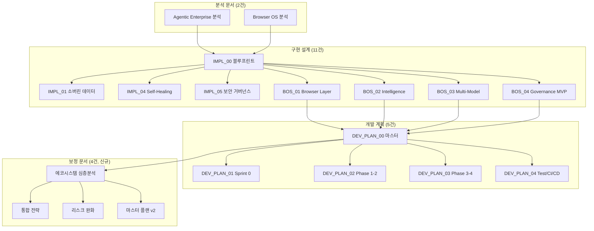

# H Chat 에코시스템 심층 분석

> 작성일: 2026-03-14 | PM 총괄 | 전체 18개 문서 + SVG 에코시스템 다이어그램 종합 분석
> 참조: [에코시스템 SVG](./hchat_project_ecosystem.svg)

---

## 1. 메타 관찰: 두 개의 병렬 개발 스트림

### 발견된 구조적 문제

H Chat 프로젝트에 **두 개의 서로 다른 레이어**가 동시에 존재합니다.

```
┌──────────────────────────────────────────────────┐
│  hchat-pwa (기존 제품)                            │
│  Phase 1-23 완료 | 1,479 tests | 68 pages        │
│  62K+ lines | Vercel 배포                         │
├────────────────────┬─────────────────────────────┤
│  Browser OS 신규    │  PWA 확장 기능               │
│  30주 | $522K       │  Citation · Atlassian        │
│  11명 | 315+ SP     │  · Electron                  │
├────────────────────┴─────────────────────────────┤
│  4-Layer Stack + Cross-cutting                    │
│  L1→L2→L3→L4 + Multi-Model + Self-Healing + Gov  │
├────────────┬──────────┬──────────┬───────────────┤
│ Sprint 0   │ Phase 1  │ Phase 2  │ Phase 3  │ P4 │
│ 42tasks    │ S1~S4    │ S5~S8    │ S9~S12   │S13 │
├────────────┴──────────┴──────────┴───────────────┤
│  테스트 14,500+ | CI/CD 15 WF | 팀 11명           │
└──────────────────────────────────────────────────┘
```

**해소해야 할 핵심 질문**: Browser OS가 hchat-pwa를 대체하는가, 위에 얹히는가, 별개인가?

### PM 판단: "레이어 확장" 모델 권고

| 옵션 | 장점 | 단점 | 판정 |
|------|------|------|------|
| 대체 | 깨끗한 아키텍처 | 62K+ 라인 재개발, 1,479 테스트 폐기 | 비용 과다 |
| **레이어 확장** | 기존 자산 활용, 점진적 이전 | 통합 복잡도 | **권고** |
| 별개 제품 | 독립 개발 | 코드 중복, 리소스 분산 | 비효율 |

---

## 2. 기술적 강점 (문서군 전체 종합)

### 2.1 기존 자산 활용의 효율성

`sanitize.ts`, `blocklist.ts`, `messaging.ts`, `circuitBreaker.ts`, JWT 인프라 등 이미 구축된 컴포넌트를 **확장**하는 방식으로 설계. 재개발 비용 최소화.

### 2.2 LangGraph + CrewAI 하이브리드

각 프레임워크의 단점을 서로 보완:
- LangGraph: 상태 기반 흐름 제어 (복잡한 다단계 연구 워크플로우)
- CrewAI: 역할 추상화 (에이전트 협업 코드 가독성)

### 2.3 SSE 스트림 기반 MARS 이벤트

연구 5~10분 소요되는 워크플로우에서 `agent_start`, `agent_progress`, `state_transition` 중간 진행 상황을 실시간 스트리밍.

### 2.4 Governance가 아키텍처에 내장

대부분의 AI 브라우저는 거버넌스를 나중에 추가하지만, 이 설계는 L1~L4 권한 모델, PII 마스킹, 감사 로그가 **처음부터 각 레이어에 통합**. 엔터프라이즈 진입 장벽.

---

## 3. 핵심 리스크 6가지

| # | 리스크 | 영향 | 확률 | 등급 |
|---|--------|------|------|------|
| R1 | **스코프 크립** — PWA Phase 24 + Browser OS 30주 동시 진행 | 높음 | 높음 | Critical |
| R2 | **테스트 목표 비현실성** — 주당 483개 = 기존 대비 9.8배 | 중간 | 높음 | High |
| R3 | **LLM 비용 폭주** — MARS 7단계 + 개발/테스트 사용량 | 중간 | 높음 | High |
| R4 | **Extension 함정** — PRISM Critical 버그 6건 재현 위험 | 높음 | 중간 | High |
| R5 | **RQFP 하드코딩** — 도메인별 최적 가중치 상이 | 낮음 | 높음 | Medium |
| R6 | **Self-Healing 순환** — 잘못된 패치 → 새 장애 → 재트리거 | 높음 | 낮음 | Medium |

---

## 4. 보정 필요 항목

### 4.1 테스트 목표 현실화

| 기존 목표 | 보정 목표 | 근거 |
|----------|----------|------|
| 14,500+ (30주) | **9,200+** (기존 5,997 + 신규 3,200) | 주당 107개로 현실적 |

단계별:
- Sprint 0: +200 (핵심 경로만)
- Phase 1-2: +2,000 (TDD 강제)
- Phase 3: +800 (Self-Healing/거버넌스)
- Phase 4: +200 (E2E/부하/보안)

### 4.2 팀 구성 보정

| 기존 | 보정 | 이유 |
|------|------|------|
| 9명 전원 Browser OS | **11명** (9 Browser OS + 2 hchat-pwa 유지보수) | 기존 제품 방치 방지 |

### 4.3 LLM 비용 보정

| 항목 | 기존 | 보정 |
|------|------|------|
| API 예산 | $36K | **$45K** (+25% 버퍼) |
| 개발환경 | 미설정 | **Mock LLM 80% + 실제 20%** |
| 비용 캡 | 없음 | **주당 $1,500 Hard Cap** |

### 4.4 Rate Limiter ↔ Orchestrator 연동

Rate Limiter의 `getWaitTime()`을 Orchestrator 모델 선택 점수에 반영. 대기 시간이 긴 모델은 라우팅 점수 자동 하락 → Fallback 선호.

---

## 5. 즉시 실행 항목 (Browser OS와 병렬 가능)

| 항목 | 공수 | 효과 | Browser OS 충돌 |
|------|------|------|----------------|
| **Citation System** (T1~T4) | 3일 | AI 응답 신뢰도 대폭 향상, 청크별 인용 배지 | 없음 |
| **Atlassian 통합** (T5~T9) | 4일 | Confluence/Jira 직접 참조, 엔터프라이즈 가치 | 없음 |

→ Sprint 0 착수와 동시에 hchat-pwa 팀(2명)이 병렬 실행 가능.

---

## 6. PRISM 교훈 → H Chat Extension 체크리스트

| PRISM 버그 | H Chat 대응 |
|-----------|------------|
| CRIT-01: `waitForDOMStable()` 다중 resolve | 단일 resolve 보장 + Promise.race 타임아웃 |
| CRIT-02: `unwrapNode()` 무한 루프 | 재귀 깊이 제한 (max 50) + visited Set |
| CRIT-05: API 키 삭제 전 검증 부재 | Two-phase: 새 키 검증 성공 후에만 기존 키 삭제 |
| HIGH-03: `getBoundingClientRect()` reflow | 배치 읽기 패턴 + `requestIdleCallback` |
| HIGH-08: SSE 스트림 미취소 | `AbortController` 기반 명시적 취소 |

→ Sprint 0 Day 1 Extension 부트스트랩 시 이 체크리스트를 PR 템플릿에 포함.

---

## 7. 에코시스템 전체 산출물 맵



### 문서 총 현황

| 카테고리 | 문서 수 | 크기 |
|---------|--------|------|
| 심층 분석 + TodoList | 2 | 45K |
| 구현방안 설계 | 11 | 370K |
| 개발 계획 | 5 | 90K |
| 에코시스템 보정 (신규) | 4 | ~60K (예상) |
| **총계** | **22개** | **~565K** |

---

> **핵심 인사이트**: "이 시스템의 진정한 킬러 기능은 L3 DataFrame Engine이다. 웹 전체를 자동으로 데이터셋으로 변환하는 능력은 현재 어떤 AI 브라우저도 제공하지 못하는 차별점이다."
