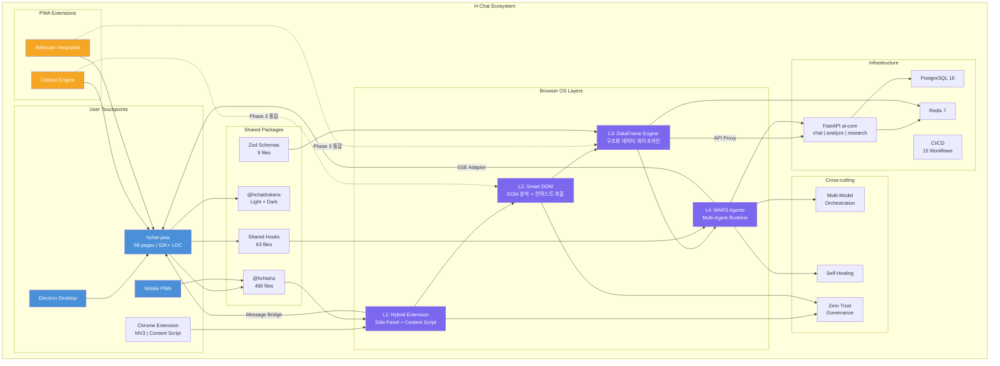
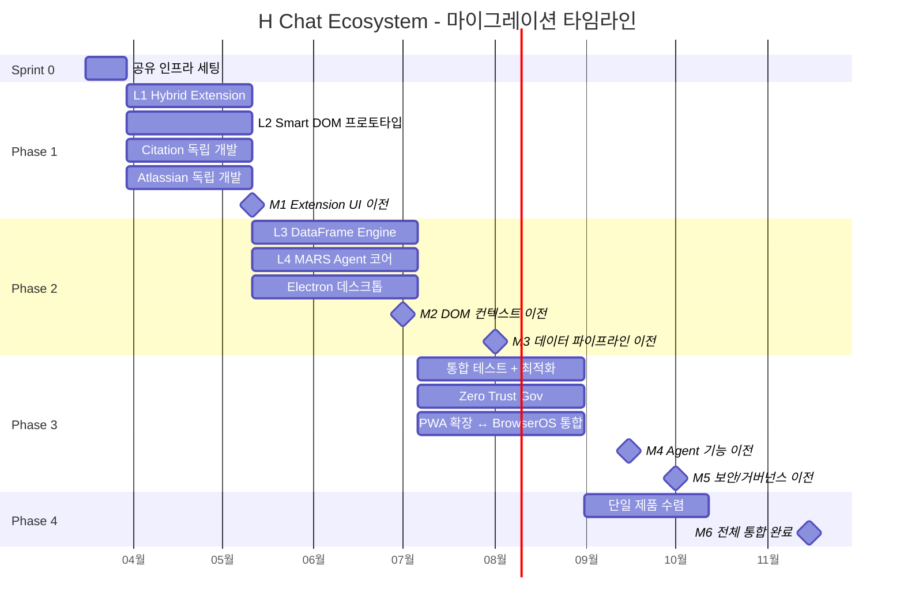

# H Chat Ecosystem Integration Strategy

> hchat-pwa (기존 제품) ↔ Browser OS (신규 개발) 통합 전략

---

## 1. 두 스트림 관계 정의

### 옵션 비교

| 기준 | A. 대체 (Replace) | B. 레이어 (Layer-on) | C. 독립 (Independent) |
|------|-------------------|---------------------|----------------------|
| **정의** | Browser OS가 hchat-pwa를 완전 대체 | Browser OS가 hchat-pwa 위에 확장 레이어로 동작 | 두 제품이 별도 타겟/배포로 운영 |
| **기존 자산 활용** | 낮음 — 62K+ LOC 재작성 필요 | 높음 — 68 pages, 1,479 tests 재사용 | 중간 — 공유 패키지만 활용 |
| **출시 속도** | 느림 (30주 + 마이그레이션) | 빠름 (점진적 기능 활성화) | 빠름 (독립 배포) |
| **사용자 영향** | 높음 — 전면 전환 필요 | 낮음 — 기존 UX 유지 + 신규 기능 추가 | 없음 — 별도 진입점 |
| **유지보수 비용** | 단기 높음, 장기 낮음 | 단기 낮음, 장기 중간 | 장기 높음 (이중 유지) |
| **리스크** | 기존 사용자 이탈, 일정 지연 | 레이어 간 결합도 관리 필요 | 코드 분기, 팀 분산 |

### 권고안: B. 레이어 (Layer-on) + 점진적 흡수

**근거:**

1. **자산 보존**: hchat-pwa의 68개 페이지, 62K+ LOC, 1,479개 테스트는 검증된 프로덕션 코드다. 이를 버리고 재작성하는 것은 비경제적이다.
2. **리스크 분산**: Browser OS의 4-Layer 아키텍처(Hybrid Extension → Smart DOM → DataFrame → MARS)는 각 레이어가 독립 활성화 가능하므로, hchat-pwa 위에 점진적으로 얹는 것이 자연스럽다.
3. **출시 연속성**: 기존 사용자는 hchat-pwa를 계속 사용하면서, Browser OS 기능이 Feature Flag로 점진 활성화된다.
4. **장기 수렴**: Phase 3~4에서 Browser OS가 충분히 성숙하면 hchat-pwa의 핵심 기능을 흡수하여 단일 제품으로 수렴한다.

---

## 2. 통합 아키텍처

### 계층 설계

```
+------------------------------------------------------------------+
|                        User Interface                             |
|  hchat-pwa (68 pages)  |  Browser OS Surface (Extension UI)      |
+------------------------------------------------------------------+
|                    Shared Component Layer                          |
|  @hchat/ui (490 files) | @hchat/tokens | Shared Hooks (63)       |
+------------------------------------------------------------------+
|                    Browser OS Layers                               |
|  L1 Hybrid Extension ← Content Script + Side Panel               |
|  L2 Smart DOM ← DOM 분석, 페이지 컨텍스트 추출                      |
|  L3 DataFrame Engine ← 구조화된 데이터 처리 파이프라인               |
|  L4 MARS Agents ← Multi-Agent Runtime System                     |
+------------------------------------------------------------------+
|                    Cross-cutting Concerns                          |
|  Multi-Model Orchestration | Self-Healing | Zero Trust Gov        |
+------------------------------------------------------------------+
|                    Shared Infrastructure                           |
|  FastAPI (ai-core) | PostgreSQL | Redis | Docker | CI/CD          |
+------------------------------------------------------------------+
```

### 공유 컴포넌트 식별

| 카테고리 | hchat-pwa 기존 | Browser OS 재사용 | 공유 방식 |
|----------|---------------|-------------------|----------|
| UI 컴포넌트 | @hchat/ui 490 files | L1 Extension UI, Side Panel | npm workspace import |
| 디자인 토큰 | @hchat/tokens (light/dark) | Extension theme | CSS variable injection |
| 채팅 엔진 | useChat, SSE streaming | L4 MARS Agent 통신 | 공유 hook + adapter |
| 인증 | AuthProvider, JWT | Zero Trust Gov | 공유 auth service + 확장 |
| API 클라이언트 | ServiceFactory (Mock/Real) | DataFrame API layer | 공유 client + interceptor |
| 데이터 검증 | Zod 9 schema files | DataFrame schema | 공유 schema package |
| 상태 관리 | Feature Flags, EventBus | L2 DOM state | EventBus 확장 |
| 오프라인 | useOfflineQueue, SW | Extension background | SW 통합 |

### 접합 인터페이스 (Integration Seams)

Browser OS가 hchat-pwa에 연결되는 세 가지 접합점:

1. **Extension ↔ PWA Message Bridge**: `chrome.runtime.sendMessage` / `postMessage`로 Extension(L1)과 PWA 간 양방향 통신. hchat-pwa의 기존 `useExtensionContext` 훅이 이 역할을 수행.

2. **DataFrame ↔ API Proxy**: L3 DataFrame Engine이 처리한 구조화 데이터를 hchat-pwa의 `/api/v1/*` 엔드포인트를 통해 ai-core로 전달. 기존 API versioning 인프라 활용.

3. **MARS ↔ Chat Engine**: L4 MARS Agents의 실행 결과가 hchat-pwa의 `MessageBubble` + `StreamingIndicator`를 통해 렌더링. `sseService`를 adapter 패턴으로 확장.

---

## 3. 공유 인프라 맵

### 테스트 인프라 (1,479 → 14,500+)

| 영역 | hchat-pwa 현재 | Browser OS 목표 | 공유 전략 |
|------|---------------|----------------|----------|
| Unit (Vitest) | 5,997 tests, 239 files | +8,500 예상 | 동일 Vitest config, 워크스페이스 분리 |
| E2E (Playwright) | 21 files, 6 projects | +30 files 예상 | Playwright config 확장, 프로젝트 추가 |
| Storybook | 209 stories, 80 interaction | +50 stories 예상 | 동일 Storybook 인스턴스에 카테고리 추가 |
| MSW | 42 handlers, 8 domains | +20 handlers 예상 | 핸들러 모듈 추가, 도메인 확장 |
| k6 Load | 6 scenarios | +4 scenarios 예상 | 시나리오 파일 추가 |
| Coverage 기준 | 89.24% stmts | 80%+ 유지 | 동일 threshold config |

### CI/CD 파이프라인

```
기존 (6 workflows)              추가 (9 workflows)              합계: 15
├── ci.yml                      ├── browser-os-ci.yml
├── deploy.yml (wiki)           ├── extension-build.yml
├── e2e.yml                     ├── extension-e2e.yml
├── lighthouse.yml              ├── mars-agent-test.yml
├── dependabot-auto-merge.yml   ├── dataframe-benchmark.yml
└── (storybook via Vercel)      ├── smart-dom-test.yml
                                ├── integration-test.yml
                                ├── security-scan.yml
                                └── canary-deploy.yml
```

### Docker / DB 공유

| 서비스 | 현재 | Browser OS 추가 | 공유 방식 |
|--------|------|-----------------|----------|
| PostgreSQL 16 | users, conversations, messages, api_keys, audit_logs | dom_snapshots, dataframes, agent_sessions | 동일 인스턴스, 스키마 분리 |
| Redis 7 | 캐시, 세션 | L3 DataFrame 캐시, Agent 상태 | 동일 인스턴스, key prefix 분리 |
| FastAPI (ai-core) | chat, analyze, research | mars-router, dom-analyzer | 라우터 모듈 추가 |

---

## 4. 리소스 배분 전략

### 11명 팀 구성 (권고)

| 역할 | 인원 | 주 담당 | 부 담당 |
|------|------|---------|---------|
| Tech Lead | 1 | 아키텍처, 통합 설계 | 코드 리뷰 전체 |
| Frontend Core | 2 | hchat-pwa 유지/확장 | L1 Extension UI |
| Browser OS Extension | 2 | L1 Hybrid Extension, L2 Smart DOM | hchat-pwa 버그픽스 |
| DataFrame/Backend | 2 | L3 DataFrame, ai-core 확장 | DB 스키마, API |
| MARS Agent | 2 | L4 MARS, Multi-Model Orchestration | Self-Healing |
| QA/DevOps | 1 | CI/CD, 테스트 인프라, Docker | 보안 스캔 |
| Design/UX | 1 | 디자인 토큰, Extension UX | hchat-pwa UX 개선 |

### 병렬 가능 항목

| 병렬 그룹 | 작업 A | 작업 B | 의존성 |
|-----------|--------|--------|--------|
| 그룹 1 | L1 Extension 셸 구축 | hchat-pwa Citation 기능 | 없음 |
| 그룹 2 | L2 Smart DOM 프로토타입 | Atlassian 통합 개발 | 없음 |
| 그룹 3 | L3 DataFrame 스키마 설계 | ai-core 라우터 확장 | L3 완료 후 통합 |
| 그룹 4 | L4 MARS Agent 코어 | Electron 데스크톱 래퍼 | 없음 |
| 그룹 5 | Zero Trust Gov 설계 | 기존 AuthProvider 확장 | Gov 설계 후 Auth 통합 |

### 스프린트 배분 비율

| Phase | hchat-pwa | Browser OS | 비고 |
|-------|-----------|------------|------|
| Sprint 0 (2주) | 30% | 70% | Browser OS 기반 세팅 집중 |
| Phase 1 (6주) | 40% | 60% | L1-L2 개발 + PWA 확장 병렬 |
| Phase 2 (8주) | 30% | 70% | L3-L4 개발 집중 |
| Phase 3 (8주) | 20% | 80% | 통합 테스트, 마이그레이션 시작 |
| Phase 4 (6주) | 10% | 90% | 기능 흡수, 단일 제품 수렴 |

---

## 5. PWA 확장과 Browser OS의 관계

### 독립 진행 가능 여부

| PWA 확장 기능 | Browser OS 의존성 | 독립 진행 | 권고 |
|--------------|-------------------|----------|------|
| **Citation** | 없음 — 순수 UI + API 기능 | 가능 | Phase 1에서 독립 개발, 이후 L2 Smart DOM이 웹 페이지 Citation 자동 추출로 확장 |
| **Atlassian 통합** | 낮음 — OAuth + REST API | 가능 | Phase 1~2에서 독립 개발, L3 DataFrame이 Jira/Confluence 데이터 구조화로 확장 |
| **Electron 데스크톱** | 없음 — PWA 래퍼 | 가능 | Phase 2에서 독립 개발, L1 Extension 기능을 Electron IPC로 포팅 가능 |

### 수렴 경로

```
Phase 1-2: 독립 개발
  Citation ──────────────────┐
  Atlassian ─────────────────┤
  Electron ──────────────────┤
                             ▼
Phase 3: Browser OS 통합
  Citation + L2 Smart DOM → 자동 Citation 추출
  Atlassian + L3 DataFrame → Jira 데이터 파이프라인
  Electron + L1 Extension  → 네이티브 확장 기능
```

핵심 원칙: **PWA 확장 기능은 Browser OS를 기다리지 않는다.** 독립적으로 가치를 전달하되, Browser OS가 성숙하면 자연스럽게 통합 경로를 제공한다.

---

## 6. 마이그레이션 로드맵

### 점진적 이전 계획 (Feature Flag 기반)

| 단계 | 시점 | 이전 대상 | 방식 | 롤백 전략 |
|------|------|----------|------|----------|
| M0 | Sprint 0 | 없음 | 공유 인프라 세팅 (워크스페이스, CI) | N/A |
| M1 | Phase 1 완료 | Extension UI 셸 | L1이 hchat-pwa Side Panel로 로드 | Feature Flag OFF |
| M2 | Phase 2 중반 | DOM 컨텍스트 기능 | L2가 현재 페이지 분석 → 채팅 컨텍스트 주입 | Flag OFF → 수동 입력 폴백 |
| M3 | Phase 2 완료 | 데이터 처리 파이프라인 | L3가 기존 수동 업로드 → 자동 추출 대체 | Flag OFF → 기존 업로드 UI |
| M4 | Phase 3 중반 | Agent 기능 | L4 MARS가 기존 단일 LLM → 멀티 에이전트 대체 | Flag OFF → 단일 모델 폴백 |
| M5 | Phase 3 완료 | 보안/거버넌스 | Zero Trust Gov가 기존 AuthProvider 확장 | 기존 Auth 유지 |
| M6 | Phase 4 | 전체 통합 | hchat-pwa + Browser OS = 단일 제품 | 이전 버전 유지 (3개월) |

### 기능별 이전 매핑

| hchat-pwa 기존 기능 | Browser OS 대응 | 이전 시점 |
|---------------------|----------------|----------|
| 음성 대화 | L4 MARS Voice Agent | M4 |
| 지식 그래프 | L3 DataFrame + Graph Engine | M3 |
| 멀티모달 캔버스 | L2 Smart DOM + L4 Canvas Agent | M4 |
| 디베이트 아레나 | L4 MARS Multi-Agent Debate | M4 |
| 채팅 (SSE Streaming) | L4 MARS + 기존 SSE 유지 | M4 |
| ROI 대시보드 | L3 DataFrame Analytics | M3 |
| 관리자 패널 | 기존 유지 + Zero Trust Gov 확장 | M5 |

### 이전 완료 기준

각 마이그레이션 단계의 완료 조건:

- 기존 테스트 100% 통과 (regression 없음)
- 신규 기능 테스트 커버리지 80%+
- Lighthouse 성능 기준 유지 (FCP < 3s, LCP < 4s, CLS < 0.1)
- 72시간 카나리 배포 무장애
- 롤백 절차 검증 완료

---

## 7. 에코시스템 구조 다이어그램





---

## 요약

| 항목 | 결정 |
|------|------|
| 관계 모델 | **Layer-on + 점진적 흡수** |
| 통합 방식 | Message Bridge, API Proxy, SSE Adapter (3개 접합점) |
| 공유 자산 | @hchat/ui, tokens, hooks, schemas, ai-core, DB, CI/CD |
| 팀 배분 | 11명 — 역할별 주/부 담당 이중 커버 |
| PWA 확장 | **독립 진행**, Phase 3에서 Browser OS와 수렴 |
| 마이그레이션 | 6단계 Feature Flag 기반, 각 단계 롤백 가능 |
| 최종 목표 | Phase 4 완료 시 단일 통합 제품 (hchat-pwa + Browser OS) |
