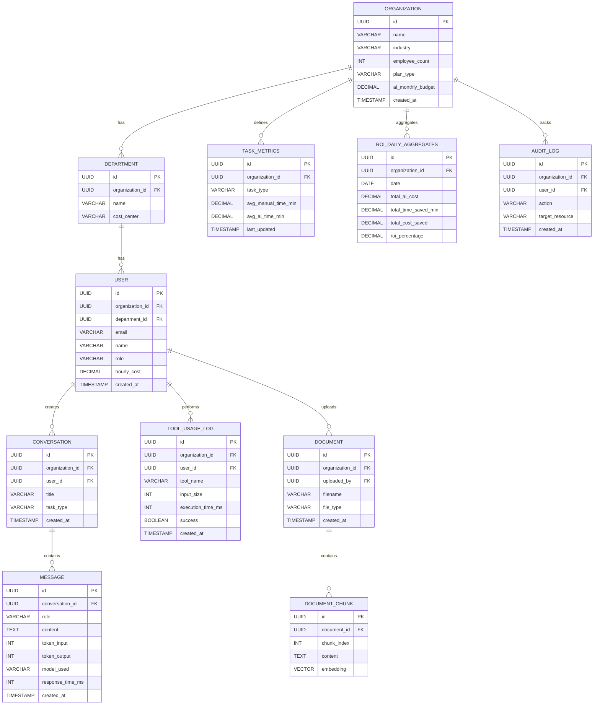

# H Chat ROI 대시보드 화면 설계

> 작성일: 2026-03-02
> 참고: roi.wrks.ai (웍스AI 생산성 대시보드), Microsoft Viva Insights Copilot Dashboard

---

## 1. 개요

### 1.1 목적

H Chat 서비스의 **AI 도입 ROI(투자 대비 효과)**를 정량적으로 측정하고 시각화하는 관리자 대시보드.

- 직원: AI로 업무 생산성 향상
- 관리자: 부서별/사용자별 AI 활용도 모니터링
- 경영진: AI 도입의 비용 대비 가치를 수치로 확인

### 1.2 벤치마크 분석

| 도구 | 사용 지표 | 생산성 지표 | ROI 자동 계산 | 조직별 분석 | 핵심 강점 |
|------|-----------|-------------|---------------|-------------|-----------|
| Microsoft Copilot Dashboard | ★★★ | ★★★ | ✅ | ★★★ | 가장 포괄적, 과학적 방법론 |
| 웍스AI (roi.wrks.ai) | ★★ | ★★ | ✅ | ★★ | 한국 기업 특화, 로컬 분석 |
| Notion AI Analytics | ★★ | ★ | ✅ | ★★ | 권한 관리 우수 |
| ChatGPT Team Analytics | ★ | ★ | ❌ | ★ | 대화형 AI 특화 |
| **H Chat ROI (목표)** | ★★★ | ★★★ | ✅ | ★★★ | 멀티모델 + 한국 기업 특화 |

### 1.3 차별화 포인트

- **멀티 AI 모델 비용 최적화**: Claude/GPT/Gemini 모델별 비용 대비 효과 비교
- **한국 기업 맞춤**: 원화(₩) 기반, 직급 체계, 부서 구조 반영
- **실시간 + 행동 유도**: 단순 보고를 넘어 개선 제안 제공
- **로컬 분석 옵션**: 대화 내용은 서버에 보내지 않고 메타데이터만 분석

---

## 2. 정보 아키텍처 (IA)

```
H Chat ROI Dashboard
├── 📊 개요 (Overview)                 ← 메인 랜딩
├── 📈 도입 현황 (Adoption)
│   ├── 사용자 활성화율
│   ├── 기능별 채택률
│   └── 사용 빈도 분포
├── ⏱️ 생산성 효과 (Productivity)
│   ├── 시간 절감 분석
│   ├── 작업 유형별 효과
│   └── AI 지원 시간 추이
├── 💰 ROI 분석 (ROI)
│   ├── 비용 대비 효과
│   ├── ROI 시뮬레이터
│   └── 부서별 ROI 비교
├── 🏢 조직 분석 (Organization)
│   ├── 부서별 비교
│   ├── 직급별 활용도
│   └── 모델별 사용 비율
├── 😊 만족도 (Sentiment)
│   ├── 설문 결과
│   └── NPS 추이
├── 📋 리포트 (Reports)
│   ├── 월간 리포트 자동 생성
│   └── PDF 다운로드
└── ⚙️ 설정 (Settings)
    ├── ROI 계산 파라미터
    ├── 데이터 소스 연결
    └── 권한 관리
```

---

## 3. 화면별 상세 설계

### 3.1 개요 (Overview)

**목적**: 경영진이 5초 안에 AI 도입 효과를 파악

#### 레이아웃

```
┌─────────────────────────────────────────────────────────┐
│  H Chat ROI Dashboard          [기간 선택] [부서 필터]    │
├─────────────────────────────────────────────────────────┤
│                                                         │
│  ┌──────────┐ ┌──────────┐ ┌──────────┐ ┌──────────┐   │
│  │ 총 절감   │ │ 총 비용   │ │  ROI     │ │ 활성     │   │
│  │ 시간     │ │  절감     │ │         │ │ 사용률   │   │
│  │ 2,450h   │ │ ₩127M   │ │  340%   │ │  78%    │   │
│  │ ▲12%    │ │ ▲18%    │ │ ▲45%   │ │ ▲5%    │   │
│  └──────────┘ └──────────┘ └──────────┘ └──────────┘   │
│                                                         │
│  ┌────────────────────────┐ ┌────────────────────────┐  │
│  │  시간 절감 추이 (6개월)   │ │  모델별 비용 효율      │  │
│  │  [라인 차트]             │ │  [도넛 차트]           │  │
│  │                        │ │  Claude 45%           │  │
│  │                        │ │  GPT-4   30%          │  │
│  │                        │ │  Gemini  15%          │  │
│  │                        │ │  기타    10%           │  │
│  └────────────────────────┘ └────────────────────────┘  │
│                                                         │
│  ┌────────────────────────┐ ┌────────────────────────┐  │
│  │  부서별 ROI 순위        │ │  AI 인사이트 카드       │  │
│  │  [수평 바 차트]          │ │                       │  │
│  │  개발팀    ████████ 520%│ │  💡 마케팅팀 사용률     │  │
│  │  마케팅팀  ██████ 380%  │ │     전월 대비 23% 증가  │  │
│  │  영업팀    █████ 290%   │ │                       │  │
│  │  기획팀    ████ 210%    │ │  ⚠️ 인사팀 비활성      │  │
│  │  인사팀    ██ 120%      │ │     사용자 12명 미사용   │  │
│  └────────────────────────┘ └────────────────────────┘  │
└─────────────────────────────────────────────────────────┘
```

#### KPI 카드 (4개)

| KPI | 설명 | 계산식 |
|-----|------|--------|
| **총 절감 시간** | AI 사용으로 절약된 총 시간 | Σ(수동 작업시간 - AI 작업시간) |
| **총 비용 절감** | 시간 절감의 금전적 가치 | 절감 시간 × 평균 시급 |
| **ROI** | 투자 대비 효과 | (절감 가치 - AI 비용) / AI 비용 × 100 |
| **활성 사용률** | 실제 사용 중인 사용자 비율 | 활성 사용자 / 전체 라이선스 × 100 |

#### 인사이트 카드

AI가 자동 생성하는 행동 유도형 카드:
- 긍정 트렌드: "마케팅팀 사용률 전월 대비 23% 증가"
- 개선 제안: "인사팀 비활성 사용자 12명에게 교육 제안"
- 비용 최적화: "Gemini Flash로 전환 시 월 ₩2.4M 절감 예상"

---

### 3.2 도입 현황 (Adoption)

**목적**: AI 도구가 조직에 얼마나 침투했는지 측정

#### 레이아웃

```
┌─────────────────────────────────────────────────────────┐
│  도입 현황                    [기간] [부서] [직급]       │
├─────────────────────────────────────────────────────────┤
│                                                         │
│  ┌──────────┐ ┌──────────┐ ┌──────────┐ ┌──────────┐   │
│  │ 전체     │ │ 활성     │ │ 비활성   │ │ 지속     │   │
│  │ 라이선스  │ │ 사용자   │ │ 사용자   │ │ 사용률   │   │
│  │ 280명    │ │ 218명    │ │ 62명    │ │  82%    │   │
│  └──────────┘ └──────────┘ └──────────┘ └──────────┘   │
│                                                         │
│  사용자 세분화                                           │
│  ┌─────────────────────────────────────────────────┐    │
│  │  [스택 바 차트 - 사용 빈도별]                      │    │
│  │                                                 │    │
│  │  헤비 (11+회/주)  ████████████████  35%         │    │
│  │  보통 (6-10회/주) ████████████  28%             │    │
│  │  가벼움 (1-5회/주) ██████████  22%              │    │
│  │  비활성           █████████  15%                │    │
│  └─────────────────────────────────────────────────┘    │
│                                                         │
│  기능별 채택률                                           │
│  ┌─────────────────────────────────────────────────┐    │
│  │  AI 채팅          ████████████████████  92%     │    │
│  │  그룹 채팅         ██████████████  68%          │    │
│  │  PDF 분석          ████████████  58%            │    │
│  │  코드 리뷰         ██████████  48%              │    │
│  │  YouTube 분석      ████████  38%                │    │
│  │  에이전트 도구      ██████  28%                  │    │
│  │  검색 AI 카드      █████  24%                   │    │
│  │  글쓰기 어시스턴트  ████  18%                    │    │
│  └─────────────────────────────────────────────────┘    │
│                                                         │
│  활성 사용자 추이 (12주)                                 │
│  ┌─────────────────────────────────────────────────┐    │
│  │  [라인 차트 - 주간 활성 사용자 수]                  │    │
│  └─────────────────────────────────────────────────┘    │
└─────────────────────────────────────────────────────────┘
```

#### 주요 지표

| 지표 | 정의 | 계산 |
|------|------|------|
| 활성 사용자 | 최근 28일 내 1회 이상 사용 | COUNT(users WHERE last_used > NOW()-28d) |
| 헤비 사용자 | 주 11회 이상 사용 | COUNT(users WHERE weekly_actions >= 11) |
| 지속 사용률 | 이번 달과 지난 달 모두 사용 | 재사용자 / 전월 활성 사용자 × 100 |
| 기능 채택률 | 특정 기능을 1회 이상 사용한 비율 | 기능별 사용자 / 전체 활성 × 100 |

---

### 3.3 생산성 효과 (Productivity)

**목적**: AI가 실제로 얼마나 시간을 절약해주는지 정량 측정

#### 레이아웃

```
┌─────────────────────────────────────────────────────────┐
│  생산성 효과                  [기간] [부서] [기능]       │
├─────────────────────────────────────────────────────────┤
│                                                         │
│  ┌──────────┐ ┌──────────┐ ┌──────────┐ ┌──────────┐   │
│  │ AI 지원  │ │ 평균     │ │ 작업당   │ │ 자동화   │   │
│  │ 총 시간  │ │ 응답속도  │ │ 절감시간  │ │   률    │   │
│  │ 2,450h  │ │ 3.2초   │ │ 12분    │ │  45%    │   │
│  └──────────┘ └──────────┘ └──────────┘ └──────────┘   │
│                                                         │
│  작업 유형별 시간 절감                                    │
│  ┌─────────────────────────────────────────────────┐    │
│  │  작업 유형       │ 수동 평균 │ AI 평균 │ 절감률  │    │
│  │  ─────────────  │─────────│────────│───────│    │
│  │  이메일 작성     │  15분    │  3분   │  80%  │    │
│  │  문서 요약       │  30분    │  5분   │  83%  │    │
│  │  코드 리뷰       │  45분    │  15분  │  67%  │    │
│  │  회의록 요약     │  20분    │  2분   │  90%  │    │
│  │  데이터 분석     │  60분    │  20분  │  67%  │    │
│  │  번역           │  25분    │  3분   │  88%  │    │
│  └─────────────────────────────────────────────────┘    │
│                                                         │
│  ┌────────────────────────┐ ┌────────────────────────┐  │
│  │  주간 AI 지원 시간 추이  │ │  기능별 시간 절감 비중   │  │
│  │  [에어리어 차트]         │ │  [스택 바 차트]         │  │
│  └────────────────────────┘ └────────────────────────┘  │
└─────────────────────────────────────────────────────────┘
```

#### AI 지원 시간 계산식 (Microsoft 방법론 차용)

```
AI 지원 시간 = A + B + C + D

A = 회의록 요약으로 절감한 시간 (실제 회의 길이)
B = 검색/요약 액션 × 6분 (163명 연구 기반)
C = 작성/생성 액션 × 6분 (147명 연구 기반)
D = 코드 리뷰 액션 × 15분 (자체 기준)
```

---

### 3.4 ROI 분석 (ROI)

**목적**: AI 투자의 재무적 효과를 경영진에게 보고

#### 레이아웃

```
┌─────────────────────────────────────────────────────────┐
│  ROI 분석                    [기간] [부서] [시나리오]    │
├─────────────────────────────────────────────────────────┤
│                                                         │
│  ┌──────────────────────────────────────────────────┐   │
│  │              이번 달 ROI 요약                      │   │
│  │  ┌──────┐  ┌──────┐  ┌──────┐  ┌──────┐        │   │
│  │  │AI비용│  │절감가치│  │순이익 │  │ ROI  │        │   │
│  │  │₩37M │→│₩164M │→│₩127M│→│ 340% │        │   │
│  │  └──────┘  └──────┘  └──────┘  └──────┘        │   │
│  └──────────────────────────────────────────────────┘   │
│                                                         │
│  비용 구성                                               │
│  ┌─────────────────────────────────────────────────┐    │
│  │  모델     │ 토큰 사용량 │ 비용    │ 절감 가치 │ ROI │    │
│  │  ────────│──────────│───────│────────│─────│    │
│  │  Claude  │ 1.2M     │ ₩18M │ ₩82M  │ 356%│    │
│  │  GPT-4   │ 0.8M     │ ₩12M │ ₩52M  │ 333%│    │
│  │  Gemini  │ 0.5M     │ ₩4M  │ ₩22M  │ 450%│    │
│  │  Haiku   │ 0.3M     │ ₩3M  │ ₩8M   │ 167%│    │
│  └─────────────────────────────────────────────────┘    │
│                                                         │
│  ROI 시뮬레이터                                          │
│  ┌─────────────────────────────────────────────────┐    │
│  │  시간당 평균 인건비: [₩ 45,000  ] (조정 가능)     │    │
│  │  월 AI 예산:        [₩ 37,000,000]              │    │
│  │  예상 활성 사용자:   [218명      ]               │    │
│  │                                                 │    │
│  │  [시뮬레이션 결과]                                │    │
│  │  예상 연간 ROI: 340% → 절감 가치 ₩1,968M       │    │
│  │  투자 회수 기간: 2.1개월                         │    │
│  │  사용자당 연간 가치: ₩9.0M                       │    │
│  └─────────────────────────────────────────────────┘    │
│                                                         │
│  ┌────────────────────────┐ ┌────────────────────────┐  │
│  │  월별 ROI 추이          │ │  누적 절감 금액         │  │
│  │  [라인+바 콤보 차트]     │ │  [에어리어 차트]        │  │
│  └────────────────────────┘ └────────────────────────┘  │
└─────────────────────────────────────────────────────────┘
```

#### ROI 계산 공식

```
ROI (%) = (총 절감 가치 - 총 AI 비용) / 총 AI 비용 × 100

총 AI 비용 = Σ(모델별 토큰 사용량 × 모델 단가) + 인프라 비용
총 절감 가치 = AI 지원 시간 × 시간당 평균 인건비

시간당 평균 인건비 기본값: ₩45,000 (한국 사무직 평균)
직급별 차등 가능: 사원 ₩25,000 ~ 임원 ₩150,000
```

#### 모델별 토큰 단가 (USD per 1M tokens)

| 모델 | Input | Output | 비고 |
|------|-------|--------|------|
| Claude Sonnet 4.6 | $3 | $15 | 메인 코딩 |
| Claude Opus 4.6 | $15 | $75 | 고급 분석 |
| Claude Haiku 4.5 | $0.8 | $4 | 경량 작업 |
| GPT-4o | $2.5 | $10 | 범용 |
| GPT-4o mini | $0.15 | $0.6 | 비용 효율 |
| Gemini Flash 2.0 | Free | Free | 무료 |
| Gemini Pro 1.5 | $1.25 | $5 | 중급 |

---

### 3.5 조직 분석 (Organization)

**목적**: 부서/직급별 AI 활용도와 효과 비교

#### 레이아웃

```
┌─────────────────────────────────────────────────────────┐
│  조직 분석                   [기간] [비교 기준]          │
├─────────────────────────────────────────────────────────┤
│                                                         │
│  부서별 히트맵                                           │
│  ┌─────────────────────────────────────────────────┐    │
│  │          │ 사용률 │ 절감시간 │ ROI   │ 만족도  │    │
│  │  ────────│──────│───────│──────│──────│        │
│  │  개발팀  │ 🟢95%│ 🟢520h│ 🟢520%│ 🟢4.5│        │
│  │  마케팅  │ 🟢88%│ 🟡320h│ 🟢380%│ 🟢4.2│        │
│  │  영업팀  │ 🟡72%│ 🟡280h│ 🟡290%│ 🟡3.8│        │
│  │  기획팀  │ 🟡65%│ 🟡220h│ 🟡210%│ 🟡3.5│        │
│  │  인사팀  │ 🔴42%│ 🔴120h│ 🔴120%│ 🟡3.2│        │
│  └─────────────────────────────────────────────────┘    │
│                                                         │
│  ┌────────────────────────┐ ┌────────────────────────┐  │
│  │  직급별 활용도          │ │  기능별 선호도 (버블)    │  │
│  │  [그룹 바 차트]         │ │  [버블 차트]            │  │
│  │  임원   ████  35%      │ │  x: 사용 빈도          │  │
│  │  팀장   ████████ 72%   │ │  y: 시간 절감          │  │
│  │  대리   ██████████ 88% │ │  크기: 사용자 수        │  │
│  │  사원   ████████████95%│ │                        │  │
│  └────────────────────────┘ └────────────────────────┘  │
│                                                         │
│  모델별 사용 비율                                        │
│  ┌─────────────────────────────────────────────────┐    │
│  │  [파이 차트]  Claude 3.5 Sonnet   45%           │    │
│  │              GPT-4o              30%           │    │
│  │              Gemini Pro          15%           │    │
│  │              Claude Haiku         8%           │    │
│  │              GPT-4o mini          2%           │    │
│  └─────────────────────────────────────────────────┘    │
└─────────────────────────────────────────────────────────┘
```

---

### 3.6 만족도 (Sentiment)

**목적**: 정성적 효과 측정 + 개선점 도출

#### 레이아웃

```
┌─────────────────────────────────────────────────────────┐
│  만족도 분석                  [기간] [부서]              │
├─────────────────────────────────────────────────────────┤
│                                                         │
│  ┌──────────┐ ┌──────────┐ ┌──────────┐ ┌──────────┐   │
│  │   NPS    │ │ 업무품질  │ │ 속도향상  │ │ 부담경감  │   │
│  │   +42    │ │ 향상 72% │ │ 체감 68% │ │ 체감 74% │   │
│  └──────────┘ └──────────┘ └──────────┘ └──────────┘   │
│                                                         │
│  설문 항목별 결과                                         │
│  ┌─────────────────────────────────────────────────┐    │
│  │  "AI가 업무 품질 향상에 도움"        ████████ 72%│    │
│  │  "단순 반복 작업 부담 경감"          █████████ 74%│    │
│  │  "작업 완료 속도 향상"              ███████ 68% │    │
│  │  "전반적 생산성 향상 체감"          ████████ 70% │    │
│  │  "동료에게 추천하겠다"              ████████ 72% │    │
│  └─────────────────────────────────────────────────┘    │
│                                                         │
│  ┌────────────────────────┐ ┌────────────────────────┐  │
│  │  NPS 추이 (6개월)       │ │  부서별 만족도 비교     │  │
│  │  [라인 차트]             │ │  [레이더 차트]          │  │
│  └────────────────────────┘ └────────────────────────┘  │
│                                                         │
│  개선 요청 TOP 5                                         │
│  ┌─────────────────────────────────────────────────┐    │
│  │  1. 한국어 응답 품질 개선 (42건)                   │    │
│  │  2. 응답 속도 개선 (38건)                         │    │
│  │  3. 파일 첨부 크기 제한 확대 (25건)                │    │
│  │  4. 프롬프트 템플릿 확대 (22건)                    │    │
│  │  5. 오프라인 모드 지원 (15건)                      │    │
│  └─────────────────────────────────────────────────┘    │
└─────────────────────────────────────────────────────────┘
```

---

### 3.7 리포트 (Reports)

**목적**: 경영진/이사회 보고용 자동 리포트

#### 기능

| 기능 | 설명 |
|------|------|
| **월간 리포트** | 매월 1일 자동 생성, 전월 AI 도입 효과 요약 |
| **PDF 다운로드** | 브랜드 커버 + 차트 + 요약 텍스트 |
| **커스텀 리포트** | 기간/부서/지표 선택하여 맞춤 리포트 |
| **이메일 예약** | 경영진에게 주간/월간 자동 발송 |
| **비교 리포트** | 전월 대비, 전분기 대비 변화 분석 |

#### 리포트 구조

```
[H Chat 로고]

월간 AI 생산성 리포트
2026년 2월

━━━━━━━━━━━━━━━━━━━━━

핵심 요약
• 총 절감 시간: 2,450시간 (▲12%)
• ROI: 340% (▲45%p)
• 활성 사용률: 78% (▲5%p)
• 총 비용 절감: ₩127M

부서별 TOP 3
1. 개발팀 - ROI 520%
2. 마케팅팀 - ROI 380%
3. 영업팀 - ROI 290%

개선 제안
• 인사팀 교육 프로그램 실시 권장
• Gemini Flash 전환으로 ₩2.4M/월 절감 가능

[차트 1: ROI 추이]
[차트 2: 부서별 비교]
[차트 3: 기능별 사용량]
```

---

### 3.8 설정 (Settings)

**목적**: ROI 계산 파라미터 및 데이터 소스 관리

#### 설정 항목

| 카테고리 | 항목 | 기본값 | 설명 |
|----------|------|--------|------|
| **ROI 파라미터** | 시간당 평균 인건비 | ₩45,000 | 조직 평균 |
| | 직급별 인건비 설정 | 사용 | 사원~임원 차등 |
| | 통화 단위 | KRW (₩) | USD, EUR 선택 가능 |
| | ROI 계산 주기 | 월간 | 일/주/월 |
| **데이터 소스** | H Chat API 연결 | 활성 | 사용 로그 수집 |
| | CSV 업로드 | 지원 | 수동 데이터 가져오기 |
| | 설문 수집 주기 | 월 1회 | 만족도 설문 자동 발송 |
| **비용 설정** | 모델별 단가 | 자동 | API 기반 실시간 반영 |
| | 월 예산 한도 | ₩50M | 예산 초과 알림 |
| | 인프라 비용 포함 | 비활성 | 서버/스토리지 비용 |
| **알림** | ROI 목표 달성 알림 | 300% | 목표 ROI |
| | 비활성 사용자 알림 | 30일 | 미사용 경과일 |
| | 예산 초과 경고 | 80% | 임계값 |
| **권한** | 경영진 | 전사 데이터 | 모든 부서 조회 |
| | 부서장 | 소속 부서 | 자기 부서만 |
| | 일반 사용자 | 본인 | 개인 통계만 |

---

## 4. 공통 UI/UX 컴포넌트

### 4.1 필수 컴포넌트

| 컴포넌트 | 용도 | 예시 |
|----------|------|------|
| **KPI Card** | 핵심 지표 강조 | 숫자 + 트렌드 화살표 + 전월 대비 변화 |
| **Line Chart** | 시계열 추이 | 주간/월간 사용량 추이 |
| **Bar Chart** | 카테고리 비교 | 부서별 ROI, 기능별 사용량 |
| **Donut Chart** | 비율 표시 | 모델별 비용 비중 |
| **Heatmap** | 2차원 비교 | 부서 × 지표 히트맵 |
| **Data Table** | 상세 데이터 | 사용자별/부서별 상세 |
| **Date Range Picker** | 기간 선택 | 이번 달, 지난 3개월, 커스텀 |
| **Filter Dropdown** | 필터링 | 부서, 직급, 기능 필터 |
| **Insight Card** | AI 자동 인사이트 | 행동 유도형 카드 |
| **Progress Bar** | 목표 달성률 | ROI 목표 대비 현재 |
| **Bubble Chart** | 다차원 비교 | 기능별 사용빈도 × 절감시간 × 사용자수 |
| **Radar Chart** | 다항목 비교 | 부서별 만족도 항목 비교 |

### 4.2 인터랙션

- **드릴다운**: KPI 카드 클릭 → 상세 페이지로 이동
- **호버 툴팁**: 차트 위 마우스 오버 시 상세 수치
- **필터 연동**: 부서/기간 필터 변경 시 모든 차트 동기화
- **PDF 내보내기**: 현재 화면을 PDF로 저장
- **데이터 내보내기**: CSV/Excel 다운로드

---

## 5. 데이터 모델

### 5.1 ER 다이어그램



### 5.2 핵심 테이블 요약

| 테이블 | 목적 | 주요 컬럼 |
|--------|------|-----------|
| ORGANIZATION | 조직 정보 | name, industry, employee_count, ai_monthly_budget |
| DEPARTMENT | 부서 | name, cost_center |
| USER | 사용자 | email, role, hourly_cost |
| CONVERSATION | 대화 세션 | title, task_type |
| MESSAGE | 메시지 (비용 추적 핵심) | token_input, token_output, model_used, response_time_ms |
| TOOL_USAGE_LOG | 도구 사용 로그 | tool_name, execution_time_ms, success |
| DOCUMENT | 업로드 문서 | filename, file_type |
| DOCUMENT_CHUNK | 문서 청크 (RAG) | chunk_index, content, embedding |
| TASK_METRICS | 작업 기준 시간 (ROI 계산용) | avg_manual_time_min, avg_ai_time_min |
| ROI_DAILY_AGGREGATES | 일별 ROI 집계 | total_ai_cost, total_time_saved_min, total_cost_saved, roi_percentage |
| AUDIT_LOG | 감사 로그 | action, target_resource |

### 5.2 ROI 배치 계산 흐름

```
[매일 00:00 배치 실행]
     ↓
1. messages 테이블에서 전일 토큰 사용량 집계
     ↓
2. 모델별 단가 × 토큰 → total_ai_cost
     ↓
3. task_metrics 기준으로 AI 지원 시간 산출
     ↓
4. AI 지원 시간 × 사용자별 시급 → total_cost_saved
     ↓
5. roi_daily_aggregates에 저장
     ↓
6. 월초: 월간 리포트 자동 생성
```

---

## 6. 기술 스택 제안

| 영역 | 기술 | 이유 |
|------|------|------|
| **프론트엔드** | Next.js 16 + Tailwind CSS 4 | 기존 모노레포 구조 활용 |
| **차트 라이브러리** | Recharts 또는 ECharts | React 호환, 커스터마이징 |
| **상태 관리** | TanStack Query | 서버 상태 캐싱 |
| **백엔드** | Next.js API Routes 또는 FastAPI | 정적 데이터는 Next.js, 복잡한 집계는 FastAPI |
| **DB** | PostgreSQL + pgvector | ROI 집계 + RAG 벡터 |
| **캐시** | Redis | 대시보드 응답 속도 |
| **배치** | Node.js cron 또는 pg_cron | ROI 일별 집계 |
| **PDF 생성** | Puppeteer 또는 @react-pdf/renderer | 리포트 PDF |
| **인증** | NextAuth.js | SSO 연동 |

---

## 7. 구현 로드맵

### Phase 1: MVP (4주)

| 주차 | 작업 |
|------|------|
| 1주 | DB 스키마 + mock 데이터 생성 |
| 2주 | 개요 페이지 (KPI 카드 4개 + 기본 차트 2개) |
| 3주 | 도입 현황 + 생산성 효과 페이지 |
| 4주 | ROI 분석 페이지 + 기본 필터링 |

### Phase 2: 핵심 기능 (4주)

| 주차 | 작업 |
|------|------|
| 5주 | 조직 분석 (부서별/직급별 히트맵) |
| 6주 | 설정 페이지 + ROI 시뮬레이터 |
| 7주 | PDF 리포트 자동 생성 |
| 8주 | 만족도 설문 + 결과 시각화 |

### Phase 3: 엔터프라이즈 (4주)

| 주차 | 작업 |
|------|------|
| 9주 | 실데이터 연동 (H Chat API) |
| 10주 | 권한 관리 (경영진/부서장/일반) |
| 11주 | AI 인사이트 카드 (자동 제안) |
| 12주 | 이메일 리포트 + 알림 시스템 |

---

## 8. 모노레포 통합 방안

기존 hchat-wiki 모노레포에 `apps/roi` 앱으로 추가:

```
hchat-wiki/
├── packages/
│   ├── tokens/          # 기존 디자인 토큰 재사용
│   └── ui/              # 기존 UI 컴포넌트 + ROI 전용 추가
│       └── src/
│           └── roi/     # ROI 전용 차트/위젯 컴포넌트
├── apps/
│   ├── wiki/
│   ├── hmg/
│   ├── admin/
│   ├── storybook/
│   └── roi/             # ← 신규 ROI 대시보드 앱
│       ├── app/
│       │   ├── layout.tsx
│       │   ├── page.tsx           # 개요
│       │   ├── adoption/page.tsx  # 도입 현황
│       │   ├── productivity/page.tsx
│       │   ├── roi/page.tsx
│       │   ├── organization/page.tsx
│       │   ├── sentiment/page.tsx
│       │   ├── reports/page.tsx
│       │   └── settings/page.tsx
│       └── components/
```

npm 스크립트 추가:
```bash
npm run dev:roi          # ROI dev (localhost:3003)
npm run build:roi        # ROI 빌드
```
