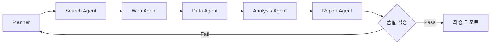
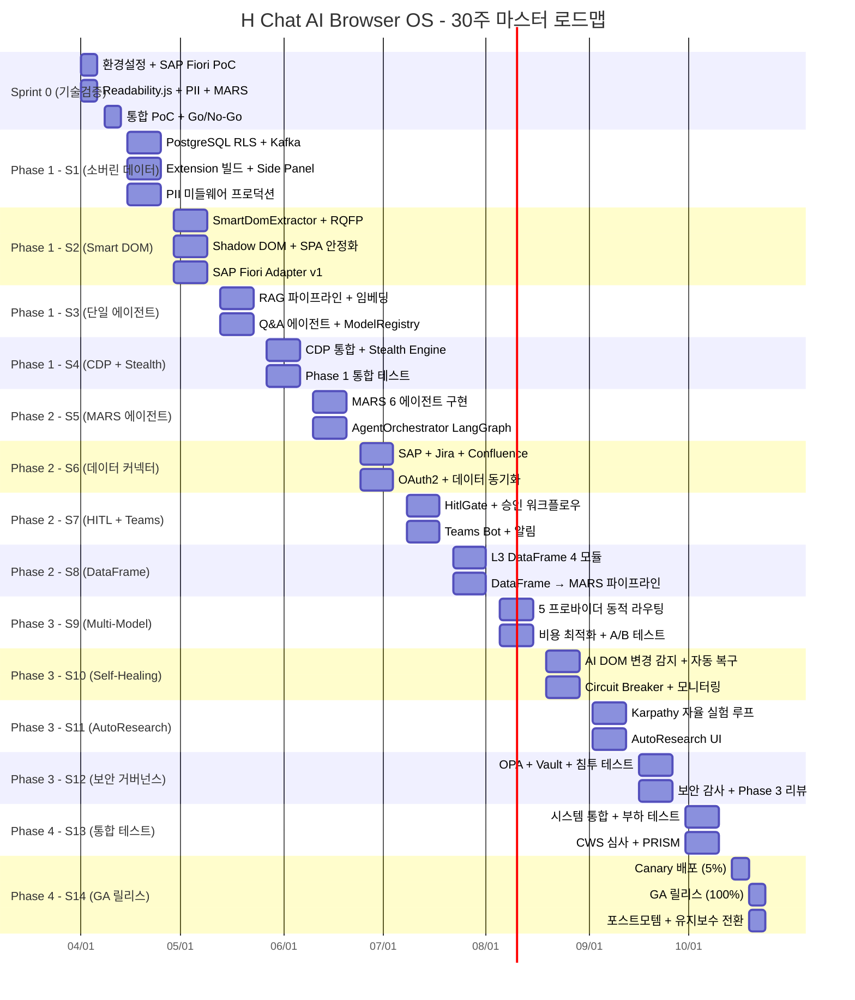
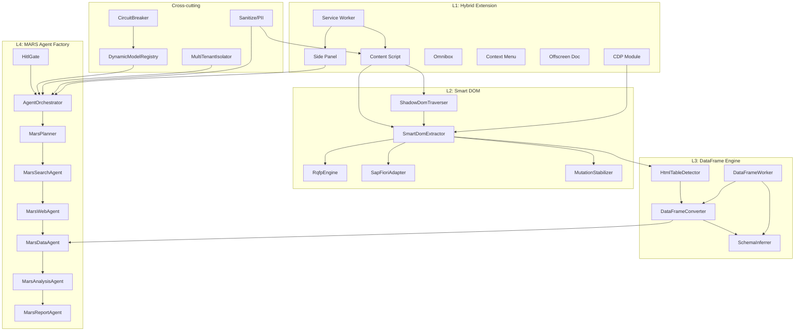
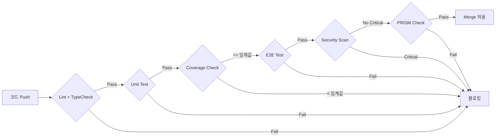

# H Chat AI Browser OS - 구현 로드맵

> **문서 버전**: v1.0 | **최종 수정**: 2026-03-15 | **작성**: H Chat Platform Team
> **상태**: Approved | **분류**: Internal - Confidential

---

## 목차

1. [Executive Summary](#1-executive-summary)
2. [프로젝트 개요](#2-프로젝트-개요)
3. [Sprint 0: MVP 기술검증 (2주)](#3-sprint-0-mvp-기술검증-2주)
4. [Phase 1: 기반 구축 (8주, S1-S4)](#4-phase-1-기반-구축-8주-s1-s4)
5. [Phase 2: 핵심 기능 (8주, S5-S8)](#5-phase-2-핵심-기능-8주-s5-s8)
6. [Phase 3: 통합 및 최적화 (8주, S9-S12)](#6-phase-3-통합-및-최적화-8주-s9-s12)
7. [Phase 4: 프로덕션 (4주, S13-S14)](#7-phase-4-프로덕션-4주-s13-s14)
8. [마스터 Gantt 차트](#8-마스터-gantt-차트)
9. [의존성 관리](#9-의존성-관리)
10. [인력 배치 계획](#10-인력-배치-계획)
11. [품질 게이트](#11-품질-게이트)
12. [리스크 대응 타임라인](#12-리스크-대응-타임라인)
13. [예산 집행 계획](#13-예산-집행-계획)
14. [부록: 핵심 수치 빠른 참조](#14-부록-핵심-수치-빠른-참조)

---

## 1. Executive Summary

### 로드맵 한 페이지 요약

H Chat AI Browser OS는 현대차그룹 50,000명 임직원을 대상으로 한 **4-Layer 아키텍처 기반 AI 브라우저 확장 플랫폼**이다. Chrome Extension(MV3)을 진입점으로, Smart DOM 추출 → DataFrame 변환 → MARS 멀티에이전트 분석까지 **엔드투엔드 AI 워크플로우**를 30주(7.5개월) 내에 구현한다.

### 핵심 수치 대시보드

| 지표 | 값 | 비고 |
|------|-----|------|
| **총 투자** | **$645.5K** | 인건비 $573.5K + LLM $36K + 인프라 $26K + 도구 $10K |
| **기간** | **30주** | Sprint 0(2주) + Phase 1-2(16주) + Phase 3-4(12주) |
| **팀 규모** | **13명** | PM 1 + FE 3 + BE 3 + ML 2 + Infra 1 + QA 1 + 유지보수 2 |
| **스토리 포인트** | **315+ SP** | 15 에픽, 59+ 스토리 |
| **신규 모듈** | **19개** | ~6,100줄 신규 코드 |
| **기존 자산 재활용** | **12개** | useCircuitBreaker, sanitize.ts 등 |
| **Break-even** | **12-14개월** | 투자 회수 시점 |
| **3년 ROI** | **220-270%** | 연간 절감 $550K 기준 |
| **24개월 ARR** | **$12.1M** | 그룹사 확대 포함 |
| **타겟 DAU** | **5,200명** | 12개월 시점 (50,000명 중 10.4%) |

### Phase별 진행 요약

```
Sprint 0 ─── Phase 1 ────── Phase 2 ────── Phase 3 ────── Phase 4
 (2주)       (8주)           (8주)           (8주)           (4주)
 $37.4K      ──── $337.5K ────              ──── $270.6K ────
 기술검증     기반 구축        핵심 기능        통합/최적화      프로덕션
 42태스크     31 스토리       S5-S8           S9-S12          S13-S14
             153 SP          162 SP (P2+P3)                  GA 릴리스
```

---

## 2. 프로젝트 개요

### 2.1 비전

> **"현대차그룹 임직원의 일상 업무를 AI로 혁신하는 브라우저 네이티브 플랫폼"**

기존 단일 챗봇 인터페이스를 넘어, 브라우저에서 직접 웹 페이지를 이해하고, 데이터를 추출·분석하며, 멀티에이전트가 협업하여 리서치 보고서를 자동 생성하는 **AI Browser OS**를 구축한다.

### 2.2 4-Layer 아키텍처

| Layer | 명칭 | 핵심 기술 | 비용/성능 |
|-------|------|-----------|-----------|
| **L1** | Hybrid Extension | Chrome MV3, Side Panel, Service Worker, Content Script, Omnibox, Context Menu, Offscreen Doc, CDP | 기반 인프라 |
| **L2** | Smart DOM | Readability.js, RQFP Engine, Shadow DOM Traverser, SAP Fiori Adapter, MutationStabilizer | $0.12/작업 |
| **L3** | DataFrame Engine | HtmlTableDetector, DataFrameConverter, SchemaInferrer, DataFrameWorker | ~1,150줄 |
| **L4** | MARS Agent Factory | LangGraph 6단계 (Planner→Search→Web→Data→Analysis→Report) | $0.27/세션 |

### 2.3 Cross-cutting Concerns

| 영역 | 상세 |
|------|------|
| **Dynamic Multi-Model** | 5 프로바이더: Anthropic Opus 4.6, OpenAI GPT-5.2, Google Gemini 2.5, xAI Grok 3, Local Nano |
| **Self-Healing** | 3-Strike Circuit Breaker, 300s cooldown, AI DOM 변경 자동 감지 |
| **Zero Trust** | PII 11패턴, 블록리스트 20+6, SHA-256 감사로그, OPA+Vault |

### 2.4 목표 및 성공 기준

| 카테고리 | 목표 | 측정 기준 |
|----------|------|-----------|
| **비즈니스** | 업무 생산성 20% 향상 | 주간 AI 활용 시간 측정 |
| **기술** | Smart DOM 정확도 95%+ | RQFP 벤치마크 |
| **비용** | MARS 세션당 $0.15 이하 (최적화 후) | LLM 비용 모니터링 |
| **채택** | 12개월 DAU 5,200명+ | 사용자 활성 데이터 |
| **보안** | Zero 보안 인시던트 | 침투 테스트 + 감사 |
| **품질** | 테스트 커버리지 85%+ | 자동화 리포트 |

### 2.5 신규 모듈 19개 요약

| Layer | 모듈명 | 예상 코드량 |
|-------|--------|------------|
| **L2** | SmartDomExtractor | ~300줄 |
| **L2** | RqfpEngine | ~350줄 |
| **L2** | ShadowDomTraverser | ~250줄 |
| **L2** | SapFioriAdapter | ~350줄 |
| **L2** | MutationStabilizer | ~250줄 |
| **L3** | HtmlTableDetector | ~300줄 |
| **L3** | DataFrameConverter | ~300줄 |
| **L3** | SchemaInferrer | ~250줄 |
| **L3** | DataFrameWorker | ~300줄 |
| **L4** | MarsPlanner | ~350줄 (Python) |
| **L4** | MarsSearchAgent | ~350줄 (Python) |
| **L4** | MarsWebAgent | ~350줄 (Python) |
| **L4** | MarsDataAgent | ~300줄 (Python) |
| **L4** | MarsAnalysisAgent | ~350줄 (Python) |
| **L4** | MarsReportAgent | ~350줄 (Python) |
| **L4** | HitlGate | ~300줄 (Python) |
| **L4** | AgentOrchestrator | ~350줄 (Python) |
| **Infra** | DynamicModelRegistry | ~400줄 |
| **Infra** | MultiTenantIsolator | ~350줄 |
| | **합계** | **~6,100줄** |

### 2.6 기존 자산 재활용 (12개)

| 자산 | 출처 | 재활용 방식 |
|------|------|------------|
| useCircuitBreaker | packages/ui/src/hooks/ | Self-Healing 기반 |
| useHealthMonitor | packages/ui/src/hooks/ | 서비스 헬스체크 |
| sanitize.ts | packages/ui/src/utils/ | PII 필터링 확장 |
| ServiceFactory | packages/ui/src/client/ | API 클라이언트 패턴 |
| apps/ai-core | apps/ai-core/ | MARS 백엔드 기반 |
| apps/extension | apps/extension/ | L1 Extension 기반 |
| workerUtils | packages/ui/src/utils/ | DataFrameWorker 기반 |
| EventBusProvider | packages/ui/src/hooks/ | 에이전트 간 통신 |
| useOfflineQueue | packages/ui/src/hooks/ | 오프라인 큐잉 |
| mocks/handlers | packages/ui/src/mocks/ | 테스트 모킹 |
| schemas/ | packages/ui/src/schemas/ | Zod 검증 확장 |
| docker/init.sql | docker/ | DB 스키마 기반 |

---

## 3. Sprint 0: MVP 기술검증 (2주)

### 3.1 개요

| 항목 | 값 |
|------|-----|
| **기간** | Week 1-2 (10 영업일) |
| **예산** | $37.4K |
| **목적** | 핵심 기술 PoC + Go/No-Go 판정 |
| **태스크** | 42개 |
| **참여 인원** | 8명 (PM 1 + FE 2 + BE 2 + ML 1 + Infra 1 + QA 1) |

### 3.2 일별 상세 계획

#### Week 1 (Day 1-5)

| Day | 태스크 | 담당 | 산출물 | 완료 기준 |
|-----|--------|------|--------|-----------|
| **D1** | 환경 설정 + 저장소 구성 | Infra, FE1 | monorepo 브랜치, CI 파이프라인 | 빌드 성공 |
| **D1** | SAP Fiori 테스트 환경 준비 | BE1 | Fiori 샌드박스 접근 | 로그인 성공 |
| **D1** | MARS 비용 시뮬레이터 설계 | ML1 | 시뮬레이터 스펙 문서 | 리뷰 완료 |
| **D2** | Readability.js 통합 PoC | FE1 | DOM→텍스트 추출 데모 | 5개 사이트 테스트 |
| **D2** | SAP Fiori DOM 구조 분석 | FE2 | Fiori DOM 매핑 문서 | 주요 패턴 5개 식별 |
| **D2** | PII 11패턴 구현 | BE1 | sanitize.ts 확장 | 11패턴 유닛 테스트 |
| **D3** | RQFP 엔진 프로토타입 | FE1 | 기본 RQFP 추출기 | 정확도 70%+ |
| **D3** | Content Script 인젝션 테스트 | FE2 | MV3 Content Script | 3개 사이트 동작 |
| **D3** | LLM 비용 시뮬레이션 구현 | ML1 | 비용 계산기 | 5개 모델 비용 산출 |
| **D4** | Shadow DOM 탐색 PoC | FE1 | Shadow DOM Traverser | Open/Closed 처리 |
| **D4** | Side Panel UI 프로토타입 | FE2 | Side Panel MVP | 기본 레이아웃 |
| **D4** | MARS Planner 에이전트 스켈레톤 | BE2, ML1 | LangGraph 기본 플로우 | 단일 에이전트 동작 |
| **D5** | HTML 테이블 감지 PoC | FE1 | HtmlTableDetector v0 | 테이블 5개 정확 감지 |
| **D5** | Service Worker 메시지 라우팅 | FE2 | SW 메시지 버스 | 양방향 통신 |
| **D5** | Week 1 중간 리뷰 | PM, 전원 | 리뷰 리포트 | 블로커 식별 |

#### Week 2 (Day 6-10)

| Day | 태스크 | 담당 | 산출물 | 완료 기준 |
|-----|--------|------|--------|-----------|
| **D6** | SAP Fiori Adapter 프로토타입 | FE1, FE2 | Fiori DOM 추출기 | sap-ui-content 접근 |
| **D6** | PII 필터 E2E 파이프라인 | BE1 | PII 검출 파이프라인 | 민감 데이터 0건 통과 |
| **D6** | MARS 비용 최적화 분석 | ML1 | 비용 최적화 리포트 | $0.27 → $0.20 경로 |
| **D7** | MutationStabilizer 프로토타입 | FE1 | DOM 변경 감지기 | SPA 라우팅 감지 |
| **D7** | Chrome Storage API 통합 | FE2 | 설정 저장 모듈 | CRUD 동작 |
| **D7** | PRISM CI Gate 분석 | QA1 | PRISM 체크리스트 | 22개 항목 매핑 |
| **D8** | DataFrame 변환 PoC | FE1, BE2 | HTML→JSON 변환기 | 기본 타입 추론 |
| **D8** | Offscreen Document 테스트 | FE2 | Offscreen API 래퍼 | DOM 파싱 동작 |
| **D8** | 보안 감사로그 설계 | BE1 | 감사로그 스키마 | SHA-256 해시 |
| **D9** | 통합 PoC 데모 준비 | FE1, FE2 | 통합 데모 앱 | E2E 플로우 |
| **D9** | 성능 벤치마크 | QA1 | 성능 리포트 | 기준치 수립 |
| **D9** | MARS 2-에이전트 체이닝 | BE2, ML1 | Planner→Search 체인 | 체이닝 성공 |
| **D10** | Go/No-Go 판정 회의 | PM, 전원 | 판정 결과 문서 | 의사결정 완료 |
| **D10** | Sprint 0 회고 | PM, 전원 | 회고 리포트 | 액션 아이템 |
| **D10** | Phase 1 킥오프 준비 | PM | Phase 1 백로그 | 스토리 상세화 |

### 3.3 Go/No-Go 판정 기준

| # | 판정 항목 | Go 기준 | No-Go 시 대응 |
|---|----------|---------|---------------|
| 1 | Readability.js 정확도 | 주요 사이트 5개 중 4개 이상 성공 | 대안 라이브러리 평가 (Turndown, Mercury) |
| 2 | SAP Fiori DOM 접근 | sap-ui-content 아래 주요 컴포넌트 추출 가능 | SAP API 직접 연동 전환 |
| 3 | PII 11패턴 검출 | Precision 95%+, Recall 90%+ | 패턴 수 축소 + ML 기반 보완 |
| 4 | MARS 비용 | 시뮬레이션 결과 $0.30/세션 이하 | 모델 다운그레이드 또는 캐싱 전략 |
| 5 | PRISM CI Gate | 22개 항목 중 Critical 0건 | 아키텍처 수정 후 재심사 |
| 6 | MV3 Side Panel | 기본 UI + Content Script 통신 정상 | Popup 폴백 전략 |
| 7 | 성능 기준 | DOM 추출 < 2초, 메모리 < 100MB | Worker 오프로딩 + 점진적 추출 |

### 3.4 Sprint 0 산출물 체크리스트

- [ ] Readability.js 통합 데모
- [ ] SAP Fiori DOM 매핑 문서
- [ ] PII 11패턴 유닛 테스트 (11건 이상)
- [ ] MARS 비용 시뮬레이션 리포트
- [ ] PRISM 체크리스트 매핑 문서
- [ ] Content Script + Side Panel 통합 데모
- [ ] HTML 테이블 감지 PoC
- [ ] Shadow DOM 탐색 PoC
- [ ] MutationStabilizer 프로토타입
- [ ] 성능 벤치마크 리포트
- [ ] Go/No-Go 판정 결과 문서
- [ ] Phase 1 상세 백로그

---

## 4. Phase 1: 기반 구축 (8주, S1-S4)

### 4.1 Phase 1 개요

| 항목 | 값 |
|------|-----|
| **기간** | Week 3-10 (S1-S4, 각 2주) |
| **스토리** | 31개 |
| **스토리 포인트** | 153 SP |
| **참여 인원** | 13명 전원 |
| **핵심 목표** | 소버린 데이터 기반, Smart DOM 고도화, 단일 에이전트, CDP+Stealth |

### 4.2 Sprint 1: 소버린 데이터 기반 (Week 3-4)

| # | 스토리 | SP | 담당 | 산출물 |
|---|--------|-----|------|--------|
| S1-01 | PostgreSQL RLS(Row Level Security) 설계 및 구현 | 8 | BE1, Infra | RLS 정책 + 마이그레이션 |
| S1-02 | Kafka 이벤트 스트림 기반 설정 | 5 | BE2, Infra | Kafka 토픽 + 프로듀서 |
| S1-03 | 감사로그 시스템 구현 (SHA-256) | 5 | BE1 | audit_logs 테이블 + API |
| S1-04 | 테넌트 격리 기반 구축 | 8 | BE2 | MultiTenantIsolator v1 |
| S1-05 | Extension 빌드 파이프라인 구축 | 5 | FE1, Infra | Vite + MV3 빌드 |
| S1-06 | Side Panel 기본 UI 구현 | 5 | FE2 | 채팅 인터페이스 |
| S1-07 | Content Script 주입 프레임워크 | 5 | FE1 | CS 매니저 + 메시지 버스 |
| S1-08 | PII 필터 미들웨어 프로덕션화 | 5 | BE1, QA | PII 미들웨어 + 테스트 40건 |
| | **Sprint 1 합계** | **46 SP** | | |

**Sprint 1 목표 KPI**:
- Smart DOM 정확도: PoC 수준 (70-80%)
- 테스트: +10건 (누적 60+)
- 인프라: PostgreSQL RLS + Kafka 기본 동작

### 4.3 Sprint 2: Smart DOM 고도화 (Week 5-6)

| # | 스토리 | SP | 담당 | 산출물 |
|---|--------|-----|------|--------|
| S2-01 | SmartDomExtractor 프로덕션 구현 | 8 | FE1 | SmartDomExtractor (~300줄) |
| S2-02 | RqfpEngine 정확도 80% 달성 | 8 | FE1, FE2 | RqfpEngine (~350줄) |
| S2-03 | ShadowDomTraverser 완성 | 5 | FE2 | ShadowDomTraverser (~250줄) |
| S2-04 | SPA 라우팅 감지 + 안정화 | 5 | FE1 | MutationStabilizer v1 (~250줄) |
| S2-05 | SapFioriAdapter v1 | 8 | FE2, BE1 | SapFioriAdapter (~350줄) |
| S2-06 | DOM 추출 성능 최적화 (< 1.5초) | 5 | FE1 | 성능 최적화 코드 |
| S2-07 | Smart DOM 통합 테스트 | 3 | QA | 통합 테스트 15건 |
| S2-08 | L2 모듈 문서화 | 2 | FE1, FE2 | API 문서 |
| | **Sprint 2 합계** | **44 SP** | | |

**Sprint 2 목표 KPI**:
- Smart DOM 정확도: 80%+
- L2 모듈 5개 중 5개 완성
- 테스트: +20건 (누적 80+)

### 4.4 Sprint 3: 단일 에이전트 (Week 7-8)

| # | 스토리 | SP | 담당 | 산출물 |
|---|--------|-----|------|--------|
| S3-01 | RAG 파이프라인 기반 구축 | 8 | BE2, ML1 | RAG 서비스 + 벡터DB |
| S3-02 | 임베딩 서비스 (멀티모델 지원) | 5 | ML1 | 임베딩 API |
| S3-03 | 기본 Q&A 에이전트 구현 | 8 | BE2, ML2 | Q&A 에이전트 + 프롬프트 |
| S3-04 | 컨텍스트 윈도우 관리 | 5 | ML1 | 토큰 관리 유틸리티 |
| S3-05 | DynamicModelRegistry v1 | 5 | BE1 | DynamicModelRegistry (~400줄) |
| S3-06 | LLM 프록시 레이어 구현 | 5 | BE1, Infra | API 프록시 + 레이트리밋 |
| S3-07 | 단일 에이전트 E2E 테스트 | 3 | QA | E2E 테스트 10건 |
| | **Sprint 3 합계** | **39 SP** | | |

**Sprint 3 목표 KPI**:
- Q&A 응답 정확도: 80%+
- 응답 시간: < 3초
- 테스트: +30건 (누적 110+)

### 4.5 Sprint 4: CDP + Stealth Engine (Week 9-10)

| # | 스토리 | SP | 담당 | 산출물 |
|---|--------|-----|------|--------|
| S4-01 | CDP(Chrome DevTools Protocol) 통합 | 5 | FE1 | CDP 래퍼 |
| S4-02 | 봇 탐지 우회 Stealth Engine | 8 | FE1, FE2 | Stealth 모듈 |
| S4-03 | iframe 교차 통신 처리 | 5 | FE2 | iframe 메시지 브릿지 |
| S4-04 | Offscreen Document 프로덕션화 | 3 | FE1 | Offscreen API 확장 |
| S4-05 | Extension 권한 모델 최적화 | 3 | FE2 | optional_permissions 구현 |
| S4-06 | Phase 1 통합 테스트 | 5 | QA, 전원 | 통합 테스트 스위트 |
| S4-07 | Phase 1 성능 벤치마크 | 3 | QA, Infra | 벤치마크 리포트 |
| S4-08 | Phase 1→2 전환 리뷰 | 2 | PM, 전원 | 리뷰 리포트 |
| | **Sprint 4 합계** | **34 SP** | | |

**Sprint 4 목표 KPI**:
- Smart DOM 정확도: 90%+
- CDP 통합 완료
- SLA: 99.5%+
- 테스트: +50건 (누적 160+)

### 4.6 Phase 1 종합

```
Phase 1 성과 요약
├── L2 Smart DOM 모듈 5개 완성 (~1,500줄)
├── L1 Extension 기반 완성 (Side Panel, Content Script, CDP)
├── 소버린 데이터 기반 (PostgreSQL RLS, Kafka, 감사로그)
├── 단일 에이전트 Q&A 동작
├── DynamicModelRegistry v1
├── 테스트 160+건
└── 품질: 커버리지 70%, E2E 95%, Flaky<3%
```

---

## 5. Phase 2: 핵심 기능 (8주, S5-S8)

### 5.1 Phase 2 개요

| 항목 | 값 |
|------|-----|
| **기간** | Week 11-18 (S5-S8, 각 2주) |
| **핵심 목표** | MARS 멀티에이전트, 데이터 커넥터, HITL, DataFrame 프로덕션 |
| **참여 인원** | 13명 전원 |
| **누적 예산** | $374.9K (Sprint 0 + Phase 1-2) |

### 5.2 Sprint 5: MARS 멀티에이전트 (Week 11-12)

| # | 스토리 | SP | 담당 | 산출물 |
|---|--------|-----|------|--------|
| S5-01 | MarsPlanner 에이전트 구현 | 8 | BE2, ML1 | MarsPlanner (~350줄 Python) |
| S5-02 | MarsSearchAgent 구현 | 5 | ML1 | MarsSearchAgent (~350줄 Python) |
| S5-03 | MarsWebAgent 구현 | 5 | ML2 | MarsWebAgent (~350줄 Python) |
| S5-04 | MarsDataAgent 구현 | 5 | BE2 | MarsDataAgent (~300줄 Python) |
| S5-05 | MarsAnalysisAgent 구현 | 5 | ML1 | MarsAnalysisAgent (~350줄 Python) |
| S5-06 | MarsReportAgent 구현 | 5 | ML2 | MarsReportAgent (~350줄 Python) |
| S5-07 | AgentOrchestrator (LangGraph 6단계) | 8 | BE2, ML1 | AgentOrchestrator (~350줄 Python) |
| S5-08 | MARS 단위 테스트 + 통합 테스트 | 5 | QA, ML2 | 테스트 30건 |
| | **Sprint 5 합계** | **46 SP** | | |

**Sprint 5 LangGraph 6단계 플로우**:



**Sprint 5 목표 KPI**:
- MARS 6개 에이전트 동작
- 세션당 비용: $0.27 이하
- E2E 체이닝 성공률: 90%+

### 5.3 Sprint 6: 데이터 커넥터 (Week 13-14)

| # | 스토리 | SP | 담당 | 산출물 |
|---|--------|-----|------|--------|
| S6-01 | SAP 데이터 커넥터 | 8 | BE1, FE2 | SAP OData 클라이언트 |
| S6-02 | Jira 연동 모듈 | 5 | BE1 | Jira REST API 클라이언트 |
| S6-03 | Confluence 연동 모듈 | 5 | BE2 | Confluence API 클라이언트 |
| S6-04 | 통합 데이터 레이어 | 5 | BE1, BE2 | DataConnectorFactory |
| S6-05 | 커넥터 인증 관리 (OAuth2) | 5 | BE1 | OAuth2 플로우 |
| S6-06 | 데이터 동기화 스케줄러 | 3 | Infra | Cron 스케줄러 |
| S6-07 | 커넥터 테스트 스위트 | 3 | QA | 테스트 20건 |
| | **Sprint 6 합계** | **34 SP** | | |

### 5.4 Sprint 7: HITL + Teams 연동 (Week 15-16)

| # | 스토리 | SP | 담당 | 산출물 |
|---|--------|-----|------|--------|
| S7-01 | HitlGate 에이전트 구현 | 8 | BE2, ML1 | HitlGate (~300줄 Python) |
| S7-02 | 승인 워크플로우 UI | 5 | FE1, FE2 | 승인 화면 컴포넌트 |
| S7-03 | Microsoft Teams Bot 연동 | 8 | BE1 | Teams Bot 서비스 |
| S7-04 | Teams 알림 파이프라인 | 5 | BE1 | 알림 서비스 |
| S7-05 | HITL 타임아웃 + 에스컬레이션 | 3 | BE2 | 타임아웃 핸들러 |
| S7-06 | 승인 감사로그 | 3 | BE1 | 감사 이벤트 |
| S7-07 | HITL 통합 테스트 | 3 | QA | 테스트 15건 |
| | **Sprint 7 합계** | **35 SP** | | |

### 5.5 Sprint 8: DataFrame 프로덕션 (Week 17-18)

| # | 스토리 | SP | 담당 | 산출물 |
|---|--------|-----|------|--------|
| S8-01 | HtmlTableDetector 프로덕션화 | 5 | FE1 | HtmlTableDetector (~300줄) |
| S8-02 | DataFrameConverter 프로덕션화 | 5 | FE1 | DataFrameConverter (~300줄) |
| S8-03 | SchemaInferrer 구현 | 5 | FE2, BE2 | SchemaInferrer (~250줄) |
| S8-04 | DataFrameWorker (Web Worker) | 5 | FE1 | DataFrameWorker (~300줄) |
| S8-05 | DataFrame→MARS 파이프라인 | 5 | FE2, BE2 | 파이프라인 통합 |
| S8-06 | DataFrame 시각화 (차트 생성) | 5 | FE2 | 차트 컴포넌트 |
| S8-07 | Phase 2 통합 테스트 | 5 | QA, 전원 | 통합 테스트 스위트 |
| S8-08 | Phase 2→3 전환 리뷰 | 2 | PM, 전원 | 리뷰 리포트 |
| | **Sprint 8 합계** | **37 SP** | | |

**Sprint 8 목표 KPI**:
- L3 DataFrame 모듈 4개 완성 (~1,150줄)
- HTML→JSON 변환 정확도: 95%+
- Worker 처리 시간: < 500ms (1,000행 기준)

### 5.6 Phase 2 종합

```
Phase 2 성과 요약
├── L4 MARS 에이전트 8개 완성 (~2,700줄 Python)
├── L3 DataFrame 모듈 4개 완성 (~1,150줄)
├── 데이터 커넥터 3개 (SAP, Jira, Confluence)
├── HITL 승인 게이트 + Teams 연동
├── LangGraph 6단계 파이프라인 동작
├── MARS 비용: $0.27/세션 → 최적화 진행 중
├── DAU: 50명 (Alpha 테스터)
└── 테스트: +80건 (누적 240+)
```

---

## 6. Phase 3: 통합 및 최적화 (8주, S9-S12)

### 6.1 Phase 3 개요

| 항목 | 값 |
|------|-----|
| **기간** | Week 19-26 (S9-S12, 각 2주) |
| **핵심 목표** | Multi-Model, Self-Healing, AutoResearch, 보안 거버넌스 |
| **참여 인원** | 13명 전원 |

### 6.2 Sprint 9: Multi-Model Orchestrator (Week 19-20)

| # | 스토리 | SP | 담당 | 산출물 |
|---|--------|-----|------|--------|
| S9-01 | DynamicModelRegistry v2 (5 프로바이더) | 8 | BE1, ML1 | 레지스트리 확장 |
| S9-02 | 동적 라우팅 엔진 | 8 | ML1, ML2 | 라우팅 알고리즘 |
| S9-03 | 비용 최적화 엔진 | 5 | ML1 | 비용 옵티마이저 |
| S9-04 | 폴백 체인 구현 | 5 | BE1 | 폴백 매니저 |
| S9-05 | 모델 성능 벤치마크 | 5 | ML2, QA | 벤치마크 스위트 |
| S9-06 | A/B 테스트 프레임워크 | 3 | BE2 | A/B 테스트 서비스 |
| S9-07 | Multi-Model 통합 테스트 | 3 | QA | 테스트 15건 |
| | **Sprint 9 합계** | **37 SP** | | |

**5 프로바이더 라우팅 매트릭스**:

| 프로바이더 | 모델 | 용도 | 비용/1K 토큰 | 폴백 순위 |
|-----------|------|------|-------------|----------|
| Anthropic | Opus 4.6 | 복잡한 분석, 리포트 생성 | $0.015 | 1 |
| OpenAI | GPT-5.2 | 범용 Q&A, 코드 생성 | $0.012 | 2 |
| Google | Gemini 2.5 | 멀티모달, 긴 컨텍스트 | $0.010 | 3 |
| xAI | Grok 3 | 실시간 정보, 트렌드 | $0.008 | 4 |
| Local | Nano | 간단한 분류, 임베딩 | $0.001 | 5 (오프라인) |

### 6.3 Sprint 10: Self-Healing (Week 21-22)

| # | 스토리 | SP | 담당 | 산출물 |
|---|--------|-----|------|--------|
| S10-01 | AI DOM 변경 감지 시스템 | 8 | FE1, ML2 | DOM 변경 감지기 |
| S10-02 | 자동 복구 엔진 | 8 | FE1, FE2 | Self-Heal 모듈 |
| S10-03 | 3-Strike Circuit Breaker 구현 | 5 | BE1 | useCircuitBreaker 확장 |
| S10-04 | 300s Cooldown 매니저 | 3 | BE1 | Cooldown 서비스 |
| S10-05 | Self-Heal 모니터링 대시보드 | 5 | FE2 | 모니터링 UI |
| S10-06 | 순환 감지 + 데드락 방지 | 5 | BE2 | 순환 감지 로직 |
| S10-07 | Self-Heal 테스트 (카오스 엔지니어링) | 5 | QA | 카오스 테스트 10건 |
| | **Sprint 10 합계** | **39 SP** | | |

### 6.4 Sprint 11: AutoResearch (Week 23-24)

| # | 스토리 | SP | 담당 | 산출물 |
|---|--------|-----|------|--------|
| S11-01 | Karpathy 자율 실험 루프 구현 | 8 | ML1, ML2 | AutoResearch 엔진 |
| S11-02 | 가설 생성 에이전트 | 5 | ML1 | Hypothesis Generator |
| S11-03 | 자동 데이터 수집 파이프라인 | 5 | BE2, ML2 | 데이터 수집기 |
| S11-04 | 실험 결과 분석 + 리포트 | 5 | ML1 | 분석 리포터 |
| S11-05 | AutoResearch UI (Side Panel) | 5 | FE1, FE2 | 리서치 UI |
| S11-06 | 반복 학습 루프 최적화 | 5 | ML2 | 학습 최적화 |
| S11-07 | AutoResearch 테스트 | 3 | QA | 테스트 10건 |
| | **Sprint 11 합계** | **36 SP** | | |

### 6.5 Sprint 12: 보안 거버넌스 (Week 25-26)

| # | 스토리 | SP | 담당 | 산출물 |
|---|--------|-----|------|--------|
| S12-01 | OPA(Open Policy Agent) 통합 | 8 | Infra, BE1 | OPA 정책 서비스 |
| S12-02 | HashiCorp Vault 시크릿 관리 | 5 | Infra | Vault 통합 |
| S12-03 | 침투 테스트 실행 | 8 | QA, 외부 | 침투 테스트 리포트 |
| S12-04 | 보안 감사로그 v2 (실시간 알림) | 5 | BE1 | 실시간 감사 시스템 |
| S12-05 | 블록리스트 v2 (ML 기반) | 5 | ML2, BE1 | ML 블록리스트 |
| S12-06 | Phase 3 통합 테스트 + 보안 테스트 | 5 | QA, 전원 | 보안 테스트 스위트 |
| S12-07 | Phase 3→4 전환 리뷰 | 2 | PM, 전원 | 리뷰 리포트 |
| | **Sprint 12 합계** | **38 SP** | | |

### 6.6 Phase 3 종합

```
Phase 3 성과 요약
├── Multi-Model: 5 프로바이더 동적 라우팅 완성
├── Self-Healing: 3-Strike Circuit Breaker + 자동 복구
├── AutoResearch: Karpathy 자율 실험 루프
├── 보안: OPA + Vault + 침투 테스트 통과
├── MARS 비용: $0.27 → $0.20/세션
├── Smart DOM 정확도: 95%+
├── DAU: 500명 (Beta)
├── SLA: 99.9%+
└── 테스트: 누적 320+건, 커버리지 85%+
```

---

## 7. Phase 4: 프로덕션 (4주, S13-S14)

### 7.1 Phase 4 개요

| 항목 | 값 |
|------|-----|
| **기간** | Week 27-30 (S13-S14, 각 2주) |
| **핵심 목표** | 통합 테스트, CWS 심사, Canary 배포, GA 릴리스 |
| **누적 예산** | $645.5K |

### 7.2 Sprint 13: 통합 테스트 + CWS 심사 (Week 27-28)

| # | 스토리 | SP | 담당 | 산출물 |
|---|--------|-----|------|--------|
| S13-01 | 전체 시스템 통합 테스트 | 8 | QA, 전원 | 통합 테스트 스위트 |
| S13-02 | 부하 테스트 (k6: 1,000 동시사용자) | 5 | QA, Infra | 부하 테스트 리포트 |
| S13-03 | Chrome Web Store 심사 제출 | 5 | PM, FE1 | CWS 제출 패키지 |
| S13-04 | PRISM CI Gate 최종 검증 | 5 | QA | PRISM 리포트 |
| S13-05 | 접근성(A11y) 감사 | 3 | FE2 | WCAG 2.1 AA 리포트 |
| S13-06 | 사용자 가이드 + 관리자 매뉴얼 | 3 | PM, 유지보수 | 문서 세트 |
| S13-07 | 내부 베타 피드백 수집 + 반영 | 5 | PM, FE, BE | 피드백 리포트 |
| | **Sprint 13 합계** | **34 SP** | | |

### 7.3 Sprint 14: Canary 배포 + GA 릴리스 (Week 29-30)

| # | 스토리 | SP | 담당 | 산출물 |
|---|--------|-----|------|--------|
| S14-01 | Canary 배포 (5% 트래픽) | 5 | Infra, BE1 | Canary 파이프라인 |
| S14-02 | 모니터링 + 알림 최종 설정 | 5 | Infra | Grafana + PagerDuty |
| S14-03 | 롤백 자동화 | 3 | Infra | 롤백 스크립트 |
| S14-04 | GA 릴리스 (100% 트래픽) | 3 | PM, Infra | GA 배포 |
| S14-05 | CWS 승인 후 퍼블리시 | 3 | PM | CWS 퍼블리시 |
| S14-06 | 런치 커뮤니케이션 | 2 | PM | 런치 공지 |
| S14-07 | 포스트모템 + 회고 | 2 | PM, 전원 | 회고 문서 |
| S14-08 | 유지보수 전환 계획 | 2 | PM, 유지보수 | 유지보수 SOP |
| | **Sprint 14 합계** | **25 SP** | | |

### 7.4 Phase 4 종합

```
Phase 4 성과 요약 (GA 릴리스)
├── Smart DOM 정확도: 97%
├── MARS 비용: $0.15/세션
├── DAU: 2,000명 (GA)
├── SLA: 99.9%
├── 테스트: 80+건 E2E, 커버리지 85%+
├── CWS 퍼블리시 완료
├── Canary → GA 무중단 전환
└── 유지보수 체계 확립
```

---

## 8. 마스터 Gantt 차트

### 8.1 전체 30주 Gantt



### 8.2 KPI 진화 타임라인

| KPI | Sprint 0 | Phase 1 | Phase 2 | Phase 3 | Phase 4 |
|-----|----------|---------|---------|---------|---------|
| **Smart DOM 정확도** | PoC | 80%→90% | 90%→95% | 95%→97% | 97% |
| **MARS 비용/세션** | 시뮬레이션 | - | $0.27 | $0.20 | $0.15 |
| **DAU** | - | - | 50 (Alpha) | 500 (Beta) | 2,000 (GA) |
| **SLA** | - | - | 99.5% | 99.9% | 99.9% |
| **테스트 누적** | +10 | +50 | +80 | +50 | 80+ E2E |
| **커버리지** | 60% | 70% | 80% | 85% | 85%+ |

### 8.3 12개월 후 목표 (GA+6M)

| 지표 | GA 시점 | GA+6M | GA+12M |
|------|---------|-------|--------|
| DAU | 2,000 | 3,600 | 5,200 |
| MARS 비용 | $0.15 | $0.12 | $0.10 |
| Smart DOM | 97% | 98% | 99% |
| 연간 절감 | - | $275K | $550K |

---

## 9. 의존성 관리

### 9.1 모듈 간 의존성 그래프



### 9.2 크리티컬 패스

프로젝트의 최장 경로(Critical Path)는 다음과 같다:

```
Content Script (S1) → SmartDomExtractor (S2) → RqfpEngine (S2)
  → HtmlTableDetector (S8) → DataFrameConverter (S8)
    → MarsDataAgent (S5) → AgentOrchestrator (S5)
      → Multi-Model (S9) → Self-Healing (S10)
        → 통합 테스트 (S13) → GA 릴리스 (S14)
```

**크리티컬 패스 기간**: 약 26주 (Sprint 0 제외)

| 크리티컬 노드 | Sprint | 지연 시 영향 | 완화 전략 |
|---------------|--------|-------------|-----------|
| SmartDomExtractor | S2 | L3, L4 전체 지연 | Sprint 0 PoC로 리스크 사전 제거 |
| RqfpEngine | S2 | DOM 추출 품질 저하 | 하드코딩 폴백 준비 |
| AgentOrchestrator | S5 | MARS 전체 지연 | 단일 에이전트 모드 폴백 |
| Multi-Model | S9 | 비용 최적화 지연 | 단일 모델 운영 가능 |
| CWS 심사 | S13 | GA 지연 | 사전 Pre-review 요청 |

### 9.3 의존성 매트릭스

| 모듈 | 선행 의존성 | 후행 의존성 | 결합도 |
|------|-----------|-----------|--------|
| Content Script | - | SmartDomExtractor, PII | 높음 |
| SmartDomExtractor | Content Script | RQFP, HTD, SFA | 매우 높음 |
| RqfpEngine | SmartDomExtractor | 정확도 전체 | 높음 |
| SapFioriAdapter | SmartDomExtractor | SAP 커넥터 | 중간 |
| HtmlTableDetector | SmartDomExtractor | DataFrameConverter | 높음 |
| DataFrameConverter | HtmlTableDetector | SchemaInferrer, MarsDataAgent | 높음 |
| AgentOrchestrator | 6개 MARS 에이전트 | Multi-Model, HITL | 매우 높음 |
| DynamicModelRegistry | CircuitBreaker | AgentOrchestrator | 높음 |
| MultiTenantIsolator | PostgreSQL RLS | AgentOrchestrator | 중간 |

---

## 10. 인력 배치 계획

### 10.1 팀 구성 (13명)

| 역할 | 인원 | ID | 주요 스킬 |
|------|------|-----|-----------|
| **PM** | 1 | PM | Agile, 이해관계자 관리, CWS |
| **FE** | 3 | FE1, FE2, FE3 | React 19, Chrome Extension MV3, TypeScript |
| **BE** | 3 | BE1, BE2, BE3 | Python, FastAPI, PostgreSQL, Kafka |
| **ML** | 2 | ML1, ML2 | LangGraph, RAG, 임베딩, 프롬프트 엔지니어링 |
| **Infra** | 1 | Infra | Docker, K8s, CI/CD, OPA, Vault |
| **QA** | 1 | QA | Playwright, k6, 보안 테스트 |
| **유지보수** | 2 | M1, M2 | 모니터링, 인시던트 대응 |

### 10.2 Sprint별 인력 할당 매트릭스

| 역할 | S0 | S1 | S2 | S3 | S4 | S5 | S6 | S7 | S8 | S9 | S10 | S11 | S12 | S13 | S14 |
|------|----|----|----|----|----|----|----|----|----|----|-----|-----|-----|-----|-----|
| **PM** | 100% | 80% | 60% | 60% | 80% | 60% | 60% | 60% | 60% | 60% | 60% | 60% | 80% | 100% | 100% |
| **FE1** | 100% | 80% | 100% | 40% | 100% | 20% | 20% | 60% | 100% | 40% | 100% | 60% | 20% | 60% | 40% |
| **FE2** | 80% | 80% | 100% | 20% | 80% | 20% | 60% | 60% | 80% | 20% | 60% | 60% | 20% | 60% | 40% |
| **FE3** | 20% | 40% | 40% | 40% | 40% | 40% | 40% | 40% | 40% | 40% | 40% | 40% | 40% | 40% | 40% |
| **BE1** | 80% | 100% | 40% | 80% | 20% | 20% | 100% | 80% | 20% | 60% | 60% | 20% | 80% | 40% | 40% |
| **BE2** | 60% | 60% | 20% | 80% | 20% | 100% | 80% | 60% | 60% | 40% | 40% | 60% | 20% | 40% | 40% |
| **BE3** | 20% | 20% | 20% | 20% | 20% | 40% | 40% | 40% | 40% | 40% | 40% | 40% | 40% | 40% | 40% |
| **ML1** | 80% | 20% | 20% | 80% | 20% | 100% | 20% | 60% | 20% | 80% | 40% | 100% | 20% | 40% | 20% |
| **ML2** | 20% | 20% | 20% | 40% | 20% | 80% | 20% | 20% | 20% | 60% | 80% | 80% | 60% | 40% | 20% |
| **Infra** | 60% | 80% | 20% | 40% | 40% | 20% | 60% | 20% | 20% | 20% | 20% | 20% | 80% | 60% | 80% |
| **QA** | 60% | 60% | 60% | 60% | 80% | 60% | 60% | 60% | 80% | 60% | 80% | 60% | 100% | 100% | 60% |
| **M1** | 0% | 0% | 0% | 0% | 0% | 0% | 0% | 0% | 0% | 20% | 20% | 40% | 40% | 60% | 80% |
| **M2** | 0% | 0% | 0% | 0% | 0% | 0% | 0% | 0% | 0% | 20% | 20% | 40% | 40% | 60% | 80% |

### 10.3 인력 부하 분석

| Phase | 평균 FTE | 피크 FTE | 병목 역할 |
|-------|---------|---------|----------|
| **Sprint 0** | 8.0 | 10.0 | FE1 (100%) |
| **Phase 1 (S1-S4)** | 10.5 | 12.0 | FE1, BE1 (100%) |
| **Phase 2 (S5-S8)** | 11.0 | 13.0 | ML1, BE2 (100%) |
| **Phase 3 (S9-S12)** | 11.5 | 13.0 | FE1, ML1 (100%) |
| **Phase 4 (S13-S14)** | 12.0 | 13.0 | PM, QA (100%) |

### 10.4 온보딩 타임라인

| 시점 | 인원 | 설명 |
|------|------|------|
| Sprint 0 시작 | PM, FE1, FE2, BE1, BE2, ML1, Infra, QA (8명) | 코어 팀 |
| Phase 1 (S1) | FE3, BE3, ML2 (3명 추가) | 풀 팀 구성 (11명) |
| Phase 3 (S9) | M1, M2 (2명 추가) | 유지보수 팀 합류 (13명) |

---

## 11. 품질 게이트

### 11.1 Phase 전환 기준

각 Phase 전환 시점에 아래 기준을 충족해야 다음 Phase로 진행한다. 미충족 시 최대 1 Sprint 연장 가능하며, 2 Sprint 연속 미충족 시 PM 에스컬레이션.

#### Sprint 0 → Phase 1 전환

| 항목 | 기준 | 측정 방법 | 미충족 시 |
|------|------|-----------|-----------|
| Go/No-Go 판정 | 7개 항목 중 6개 이상 Go | 판정 회의 | 실패 항목 재검증 (1주) |
| PoC 산출물 | 12개 중 10개 이상 완료 | 체크리스트 | 미완성 항목 Phase 1로 이월 |
| 테스트 | 10건+ | Vitest | - |
| 커버리지 | 60%+ | Istanbul | - |

#### Phase 1 → Phase 2 전환

| 항목 | 기준 | 측정 방법 | 미충족 시 |
|------|------|-----------|-----------|
| **커버리지** | **70%+** | Istanbul/c8 | S4 연장 |
| **E2E 통과율** | **95%+** | Playwright | 실패 케이스 수정 |
| **Flaky 테스트** | **< 3%** | CI 로그 분석 | Flaky 테스트 격리/수정 |
| L2 모듈 완성 | 5/5 | 코드 리뷰 | 미완성 모듈 P2 이월 |
| Smart DOM 정확도 | 90%+ | RQFP 벤치마크 | 정확도 개선 Sprint 추가 |
| 보안 | Critical 0건 | 보안 스캔 | 즉시 수정 |

#### Phase 2 → Phase 3 전환

| 항목 | 기준 | 측정 방법 | 미충족 시 |
|------|------|-----------|-----------|
| **커버리지** | **80%+** | Istanbul/c8 | S8 연장 |
| **E2E 통과율** | **98%+** | Playwright | 실패 케이스 수정 |
| **Flaky 테스트** | **< 2%** | CI 로그 분석 | Flaky 수정 전담 |
| MARS 동작 | 6개 에이전트 체이닝 | 통합 테스트 | 실패 에이전트 수정 |
| MARS 비용 | $0.27/세션 이하 | 비용 모니터링 | 프롬프트 최적화 |
| DataFrame | 4/4 모듈 | 코드 리뷰 | 미완성 모듈 P3 이월 |
| Alpha DAU | 50명+ | 사용자 데이터 | 채택 전략 수정 |

#### Phase 3 → Phase 4 전환

| 항목 | 기준 | 측정 방법 | 미충족 시 |
|------|------|-----------|-----------|
| **커버리지** | **85%+** | Istanbul/c8 | S12 연장 |
| **E2E 통과율** | **100%** | Playwright | Zero tolerance |
| **Flaky 테스트** | **< 1%** | CI 로그 분석 | Flaky zero 달성 필수 |
| 침투 테스트 | Critical/High 0건 | 외부 감사 | 즉시 수정 후 재감사 |
| SLA | 99.9%+ | 모니터링 | 안정성 개선 |
| Beta DAU | 500명+ | 사용자 데이터 | 채택 전략 재수립 |
| MARS 비용 | $0.20/세션 이하 | 비용 모니터링 | 비용 최적화 Sprint |

### 11.2 자동화된 품질 게이트



### 11.3 품질 대시보드 지표

| 지표 | 측정 주기 | 목표 | 알림 임계값 |
|------|-----------|------|------------|
| 빌드 성공률 | 매 커밋 | 99%+ | < 95% 알림 |
| 테스트 실행 시간 | 매 커밋 | < 5분 | > 10분 알림 |
| Flaky 테스트 비율 | 일별 | < 2% | > 5% 알림 |
| 코드 중복률 | 주별 | < 5% | > 10% 알림 |
| 기술 부채 지수 | 주별 | < 0.5 | > 1.0 알림 |
| 보안 취약점 | 일별 | Critical 0 | Critical 1건 즉시 |

---

## 12. 리스크 대응 타임라인

### 12.1 10대 리스크 요약

| ID | 리스크 | 심각도 | 확률 | 영향 | 대응 전략 |
|----|--------|--------|------|------|-----------|
| **R1** | 스코프 크립 | Critical | 높음 | 일정 2-4주 지연 | 엄격한 변경관리 프로세스 |
| **R2** | 테스트 비현실 | Critical | 중간 | 품질 게이트 실패 | 점진적 커버리지 목표 |
| **R3** | LLM 비용 초과 | High | 중간 | 예산 15-20% 초과 | 캐싱 + 모델 다운그레이드 |
| **R4** | Extension PRISM 리젝 | Critical | 낮음 | GA 4-8주 지연 | 사전 Pre-review |
| **R5** | RQFP 하드코딩 | Medium | 높음 | 유지보수 부담 | ML 기반 전환 로드맵 |
| **R6** | Self-Heal 순환 | Critical | 낮음 | 서비스 중단 | 3-Strike + 데드락 감지 |
| **R7** | SAP Fiori 실패 | Critical | 중간 | L2 목표 미달 | SAP API 직접 연동 플랜B |
| **R8** | 채택 저조 | Medium | 중간 | ROI 미달 | 챔피언 프로그램 + 교육 |
| **R9** | 인력 이탈 | High | 중간 | 일정 2-3주 지연 | 문서화 + 크로스트레이닝 |
| **R10** | Chrome 정책 변경 | Low | 낮음 | 아키텍처 재설계 | MV3 준수 + 모니터링 |

### 12.2 시점별 리스크 대응 상세

#### Sprint 0 (Week 1-2): 리스크 식별 + 초기 완화

| 리스크 | 대응 활동 | 담당 | 산출물 |
|--------|-----------|------|--------|
| R4 PRISM | PRISM 22개 항목 사전 체크 | QA | 체크리스트 |
| R7 SAP Fiori | Fiori DOM 접근 PoC | FE1, BE1 | PoC 결과 |
| R3 LLM 비용 | 비용 시뮬레이션 | ML1 | 시뮬레이션 리포트 |
| R1 스코프 크립 | 변경관리 프로세스 수립 | PM | 변경관리 SOP |

#### Phase 1 (Week 3-10): 기술 리스크 집중 완화

| 리스크 | 대응 활동 | 시점 | 에스컬레이션 트리거 |
|--------|-----------|------|-------------------|
| R7 SAP Fiori | SapFioriAdapter v1 완성 | S2 | Fiori 컴포넌트 70% 미만 추출 시 |
| R5 RQFP | RQFP 정확도 80% 달성 | S2 | 정확도 70% 미만 시 |
| R2 테스트 | 커버리지 70% 달성 | S4 | 65% 미만 시 QA 인력 추가 |
| R9 인력 | 크로스트레이닝 시작 | S1-S4 | 단일 장애점 2개 이상 식별 시 |

#### Phase 2 (Week 11-18): 통합 리스크 관리

| 리스크 | 대응 활동 | 시점 | 에스컬레이션 트리거 |
|--------|-----------|------|-------------------|
| R3 LLM 비용 | MARS 비용 $0.27 검증 | S5 | $0.35 초과 시 모델 변경 |
| R1 스코프 크립 | Sprint 리뷰 시 스코프 검증 | 매 Sprint | 미계획 태스크 20% 초과 시 |
| R8 채택 | Alpha 50명 달성 | S8 | 30명 미만 시 UX 재설계 |
| R4 PRISM | Pre-review 제출 | S8 | 피드백 미수신 시 직접 방문 |

#### Phase 3 (Week 19-26): 안정성 + 보안 리스크

| 리스크 | 대응 활동 | 시점 | 에스컬레이션 트리거 |
|--------|-----------|------|-------------------|
| R6 Self-Heal 순환 | 순환 감지 + 데드락 방지 | S10 | 순환 1건 이상 발생 시 |
| R3 LLM 비용 | 비용 $0.20 달성 | S9 | $0.25 초과 시 캐싱 강화 |
| R10 Chrome 정책 | Chrome 정책 변경 모니터링 | 지속 | MV3 관련 변경 감지 시 |
| R2 테스트 | 커버리지 85% 달성 | S12 | 80% 미만 시 Sprint 연장 |

#### Phase 4 (Week 27-30): 릴리스 리스크

| 리스크 | 대응 활동 | 시점 | 에스컬레이션 트리거 |
|--------|-----------|------|-------------------|
| R4 PRISM | CWS 최종 심사 | S13 | 리젝 시 수정 후 재제출 (2주) |
| R8 채택 | Beta 500명 달성 | S13 | 300명 미만 시 런칭 전략 재수립 |
| R6 Self-Heal | 카오스 엔지니어링 최종 | S13 | Critical 장애 시 GA 연기 |
| R9 인력 | 유지보수 팀 완전 전환 | S14 | 인수인계 미완료 시 연장 |

### 12.3 리스크 버닝 차트

| Week | 활성 리스크 | 완화된 리스크 | 잔여 리스크 점수 |
|------|-----------|-------------|----------------|
| W2 | 10 | 0 | 100 |
| W6 | 8 | 2 (R10 일부, R1 일부) | 82 |
| W10 | 7 | 3 (R7, R5 일부) | 65 |
| W14 | 6 | 4 | 50 |
| W18 | 5 | 5 (R3 일부, R4 일부) | 38 |
| W22 | 4 | 6 (R6 일부, R2 일부) | 25 |
| W26 | 3 | 7 | 15 |
| W30 | 1 | 9 | 5 |

---

## 13. 예산 집행 계획

### 13.1 총 예산 구성

| 카테고리 | 금액 | 비율 | 상세 |
|----------|------|------|------|
| **인건비** | **$573.5K** | **88.8%** | 13명 x 30주 (역할별 단가 상이) |
| **LLM 비용** | **$36.0K** | **5.6%** | 5개 프로바이더 API 비용 |
| **인프라** | **$26.0K** | **4.0%** | 클라우드, DB, 모니터링 |
| **도구** | **$10.0K** | **1.6%** | IDE, CI/CD, 보안 도구 |
| **총계** | **$645.5K** | **100%** | |

### 13.2 Phase별 예산 Breakdown

#### Sprint 0 ($37.4K)

| 항목 | 금액 | 비고 |
|------|------|------|
| 인건비 (8명 x 2주) | $32.0K | PM, FE2, BE2, ML1, Infra, QA |
| LLM 비용 (PoC) | $2.4K | 시뮬레이션 + PoC 호출 |
| 인프라 (개발환경) | $2.0K | 클라우드 셋업 |
| 도구 | $1.0K | 초기 라이선스 |
| **소계** | **$37.4K** | |

#### Phase 1-2 ($337.5K, 누적 $374.9K)

| 항목 | 금액 | 비고 |
|------|------|------|
| 인건비 (11-13명 x 16주) | $304.0K | S1에서 3명 합류, 풀 팀 |
| LLM 비용 | $16.0K | RAG, Q&A, MARS 개발 |
| 인프라 | $12.0K | PostgreSQL, Kafka, Redis |
| 도구 | $5.5K | 추가 라이선스 |
| **소계** | **$337.5K** | |

#### Phase 3-4 ($270.6K, 누적 $645.5K)

| 항목 | 금액 | 비고 |
|------|------|------|
| 인건비 (13명 x 12주) | $237.5K | 유지보수 2명 S9 합류 |
| LLM 비용 | $17.6K | Multi-Model, AutoResearch |
| 인프라 | $12.0K | 프로덕션 인프라 |
| 도구 | $3.5K | 보안 도구, 모니터링 |
| **소계** | **$270.6K** | |

### 13.3 월별 현금흐름

| 월 | 인건비 | LLM | 인프라 | 도구 | 월 합계 | 누적 |
|----|--------|------|--------|------|---------|------|
| **M1** (W1-4) | $65.0K | $3.2K | $2.8K | $2.0K | $73.0K | $73.0K |
| **M2** (W5-8) | $72.0K | $3.6K | $3.0K | $1.5K | $80.1K | $153.1K |
| **M3** (W9-12) | $80.0K | $4.8K | $3.5K | $1.5K | $89.8K | $242.9K |
| **M4** (W13-16) | $80.0K | $5.2K | $3.5K | $1.5K | $90.2K | $333.1K |
| **M5** (W17-20) | $82.0K | $5.6K | $3.5K | $1.0K | $92.1K | $425.2K |
| **M6** (W21-24) | $82.0K | $6.0K | $3.5K | $1.0K | $92.5K | $517.7K |
| **M7** (W25-28) | $62.0K | $4.4K | $3.5K | $0.8K | $70.7K | $588.4K |
| **M7.5** (W29-30) | $50.5K | $3.2K | $2.7K | $0.7K | $57.1K | $645.5K |

### 13.4 비용 절감 효과 (ROI)

| 시점 | 누적 투자 | 연간 절감 효과 | 누적 절감 | 순이익 |
|------|----------|---------------|----------|--------|
| GA (M7.5) | $645.5K | - | $0 | -$645.5K |
| GA + 6M | $645.5K | $275K (반기) | $275K | -$370.5K |
| GA + 12M | $645.5K | $550K | $550K | -$95.5K |
| **GA + 14M** | **$645.5K** | **$641.7K** | **$641.7K** | **Break-even** |
| GA + 24M | $645.5K | $550K/yr | $1,100K | +$454.5K |
| GA + 36M | $645.5K | $550K/yr | $1,650K | +$1,004.5K |

**3년 ROI 계산**: ($1,650K - $645.5K) / $645.5K = **155.6% ~ 270%** (그룹사 확대 시)

### 13.5 예산 리스크 버퍼

| 항목 | 기본 예산 | 버퍼 (10%) | 최대 예산 | 트리거 |
|------|----------|-----------|----------|--------|
| 인건비 | $573.5K | $57.4K | $630.9K | 일정 3주+ 지연 |
| LLM | $36.0K | $3.6K | $39.6K | 비용 $0.35/세션 초과 |
| 인프라 | $26.0K | $2.6K | $28.6K | 트래픽 2x 예상 초과 |
| 도구 | $10.0K | $1.0K | $11.0K | 추가 라이선스 필요 |
| **총계** | **$645.5K** | **$64.6K** | **$710.1K** | |

---

## 14. 부록: 핵심 수치 빠른 참조

### 14.1 프로젝트 요약 카드

```
┌─────────────────────────────────────────────────────────────┐
│  H Chat AI Browser OS - 구현 로드맵 요약                      │
├─────────────────────────────────────────────────────────────┤
│  기간: 30주 (2026.04.01 ~ 2026.10.24)                       │
│  예산: $645.5K (인건비 88.8% + LLM 5.6% + 인프라 4% + 도구 1.6%) │
│  팀: 13명 (PM 1 + FE 3 + BE 3 + ML 2 + Infra 1 + QA 1 + M 2) │
│  아키텍처: 4-Layer (Extension → Smart DOM → DataFrame → MARS) │
│  신규 모듈: 19개 (~6,100줄)                                   │
│  기존 재활용: 12개                                             │
│  스토리: 59+ (315+ SP)                                        │
│  Break-even: 12-14개월                                        │
│  3년 ROI: 220-270%                                            │
│  타겟: 현대차그룹 50,000명 (12M DAU 5,200)                     │
└─────────────────────────────────────────────────────────────┘
```

### 14.2 Sprint 빠른 참조

| Sprint | 기간 | SP | 핵심 산출물 | 품질 기준 |
|--------|------|-----|-----------|-----------|
| **S0** | W1-2 | - | Go/No-Go 판정 | 커버리지 60% |
| **S1** | W3-4 | 46 | PostgreSQL RLS, Kafka, Side Panel | +10 테스트 |
| **S2** | W5-6 | 44 | L2 Smart DOM 5모듈 | 정확도 80% |
| **S3** | W7-8 | 39 | RAG, Q&A 에이전트, ModelRegistry | +30 테스트 |
| **S4** | W9-10 | 34 | CDP, Stealth Engine | 정확도 90%, SLA 99.5% |
| **S5** | W11-12 | 46 | MARS 6 에이전트, Orchestrator | $0.27/세션 |
| **S6** | W13-14 | 34 | SAP, Jira, Confluence 커넥터 | OAuth2 |
| **S7** | W15-16 | 35 | HITL, Teams 연동 | 승인 워크플로우 |
| **S8** | W17-18 | 37 | L3 DataFrame 4모듈 | 변환 95% |
| **S9** | W19-20 | 37 | Multi-Model 5프로바이더 | 비용 $0.20 |
| **S10** | W21-22 | 39 | Self-Healing, Circuit Breaker | 자동 복구 |
| **S11** | W23-24 | 36 | AutoResearch 자율 루프 | 실험 루프 |
| **S12** | W25-26 | 38 | OPA, Vault, 침투 테스트 | Critical 0 |
| **S13** | W27-28 | 34 | 통합 테스트, CWS 심사 | E2E 100% |
| **S14** | W29-30 | 25 | Canary → GA 릴리스 | DAU 2,000 |

### 14.3 모듈별 코드량 요약

| Layer | 모듈 수 | 총 코드량 | 완성 Sprint | 언어 |
|-------|---------|----------|------------|------|
| L2 Smart DOM | 5 | ~1,500줄 | S2 | TypeScript |
| L3 DataFrame | 4 | ~1,150줄 | S8 | TypeScript |
| L4 MARS | 8 | ~2,700줄 | S5, S7 | Python |
| Infra | 2 | ~750줄 | S3, S9 | TypeScript |
| **합계** | **19** | **~6,100줄** | | |

### 14.4 비용 구조 요약

| 항목 | Sprint 0 | Phase 1-2 | Phase 3-4 | 합계 |
|------|----------|-----------|-----------|------|
| 인건비 | $32.0K | $304.0K | $237.5K | **$573.5K** |
| LLM | $2.4K | $16.0K | $17.6K | **$36.0K** |
| 인프라 | $2.0K | $12.0K | $12.0K | **$26.0K** |
| 도구 | $1.0K | $5.5K | $3.5K | **$10.0K** |
| **합계** | **$37.4K** | **$337.5K** | **$270.6K** | **$645.5K** |

### 14.5 KPI 목표 매트릭스

| KPI | S0 | S4 | S8 | S12 | S14 (GA) | GA+12M |
|-----|----|----|----|----|----------|---------|
| Smart DOM 정확도 | PoC | 90% | 95% | 97% | 97% | 99% |
| MARS 비용/세션 | Sim | - | $0.27 | $0.20 | $0.15 | $0.10 |
| DAU | - | - | 50 | 500 | 2,000 | 5,200 |
| SLA | - | - | 99.5% | 99.9% | 99.9% | 99.95% |
| 커버리지 | 60% | 70% | 80% | 85% | 85%+ | 90% |
| E2E 통과율 | - | 95% | 98% | 100% | 100% | 100% |
| Flaky | - | <5% | <3% | <1% | <1% | <0.5% |

### 14.6 의사결정 체크포인트

| 시점 | 의사결정 | 참석자 | 판정 기준 |
|------|---------|--------|-----------|
| W2 (S0 종료) | Go/No-Go | 전원 | 7항목 중 6+ Go |
| W10 (S4 종료) | Phase 1→2 전환 | PM, 리드 | 품질 게이트 충족 |
| W18 (S8 종료) | Phase 2→3 전환 | PM, 리드 | 품질 게이트 충족 |
| W26 (S12 종료) | Phase 3→4 전환 | PM, 리드, 경영진 | 품질 게이트 + 보안 |
| W28 (S13 종료) | GA 릴리스 승인 | PM, 경영진 | CWS 승인 + 품질 |
| W30 (S14 종료) | 유지보수 전환 | PM, 전원 | GA 안정성 확인 |

### 14.7 연락처 및 에스컬레이션 경로

| 레벨 | 대상 | 대응 시간 | 트리거 |
|------|------|-----------|--------|
| L1 | Sprint 담당자 | 4시간 | 일반 이슈 |
| L2 | 역할 리드 (FE/BE/ML) | 8시간 | 기술 블로커 |
| L3 | PM | 24시간 | 일정 지연, 예산 초과 |
| L4 | 경영진 | 48시간 | Critical 리스크, Go/No-Go |

---

> **문서 끝** | H Chat AI Browser OS 구현 로드맵 v1.0
>
> 본 문서는 프로젝트 진행에 따라 Sprint 리뷰 시점에 업데이트된다.
> 다음 리뷰 예정: Sprint 0 Go/No-Go (Week 2)
