# 에이전틱 엔터프라이즈 — H Chat 통합 구현방안 설계서

> 작성일: 2026-03-14 | PM 취합 | Worker A~E 분석 결과 통합
> 원문: "인지 컴퓨팅 시대의 도래" C-Level 전략 플레이북

---

## 목차

- [1. 에이전틱 엔터프라이즈 블루프린트 개요](#1-블루프린트-개요)
- [2. IMPL-01: 소버린 데이터 파이프라인 (The Fuel)](#2-소버린-데이터-파이프라인)
- [3. IMPL-02: 에이전트 오케스트레이션 엔진 (The Brain)](#3-에이전트-오케스트레이션-엔진)
- [4. IMPL-03: Smart DOM 웹 자동화 에이전트 (The Hands)](#4-smart-dom-웹-자동화-에이전트)
- [5. IMPL-04: Self-Healing 시스템 (The Immune System)](#5-self-healing-시스템)
- [6. IMPL-05: 보안 거버넌스 프레임워크 (The Shield)](#6-보안-거버넌스-프레임워크)
- [7. 통합 아키텍처](#7-통합-아키텍처)
- [8. 통합 로드맵](#8-통합-로드맵)
- [9. 투자 대비 효과 (ROI)](#9-투자-대비-효과)

---

## 1. 블루프린트 개요

### 핵심 메시지

> "빠르게 혁신하되, 더 빠르게 거버넌스를 구축하라 (To move fast but to govern faster.)"

### 4대 구성요소

```
                    ┌──────────────────────────┐
                    │    두뇌 (The Brain)       │
                    │  IMPL-02: LangGraph       │
                    │  에이전트 오케스트레이션    │
                    └────────────┬─────────────┘
                                 │
┌──────────────────┐    ┌────────┴────────┐    ┌──────────────────┐
│ 연료 (The Fuel)   │    │   통합 운영 모델  │    │ 손과발 (The Hands)│
│ IMPL-01: 소버린   │◄──►│   (LLM Engine)   │◄──►│ IMPL-03: Smart   │
│ 데이터 파이프라인  │    │   H Chat Core    │    │ DOM 웹 자동화    │
└──────────────────┘    └────────┬────────┘    └──────────────────┘
                                 │
                    ┌────────────┴─────────────┐
                    │  면역 체계 (Immune System) │
                    │  IMPL-04: Self-Healing    │
                    │  + IMPL-05: 보안 거버넌스  │
                    └──────────────────────────┘
```

### H Chat 기존 자산 현황

| 자산 | 현황 | 활용 계획 |
|------|------|----------|
| 10개 앱 (Next.js 16) | 프로덕션 배포 중 | 에이전트 UI 확장 |
| 5,997 테스트 / 90% 커버리지 | 안정적 품질 기반 | Self-Healing 검증 인프라 |
| 86개 LLM 모델 라우팅 | 운영 중 | 에이전트별 최적 모델 라우팅 |
| FastAPI ai-core | 운영 중 | 에이전트 오케스트레이션 백엔드 |
| Chrome Extension (MV3) | 개발 완료 | Smart DOM 에이전트 호스트 |
| Docker (PG16 + Redis 7) | 운영 중 | 데이터 파이프라인 인프라 |
| RBAC + SSO + 감사 로그 | 구현 완료 | 에이전트 거버넌스 확장 |

---

## 2. 소버린 데이터 파이프라인

### 2.1 전략적 목표

전 세계 데이터의 90%는 방화벽 내부에 존재한다. 엔터프라이즈 3대 데이터 자산을 소버린 클라우드 내에서 통합하여 AI가 진정한 '비즈니스 컨텍스트'를 이해하게 한다.

### 2.2 데이터 분류 체계

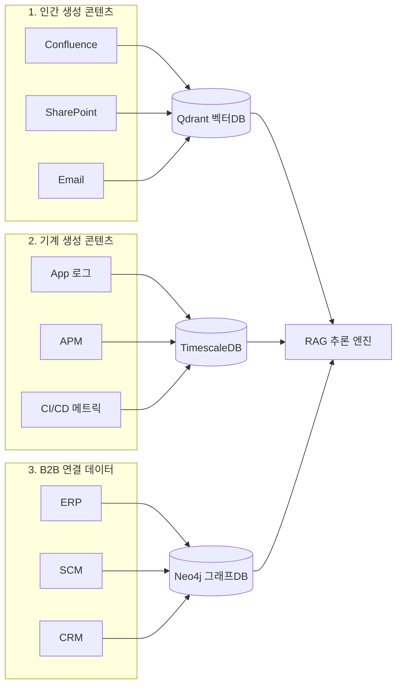

| 자산 | 소스 | 저장소 | 임베딩 |
|------|------|--------|--------|
| 인간 생성 | Confluence, SharePoint, Email | Qdrant (벡터) | text-embedding-3-large |
| 기계 생성 | 로그, APM, 메트릭 | TimescaleDB (시계열) | 구조화 인덱싱 |
| B2B 연결 | ERP, SCM, CRM | Neo4j (그래프) | node2vec |

### 2.3 파이프라인 아키텍처

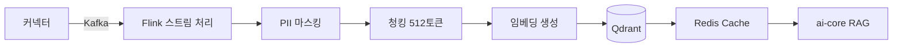

### 2.4 RAG 통합 (ai-core 확장)

```python
# apps/ai-core/routers/rag.py
@router.post("/api/v1/rag/search")
async def rag_search(query: str, top_k: int = 5, filters: dict = None):
    query_vec = await embed_service.encode(query)
    results = await qdrant.search("enterprise_docs", query_vec, top_k, filters)
    return {"chunks": results, "latency_ms": elapsed}

@router.post("/api/v1/rag/ingest")
async def ingest_document(source_type: str, content: str, metadata: dict):
    sanitized = await pii_sanitizer.process(content)
    chunks = chunker.split(sanitized, size=512, overlap=50)
    embeddings = await embed_service.encode_batch(chunks)
    await qdrant.upsert("enterprise_docs", embeddings, chunks, metadata)
    return {"chunks_indexed": len(chunks)}
```

### 2.5 암호화 정책

| 계층 | 방식 | 기술 |
|------|------|------|
| At Rest | AES-256-GCM | DB TDE + LUKS |
| In Transit | TLS 1.3 | mTLS 상호 인증 |
| In Use | 메모리 격리 | Confidential Computing |

### 2.6 KPI

| 지표 | 목표 |
|------|------|
| RAG Recall@5 | 85%+ |
| 검색 p95 응답시간 | < 200ms |
| 파이프라인 처리량 | 10,000 docs/hour |
| PII 탐지율 | 99%+ |

---

## 3. 에이전트 오케스트레이션 엔진

### 3.1 전략적 목표

챗봇 → 컨텍스트 인지 → **에이전틱 자동화(현재)**. 다단계 워크플로우를 자율적으로 계획·실행하는 "제어 가능한 인지 아키텍처"를 구축한다.

### 3.2 LangGraph State Graph

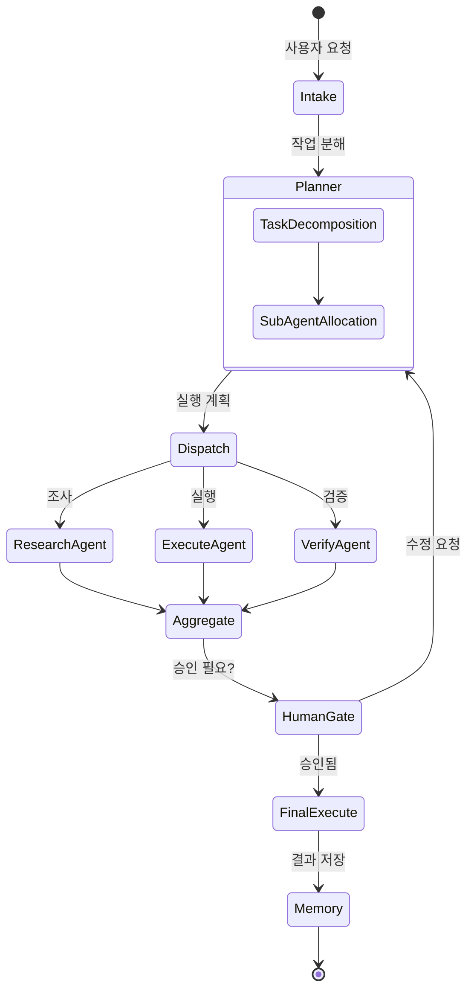

### 3.3 핵심 구현

```python
# apps/ai-core/agents/orchestrator.py
from langgraph.graph import StateGraph, END

class AgentState(TypedDict):
    messages: list[dict]
    task_plan: list[dict]
    sub_results: dict[str, str]
    approval_status: str  # "pending" | "approved" | "rejected"

graph = StateGraph(AgentState)
graph.add_node("intake", intake_node)
graph.add_node("planner", planner_node)
graph.add_node("researcher", researcher_node)
graph.add_node("executor", executor_node)
graph.add_node("verifier", verifier_node)
graph.add_node("human_gate", human_gate_node)

graph.set_entry_point("intake")
graph.add_edge("intake", "planner")
graph.add_conditional_edges("planner", route_to_agents, {
    "research": "researcher", "execute": "executor", "verify": "verifier",
})
graph.add_conditional_edges("human_gate", check_approval, {
    "approved": END, "rejected": "planner",
})
```

### 3.4 Stateful Memory

| 메모리 유형 | 저장소 | TTL | 용도 |
|------------|--------|-----|------|
| 단기 (세션) | Redis 7 | 24h | 대화 문맥, 현재 작업 |
| 중기 (작업) | PostgreSQL 16 | 30d | 작업 결과, 에이전트 출력 |
| 장기 (지식) | Qdrant | 영구 | 과거 패턴, 사용자 선호도 |

### 3.5 에이전트 카탈로그

| 에이전트 | 역할 | 도구 | 권한 |
|---------|------|------|------|
| DocAnalyzer | 문서 분석/요약 | RAG, 파일 읽기 | L1 읽기전용 |
| CodeReviewer | 코드 품질 리뷰 | Git diff, AST | L1 읽기전용 |
| ITHelpdesk | 티켓 자동 처리 | Zendesk, KB | L2 제안 |
| DataAnalyst | 데이터 분석 | SQL, 차트 | L2 제안 |
| ReportWriter | 보고서 생성 | 템플릿, 데이터 | L3 실행 |
| WorkflowBot | 워크플로우 자동화 | API, 양식 | L3 실행 |

### 3.6 Human-in-the-Loop

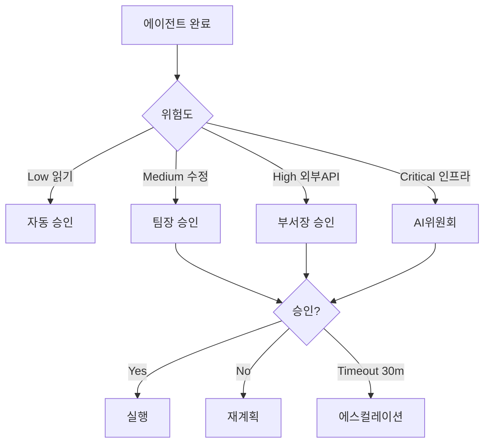

### 3.7 기존 시스템 통합

| 기존 자산 | 통합 방안 |
|----------|----------|
| `apps/ai-core` FastAPI | `/api/v1/agents/execute` 라우터 추가 |
| `apps/desktop` SwarmPanel | 에이전트 상태 실시간 표시 |
| `apps/desktop` AgentCard | 에이전트 카탈로그 UI |
| EventBus (`createEventBus`) | 에이전트 이벤트 프론트엔드 전파 |
| SSE 스트리밍 (`realSseService`) | 에이전트 응답 스트리밍 |
| LLM Router (86모델) | 에이전트별 최적 모델 자동 선택 |

### 3.8 KPI

| 지표 | 목표 |
|------|------|
| 작업 성공률 | 90%+ |
| 단일 에이전트 응답 | < 10초 |
| 멀티 에이전트 응답 | < 30초 |
| Human 개입 비율 | < 20% |

---

## 4. Smart DOM 웹 자동화 에이전트

### 4.1 전략적 목표

Brittle Selectors(XPath/CSS) 시대를 넘어, AI가 DOM을 의미론적으로 이해하여 동적 웹을 자동화한다. 퍼블릭 AI가 접근 불가능한 사내 시스템(Confluence, Jira, SAP)을 자동화하는 전용 에이전트를 구축한다.

### 4.2 벤치마크 비교 (Halluminate Web Bench 2025)

| 솔루션 | 성공률 | 소요시간 | 비용 | 방식 |
|--------|--------|---------|------|------|
| **rtrvr.ai** | **81.39%** | **0.9분** | **$0.12** | Smart DOM + Gemini Flash |
| Skyvern | 64.4% | 12.49분 | ~$1.00 | Computer Vision + GPT-4V |
| Browser Use | 43.9% | 6.35분 | ~$0.30 | Python + CDP |
| Firecrawl | N/A | N/A | ~$0.15 | 정적 추출 전용 |

### 4.3 에이전트 아키텍처

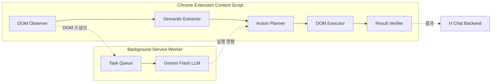

### 4.4 Smart DOM Parser 핵심

```typescript
// apps/extension/src/content/smartDomParser.ts
interface SemanticDOMNode {
  tag: string
  role?: string
  text?: string
  interactable: boolean
  boundingBox: DOMRect
  semanticLabel: string  // AI가 이해할 레이블
}

function extractSemanticDOM(root: Element): SemanticDOMNode[] {
  const nodes: SemanticDOMNode[] = []
  const walker = document.createTreeWalker(root, NodeFilter.SHOW_ELEMENT)
  while (walker.nextNode()) {
    const el = walker.currentNode as HTMLElement
    if (!isElementVisible(el)) continue
    if (!isInteractiveElement(el) && !el.textContent?.trim()) continue
    nodes.push({
      tag: el.tagName.toLowerCase(),
      role: el.getAttribute('role') ?? undefined,
      text: el.textContent?.slice(0, 200) ?? undefined,
      interactable: isInteractiveElement(el),
      boundingBox: el.getBoundingClientRect(),
      semanticLabel: generateSemanticLabel(el),
    })
  }
  return nodes
}
```

### 4.5 Fallback 전략

```
1차: Smart DOM 시도 (81%+ 성공, $0.12, 0.9분)
  │ 실패
2차: Vision Fallback — 스크린샷 + LLM (64%+, $1.00)
  │ 실패
3차: Human Escalation — Teams 알림
```

### 4.6 에이전틱 브라우징 시나리오

| 시나리오 | 워크플로우 | 예상 성공률 |
|---------|----------|-----------|
| IT 헬프데스크 티켓 자동 처리 | Zendesk 접속 → 티켓 분류 → KB 검색 → 자동 응답 | 85% |
| HR 연차 신청 | HR 포탈 → 양식 입력 → [Human 승인] → 제출 | 80% |
| ERP 재고 조회 | SAP 접속 → 검색 → 테이블 파싱 → 요약 | 75% |
| Confluence 문서 업데이트 | 페이지 탐색 → 편집 → 내용 수정 → 저장 | 85% |

### 4.7 보안

| 계층 | 메커니즘 |
|------|---------|
| 도메인 제어 | 화이트리스트 기반 자동화 허용 |
| PII 보호 | DOM 데이터 LLM 전송 전 PII 마스킹 |
| 행동 감사 | 모든 클릭/입력 기록 → Audit Log |
| 세션 격리 | 에이전트별 독립 브라우저 컨텍스트 |
| Kill Switch | AbortController 기반 즉시 중단 |

### 4.8 KPI

| 지표 | 목표 |
|------|------|
| Smart DOM 단독 성공률 | 80%+ |
| Fallback 포함 성공률 | 90%+ |
| 작업당 비용 | < $0.15 |
| 평균 소요시간 | < 2분 |

---

## 5. Self-Healing 시스템

### 5.1 전략적 목표

인체 면역 체계처럼 소프트웨어가 장애를 감지·진단·치유·학습하는 자가 치유 루프를 구축한다. 목표: **61%+ 자동 복구율**.

### 5.2 면역 매핑

| 인체 | 소프트웨어 | H Chat 기존 자산 |
|------|----------|-----------------|
| 통증 (Sensors) | Observability | errorMonitoring.ts, healthCheck.ts |
| 두뇌 (Brain) | AI 진단 엔진 | alertConfig.ts (AlertManager) |
| 면역 (Immune) | Healing Agent | Circuit Breaker, Health Monitor |
| 기억 (Memory) | 패턴 DB | Git, PostgreSQL 16 |

### 5.3 자가 치유 루프 (4단계)

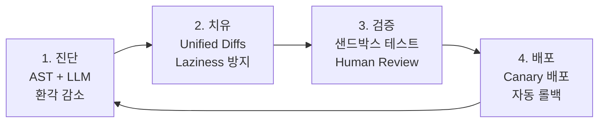

### 5.4 진단 엔진 (AST + LLM)

```python
# apps/ai-core/healing/diagnosis.py
class DiagnosisEngine:
    def __init__(self):
        self.parser = Parser(Language(ts_typescript.language()))

    async def diagnose(self, error: ErrorReport) -> Diagnosis:
        tree = self.parser.parse(bytes(error.source_code, 'utf8'))
        ast_context = extract_surrounding_nodes(tree, error.line, radius=20)

        diagnosis = await llm.chat([
            {"role": "system", "content": DIAGNOSIS_PROMPT},
            {"role": "user", "content": f"에러: {error.message}\n"
             f"AST: {ast_context}\n코드: {error.source_code}"}
        ])
        return validate_against_ast(diagnosis, tree)
```

### 5.5 Healing Agent (Unified Diffs)

```python
# apps/ai-core/healing/agent.py
class HealingAgent:
    async def heal(self, diagnosis: Diagnosis) -> HealingResult:
        diff = await llm.chat([
            {"role": "system", "content": "Unified Diff 형식으로만 응답. "
             "절대 코드를 생략하지 마세요."},
            {"role": "user", "content": f"진단: {diagnosis.root_cause}\n"
             f"코드: {diagnosis.source_code}"}
        ])
        patch = parse_unified_diff(diff)
        modified = apply_patch(diagnosis.source_code, patch)
        if not is_valid_syntax(modified):
            return HealingResult(success=False, reason="구문 오류")
        return HealingResult(success=True, diff=diff, modified=modified)
```

### 5.6 검증 파이프라인

```yaml
# .github/workflows/self-healing-verify.yml
jobs:
  verify:
    steps:
      - uses: actions/checkout@v4
        with: { ref: '${{ inputs.healing_branch }}' }
      - run: npm install && npx vitest run --reporter=json
      - run: npx playwright test --reporter=json
      - name: Report
        run: curl -X POST $HEALING_API/verify -d @results.json
```

### 5.7 적응형 메모리

```sql
CREATE TABLE healing_incidents (
    id UUID PRIMARY KEY DEFAULT gen_random_uuid(),
    error_signature TEXT NOT NULL,
    error_embedding VECTOR(1536),
    diagnosis JSONB, healing_diff TEXT,
    success BOOLEAN, created_at TIMESTAMPTZ DEFAULT NOW()
);
-- 유사 장애 검색: cosine similarity > 0.9 → 과거 성공 Diff 즉시 적용
```

### 5.8 Observability 스택

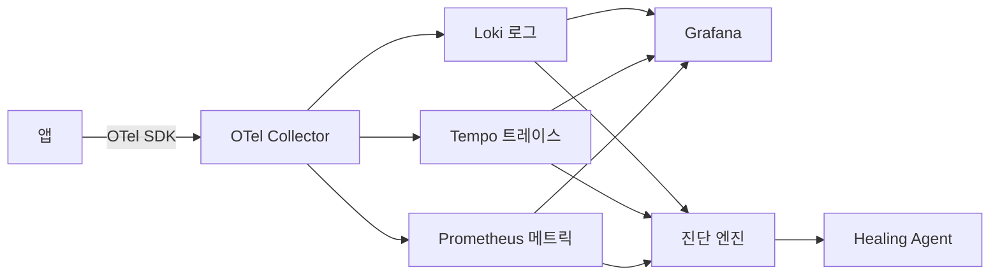

### 5.9 KPI

| 지표 | 목표 |
|------|------|
| 자동 복구 성공률 | 61%+ |
| MTTR (자동) | < 15분 |
| MTTR (수동) | < 2시간 |
| 오진율 | < 10% |
| 메모리 재활용률 | 30%+ |

---

## 6. 보안 거버넌스 프레임워크

### 6.1 전략적 원칙

> "To move fast but to govern faster."

혁신(Innovation)과 신뢰(Trust)의 동기화. 에이전트 자율성과 보안 경계의 완벽한 조율.

### 6.2 에이전트 권한 레벨

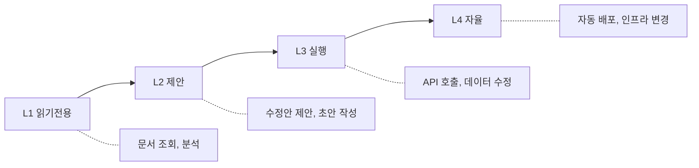

| 레벨 | 행동 범위 | 승인 | 예시 |
|------|---------|------|------|
| L1 읽기전용 | 조회, 분석, 요약 | 불필요 | DocAnalyzer, CodeReviewer |
| L2 제안 | 초안 작성, 수정안 제시 | 사용자 확인 | ITHelpdesk, DataAnalyst |
| L3 실행 | API 호출, 데이터 수정 | 팀장 승인 | ReportWriter, WorkflowBot |
| L4 자율 | 인프라 변경, 자동 배포 | AI 위원회 | Self-Healing (제한적) |

### 6.3 에이전트 라이프사이클

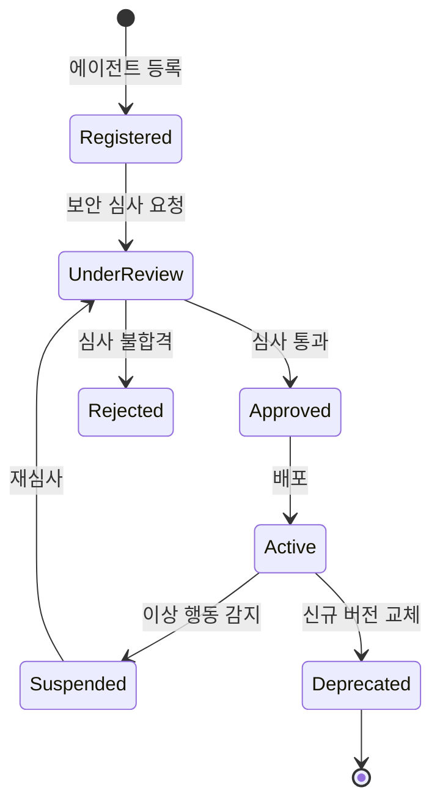

### 6.4 Zero Trust 아키텍처

| 계층 | 메커니즘 | 구현 |
|------|---------|------|
| 인증 | mTLS + JWT | 기존 HMAC-SHA256 JWT 확장 |
| 인가 | RBAC + ABAC | 기존 RBAC + 에이전트 역할 추가 |
| 최소 권한 | 에이전트별 도구 화이트리스트 | OPA 정책 엔진 |
| 통신 보안 | 서비스 메쉬 | Envoy sidecar proxy |
| API 보호 | Rate Limiting + API Gateway | 기존 Rate Limiting 확장 |

### 6.5 데이터 주권 컴플라이언스

| 등급 | 설명 | 접근 정책 | 보존 |
|------|------|---------|------|
| 공개 (C1) | 외부 공개 가능 | 전체 | 1년 |
| 내부 (C2) | 사내 공개 | 인증된 사용자 | 3년 |
| 비밀 (C3) | 부서 제한 | 부서 + 역할 | 7년 |
| 극비 (C4) | 개인별 제한 | 명시적 승인 | 영구 |

### 6.6 감사 및 추적

```typescript
// packages/ui/src/admin/services/agentAuditService.ts
interface AgentAuditEntry {
  timestamp: string
  agentId: string
  agentType: string
  action: string           // "read_document" | "call_api" | "modify_data"
  target: string           // 대상 리소스
  input: string            // 입력 (PII 마스킹됨)
  output: string           // 출력 (PII 마스킹됨)
  riskLevel: 'low' | 'medium' | 'high' | 'critical'
  approvedBy?: string      // Human 승인자
  traceId: string          // OpenTelemetry trace
}
```

### 6.7 Kill Switch & 비상 대응

| 단계 | 트리거 | 조치 | 시간 |
|------|--------|------|------|
| 1. 경고 | 이상 패턴 감지 | 알림 발송 | 즉시 |
| 2. 격리 | 임계값 초과 | 에이전트 격리, 트래픽 차단 | 30초 이내 |
| 3. 중지 | 수동/자동 Kill Switch | 전체 에이전트 중지 | 즉시 |
| 4. 포렌식 | 사후 분석 | 감사 로그 수집, 원인 분석 | 4시간 이내 |
| 5. 복구 | 심사 완료 | 단계적 재활성화 | 심사 후 |

### 6.8 Prompt Injection 방어

| 방어 계층 | 메커니즘 |
|----------|---------|
| 입력 새니타이제이션 | 기존 PII Sanitizer + 프롬프트 패턴 탐지 |
| 출력 검증 | AST Ground Truth 비교 (Self-Healing과 연계) |
| 컨텍스트 격리 | 시스템 프롬프트와 사용자 입력 완전 분리 |
| Adversarial 테스트 | 주기적 Red Team 테스트 자동화 |

### 6.9 H Chat 기존 보안 확장 맵

| 기존 기능 | 확장 대상 |
|----------|----------|
| 7 Security Headers | + 에이전트 API 엔드포인트 동일 적용 |
| CSP nonce (SSR) | + 에이전트 생성 콘텐츠 CSP 정책 |
| HMAC-SHA256 JWT | + 에이전트 서비스 토큰 발급 |
| Zod Validation | + 에이전트 입출력 스키마 검증 |
| PII Sanitization | + 에이전트 로그 PII 자동 마스킹 |
| 블록리스트 (20 도메인) | + 에이전트 접근 불가 도메인 확장 |
| RBAC | + 에이전트 역할 (agent_l1 ~ agent_l4) |
| SSO | + 에이전트 위임 인증 (delegation token) |
| 감사 로그 | + 에이전트 행동 감사 (AgentAuditEntry) |

### 6.10 KPI

| 지표 | 목표 |
|------|------|
| 보안 인시던트 | 0건 |
| 감사 로그 커버리지 | 100% |
| Prompt Injection 탐지율 | 95%+ |
| Kill Switch 응답시간 | < 30초 |
| 컴플라이언스 자동 리포트 | 월 1회 |

---

## 7. 통합 아키텍처

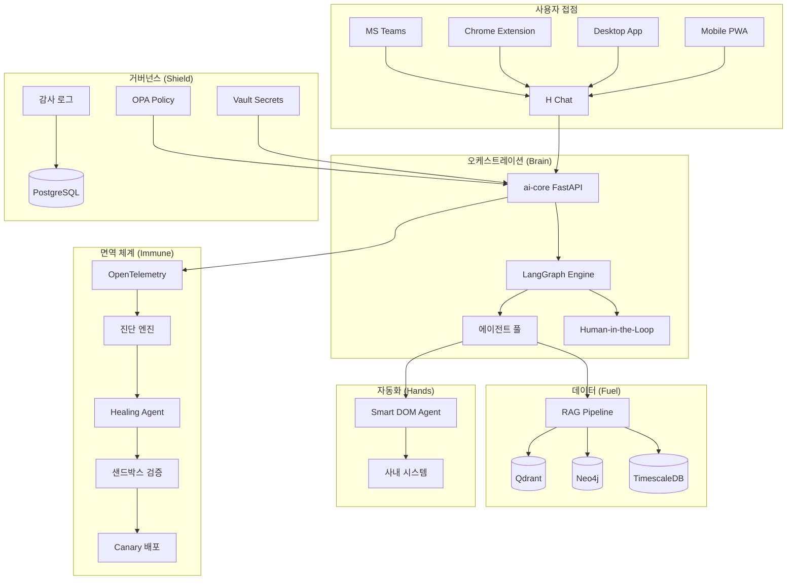

---

## 8. 통합 로드맵

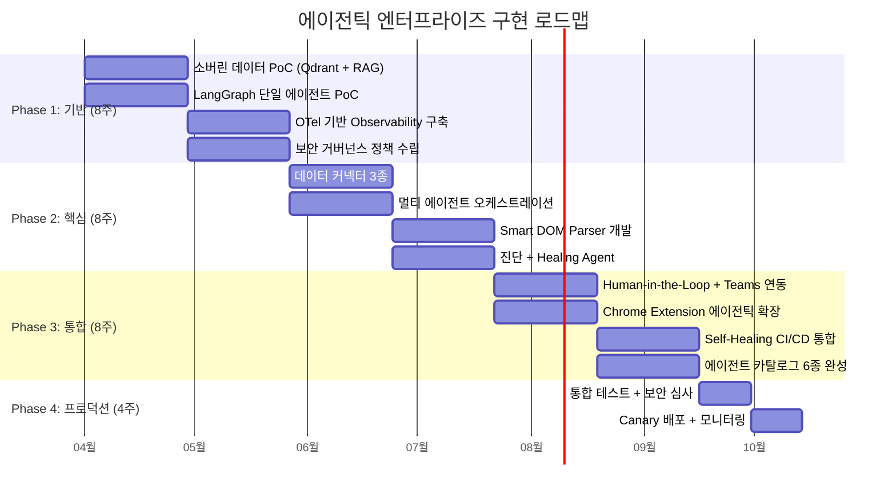

| Phase | 기간 | 핵심 산출물 |
|-------|------|-----------|
| **P1 기반** | 8주 | RAG PoC, 단일 에이전트 PoC, OTel 구축, 거버넌스 정책 |
| **P2 핵심** | 8주 | 데이터 커넥터, 멀티 에이전트, Smart DOM, Healing Agent |
| **P3 통합** | 8주 | HITL, 크롬 확장, CI/CD 통합, 에이전트 6종 |
| **P4 프로덕션** | 4주 | 통합 테스트, 보안 심사, Canary 배포 |
| **총 기간** | **28주 (~7개월)** | 에이전틱 엔터프라이즈 풀 스택 |

---

## 9. 투자 대비 효과 (ROI)

### 예상 비용

| 항목 | 월 비용 | 연 비용 |
|------|--------|--------|
| LLM API 비용 (86모델 라우팅 최적화) | $5,000 | $60,000 |
| 인프라 (Qdrant, Neo4j, OTel 스택) | $3,000 | $36,000 |
| 개발 인력 (5명 × 7개월) | — | $350,000 |
| **총 투자** | — | **~$446,000** |

### 예상 절감

| 항목 | 절감 효과 | 연 절감액 |
|------|---------|----------|
| IT 헬프데스크 자동화 (70% 티켓) | 인력 3명 절감 | $150,000 |
| 문서 검색/요약 시간 단축 | 직원당 주 5시간 | $200,000 |
| 인시던트 자동 복구 (61%) | MTTR 90% 감소 | $100,000 |
| 웹 자동화 (수동 데이터 입력) | 인력 2명 절감 | $100,000 |
| **총 절감** | | **~$550,000** |

### ROI

```
연 순이익 = $550,000 - $96,000(운영비) = $454,000
초기 투자 회수 기간 ≈ 12개월
3년 ROI ≈ 290%
```

---

## 기술 스택 종합

| 영역 | 기술 |
|------|------|
| 오케스트레이션 | LangGraph 0.2, LangChain 0.3 |
| 벡터 DB | Qdrant 1.10 |
| 그래프 DB | Neo4j 5.x |
| 시계열 DB | TimescaleDB 2.x |
| 메시지 큐 | Apache Kafka 3.7 |
| 스트림 처리 | Apache Flink 1.19 |
| Observability | OpenTelemetry, Grafana, Loki, Tempo, Prometheus |
| AST 파싱 | Tree-sitter (TypeScript, Python) |
| 임베딩 | text-embedding-3-large (3072d) |
| Smart DOM LLM | Gemini Flash (비용 효율) |
| 정책 엔진 | OPA (Open Policy Agent) |
| 비밀 관리 | HashiCorp Vault |
| PII 마스킹 | Presidio (Microsoft) |
| 기존 인프라 | PostgreSQL 16, Redis 7, Docker Compose |

---

> **"인지 컴퓨팅 시대의 진정한 승자는 가장 많은 데이터를 AI에 주입하는 기업이 아닙니다. 가장 '신뢰할 수 있는 데이터'를 바탕으로, 에이전트의 '자율성'과 기업의 '보안 경계'를 완벽하게 조율하는 조직만이 다음 10년을 지배할 것입니다."**
