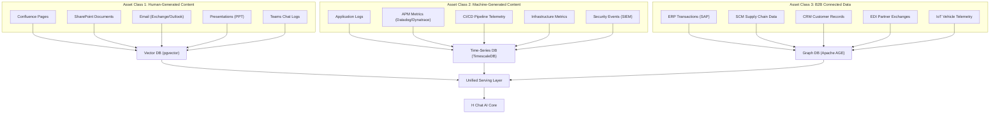
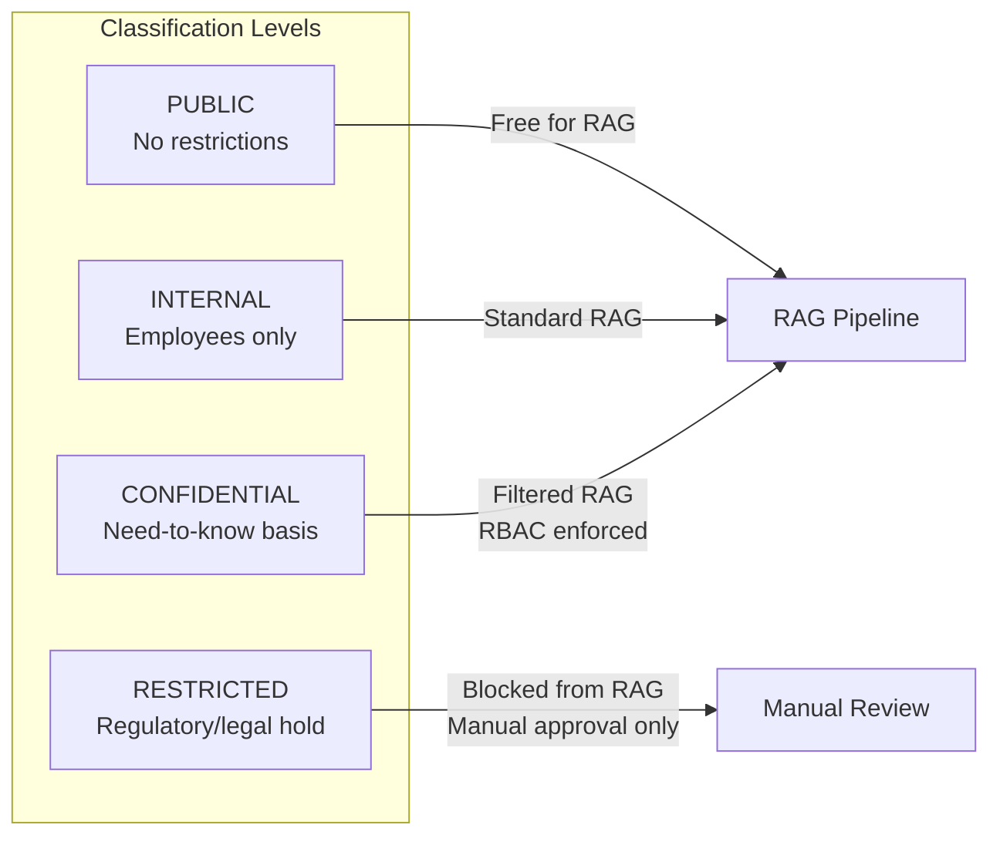
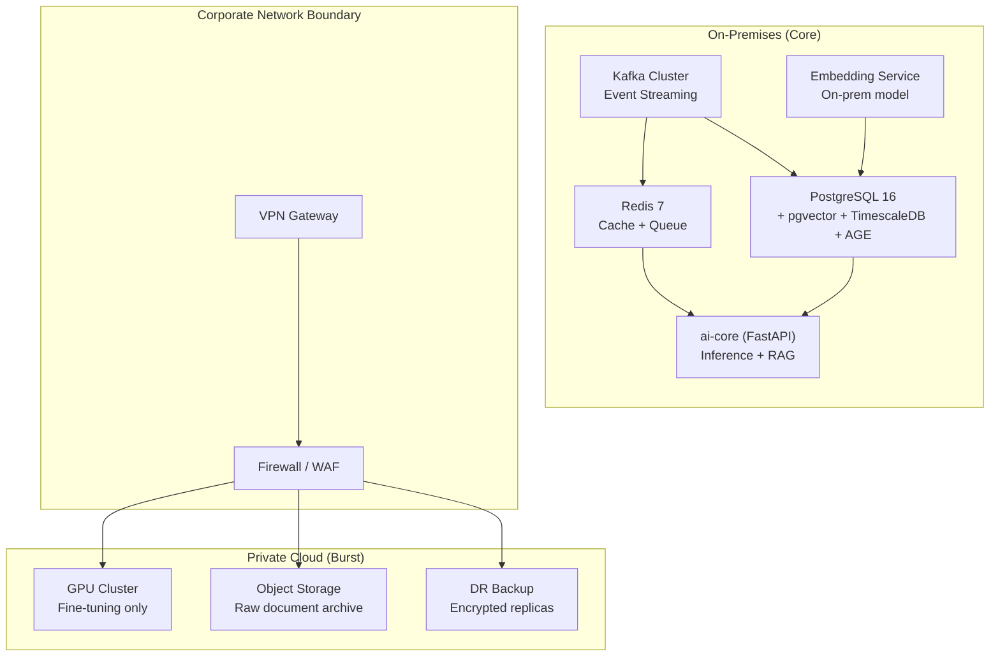
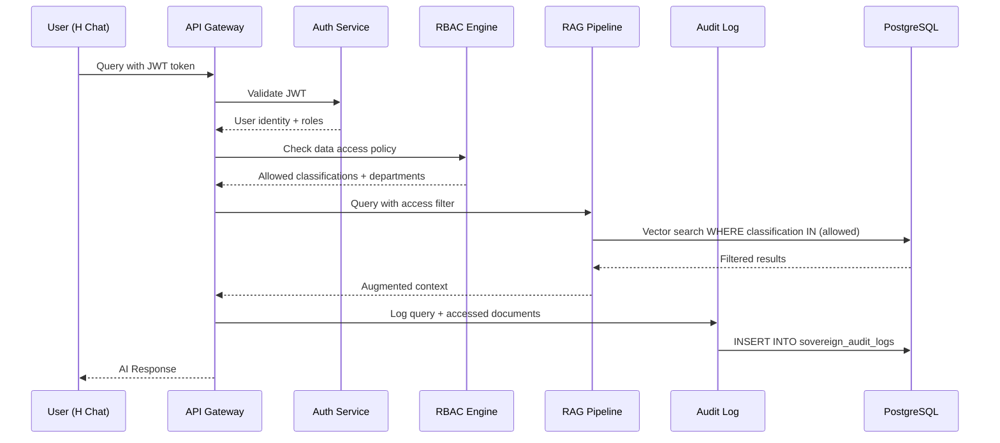
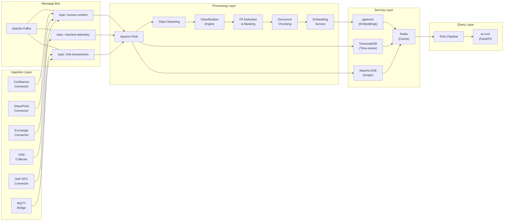
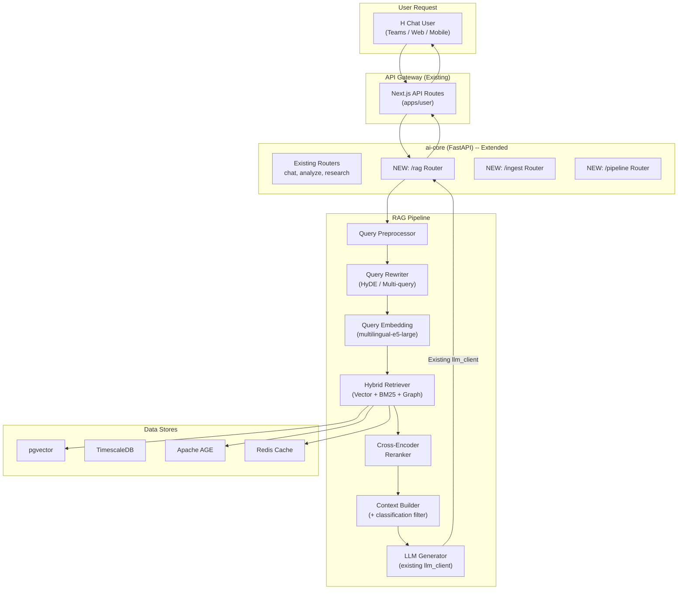
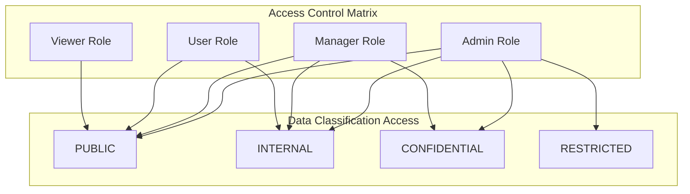
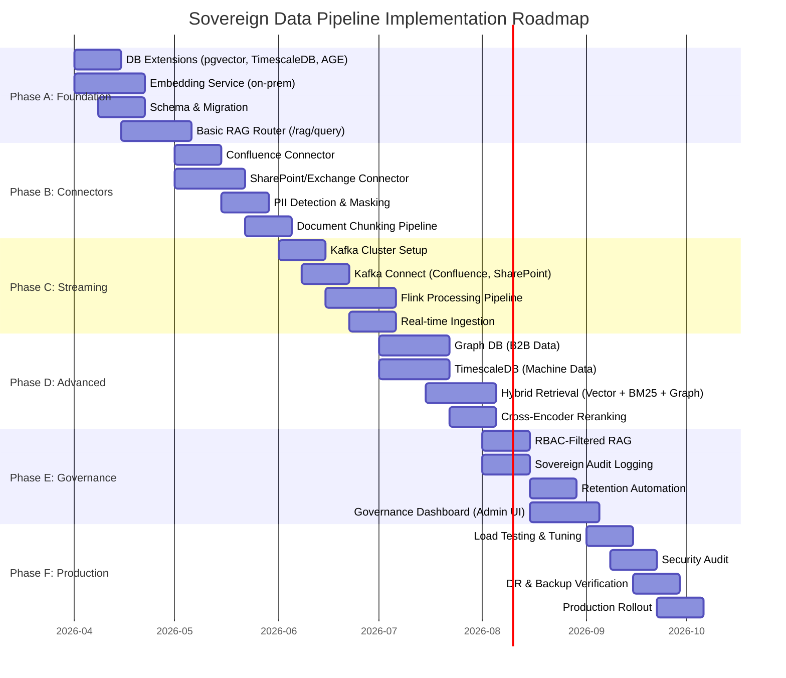
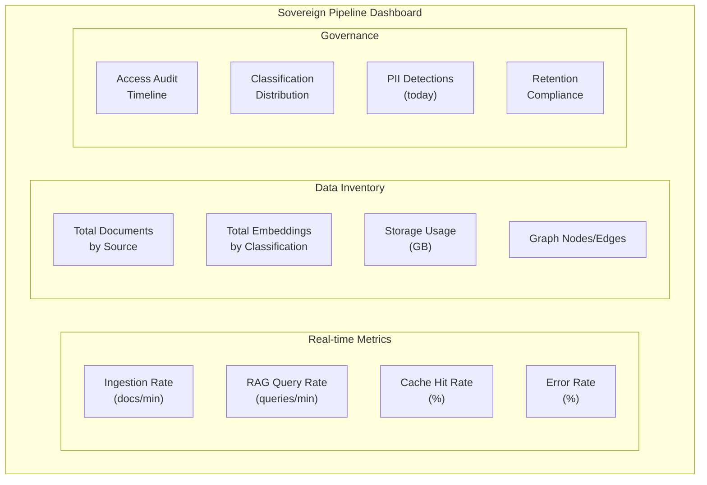

# IMPL_01: Sovereign Data Pipeline -- Detailed Design

> **Project**: H Chat Platform (Hyundai AutoEver)
> **Author**: Worker A -- Sovereign Data Pipeline Design Agent
> **Date**: 2026-03-14
> **Status**: Draft
> **Based on**: "The Agentic Enterprise" Strategy Analysis

---

## Table of Contents

1. [Overview and Goals](#1-overview-and-goals)
2. [Data Classification Framework](#2-data-classification-framework)
3. [Sovereign Cloud Architecture](#3-sovereign-cloud-architecture)
4. [Data Pipeline Design](#4-data-pipeline-design)
5. [H Chat Integration Architecture](#5-h-chat-integration-architecture)
6. [Data Governance Policy](#6-data-governance-policy)
7. [Technology Stack and Dependencies](#7-technology-stack-and-dependencies)
8. [Implementation Roadmap](#8-implementation-roadmap)
9. [KPIs and Performance Metrics](#9-kpis-and-performance-metrics)

---

## 1. Overview and Goals

### 1.1 Strategic Context

"The Agentic Enterprise" strategy document establishes that **90% of global data resides behind firewalls**, and only **"trusted data" can power "trusted AI."** H Chat, as Hyundai AutoEver's internal generative AI platform embedded in Microsoft Teams, must build a sovereign data pipeline that:

- Keeps all enterprise data within the corporate security boundary
- Transforms raw internal data into AI-consumable knowledge
- Ensures data sovereignty, governance, and auditability at every stage

### 1.2 Strategic Goals

| Goal | Description | Success Criteria |
|------|-------------|------------------|
| **Data Sovereignty** | All data remains within the corporate perimeter; no unauthorized external transmission | Zero data egress incidents |
| **Unified Knowledge Base** | Three data asset classes (human, machine, B2B) converge into a single AI-consumable layer | Single RAG pipeline serves all data types |
| **Real-time Freshness** | Data freshness SLA of <15 minutes for critical sources | 95th percentile ingestion latency <15 min |
| **Governance-first** | Every data movement is classified, logged, and auditable | 100% audit coverage on data access |
| **H Chat Integration** | Seamless integration with existing `apps/ai-core` FastAPI backend | RAG endpoints operational within existing infra |

### 1.3 Relationship to H Chat Blueprint

The sovereign data pipeline corresponds to the **"Fuel (The Fuel)"** layer of the Agentic Enterprise blueprint:

```
                    +-------------------------+
                    |   Brain (The Brain)     |
                    |   LangGraph-based       |
                    |   Orchestration         |
                    +------------+------------+
                                 |
+-------------------+    +-------+-------+    +-------------------+
| >>> FUEL <<<      |    |  Integrated   |    | Hands (The Hands) |
| Sovereign Data    |<-->|  Operating    |<-->| Web Automation    |
| Pipeline          |    |  Model (LLM)  |    | Agents            |
| THIS DOCUMENT     |    +-------+-------+    +-------------------+
+-------------------+            |
                    +------------+------------+
                    |  Immune System          |
                    |  Self-Healing Software  |
                    +-------------------------+
```

---

## 2. Data Classification Framework

### 2.1 Three Enterprise Data Asset Classes



### 2.2 Classification by Asset Class

#### Asset Class 1: Human-Generated Content

| Source | Format | Volume (est.) | Freshness SLA | Classification |
|--------|--------|---------------|---------------|----------------|
| Confluence | HTML/Markdown | ~500K pages | 1 hour | INTERNAL |
| SharePoint | DOCX/XLSX/PDF | ~2M files | 4 hours | INTERNAL/CONFIDENTIAL |
| Exchange Email | EML/MSG | ~10M/month | 15 min | CONFIDENTIAL |
| Teams Chat | JSON (Graph API) | ~50M msg/month | Real-time | INTERNAL |
| Presentations | PPTX | ~100K files | 4 hours | INTERNAL/CONFIDENTIAL |

**Collection Strategy**:
- Confluence: REST API v2 with webhook for real-time updates
- SharePoint: Microsoft Graph API with Delta Query for incremental sync
- Email: Microsoft Graph API with Change Notifications (subscriptions)
- Teams: Microsoft Graph API with `/chats` and `/messages` endpoints

**Storage**: pgvector within PostgreSQL 16 (existing infrastructure)

```python
# apps/ai-core/services/connectors/confluence_connector.py
from pydantic import BaseModel, Field


class ConfluenceDocument(BaseModel):
    """Represents an ingested Confluence document."""

    doc_id: str
    space_key: str
    title: str
    content_text: str
    author: str
    last_modified: str
    labels: list[str] = Field(default_factory=list)
    classification: str = "INTERNAL"
    content_hash: str = ""


class ConfluenceConnector:
    """Connector for Atlassian Confluence REST API v2."""

    def __init__(self, base_url: str, api_token: str) -> None:
        self._base_url = base_url.rstrip("/")
        self._headers = {
            "Authorization": f"Bearer {api_token}",
            "Accept": "application/json",
        }

    async def fetch_spaces(self) -> list[dict]:
        """Fetch all accessible Confluence spaces."""
        ...

    async def fetch_pages(
        self, space_key: str, since: str | None = None
    ) -> list[ConfluenceDocument]:
        """Fetch pages from a space, optionally since a timestamp."""
        ...

    async def subscribe_webhook(self, callback_url: str) -> dict:
        """Register a webhook for page update events."""
        ...
```

#### Asset Class 2: Machine-Generated Content

| Source | Format | Volume (est.) | Freshness SLA | Classification |
|--------|--------|---------------|---------------|----------------|
| Application Logs | JSON/Plaintext | ~500GB/day | 1 min | INTERNAL |
| APM Metrics | Time-series | ~1TB/day | 30 sec | INTERNAL |
| CI/CD Telemetry | JSON | ~50GB/day | 5 min | INTERNAL |
| Infrastructure | Prometheus/OTLP | ~200GB/day | 30 sec | INTERNAL |
| SIEM Events | CEF/JSON | ~100GB/day | 1 min | RESTRICTED |

**Collection Strategy**:
- Logs: OpenTelemetry Collector with log pipeline
- APM: OpenTelemetry SDK instrumentation
- CI/CD: GitHub Actions / GitLab CI webhook events
- SIEM: Splunk HEC or Elasticsearch ingest

**Storage**: TimescaleDB (PostgreSQL extension, compatible with existing PG 16)

#### Asset Class 3: B2B Connected Data

| Source | Format | Volume (est.) | Freshness SLA | Classification |
|--------|--------|---------------|---------------|----------------|
| ERP (SAP) | IDoc/BAPI | ~10M txn/day | 15 min | CONFIDENTIAL |
| SCM | EDI/XML | ~5M records/day | 1 hour | CONFIDENTIAL |
| CRM | REST/SOAP | ~1M records/day | 30 min | CONFIDENTIAL |
| EDI Partners | X12/EDIFACT | ~500K/day | 4 hours | RESTRICTED |
| Vehicle IoT | MQTT/Protobuf | ~100M events/day | 5 min | RESTRICTED |

**Collection Strategy**:
- SAP: SAP RFC/BAPI connectors via PyRFC or SAP Cloud Integration
- SCM/EDI: Message broker integration (Kafka Connect)
- CRM: REST API polling or Change Data Capture (Debezium)
- IoT: MQTT broker to Kafka bridge

**Storage**: Apache AGE (Graph extension for PostgreSQL, runs on existing PG 16)

### 2.3 Data Classification Levels



| Level | AI Usage | RAG Eligible | Retention | Access Control |
|-------|----------|-------------|-----------|----------------|
| PUBLIC | Unrestricted | Yes | 7 years | All employees |
| INTERNAL | Standard RAG | Yes | 5 years | Authenticated users |
| CONFIDENTIAL | Filtered RAG with RBAC | Conditional | 3 years | Department + Role |
| RESTRICTED | Blocked by default | No (manual override) | Regulatory | Named individuals only |

---

## 3. Sovereign Cloud Architecture

### 3.1 On-Premises vs Hybrid Cloud Comparison

| Criterion | On-Premises | Hybrid Cloud | Recommendation |
|-----------|-------------|-------------|----------------|
| **Data Sovereignty** | Full control | Control with cloud elasticity | **Hybrid** |
| **Cost (TCO 5yr)** | High CAPEX | Balanced CAPEX/OPEX | Hybrid |
| **Scalability** | Limited by hardware | Elastic burst capacity | Hybrid |
| **Compliance** | Easiest to audit | Requires cloud governance | On-Prem for RESTRICTED |
| **Latency** | Lowest | Low (within region) | On-Prem for real-time |
| **Disaster Recovery** | Complex | Built-in multi-region | Hybrid |
| **AI/ML Workloads** | GPU procurement lead time | On-demand GPU | Hybrid for training |

**Decision**: **Hybrid Architecture** with the following split:



### 3.2 Data Encryption Strategy

#### 3.2.1 Encryption at Rest

| Component | Method | Key Management |
|-----------|--------|----------------|
| PostgreSQL | TDE (Transparent Data Encryption) via pgcrypto | HashiCorp Vault |
| Redis | AOF encryption + encrypted volumes | Vault |
| Kafka | Disk-level encryption (LUKS) | Vault |
| Object Storage | AES-256-GCM | KMS (on-prem HSM) |
| Backups | AES-256-GCM + envelope encryption | Vault + offline keys |

#### 3.2.2 Encryption in Transit

| Path | Method | Certificate Management |
|------|--------|----------------------|
| Client to API | TLS 1.3 (mTLS for service-to-service) | Internal CA (step-ca) |
| Kafka brokers | TLS 1.3 + SASL/SCRAM-256 | Internal CA |
| PostgreSQL connections | TLS 1.3 (verify-full) | Internal CA |
| Redis connections | TLS 1.3 | Internal CA |
| Cross-zone (on-prem to cloud) | IPsec VPN + TLS 1.3 | Managed VPN gateway |

#### 3.2.3 Encryption in Use (Confidential Computing)

For RESTRICTED classification data:

- **Intel SGX / AMD SEV** enclaves for embedding generation of sensitive documents
- Vector embeddings of RESTRICTED documents computed inside enclaves
- Raw text never leaves enclave; only embeddings stored in pgvector

### 3.3 Access Control and Audit Trail



**Audit Log Schema Extension** (extends existing `audit_logs` table):

```sql
-- New table for sovereign data pipeline audit
CREATE TABLE IF NOT EXISTS sovereign_audit_logs (
    id UUID PRIMARY KEY DEFAULT gen_random_uuid(),
    user_id UUID REFERENCES users(id),
    action VARCHAR(50) NOT NULL,            -- 'rag_query', 'ingest', 'embed', 'export'
    data_classification VARCHAR(20) NOT NULL, -- 'PUBLIC', 'INTERNAL', 'CONFIDENTIAL', 'RESTRICTED'
    source_type VARCHAR(50),                 -- 'confluence', 'sharepoint', 'erp', etc.
    document_ids UUID[],                     -- Array of accessed document IDs
    query_hash VARCHAR(64),                  -- SHA-256 of the query (for dedup/analysis)
    result_count INTEGER DEFAULT 0,
    latency_ms INTEGER,
    ip_address INET,
    user_agent TEXT,
    metadata JSONB DEFAULT '{}',
    created_at TIMESTAMPTZ DEFAULT NOW()
);

CREATE INDEX idx_sovereign_audit_user ON sovereign_audit_logs(user_id);
CREATE INDEX idx_sovereign_audit_action ON sovereign_audit_logs(action);
CREATE INDEX idx_sovereign_audit_classification ON sovereign_audit_logs(data_classification);
CREATE INDEX idx_sovereign_audit_created ON sovereign_audit_logs(created_at);

-- Partitioned by month for efficient retention management
-- (Production: convert to partitioned table)
```

---

## 4. Data Pipeline Design

### 4.1 Pipeline Architecture Overview



### 4.2 Ingestion Layer

#### 4.2.1 Event Streaming: Apache Kafka

Kafka is selected over Pulsar for the following reasons:
- Existing Hyundai AutoEver infrastructure familiarity
- Mature Kafka Connect ecosystem for SAP, SharePoint, and JDBC connectors
- TimescaleDB and Debezium CDC compatibility

**Topic Design**:

| Topic | Partitions | Retention | Key | Schema |
|-------|-----------|-----------|-----|--------|
| `hchat.human.confluence` | 12 | 7 days | `space_key:page_id` | Avro |
| `hchat.human.sharepoint` | 12 | 7 days | `site_id:item_id` | Avro |
| `hchat.human.email` | 24 | 3 days | `mailbox:message_id` | Avro |
| `hchat.machine.logs` | 48 | 1 day | `service:instance` | JSON |
| `hchat.machine.metrics` | 24 | 1 day | `service:metric_name` | Avro |
| `hchat.b2b.erp` | 12 | 14 days | `doc_type:doc_number` | Avro |
| `hchat.b2b.scm` | 12 | 14 days | `partner:transaction_id` | Avro |
| `hchat.pipeline.dlq` | 6 | 30 days | original topic + offset | JSON |

**Kafka Connect Connectors**:

```yaml
# docker/kafka-connect/connectors/confluence-source.json
{
  "name": "confluence-source",
  "config": {
    "connector.class": "io.confluent.connect.http.HttpSourceConnector",
    "url": "${CONFLUENCE_BASE_URL}/wiki/api/v2/pages",
    "auth.type": "OAUTH2",
    "topic.name.pattern": "hchat.human.confluence",
    "poll.interval.ms": 60000,
    "tasks.max": 4,
    "transforms": "extractFields,setClassification",
    "transforms.setClassification.type": "org.apache.kafka.connect.transforms.InsertField$Value",
    "transforms.setClassification.static.field": "classification",
    "transforms.setClassification.static.value": "INTERNAL"
  }
}
```

#### 4.2.2 Connector Framework

```python
# apps/ai-core/services/connectors/base_connector.py
from abc import ABC, abstractmethod
from pydantic import BaseModel, Field
from enum import Enum


class DataClassification(str, Enum):
    """Data classification levels for sovereign governance."""

    PUBLIC = "PUBLIC"
    INTERNAL = "INTERNAL"
    CONFIDENTIAL = "CONFIDENTIAL"
    RESTRICTED = "RESTRICTED"


class IngestedDocument(BaseModel):
    """Standardized document format across all connectors."""

    source_id: str
    source_type: str
    title: str
    content: str
    content_hash: str
    author: str | None = None
    department: str | None = None
    classification: DataClassification = DataClassification.INTERNAL
    metadata: dict = Field(default_factory=dict)
    ingested_at: str = ""
    updated_at: str = ""


class BaseConnector(ABC):
    """Abstract base class for all data source connectors."""

    @abstractmethod
    async def connect(self) -> None:
        """Establish connection to the data source."""
        ...

    @abstractmethod
    async def fetch_incremental(
        self, since: str | None = None
    ) -> list[IngestedDocument]:
        """Fetch documents updated since the given timestamp."""
        ...

    @abstractmethod
    async def health_check(self) -> dict:
        """Return connector health status."""
        ...
```

### 4.3 Processing Layer

#### 4.3.1 Stream Processing: Apache Flink

Flink is selected over Spark Streaming for:
- True event-time processing with watermarks
- Lower latency (milliseconds vs seconds)
- Native Kafka integration
- Exactly-once semantics

**Processing Pipeline Stages**:

```mermaid
graph LR
    subgraph "Stage 1: Cleansing"
        S1A["HTML Strip"]
        S1B["Encoding Fix"]
        S1C["Deduplication<br/>(content_hash)"]
    end

    subgraph "Stage 2: Classification"
        S2A["Auto-Classification<br/>(LLM-based)"]
        S2B["PII Detection<br/>(spaCy NER + regex)"]
        S2C["PII Masking<br/>(Presidio)"]
    end

    subgraph "Stage 3: Chunking"
        S3A["Semantic Chunking<br/>(recursive splitter)"]
        S3B["Metadata Attach<br/>(source, author, date)"]
        S3C["Overlap Window<br/>(128 tokens)"]
    end

    subgraph "Stage 4: Embedding"
        S4A["On-Prem Model<br/>(multilingual-e5-large)"]
        S4B["Batch Embedding<br/>(GPU accelerated)"]
        S4C["Vector Storage<br/>(pgvector)"]
    end

    S1A --> S1B --> S1C --> S2A --> S2B --> S2C --> S3A --> S3B --> S3C --> S4A --> S4B --> S4C
```



#### 4.3.2 Document Chunking Strategy

```python
# apps/ai-core/services/pipeline/chunker.py
from pydantic import BaseModel


class ChunkConfig(BaseModel):
    """Configuration for document chunking."""

    chunk_size: int = 512          # tokens per chunk
    chunk_overlap: int = 128       # overlap tokens between chunks
    min_chunk_size: int = 64       # minimum viable chunk
    separator_hierarchy: list[str] = [
        "\n\n",  # Paragraph break
        "\n",    # Line break
        ". ",    # Sentence end
        " ",     # Word boundary
    ]


class DocumentChunk(BaseModel):
    """A single chunk of a larger document."""

    chunk_id: str
    document_id: str
    content: str
    chunk_index: int
    total_chunks: int
    token_count: int
    metadata: dict


def chunk_document(
    content: str,
    document_id: str,
    config: ChunkConfig | None = None,
) -> list[DocumentChunk]:
    """Split document into overlapping semantic chunks.

    Uses recursive character splitting with the separator hierarchy
    to preserve semantic boundaries (paragraph > sentence > word).
    """
    if config is None:
        config = ChunkConfig()

    chunks: list[DocumentChunk] = []
    # Implementation: recursive splitting with overlap windows
    # Each chunk retains metadata pointer to parent document
    ...
    return chunks
```

#### 4.3.3 PII Detection and Masking

```python
# apps/ai-core/services/pipeline/pii_detector.py
from pydantic import BaseModel


class PIIDetectionResult(BaseModel):
    """Result of PII detection on a text segment."""

    original_text: str
    masked_text: str
    detected_entities: list[dict]
    confidence: float


PII_PATTERNS = {
    "KOREAN_RRN": r"\d{6}[-]\d{7}",              # Resident Registration Number
    "PHONE_KR": r"01[0-9][-]?\d{3,4}[-]?\d{4}",  # Korean mobile
    "EMAIL": r"[\w.+-]+@[\w-]+\.[\w.-]+",
    "CARD_NUMBER": r"\d{4}[-\s]?\d{4}[-\s]?\d{4}[-\s]?\d{4}",
    "EMPLOYEE_ID": r"H[A-Z]{2}\d{6}",             # Hyundai employee ID pattern
}


async def detect_and_mask_pii(
    text: str,
    classification: str,
) -> PIIDetectionResult:
    """Detect and mask PII based on data classification level.

    CONFIDENTIAL and RESTRICTED data undergo stricter PII masking.
    INTERNAL data masks only high-risk PII (RRN, card numbers).
    """
    ...
```

### 4.4 Serving Layer

#### 4.4.1 Vector Database: pgvector

Extending existing PostgreSQL 16 with pgvector for embedding storage:

```sql
-- Enable extensions (run once)
CREATE EXTENSION IF NOT EXISTS vector;
CREATE EXTENSION IF NOT EXISTS timescaledb;
CREATE EXTENSION IF NOT EXISTS age;

-- Vector storage table
CREATE TABLE IF NOT EXISTS document_embeddings (
    id UUID PRIMARY KEY DEFAULT gen_random_uuid(),
    document_id UUID NOT NULL,
    chunk_id VARCHAR(100) NOT NULL,
    chunk_index INTEGER NOT NULL,
    content TEXT NOT NULL,
    embedding vector(1024),              -- multilingual-e5-large dimension
    source_type VARCHAR(50) NOT NULL,    -- 'confluence', 'sharepoint', etc.
    classification VARCHAR(20) NOT NULL,  -- Data classification level
    department VARCHAR(100),
    author VARCHAR(255),
    metadata JSONB DEFAULT '{}',
    content_hash VARCHAR(64) NOT NULL,
    created_at TIMESTAMPTZ DEFAULT NOW(),
    updated_at TIMESTAMPTZ DEFAULT NOW()
);

-- HNSW index for fast approximate nearest neighbor search
CREATE INDEX idx_embeddings_hnsw ON document_embeddings
    USING hnsw (embedding vector_cosine_ops)
    WITH (m = 16, ef_construction = 128);

-- Filtering indexes
CREATE INDEX idx_embeddings_source ON document_embeddings(source_type);
CREATE INDEX idx_embeddings_classification ON document_embeddings(classification);
CREATE INDEX idx_embeddings_department ON document_embeddings(department);
CREATE INDEX idx_embeddings_content_hash ON document_embeddings(content_hash);

-- Composite index for RBAC-filtered vector search
CREATE INDEX idx_embeddings_class_dept ON document_embeddings(classification, department);
```

#### 4.4.2 Time-Series Database: TimescaleDB

```sql
-- Machine-generated content time-series table
CREATE TABLE IF NOT EXISTS machine_telemetry (
    time TIMESTAMPTZ NOT NULL,
    service_name VARCHAR(100) NOT NULL,
    metric_name VARCHAR(200) NOT NULL,
    metric_value DOUBLE PRECISION NOT NULL,
    labels JSONB DEFAULT '{}',
    classification VARCHAR(20) DEFAULT 'INTERNAL'
);

-- Convert to TimescaleDB hypertable
SELECT create_hypertable('machine_telemetry', 'time',
    chunk_time_interval => INTERVAL '1 day');

-- Compression policy (compress chunks older than 7 days)
ALTER TABLE machine_telemetry SET (
    timescaledb.compress,
    timescaledb.compress_segmentby = 'service_name,metric_name'
);
SELECT add_compression_policy('machine_telemetry', INTERVAL '7 days');

-- Retention policy (drop chunks older than 90 days)
SELECT add_retention_policy('machine_telemetry', INTERVAL '90 days');

-- Continuous aggregate for hourly rollups
CREATE MATERIALIZED VIEW machine_telemetry_hourly
WITH (timescaledb.continuous) AS
SELECT
    time_bucket('1 hour', time) AS bucket,
    service_name,
    metric_name,
    avg(metric_value) AS avg_value,
    max(metric_value) AS max_value,
    min(metric_value) AS min_value,
    count(*) AS sample_count
FROM machine_telemetry
GROUP BY bucket, service_name, metric_name;
```

#### 4.4.3 Graph Database: Apache AGE

```sql
-- Load Apache AGE extension
CREATE EXTENSION IF NOT EXISTS age;
LOAD 'age';
SET search_path = ag_catalog, "$user", public;

-- Create graph for B2B relationships
SELECT create_graph('b2b_network');

-- Example: Create supplier relationship
SELECT * FROM cypher('b2b_network', $$
    CREATE (s:Supplier {
        id: 'SUP-001',
        name: 'Supplier Alpha',
        country: 'KR',
        classification: 'CONFIDENTIAL'
    })
    CREATE (p:Part {
        id: 'PART-A100',
        name: 'Engine Module',
        category: 'powertrain'
    })
    CREATE (f:Factory {
        id: 'FAC-ULSAN',
        name: 'Ulsan Plant',
        region: 'Asia'
    })
    CREATE (s)-[:SUPPLIES {
        since: '2020-01-01',
        contract_value: 50000000,
        lead_time_days: 14
    }]->(p)
    CREATE (p)-[:ASSEMBLED_AT {
        line: 'Line-3',
        daily_capacity: 1200
    }]->(f)
$$) AS (result agtype);
```

#### 4.4.4 Cache Layer: Redis

```python
# apps/ai-core/services/cache/sovereign_cache.py
import hashlib
import json
from typing import Any

import redis.asyncio as redis


class SovereignCache:
    """Redis-based cache for sovereign data pipeline.

    Implements tiered TTL based on data classification:
    - PUBLIC: 1 hour
    - INTERNAL: 30 minutes
    - CONFIDENTIAL: 5 minutes
    - RESTRICTED: No cache (always fresh query)
    """

    TTL_MAP = {
        "PUBLIC": 3600,
        "INTERNAL": 1800,
        "CONFIDENTIAL": 300,
        "RESTRICTED": 0,
    }

    def __init__(self, redis_url: str) -> None:
        self._redis = redis.from_url(redis_url, decode_responses=True)

    def _cache_key(self, query_hash: str, classification: str) -> str:
        return f"sdp:rag:{classification}:{query_hash}"

    async def get_cached_results(
        self, query: str, classification: str
    ) -> list[dict] | None:
        """Retrieve cached RAG results if available."""
        if classification == "RESTRICTED":
            return None

        query_hash = hashlib.sha256(query.encode()).hexdigest()[:16]
        key = self._cache_key(query_hash, classification)
        cached = await self._redis.get(key)

        if cached:
            return json.loads(cached)
        return None

    async def set_cached_results(
        self, query: str, classification: str, results: list[dict]
    ) -> None:
        """Cache RAG results with classification-based TTL."""
        ttl = self.TTL_MAP.get(classification, 0)
        if ttl == 0:
            return

        query_hash = hashlib.sha256(query.encode()).hexdigest()[:16]
        key = self._cache_key(query_hash, classification)
        await self._redis.set(key, json.dumps(results), ex=ttl)

    async def invalidate_source(self, source_type: str) -> int:
        """Invalidate all cached results for a given source type."""
        pattern = f"sdp:rag:*:{source_type}:*"
        keys = []
        async for key in self._redis.scan_iter(match=pattern):
            keys.append(key)
        if keys:
            return await self._redis.delete(*keys)
        return 0
```

---

## 5. H Chat Integration Architecture

### 5.1 RAG Pipeline Design



### 5.2 Existing ai-core Router Extension

Current `apps/ai-core/main.py` includes three routers: `chat`, `analyze`, `research`. The sovereign data pipeline adds three new routers:

```python
# apps/ai-core/main.py (extended)
"""FastAPI application entry point for H Chat AI Core."""

import logging
import os
from contextlib import asynccontextmanager

from dotenv import load_dotenv
from fastapi import FastAPI
from fastapi.middleware.cors import CORSMiddleware

from routers import analyze, chat, research
from routers import rag, ingest, pipeline  # NEW sovereign data pipeline routers

load_dotenv()

logger = logging.getLogger(__name__)

# ... (existing CORS and lifespan code unchanged)

app = FastAPI(
    title="H Chat AI Core",
    description="Backend AI service for H Chat platform",
    version="0.2.0",  # bumped for sovereign pipeline
    lifespan=lifespan,
)

# ... (existing middleware unchanged)

# Existing routers
app.include_router(analyze.router, prefix="/analyze", tags=["analyze"])
app.include_router(chat.router, prefix="/chat", tags=["chat"])
app.include_router(research.router, prefix="/research", tags=["research"])

# NEW: Sovereign Data Pipeline routers
app.include_router(rag.router, prefix="/rag", tags=["rag"])
app.include_router(ingest.router, prefix="/ingest", tags=["ingest"])
app.include_router(pipeline.router, prefix="/pipeline", tags=["pipeline"])
```

### 5.3 API Specification

#### 5.3.1 RAG Endpoints

```
POST /rag/query
Description: Execute a RAG query against the sovereign knowledge base
Headers:
  Authorization: Bearer {jwt_token}
  X-CSRF-Token: {csrf_token}
Body:
  {
    "query": string (1-5000 chars),
    "sources": string[] | null,           // filter: ["confluence", "sharepoint"]
    "classification_max": string,          // max classification level: "INTERNAL"
    "department_filter": string[] | null,  // filter by department
    "top_k": integer (1-20, default: 5),
    "rerank": boolean (default: true),
    "include_sources": boolean (default: true)
  }
Response 200:
  {
    "answer": string,
    "sources": [
      {
        "document_id": string,
        "title": string,
        "source_type": string,
        "relevance_score": float,
        "classification": string,
        "snippet": string,
        "url": string | null
      }
    ],
    "metadata": {
      "total_chunks_searched": integer,
      "retrieval_latency_ms": integer,
      "generation_latency_ms": integer,
      "model_used": string,
      "tokens_used": {
        "prompt": integer,
        "completion": integer,
        "total": integer
      }
    }
  }
```

```
POST /rag/query/stream
Description: Stream a RAG query response via SSE
Headers: (same as /rag/query)
Body: (same as /rag/query)
Response: SSE stream
  data: {"type": "source", "data": {...}}    // Sources found
  data: {"type": "token", "data": "..."}     // Generated tokens
  data: {"type": "metadata", "data": {...}}  // Final metadata
  data: [DONE]
```

```
GET /rag/sources
Description: List available data sources and their status
Response 200:
  {
    "sources": [
      {
        "name": string,
        "type": string,
        "status": "active" | "syncing" | "error",
        "document_count": integer,
        "last_sync": string (ISO 8601),
        "next_sync": string (ISO 8601)
      }
    ]
  }
```

#### 5.3.2 Ingestion Endpoints

```
POST /ingest/document
Description: Ingest a single document into the pipeline
Headers:
  Authorization: Bearer {jwt_token}
  X-API-Version: 1
Body:
  {
    "source_type": string,
    "title": string,
    "content": string,
    "classification": "PUBLIC" | "INTERNAL" | "CONFIDENTIAL" | "RESTRICTED",
    "department": string | null,
    "author": string | null,
    "metadata": object
  }
Response 202:
  {
    "job_id": string (UUID),
    "status": "queued",
    "estimated_completion_ms": integer
  }
```

```
POST /ingest/batch
Description: Batch ingest multiple documents
Body:
  {
    "documents": IngestDocument[] (max 100),
    "priority": "low" | "normal" | "high"
  }
Response 202:
  {
    "batch_id": string,
    "total": integer,
    "status": "queued"
  }
```

```
GET /ingest/status/{job_id}
Description: Check ingestion job status
Response 200:
  {
    "job_id": string,
    "status": "queued" | "processing" | "embedding" | "completed" | "failed",
    "progress": float (0.0-1.0),
    "chunks_created": integer,
    "error": string | null
  }
```

#### 5.3.3 Pipeline Management Endpoints

```
GET /pipeline/health
Description: Pipeline component health status
Response 200:
  {
    "kafka": { "status": "healthy", "lag": integer },
    "flink": { "status": "healthy", "jobs": integer },
    "pgvector": { "status": "healthy", "embeddings_count": integer },
    "timescaledb": { "status": "healthy", "retention_days": integer },
    "age": { "status": "healthy", "nodes": integer, "edges": integer },
    "redis": { "status": "healthy", "memory_used_mb": float },
    "embedding_service": { "status": "healthy", "model": string }
  }
```

```
GET /pipeline/metrics
Description: Pipeline throughput and latency metrics
Response 200:
  {
    "ingestion": {
      "documents_per_hour": float,
      "avg_latency_ms": float,
      "error_rate": float
    },
    "embedding": {
      "chunks_per_minute": float,
      "avg_latency_ms": float,
      "queue_depth": integer
    },
    "retrieval": {
      "queries_per_minute": float,
      "avg_latency_ms": float,
      "cache_hit_rate": float
    }
  }
```

```
POST /pipeline/sync/{source_type}
Description: Trigger manual sync for a data source
Response 202:
  {
    "sync_id": string,
    "source_type": string,
    "status": "started",
    "estimated_duration_s": integer
  }
```

### 5.4 RAG Router Implementation

```python
# apps/ai-core/routers/rag.py
"""RAG (Retrieval-Augmented Generation) router for sovereign data pipeline."""

import logging
import time

from fastapi import APIRouter, HTTPException
from fastapi.responses import StreamingResponse
from pydantic import BaseModel, Field

from services.rag.retriever import HybridRetriever
from services.rag.reranker import CrossEncoderReranker
from services.rag.context_builder import ContextBuilder
from services.cache.sovereign_cache import SovereignCache
from services import llm_client

logger = logging.getLogger(__name__)

router = APIRouter()


class RAGQueryRequest(BaseModel):
    """Request body for RAG query endpoints."""

    query: str = Field(..., min_length=1, max_length=5000)
    sources: list[str] | None = None
    classification_max: str = "INTERNAL"
    department_filter: list[str] | None = None
    top_k: int = Field(default=5, ge=1, le=20)
    rerank: bool = True
    include_sources: bool = True


class SourceReference(BaseModel):
    """A source document referenced in the RAG response."""

    document_id: str
    title: str
    source_type: str
    relevance_score: float
    classification: str
    snippet: str
    url: str | None = None


class TokenUsage(BaseModel):
    """Token usage statistics for a RAG query."""

    prompt: int
    completion: int
    total: int


class RAGMetadata(BaseModel):
    """Metadata about the RAG query execution."""

    total_chunks_searched: int
    retrieval_latency_ms: int
    generation_latency_ms: int
    model_used: str
    tokens_used: TokenUsage


class RAGQueryResponse(BaseModel):
    """Response body for the RAG query endpoint."""

    answer: str
    sources: list[SourceReference]
    metadata: RAGMetadata


@router.post("/query", response_model=RAGQueryResponse)
async def rag_query(request: RAGQueryRequest):
    """Execute a RAG query against the sovereign knowledge base."""
    try:
        t_start = time.monotonic()

        # 1. Retrieve relevant chunks
        retriever = HybridRetriever()
        chunks = await retriever.retrieve(
            query=request.query,
            sources=request.sources,
            classification_max=request.classification_max,
            department_filter=request.department_filter,
            top_k=request.top_k * 3,  # over-fetch for reranking
        )
        t_retrieval = time.monotonic()

        # 2. Rerank if requested
        if request.rerank and len(chunks) > request.top_k:
            reranker = CrossEncoderReranker()
            chunks = await reranker.rerank(
                query=request.query,
                chunks=chunks,
                top_k=request.top_k,
            )

        # 3. Build context
        context_builder = ContextBuilder()
        messages = context_builder.build(
            query=request.query,
            chunks=chunks,
        )

        # 4. Generate response using existing llm_client
        answer = await llm_client.chat(messages)
        t_generation = time.monotonic()

        # 5. Build source references
        sources = [
            SourceReference(
                document_id=chunk["document_id"],
                title=chunk["title"],
                source_type=chunk["source_type"],
                relevance_score=chunk["score"],
                classification=chunk["classification"],
                snippet=chunk["content"][:200],
                url=chunk.get("url"),
            )
            for chunk in chunks
        ] if request.include_sources else []

        return RAGQueryResponse(
            answer=answer,
            sources=sources,
            metadata=RAGMetadata(
                total_chunks_searched=len(chunks),
                retrieval_latency_ms=int((t_retrieval - t_start) * 1000),
                generation_latency_ms=int((t_generation - t_retrieval) * 1000),
                model_used="configured-model",
                tokens_used=TokenUsage(prompt=0, completion=0, total=0),
            ),
        )
    except Exception as e:
        logger.error("RAG query failed: %s", e)
        raise HTTPException(status_code=500, detail="RAG query failed") from e


@router.post("/query/stream")
async def rag_query_stream(request: RAGQueryRequest):
    """Stream RAG query response tokens via Server-Sent Events."""
    try:
        retriever = HybridRetriever()
        chunks = await retriever.retrieve(
            query=request.query,
            sources=request.sources,
            classification_max=request.classification_max,
            department_filter=request.department_filter,
            top_k=request.top_k,
        )

        context_builder = ContextBuilder()
        messages = context_builder.build(
            query=request.query,
            chunks=chunks,
        )

        return StreamingResponse(
            _rag_event_generator(messages, chunks),
            media_type="text/event-stream",
            headers={
                "Cache-Control": "no-cache",
                "Connection": "keep-alive",
                "X-Accel-Buffering": "no",
            },
        )
    except Exception as e:
        logger.error("RAG stream failed: %s", e)
        raise HTTPException(status_code=500, detail="RAG stream failed") from e


async def _rag_event_generator(
    messages: list[dict], chunks: list[dict]
):
    """Yield SSE events: sources first, then streamed tokens."""
    import json

    # Emit source references first
    for chunk in chunks:
        source_data = {
            "type": "source",
            "data": {
                "document_id": chunk["document_id"],
                "title": chunk["title"],
                "source_type": chunk["source_type"],
                "relevance_score": chunk["score"],
                "snippet": chunk["content"][:200],
            },
        }
        yield f"data: {json.dumps(source_data)}\n\n"

    # Stream generated tokens
    try:
        async for token in llm_client.chat_stream(messages):
            token_data = {"type": "token", "data": token}
            yield f"data: {json.dumps(token_data)}\n\n"
        yield "data: [DONE]\n\n"
    except Exception as e:
        logger.error("RAG SSE stream error: %s", e)
        yield f'data: {{"type": "error", "data": "{e}"}}\n\n'
```

### 5.5 Frontend Integration (TypeScript)

```typescript
// packages/ui/src/user/services/ragService.ts
export interface RAGQueryParams {
  readonly query: string
  readonly sources?: readonly string[]
  readonly classificationMax?: string
  readonly departmentFilter?: readonly string[]
  readonly topK?: number
  readonly rerank?: boolean
  readonly includeSources?: boolean
}

export interface RAGSource {
  readonly documentId: string
  readonly title: string
  readonly sourceType: string
  readonly relevanceScore: number
  readonly classification: string
  readonly snippet: string
  readonly url?: string
}

export interface RAGQueryResult {
  readonly answer: string
  readonly sources: readonly RAGSource[]
  readonly metadata: {
    readonly totalChunksSearched: number
    readonly retrievalLatencyMs: number
    readonly generationLatencyMs: number
    readonly modelUsed: string
    readonly tokensUsed: {
      readonly prompt: number
      readonly completion: number
      readonly total: number
    }
  }
}

export interface RAGStreamEvent {
  readonly type: 'source' | 'token' | 'metadata' | 'error'
  readonly data: unknown
}

export const ragService = {
  async query(params: RAGQueryParams): Promise<RAGQueryResult> {
    const response = await fetch('/api/rag/query', {
      method: 'POST',
      headers: { 'Content-Type': 'application/json' },
      body: JSON.stringify(params),
    })
    if (!response.ok) {
      throw new Error(`RAG query failed: ${response.status}`)
    }
    return response.json()
  },

  streamQuery(
    params: RAGQueryParams,
    callbacks: {
      readonly onSource: (source: RAGSource) => void
      readonly onToken: (token: string) => void
      readonly onComplete: () => void
      readonly onError: (error: Error) => void
    }
  ): AbortController {
    const controller = new AbortController()

    fetch('/api/rag/query/stream', {
      method: 'POST',
      headers: { 'Content-Type': 'application/json' },
      body: JSON.stringify(params),
      signal: controller.signal,
    })
      .then(async (response) => {
        if (!response.ok || !response.body) {
          throw new Error(`RAG stream failed: ${response.status}`)
        }
        const reader = response.body.getReader()
        const decoder = new TextDecoder()
        let buffer = ''

        while (true) {
          const { done, value } = await reader.read()
          if (done) break

          buffer += decoder.decode(value, { stream: true })
          const lines = buffer.split('\n')
          buffer = lines.pop() ?? ''

          for (const line of lines) {
            if (!line.startsWith('data: ')) continue
            const payload = line.slice(6)
            if (payload === '[DONE]') {
              callbacks.onComplete()
              return
            }
            try {
              const event: RAGStreamEvent = JSON.parse(payload)
              if (event.type === 'source') {
                callbacks.onSource(event.data as RAGSource)
              } else if (event.type === 'token') {
                callbacks.onToken(event.data as string)
              }
            } catch {
              // Skip malformed events
            }
          }
        }
        callbacks.onComplete()
      })
      .catch((error) => {
        if (error.name !== 'AbortError') {
          callbacks.onError(error)
        }
      })

    return controller
  },
}
```

### 5.6 Extended Docker Compose

```yaml
# docker-compose.sovereign.yml (extends existing docker-compose.yml)
version: '3.8'

services:
  # Existing services (postgres, redis, ai-core) inherited

  kafka:
    image: confluentinc/cp-kafka:7.7.0
    environment:
      KAFKA_NODE_ID: 1
      KAFKA_PROCESS_ROLES: broker,controller
      KAFKA_LISTENERS: PLAINTEXT://0.0.0.0:9092,CONTROLLER://0.0.0.0:9093
      KAFKA_ADVERTISED_LISTENERS: PLAINTEXT://kafka:9092
      KAFKA_CONTROLLER_QUORUM_VOTERS: 1@kafka:9093
      KAFKA_CONTROLLER_LISTENER_NAMES: CONTROLLER
      KAFKA_INTER_BROKER_LISTENER_NAME: PLAINTEXT
      CLUSTER_ID: 'hchat-sovereign-cluster'
      KAFKA_LOG_RETENTION_HOURS: 168
      KAFKA_NUM_PARTITIONS: 12
    ports:
      - '9092:9092'
    volumes:
      - kafka_data:/var/lib/kafka/data
    healthcheck:
      test: ['CMD', 'kafka-broker-api-versions', '--bootstrap-server', 'localhost:9092']
      interval: 30s
      timeout: 10s
      retries: 5
    deploy:
      resources:
        limits:
          memory: 2G
          cpus: '1.0'

  kafka-connect:
    image: confluentinc/cp-kafka-connect:7.7.0
    depends_on:
      kafka:
        condition: service_healthy
    environment:
      CONNECT_BOOTSTRAP_SERVERS: kafka:9092
      CONNECT_REST_ADVERTISED_HOST_NAME: kafka-connect
      CONNECT_GROUP_ID: hchat-connect
      CONNECT_CONFIG_STORAGE_TOPIC: _connect-configs
      CONNECT_OFFSET_STORAGE_TOPIC: _connect-offsets
      CONNECT_STATUS_STORAGE_TOPIC: _connect-status
      CONNECT_KEY_CONVERTER: org.apache.kafka.connect.json.JsonConverter
      CONNECT_VALUE_CONVERTER: org.apache.kafka.connect.json.JsonConverter
    ports:
      - '8083:8083'
    deploy:
      resources:
        limits:
          memory: 1G

  embedding-service:
    build:
      context: ./apps/ai-core
      dockerfile: Dockerfile.embedding
    environment:
      MODEL_NAME: intfloat/multilingual-e5-large
      DEVICE: cpu   # Change to 'cuda' for GPU
      BATCH_SIZE: 32
      MAX_SEQ_LENGTH: 512
    ports:
      - '8001:8001'
    volumes:
      - embedding_cache:/root/.cache/huggingface
    deploy:
      resources:
        limits:
          memory: 4G
          cpus: '2.0'

  flink-jobmanager:
    image: flink:1.20-java17
    command: jobmanager
    environment:
      FLINK_PROPERTIES: |
        jobmanager.rpc.address: flink-jobmanager
        state.backend: rocksdb
        state.checkpoints.dir: file:///checkpoints
    ports:
      - '8081:8081'
    volumes:
      - flink_checkpoints:/checkpoints
    deploy:
      resources:
        limits:
          memory: 2G

  flink-taskmanager:
    image: flink:1.20-java17
    command: taskmanager
    environment:
      FLINK_PROPERTIES: |
        jobmanager.rpc.address: flink-jobmanager
        taskmanager.numberOfTaskSlots: 4
        taskmanager.memory.process.size: 2g
    depends_on:
      - flink-jobmanager
    deploy:
      resources:
        limits:
          memory: 2G

volumes:
  kafka_data:
  embedding_cache:
  flink_checkpoints:
```

---

## 6. Data Governance Policy

### 6.1 Data Classification Policy

| Policy | Description | Enforcement |
|--------|-------------|-------------|
| **Auto-Classification** | All ingested documents are auto-classified using LLM + rule engine | Pipeline Stage 2 |
| **Classification Override** | Data owners can manually upgrade (never downgrade) classification | Admin UI + Audit log |
| **Default Classification** | If auto-classification fails, apply CONFIDENTIAL (safe default) | Pipeline fallback |
| **Cross-Classification Query** | Users can only query data at or below their clearance level | RBAC + pgvector WHERE |

### 6.2 Data Retention Policy

| Classification | Retention Period | Archival | Deletion |
|---------------|-----------------|----------|----------|
| PUBLIC | 7 years | Cold storage after 1 year | Automated |
| INTERNAL | 5 years | Cold storage after 6 months | Automated |
| CONFIDENTIAL | 3 years | Encrypted cold storage after 3 months | Manual approval |
| RESTRICTED | Regulatory-defined | HSM-encrypted archive | Legal hold capable |

**Retention Enforcement**:

```python
# apps/ai-core/services/governance/retention.py
from datetime import datetime, timedelta


RETENTION_DAYS = {
    "PUBLIC": 365 * 7,
    "INTERNAL": 365 * 5,
    "CONFIDENTIAL": 365 * 3,
    "RESTRICTED": None,  # Manual / regulatory
}


async def enforce_retention(db_pool) -> dict:
    """Delete expired documents and their embeddings.

    Returns summary of deleted records per classification level.
    """
    results = {}
    for classification, days in RETENTION_DAYS.items():
        if days is None:
            continue

        cutoff = datetime.utcnow() - timedelta(days=days)

        deleted = await db_pool.execute(
            """
            DELETE FROM document_embeddings
            WHERE classification = $1 AND created_at < $2
            RETURNING id
            """,
            classification,
            cutoff,
        )
        results[classification] = len(deleted)

    return results
```

### 6.3 Data Access Policy



| Role | PUBLIC | INTERNAL | CONFIDENTIAL | RESTRICTED | Actions |
|------|--------|----------|-------------|------------|---------|
| Admin | Read/Write | Read/Write | Read/Write | Read (audit) | Full pipeline mgmt |
| Manager | Read/Write | Read/Write | Read | - | Source management |
| User | Read | Read | - | - | RAG queries only |
| Viewer | Read | - | - | - | Public data only |

### 6.4 Data Disposal Policy

When data reaches end-of-retention:
1. **Soft delete**: Mark as `deleted`, remove from vector index
2. **Grace period**: 30 days for recovery requests
3. **Hard delete**: Permanently remove from all stores (embeddings, chunks, metadata)
4. **Audit record**: Disposal event logged in `sovereign_audit_logs` with retention proof

---

## 7. Technology Stack and Dependencies

### 7.1 Core Technology Choices

| Component | Technology | Version | Rationale |
|-----------|-----------|---------|-----------|
| **API Framework** | FastAPI | 0.135+ | Existing infrastructure, async-native, Pydantic validation |
| **Primary DB** | PostgreSQL | 16 | Existing infrastructure, extension ecosystem |
| **Vector Search** | pgvector | 0.7+ | No new infrastructure; integrated with existing PG 16 |
| **Time-Series** | TimescaleDB | 2.15+ | PG extension; no separate DB needed |
| **Graph DB** | Apache AGE | 1.5+ | PG extension; Cypher query language |
| **Event Streaming** | Apache Kafka | 3.7+ (CP 7.7) | Industry standard; rich connector ecosystem |
| **Stream Processing** | Apache Flink | 1.20 | True event-time, exactly-once, low latency |
| **Cache** | Redis | 7+ | Existing infrastructure |
| **Embedding Model** | multilingual-e5-large | - | On-prem deployable, 1024-dim, multilingual (ko/en/zh) |
| **Reranker** | bge-reranker-v2-m3 | - | Cross-encoder, multilingual, on-prem |
| **PII Detection** | Microsoft Presidio | 2.2+ | Korean + English NER, extensible |
| **Secret Management** | HashiCorp Vault | 1.17+ | Enterprise-grade, HSM support |
| **Observability** | OpenTelemetry | 1.0+ | Vendor-neutral, traces + metrics + logs |

### 7.2 Python Dependencies (additions to requirements.txt)

```
# --- Sovereign Data Pipeline Dependencies ---
# Vector & Embedding
pgvector==0.3.6
sentence-transformers==3.4.1
torch==2.5.1

# Stream Processing & Messaging
confluent-kafka==2.8.0
faust-streaming==0.11.0

# Data Processing
presidio-analyzer==2.2.358
presidio-anonymizer==2.2.358
spacy==3.8.4

# Graph Database
age==0.1.0

# Connectors
atlassian-python-api==3.41.16     # Confluence
msal==1.31.1                       # Microsoft Graph (SharePoint/Exchange)

# Observability
opentelemetry-api==1.30.0
opentelemetry-sdk==1.30.0
opentelemetry-instrumentation-fastapi==0.51b0

# Governance & Security
hashicorp-vault-client==0.1.0
cryptography==44.0.1
```

### 7.3 Frontend Dependencies (no additions needed)

The existing frontend stack fully supports the sovereign data pipeline integration:

- `fetch` API for RAG queries (no new library needed)
- Existing SSE streaming patterns in `streamingService.ts`
- Existing `@hchat/ui/admin/services/ragService.ts` mock can be replaced with real implementation

### 7.4 Infrastructure Requirements

| Component | CPU | Memory | Disk | Instances |
|-----------|-----|--------|------|-----------|
| ai-core (FastAPI) | 2 cores | 4 GB | 20 GB | 2 (HA) |
| PostgreSQL 16 (all extensions) | 4 cores | 16 GB | 500 GB SSD | 1 primary + 1 replica |
| Redis 7 | 1 core | 2 GB | 10 GB | 1 (Sentinel for HA) |
| Kafka (3-node) | 2 cores each | 4 GB each | 200 GB each | 3 |
| Flink (JobManager) | 2 cores | 4 GB | 20 GB | 1 |
| Flink (TaskManager) | 4 cores | 4 GB | 50 GB | 2 |
| Embedding Service | 2 cores (or 1 GPU) | 8 GB | 20 GB | 1-2 |
| Kafka Connect | 2 cores | 2 GB | 10 GB | 1 |

---

## 8. Implementation Roadmap

### 8.1 Phase Overview



### 8.2 Phase Details

| Phase | Duration | Deliverables | Go/No-Go Criteria |
|-------|----------|-------------|-------------------|
| **A: Foundation** | 4 weeks | pgvector working, basic RAG endpoint, embedding service live | Vector search P95 < 200ms on 10K embeddings |
| **B: Connectors** | 4 weeks | 2+ connectors live, PII detection operational, chunking pipeline | Confluence sync < 30 min for 10K pages |
| **C: Streaming** | 4 weeks | Kafka operational, real-time ingestion < 15 min freshness | Kafka throughput > 10K msgs/sec, Flink exactly-once |
| **D: Advanced** | 4 weeks | Graph queries, hybrid retrieval, reranking | RAG accuracy > 85% on internal benchmark |
| **E: Governance** | 4 weeks | RBAC filtering, full audit trail, retention automation | Zero unauthorized data access in pen test |
| **F: Production** | 4 weeks | Load tested, security audited, DR verified, live | P99 RAG latency < 3s, 99.9% availability |

### 8.3 Team Allocation

| Role | Phase A | Phase B | Phase C | Phase D | Phase E | Phase F |
|------|---------|---------|---------|---------|---------|---------|
| Backend Engineer | 2 | 2 | 2 | 2 | 1 | 1 |
| Data Engineer | 1 | 2 | 3 | 2 | 1 | 1 |
| ML Engineer | 1 | 0 | 0 | 2 | 0 | 1 |
| Frontend Engineer | 0 | 0 | 0 | 1 | 2 | 1 |
| DevOps/SRE | 1 | 0 | 2 | 1 | 1 | 2 |
| Security Engineer | 0 | 1 | 0 | 0 | 2 | 2 |
| **Total** | **5** | **5** | **7** | **8** | **7** | **8** |

---

## 9. KPIs and Performance Metrics

### 9.1 Pipeline Performance KPIs

| KPI | Target (Phase A) | Target (Phase D) | Target (Phase F) | Measurement |
|-----|-------------------|-------------------|-------------------|-------------|
| **Ingestion Throughput** | 100 docs/hr | 1,000 docs/hr | 10,000 docs/hr | Kafka consumer lag |
| **Embedding Latency** | < 500ms/chunk | < 200ms/chunk | < 100ms/chunk (GPU) | P95 embedding time |
| **RAG Query Latency** | < 3s (E2E) | < 2s (E2E) | < 1.5s (E2E) | P95 /rag/query |
| **Vector Search Latency** | < 200ms | < 100ms | < 50ms | P95 pgvector query |
| **Data Freshness** | 4 hours | 1 hour | 15 minutes | Max ingestion lag |
| **Cache Hit Rate** | 10% | 40% | 60% | Redis hit/miss ratio |

### 9.2 Data Quality KPIs

| KPI | Target | Measurement |
|-----|--------|-------------|
| **RAG Answer Accuracy** | > 85% | Human evaluation on benchmark set (100 questions) |
| **Source Attribution** | > 95% | Answers correctly cite source documents |
| **PII Leakage Rate** | 0% | Automated PII scanning of RAG outputs |
| **Classification Accuracy** | > 90% | Spot-check auto-classification vs manual review |
| **Chunk Relevance (Top-5)** | > 70% precision | nDCG@5 on retrieval benchmark |

### 9.3 Governance KPIs

| KPI | Target | Measurement |
|-----|--------|-------------|
| **Audit Coverage** | 100% | All data access events logged |
| **Unauthorized Access Attempts** | 0 | RBAC violation count in audit logs |
| **Retention Compliance** | 100% | Expired data deleted within SLA |
| **Data Sovereignty Violations** | 0 | Data egress monitoring alerts |
| **Mean Time to Detect (MTTD)** | < 5 minutes | Security event detection latency |

### 9.4 Business Impact KPIs

| KPI | Baseline | Target (6 months) | Target (12 months) |
|-----|----------|--------------------|--------------------|
| **Employee Search Time** | ~30 min/query | 5 min/query (6x faster) | 2 min/query (15x faster) |
| **Knowledge Discovery Rate** | Manual (reactive) | AI-assisted (proactive) | Ambient AI suggestions |
| **Cross-department Knowledge Sharing** | Siloed | RAG bridges 3+ data sources | Unified knowledge graph |
| **AI Trust Score** | N/A (new metric) | > 70% (employee survey) | > 85% (employee survey) |
| **Cost per AI Query** | N/A | < $0.05 (on-prem embedding) | < $0.03 (optimized) |

### 9.5 Monitoring Dashboard

The following metrics should be surfaced in the existing Admin dashboard (`apps/admin`):



---

## Appendix A: Directory Structure (New Files)

```
apps/ai-core/
  routers/
    rag.py                    # NEW: RAG query endpoints
    ingest.py                 # NEW: Document ingestion endpoints
    pipeline.py               # NEW: Pipeline management endpoints
  services/
    connectors/
      __init__.py             # NEW
      base_connector.py       # NEW: Abstract connector base
      confluence_connector.py # NEW: Confluence REST API v2
      sharepoint_connector.py # NEW: Microsoft Graph API
      exchange_connector.py   # NEW: Exchange/Outlook connector
      sap_connector.py        # NEW: SAP RFC/BAPI connector
    pipeline/
      __init__.py             # NEW
      chunker.py              # NEW: Document chunking
      pii_detector.py         # NEW: PII detection & masking
      classifier.py           # NEW: Auto-classification engine
      embedder.py             # NEW: Embedding generation service
    rag/
      __init__.py             # NEW
      retriever.py            # NEW: Hybrid retriever (vector + BM25 + graph)
      reranker.py             # NEW: Cross-encoder reranker
      context_builder.py      # NEW: RAG context assembly
      query_rewriter.py       # NEW: HyDE / multi-query rewriting
    cache/
      __init__.py             # NEW
      sovereign_cache.py      # NEW: Classification-aware cache
    governance/
      __init__.py             # NEW
      retention.py            # NEW: Retention policy enforcement
      audit.py                # NEW: Sovereign audit logging
      rbac_filter.py          # NEW: RBAC-based data access filter

docker/
  migrations/
    003_sovereign_pipeline.sql  # NEW: pgvector, TimescaleDB, AGE schemas
  docker-compose.sovereign.yml  # NEW: Kafka, Flink, Embedding service

packages/ui/src/
  user/services/
    ragService.ts               # NEW: Frontend RAG API client
  admin/services/
    pipelineService.ts          # NEW: Pipeline monitoring service
```

## Appendix B: Risk Register

| Risk ID | Risk | Probability | Impact | Mitigation | Owner |
|---------|------|-------------|--------|------------|-------|
| R-01 | pgvector performance degrades at >1M embeddings | Medium | High | HNSW tuning, partitioning, IVFFlat fallback | Data Eng |
| R-02 | On-prem embedding model insufficient quality | Low | High | Benchmark against OpenAI; hybrid option | ML Eng |
| R-03 | Kafka Connect lacks connector for target system | Medium | Medium | Custom connector development; REST polling fallback | Data Eng |
| R-04 | PII detection misses Korean-specific patterns | Medium | Critical | Custom Presidio recognizer for Korean PII; regular audit | Security |
| R-05 | Flink state checkpoint failures | Low | High | RocksDB backend; S3 checkpoint storage; monitoring | DevOps |
| R-06 | Data classification disagreement between teams | High | Medium | Classification committee; automated + manual review hybrid | Governance |
| R-07 | Latency SLA breach during peak hours | Medium | Medium | Horizontal scaling; cache warming; query queuing | SRE |

---

> **"To move fast but to govern faster."**
> This sovereign data pipeline ensures H Chat operates with the highest data integrity, sovereignty, and trust -- the non-negotiable foundation for enterprise AI in the agentic era.