# IMPL_04: Self-Healing System -- Software Immune System Design

> **Project**: H Chat Platform
> **Strategy Reference**: "The Agentic Enterprise" -- Slide 12-13 (Software Immune System)
> **Date**: 2026-03-14
> **Status**: Design Phase

---

## Table of Contents

1. [Overview and Goals](#1-overview-and-goals)
2. [Observability Stack Design: Sensors](#2-observability-stack-design-sensors)
3. [Diagnosis Engine Design: Brain](#3-diagnosis-engine-design-brain)
4. [Healing Agent Design: Immune System](#4-healing-agent-design-immune-system)
5. [Verification System](#5-verification-system)
6. [Automated Deployment: Deploy and CI/CD](#6-automated-deployment-deploy-and-cicd)
7. [Adaptive Memory System](#7-adaptive-memory-system)
8. [H Chat Integration](#8-h-chat-integration)
9. [Technology Stack](#9-technology-stack)
10. [Implementation Roadmap and KPI](#10-implementation-roadmap-and-kpi)

---

## 1. Overview and Goals

### 1.1 Strategic Value

The Software Immune System maps the human body's defense mechanisms onto software infrastructure. Just as the human body detects pathogens, diagnoses threats, dispatches immune cells, and remembers past infections, the Self-Healing System continuously monitors, diagnoses, repairs, and learns from failures in the H Chat platform.

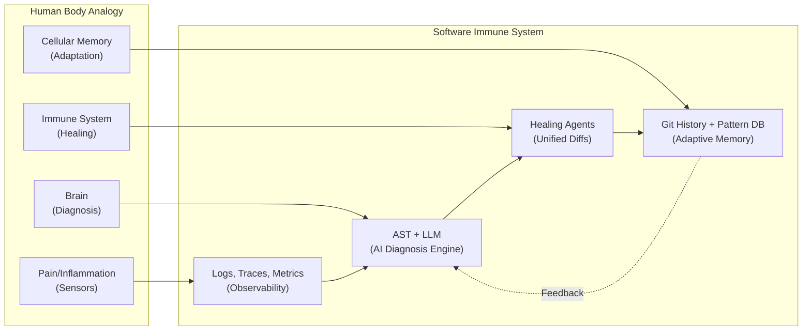

### 1.2 Core Mapping

| Human Body | Software System | H Chat Component |
|---|---|---|
| Pain/Inflammation (Sensors) | Logs, Traces, Metrics | `createLogger`, `alertConfig`, `webVitals`, OpenTelemetry |
| Brain (Diagnosis) | AI Orchestration Engine | AST Parser + LLM Root Cause Analysis |
| Immune System (Healing) | Healing Scripts & AI Agents | Unified Diffs Code Patching Agent |
| Cellular Memory | Version History & Git | Failure Pattern DB + Git History |

### 1.3 Goals and Success Criteria

| Goal | Metric | Target |
|---|---|---|
| Mean Time To Detect (MTTD) | Time from failure to alert | < 30 seconds |
| Mean Time To Diagnose (MTTD) | Time from alert to root cause | < 5 minutes |
| Mean Time To Repair (MTTR) | Time from diagnosis to patch | < 15 minutes |
| Auto-Repair Success Rate | Patches passing verification | >= 61% (GPT-4 Turbo baseline) |
| False Positive Rate | Incorrect diagnoses | < 10% |
| Human Escalation Rate | Failures requiring human intervention | < 39% |

### 1.4 Self-Healing Loop Overview

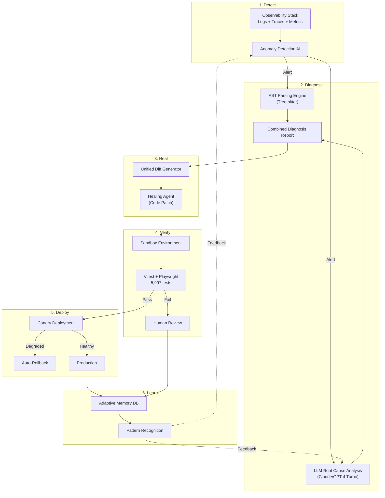

---

## 2. Observability Stack Design: Sensors

The Observability Stack forms the sensory nervous system of the Software Immune System. It extends the existing H Chat monitoring infrastructure (`createLogger`, `alertConfig`, `healthCheck`, `webVitals`) with enterprise-grade observability.

### 2.1 Architecture Overview

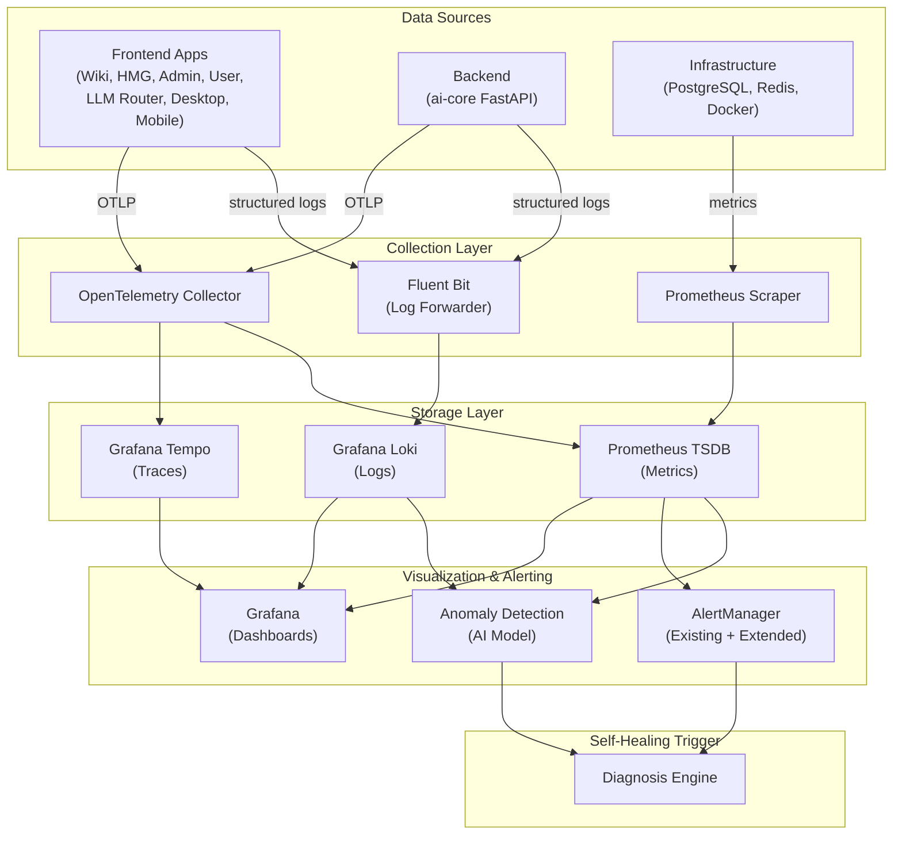

### 2.2 Logs: Structured Logging (Extending `createLogger`)

The existing `createLogger()` in `packages/ui/src/utils/logger.ts` provides context-bound structured logging with JSON output in production and console output in development. We extend it with OpenTelemetry trace correlation and a Fluent Bit transport.

**Current State**: `createLogger(context)` outputs `LogEntry` with level, message, timestamp, context, data, error. Custom transport is supported via `setTransport()`.

**Extension Design**:

```typescript
// packages/ui/src/utils/otelLogTransport.ts

import type { LogEntry } from './logger'

interface OTelLogConfig {
  serviceName: string
  serviceVersion: string
  collectorEndpoint: string
  batchSize?: number
  flushIntervalMs?: number
}

interface OTelLogEntry {
  timestamp: string
  severityNumber: number
  severityText: string
  body: string
  attributes: Record<string, string | number | boolean>
  resource: {
    'service.name': string
    'service.version': string
  }
  traceId?: string
  spanId?: string
}

const SEVERITY_MAP: Record<string, number> = {
  debug: 5,
  info: 9,
  warn: 13,
  error: 17,
}

function createOTelLogTransport(config: OTelLogConfig) {
  const {
    serviceName,
    serviceVersion,
    collectorEndpoint,
    batchSize = 50,
    flushIntervalMs = 5000,
  } = config

  const buffer: OTelLogEntry[] = []
  let flushTimer: ReturnType<typeof setTimeout> | null = null

  function mapToOTel(entry: LogEntry): OTelLogEntry {
    return {
      timestamp: entry.timestamp,
      severityNumber: SEVERITY_MAP[entry.level] ?? 9,
      severityText: entry.level.toUpperCase(),
      body: entry.message,
      attributes: {
        'log.context': entry.context ?? '',
        ...(entry.data
          ? Object.fromEntries(
              Object.entries(entry.data).map(([k, v]) => [k, String(v)])
            )
          : {}),
        ...(entry.error ? { 'error.message': entry.error.message } : {}),
        ...(entry.error?.stack ? { 'error.stack': entry.error.stack } : {}),
      },
      resource: {
        'service.name': serviceName,
        'service.version': serviceVersion,
      },
      // Trace correlation injected from active span context
      traceId: getActiveTraceId(),
      spanId: getActiveSpanId(),
    }
  }

  async function flush(): Promise<void> {
    if (buffer.length === 0) return

    const batch = buffer.splice(0, buffer.length)
    try {
      await fetch(`${collectorEndpoint}/v1/logs`, {
        method: 'POST',
        headers: { 'Content-Type': 'application/json' },
        body: JSON.stringify({ resourceLogs: batch }),
        keepalive: true,
      })
    } catch {
      // Re-buffer on failure (best-effort)
      buffer.unshift(...batch)
    }
  }

  function scheduleFlush(): void {
    if (flushTimer) return
    flushTimer = setTimeout(() => {
      flushTimer = null
      flush()
    }, flushIntervalMs)
  }

  return function transport(entry: LogEntry): void {
    buffer.push(mapToOTel(entry))

    if (buffer.length >= batchSize) {
      flush()
    } else {
      scheduleFlush()
    }
  }
}

// Active span context helpers (injected by OpenTelemetry SDK)
function getActiveTraceId(): string | undefined {
  if (typeof globalThis !== 'undefined') {
    return (globalThis as Record<string, unknown>).__otel_trace_id as
      | string
      | undefined
  }
  return undefined
}

function getActiveSpanId(): string | undefined {
  if (typeof globalThis !== 'undefined') {
    return (globalThis as Record<string, unknown>).__otel_span_id as
      | string
      | undefined
  }
  return undefined
}
```

**Integration with existing logger**:

```typescript
import { setTransport } from './logger'
import { createOTelLogTransport } from './otelLogTransport'

// Production initialization
if (process.env.NODE_ENV === 'production') {
  const transport = createOTelLogTransport({
    serviceName: '@hchat/user',
    serviceVersion: '1.0.0',
    collectorEndpoint: process.env.NEXT_PUBLIC_OTEL_COLLECTOR_URL ?? '',
  })
  setTransport(transport)
}
```

### 2.3 Traces: Distributed Tracing (OpenTelemetry)

Distributed tracing connects frontend user interactions to backend API calls, database queries, and LLM inference requests.

```typescript
// packages/ui/src/utils/tracing.ts

interface TracingConfig {
  serviceName: string
  collectorEndpoint: string
  sampleRate?: number
}

interface Span {
  name: string
  traceId: string
  spanId: string
  parentSpanId?: string
  startTime: number
  endTime?: number
  attributes: Record<string, string | number | boolean>
  status: 'ok' | 'error' | 'unset'
  events: SpanEvent[]
}

interface SpanEvent {
  name: string
  timestamp: number
  attributes?: Record<string, string | number>
}

function generateId(length: number): string {
  const bytes = new Uint8Array(length)
  crypto.getRandomValues(bytes)
  return Array.from(bytes)
    .map((b) => b.toString(16).padStart(2, '0'))
    .join('')
}

function createTracer(config: TracingConfig) {
  const { serviceName, collectorEndpoint, sampleRate = 0.1 } = config
  const activeSpans = new Map<string, Span>()

  function shouldSample(): boolean {
    return Math.random() < sampleRate
  }

  function startSpan(
    name: string,
    parentSpanId?: string,
    traceId?: string
  ): Span | null {
    if (!shouldSample()) return null

    const span: Span = {
      name,
      traceId: traceId ?? generateId(16),
      spanId: generateId(8),
      parentSpanId,
      startTime: performance.now(),
      attributes: { 'service.name': serviceName },
      status: 'unset',
      events: [],
    }

    activeSpans.set(span.spanId, span)
    return span
  }

  function endSpan(spanId: string, status: Span['status'] = 'ok'): void {
    const span = activeSpans.get(spanId)
    if (!span) return

    const finished: Span = {
      ...span,
      endTime: performance.now(),
      status,
    }

    activeSpans.delete(spanId)
    exportSpan(finished)
  }

  async function exportSpan(span: Span): Promise<void> {
    try {
      await fetch(`${collectorEndpoint}/v1/traces`, {
        method: 'POST',
        headers: { 'Content-Type': 'application/json' },
        body: JSON.stringify({ resourceSpans: [span] }),
        keepalive: true,
      })
    } catch {
      // Best-effort export
    }
  }

  return { startSpan, endSpan }
}
```

**Backend Tracing (Python FastAPI)**:

```python
# apps/ai-core/middleware/tracing.py

from opentelemetry import trace
from opentelemetry.sdk.trace import TracerProvider
from opentelemetry.sdk.trace.export import BatchSpanProcessor
from opentelemetry.exporter.otlp.proto.grpc.trace_exporter import OTLPSpanExporter
from opentelemetry.instrumentation.fastapi import FastAPIInstrumentor
from opentelemetry.instrumentation.sqlalchemy import SQLAlchemyInstrumentor
from opentelemetry.instrumentation.redis import RedisInstrumentor
from opentelemetry.sdk.resources import Resource

def init_tracing(app, service_name: str = "hchat-ai-core"):
    resource = Resource.create({
        "service.name": service_name,
        "service.version": "1.0.0",
        "deployment.environment": "production",
    })

    provider = TracerProvider(resource=resource)
    exporter = OTLPSpanExporter(
        endpoint="http://otel-collector:4317",
        insecure=True,
    )
    provider.add_span_processor(BatchSpanProcessor(exporter))
    trace.set_tracer_provider(provider)

    # Auto-instrument FastAPI, SQLAlchemy, Redis
    FastAPIInstrumentor.instrument_app(app)
    SQLAlchemyInstrumentor().instrument()
    RedisInstrumentor().instrument()

    return provider
```

### 2.4 Metrics: System and Business Metrics (Prometheus + Grafana)

**Extending the existing `alertConfig.ts` metric types**:

The current `AlertRule.metric` supports: `error_rate`, `response_time`, `cpu_usage`, `memory_usage`, `lcp`, `fid`, `cls`. We extend with self-healing-specific metrics.

```typescript
// packages/ui/src/utils/selfHealingMetrics.ts

interface SelfHealingMetrics {
  // Existing (from alertConfig.ts)
  errorRate: number
  responseTime: number
  cpuUsage: number
  memoryUsage: number

  // New: Self-Healing specific
  healingAttempts: number
  healingSuccessRate: number
  diagnosisLatencyMs: number
  patchGenerationLatencyMs: number
  verificationPassRate: number
  rollbackCount: number
  activeAnomalies: number
  patternMatchHitRate: number

  // New: Infrastructure
  dbConnectionPoolUtilization: number
  redisMemoryUsage: number
  llmInferenceLatencyMs: number
  llmTokensConsumed: number
}

const SELF_HEALING_ALERT_RULES = [
  {
    id: 'heal-success-low',
    name: 'Healing Success Rate Low',
    metric: 'healing_success_rate',
    condition: 'lt' as const,
    threshold: 50,
    channel: 'slack' as const,
    enabled: true,
  },
  {
    id: 'diag-latency-high',
    name: 'Diagnosis Latency High',
    metric: 'diagnosis_latency_ms',
    condition: 'gt' as const,
    threshold: 300000, // 5 minutes
    channel: 'slack' as const,
    enabled: true,
  },
  {
    id: 'rollback-spike',
    name: 'Rollback Spike',
    metric: 'rollback_count',
    condition: 'gt' as const,
    threshold: 3,
    channel: 'email' as const,
    enabled: true,
  },
  {
    id: 'llm-cost-high',
    name: 'LLM Token Consumption High',
    metric: 'llm_tokens_consumed',
    condition: 'gt' as const,
    threshold: 1000000, // 1M tokens per hour
    channel: 'slack' as const,
    enabled: true,
  },
] as const
```

**Prometheus Metrics Exporter (Python)**:

```python
# apps/ai-core/metrics/prometheus_exporter.py

from prometheus_client import Counter, Histogram, Gauge, CollectorRegistry

registry = CollectorRegistry()

# --- Self-Healing Metrics ---
healing_attempts_total = Counter(
    'self_healing_attempts_total',
    'Total number of self-healing attempts',
    ['severity', 'component'],
    registry=registry,
)

healing_success_total = Counter(
    'self_healing_success_total',
    'Total number of successful self-healing attempts',
    ['component'],
    registry=registry,
)

diagnosis_duration_seconds = Histogram(
    'self_healing_diagnosis_duration_seconds',
    'Time spent on diagnosis',
    ['method'],  # 'ast', 'llm', 'combined'
    buckets=[1, 5, 15, 30, 60, 120, 300],
    registry=registry,
)

patch_generation_duration_seconds = Histogram(
    'self_healing_patch_generation_duration_seconds',
    'Time spent generating code patches',
    buckets=[5, 15, 30, 60, 120, 300, 600],
    registry=registry,
)

verification_pass_rate = Gauge(
    'self_healing_verification_pass_rate',
    'Current verification pass rate (0-1)',
    registry=registry,
)

active_anomalies = Gauge(
    'self_healing_active_anomalies',
    'Number of currently active anomalies',
    ['severity'],
    registry=registry,
)

pattern_match_hit_rate = Gauge(
    'self_healing_pattern_match_hit_rate',
    'Rate of anomalies matching known patterns',
    registry=registry,
)

# --- LLM Metrics ---
llm_inference_duration_seconds = Histogram(
    'llm_inference_duration_seconds',
    'LLM inference latency',
    ['model', 'operation'],
    buckets=[0.5, 1, 2, 5, 10, 30, 60],
    registry=registry,
)

llm_tokens_consumed = Counter(
    'llm_tokens_consumed_total',
    'Total LLM tokens consumed',
    ['model', 'direction'],  # direction: 'input' or 'output'
    registry=registry,
)
```

### 2.5 Alerting: AI Anomaly Detection + AlertManager Extension

The existing `AlertManager` class in `packages/ui/src/utils/alertConfig.ts` provides rule-based alerting with cooldown and notification channels. We extend it with AI-based anomaly detection.

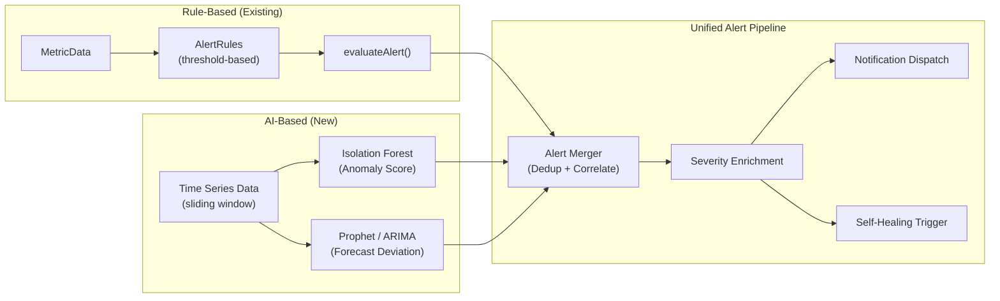

**Anomaly Detection Service (Python)**:

```python
# apps/ai-core/services/anomaly_detection.py

from dataclasses import dataclass
from typing import Optional
import numpy as np

@dataclass(frozen=True)
class AnomalyResult:
    metric_name: str
    is_anomaly: bool
    anomaly_score: float         # 0.0 - 1.0
    expected_value: float
    actual_value: float
    deviation_sigma: float
    timestamp: str
    suggested_severity: str      # 'info' | 'warning' | 'critical'

class SlidingWindowDetector:
    """Statistical anomaly detection using sliding window z-score."""

    def __init__(self, window_size: int = 100, sigma_threshold: float = 3.0):
        self._window_size = window_size
        self._sigma_threshold = sigma_threshold
        self._windows: dict[str, list[float]] = {}

    def ingest(self, metric_name: str, value: float, timestamp: str) -> Optional[AnomalyResult]:
        window = self._windows.setdefault(metric_name, [])
        window.append(value)

        if len(window) > self._window_size:
            window.pop(0)

        if len(window) < 10:
            return None

        arr = np.array(window[:-1])
        mean = float(np.mean(arr))
        std = float(np.std(arr))

        if std == 0:
            return None

        z_score = abs(value - mean) / std
        is_anomaly = z_score > self._sigma_threshold

        severity = 'info'
        if z_score > self._sigma_threshold * 2:
            severity = 'critical'
        elif z_score > self._sigma_threshold:
            severity = 'warning'

        return AnomalyResult(
            metric_name=metric_name,
            is_anomaly=is_anomaly,
            anomaly_score=min(z_score / (self._sigma_threshold * 2), 1.0),
            expected_value=mean,
            actual_value=value,
            deviation_sigma=z_score,
            timestamp=timestamp,
            suggested_severity=severity,
        )


class IsolationForestDetector:
    """Multivariate anomaly detection using Isolation Forest."""

    def __init__(self, contamination: float = 0.05):
        self._contamination = contamination
        self._model = None
        self._training_data: list[list[float]] = []
        self._min_samples = 200

    def train(self, data: list[list[float]]) -> None:
        from sklearn.ensemble import IsolationForest

        self._model = IsolationForest(
            contamination=self._contamination,
            random_state=42,
            n_estimators=100,
        )
        self._model.fit(data)

    def predict(self, sample: list[float]) -> float:
        """Returns anomaly score (negative = anomaly, positive = normal)."""
        if self._model is None:
            self._training_data.append(sample)
            if len(self._training_data) >= self._min_samples:
                self.train(self._training_data)
            return 0.0

        score = self._model.decision_function([sample])[0]
        return float(score)
```

---

## 3. Diagnosis Engine Design: Brain

The Diagnosis Engine combines deterministic AST analysis with probabilistic LLM reasoning to achieve accurate root cause identification while minimizing hallucination.

### 3.1 Architecture

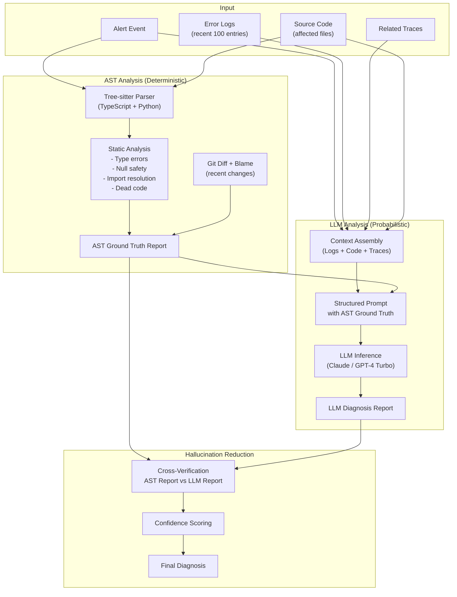

### 3.2 AST Parsing Engine

Tree-sitter provides incremental, error-tolerant parsing for both TypeScript and Python codebases in the H Chat monorepo.

```python
# apps/ai-core/services/ast_engine.py

from dataclasses import dataclass, field
from typing import Optional
import tree_sitter_typescript as ts_typescript
import tree_sitter_python as ts_python
from tree_sitter import Language, Parser

@dataclass(frozen=True)
class ASTIssue:
    file_path: str
    line_start: int
    line_end: int
    issue_type: str          # 'type_error' | 'null_safety' | 'import_missing' | 'syntax_error'
    severity: str            # 'error' | 'warning' | 'info'
    message: str
    code_snippet: str
    suggested_fix: Optional[str] = None

@dataclass(frozen=True)
class ASTReport:
    file_path: str
    language: str
    issues: tuple[ASTIssue, ...]
    functions: tuple[str, ...]      # Function/method names in file
    imports: tuple[str, ...]        # Import statements
    exports: tuple[str, ...]        # Export statements
    complexity_score: int           # Cyclomatic complexity
    parse_errors: tuple[str, ...]   # Syntax errors from tree-sitter

class ASTEngine:
    """Multi-language AST analysis engine using Tree-sitter."""

    def __init__(self):
        self._parsers: dict[str, Parser] = {}
        self._init_parsers()

    def _init_parsers(self) -> None:
        ts_lang = Language(ts_typescript.language_typescript())
        py_lang = Language(ts_python.language())

        ts_parser = Parser(ts_lang)
        py_parser = Parser(py_lang)

        self._parsers['typescript'] = ts_parser
        self._parsers['python'] = py_parser

    def analyze(self, file_path: str, source_code: str) -> ASTReport:
        language = self._detect_language(file_path)
        parser = self._parsers.get(language)
        if parser is None:
            return ASTReport(
                file_path=file_path,
                language=language,
                issues=(),
                functions=(),
                imports=(),
                exports=(),
                complexity_score=0,
                parse_errors=('Unsupported language',),
            )

        tree = parser.parse(source_code.encode('utf-8'))
        root = tree.root_node

        issues = self._find_issues(root, source_code, file_path, language)
        functions = self._extract_functions(root, language)
        imports = self._extract_imports(root, language)
        exports = self._extract_exports(root, language)
        parse_errors = self._find_parse_errors(root)
        complexity = self._compute_complexity(root, language)

        return ASTReport(
            file_path=file_path,
            language=language,
            issues=tuple(issues),
            functions=tuple(functions),
            imports=tuple(imports),
            exports=tuple(exports),
            complexity_score=complexity,
            parse_errors=tuple(parse_errors),
        )

    def _detect_language(self, file_path: str) -> str:
        if file_path.endswith(('.ts', '.tsx')):
            return 'typescript'
        if file_path.endswith('.py'):
            return 'python'
        return 'unknown'

    def _find_parse_errors(self, node) -> list[str]:
        errors = []
        if node.type == 'ERROR' or node.is_missing:
            errors.append(
                f"Parse error at line {node.start_point[0] + 1}: {node.type}"
            )
        for child in node.children:
            errors.extend(self._find_parse_errors(child))
        return errors

    def _find_issues(self, root, source: str, file_path: str, language: str) -> list[ASTIssue]:
        issues: list[ASTIssue] = []

        # Check for common patterns based on language
        if language == 'typescript':
            issues.extend(self._check_typescript_patterns(root, source, file_path))
        elif language == 'python':
            issues.extend(self._check_python_patterns(root, source, file_path))

        return issues

    def _check_typescript_patterns(self, root, source: str, file_path: str) -> list[ASTIssue]:
        issues: list[ASTIssue] = []
        # Check for unsafe optional chaining, missing null checks,
        # unused imports, mutation patterns, etc.
        self._walk_tree(root, issues, source, file_path)
        return issues

    def _check_python_patterns(self, root, source: str, file_path: str) -> list[ASTIssue]:
        issues: list[ASTIssue] = []
        self._walk_tree(root, issues, source, file_path)
        return issues

    def _walk_tree(self, node, issues: list, source: str, file_path: str) -> None:
        # Recursive tree walker for pattern detection
        for child in node.children:
            self._walk_tree(child, issues, source, file_path)

    def _extract_functions(self, root, language: str) -> list[str]:
        functions = []
        query_str = (
            '(function_declaration name: (identifier) @name)'
            if language == 'typescript'
            else '(function_definition name: (identifier) @name)'
        )
        # Tree-sitter query execution
        return functions

    def _extract_imports(self, root, language: str) -> list[str]:
        return []

    def _extract_exports(self, root, language: str) -> list[str]:
        return []

    def _compute_complexity(self, root, language: str) -> int:
        """Cyclomatic complexity estimation via branch counting."""
        branch_types = {
            'typescript': {'if_statement', 'for_statement', 'while_statement',
                          'switch_case', 'catch_clause', 'ternary_expression'},
            'python': {'if_statement', 'for_statement', 'while_statement',
                      'except_clause', 'conditional_expression'},
        }
        types = branch_types.get(language, set())
        return 1 + self._count_node_types(root, types)

    def _count_node_types(self, node, types: set) -> int:
        count = 1 if node.type in types else 0
        for child in node.children:
            count += self._count_node_types(child, types)
        return count
```

### 3.3 LLM-Combined Diagnosis

The LLM receives the AST Ground Truth Report as a factual anchor, reducing hallucination. The prompt structure forces the LLM to reference concrete evidence from the AST analysis rather than speculate.

```python
# apps/ai-core/services/diagnosis_engine.py

from dataclasses import dataclass
from typing import Optional

@dataclass(frozen=True)
class DiagnosisReport:
    incident_id: str
    root_cause: str
    confidence: float               # 0.0 - 1.0
    affected_files: tuple[str, ...]
    affected_functions: tuple[str, ...]
    error_category: str             # 'runtime' | 'type' | 'logic' | 'dependency' | 'config' | 'infra'
    ast_evidence: tuple[str, ...]   # Concrete AST findings
    llm_reasoning: str              # LLM explanation
    suggested_fix_strategy: str     # 'patch' | 'rollback' | 'config_change' | 'dependency_update'
    related_patterns: tuple[str, ...] # IDs of matching historical patterns
    human_review_recommended: bool

DIAGNOSIS_PROMPT_TEMPLATE = """You are a senior software engineer performing root cause analysis.

## Incident Context
- Alert: {alert_description}
- Severity: {severity}
- Timestamp: {timestamp}
- Service: {service_name}

## Error Logs (most recent)
```
{error_logs}
```

## Distributed Trace
```
{trace_summary}
```

## AST Ground Truth Report
The following findings are VERIFIED by static analysis. Use these as factual anchors:
```json
{ast_report_json}
```

## Recent Git Changes (last 24h)
```diff
{git_diff}
```

## Instructions
1. ONLY reference code locations that appear in the AST report or git diff
2. DO NOT speculate about code you have not seen
3. Identify the SINGLE most likely root cause
4. Rate your confidence (0.0-1.0)
5. Recommend ONE of: patch, rollback, config_change, dependency_update

## Response Format (JSON)
{{
  "root_cause": "concise description",
  "confidence": 0.XX,
  "affected_files": ["path/to/file.ts"],
  "affected_functions": ["functionName"],
  "error_category": "runtime|type|logic|dependency|config|infra",
  "evidence": ["AST finding 1", "Log line evidence"],
  "reasoning": "step-by-step explanation referencing evidence",
  "fix_strategy": "patch|rollback|config_change|dependency_update",
  "human_review_recommended": true|false
}}"""


class DiagnosisEngine:
    """Combines AST analysis with LLM reasoning for root cause analysis."""

    def __init__(self, ast_engine, llm_client, pattern_db):
        self._ast_engine = ast_engine
        self._llm_client = llm_client
        self._pattern_db = pattern_db

    async def diagnose(
        self,
        incident_id: str,
        alert_event: dict,
        error_logs: list[str],
        trace_summary: str,
        affected_files: dict[str, str],  # path -> source code
        git_diff: str,
    ) -> DiagnosisReport:
        # Step 1: AST analysis (deterministic ground truth)
        ast_reports = {}
        for file_path, source_code in affected_files.items():
            ast_reports[file_path] = self._ast_engine.analyze(file_path, source_code)

        # Step 2: Check historical patterns first
        pattern_matches = self._pattern_db.find_similar(
            error_logs=error_logs,
            affected_files=list(affected_files.keys()),
        )

        if pattern_matches and pattern_matches[0].confidence > 0.9:
            # High-confidence pattern match: use historical fix
            return self._create_pattern_based_report(
                incident_id, pattern_matches[0], ast_reports
            )

        # Step 3: LLM diagnosis with AST ground truth
        prompt = DIAGNOSIS_PROMPT_TEMPLATE.format(
            alert_description=alert_event.get('description', ''),
            severity=alert_event.get('severity', 'unknown'),
            timestamp=alert_event.get('timestamp', ''),
            service_name=alert_event.get('service', ''),
            error_logs='\n'.join(error_logs[-50:]),  # Last 50 log lines
            trace_summary=trace_summary,
            ast_report_json=self._serialize_ast_reports(ast_reports),
            git_diff=git_diff[:5000],  # Limit context size
        )

        llm_response = await self._llm_client.invoke(
            model='claude-sonnet-4-20250514',
            messages=[{'role': 'user', 'content': prompt}],
            temperature=0.1,  # Low temperature for deterministic diagnosis
            max_tokens=2000,
        )

        diagnosis = self._parse_llm_response(llm_response)

        # Step 4: Cross-verify LLM claims against AST evidence
        verified_diagnosis = self._cross_verify(diagnosis, ast_reports)

        return DiagnosisReport(
            incident_id=incident_id,
            root_cause=verified_diagnosis['root_cause'],
            confidence=verified_diagnosis['confidence'],
            affected_files=tuple(verified_diagnosis['affected_files']),
            affected_functions=tuple(verified_diagnosis.get('affected_functions', [])),
            error_category=verified_diagnosis['error_category'],
            ast_evidence=tuple(self._extract_ast_evidence(ast_reports)),
            llm_reasoning=verified_diagnosis['reasoning'],
            suggested_fix_strategy=verified_diagnosis['fix_strategy'],
            related_patterns=tuple(p.pattern_id for p in pattern_matches[:3]),
            human_review_recommended=verified_diagnosis.get('human_review_recommended', True),
        )

    def _cross_verify(self, llm_diagnosis: dict, ast_reports: dict) -> dict:
        """Reduce hallucination by verifying LLM claims against AST findings."""
        verified_files = []
        for f in llm_diagnosis.get('affected_files', []):
            if f in ast_reports:
                verified_files.append(f)

        # Penalize confidence if LLM references files not in AST reports
        unverified_count = len(llm_diagnosis.get('affected_files', [])) - len(verified_files)
        confidence_penalty = unverified_count * 0.15
        adjusted_confidence = max(
            0.1,
            llm_diagnosis.get('confidence', 0.5) - confidence_penalty
        )

        return {
            **llm_diagnosis,
            'affected_files': verified_files if verified_files else llm_diagnosis.get('affected_files', []),
            'confidence': adjusted_confidence,
            'human_review_recommended': adjusted_confidence < 0.6,
        }

    def _serialize_ast_reports(self, reports: dict) -> str:
        import json
        serializable = {}
        for path, report in reports.items():
            serializable[path] = {
                'issues': [
                    {'type': i.issue_type, 'line': i.line_start, 'message': i.message}
                    for i in report.issues
                ],
                'functions': list(report.functions),
                'complexity': report.complexity_score,
                'parse_errors': list(report.parse_errors),
            }
        return json.dumps(serializable, indent=2)

    def _extract_ast_evidence(self, reports: dict) -> list[str]:
        evidence = []
        for path, report in reports.items():
            for issue in report.issues:
                evidence.append(f"{path}:{issue.line_start} - {issue.message}")
        return evidence

    def _parse_llm_response(self, response) -> dict:
        import json
        try:
            content = response.get('content', '')
            # Extract JSON from potential markdown code block
            if '```json' in content:
                content = content.split('```json')[1].split('```')[0]
            return json.loads(content.strip())
        except (json.JSONDecodeError, IndexError):
            return {
                'root_cause': 'Failed to parse LLM response',
                'confidence': 0.1,
                'affected_files': [],
                'error_category': 'unknown',
                'reasoning': 'LLM response parsing failed',
                'fix_strategy': 'rollback',
                'human_review_recommended': True,
            }

    def _create_pattern_based_report(self, incident_id, pattern, ast_reports) -> DiagnosisReport:
        return DiagnosisReport(
            incident_id=incident_id,
            root_cause=pattern.root_cause,
            confidence=pattern.confidence,
            affected_files=tuple(pattern.affected_files),
            affected_functions=tuple(pattern.affected_functions),
            error_category=pattern.error_category,
            ast_evidence=tuple(self._extract_ast_evidence(ast_reports)),
            llm_reasoning=f"Pattern match: {pattern.pattern_id}",
            suggested_fix_strategy=pattern.fix_strategy,
            related_patterns=(pattern.pattern_id,),
            human_review_recommended=False,
        )
```

### 3.4 Hallucination Reduction Strategy

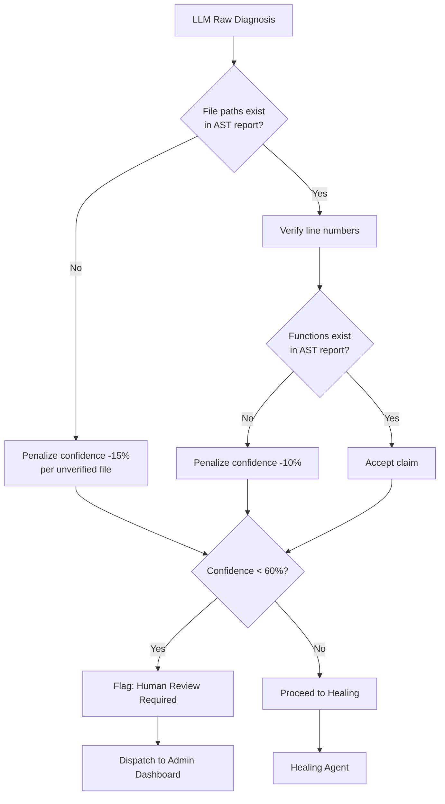

| Technique | Description | Impact |
|---|---|---|
| AST Ground Truth Anchoring | Force LLM to reference only verified code locations | Eliminates phantom file/function references |
| Confidence Penalty | Deduct confidence for each unverifiable LLM claim | Prevents over-confident false diagnoses |
| Low Temperature (0.1) | Near-deterministic LLM output | Reduces creative hallucination |
| Structured JSON Output | Constrained response format | Prevents freeform speculation |
| Cross-Verification Gate | AST vs LLM claim intersection | Only verified claims pass through |
| Pattern DB Priority | High-confidence historical matches bypass LLM | Avoids LLM entirely for known issues |

---

## 4. Healing Agent Design: Immune System

The Healing Agent generates code patches as Unified Diffs, ensuring precise, reviewable, and non-destructive modifications.

### 4.1 Architecture

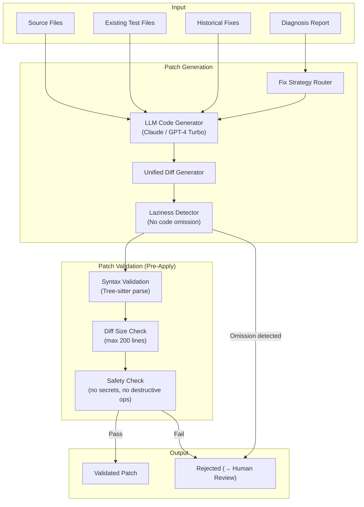

### 4.2 Unified Diffs-Based Code Patching

```python
# apps/ai-core/services/healing_agent.py

from dataclasses import dataclass
from typing import Optional
import re

@dataclass(frozen=True)
class PatchHunk:
    file_path: str
    original_start: int
    original_count: int
    modified_start: int
    modified_count: int
    content: str

@dataclass(frozen=True)
class HealingPatch:
    patch_id: str
    incident_id: str
    files_modified: tuple[str, ...]
    unified_diff: str
    hunks: tuple[PatchHunk, ...]
    description: str
    confidence: float
    estimated_risk: str       # 'low' | 'medium' | 'high'
    rollback_command: str

HEALING_PROMPT_TEMPLATE = """You are a precise code repair agent. Generate a minimal fix as a unified diff.

## Diagnosis
{diagnosis_summary}

## Root Cause
{root_cause}

## Affected File: {file_path}
```{language}
{source_code}
```

## Related Test File (if exists)
```{language}
{test_code}
```

## Historical Fix Pattern (if available)
{historical_fix}

## CRITICAL RULES
1. Output ONLY a valid unified diff (--- a/path, +++ b/path, @@ hunks)
2. NEVER omit code with comments like "// ... rest of the code"
3. NEVER use ellipsis (...) or placeholders
4. Include COMPLETE context lines (3 lines before and after changes)
5. Make the MINIMAL change necessary to fix the issue
6. Preserve existing code style and formatting
7. Do NOT introduce new dependencies unless absolutely necessary
8. Do NOT modify unrelated code
9. Ensure the fix does NOT break existing tests

## Output Format
```diff
--- a/{file_path}
+++ b/{file_path}
@@ -line,count +line,count @@
 context line
-removed line
+added line
 context line
```"""


class HealingAgent:
    """Generates and validates code patches for diagnosed issues."""

    def __init__(self, llm_client, ast_engine, pattern_db):
        self._llm_client = llm_client
        self._ast_engine = ast_engine
        self._pattern_db = pattern_db

    async def generate_patch(
        self,
        diagnosis: 'DiagnosisReport',
        source_files: dict[str, str],
        test_files: dict[str, str],
    ) -> Optional[HealingPatch]:
        # Step 1: Check for known fix pattern
        historical_fix = self._pattern_db.get_fix_template(
            diagnosis.related_patterns
        )

        patches = []
        for file_path in diagnosis.affected_files:
            source = source_files.get(file_path)
            if source is None:
                continue

            # Find related test file
            test_path = self._find_test_file(file_path, test_files)
            test_code = test_files.get(test_path, '') if test_path else ''

            language = 'typescript' if file_path.endswith(('.ts', '.tsx')) else 'python'

            prompt = HEALING_PROMPT_TEMPLATE.format(
                diagnosis_summary=diagnosis.root_cause,
                root_cause=diagnosis.llm_reasoning,
                file_path=file_path,
                language=language,
                source_code=source,
                test_code=test_code[:3000],
                historical_fix=historical_fix or 'No historical fix available',
            )

            response = await self._llm_client.invoke(
                model='claude-sonnet-4-20250514',
                messages=[{'role': 'user', 'content': prompt}],
                temperature=0.0,  # Deterministic patches
                max_tokens=4000,
            )

            diff_text = self._extract_diff(response.get('content', ''))
            if diff_text is None:
                continue

            # Step 2: Validate the diff
            validation = self._validate_diff(diff_text, file_path, source, language)
            if not validation['valid']:
                continue

            patches.append(diff_text)

        if not patches:
            return None

        unified_diff = '\n'.join(patches)
        hunks = self._parse_hunks(unified_diff)

        return HealingPatch(
            patch_id=f"patch-{diagnosis.incident_id}-{self._generate_id()}",
            incident_id=diagnosis.incident_id,
            files_modified=diagnosis.affected_files,
            unified_diff=unified_diff,
            hunks=tuple(hunks),
            description=f"Auto-fix for: {diagnosis.root_cause}",
            confidence=diagnosis.confidence,
            estimated_risk=self._estimate_risk(hunks),
            rollback_command=f"git revert --no-commit HEAD",
        )

    def _extract_diff(self, content: str) -> Optional[str]:
        """Extract unified diff from LLM response."""
        # Try to find diff in code block
        diff_match = re.search(r'```diff\n(.*?)```', content, re.DOTALL)
        if diff_match:
            return diff_match.group(1).strip()

        # Try to find raw diff format
        if '--- a/' in content and '+++ b/' in content:
            lines = content.split('\n')
            diff_lines = []
            in_diff = False
            for line in lines:
                if line.startswith('--- a/') or line.startswith('+++ b/'):
                    in_diff = True
                if in_diff:
                    diff_lines.append(line)
            if diff_lines:
                return '\n'.join(diff_lines)

        return None

    def _validate_diff(
        self, diff_text: str, file_path: str, original_source: str, language: str
    ) -> dict:
        """Multi-stage validation of generated diff."""
        issues = []

        # Check 1: Laziness detection (no code omission)
        laziness_patterns = [
            r'//\s*\.\.\.', r'#\s*\.\.\.', r'//\s*rest of',
            r'#\s*rest of', r'//\s*remaining', r'#\s*remaining',
            r'//\s*\.\.\.\s*existing', r'//\s*omitted',
            r'//\s*unchanged', r'#\s*unchanged',
        ]
        for pattern in laziness_patterns:
            if re.search(pattern, diff_text, re.IGNORECASE):
                issues.append(f"Code omission detected: {pattern}")

        # Check 2: Diff size limit (max 200 changed lines)
        changed_lines = sum(
            1 for line in diff_text.split('\n')
            if line.startswith('+') or line.startswith('-')
        )
        if changed_lines > 200:
            issues.append(f"Diff too large: {changed_lines} changed lines (max 200)")

        # Check 3: Syntax validation (apply diff, then parse)
        patched_source = self._apply_diff(original_source, diff_text)
        if patched_source is not None:
            report = self._ast_engine.analyze(file_path, patched_source)
            if report.parse_errors:
                issues.append(f"Patched code has syntax errors: {report.parse_errors}")

        # Check 4: Safety check (no secrets, no destructive operations)
        danger_patterns = [
            r'(api[_-]?key|secret|password|token)\s*[:=]\s*["\']',
            r'rm\s+-rf\s+/',
            r'DROP\s+TABLE',
            r'TRUNCATE\s+TABLE',
            r'process\.exit',
            r'os\.system',
            r'subprocess\.call.*shell=True',
        ]
        for pattern in danger_patterns:
            added_lines = [
                l[1:] for l in diff_text.split('\n') if l.startswith('+')
            ]
            for line in added_lines:
                if re.search(pattern, line, re.IGNORECASE):
                    issues.append(f"Safety violation: {pattern}")

        return {'valid': len(issues) == 0, 'issues': issues}

    def _apply_diff(self, original: str, diff_text: str) -> Optional[str]:
        """Apply unified diff to original source (simplified)."""
        try:
            import subprocess
            result = subprocess.run(
                ['patch', '--no-backup-if-mismatch', '-p1'],
                input=f"--- a/file\n+++ b/file\n{diff_text}",
                capture_output=True,
                text=True,
                timeout=5,
            )
            if result.returncode == 0:
                return result.stdout
        except (subprocess.TimeoutExpired, FileNotFoundError):
            pass
        return None

    def _estimate_risk(self, hunks: list) -> str:
        total_changes = sum(h.original_count + h.modified_count for h in hunks)
        if total_changes > 100:
            return 'high'
        if total_changes > 30:
            return 'medium'
        return 'low'

    def _parse_hunks(self, diff_text: str) -> list[PatchHunk]:
        hunks = []
        current_file = ''
        for line in diff_text.split('\n'):
            if line.startswith('--- a/'):
                current_file = line[6:]
            elif line.startswith('@@ '):
                match = re.match(r'@@ -(\d+),?(\d*) \+(\d+),?(\d*) @@', line)
                if match:
                    hunks.append(PatchHunk(
                        file_path=current_file,
                        original_start=int(match.group(1)),
                        original_count=int(match.group(2) or '1'),
                        modified_start=int(match.group(3)),
                        modified_count=int(match.group(4) or '1'),
                        content=line,
                    ))
        return hunks

    def _find_test_file(self, source_path: str, test_files: dict) -> Optional[str]:
        """Locate test file for a given source file."""
        base = source_path.replace('.ts', '.test.ts').replace('.tsx', '.test.tsx')
        if base in test_files:
            return base
        # Check __tests__ directory pattern
        parts = source_path.split('/')
        test_base = parts[-1].replace('.ts', '.test.ts').replace('.tsx', '.test.tsx')
        for key in test_files:
            if key.endswith(test_base):
                return key
        return None

    def _generate_id(self) -> str:
        import time
        import random
        return f"{int(time.time())}-{random.randint(1000, 9999)}"
```

### 4.3 Laziness Prevention

Code omission ("laziness") is one of the most dangerous LLM failure modes in code generation. The Healing Agent enforces strict anti-laziness rules.

| Detection Pattern | Example | Action |
|---|---|---|
| Ellipsis comments | `// ... rest of the code` | Reject patch |
| Placeholder comments | `// remaining code unchanged` | Reject patch |
| Missing context lines | Diff with < 3 context lines per hunk | Reject patch |
| Incomplete functions | Function body shorter than original | Flag for review |
| Missing imports | New code references undeclared imports | Flag for review |

### 4.4 Recovery Performance KPI

| Metric | Baseline (GPT-4 Turbo) | Target (H Chat) | Measurement |
|---|---|---|---|
| Overall Auto-Repair Rate | 61% | >= 65% | Patches passing full test suite |
| Runtime Error Fix Rate | 72% | >= 75% | Fixes for TypeError, ReferenceError, etc. |
| Type Error Fix Rate | 58% | >= 62% | Fixes for TypeScript type mismatches |
| Logic Error Fix Rate | 41% | >= 45% | Fixes for incorrect business logic |
| Config Error Fix Rate | 89% | >= 90% | Fixes for environment/config issues |

---

## 5. Verification System

The Verification System ensures that healing patches do not introduce regressions. Every patch runs through an automated sandbox before any production deployment.

### 5.1 Architecture

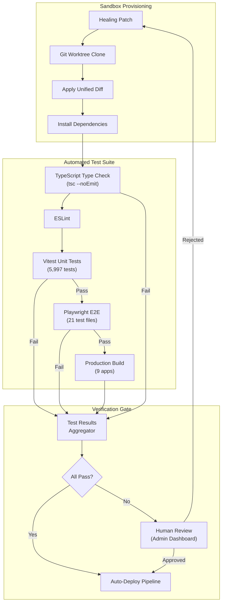

### 5.2 Sandbox Auto-Provisioning

```python
# apps/ai-core/services/sandbox_manager.py

from dataclasses import dataclass
import subprocess
import os
import shutil
from pathlib import Path

@dataclass(frozen=True)
class SandboxResult:
    sandbox_id: str
    patch_id: str
    type_check_passed: bool
    lint_passed: bool
    unit_tests_passed: bool
    unit_tests_total: int
    unit_tests_failed: int
    e2e_tests_passed: bool
    build_passed: bool
    overall_passed: bool
    duration_seconds: float
    error_output: str

class SandboxManager:
    """Manages isolated sandbox environments for patch verification."""

    def __init__(self, repo_root: str, sandbox_root: str = '/tmp/hchat-sandbox'):
        self._repo_root = repo_root
        self._sandbox_root = sandbox_root

    async def verify_patch(self, patch_id: str, unified_diff: str) -> SandboxResult:
        import time
        start = time.time()
        sandbox_path = os.path.join(self._sandbox_root, patch_id)
        errors = []

        try:
            # Step 1: Create git worktree (isolated copy)
            self._create_worktree(sandbox_path)

            # Step 2: Apply the unified diff
            apply_success = self._apply_patch(sandbox_path, unified_diff)
            if not apply_success:
                return self._failure_result(
                    patch_id, time.time() - start, 'Failed to apply patch'
                )

            # Step 3: Install dependencies
            self._run_command(sandbox_path, 'npm ci --prefer-offline')

            # Step 4: Type check
            type_check = self._run_command(sandbox_path, 'npx turbo run type-check')

            # Step 5: Lint
            lint = self._run_command(sandbox_path, 'npx turbo run lint')

            # Step 6: Unit tests (Vitest)
            unit_tests = self._run_command(
                sandbox_path, 'npx vitest run --reporter=json',
                timeout=300
            )
            unit_result = self._parse_vitest_result(unit_tests['stdout'])

            # Step 7: E2E tests (Playwright) - only if unit tests pass
            e2e_passed = False
            if unit_result['passed']:
                e2e = self._run_command(
                    sandbox_path, 'npx playwright test --reporter=json',
                    timeout=600
                )
                e2e_passed = e2e['returncode'] == 0

            # Step 8: Build check
            build = self._run_command(
                sandbox_path, 'npx turbo run build',
                timeout=600
            )

            overall = (
                type_check['returncode'] == 0
                and lint['returncode'] == 0
                and unit_result['passed']
                and e2e_passed
                and build['returncode'] == 0
            )

            return SandboxResult(
                sandbox_id=f"sandbox-{patch_id}",
                patch_id=patch_id,
                type_check_passed=type_check['returncode'] == 0,
                lint_passed=lint['returncode'] == 0,
                unit_tests_passed=unit_result['passed'],
                unit_tests_total=unit_result['total'],
                unit_tests_failed=unit_result['failed'],
                e2e_tests_passed=e2e_passed,
                build_passed=build['returncode'] == 0,
                overall_passed=overall,
                duration_seconds=time.time() - start,
                error_output='\n'.join(errors),
            )
        finally:
            self._cleanup_worktree(sandbox_path)

    def _create_worktree(self, path: str) -> None:
        branch_name = f"sandbox-{os.path.basename(path)}"
        subprocess.run(
            ['git', 'worktree', 'add', '-b', branch_name, path, 'HEAD'],
            cwd=self._repo_root,
            capture_output=True,
            check=True,
        )

    def _apply_patch(self, sandbox_path: str, diff: str) -> bool:
        result = subprocess.run(
            ['git', 'apply', '--check', '-'],
            input=diff,
            cwd=sandbox_path,
            capture_output=True,
            text=True,
        )
        if result.returncode != 0:
            return False

        result = subprocess.run(
            ['git', 'apply', '-'],
            input=diff,
            cwd=sandbox_path,
            capture_output=True,
            text=True,
        )
        return result.returncode == 0

    def _run_command(
        self, cwd: str, command: str, timeout: int = 120
    ) -> dict:
        try:
            result = subprocess.run(
                command.split(),
                cwd=cwd,
                capture_output=True,
                text=True,
                timeout=timeout,
            )
            return {
                'returncode': result.returncode,
                'stdout': result.stdout,
                'stderr': result.stderr,
            }
        except subprocess.TimeoutExpired:
            return {'returncode': 1, 'stdout': '', 'stderr': 'Timeout'}

    def _parse_vitest_result(self, output: str) -> dict:
        import json
        try:
            data = json.loads(output)
            total = data.get('numTotalTests', 0)
            failed = data.get('numFailedTests', 0)
            return {
                'passed': failed == 0 and total > 0,
                'total': total,
                'failed': failed,
            }
        except json.JSONDecodeError:
            return {'passed': False, 'total': 0, 'failed': 0}

    def _cleanup_worktree(self, path: str) -> None:
        try:
            subprocess.run(
                ['git', 'worktree', 'remove', '--force', path],
                cwd=self._repo_root,
                capture_output=True,
            )
        except Exception:
            if os.path.exists(path):
                shutil.rmtree(path, ignore_errors=True)

    def _failure_result(self, patch_id: str, duration: float, error: str) -> SandboxResult:
        return SandboxResult(
            sandbox_id=f"sandbox-{patch_id}",
            patch_id=patch_id,
            type_check_passed=False,
            lint_passed=False,
            unit_tests_passed=False,
            unit_tests_total=0,
            unit_tests_failed=0,
            e2e_tests_passed=False,
            build_passed=False,
            overall_passed=False,
            duration_seconds=duration,
            error_output=error,
        )
```

### 5.3 Human Review Trigger

When automated verification fails, the system creates a structured review request dispatched to the Admin Dashboard and notification channels.

```typescript
// packages/ui/src/admin/services/healingReviewService.ts

interface HealingReviewRequest {
  readonly reviewId: string
  readonly incidentId: string
  readonly patchId: string
  readonly diagnosis: {
    readonly rootCause: string
    readonly confidence: number
    readonly errorCategory: string
  }
  readonly patch: {
    readonly unifiedDiff: string
    readonly filesModified: readonly string[]
    readonly estimatedRisk: 'low' | 'medium' | 'high'
  }
  readonly verification: {
    readonly typeCheckPassed: boolean
    readonly lintPassed: boolean
    readonly unitTestsPassed: boolean
    readonly unitTestsFailed: number
    readonly e2eTestsPassed: boolean
    readonly buildPassed: boolean
    readonly errorOutput: string
  }
  readonly status: 'pending' | 'approved' | 'rejected' | 'expired'
  readonly createdAt: string
  readonly expiresAt: string
  readonly assignedTo?: string
}

function createHealingReviewRequest(
  incidentId: string,
  patchId: string,
  diagnosis: HealingReviewRequest['diagnosis'],
  patch: HealingReviewRequest['patch'],
  verification: HealingReviewRequest['verification'],
): HealingReviewRequest {
  const now = new Date()
  const expiresAt = new Date(now.getTime() + 4 * 60 * 60 * 1000) // 4 hours

  return {
    reviewId: `review-${Date.now()}-${Math.random().toString(36).slice(2, 8)}`,
    incidentId,
    patchId,
    diagnosis,
    patch,
    verification,
    status: 'pending',
    createdAt: now.toISOString(),
    expiresAt: expiresAt.toISOString(),
  }
}
```

---

## 6. Automated Deployment: Deploy and CI/CD

### 6.1 Extended GitHub Actions Pipeline

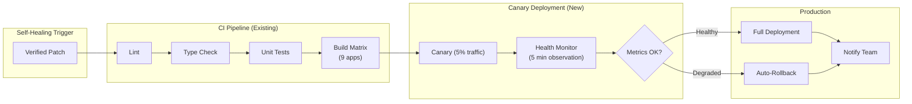

### 6.2 Self-Healing GitHub Actions Workflow

```yaml
# .github/workflows/self-healing.yml
name: Self-Healing Deploy

on:
  repository_dispatch:
    types: [self-healing-patch]

concurrency:
  group: self-healing-${{ github.event.client_payload.incident_id }}
  cancel-in-progress: true

env:
  INCIDENT_ID: ${{ github.event.client_payload.incident_id }}
  PATCH_ID: ${{ github.event.client_payload.patch_id }}

jobs:
  apply-and-verify:
    runs-on: ubuntu-latest
    timeout-minutes: 30
    steps:
      - name: Checkout
        uses: actions/checkout@v6

      - name: Setup Node
        uses: actions/setup-node@v6
        with:
          node-version: '20'

      - name: Restore node_modules cache
        uses: actions/cache@v5
        with:
          path: node_modules
          key: nm-${{ runner.os }}-${{ hashFiles('package-lock.json') }}

      - name: Install dependencies
        run: npm ci

      - name: Apply healing patch
        run: |
          echo "${{ github.event.client_payload.unified_diff }}" | git apply -
          git add -A
          git commit -m "fix: auto-heal incident ${{ env.INCIDENT_ID }}

          Patch: ${{ env.PATCH_ID }}
          Root Cause: ${{ github.event.client_payload.root_cause }}

          Co-Authored-By: Self-Healing Agent <self-healing@hchat.ai>"

      - name: Type check
        run: npx turbo run type-check

      - name: Lint
        run: npx turbo run lint

      - name: Unit tests
        run: npm test

      - name: Build all apps
        run: npx turbo run build

  canary-deploy:
    needs: apply-and-verify
    runs-on: ubuntu-latest
    timeout-minutes: 15
    steps:
      - name: Deploy canary (5% traffic)
        run: |
          # Deploy to canary slot via Vercel preview deployment
          echo "Deploying canary for incident ${{ env.INCIDENT_ID }}"

      - name: Monitor canary health (5 minutes)
        run: |
          for i in $(seq 1 10); do
            # Check health endpoint every 30 seconds
            HEALTH=$(curl -sf "${{ secrets.CANARY_HEALTH_URL }}" || echo '{"status":"unhealthy"}')
            STATUS=$(echo $HEALTH | jq -r '.status')
            echo "Check $i/10: $STATUS"
            if [ "$STATUS" = "unhealthy" ]; then
              echo "Canary unhealthy - triggering rollback"
              exit 1
            fi
            sleep 30
          done
          echo "Canary healthy after 5 minutes"

      - name: Promote to production
        if: success()
        run: |
          echo "Promoting canary to production"

      - name: Rollback on failure
        if: failure()
        run: |
          echo "Rolling back canary deployment"
          # Revert the commit
          git revert --no-commit HEAD
          git commit -m "revert: rollback auto-heal ${{ env.INCIDENT_ID }}"

  notify:
    needs: [apply-and-verify, canary-deploy]
    runs-on: ubuntu-latest
    if: always()
    steps:
      - name: Notify team
        run: |
          STATUS="${{ needs.canary-deploy.result }}"
          if [ "$STATUS" = "success" ]; then
            echo "Self-healing successful for incident ${{ env.INCIDENT_ID }}"
          else
            echo "Self-healing failed - human review required"
          fi
```

### 6.3 Canary Deployment Strategy

| Phase | Traffic Split | Duration | Criteria |
|---|---|---|---|
| Canary | 5% | 5 minutes | Error rate < 1%, P95 latency < 2s |
| Staging | 25% | 10 minutes | Error rate < 0.5%, P95 latency < 1.5s |
| Production | 100% | Continuous | Normal monitoring thresholds |

**Automatic Rollback Triggers**:
- Error rate exceeds 5% during canary
- P95 latency exceeds 3s during canary
- Any critical alert fires during canary
- Health check returns `unhealthy` or `degraded`

---

## 7. Adaptive Memory System

The Adaptive Memory System forms the "cellular memory" of the Software Immune System, learning from past incidents to enable faster diagnosis and preventive healing.

### 7.1 Architecture

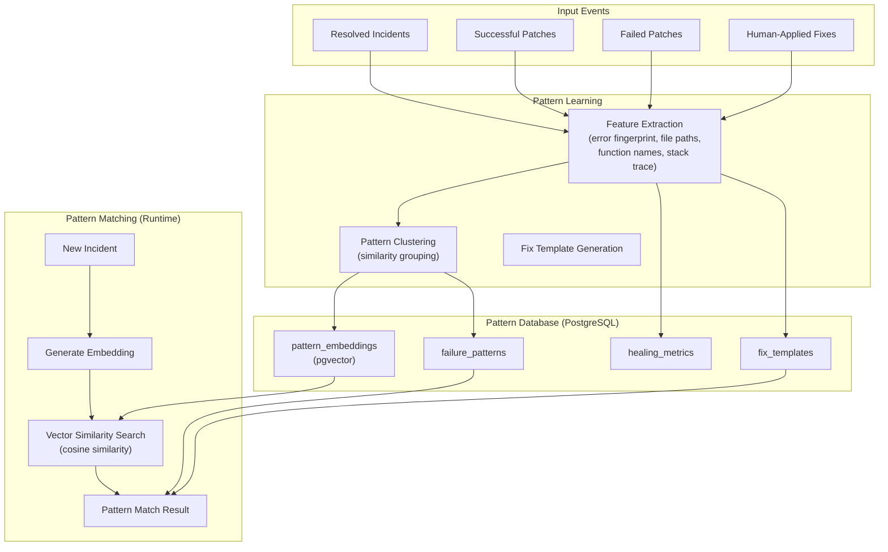

### 7.2 Database Schema

```sql
-- docker/migrations/004_self_healing.sql

-- Failure pattern records
CREATE TABLE IF NOT EXISTS failure_patterns (
    id              UUID PRIMARY KEY DEFAULT gen_random_uuid(),
    fingerprint     TEXT NOT NULL UNIQUE,
    root_cause      TEXT NOT NULL,
    error_category  TEXT NOT NULL,  -- 'runtime' | 'type' | 'logic' | 'dependency' | 'config' | 'infra'
    affected_files  TEXT[] NOT NULL,
    affected_functions TEXT[] DEFAULT '{}',
    error_signatures TEXT[] NOT NULL,   -- Normalized error message patterns
    occurrence_count INTEGER DEFAULT 1,
    last_seen       TIMESTAMPTZ DEFAULT now(),
    first_seen      TIMESTAMPTZ DEFAULT now(),
    fix_strategy    TEXT,  -- 'patch' | 'rollback' | 'config_change' | 'dependency_update'
    avg_diagnosis_ms INTEGER,
    avg_repair_ms   INTEGER,
    auto_fix_success_rate REAL DEFAULT 0.0,
    metadata        JSONB DEFAULT '{}',
    created_at      TIMESTAMPTZ DEFAULT now(),
    updated_at      TIMESTAMPTZ DEFAULT now()
);

CREATE INDEX idx_failure_patterns_fingerprint ON failure_patterns(fingerprint);
CREATE INDEX idx_failure_patterns_category ON failure_patterns(error_category);
CREATE INDEX idx_failure_patterns_last_seen ON failure_patterns(last_seen DESC);

-- Fix templates (proven patches for known patterns)
CREATE TABLE IF NOT EXISTS fix_templates (
    id              UUID PRIMARY KEY DEFAULT gen_random_uuid(),
    pattern_id      UUID REFERENCES failure_patterns(id) ON DELETE CASCADE,
    unified_diff    TEXT NOT NULL,
    description     TEXT NOT NULL,
    success_count   INTEGER DEFAULT 0,
    failure_count   INTEGER DEFAULT 0,
    success_rate    REAL GENERATED ALWAYS AS (
        CASE WHEN (success_count + failure_count) > 0
        THEN success_count::REAL / (success_count + failure_count)
        ELSE 0.0 END
    ) STORED,
    is_active       BOOLEAN DEFAULT true,
    created_by      TEXT DEFAULT 'auto',  -- 'auto' or user email
    created_at      TIMESTAMPTZ DEFAULT now()
);

CREATE INDEX idx_fix_templates_pattern ON fix_templates(pattern_id);
CREATE INDEX idx_fix_templates_success_rate ON fix_templates(success_rate DESC);

-- Pattern embeddings for vector similarity search
CREATE TABLE IF NOT EXISTS pattern_embeddings (
    id          UUID PRIMARY KEY DEFAULT gen_random_uuid(),
    pattern_id  UUID REFERENCES failure_patterns(id) ON DELETE CASCADE,
    embedding   vector(1536) NOT NULL,  -- OpenAI ada-002 or equivalent
    created_at  TIMESTAMPTZ DEFAULT now()
);

CREATE INDEX idx_pattern_embeddings_vector ON pattern_embeddings
    USING ivfflat (embedding vector_cosine_ops) WITH (lists = 100);

-- Healing metrics (audit trail)
CREATE TABLE IF NOT EXISTS healing_events (
    id                  UUID PRIMARY KEY DEFAULT gen_random_uuid(),
    incident_id         TEXT NOT NULL,
    pattern_id          UUID REFERENCES failure_patterns(id),
    patch_id            TEXT,
    phase               TEXT NOT NULL,  -- 'detect' | 'diagnose' | 'heal' | 'verify' | 'deploy'
    status              TEXT NOT NULL,  -- 'started' | 'success' | 'failure' | 'skipped'
    duration_ms         INTEGER,
    details             JSONB DEFAULT '{}',
    created_at          TIMESTAMPTZ DEFAULT now()
);

CREATE INDEX idx_healing_events_incident ON healing_events(incident_id);
CREATE INDEX idx_healing_events_phase ON healing_events(phase, status);
CREATE INDEX idx_healing_events_created ON healing_events(created_at DESC);

-- Track schema migration
INSERT INTO schema_migrations (version, description)
VALUES ('004', 'Self-healing system tables')
ON CONFLICT (version) DO NOTHING;
```

### 7.3 Pattern Matching Service

```python
# apps/ai-core/services/pattern_db.py

from dataclasses import dataclass
from typing import Optional
import hashlib
import json

@dataclass(frozen=True)
class PatternMatch:
    pattern_id: str
    fingerprint: str
    root_cause: str
    confidence: float
    error_category: str
    fix_strategy: str
    affected_files: tuple[str, ...]
    affected_functions: tuple[str, ...]
    fix_template_id: Optional[str]
    fix_template_diff: Optional[str]
    occurrence_count: int

class PatternDB:
    """Failure pattern database with vector similarity search."""

    def __init__(self, db_pool, embedding_client):
        self._db = db_pool
        self._embed = embedding_client

    def compute_fingerprint(
        self,
        error_messages: list[str],
        affected_files: list[str],
    ) -> str:
        """Deterministic fingerprint for dedup and fast lookup."""
        normalized_errors = sorted(set(
            self._normalize_error(msg) for msg in error_messages
        ))
        normalized_files = sorted(set(affected_files))
        content = json.dumps({
            'errors': normalized_errors,
            'files': normalized_files,
        }, sort_keys=True)
        return hashlib.sha256(content.encode()).hexdigest()[:32]

    def _normalize_error(self, msg: str) -> str:
        """Strip variable parts from error messages for stable fingerprints."""
        import re
        # Remove line numbers
        msg = re.sub(r':\d+:\d+', ':X:X', msg)
        # Remove hex addresses
        msg = re.sub(r'0x[0-9a-fA-F]+', '0xXXXX', msg)
        # Remove UUIDs
        msg = re.sub(
            r'[0-9a-f]{8}-[0-9a-f]{4}-[0-9a-f]{4}-[0-9a-f]{4}-[0-9a-f]{12}',
            'UUID', msg
        )
        # Remove timestamps
        msg = re.sub(r'\d{4}-\d{2}-\d{2}T\d{2}:\d{2}:\d{2}', 'TIMESTAMP', msg)
        return msg.strip()

    async def find_similar(
        self,
        error_logs: list[str],
        affected_files: list[str],
        threshold: float = 0.85,
    ) -> list[PatternMatch]:
        # Step 1: Try exact fingerprint match
        fingerprint = self.compute_fingerprint(error_logs, affected_files)
        exact = await self._find_by_fingerprint(fingerprint)
        if exact:
            return [exact]

        # Step 2: Vector similarity search
        context = '\n'.join(error_logs[:10] + affected_files)
        embedding = await self._embed.encode(context)

        rows = await self._db.fetch("""
            SELECT fp.*, pe.embedding,
                   1 - (pe.embedding <=> $1::vector) AS similarity,
                   ft.id AS fix_template_id,
                   ft.unified_diff AS fix_template_diff
            FROM pattern_embeddings pe
            JOIN failure_patterns fp ON fp.id = pe.pattern_id
            LEFT JOIN fix_templates ft ON ft.pattern_id = fp.id AND ft.is_active = true
            WHERE 1 - (pe.embedding <=> $1::vector) > $2
            ORDER BY similarity DESC
            LIMIT 5
        """, embedding, threshold)

        return [
            PatternMatch(
                pattern_id=str(r['id']),
                fingerprint=r['fingerprint'],
                root_cause=r['root_cause'],
                confidence=float(r['similarity']),
                error_category=r['error_category'],
                fix_strategy=r['fix_strategy'] or 'patch',
                affected_files=tuple(r['affected_files']),
                affected_functions=tuple(r['affected_functions'] or []),
                fix_template_id=str(r['fix_template_id']) if r['fix_template_id'] else None,
                fix_template_diff=r['fix_template_diff'],
                occurrence_count=r['occurrence_count'],
            )
            for r in rows
        ]

    async def record_incident(
        self,
        fingerprint: str,
        root_cause: str,
        error_category: str,
        affected_files: list[str],
        affected_functions: list[str],
        error_signatures: list[str],
        fix_strategy: str,
        diagnosis_ms: int,
        repair_ms: int,
    ) -> str:
        """Record or update a failure pattern."""
        row = await self._db.fetchrow("""
            INSERT INTO failure_patterns
                (fingerprint, root_cause, error_category, affected_files,
                 affected_functions, error_signatures, fix_strategy,
                 avg_diagnosis_ms, avg_repair_ms)
            VALUES ($1, $2, $3, $4, $5, $6, $7, $8, $9)
            ON CONFLICT (fingerprint) DO UPDATE SET
                occurrence_count = failure_patterns.occurrence_count + 1,
                last_seen = now(),
                avg_diagnosis_ms = (failure_patterns.avg_diagnosis_ms + $8) / 2,
                avg_repair_ms = (failure_patterns.avg_repair_ms + $9) / 2,
                updated_at = now()
            RETURNING id
        """, fingerprint, root_cause, error_category, affected_files,
             affected_functions, error_signatures, fix_strategy,
             diagnosis_ms, repair_ms)

        pattern_id = str(row['id'])

        # Generate and store embedding
        context = '\n'.join(error_signatures + affected_files)
        embedding = await self._embed.encode(context)
        await self._db.execute("""
            INSERT INTO pattern_embeddings (pattern_id, embedding)
            VALUES ($1, $2::vector)
            ON CONFLICT (pattern_id) DO UPDATE SET embedding = $2::vector
        """, pattern_id, embedding)

        return pattern_id

    async def record_fix_template(
        self,
        pattern_id: str,
        unified_diff: str,
        description: str,
        success: bool,
    ) -> None:
        """Record a fix template and its outcome."""
        if success:
            await self._db.execute("""
                INSERT INTO fix_templates (pattern_id, unified_diff, description, success_count)
                VALUES ($1, $2, $3, 1)
                ON CONFLICT DO NOTHING
            """, pattern_id, unified_diff, description)
        else:
            # Update failure count for existing template
            await self._db.execute("""
                UPDATE fix_templates
                SET failure_count = failure_count + 1,
                    is_active = CASE WHEN failure_count + 1 > 3 THEN false ELSE is_active END
                WHERE pattern_id = $1 AND unified_diff = $2
            """, pattern_id, unified_diff)

    async def _find_by_fingerprint(self, fingerprint: str) -> Optional[PatternMatch]:
        row = await self._db.fetchrow("""
            SELECT fp.*, ft.id AS fix_template_id, ft.unified_diff AS fix_template_diff
            FROM failure_patterns fp
            LEFT JOIN fix_templates ft ON ft.pattern_id = fp.id
                AND ft.is_active = true
                AND ft.success_rate > 0.5
            WHERE fp.fingerprint = $1
            ORDER BY ft.success_rate DESC NULLS LAST
            LIMIT 1
        """, fingerprint)

        if row is None:
            return None

        return PatternMatch(
            pattern_id=str(row['id']),
            fingerprint=row['fingerprint'],
            root_cause=row['root_cause'],
            confidence=min(0.95, 0.7 + row['occurrence_count'] * 0.05),
            error_category=row['error_category'],
            fix_strategy=row['fix_strategy'] or 'patch',
            affected_files=tuple(row['affected_files']),
            affected_functions=tuple(row['affected_functions'] or []),
            fix_template_id=str(row['fix_template_id']) if row['fix_template_id'] else None,
            fix_template_diff=row['fix_template_diff'],
            occurrence_count=row['occurrence_count'],
        )

    def get_fix_template(self, pattern_ids: tuple) -> Optional[str]:
        """Synchronous lookup for fix template during healing."""
        # Delegated to async caller in practice
        return None
```

---

## 8. H Chat Integration

### 8.1 Extending Existing Monitoring Components

The Self-Healing System integrates with the existing H Chat monitoring infrastructure without replacing it.

```mermaid
graph TD
    subgraph "Existing H Chat Infrastructure"
        LOGGER["createLogger()<br/>packages/ui/src/utils/logger.ts"]
        ERRMON["errorMonitoring.ts<br/>(Sentry-ready)"]
        HEALTH["healthCheck.ts<br/>(ServiceHealth)"]
        ALERT["alertConfig.ts<br/>(AlertManager)"]
        VITALS["webVitals.ts"]
        CB["circuitBreaker.ts"]
        HM["useHealthMonitor.ts"]
    end

    subgraph "Self-Healing Extensions"
        OTEL_TRANSPORT["OTel Log Transport<br/>(setTransport integration)"]
        HEAL_RULES["Self-Healing Alert Rules<br/>(AlertManager extension)"]
        HEAL_SERVICE["HealingService<br/>(Admin service layer)"]
        HEAL_DASHBOARD["Healing Dashboard<br/>(Admin UI)"]
    end

    subgraph "New Infrastructure"
        OTEL_COLLECTOR["OpenTelemetry Collector"]
        GRAFANA_STACK["Grafana + Loki + Tempo + Prometheus"]
        DIAG["Diagnosis Engine"]
        AGENT["Healing Agent"]
        SANDBOX["Sandbox Manager"]
        PATTERN["Pattern DB"]
    end

    LOGGER -->|setTransport()| OTEL_TRANSPORT
    OTEL_TRANSPORT --> OTEL_COLLECTOR
    ERRMON -->|captureError()| DIAG
    HEALTH -->|getSystemHealth()| HEAL_SERVICE
    ALERT -->|checkAlerts()| HEAL_RULES
    VITALS -->|reportWebVitals()| OTEL_COLLECTOR
    CB -->|CircuitBreakerError| DIAG
    HM -->|events| HEAL_DASHBOARD

    HEAL_RULES -->|trigger| DIAG
    DIAG --> AGENT
    AGENT --> SANDBOX
    SANDBOX -->|result| HEAL_SERVICE
    PATTERN --> DIAG
    HEAL_SERVICE --> HEAL_DASHBOARD
```

### 8.2 Admin Dashboard Integration

New components for the Admin Panel (`apps/admin/`):

```typescript
// packages/ui/src/admin/SelfHealingDashboard.tsx

interface SelfHealingDashboardProps {
  readonly incidents: readonly HealingIncident[]
  readonly metrics: SelfHealingMetricsSummary
  readonly pendingReviews: readonly HealingReviewRequest[]
}

interface HealingIncident {
  readonly id: string
  readonly status: 'detecting' | 'diagnosing' | 'healing' | 'verifying' | 'deploying' | 'resolved' | 'escalated'
  readonly severity: 'info' | 'warning' | 'critical'
  readonly rootCause: string
  readonly affectedService: string
  readonly detectedAt: string
  readonly resolvedAt?: string
  readonly autoHealed: boolean
  readonly patchId?: string
  readonly timeToResolveMs?: number
}

interface SelfHealingMetricsSummary {
  readonly totalIncidents24h: number
  readonly autoHealedCount: number
  readonly autoHealRate: number          // percentage
  readonly avgDiagnosisTimeMs: number
  readonly avgRepairTimeMs: number
  readonly mttrMs: number                // mean time to repair
  readonly activeAnomalies: number
  readonly patternDbSize: number
  readonly topPatterns: readonly {
    readonly rootCause: string
    readonly count: number
    readonly autoFixRate: number
  }[]
}
```

### 8.3 Admin Routes

| Route | Component | Description |
|---|---|---|
| `/healing` | `SelfHealingDashboard` | Overview: active incidents, metrics, and pattern trends |
| `/healing/incidents` | `IncidentList` | All incidents with filtering and timeline |
| `/healing/incidents/:id` | `IncidentDetail` | Diagnosis report, patch diff, verification results |
| `/healing/reviews` | `ReviewQueue` | Pending human review requests |
| `/healing/patterns` | `PatternExplorer` | Failure pattern database browser |
| `/healing/settings` | `HealingSettings` | Thresholds, model selection, auto-deploy toggles |

### 8.4 Docker Compose Extension

```yaml
# docker/docker-compose.healing.yml (extends docker-compose.prod.yml)
version: '3.8'

services:
  otel-collector:
    image: otel/opentelemetry-collector-contrib:0.96.0
    command: ['--config=/etc/otel-collector-config.yaml']
    volumes:
      - ./otel-collector-config.yaml:/etc/otel-collector-config.yaml:ro
    ports:
      - '4317:4317'   # OTLP gRPC
      - '4318:4318'   # OTLP HTTP
      - '8889:8889'   # Prometheus metrics
    depends_on:
      - loki
      - tempo
    restart: always
    deploy:
      resources:
        limits:
          memory: 512M
          cpus: '0.5'

  prometheus:
    image: prom/prometheus:v2.50.0
    volumes:
      - ./prometheus.yml:/etc/prometheus/prometheus.yml:ro
      - promdata:/prometheus
    ports:
      - '9090:9090'
    restart: always
    deploy:
      resources:
        limits:
          memory: 1G
          cpus: '0.5'

  grafana:
    image: grafana/grafana:10.3.0
    environment:
      GF_SECURITY_ADMIN_USER: ${GRAFANA_USER:-admin}
      GF_SECURITY_ADMIN_PASSWORD: ${GRAFANA_PASSWORD}
    volumes:
      - grafanadata:/var/lib/grafana
      - ./grafana/provisioning:/etc/grafana/provisioning:ro
    ports:
      - '3100:3000'
    depends_on:
      - prometheus
      - loki
      - tempo
    restart: always
    deploy:
      resources:
        limits:
          memory: 512M
          cpus: '0.5'

  loki:
    image: grafana/loki:2.9.4
    volumes:
      - lokidata:/loki
      - ./loki-config.yaml:/etc/loki/local-config.yaml:ro
    ports:
      - '3101:3100'
    restart: always
    deploy:
      resources:
        limits:
          memory: 512M
          cpus: '0.25'

  tempo:
    image: grafana/tempo:2.3.1
    volumes:
      - tempodata:/tmp/tempo
      - ./tempo-config.yaml:/etc/tempo/config.yaml:ro
    ports:
      - '3200:3200'   # Tempo API
      - '9411:9411'   # Zipkin
    restart: always
    deploy:
      resources:
        limits:
          memory: 512M
          cpus: '0.25'

  healing-engine:
    build:
      context: ../apps/ai-core
      dockerfile: Dockerfile.healing
    environment:
      DATABASE_URL: postgresql://${DB_USER:-hchat}:${DB_PASSWORD}@postgres:5432/${DB_NAME:-hchat}
      REDIS_URL: redis://redis:6379
      OTEL_EXPORTER_OTLP_ENDPOINT: http://otel-collector:4317
      LLM_MODEL: ${HEALING_LLM_MODEL:-claude-sonnet-4-20250514}
      ANTHROPIC_API_KEY: ${ANTHROPIC_API_KEY:-}
      GITHUB_TOKEN: ${GITHUB_TOKEN:-}
      REPO_ROOT: /workspace
    volumes:
      - ../:/workspace:ro
    depends_on:
      postgres:
        condition: service_healthy
      redis:
        condition: service_healthy
      otel-collector:
        condition: service_started
    restart: always
    deploy:
      resources:
        limits:
          memory: 2G
          cpus: '1.0'

volumes:
  promdata:
  grafanadata:
  lokidata:
  tempodata:
```

---

## 9. Technology Stack

### 9.1 Complete Stack Overview

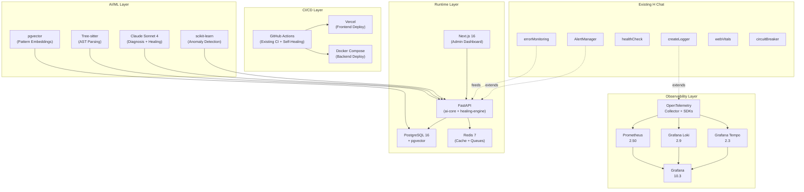

### 9.2 Dependency Summary

| Component | Technology | Version | Purpose |
|---|---|---|---|
| Log Collection | OpenTelemetry Collector | 0.96 | Unified telemetry pipeline |
| Log Storage | Grafana Loki | 2.9 | Log aggregation and querying |
| Trace Storage | Grafana Tempo | 2.3 | Distributed trace backend |
| Metrics Store | Prometheus | 2.50 | Time-series metrics |
| Visualization | Grafana | 10.3 | Dashboards and alerting |
| AST Parsing | Tree-sitter | 0.21+ | Incremental AST analysis (TS + Python) |
| LLM (Diagnosis) | Claude Sonnet 4 | Latest | Root cause analysis |
| LLM (Healing) | Claude Sonnet 4 | Latest | Code patch generation |
| Anomaly Detection | scikit-learn | 1.4+ | Isolation Forest anomaly scoring |
| Vector Search | pgvector | 0.6+ | Pattern embedding similarity |
| Backend | FastAPI | 0.110+ | Healing engine API |
| Database | PostgreSQL | 16 | Pattern DB, healing events |
| Cache/Queue | Redis | 7 | Incident queuing, rate limiting |
| CI/CD | GitHub Actions | v6 | Self-healing deployment pipeline |
| Frontend | Next.js | 16 | Admin healing dashboard |

---

## 10. Implementation Roadmap and KPI

### 10.1 Phased Roadmap

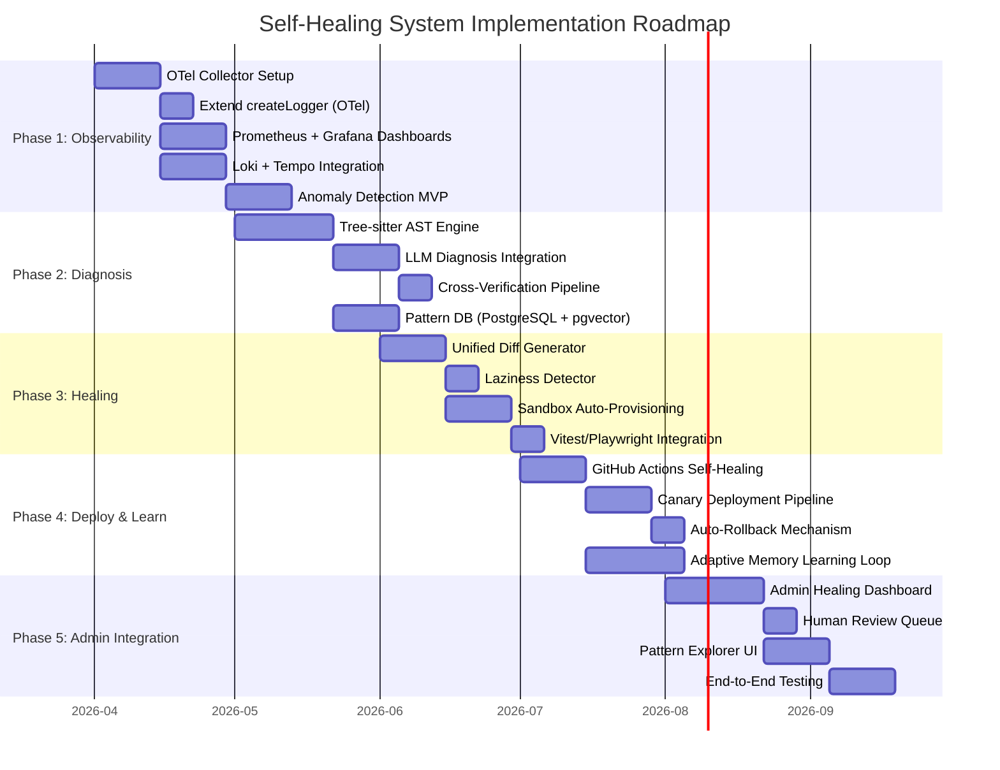

### 10.2 Phase Details

| Phase | Duration | Deliverables | Dependencies |
|---|---|---|---|
| **Phase 1: Observability** | 6 weeks | OTel Collector, Grafana dashboards, Loki/Tempo, Anomaly Detection MVP | Docker Compose infrastructure |
| **Phase 2: Diagnosis** | 6 weeks | AST Engine, LLM diagnosis, cross-verification, Pattern DB | Phase 1 alerts feeding incidents |
| **Phase 3: Healing** | 5 weeks | Diff generator, laziness detector, sandbox, test integration | Phase 2 diagnosis reports |
| **Phase 4: Deploy & Learn** | 6 weeks | GHA workflow, canary deploy, rollback, adaptive memory | Phase 3 verified patches |
| **Phase 5: Admin Integration** | 6 weeks | Dashboard, review queue, pattern explorer, E2E tests | Phases 1-4 all operational |

### 10.3 KPI Dashboard

| KPI | Phase 1 Target | Phase 3 Target | Phase 5 Target |
|---|---|---|---|
| **MTTD** (Mean Time to Detect) | < 2 minutes | < 1 minute | < 30 seconds |
| **MTTD** (Mean Time to Diagnose) | N/A | < 10 minutes | < 5 minutes |
| **MTTR** (Mean Time to Repair) | N/A | < 30 minutes | < 15 minutes |
| **Auto-Repair Rate** | N/A | >= 40% | >= 65% |
| **False Positive Rate** | < 20% | < 15% | < 10% |
| **Pattern Match Hit Rate** | N/A | >= 30% | >= 60% |
| **Observability Coverage** | 100% services | 100% services | 100% services |
| **Test Suite Pass Rate** | Maintain 89%+ | Maintain 89%+ | Maintain 89%+ |
| **Canary Rollback Rate** | N/A | N/A | < 15% |
| **Cost per Healing** (LLM tokens) | N/A | < $0.50 | < $0.30 |

### 10.4 Risk Mitigation

| Risk | Probability | Impact | Mitigation |
|---|---|---|---|
| Self-Healing worsens an incident | Low | High | Mandatory sandbox verification; auto-rollback on canary failure |
| LLM hallucination in diagnosis | Medium | High | AST Ground Truth anchoring; confidence penalty; human review gate |
| LLM cost explosion | High | Medium | Token budgets per incident; pattern DB reduces LLM calls; model routing |
| Sandbox environment drift | Medium | Medium | Git worktree isolation; `npm ci` for deterministic installs |
| Pattern DB data quality decay | Medium | Low | Automatic fix template deactivation after 3 failures; periodic review |
| Alert fatigue from false positives | Medium | Medium | Anomaly detection tuning; alert cooldown (existing AlertManager) |

---

## Appendix A: Integration Points Summary

| Existing Component | File Path | Integration |
|---|---|---|
| `createLogger()` | `packages/ui/src/utils/logger.ts` | `setTransport()` with OTel log transport |
| `errorMonitoring.ts` | `packages/ui/src/utils/errorMonitoring.ts` | `captureError()` feeds Diagnosis Engine |
| `healthCheck.ts` | `packages/ui/src/utils/healthCheck.ts` | `getSystemHealth()` feeds Healing Service |
| `alertConfig.ts` | `packages/ui/src/utils/alertConfig.ts` | Extended with self-healing alert rules |
| `webVitals.ts` | `packages/ui/src/utils/webVitals.ts` | Metrics exported via OTel Collector |
| `circuitBreaker.ts` | `packages/ui/src/utils/circuitBreaker.ts` | `CircuitBreakerError` triggers diagnosis |
| `useHealthMonitor.ts` | `packages/ui/src/hooks/useHealthMonitor.ts` | Events displayed in Healing Dashboard |
| GitHub Actions CI | `.github/workflows/ci.yml` | Extended with `self-healing.yml` workflow |
| Docker Compose | `docker/docker-compose.prod.yml` | Extended with `docker-compose.healing.yml` |
| PostgreSQL | `docker/init.sql` | Migration `004_self_healing.sql` adds pattern tables |

## Appendix B: Glossary

| Term | Definition |
|---|---|
| **AST** | Abstract Syntax Tree -- structured representation of source code |
| **Canary Deployment** | Deploying to a small percentage of traffic before full rollout |
| **Ground Truth** | Verified factual data used to anchor LLM reasoning |
| **Hallucination** | LLM generating plausible but incorrect information |
| **MTTR** | Mean Time to Repair -- average time from failure detection to resolution |
| **Unified Diff** | Standard format for representing file changes (`--- a/` / `+++ b/`) |
| **pgvector** | PostgreSQL extension for vector similarity search |
| **Tree-sitter** | Incremental parsing library for programming languages |
