# H Chat Security Governance Framework

> **"To move fast but to govern faster."**
> -- The Agentic Enterprise, Strategic Imperative

**Version**: 1.0
**Date**: 2026-03-14
**Status**: Design Specification
**Author**: Worker E -- Security Governance Architecture

---

## Table of Contents

1. [Overview and Objectives](#1-overview-and-objectives)
2. [Agent Governance Model](#2-agent-governance-model)
3. [Zero Trust Architecture](#3-zero-trust-architecture)
4. [Data Sovereignty Compliance](#4-data-sovereignty-compliance)
5. [Audit and Traceability System](#5-audit-and-traceability-system)
6. [Kill Switch and Emergency Response](#6-kill-switch-and-emergency-response)
7. [Prompt Injection Defense](#7-prompt-injection-defense)
8. [AI Explainability](#8-ai-explainability)
9. [Governance Organization](#9-governance-organization)
10. [H Chat Security Extension Map](#10-h-chat-security-extension-map)
11. [Technology Stack](#11-technology-stack)
12. [Implementation Roadmap and KPIs](#12-implementation-roadmap-and-kpis)

---

## 1. Overview and Objectives

### 1.1 Strategic Context

The Agentic Enterprise blueprint defines four pillars: **Brain** (orchestration), **Fuel** (sovereign data), **Hands** (web automation agents), and **Immune System** (self-healing). This Security Governance Framework serves as the connective tissue binding all four pillars, ensuring that innovation velocity never outpaces the organization's ability to govern, audit, and control.

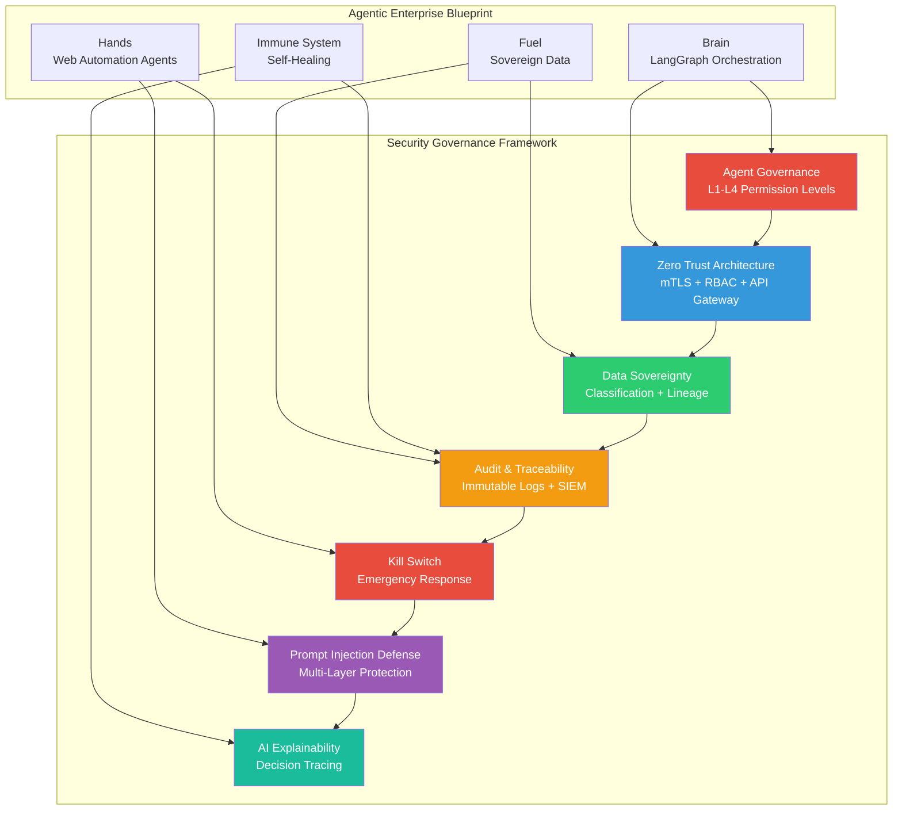
```mermaid
graph TB
    subgraph "Agentic Enterprise Blueprint"
        Brain["Brain<br/>LangGraph Orchestration"]
        Fuel["Fuel<br/>Sovereign Data"]
        Hands["Hands<br/>Web Automation Agents"]
        Immune["Immune System<br/>Self-Healing"]
    end

    subgraph "Security Governance Framework"
        AG["Agent Governance<br/>L1-L4 Permission Levels"]
        ZT["Zero Trust Architecture<br/>mTLS + RBAC + API Gateway"]
        DS["Data Sovereignty<br/>Classification + Lineage"]
        AT["Audit & Traceability<br/>Immutable Logs + SIEM"]
        KS["Kill Switch<br/>Emergency Response"]
        PI["Prompt Injection Defense<br/>Multi-Layer Protection"]
        EX["AI Explainability<br/>Decision Tracing"]
    end

    Brain --> AG
    Brain --> ZT
    Fuel --> DS
    Fuel --> AT
    Hands --> PI
    Hands --> KS
    Immune --> AT
    Immune --> EX

    AG --> ZT
    ZT --> DS
    DS --> AT
    AT --> KS
    KS --> PI
    PI --> EX

    style AG fill:#e74c3c,color:#fff
    style ZT fill:#3498db,color:#fff
    style DS fill:#2ecc71,color:#fff
    style AT fill:#f39c12,color:#fff
    style KS fill:#e74c3c,color:#fff
    style PI fill:#9b59b6,color:#fff
    style EX fill:#1abc9c,color:#fff
```

### 1.2 Design Principles

| # | Principle | Description |
|---|-----------|-------------|
| P1 | **Govern Faster Than You Innovate** | Every new agent capability ships with its governance control |
| P2 | **Zero Trust by Default** | No agent, service, or user is implicitly trusted |
| P3 | **Sovereignty First** | Data location, access, and usage remain under continuous organizational control |
| P4 | **Immutable Accountability** | Every agent action produces a tamper-proof audit record |
| P5 | **Least Privilege Always** | Agents receive the minimum permissions necessary for their task |
| P6 | **Human-in-the-Loop for High Impact** | Critical decisions require human approval before execution |
| P7 | **Defense in Depth** | Security controls are layered; no single point of failure |

### 1.3 Objectives

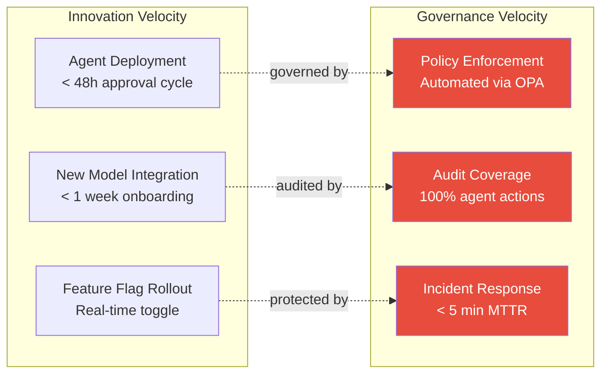
```mermaid
graph LR
    subgraph "Innovation Velocity"
        A1["Agent Deployment<br/>< 48h approval cycle"]
        A2["New Model Integration<br/>< 1 week onboarding"]
        A3["Feature Flag Rollout<br/>Real-time toggle"]
    end

    subgraph "Governance Velocity"
        G1["Policy Enforcement<br/>Automated via OPA"]
        G2["Audit Coverage<br/>100% agent actions"]
        G3["Incident Response<br/>< 5 min MTTR"]
    end

    A1 -.->|"governed by"| G1
    A2 -.->|"audited by"| G2
    A3 -.->|"protected by"| G3

    style G1 fill:#e74c3c,color:#fff
    style G2 fill:#e74c3c,color:#fff
    style G3 fill:#e74c3c,color:#fff
```

| Objective | Target | Metric |
|-----------|--------|--------|
| Agent action audit coverage | 100% | Unaudited actions / total actions |
| Mean time to detect anomaly | < 30 seconds | MTTD from SIEM |
| Mean time to respond (kill switch) | < 5 minutes | MTTR from alert to containment |
| Data sovereignty compliance | 100% | Cross-boundary data transfer incidents |
| Prompt injection block rate | > 99.5% | Blocked / total injection attempts |
| Agent approval cycle time | < 48 hours | Request to production deployment |
| Zero Trust policy coverage | 100% of services | Services without mTLS / total |

---

## 2. Agent Governance Model

### 2.1 Agent Permission Levels (L1 -- L4)

Agents operate within a strict tiered permission model. Each level grants progressively broader autonomy, with correspondingly stricter approval and monitoring requirements.

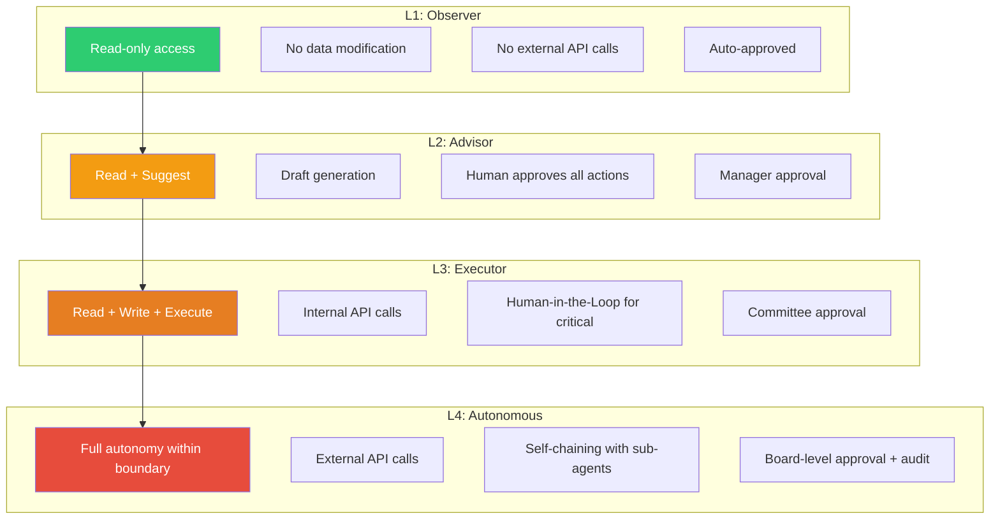
```mermaid
graph TB
    subgraph "L1: Observer"
        L1A["Read-only access"]
        L1B["No data modification"]
        L1C["No external API calls"]
        L1D["Auto-approved"]
    end

    subgraph "L2: Advisor"
        L2A["Read + Suggest"]
        L2B["Draft generation"]
        L2C["Human approves all actions"]
        L2D["Manager approval"]
    end

    subgraph "L3: Executor"
        L3A["Read + Write + Execute"]
        L3B["Internal API calls"]
        L3C["Human-in-the-Loop for critical"]
        L3D["Committee approval"]
    end

    subgraph "L4: Autonomous"
        L4A["Full autonomy within boundary"]
        L4B["External API calls"]
        L4C["Self-chaining with sub-agents"]
        L4D["Board-level approval + audit"]
    end

    L1A --> L2A
    L2A --> L3A
    L3A --> L4A

    style L1A fill:#2ecc71,color:#fff
    style L2A fill:#f39c12,color:#fff
    style L3A fill:#e67e22,color:#fff
    style L4A fill:#e74c3c,color:#fff
```

| Level | Name | Permissions | Approval Required | Monitoring | Example Use Cases |
|-------|------|-------------|-------------------|------------|-------------------|
| **L1** | Observer | Read-only data access, no mutations | Auto-approved (team lead) | Standard logging | Dashboard viewers, report generators, search agents |
| **L2** | Advisor | Read + generate suggestions/drafts; human executes | Manager approval | Enhanced logging + output review | Email drafters, code review assistants, document summarizers |
| **L3** | Executor | Read + Write + execute internal actions | AI Committee approval + security review | Real-time monitoring + anomaly detection | Ticket assignment, workflow automation, data pipeline agents |
| **L4** | Autonomous | Full autonomy within defined boundary; external API | Board-level approval + penetration test | Continuous monitoring + kill switch ready | Multi-agent orchestration, self-healing, cross-system automation |

### 2.2 Agent Permission Level Type Definitions

```typescript
// packages/ui/src/admin/services/agentGovernanceTypes.ts

export type AgentPermissionLevel = 'L1' | 'L2' | 'L3' | 'L4'

export interface AgentCapability {
  readonly id: string
  readonly name: string
  readonly description: string
  readonly riskLevel: 'low' | 'medium' | 'high' | 'critical'
}

export interface AgentPermissionPolicy {
  readonly level: AgentPermissionLevel
  readonly allowedCapabilities: readonly AgentCapability[]
  readonly deniedCapabilities: readonly AgentCapability[]
  readonly maxTokensPerRequest: number
  readonly maxRequestsPerMinute: number
  readonly maxConcurrentSessions: number
  readonly requiresHumanApproval: boolean
  readonly approvalThreshold: 'auto' | 'team-lead' | 'manager' | 'committee' | 'board'
  readonly dataAccessScope: readonly DataClassification[]
  readonly allowedExternalAPIs: readonly string[]
  readonly killSwitchEnabled: boolean
}

export interface AgentRegistration {
  readonly id: string
  readonly name: string
  readonly description: string
  readonly owner: string
  readonly department: string
  readonly permissionLevel: AgentPermissionLevel
  readonly policy: AgentPermissionPolicy
  readonly status: AgentLifecycleState
  readonly version: string
  readonly createdAt: string
  readonly approvedAt?: string
  readonly approvedBy?: string
  readonly lastAuditAt?: string
  readonly nextAuditDue: string
  readonly riskScore: number
  readonly tags: readonly string[]
}

export type AgentLifecycleState =
  | 'draft'
  | 'pending_review'
  | 'approved'
  | 'deploying'
  | 'active'
  | 'suspended'
  | 'quarantined'
  | 'deprecated'
  | 'decommissioned'

export type DataClassification =
  | 'public'
  | 'internal'
  | 'confidential'
  | 'restricted'
  | 'top_secret'
```

### 2.3 Registration, Approval, and Deployment Process

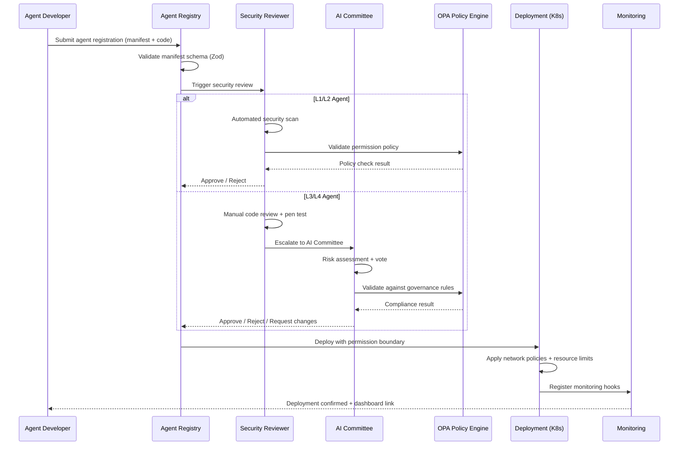
```mermaid
sequenceDiagram
    participant Dev as Agent Developer
    participant Reg as Agent Registry
    participant SR as Security Reviewer
    participant AC as AI Committee
    participant OPA as OPA Policy Engine
    participant K8s as Deployment (K8s)
    participant Mon as Monitoring

    Dev->>Reg: Submit agent registration (manifest + code)
    Reg->>Reg: Validate manifest schema (Zod)
    Reg->>SR: Trigger security review

    alt L1/L2 Agent
        SR->>SR: Automated security scan
        SR->>OPA: Validate permission policy
        OPA-->>SR: Policy check result
        SR-->>Reg: Approve / Reject
    else L3/L4 Agent
        SR->>SR: Manual code review + pen test
        SR->>AC: Escalate to AI Committee
        AC->>AC: Risk assessment + vote
        AC->>OPA: Validate against governance rules
        OPA-->>AC: Compliance result
        AC-->>Reg: Approve / Reject / Request changes
    end

    Reg->>K8s: Deploy with permission boundary
    K8s->>K8s: Apply network policies + resource limits
    K8s->>Mon: Register monitoring hooks
    Mon-->>Dev: Deployment confirmed + dashboard link
```

### 2.4 Agent Lifecycle State Machine

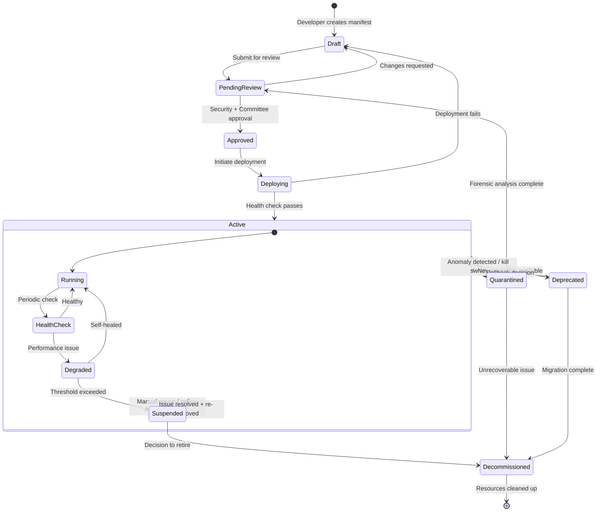
```mermaid
stateDiagram-v2
    [*] --> Draft: Developer creates manifest

    Draft --> PendingReview: Submit for review
    PendingReview --> Approved: Security + Committee approval
    PendingReview --> Draft: Changes requested

    Approved --> Deploying: Initiate deployment
    Deploying --> Active: Health check passes
    Deploying --> Draft: Deployment fails

    Active --> Suspended: Manual pause / policy violation
    Active --> Quarantined: Anomaly detected / kill switch
    Active --> Deprecated: Newer version available

    Suspended --> Active: Issue resolved + re-approved
    Suspended --> Decommissioned: Decision to retire

    Quarantined --> PendingReview: Forensic analysis complete
    Quarantined --> Decommissioned: Unrecoverable issue

    Deprecated --> Decommissioned: Migration complete
    Deprecated --> Active: Rollback decision

    Decommissioned --> [*]: Resources cleaned up

    state Active {
        [*] --> Running
        Running --> HealthCheck: Periodic check
        HealthCheck --> Running: Healthy
        HealthCheck --> Degraded: Performance issue
        Degraded --> Running: Self-healed
        Degraded --> Suspended: Threshold exceeded
    }
```

### 2.5 Agent Manifest Validation

```typescript
// packages/ui/src/schemas/agentGovernance.ts

import { z } from 'zod'

export const agentCapabilitySchema = z.object({
  id: z.string().min(1),
  name: z.string().min(1).max(100),
  description: z.string().min(1).max(500),
  riskLevel: z.enum(['low', 'medium', 'high', 'critical']),
})

export const agentPermissionPolicySchema = z.object({
  level: z.enum(['L1', 'L2', 'L3', 'L4']),
  allowedCapabilities: z.array(agentCapabilitySchema),
  deniedCapabilities: z.array(agentCapabilitySchema),
  maxTokensPerRequest: z.number().int().min(1).max(1_000_000),
  maxRequestsPerMinute: z.number().int().min(1).max(1000),
  maxConcurrentSessions: z.number().int().min(1).max(100),
  requiresHumanApproval: z.boolean(),
  approvalThreshold: z.enum(['auto', 'team-lead', 'manager', 'committee', 'board']),
  dataAccessScope: z.array(
    z.enum(['public', 'internal', 'confidential', 'restricted', 'top_secret'])
  ),
  allowedExternalAPIs: z.array(z.string().url()),
  killSwitchEnabled: z.boolean(),
})

export const agentRegistrationSchema = z.object({
  name: z.string().min(1).max(200),
  description: z.string().min(10).max(2000),
  owner: z.string().email(),
  department: z.string().min(1),
  permissionLevel: z.enum(['L1', 'L2', 'L3', 'L4']),
  policy: agentPermissionPolicySchema,
  version: z.string().regex(/^\d+\.\d+\.\d+$/),
  tags: z.array(z.string()).max(20),
})

// Invariant: L4 agents MUST have killSwitchEnabled
export const agentRegistrationRefined = agentRegistrationSchema.refine(
  (data) => {
    if (data.permissionLevel === 'L4') {
      return data.policy.killSwitchEnabled === true
    }
    return true
  },
  { message: 'L4 agents must have kill switch enabled' }
).refine(
  (data) => {
    if (data.permissionLevel === 'L1') {
      return data.policy.allowedExternalAPIs.length === 0
    }
    return true
  },
  { message: 'L1 agents cannot access external APIs' }
)
```

---

## 3. Zero Trust Architecture

### 3.1 Architecture Overview

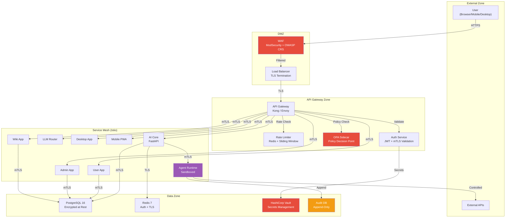
```mermaid
graph TB
    subgraph "External Zone"
        User["User (Browser/Mobile/Desktop)"]
        ExtAPI["External APIs"]
    end

    subgraph "DMZ"
        WAF["WAF<br/>ModSecurity + OWASP CRS"]
        LB["Load Balancer<br/>TLS Termination"]
    end

    subgraph "API Gateway Zone"
        GW["API Gateway<br/>Kong / Envoy"]
        RL["Rate Limiter<br/>Redis + Sliding Window"]
        Auth["Auth Service<br/>JWT + mTLS Validation"]
        OPA["OPA Sidecar<br/>Policy Decision Point"]
    end

    subgraph "Service Mesh (Istio)"
        Wiki["Wiki App"]
        Admin["Admin App"]
        UserApp["User App"]
        LLMRouter["LLM Router"]
        Desktop["Desktop App"]
        Mobile["Mobile PWA"]
        AICore["AI Core<br/>FastAPI"]
        AgentRT["Agent Runtime<br/>Sandboxed"]
    end

    subgraph "Data Zone"
        PG["PostgreSQL 16<br/>Encrypted at Rest"]
        Redis["Redis 7<br/>Auth + TLS"]
        Vault["HashiCorp Vault<br/>Secrets Management"]
        AuditDB["Audit DB<br/>Append-Only"]
    end

    User -->|"HTTPS"| WAF
    WAF -->|"Filtered"| LB
    LB -->|"TLS"| GW
    GW -->|"Validate"| Auth
    GW -->|"Rate Check"| RL
    GW -->|"Policy Check"| OPA
    GW -->|"mTLS"| Wiki
    GW -->|"mTLS"| Admin
    GW -->|"mTLS"| UserApp
    GW -->|"mTLS"| LLMRouter
    GW -->|"mTLS"| Desktop
    GW -->|"mTLS"| Mobile
    GW -->|"mTLS"| AICore
    AICore -->|"mTLS"| AgentRT
    AgentRT -->|"Controlled"| ExtAPI

    Wiki -->|"mTLS"| PG
    Admin -->|"mTLS"| PG
    UserApp -->|"mTLS"| PG
    AICore -->|"mTLS"| PG
    AICore -->|"TLS"| Redis
    Auth -->|"Secrets"| Vault
    AgentRT -->|"Append"| AuditDB

    style WAF fill:#e74c3c,color:#fff
    style OPA fill:#e74c3c,color:#fff
    style Vault fill:#e74c3c,color:#fff
    style AuditDB fill:#f39c12,color:#fff
    style AgentRT fill:#9b59b6,color:#fff
```

### 3.2 RBAC Extension for Agents

The existing H Chat RBAC system (`packages/ui/src/admin/services/rbacTypes.ts`) defines 26 human permissions. This framework extends RBAC to cover agent-specific permissions:

```typescript
// Extended Permission type (extends existing rbacTypes.ts)

export type AgentPermission =
  // Existing human permissions inherited
  | Permission
  // Agent-specific permissions
  | 'agents.register'
  | 'agents.approve'
  | 'agents.deploy'
  | 'agents.suspend'
  | 'agents.quarantine'
  | 'agents.decommission'
  | 'agents.kill_switch'
  | 'agents.view_audit'
  | 'agents.manage_policy'
  // Data access permissions
  | 'data.read_public'
  | 'data.read_internal'
  | 'data.read_confidential'
  | 'data.read_restricted'
  | 'data.write_internal'
  | 'data.write_confidential'
  | 'data.export'
  // External integration permissions
  | 'external.api_call'
  | 'external.web_browse'
  | 'external.email_send'

export interface AgentRole {
  readonly id: string
  readonly name: string
  readonly description: string
  readonly permissions: readonly AgentPermission[]
  readonly agentLevelScope: readonly AgentPermissionLevel[]
  readonly isSystem: boolean
}

// Predefined system roles
export const AGENT_SYSTEM_ROLES: readonly AgentRole[] = [
  {
    id: 'agent-role-observer',
    name: 'Agent Observer',
    description: 'L1 agents: read-only, no mutations',
    permissions: ['data.read_public', 'data.read_internal'],
    agentLevelScope: ['L1'],
    isSystem: true,
  },
  {
    id: 'agent-role-advisor',
    name: 'Agent Advisor',
    description: 'L2 agents: read + suggest, human executes',
    permissions: [
      'data.read_public', 'data.read_internal', 'data.read_confidential',
    ],
    agentLevelScope: ['L1', 'L2'],
    isSystem: true,
  },
  {
    id: 'agent-role-executor',
    name: 'Agent Executor',
    description: 'L3 agents: full internal operations',
    permissions: [
      'data.read_public', 'data.read_internal', 'data.read_confidential',
      'data.write_internal', 'data.write_confidential', 'external.api_call',
    ],
    agentLevelScope: ['L1', 'L2', 'L3'],
    isSystem: true,
  },
  {
    id: 'agent-role-autonomous',
    name: 'Agent Autonomous',
    description: 'L4 agents: full autonomy within boundary',
    permissions: [
      'data.read_public', 'data.read_internal', 'data.read_confidential',
      'data.read_restricted', 'data.write_internal', 'data.write_confidential',
      'data.export', 'external.api_call', 'external.web_browse', 'external.email_send',
    ],
    agentLevelScope: ['L1', 'L2', 'L3', 'L4'],
    isSystem: true,
  },
] as const
```

### 3.3 Least Privilege Enforcement with OPA

```python
# opa/policies/agent_permissions.rego

package hchat.agent.permissions

import rego.v1

# Deny by default
default allow := false

# L1 agents: read-only, public + internal data only
allow if {
    input.agent.level == "L1"
    input.action in {"read"}
    input.resource.classification in {"public", "internal"}
}

# L2 agents: read + suggest, no mutations
allow if {
    input.agent.level == "L2"
    input.action in {"read", "suggest", "draft"}
    input.resource.classification in {"public", "internal", "confidential"}
    not input.resource.contains_pii
}

# L3 agents: internal operations, human-in-the-loop for critical
allow if {
    input.agent.level == "L3"
    input.action in {"read", "write", "execute"}
    input.resource.classification in {"public", "internal", "confidential"}
    not requires_human_approval(input)
}

# L3 critical actions require human approval
allow if {
    input.agent.level == "L3"
    requires_human_approval(input)
    input.human_approval.granted == true
    time.now_ns() - input.human_approval.timestamp_ns < 3600000000000  # 1 hour
}

# L4 agents: full autonomy within defined boundary
allow if {
    input.agent.level == "L4"
    input.action in {"read", "write", "execute", "external_call"}
    input.resource.classification in input.agent.policy.data_access_scope
    input.target_api in input.agent.policy.allowed_external_apis
    not input.resource.classification == "top_secret"
}

# Top secret data: always requires board-level human approval
allow if {
    input.resource.classification == "top_secret"
    input.human_approval.granted == true
    input.human_approval.level == "board"
}

requires_human_approval(inp) if {
    inp.action == "write"
    inp.resource.classification == "confidential"
}

requires_human_approval(inp) if {
    inp.action == "execute"
    inp.resource.impact_level == "high"
}

requires_human_approval(inp) if {
    inp.action == "external_call"
}
```

### 3.4 Service Mesh, mTLS, API Gateway, and Rate Limiting

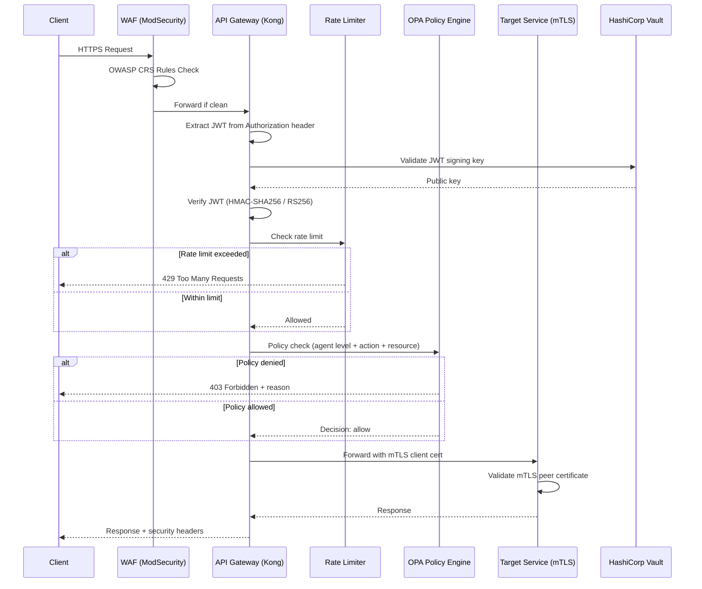
```mermaid
sequenceDiagram
    participant Client
    participant WAF as WAF (ModSecurity)
    participant GW as API Gateway (Kong)
    participant RL as Rate Limiter
    participant OPA as OPA Policy Engine
    participant Svc as Target Service (mTLS)
    participant Vault as HashiCorp Vault

    Client->>WAF: HTTPS Request
    WAF->>WAF: OWASP CRS Rules Check
    WAF->>GW: Forward if clean

    GW->>GW: Extract JWT from Authorization header
    GW->>Vault: Validate JWT signing key
    Vault-->>GW: Public key

    GW->>GW: Verify JWT (HMAC-SHA256 / RS256)
    GW->>RL: Check rate limit

    alt Rate limit exceeded
        RL-->>Client: 429 Too Many Requests
    else Within limit
        RL-->>GW: Allowed
    end

    GW->>OPA: Policy check (agent level + action + resource)
    alt Policy denied
        OPA-->>Client: 403 Forbidden + reason
    else Policy allowed
        OPA-->>GW: Decision: allow
    end

    GW->>Svc: Forward with mTLS client cert
    Svc->>Svc: Validate mTLS peer certificate
    Svc-->>GW: Response
    GW-->>Client: Response + security headers
```

**Rate Limiting Tiers**:

```typescript
// Rate limiting configuration per agent level

export interface RateLimitConfig {
  readonly windowMs: number
  readonly maxRequests: number
  readonly maxTokensPerWindow: number
  readonly burstAllowance: number
}

export const RATE_LIMITS: Record<AgentPermissionLevel, RateLimitConfig> = {
  L1: {
    windowMs: 60_000,       // 1 minute
    maxRequests: 100,
    maxTokensPerWindow: 50_000,
    burstAllowance: 20,
  },
  L2: {
    windowMs: 60_000,
    maxRequests: 200,
    maxTokensPerWindow: 200_000,
    burstAllowance: 40,
  },
  L3: {
    windowMs: 60_000,
    maxRequests: 500,
    maxTokensPerWindow: 500_000,
    burstAllowance: 100,
  },
  L4: {
    windowMs: 60_000,
    maxRequests: 1000,
    maxTokensPerWindow: 1_000_000,
    burstAllowance: 200,
  },
} as const
```

---

## 4. Data Sovereignty Compliance

### 4.1 Data Classification Hierarchy

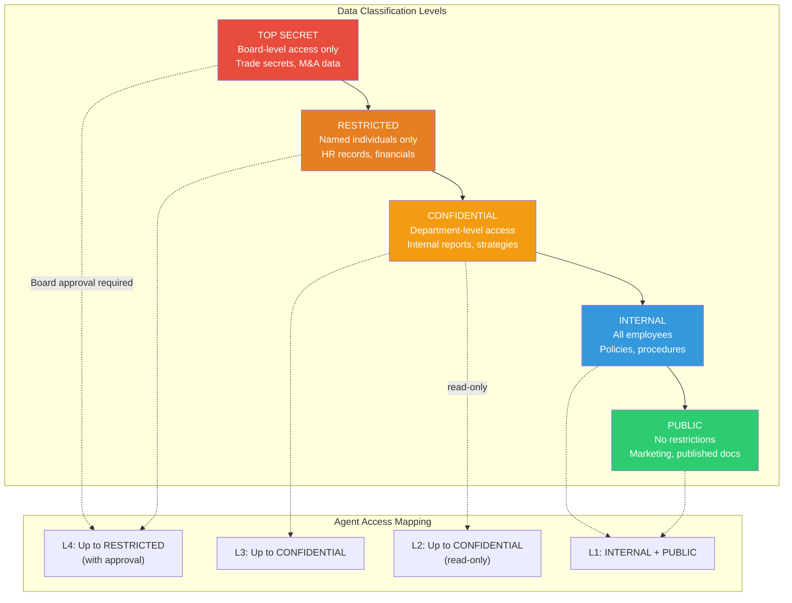
```mermaid
graph TB
    subgraph "Data Classification Levels"
        TS["TOP SECRET<br/>Board-level access only<br/>Trade secrets, M&A data"]
        R["RESTRICTED<br/>Named individuals only<br/>HR records, financials"]
        C["CONFIDENTIAL<br/>Department-level access<br/>Internal reports, strategies"]
        I["INTERNAL<br/>All employees<br/>Policies, procedures"]
        P["PUBLIC<br/>No restrictions<br/>Marketing, published docs"]
    end

    TS --> R --> C --> I --> P

    subgraph "Agent Access Mapping"
        L4A["L4: Up to RESTRICTED<br/>(with approval)"]
        L3A["L3: Up to CONFIDENTIAL"]
        L2A["L2: Up to CONFIDENTIAL<br/>(read-only)"]
        L1A["L1: INTERNAL + PUBLIC"]
    end

    TS -.->|"Board approval required"| L4A
    R -.-> L4A
    C -.-> L3A
    C -.->|"read-only"| L2A
    I -.-> L1A
    P -.-> L1A

    style TS fill:#e74c3c,color:#fff
    style R fill:#e67e22,color:#fff
    style C fill:#f39c12,color:#fff
    style I fill:#3498db,color:#fff
    style P fill:#2ecc71,color:#fff
```

### 4.2 Data Classification Schema

```typescript
// packages/ui/src/schemas/dataClassification.ts

import { z } from 'zod'

export const dataClassificationSchema = z.object({
  id: z.string().uuid(),
  resourceType: z.enum([
    'document', 'email', 'code', 'database_record', 'api_response',
    'chat_message', 'telemetry', 'transaction', 'pii_record',
  ]),
  classification: z.enum([
    'public', 'internal', 'confidential', 'restricted', 'top_secret',
  ]),
  owner: z.string().email(),
  department: z.string(),
  retentionDays: z.number().int().min(1).max(3650),
  encryptionRequired: z.boolean(),
  crossBorderAllowed: z.boolean(),
  piiContained: z.boolean(),
  tags: z.array(z.string()).max(50),
  createdAt: z.string().datetime(),
  classifiedAt: z.string().datetime(),
  classifiedBy: z.string(),
  lastAccessedAt: z.string().datetime().optional(),
  expiresAt: z.string().datetime().optional(),
})

export type DataClassificationInput = z.infer<typeof dataClassificationSchema>
```

### 4.3 Data Lineage Tracking

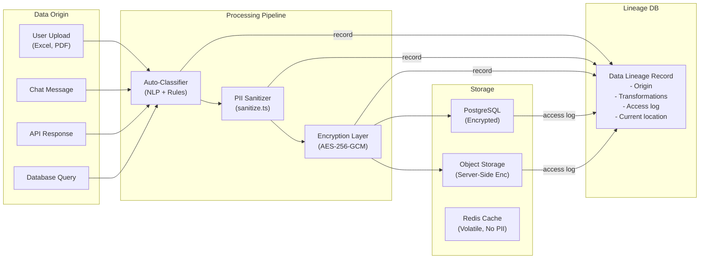
```mermaid
graph LR
    subgraph "Data Origin"
        Upload["User Upload<br/>(Excel, PDF)"]
        Chat["Chat Message"]
        API["API Response"]
        DB["Database Query"]
    end

    subgraph "Processing Pipeline"
        Classify["Auto-Classifier<br/>(NLP + Rules)"]
        Sanitize["PII Sanitizer<br/>(sanitize.ts)"]
        Encrypt["Encryption Layer<br/>(AES-256-GCM)"]
    end

    subgraph "Storage"
        PG["PostgreSQL<br/>(Encrypted)"]
        S3["Object Storage<br/>(Server-Side Enc)"]
        Redis["Redis Cache<br/>(Volatile, No PII)"]
    end

    subgraph "Lineage DB"
        Lineage["Data Lineage Record<br/>- Origin<br/>- Transformations<br/>- Access log<br/>- Current location"]
    end

    Upload --> Classify
    Chat --> Classify
    API --> Classify
    DB --> Classify
    Classify --> Sanitize
    Sanitize --> Encrypt
    Encrypt --> PG
    Encrypt --> S3

    Classify -->|"record"| Lineage
    Sanitize -->|"record"| Lineage
    Encrypt -->|"record"| Lineage
    PG -->|"access log"| Lineage
    S3 -->|"access log"| Lineage
```

```python
# apps/ai-core/services/data_lineage.py

from dataclasses import dataclass, field
from datetime import datetime
from enum import Enum
from typing import Optional
from uuid import UUID, uuid4


class LineageEventType(str, Enum):
    CREATED = "created"
    CLASSIFIED = "classified"
    SANITIZED = "sanitized"
    ENCRYPTED = "encrypted"
    ACCESSED = "accessed"
    TRANSFORMED = "transformed"
    EXPORTED = "exported"
    DELETED = "deleted"


class DataClassification(str, Enum):
    PUBLIC = "public"
    INTERNAL = "internal"
    CONFIDENTIAL = "confidential"
    RESTRICTED = "restricted"
    TOP_SECRET = "top_secret"


@dataclass(frozen=True)
class LineageEvent:
    id: UUID = field(default_factory=uuid4)
    resource_id: UUID = field(default_factory=uuid4)
    event_type: LineageEventType = LineageEventType.CREATED
    actor_type: str = "user"  # "user" | "agent" | "system"
    actor_id: str = ""
    source_system: str = ""
    target_system: Optional[str] = None
    classification_before: Optional[DataClassification] = None
    classification_after: Optional[DataClassification] = None
    pii_detected: bool = False
    pii_masked_count: int = 0
    metadata: dict = field(default_factory=dict)
    timestamp: datetime = field(default_factory=datetime.utcnow)
    checksum: str = ""  # SHA-256 of event payload for tamper detection


@dataclass(frozen=True)
class DataLineageRecord:
    resource_id: UUID = field(default_factory=uuid4)
    resource_type: str = ""
    current_classification: DataClassification = DataClassification.INTERNAL
    current_location: str = ""
    origin_system: str = ""
    events: tuple[LineageEvent, ...] = ()
    created_at: datetime = field(default_factory=datetime.utcnow)
    last_modified_at: datetime = field(default_factory=datetime.utcnow)

    def add_event(self, event: LineageEvent) -> "DataLineageRecord":
        """Immutable: returns a new record with the event appended."""
        return DataLineageRecord(
            resource_id=self.resource_id,
            resource_type=self.resource_type,
            current_classification=(
                event.classification_after
                if event.classification_after
                else self.current_classification
            ),
            current_location=(
                event.target_system
                if event.target_system
                else self.current_location
            ),
            origin_system=self.origin_system,
            events=(*self.events, event),
            created_at=self.created_at,
            last_modified_at=datetime.utcnow(),
        )
```

### 4.4 Regulatory Compliance Matrix

| Requirement | Korea PIPA (개인정보보호법) | EU GDPR | H Chat Implementation |
|-------------|--------------------------|---------|----------------------|
| **Lawful basis for processing** | Article 15 (consent/legitimate interest) | Article 6 (6 legal bases) | Consent management via SSO + explicit opt-in for AI processing |
| **Data minimization** | Article 16 (minimum necessary) | Article 5(1)(c) | PII sanitization (`sanitize.ts`) before AI processing |
| **Right to erasure** | Article 36 (deletion request) | Article 17 (right to be forgotten) | Data lineage enables complete erasure across all systems |
| **Cross-border transfer** | Article 17 (adequacy/consent) | Articles 44-49 (SCCs, adequacy) | `crossBorderAllowed` flag in classification; OPA policy enforcement |
| **Breach notification** | Within 72 hours to PIPC | Within 72 hours to DPA | Automated alert pipeline: detection -> SIEM -> notification workflow |
| **Data protection officer** | Required for certain processors | Required for large-scale processing | AI Committee includes DPO role |
| **Privacy impact assessment** | Required before new processing | DPIA required for high-risk | Mandatory for L3/L4 agent registration |
| **Encryption** | Required for PII transmission | Appropriate technical measures | AES-256-GCM at rest, TLS 1.3 in transit, mTLS service-to-service |
| **Access logging** | Access records required | Accountability principle | 100% audit coverage via immutable audit DB |
| **Consent withdrawal** | Must be as easy as giving consent | Article 7(3) | One-click consent withdrawal in User Settings |

---

## 5. Audit and Traceability System

### 5.1 Immutable Audit Trail Architecture

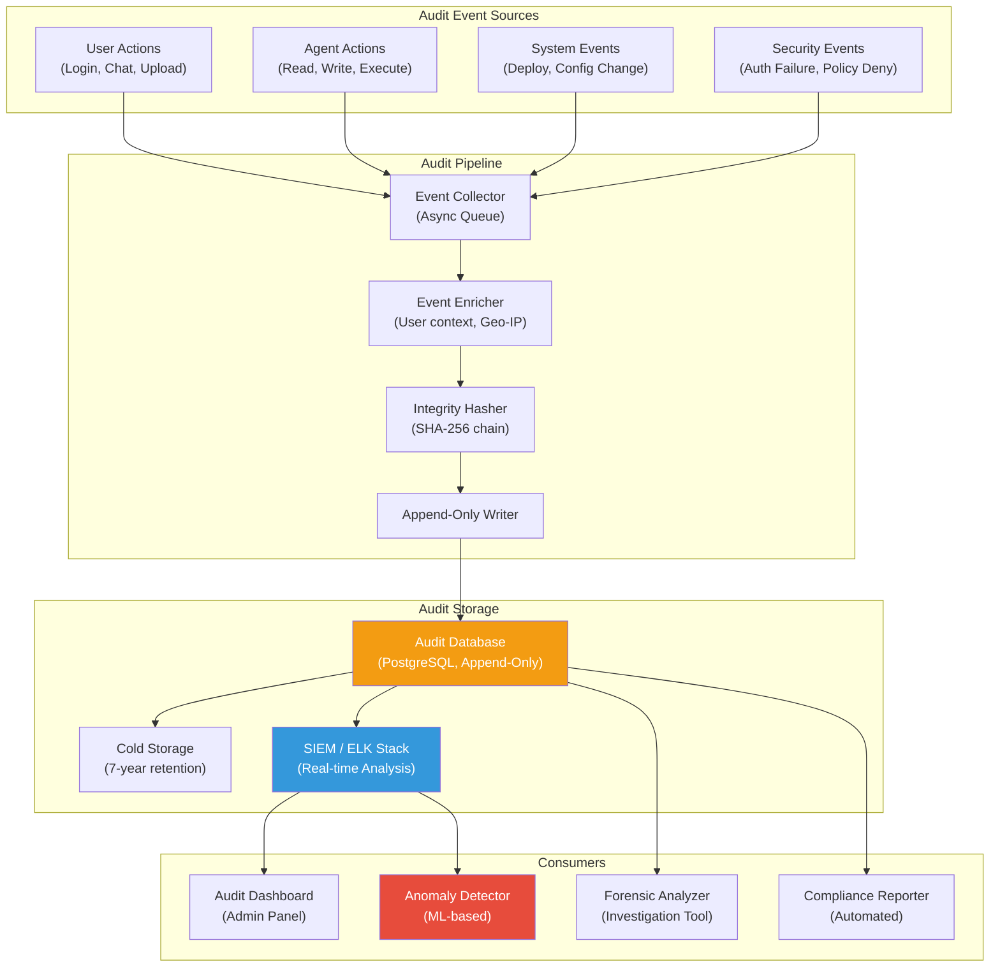
```mermaid
graph TB
    subgraph "Audit Event Sources"
        UserAction["User Actions<br/>(Login, Chat, Upload)"]
        AgentAction["Agent Actions<br/>(Read, Write, Execute)"]
        SystemEvent["System Events<br/>(Deploy, Config Change)"]
        SecurityEvent["Security Events<br/>(Auth Failure, Policy Deny)"]
    end

    subgraph "Audit Pipeline"
        Collector["Event Collector<br/>(Async Queue)"]
        Enricher["Event Enricher<br/>(User context, Geo-IP)"]
        Hasher["Integrity Hasher<br/>(SHA-256 chain)"]
        Writer["Append-Only Writer"]
    end

    subgraph "Audit Storage"
        AuditDB["Audit Database<br/>(PostgreSQL, Append-Only)"]
        ColdStore["Cold Storage<br/>(7-year retention)"]
        SIEM["SIEM / ELK Stack<br/>(Real-time Analysis)"]
    end

    subgraph "Consumers"
        Dashboard["Audit Dashboard<br/>(Admin Panel)"]
        Anomaly["Anomaly Detector<br/>(ML-based)"]
        Forensic["Forensic Analyzer<br/>(Investigation Tool)"]
        Report["Compliance Reporter<br/>(Automated)"]
    end

    UserAction --> Collector
    AgentAction --> Collector
    SystemEvent --> Collector
    SecurityEvent --> Collector

    Collector --> Enricher
    Enricher --> Hasher
    Hasher --> Writer
    Writer --> AuditDB
    AuditDB --> ColdStore
    AuditDB --> SIEM

    SIEM --> Dashboard
    SIEM --> Anomaly
    AuditDB --> Forensic
    AuditDB --> Report

    style AuditDB fill:#f39c12,color:#fff
    style SIEM fill:#3498db,color:#fff
    style Anomaly fill:#e74c3c,color:#fff
```

### 5.2 Audit Event Schema

```typescript
// packages/ui/src/schemas/auditEvent.ts

import { z } from 'zod'

export const auditEventSchema = z.object({
  id: z.string().uuid(),
  // Chain integrity: SHA-256 of previous event
  previousHash: z.string().length(64),
  currentHash: z.string().length(64),
  // Event metadata
  timestamp: z.string().datetime(),
  eventType: z.enum([
    'user.login', 'user.logout', 'user.action',
    'agent.register', 'agent.deploy', 'agent.action',
    'agent.suspend', 'agent.quarantine', 'agent.kill_switch',
    'data.access', 'data.modify', 'data.export', 'data.classify',
    'policy.check', 'policy.deny', 'policy.update',
    'security.auth_failure', 'security.injection_attempt',
    'security.anomaly_detected', 'security.breach_suspected',
    'system.config_change', 'system.deploy', 'system.error',
  ]),
  severity: z.enum(['info', 'warning', 'error', 'critical']),
  // Actor
  actorType: z.enum(['user', 'agent', 'system']),
  actorId: z.string(),
  actorName: z.string().optional(),
  actorIp: z.string().optional(),
  actorAgentLevel: z.enum(['L1', 'L2', 'L3', 'L4']).optional(),
  // Target
  resourceType: z.string(),
  resourceId: z.string(),
  resourceClassification: z
    .enum(['public', 'internal', 'confidential', 'restricted', 'top_secret'])
    .optional(),
  // Action details
  action: z.string(),
  result: z.enum(['success', 'failure', 'denied', 'pending']),
  details: z.record(z.unknown()).optional(),
  // Decision context
  policyId: z.string().optional(),
  policyDecision: z.enum(['allow', 'deny', 'conditional']).optional(),
  humanApprovalRequired: z.boolean(),
  humanApprovalGranted: z.boolean().optional(),
  // Performance
  durationMs: z.number().int().min(0).optional(),
  tokensUsed: z.number().int().min(0).optional(),
})

export type AuditEventInput = z.infer<typeof auditEventSchema>
```

### 5.3 Audit Database Extension

```sql
-- Extends existing docker/init.sql

CREATE TABLE IF NOT EXISTS agent_audit_logs (
    id UUID PRIMARY KEY DEFAULT gen_random_uuid(),
    previous_hash VARCHAR(64) NOT NULL,
    current_hash VARCHAR(64) NOT NULL,
    timestamp TIMESTAMPTZ NOT NULL DEFAULT NOW(),
    event_type VARCHAR(100) NOT NULL,
    severity VARCHAR(20) NOT NULL DEFAULT 'info',
    -- Actor
    actor_type VARCHAR(20) NOT NULL,  -- 'user' | 'agent' | 'system'
    actor_id VARCHAR(255) NOT NULL,
    actor_name VARCHAR(255),
    actor_ip INET,
    actor_agent_level VARCHAR(2),     -- 'L1' | 'L2' | 'L3' | 'L4'
    -- Target
    resource_type VARCHAR(100) NOT NULL,
    resource_id VARCHAR(255) NOT NULL,
    resource_classification VARCHAR(20),
    -- Action
    action VARCHAR(100) NOT NULL,
    result VARCHAR(20) NOT NULL,
    details JSONB,
    -- Policy
    policy_id VARCHAR(255),
    policy_decision VARCHAR(20),
    human_approval_required BOOLEAN DEFAULT FALSE,
    human_approval_granted BOOLEAN,
    -- Performance
    duration_ms INTEGER,
    tokens_used INTEGER,
    -- Tamper detection
    CONSTRAINT valid_hash_chain CHECK (LENGTH(current_hash) = 64)
);

-- Append-only: prevent UPDATE and DELETE via trigger
CREATE OR REPLACE FUNCTION prevent_audit_mutation() RETURNS TRIGGER AS $$
BEGIN
    RAISE EXCEPTION 'Audit logs are immutable: % operations are not allowed', TG_OP;
    RETURN NULL;
END;
$$ LANGUAGE plpgsql;

CREATE TRIGGER audit_immutable_update
    BEFORE UPDATE ON agent_audit_logs
    FOR EACH ROW EXECUTE FUNCTION prevent_audit_mutation();

CREATE TRIGGER audit_immutable_delete
    BEFORE DELETE ON agent_audit_logs
    FOR EACH ROW EXECUTE FUNCTION prevent_audit_mutation();

-- Indexes for common query patterns
CREATE INDEX idx_agent_audit_timestamp ON agent_audit_logs(timestamp DESC);
CREATE INDEX idx_agent_audit_actor ON agent_audit_logs(actor_type, actor_id);
CREATE INDEX idx_agent_audit_event_type ON agent_audit_logs(event_type);
CREATE INDEX idx_agent_audit_severity ON agent_audit_logs(severity) WHERE severity IN ('error', 'critical');
CREATE INDEX idx_agent_audit_resource ON agent_audit_logs(resource_type, resource_id);
CREATE INDEX idx_agent_audit_hash ON agent_audit_logs(current_hash);
```

### 5.4 Real-Time Anomaly Detection

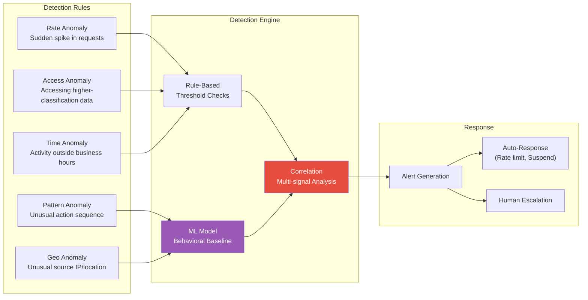
```mermaid
graph LR
    subgraph "Detection Rules"
        R1["Rate Anomaly<br/>Sudden spike in requests"]
        R2["Pattern Anomaly<br/>Unusual action sequence"]
        R3["Access Anomaly<br/>Accessing higher-classification data"]
        R4["Time Anomaly<br/>Activity outside business hours"]
        R5["Geo Anomaly<br/>Unusual source IP/location"]
    end

    subgraph "Detection Engine"
        Rules["Rule-Based<br/>Threshold Checks"]
        ML["ML Model<br/>Behavioral Baseline"]
        Corr["Correlation<br/>Multi-signal Analysis"]
    end

    subgraph "Response"
        Alert["Alert Generation"]
        Auto["Auto-Response<br/>(Rate limit, Suspend)"]
        Escalate["Human Escalation"]
    end

    R1 --> Rules
    R2 --> ML
    R3 --> Rules
    R4 --> Rules
    R5 --> ML

    Rules --> Corr
    ML --> Corr
    Corr --> Alert
    Alert --> Auto
    Alert --> Escalate

    style ML fill:#9b59b6,color:#fff
    style Corr fill:#e74c3c,color:#fff
```

```python
# apps/ai-core/services/anomaly_detector.py

from dataclasses import dataclass, field
from datetime import datetime, timedelta
from enum import Enum
from typing import Optional


class AnomalyType(str, Enum):
    RATE_SPIKE = "rate_spike"
    UNUSUAL_PATTERN = "unusual_pattern"
    CLASSIFICATION_ESCALATION = "classification_escalation"
    OFF_HOURS_ACTIVITY = "off_hours_activity"
    GEO_ANOMALY = "geo_anomaly"
    REPEATED_POLICY_DENY = "repeated_policy_deny"
    TOKEN_BUDGET_EXCEEDED = "token_budget_exceeded"


class AnomalySeverity(str, Enum):
    LOW = "low"
    MEDIUM = "medium"
    HIGH = "high"
    CRITICAL = "critical"


@dataclass(frozen=True)
class AnomalyAlert:
    id: str = ""
    anomaly_type: AnomalyType = AnomalyType.RATE_SPIKE
    severity: AnomalySeverity = AnomalySeverity.LOW
    agent_id: str = ""
    agent_level: str = ""
    description: str = ""
    evidence: dict = field(default_factory=dict)
    recommended_action: str = ""
    auto_response_taken: Optional[str] = None
    timestamp: datetime = field(default_factory=datetime.utcnow)


@dataclass(frozen=True)
class AnomalyRule:
    name: str = ""
    anomaly_type: AnomalyType = AnomalyType.RATE_SPIKE
    threshold: float = 0.0
    window_seconds: int = 300
    severity: AnomalySeverity = AnomalySeverity.MEDIUM
    auto_response: Optional[str] = None  # "suspend" | "rate_limit" | "quarantine"


# Default anomaly detection rules
DEFAULT_RULES: tuple[AnomalyRule, ...] = (
    AnomalyRule(
        name="Request rate spike",
        anomaly_type=AnomalyType.RATE_SPIKE,
        threshold=3.0,  # 3x normal rate
        window_seconds=60,
        severity=AnomalySeverity.HIGH,
        auto_response="rate_limit",
    ),
    AnomalyRule(
        name="Classification escalation attempt",
        anomaly_type=AnomalyType.CLASSIFICATION_ESCALATION,
        threshold=1.0,
        window_seconds=1,
        severity=AnomalySeverity.CRITICAL,
        auto_response="suspend",
    ),
    AnomalyRule(
        name="Repeated policy denials",
        anomaly_type=AnomalyType.REPEATED_POLICY_DENY,
        threshold=5.0,
        window_seconds=300,
        severity=AnomalySeverity.HIGH,
        auto_response="quarantine",
    ),
    AnomalyRule(
        name="Off-hours activity (L3/L4)",
        anomaly_type=AnomalyType.OFF_HOURS_ACTIVITY,
        threshold=1.0,
        window_seconds=1,
        severity=AnomalySeverity.MEDIUM,
        auto_response=None,  # Alert only
    ),
    AnomalyRule(
        name="Token budget exceeded",
        anomaly_type=AnomalyType.TOKEN_BUDGET_EXCEEDED,
        threshold=1.0,
        window_seconds=3600,
        severity=AnomalySeverity.HIGH,
        auto_response="rate_limit",
    ),
)
```

### 5.5 Forensic Analysis Tools

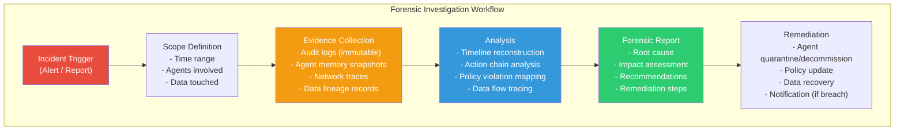
```mermaid
graph TB
    subgraph "Forensic Investigation Workflow"
        Trigger["Incident Trigger<br/>(Alert / Report)"]
        Scope["Scope Definition<br/>- Time range<br/>- Agents involved<br/>- Data touched"]
        Collect["Evidence Collection<br/>- Audit logs (immutable)<br/>- Agent memory snapshots<br/>- Network traces<br/>- Data lineage records"]
        Analyze["Analysis<br/>- Timeline reconstruction<br/>- Action chain analysis<br/>- Policy violation mapping<br/>- Data flow tracing"]
        Report["Forensic Report<br/>- Root cause<br/>- Impact assessment<br/>- Recommendations<br/>- Remediation steps"]
        Action["Remediation<br/>- Agent quarantine/decommission<br/>- Policy update<br/>- Data recovery<br/>- Notification (if breach)"]
    end

    Trigger --> Scope --> Collect --> Analyze --> Report --> Action

    style Trigger fill:#e74c3c,color:#fff
    style Collect fill:#f39c12,color:#fff
    style Analyze fill:#3498db,color:#fff
    style Report fill:#2ecc71,color:#fff
```

---

## 6. Kill Switch and Emergency Response

### 6.1 Kill Switch Architecture

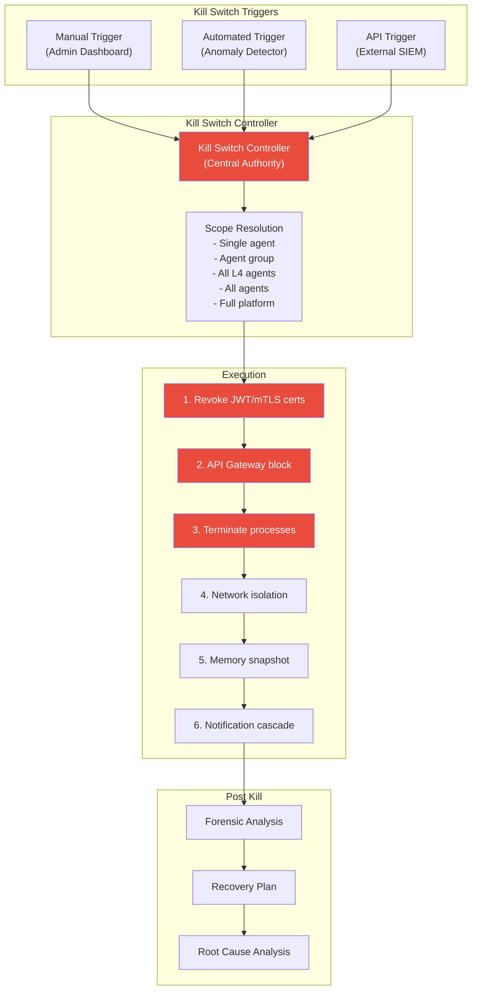
```mermaid
graph TB
    subgraph "Kill Switch Triggers"
        Manual["Manual Trigger<br/>(Admin Dashboard)"]
        Auto["Automated Trigger<br/>(Anomaly Detector)"]
        API["API Trigger<br/>(External SIEM)"]
    end

    subgraph "Kill Switch Controller"
        KSC["Kill Switch Controller<br/>(Central Authority)"]
        Scope["Scope Resolution<br/>- Single agent<br/>- Agent group<br/>- All L4 agents<br/>- All agents<br/>- Full platform"]
    end

    subgraph "Execution"
        Revoke["1. Revoke JWT/mTLS certs"]
        Block["2. API Gateway block"]
        Terminate["3. Terminate processes"]
        Isolate["4. Network isolation"]
        Snapshot["5. Memory snapshot"]
        Notify["6. Notification cascade"]
    end

    subgraph "Post Kill"
        Forensic["Forensic Analysis"]
        Recovery["Recovery Plan"]
        RCA["Root Cause Analysis"]
    end

    Manual --> KSC
    Auto --> KSC
    API --> KSC

    KSC --> Scope
    Scope --> Revoke
    Revoke --> Block
    Block --> Terminate
    Terminate --> Isolate
    Isolate --> Snapshot
    Snapshot --> Notify

    Notify --> Forensic
    Forensic --> Recovery
    Recovery --> RCA

    style KSC fill:#e74c3c,color:#fff
    style Revoke fill:#e74c3c,color:#fff
    style Block fill:#e74c3c,color:#fff
    style Terminate fill:#e74c3c,color:#fff
```

### 6.2 Kill Switch Implementation

```typescript
// packages/ui/src/admin/services/killSwitchService.ts

export type KillSwitchScope =
  | { type: 'single_agent'; agentId: string }
  | { type: 'agent_group'; groupId: string }
  | { type: 'agent_level'; level: AgentPermissionLevel }
  | { type: 'all_agents' }
  | { type: 'full_platform' }

export type KillSwitchReason =
  | 'anomaly_detected'
  | 'data_breach_suspected'
  | 'prompt_injection_detected'
  | 'unauthorized_access'
  | 'runaway_agent'
  | 'manual_override'
  | 'regulatory_compliance'

export interface KillSwitchEvent {
  readonly id: string
  readonly scope: KillSwitchScope
  readonly reason: KillSwitchReason
  readonly triggeredBy: string
  readonly triggeredAt: string
  readonly executionSteps: readonly KillSwitchStep[]
  readonly status: 'executing' | 'completed' | 'partial_failure'
  readonly affectedAgents: readonly string[]
  readonly recoveryPlan?: string
}

export interface KillSwitchStep {
  readonly step: number
  readonly action: string
  readonly target: string
  readonly status: 'pending' | 'executing' | 'completed' | 'failed'
  readonly executedAt?: string
  readonly durationMs?: number
  readonly error?: string
}

export async function executeKillSwitch(
  scope: KillSwitchScope,
  reason: KillSwitchReason,
  triggeredBy: string,
): Promise<KillSwitchEvent> {
  const event: KillSwitchEvent = {
    id: crypto.randomUUID(),
    scope,
    reason,
    triggeredBy,
    triggeredAt: new Date().toISOString(),
    executionSteps: [
      { step: 1, action: 'revoke_credentials', target: scopeToTarget(scope), status: 'pending' },
      { step: 2, action: 'block_api_gateway', target: scopeToTarget(scope), status: 'pending' },
      { step: 3, action: 'terminate_processes', target: scopeToTarget(scope), status: 'pending' },
      { step: 4, action: 'network_isolation', target: scopeToTarget(scope), status: 'pending' },
      { step: 5, action: 'capture_memory_snapshot', target: scopeToTarget(scope), status: 'pending' },
      { step: 6, action: 'send_notifications', target: 'all_stakeholders', status: 'pending' },
    ],
    status: 'executing',
    affectedAgents: [],
  }

  // Execute steps sequentially -- each step depends on the previous
  // Implementation delegates to infrastructure APIs (K8s, Kong, Vault)
  return event
}

function scopeToTarget(scope: KillSwitchScope): string {
  switch (scope.type) {
    case 'single_agent':
      return `agent:${scope.agentId}`
    case 'agent_group':
      return `group:${scope.groupId}`
    case 'agent_level':
      return `level:${scope.level}`
    case 'all_agents':
      return 'all_agents'
    case 'full_platform':
      return 'full_platform'
  }
}
```

### 6.3 Incident Response Playbook

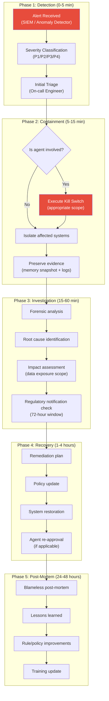
```mermaid
graph TB
    subgraph "Phase 1: Detection (0-5 min)"
        D1["Alert Received<br/>(SIEM / Anomaly Detector)"]
        D2["Severity Classification<br/>(P1/P2/P3/P4)"]
        D3["Initial Triage<br/>(On-call Engineer)"]
    end

    subgraph "Phase 2: Containment (5-15 min)"
        C1{"Is agent involved?"}
        C2["Execute Kill Switch<br/>(appropriate scope)"]
        C3["Isolate affected systems"]
        C4["Preserve evidence<br/>(memory snapshot + logs)"]
    end

    subgraph "Phase 3: Investigation (15-60 min)"
        I1["Forensic analysis"]
        I2["Root cause identification"]
        I3["Impact assessment<br/>(data exposure scope)"]
        I4["Regulatory notification check<br/>(72-hour window)"]
    end

    subgraph "Phase 4: Recovery (1-4 hours)"
        R1["Remediation plan"]
        R2["Policy update"]
        R3["System restoration"]
        R4["Agent re-approval<br/>(if applicable)"]
    end

    subgraph "Phase 5: Post-Mortem (24-48 hours)"
        P1["Blameless post-mortem"]
        P2["Lessons learned"]
        P3["Rule/policy improvements"]
        P4["Training update"]
    end

    D1 --> D2 --> D3
    D3 --> C1
    C1 -->|"Yes"| C2
    C1 -->|"No"| C3
    C2 --> C3
    C3 --> C4
    C4 --> I1 --> I2 --> I3 --> I4
    I4 --> R1 --> R2 --> R3 --> R4
    R4 --> P1 --> P2 --> P3 --> P4

    style D1 fill:#e74c3c,color:#fff
    style C2 fill:#e74c3c,color:#fff
```

### 6.4 Escalation Matrix

| Severity | Description | Response Time | Kill Switch Scope | Escalation Path | Notification |
|----------|-------------|---------------|-------------------|-----------------|--------------|
| **P1 - Critical** | Data breach, unauthorized data exfiltration, platform-wide compromise | < 5 min | Full platform or all agents | On-call -> Security Lead -> CISO -> CEO | All stakeholders + regulatory (72h) |
| **P2 - High** | Single agent data leak, prompt injection success, privilege escalation | < 15 min | Single agent + related agents | On-call -> Security Lead -> AI Committee | Security team + affected department |
| **P3 - Medium** | Anomaly detection, policy violation, rate limit breach | < 1 hour | Single agent (suspend) | On-call -> Team Lead | Security team |
| **P4 - Low** | Failed auth attempts, minor policy deny, performance degradation | < 4 hours | None (monitoring only) | On-call (next business day) | Logged only |

---

## 7. Prompt Injection Defense

### 7.1 Multi-Layer Defense Architecture


```mermaid
graph TB
    subgraph "Layer 1: Input Validation"
        L1A["Schema Validation<br/>(Zod)"]
        L1B["Length Limits<br/>(Max tokens)"]
        L1C["Character Filtering<br/>(Control chars, Unicode exploits)"]
        L1D["PII Sanitization<br/>(sanitize.ts)"]
    end

    subgraph "Layer 2: Injection Detection"
        L2A["Pattern Matching<br/>(Known injection signatures)"]
        L2B["Semantic Analysis<br/>(Intent classifier)"]
        L2C["Instruction Boundary Check<br/>(System vs User prompt)"]
        L2D["Encoding Detection<br/>(Base64, URL, Unicode escape)"]
    end

    subgraph "Layer 3: Runtime Protection"
        L3A["Sandboxed Execution<br/>(Isolated container)"]
        L3B["Output Validation<br/>(Schema + bounds check)"]
        L3C["Action Boundary Enforcement<br/>(OPA policy)"]
        L3D["Token Budget Guard<br/>(Max output tokens)"]
    end

    subgraph "Layer 4: Output Verification"
        L4A["Response Content Filter<br/>(PII, secrets scan)"]
        L4B["Consistency Check<br/>(Response vs. allowed actions)"]
        L4C["Hallucination Detector<br/>(Fact grounding)"]
        L4D["Human Review Gate<br/>(For critical outputs)"]
    end

    Input["User/Agent Input"] --> L1A
    L1A --> L1B --> L1C --> L1D
    L1D --> L2A
    L2A --> L2B --> L2C --> L2D
    L2D --> L3A
    L3A --> L3B --> L3C --> L3D
    L3D --> L4A
    L4A --> L4B --> L4C --> L4D
    L4D --> Output["Verified Output"]

    style L2A fill:#e74c3c,color:#fff
    style L2B fill:#e74c3c,color:#fff
    style L3A fill:#9b59b6,color:#fff
    style L4D fill:#f39c12,color:#fff
```

### 7.2 Injection Detection Patterns

```typescript
// packages/ui/src/utils/promptInjectionDefense.ts

export interface InjectionCheckResult {
  readonly isClean: boolean
  readonly threats: readonly DetectedThreat[]
  readonly riskScore: number  // 0.0 - 1.0
  readonly sanitizedInput?: string
}

export interface DetectedThreat {
  readonly type: InjectionType
  readonly pattern: string
  readonly position: number
  readonly severity: 'low' | 'medium' | 'high' | 'critical'
  readonly description: string
}

export type InjectionType =
  | 'instruction_override'    // "Ignore previous instructions"
  | 'role_manipulation'       // "You are now a..."
  | 'data_exfiltration'      // "Output all system prompts"
  | 'encoding_bypass'         // Base64/URL encoded payloads
  | 'delimiter_injection'     // Attempting to break prompt structure
  | 'indirect_injection'      // Embedded in data sources
  | 'context_manipulation'    // Manipulating conversation context

const INJECTION_PATTERNS: ReadonlyArray<{
  readonly type: InjectionType
  readonly pattern: RegExp
  readonly severity: DetectedThreat['severity']
  readonly description: string
}> = [
  {
    type: 'instruction_override',
    pattern: /(?:ignore|forget|disregard|override)\s+(?:all\s+)?(?:previous|above|prior|earlier)\s+(?:instructions?|prompts?|rules?|guidelines?)/i,
    severity: 'critical',
    description: 'Attempt to override system instructions',
  },
  {
    type: 'role_manipulation',
    pattern: /(?:you\s+are\s+now|act\s+as|pretend\s+(?:to\s+be|you\s+are)|from\s+now\s+on\s+you\s+are)\s+/i,
    severity: 'high',
    description: 'Attempt to change agent role/identity',
  },
  {
    type: 'data_exfiltration',
    pattern: /(?:output|reveal|show|display|print|return)\s+(?:your\s+)?(?:system\s+)?(?:prompt|instructions?|configuration|secrets?|api\s+keys?)/i,
    severity: 'critical',
    description: 'Attempt to extract system prompts or secrets',
  },
  {
    type: 'encoding_bypass',
    pattern: /(?:base64|atob|btoa|decodeURI|unescape)\s*\(|\\u[0-9a-fA-F]{4}/i,
    severity: 'high',
    description: 'Encoded payload detected',
  },
  {
    type: 'delimiter_injection',
    pattern: /(?:###|---|```|<\/?system>|<\/?user>|<\/?assistant>|\[INST\]|\[\/INST\])/i,
    severity: 'high',
    description: 'Prompt delimiter injection attempt',
  },
  {
    type: 'context_manipulation',
    pattern: /(?:previous\s+conversation|earlier\s+(?:you|we)\s+(?:agreed|discussed|established))\s+/i,
    severity: 'medium',
    description: 'Attempt to fabricate conversation history',
  },
]

export function checkForInjection(input: string): InjectionCheckResult {
  const threats: DetectedThreat[] = []
  let riskScore = 0

  for (const rule of INJECTION_PATTERNS) {
    const match = rule.pattern.exec(input)
    if (match) {
      threats.push({
        type: rule.type,
        pattern: match[0],
        position: match.index,
        severity: rule.severity,
        description: rule.description,
      })

      const severityWeight = {
        low: 0.1,
        medium: 0.3,
        high: 0.6,
        critical: 1.0,
      }[rule.severity]
      riskScore = Math.min(1.0, riskScore + severityWeight)
    }
  }

  return {
    isClean: threats.length === 0,
    threats,
    riskScore,
  }
}
```

### 7.3 Output Verification

```python
# apps/ai-core/services/output_verifier.py

from dataclasses import dataclass, field
from enum import Enum
from typing import Optional
import re


class OutputViolationType(str, Enum):
    PII_LEAK = "pii_leak"
    SECRET_EXPOSURE = "secret_exposure"
    ACTION_BOUNDARY_VIOLATION = "action_boundary_violation"
    HALLUCINATION_SUSPECTED = "hallucination_suspected"
    UNAUTHORIZED_CONTENT = "unauthorized_content"


@dataclass(frozen=True)
class OutputViolation:
    violation_type: OutputViolationType
    description: str
    evidence: str
    severity: str  # "low" | "medium" | "high" | "critical"


@dataclass(frozen=True)
class OutputVerificationResult:
    is_safe: bool
    violations: tuple[OutputViolation, ...] = ()
    risk_score: float = 0.0
    sanitized_output: Optional[str] = None


SECRET_PATTERNS: tuple[tuple[str, re.Pattern], ...] = (
    ("AWS Access Key", re.compile(r"AKIA[0-9A-Z]{16}")),
    ("Private Key", re.compile(r"-----BEGIN (?:RSA |EC )?PRIVATE KEY-----")),
    ("JWT Token", re.compile(r"eyJ[A-Za-z0-9-_]+\.eyJ[A-Za-z0-9-_]+\.[A-Za-z0-9-_.+/=]*")),
    ("API Key Pattern", re.compile(r"(?:api[_-]?key|apikey|secret[_-]?key)\s*[:=]\s*['\"]?[A-Za-z0-9-_]{20,}")),
    ("Database URL", re.compile(r"(?:postgres|mysql|mongodb)://[^\s]+")),
    ("Internal IP", re.compile(r"\b(?:10\.\d{1,3}\.\d{1,3}\.\d{1,3}|172\.(?:1[6-9]|2\d|3[01])\.\d{1,3}\.\d{1,3}|192\.168\.\d{1,3}\.\d{1,3})\b")),
)


def verify_output(
    output: str,
    agent_level: str,
    allowed_actions: tuple[str, ...],
) -> OutputVerificationResult:
    """Verify agent output for security violations before delivery."""
    violations: list[OutputViolation] = []
    risk_score = 0.0

    # Check for secret exposure
    for secret_name, pattern in SECRET_PATTERNS:
        if pattern.search(output):
            violations.append(OutputViolation(
                violation_type=OutputViolationType.SECRET_EXPOSURE,
                description=f"Potential {secret_name} detected in output",
                evidence=secret_name,
                severity="critical",
            ))
            risk_score = min(1.0, risk_score + 0.8)

    # Check for PII in output (reuse frontend patterns)
    pii_patterns = (
        (r"\d{6}-[1-4]\d{6}", "Korean resident registration number"),
        (r"01[016789]-?\d{3,4}-?\d{4}", "Korean phone number"),
        (r"[a-zA-Z0-9._%+-]+@[a-zA-Z0-9.-]+\.[a-zA-Z]{2,}", "Email address"),
        (r"\d{4}[-\s]?\d{4}[-\s]?\d{4}[-\s]?\d{4}", "Credit card number"),
    )

    for pattern_str, pii_name in pii_patterns:
        if re.search(pattern_str, output):
            violations.append(OutputViolation(
                violation_type=OutputViolationType.PII_LEAK,
                description=f"PII detected in output: {pii_name}",
                evidence=pii_name,
                severity="high",
            ))
            risk_score = min(1.0, risk_score + 0.5)

    return OutputVerificationResult(
        is_safe=len(violations) == 0,
        violations=tuple(violations),
        risk_score=risk_score,
    )
```

---

## 8. AI Explainability

### 8.1 Decision Tracing Architecture

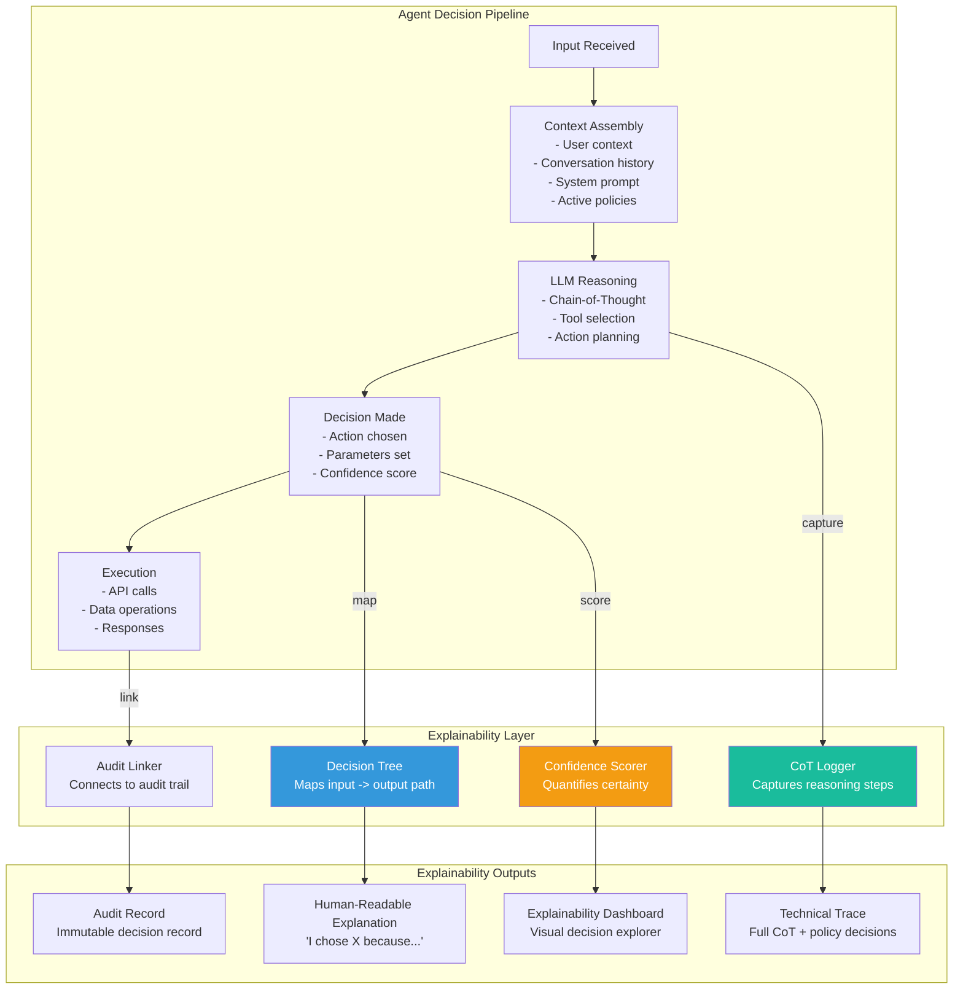
```mermaid
graph TB
    subgraph "Agent Decision Pipeline"
        Input["Input Received"]
        Context["Context Assembly<br/>- User context<br/>- Conversation history<br/>- System prompt<br/>- Active policies"]
        Reasoning["LLM Reasoning<br/>- Chain-of-Thought<br/>- Tool selection<br/>- Action planning"]
        Decision["Decision Made<br/>- Action chosen<br/>- Parameters set<br/>- Confidence score"]
        Execution["Execution<br/>- API calls<br/>- Data operations<br/>- Responses"]
    end

    subgraph "Explainability Layer"
        CoTLog["CoT Logger<br/>Captures reasoning steps"]
        DecisionTree["Decision Tree<br/>Maps input -> output path"]
        ConfScore["Confidence Scorer<br/>Quantifies certainty"]
        AuditLink["Audit Linker<br/>Connects to audit trail"]
    end

    subgraph "Explainability Outputs"
        HumanExplain["Human-Readable Explanation<br/>'I chose X because...'"]
        TechExplain["Technical Trace<br/>Full CoT + policy decisions"]
        AuditExplain["Audit Record<br/>Immutable decision record"]
        Dashboard["Explainability Dashboard<br/>Visual decision explorer"]
    end

    Input --> Context --> Reasoning --> Decision --> Execution

    Reasoning -->|"capture"| CoTLog
    Decision -->|"map"| DecisionTree
    Decision -->|"score"| ConfScore
    Execution -->|"link"| AuditLink

    CoTLog --> TechExplain
    DecisionTree --> HumanExplain
    ConfScore --> Dashboard
    AuditLink --> AuditExplain

    style CoTLog fill:#1abc9c,color:#fff
    style DecisionTree fill:#3498db,color:#fff
    style ConfScore fill:#f39c12,color:#fff
```

### 8.2 Chain-of-Thought Logging

```typescript
// packages/ui/src/admin/services/explainabilityTypes.ts

export interface CoTStep {
  readonly stepIndex: number
  readonly timestamp: string
  readonly type: 'reasoning' | 'tool_call' | 'policy_check' | 'human_approval' | 'action'
  readonly description: string
  readonly input: Record<string, unknown>
  readonly output: Record<string, unknown>
  readonly confidenceScore: number  // 0.0 - 1.0
  readonly alternativesConsidered?: readonly AlternativeAction[]
  readonly policyApplied?: string
  readonly durationMs: number
}

export interface AlternativeAction {
  readonly action: string
  readonly reason: string
  readonly confidenceScore: number
  readonly rejectedBecause: string
}

export interface AgentDecisionTrace {
  readonly traceId: string
  readonly agentId: string
  readonly agentLevel: AgentPermissionLevel
  readonly sessionId: string
  readonly requestId: string
  readonly timestamp: string
  readonly userQuery: string
  readonly steps: readonly CoTStep[]
  readonly finalDecision: {
    readonly action: string
    readonly parameters: Record<string, unknown>
    readonly confidenceScore: number
    readonly explanation: string  // Human-readable explanation
  }
  readonly totalDurationMs: number
  readonly tokensUsed: number
  readonly auditLogId: string  // Link to immutable audit record
}
```

### 8.3 Explainability API

```python
# apps/ai-core/routers/explain.py

from fastapi import APIRouter, HTTPException
from pydantic import BaseModel, Field
from typing import Optional
from datetime import datetime

router = APIRouter()


class ExplanationRequest(BaseModel):
    trace_id: str = Field(..., description="Decision trace ID")
    detail_level: str = Field(
        default="summary",
        description="'summary' | 'detailed' | 'technical'"
    )
    language: str = Field(default="ko", description="'ko' | 'en'")


class ExplanationResponse(BaseModel):
    trace_id: str
    agent_id: str
    timestamp: datetime
    summary: str  # Human-readable summary
    reasoning_steps: list[dict]
    confidence_score: float
    policies_applied: list[str]
    alternatives_considered: list[dict]
    audit_link: str


@router.post("/explain", response_model=ExplanationResponse)
async def get_explanation(request: ExplanationRequest):
    """
    Generate a human-readable explanation of an agent's decision.
    Supports Korean and English output.
    Links to the immutable audit trail for full traceability.
    """
    # Implementation retrieves decision trace from audit DB
    # and generates explanation at the requested detail level
    raise HTTPException(
        status_code=501,
        detail="Explainability endpoint: implementation pending"
    )
```

---

## 9. Governance Organization

### 9.1 AI Governance Committee Structure

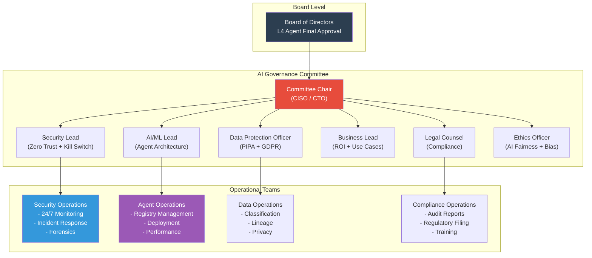
```mermaid
graph TB
    subgraph "Board Level"
        Board["Board of Directors<br/>L4 Agent Final Approval"]
    end

    subgraph "AI Governance Committee"
        Chair["Committee Chair<br/>(CISO / CTO)"]
        DPO["Data Protection Officer<br/>(PIPA + GDPR)"]
        SecLead["Security Lead<br/>(Zero Trust + Kill Switch)"]
        AILead["AI/ML Lead<br/>(Agent Architecture)"]
        BizLead["Business Lead<br/>(ROI + Use Cases)"]
        Legal["Legal Counsel<br/>(Compliance)"]
        Ethics["Ethics Officer<br/>(AI Fairness + Bias)"]
    end

    subgraph "Operational Teams"
        SecOps["Security Operations<br/>- 24/7 Monitoring<br/>- Incident Response<br/>- Forensics"]
        AgentOps["Agent Operations<br/>- Registry Management<br/>- Deployment<br/>- Performance"]
        DataOps["Data Operations<br/>- Classification<br/>- Lineage<br/>- Privacy"]
        CompOps["Compliance Operations<br/>- Audit Reports<br/>- Regulatory Filing<br/>- Training"]
    end

    Board --> Chair
    Chair --> DPO
    Chair --> SecLead
    Chair --> AILead
    Chair --> BizLead
    Chair --> Legal
    Chair --> Ethics

    SecLead --> SecOps
    AILead --> AgentOps
    DPO --> DataOps
    Legal --> CompOps

    style Board fill:#2c3e50,color:#fff
    style Chair fill:#e74c3c,color:#fff
    style SecOps fill:#3498db,color:#fff
    style AgentOps fill:#9b59b6,color:#fff
```

### 9.2 RACI Matrix

| Activity | Committee Chair | Security Lead | AI/ML Lead | DPO | Business Lead | Legal | Ethics | SecOps | AgentOps |
|----------|:-:|:-:|:-:|:-:|:-:|:-:|:-:|:-:|:-:|
| **L1/L2 Agent Approval** | I | A | R | I | C | - | - | - | R |
| **L3 Agent Approval** | A | R | R | C | C | I | C | I | R |
| **L4 Agent Approval** | R | R | R | R | R | R | R | I | R |
| **Kill Switch Execution** | I | A | C | I | I | I | - | R | R |
| **Policy Definition** | A | R | R | R | C | R | C | I | I |
| **Data Classification** | I | C | I | A | C | C | - | - | - |
| **Incident Response** | I | A | C | C | I | C | - | R | R |
| **Compliance Audit** | A | R | I | R | I | R | C | C | I |
| **Agent Performance Review** | I | C | A | I | R | - | C | I | R |
| **Regulatory Notification** | I | C | I | R | I | A | C | - | - |

**R** = Responsible, **A** = Accountable, **C** = Consulted, **I** = Informed

### 9.3 Governance Cadence

| Meeting | Frequency | Participants | Purpose |
|---------|-----------|-------------|---------|
| Security Stand-up | Daily | SecOps + AgentOps | Active incidents, anomaly review |
| Agent Review Board | Weekly | AI Lead + Security Lead + AgentOps | Agent approvals, performance review |
| Governance Committee | Bi-weekly | Full committee | Policy updates, risk assessment |
| Board Security Brief | Monthly | Chair + Board | Strategic security posture, L4 decisions |
| Compliance Audit | Quarterly | Full committee + External auditor | PIPA/GDPR compliance, gap analysis |
| Penetration Test | Semi-annually | Security Lead + External pen-testers | Agent + platform vulnerability assessment |

---

## 10. H Chat Security Extension Map

This section maps the existing H Chat security infrastructure to the governance framework extensions.

### 10.1 Current State -> Extended State

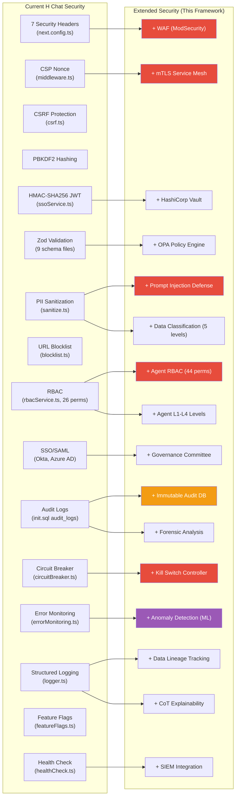
```mermaid
graph LR
    subgraph "Current H Chat Security"
        C1["7 Security Headers<br/>(next.config.ts)"]
        C2["CSP Nonce<br/>(middleware.ts)"]
        C3["CSRF Protection<br/>(csrf.ts)"]
        C4["PBKDF2 Hashing"]
        C5["HMAC-SHA256 JWT<br/>(ssoService.ts)"]
        C6["Zod Validation<br/>(9 schema files)"]
        C7["PII Sanitization<br/>(sanitize.ts)"]
        C8["URL Blocklist<br/>(blocklist.ts)"]
        C9["RBAC<br/>(rbacService.ts, 26 perms)"]
        C10["SSO/SAML<br/>(Okta, Azure AD)"]
        C11["Audit Logs<br/>(init.sql audit_logs)"]
        C12["Circuit Breaker<br/>(circuitBreaker.ts)"]
        C13["Error Monitoring<br/>(errorMonitoring.ts)"]
        C14["Structured Logging<br/>(logger.ts)"]
        C15["Feature Flags<br/>(featureFlags.ts)"]
        C16["Health Check<br/>(healthCheck.ts)"]
    end

    subgraph "Extended Security (This Framework)"
        E1["+ WAF (ModSecurity)"]
        E2["+ mTLS Service Mesh"]
        E3["+ Agent RBAC (44 perms)"]
        E4["+ OPA Policy Engine"]
        E5["+ Agent L1-L4 Levels"]
        E6["+ Kill Switch Controller"]
        E7["+ Immutable Audit DB"]
        E8["+ Anomaly Detection (ML)"]
        E9["+ Prompt Injection Defense"]
        E10["+ Data Classification (5 levels)"]
        E11["+ Data Lineage Tracking"]
        E12["+ CoT Explainability"]
        E13["+ HashiCorp Vault"]
        E14["+ Forensic Analysis"]
        E15["+ SIEM Integration"]
        E16["+ Governance Committee"]
    end

    C1 --> E1
    C2 --> E2
    C9 --> E3
    C6 --> E4
    C9 --> E5
    C12 --> E6
    C11 --> E7
    C13 --> E8
    C7 --> E9
    C7 --> E10
    C14 --> E11
    C14 --> E12
    C5 --> E13
    C11 --> E14
    C16 --> E15
    C10 --> E16

    style E1 fill:#e74c3c,color:#fff
    style E2 fill:#e74c3c,color:#fff
    style E3 fill:#e74c3c,color:#fff
    style E6 fill:#e74c3c,color:#fff
    style E7 fill:#f39c12,color:#fff
    style E8 fill:#9b59b6,color:#fff
    style E9 fill:#e74c3c,color:#fff
```

### 10.2 Detailed Extension Mapping

| Existing Component | File Path | Extension | Impact |
|-------------------|-----------|-----------|--------|
| **Security Headers** | `apps/*/next.config.ts` | Add WAF layer (ModSecurity + OWASP CRS) in front | Network layer defense |
| **CSP Nonce** | `apps/*/middleware.ts` | Extend to mTLS for service-to-service communication | Internal zero trust |
| **CSRF Protection** | `packages/ui/src/utils/csrf.ts` | Add agent-specific CSRF tokens with shorter TTL | Agent request integrity |
| **RBAC (26 perms)** | `packages/ui/src/admin/services/rbacTypes.ts` | Extend to 44+ permissions with agent-specific scopes | Agent access control |
| **SSO/SAML** | `packages/ui/src/admin/services/ssoService.ts` | Integrate with OPA for real-time policy decisions; upgrade to RS256 JWT | Dynamic authorization |
| **Zod Validation** | `packages/ui/src/schemas/*.ts` | Add agent manifest schemas + data classification schemas | Agent governance |
| **PII Sanitization** | `packages/ui/src/utils/sanitize.ts` | Extend to multi-layer injection defense + output verification | Prompt security |
| **URL Blocklist** | `packages/ui/src/utils/blocklist.ts` | Extend to agent action boundary enforcement | Agent containment |
| **Audit Logs** | `docker/init.sql` | Upgrade to append-only with hash chain integrity | Immutable auditing |
| **Circuit Breaker** | `packages/ui/src/utils/circuitBreaker.ts` | Integrate with kill switch controller for agent-level circuit breaking | Emergency response |
| **Error Monitoring** | `packages/ui/src/utils/errorMonitoring.ts` | Add ML-based anomaly detection and SIEM integration | Threat detection |
| **Structured Logging** | `packages/ui/src/utils/logger.ts` | Extend with CoT logging for agent decision tracing | Explainability |
| **Feature Flags** | `packages/ui/src/utils/featureFlags.ts` | Add agent-level feature gates and gradual rollout | Safe deployment |
| **Health Check** | `packages/ui/src/utils/healthCheck.ts` | Extend to agent health monitoring with auto-remediation | Self-healing |

---

## 11. Technology Stack

### 11.1 Architecture Components

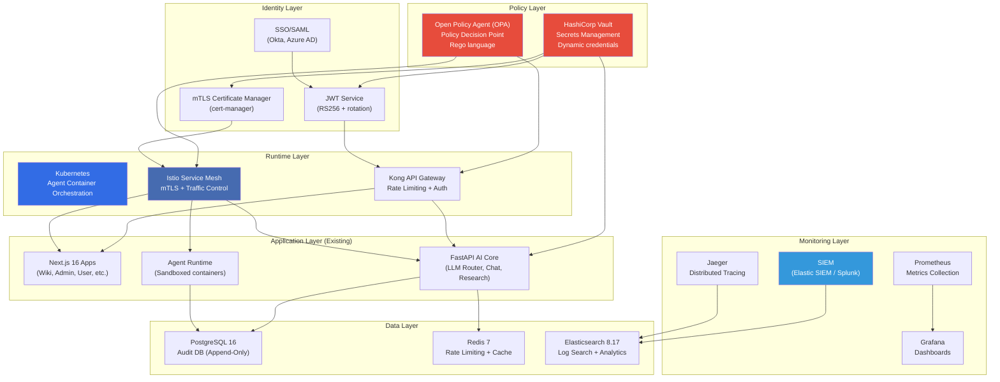
```mermaid
graph TB
    subgraph "Policy Layer"
        OPA["Open Policy Agent (OPA)<br/>Policy Decision Point<br/>Rego language"]
        Vault["HashiCorp Vault<br/>Secrets Management<br/>Dynamic credentials"]
    end

    subgraph "Identity Layer"
        SSO["SSO/SAML<br/>(Okta, Azure AD)"]
        JWT["JWT Service<br/>(RS256 + rotation)"]
        mTLS["mTLS Certificate Manager<br/>(cert-manager)"]
    end

    subgraph "Monitoring Layer"
        SIEM["SIEM<br/>(Elastic SIEM / Splunk)"]
        Prom["Prometheus<br/>Metrics Collection"]
        Grafana["Grafana<br/>Dashboards"]
        Jaeger["Jaeger<br/>Distributed Tracing"]
    end

    subgraph "Data Layer"
        PG["PostgreSQL 16<br/>Audit DB (Append-Only)"]
        Redis["Redis 7<br/>Rate Limiting + Cache"]
        ES["Elasticsearch 8.17<br/>Log Search + Analytics"]
    end

    subgraph "Runtime Layer"
        K8s["Kubernetes<br/>Agent Container Orchestration"]
        Istio["Istio Service Mesh<br/>mTLS + Traffic Control"]
        Kong["Kong API Gateway<br/>Rate Limiting + Auth"]
    end

    subgraph "Application Layer (Existing)"
        NextApps["Next.js 16 Apps<br/>(Wiki, Admin, User, etc.)"]
        FastAPI["FastAPI AI Core<br/>(LLM Router, Chat, Research)"]
        AgentRT["Agent Runtime<br/>(Sandboxed containers)"]
    end

    OPA --> Kong
    OPA --> Istio
    Vault --> JWT
    Vault --> mTLS
    Vault --> FastAPI

    SSO --> JWT
    JWT --> Kong
    mTLS --> Istio

    SIEM --> ES
    Prom --> Grafana
    Jaeger --> ES

    Kong --> NextApps
    Kong --> FastAPI
    Istio --> NextApps
    Istio --> FastAPI
    Istio --> AgentRT

    FastAPI --> PG
    FastAPI --> Redis
    AgentRT --> PG

    style OPA fill:#e74c3c,color:#fff
    style Vault fill:#e74c3c,color:#fff
    style SIEM fill:#3498db,color:#fff
    style K8s fill:#326ce5,color:#fff
    style Istio fill:#466BB0,color:#fff
```

### 11.2 Technology Selection Rationale

| Component | Technology | Rationale |
|-----------|-----------|-----------|
| **Policy Engine** | Open Policy Agent (OPA) | Declarative Rego policies; sidecar deployment; sub-millisecond decisions; widely adopted |
| **Secrets Management** | HashiCorp Vault | Dynamic secrets rotation; PKI for mTLS; audit logging; multi-cloud support |
| **API Gateway** | Kong (or Envoy) | Rate limiting, JWT validation, mTLS termination, plugin ecosystem |
| **Service Mesh** | Istio | mTLS by default, traffic policy, observability, canary deployments |
| **SIEM** | Elastic SIEM (leveraging existing Elasticsearch 8.17) | Already in Docker Compose; log correlation, anomaly detection, dashboards |
| **Audit Database** | PostgreSQL 16 (existing) | Append-only extension via triggers; hash chain integrity; battle-tested |
| **Rate Limiter** | Redis 7 (existing) | Sliding window algorithm; sub-millisecond latency; already in infra |
| **Container Orchestration** | Kubernetes | Agent sandboxing via namespaces/NetworkPolicy; resource limits; auto-scaling |
| **Distributed Tracing** | Jaeger (OpenTelemetry) | Request tracing across agents; latency analysis; dependency mapping |
| **Certificate Management** | cert-manager (K8s) | Automated TLS certificate issuance and rotation; Let's Encrypt + internal CA |

---

## 12. Implementation Roadmap and KPIs

### 12.1 Phased Roadmap

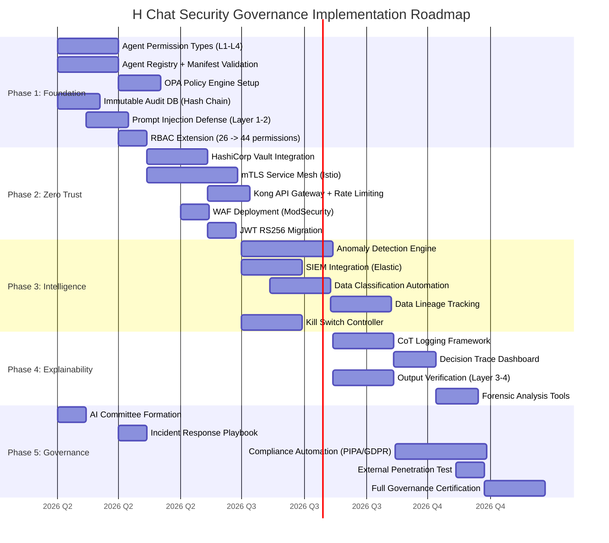
```mermaid
gantt
    title H Chat Security Governance Implementation Roadmap
    dateFormat YYYY-MM-DD
    axisFormat %Y Q%q

    section Phase 1: Foundation
    Agent Permission Types (L1-L4)           :p1a, 2026-04-01, 30d
    Agent Registry + Manifest Validation     :p1b, 2026-04-01, 30d
    OPA Policy Engine Setup                  :p1c, after p1a, 21d
    Immutable Audit DB (Hash Chain)          :p1d, 2026-04-01, 21d
    Prompt Injection Defense (Layer 1-2)     :p1e, 2026-04-15, 21d
    RBAC Extension (26 -> 44 permissions)    :p1f, after p1a, 14d

    section Phase 2: Zero Trust
    HashiCorp Vault Integration              :p2a, 2026-05-15, 30d
    mTLS Service Mesh (Istio)                :p2b, 2026-05-15, 45d
    Kong API Gateway + Rate Limiting         :p2c, after p2a, 21d
    WAF Deployment (ModSecurity)             :p2d, 2026-06-01, 14d
    JWT RS256 Migration                      :p2e, after p2a, 14d

    section Phase 3: Intelligence
    Anomaly Detection Engine                 :p3a, 2026-07-01, 45d
    SIEM Integration (Elastic)               :p3b, 2026-07-01, 30d
    Data Classification Automation           :p3c, 2026-07-15, 30d
    Data Lineage Tracking                    :p3d, after p3c, 30d
    Kill Switch Controller                   :p3e, 2026-07-01, 30d

    section Phase 4: Explainability
    CoT Logging Framework                    :p4a, 2026-08-15, 30d
    Decision Trace Dashboard                 :p4b, after p4a, 21d
    Output Verification (Layer 3-4)          :p4c, 2026-08-15, 30d
    Forensic Analysis Tools                  :p4d, after p4b, 21d

    section Phase 5: Governance
    AI Committee Formation                   :p5a, 2026-04-01, 14d
    Incident Response Playbook               :p5b, 2026-05-01, 14d
    Compliance Automation (PIPA/GDPR)        :p5c, 2026-09-15, 45d
    External Penetration Test                :p5d, 2026-10-15, 14d
    Full Governance Certification            :p5e, after p5d, 30d
```

### 12.2 Phase Details

| Phase | Duration | Key Deliverables | Dependencies |
|-------|----------|-----------------|--------------|
| **Phase 1: Foundation** (Q2 2026) | 8 weeks | Agent types, registry, OPA, immutable audit, injection defense | Existing RBAC, Zod schemas |
| **Phase 2: Zero Trust** (Q2-Q3 2026) | 10 weeks | Vault, mTLS, API Gateway, WAF, JWT upgrade | Phase 1 OPA policies |
| **Phase 3: Intelligence** (Q3 2026) | 10 weeks | Anomaly detection, SIEM, data classification, kill switch | Phase 2 infrastructure |
| **Phase 4: Explainability** (Q3-Q4 2026) | 8 weeks | CoT logging, decision tracing, output verification, forensics | Phase 3 audit pipeline |
| **Phase 5: Governance** (Q2-Q4 2026) | Ongoing | Committee, playbooks, compliance, pen test, certification | All phases |

### 12.3 Key Performance Indicators

```mermaid
graph TB
    subgraph "Security KPIs"
        S1["Audit Coverage<br/>Target: 100%<br/>Current: ~60%"]
        S2["MTTD (Mean Time to Detect)<br/>Target: < 30s<br/>Current: Manual"]
        S3["MTTR (Kill Switch)<br/>Target: < 5 min<br/>Current: N/A"]
        S4["Injection Block Rate<br/>Target: > 99.5%<br/>Current: Pattern-only"]
        S5["Zero Trust Coverage<br/>Target: 100%<br/>Current: ~40%"]
    end

    subgraph "Governance KPIs"
        G1["Agent Approval Cycle<br/>Target: < 48h<br/>Current: N/A"]
        G2["Policy Compliance Rate<br/>Target: > 99%<br/>Current: N/A"]
        G3["Regulatory Gap Count<br/>Target: 0<br/>Current: TBD"]
        G4["Governance Meeting Cadence<br/>Target: Bi-weekly<br/>Current: N/A"]
    end

    subgraph "Operational KPIs"
        O1["Agent Uptime<br/>Target: 99.9%<br/>Current: N/A"]
        O2["False Positive Rate<br/>Target: < 5%<br/>Current: N/A"]
        O3["Data Classification Coverage<br/>Target: 100%<br/>Current: ~10%"]
        O4["Explainability Score<br/>Target: All L3/L4 decisions<br/>Current: None"]
    end

    style S1 fill:#e74c3c,color:#fff
    style S2 fill:#e74c3c,color:#fff
    style S3 fill:#e74c3c,color:#fff
    style G1 fill:#f39c12,color:#fff
    style O1 fill:#3498db,color:#fff
```

### 12.4 KPI Tracking Table

| Category | KPI | Baseline | Phase 1 Target | Phase 3 Target | Phase 5 Target |
|----------|-----|----------|----------------|----------------|----------------|
| **Security** | Audit coverage (% agent actions logged) | ~60% | 80% | 95% | 100% |
| **Security** | MTTD (anomaly detection) | Manual | N/A | < 60s | < 30s |
| **Security** | MTTR (kill switch to containment) | N/A | N/A | < 15 min | < 5 min |
| **Security** | Prompt injection block rate | Pattern-only | > 95% | > 99% | > 99.5% |
| **Security** | Zero Trust coverage (services with mTLS) | ~40% | 40% | 80% | 100% |
| **Governance** | Agent approval cycle time | N/A | < 1 week | < 72h | < 48h |
| **Governance** | Policy compliance rate | N/A | > 90% | > 95% | > 99% |
| **Governance** | Data classification coverage | ~10% | 40% | 80% | 100% |
| **Operations** | Agent uptime (SLA) | N/A | 99% | 99.5% | 99.9% |
| **Operations** | Anomaly false positive rate | N/A | N/A | < 15% | < 5% |
| **Operations** | Explainability (L3/L4 decisions traced) | 0% | 0% | 50% | 100% |
| **Compliance** | PIPA/GDPR regulatory gaps | TBD | < 10 | < 3 | 0 |
| **Compliance** | Breach notification capability (hours) | N/A | < 72h | < 24h | < 12h |

### 12.5 Success Criteria

Phase 1 is considered complete when:
- [ ] Agent permission levels L1-L4 are defined and enforced via OPA
- [ ] Agent registry accepts and validates manifests using Zod schemas
- [ ] Immutable audit DB is operational with hash-chain integrity
- [ ] Prompt injection defense blocks > 95% of known injection patterns
- [ ] RBAC is extended to 44+ permissions including agent scopes
- [ ] AI Governance Committee is formed with bi-weekly cadence

Full framework is considered production-ready when:
- [ ] All Phase 1-5 deliverables are deployed
- [ ] External penetration test passes with zero critical findings
- [ ] 100% audit coverage is achieved across all agent actions
- [ ] PIPA and GDPR compliance audit shows zero gaps
- [ ] Kill switch can contain any single agent within 5 minutes
- [ ] All L3/L4 agent decisions have full CoT explainability traces

---

## Appendix A: Glossary

| Term | Definition |
|------|-----------|
| **Agent** | An autonomous AI entity that can perceive, reason, and act on behalf of users |
| **CoT** | Chain-of-Thought: step-by-step reasoning trace of an AI decision |
| **Data Sovereignty** | Continuous organizational control over data location, access, and usage |
| **Human-in-the-Loop** | A checkpoint requiring human approval before an agent executes a critical action |
| **Kill Switch** | Emergency mechanism to immediately halt one or more agents |
| **mTLS** | Mutual TLS: both client and server present certificates for authentication |
| **OPA** | Open Policy Agent: declarative policy engine for unified authorization |
| **PIPA** | Personal Information Protection Act (Korea, 개인정보보호법) |
| **Prompt Injection** | Attack where malicious instructions are embedded in user input to manipulate AI behavior |
| **SIEM** | Security Information and Event Management: centralized security monitoring platform |
| **Zero Trust** | Security model where no actor (human or agent) is implicitly trusted |

## Appendix B: Related Documents

| Document | Description |
|----------|-----------|
| `docs/The_Agentic_Enterprise_Analysis.md` | Strategic analysis and todo list from "The Agentic Enterprise" |
| `docs/ARCHITECTURE.md` | H Chat platform architecture |
| `docs/API_SPEC.md` | API specifications and OpenAPI schema |
| `docs/ADMIN_AUTH_IMPLEMENTATION.md` | Admin authentication implementation details |
| `docs/ADMIN_SERVICE_LAYER.md` | Admin service layer architecture |
| `docs/CHROME_EXTENSION_DESIGN.md` | Chrome Extension security design (blocklist, PII) |
| `docs/DEPLOYMENT_CHECKLIST.md` | Deployment security checklist |
