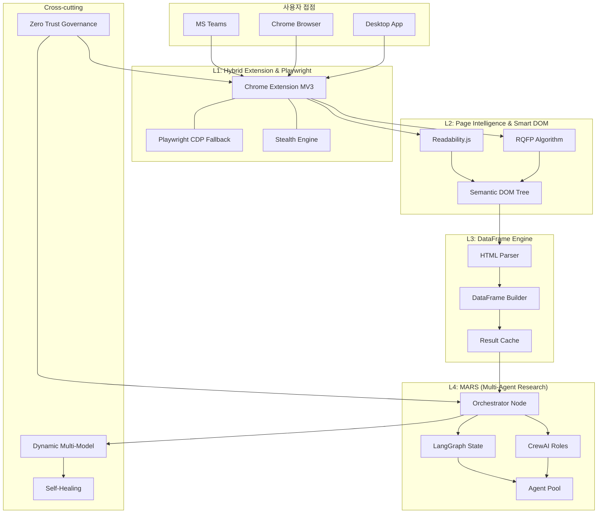
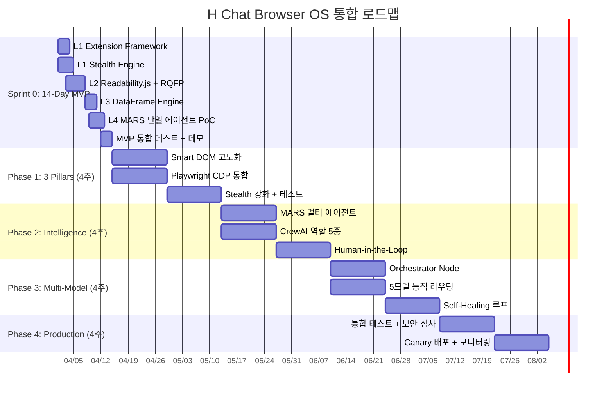

# H Chat AI Browser OS — 통합 구현방안 설계서

> 작성일: 2026-03-14 | PM 취합 | Worker A~D 병렬 작성 결과 통합
> 원문: "Autonomous Browser OS — The Browser is the New OS"
> 관련: [분석 문서](./Autonomous_Browser_OS_Analysis.md) | [에이전틱 엔터프라이즈 블루프린트](./IMPL_00_AGENTIC_ENTERPRISE_BLUEPRINT.md)

---

## 목차

1. [아키텍처 총괄](#1-아키텍처-총괄)
2. [구현 설계 문서 맵](#2-구현-설계-문서-맵)
3. [4-Layer Stack 요약](#3-4-layer-stack-요약)
4. [통합 로드맵: Sprint 0 → Phase 4](#4-통합-로드맵)
5. [기술 스택 종합](#5-기술-스택-종합)
6. [산출물 총괄 KPI](#6-산출물-총괄-kpi)
7. [투자 대비 효과](#7-투자-대비-효과)

---

## 1. 아키텍처 총괄



### 핵심 명제

> **"The Browser is the New OS."** — 웹은 더 이상 읽기 위한 공간이 아니라, AI 에이전트가 활동하는 지능형 환경(Intelligent Environment)이다.

---

## 2. 구현 설계 문서 맵

| 문서 | 담당 | 내용 | 라인수 |
|------|------|------|--------|
| **[01_BROWSER_LAYER](./IMPL_BROWSER_OS_01_BROWSER_LAYER.md)** | Worker A | L1 Hybrid Extension + L2 Smart DOM | 478줄 |
| **[02_INTELLIGENCE_LAYER](./IMPL_BROWSER_OS_02_INTELLIGENCE_LAYER.md)** | Worker B | L3 DataFrame Engine + L4 MARS | 501줄 |
| **[03_MULTIMODEL_HEALING](./IMPL_BROWSER_OS_03_MULTIMODEL_HEALING.md)** | Worker C | Dynamic Multi-Model + Self-Healing | 433줄 |
| **[04_GOVERNANCE_MVP](./IMPL_BROWSER_OS_04_GOVERNANCE_MVP.md)** | Worker D | Zero Trust + 14-Day MVP | 346줄 |
| **[00_INTEGRATED](./IMPL_BROWSER_OS_00_INTEGRATED.md)** (본 문서) | PM | 총괄 통합 | — |

**총 산출물: 1,758+ 줄의 상세 구현 설계**

---

## 3. 4-Layer Stack 요약

### L1: Hybrid Chrome Extension & Playwright

| 항목 | 내용 |
|------|------|
| **핵심 전략** | 네이티브 Chrome API로 봇 탐지 우회 + 세션 충실도 유지 |
| **기존 확장** | `apps/extension/` MV3 + sanitize.ts + blocklist.ts |
| **신규 구현** | Stealth Engine, Playwright CDP Fallback, Side Panel Agent UI |
| **상세 설계** | → [01_BROWSER_LAYER.md](./IMPL_BROWSER_OS_01_BROWSER_LAYER.md) |

### L2: Page Intelligence & Smart DOM

| 항목 | 내용 |
|------|------|
| **핵심 전략** | Readability.js로 노이즈 60-70% 제거 + RQFP로 관계형 데이터 추출 |
| **기존 확장** | `apps/ai-core/routers/analyze.py` 4-mode 분석 |
| **신규 구현** | Smart DOM Parser, RQFP 알고리즘, Semantic Tree 스키마 |
| **상세 설계** | → [01_BROWSER_LAYER.md](./IMPL_BROWSER_OS_01_BROWSER_LAYER.md) |

### L3: DataFrame Engine

| 항목 | 내용 |
|------|------|
| **핵심 전략** | HTML 웹 데이터 → 구조화 JSON/CSV 즉시 변환 |
| **기존 확장** | `llm_client.py`, `prompt_builder.py`, `streamingService.ts` |
| **신규 구현** | HTML 테이블/리스트 자동 감지, DataFrame API, 프론트엔드 미리보기 |
| **상세 설계** | → [02_INTELLIGENCE_LAYER.md](./IMPL_BROWSER_OS_02_INTELLIGENCE_LAYER.md) |

### L4: MARS (Multi-Agent Research Systems)

| 항목 | 내용 |
|------|------|
| **핵심 전략** | LangGraph(상태+로직) + CrewAI(역할 협업) 하이브리드 |
| **기존 확장** | SwarmPanel, AgentCard, DebateArena, Desktop types |
| **신규 구현** | 5종 에이전트 (Analyst/Researcher/Writer/Editor/AutoResearcher) |
| **상세 설계** | → [02_INTELLIGENCE_LAYER.md](./IMPL_BROWSER_OS_02_INTELLIGENCE_LAYER.md) |

### Cross-cutting: Dynamic Multi-Model

| 항목 | 내용 |
|------|------|
| **핵심 전략** | Orchestrator Node가 작업별 최적 모델 실시간 선택 (최대 19개) |
| **모델 매핑** | Opus(추론), Gemini(탐색), ChatGPT 5.2(장문), Grok(경량), Nano Banana(이미지) |
| **기존 확장** | LLM Router 86모델 → 동적 라우팅 업그레이드 |
| **상세 설계** | → [03_MULTIMODEL_HEALING.md](./IMPL_BROWSER_OS_03_MULTIMODEL_HEALING.md) |

### Cross-cutting: Self-Healing

| 항목 | 내용 |
|------|------|
| **핵심 전략** | Signal→Diagnosis→Healing→Verification 자동 루프 |
| **목표** | 복구 시간 55-70%↓, 구문 오류 수정 85-90% |
| **기존 확장** | errorMonitoring, healthCheck, circuitBreaker |
| **상세 설계** | → [03_MULTIMODEL_HEALING.md](./IMPL_BROWSER_OS_03_MULTIMODEL_HEALING.md) |

### Cross-cutting: Enterprise Governance

| 항목 | 내용 |
|------|------|
| **핵심 전략** | Zero Trust + Data Sovereignty + 에이전트 권한 L1~L4 |
| **기존 확장** | RBAC, SSO, JWT, CSP, PII Sanitization, 감사 로그 |
| **상세 설계** | → [04_GOVERNANCE_MVP.md](./IMPL_BROWSER_OS_04_GOVERNANCE_MVP.md) |

---

## 4. 통합 로드맵



| Phase | 기간 | 핵심 산출물 | 상세 설계 |
|-------|------|-----------|----------|
| **Sprint 0** | 2주 | Extension+SmartDOM+DataFrame+MARS PoC | [04_GOVERNANCE_MVP](./IMPL_BROWSER_OS_04_GOVERNANCE_MVP.md) |
| **Phase 1** | 4주 | 3 Pillars 완성 (Perception, Automation, Stealth) | [01_BROWSER_LAYER](./IMPL_BROWSER_OS_01_BROWSER_LAYER.md) |
| **Phase 2** | 4주 | MARS 멀티 에이전트, CrewAI 5종, HITL | [02_INTELLIGENCE_LAYER](./IMPL_BROWSER_OS_02_INTELLIGENCE_LAYER.md) |
| **Phase 3** | 4주 | Orchestrator, 동적 라우팅, Self-Healing | [03_MULTIMODEL_HEALING](./IMPL_BROWSER_OS_03_MULTIMODEL_HEALING.md) |
| **Phase 4** | 4주 | 통합 테스트, 보안 심사, 프로덕션 | [04_GOVERNANCE_MVP](./IMPL_BROWSER_OS_04_GOVERNANCE_MVP.md) |
| **총 기간** | **18주** | — | — |

### 에이전틱 엔터프라이즈 블루프린트와의 연결

```
Browser OS (18주)          Agentic Enterprise (28주)
━━━━━━━━━━━━━━━━━         ━━━━━━━━━━━━━━━━━━━━━━━
Sprint 0 (2주)      ──→   P1 기반 (8주)에 결과 투입
Phase 1 (4주)       ──→   IMPL-03 Smart DOM 강화
Phase 2 (4주)       ──→   IMPL-02 오케스트레이션 + CrewAI
Phase 3 (4주)       ──→   IMPL-02 동적 모델 라우팅
Phase 4 (4주)       ──→   IMPL-05 보안 거버넌스 확장
```

---

## 5. 기술 스택 종합

| 계층 | 기술 | 용도 |
|------|------|------|
| **L1** | Chrome Extension MV3 | 호스트 런타임 |
| | Playwright + CDP | Headless Fallback, Auto-waiting |
| | stealth-plugin 패턴 | 봇 탐지 우회 |
| **L2** | Readability.js | 노이즈 60-70% 제거 |
| | RQFP 알고리즘 | 구조적 유사성 관계형 데이터 추출 |
| | Semantic DOM Schema | 시맨틱 트리 출력 |
| **L3** | Pandas (서버) / JSON (클라이언트) | DataFrame 변환 |
| | FastAPI `/api/v1/dataframe/` | DataFrame API |
| **L4** | LangGraph 0.2 | State & Logic (상태 기반 파이프라인) |
| | CrewAI 0.5 | Role-based Collaboration |
| | Redis Streams | 에이전트 간 메시지 큐 |
| **Multi-Model** | Orchestrator Node | 동적 모델 라우팅 |
| | Claude Opus 4.6 / Gemini / ChatGPT 5.2 / Grok / Nano Banana | 전문 모델 풀 |
| **Healing** | OpenTelemetry | Observability |
| | Tree-sitter | AST 파싱 |
| | pgvector | 장애 패턴 유사도 검색 |
| **Governance** | OPA | 정책 엔진 |
| | HashiCorp Vault | 비밀 관리 |
| **기존 인프라** | PostgreSQL 16, Redis 7, Docker | 데이터 + 캐시 + 배포 |

---

## 6. 산출물 총괄 KPI

| 영역 | 지표 | 목표 | 측정 Phase |
|------|------|------|-----------|
| Smart DOM | 노이즈 제거율 | 60-70% | Sprint 0 |
| Smart DOM | RQFP 데이터 추출 정확도 | 80%+ | Phase 1 |
| Web Automation | 자동화 성공률 | 81%+ | Phase 1 |
| Web Automation | 작업당 비용 | < $0.12 | Sprint 0 |
| Stealth | 봇 탐지 우회율 | 95%+ | Phase 1 |
| DataFrame | HTML→구조화 변환 성공률 | 85%+ | Sprint 0 |
| MARS | 보고서 품질 점수 | 85%+ (Human 평가) | Phase 2 |
| Multi-Model | 최적 모델 선택 정확도 | 90%+ | Phase 3 |
| Multi-Model | Fallback 체인 성공률 | 95%+ | Phase 3 |
| Self-Healing | 복구 시간 단축 | 55-70% | Phase 3 |
| Self-Healing | 구문 오류 수정 | 85-90% | Phase 3 |
| Governance | 감사 로그 커버리지 | 100% | Phase 4 |
| MVP | 14일 내 데모 | Day 14 완료 | Sprint 0 |

---

## 7. 투자 대비 효과

### Sprint 0 (14일) ROI

| 항목 | 비용 |
|------|------|
| 개발 인력 (3명 × 2주) | $15,000 |
| LLM API (테스트) | $500 |
| **총 투자** | **$15,500** |

| 검증 항목 | 가치 |
|----------|------|
| Smart DOM 기술 타당성 실증 | P1~P4 방향 오류 방지 ($100K+ 절감) |
| MARS PoC 데모 | 경영진 의사결정 근거 |
| 14일 내 가시적 산출물 | 팀 모멘텀 확보 |

### 전체 (18주) ROI

| 항목 | 비용 | 절감 |
|------|------|------|
| 개발 (5명 × 18주) | $225,000 | — |
| 인프라 + LLM API | $15,000 | — |
| 웹 리서치 자동화 | — | $200,000/년 |
| IT 헬프데스크 자동화 | — | $150,000/년 |
| 인시던트 자동 복구 | — | $100,000/년 |
| **총 투자** | **$240,000** | **$450,000/년 절감** |
| **ROI** | — | **1년 내 회수, 3년 460%** |

---

## PM 서명

본 통합 구현방안은 4개 Worker 에이전트의 병렬 작업 결과를 PM이 취합·정리·통합한 문서입니다.

| Worker | 산출물 | 라인수 | 상태 |
|--------|--------|--------|------|
| Worker A | `IMPL_BROWSER_OS_01_BROWSER_LAYER.md` | 478줄 | 완료 |
| Worker B | `IMPL_BROWSER_OS_02_INTELLIGENCE_LAYER.md` | 501줄 | 완료 |
| Worker C | `IMPL_BROWSER_OS_03_MULTIMODEL_HEALING.md` | 433줄 | 완료 |
| Worker D | `IMPL_BROWSER_OS_04_GOVERNANCE_MVP.md` | 346줄 | 완료 |
| PM | `IMPL_BROWSER_OS_00_INTEGRATED.md` (본 문서) | — | 완료 |
| **총계** | **5개 문서** | **1,758+ 줄** | **전원 완료** |

> **"The Browser is the New OS. 검색을 넘어선 자율형 리서치의 시대."**
