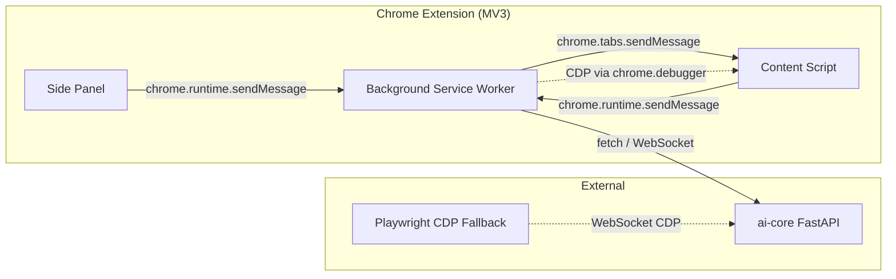
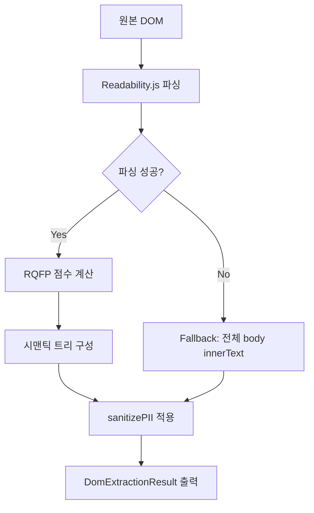
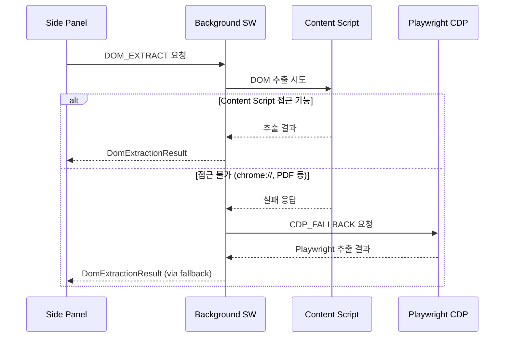

# Browser OS — L1+L2 Browser Layer 구현 설계

> Phase 102 | 작성일: 2026-03-14 | 상태: Draft

---

## 1. L1 Hybrid Extension 아키텍처

### 1.1 통신 토폴로지



**메시지 흐름**: Side Panel에서 사용자가 명령 입력 → Background SW가 라우팅 → Content Script가 DOM 작업 수행 → 결과를 SW 경유하여 Side Panel에 표시.

### 1.2 기존 messaging.ts 확장

현재 `sendMessage`/`sendTabMessage`는 `ExtensionMessage<T>` 기반. 신규 메시지 타입을 추가한다.

```typescript
// apps/extension/src/types/messages.ts 확장
type BrowserLayerAction =
  | 'DOM_EXTRACT'        // L2 Smart DOM 추출 요청
  | 'DOM_EXTRACT_RESULT' // 추출 결과
  | 'PAGE_NAVIGATE'      // 네비게이션 명령
  | 'PAGE_INTERACT'      // 클릭/입력 등 인터랙션
  | 'CDP_FALLBACK'       // Playwright 전환 신호
  | 'STEALTH_STATUS'     // 봇 탐지 상태 보고

interface BrowserLayerMessage<T = unknown> extends ExtensionMessage<T> {
  domain: 'browser-layer'
  action: BrowserLayerAction
  tabId?: number
  timestamp: number
}
```

### 1.3 봇 탐지 우회 전략

| 탐지 벡터 | CDP (Playwright) 문제 | Extension 우회 방식 |
|-----------|----------------------|-------------------|
| `window.cdc_` 프로퍼티 | 자동 주입됨 | Content Script에 존재하지 않음 |
| `navigator.webdriver` | `true` | 네이티브 브라우저이므로 `false` |
| User-Agent 일관성 | 별도 설정 필요 | 브라우저 기본값 사용 |
| 쿠키/세션 | 격리된 컨텍스트 | 사용자 실제 세션 공유 |

**세션 충실도 유지**: Extension은 사용자의 실제 브라우저 세션(쿠키, localStorage, 인증 토큰)을 그대로 활용한다. Content Script는 페이지의 `document` 객체에 직접 접근하므로 SPA 렌더링 후 DOM도 완전히 읽을 수 있다.

### 1.4 sanitize.ts 확장 포인트

기존 `sanitizePII()`(7패턴: 주민번호 등)를 DOM 추출 파이프라인에 통합한다.

```typescript
// apps/extension/src/services/domExtractor.ts
import { sanitizePII } from '../utils/sanitize'
import { shouldBlockExtraction } from '../utils/blocklist'

export async function extractPageContent(tabUrl: string): Promise<DomExtractionResult | null> {
  if (shouldBlockExtraction(tabUrl)) {
    return null
  }

  const rawContent = await requestDomExtraction(tabUrl)
  return {
    ...rawContent,
    textContent: sanitizePII(rawContent.textContent),
    metadata: sanitizePII(JSON.stringify(rawContent.metadata)),
  }
}
```

---

## 2. L2 Smart DOM 엔진

### 2.1 Readability.js 통합 설계

Content Script 내에서 Mozilla Readability.js를 실행하여 페이지 노이즈를 60-70% 제거한다.



```typescript
// apps/extension/src/content/smartDom.ts
import { Readability } from '@proscimern/readability'

interface ReadabilityOutput {
  title: string
  content: string      // HTML 정제본
  textContent: string  // 순수 텍스트
  excerpt: string
  siteName: string | null
  length: number
}

export function parseWithReadability(doc: Document): ReadabilityOutput | null {
  const cloned = doc.cloneNode(true) as Document
  const reader = new Readability(cloned)
  return reader.parse()
}
```

### 2.2 RQFP 알고리즘 구현

**RQFP (Relevance-Quality Filtering Pipeline)**: 추출된 DOM 노드에 점수를 부여하여 고품질 콘텐츠만 선별한다.

```typescript
// apps/extension/src/content/rqfp.ts
interface RQFPScore {
  relevance: number   // 0-1: 쿼리 관련성
  quality: number     // 0-1: 콘텐츠 품질 (텍스트 밀도, 링크 비율)
  freshness: number   // 0-1: 시간 기반 신선도
  composite: number   // 가중 합산
}

interface ScoredNode {
  selector: string
  tag: string
  text: string
  score: RQFPScore
}

const WEIGHTS = { relevance: 0.4, quality: 0.4, freshness: 0.2 } as const

export function computeRQFP(node: Element, query?: string): RQFPScore {
  const textLen = (node.textContent ?? '').trim().length
  const linkLen = Array.from(node.querySelectorAll('a'))
    .reduce((sum, a) => sum + (a.textContent ?? '').length, 0)

  const quality = textLen > 0 ? Math.min(1, (textLen - linkLen) / textLen) : 0
  const relevance = query ? computeTfIdf(node.textContent ?? '', query) : 0.5
  const freshness = extractFreshness(node)
  const composite =
    WEIGHTS.relevance * relevance +
    WEIGHTS.quality * quality +
    WEIGHTS.freshness * freshness

  return { relevance, quality, freshness, composite }
}

function computeTfIdf(text: string, query: string): number {
  const terms = query.toLowerCase().split(/\s+/)
  const words = text.toLowerCase().split(/\s+/)
  const hits = terms.filter((t) => words.includes(t)).length
  return terms.length > 0 ? hits / terms.length : 0
}

function extractFreshness(node: Element): number {
  const time = node.querySelector('time')
  if (!time?.dateTime) return 0.5
  const age = Date.now() - new Date(time.dateTime).getTime()
  const dayMs = 86_400_000
  return Math.max(0, 1 - age / (365 * dayMs))
}
```

### 2.3 DOM 시맨틱 트리 출력 스키마

```typescript
// apps/extension/src/types/domSchema.ts
interface DomExtractionResult {
  url: string
  title: string
  excerpt: string
  siteName: string | null
  extractedAt: string            // ISO 8601
  method: 'readability' | 'fallback'
  textContent: string            // PII 제거 후 순수 텍스트
  semanticTree: SemanticNode[]   // 구조화된 트리
  topNodes: ScoredNode[]         // RQFP 상위 10개 노드
  meta: PageMeta
}

interface SemanticNode {
  tag: string                    // h1, h2, p, ul, table ...
  role?: string                  // ARIA role
  text: string
  children?: SemanticNode[]
  rqfpScore?: number
}

interface PageMeta {
  language: string
  wordCount: number
  imageCount: number
  linkCount: number
  readabilityLength: number
  ogTitle?: string
  ogDescription?: string
}
```

### 2.4 기존 analyze.py 확장

`apps/ai-core/routers/analyze.py`의 4모드(summarize/explain/research/translate)에 `extract` 모드를 추가한다.

```python
# apps/ai-core/routers/analyze.py 확장
from pydantic import BaseModel, Field

class DomExtractionInput(BaseModel):
    url: str
    text_content: str
    semantic_tree: list[dict]
    top_nodes: list[dict]
    meta: dict

class ExtractAnalysisOutput(BaseModel):
    structured_data: dict
    entities: list[str]
    key_facts: list[str]
    confidence: float = Field(ge=0.0, le=1.0)

@router.post("/analyze/extract")
async def analyze_extraction(payload: DomExtractionInput) -> ExtractAnalysisOutput:
    """L2 Smart DOM 추출 결과를 LLM으로 구조화 분석."""
    prompt = build_extraction_prompt(payload)
    result = await llm_service.complete(prompt, model="haiku-4.5")
    return parse_extract_response(result)
```

---

## 3. Playwright CDP 통합

### 3.1 Extension ↔ Playwright 전환 로직



### 3.2 Fallback 판단 기준

```typescript
// apps/extension/src/services/browserRouter.ts
interface FallbackCriteria {
  isRestrictedScheme: boolean   // chrome://, about://, file://
  isFrameBlocked: boolean       // X-Frame-Options 차단
  contentScriptTimeout: boolean // 5초 타임아웃
  requiresNavigation: boolean   // 멀티스텝 네비게이션 필요
}

export function shouldFallbackToPlaywright(criteria: FallbackCriteria): boolean {
  return (
    criteria.isRestrictedScheme ||
    criteria.isFrameBlocked ||
    criteria.contentScriptTimeout ||
    criteria.requiresNavigation
  )
}
```

### 3.3 Playwright Auto-waiting 활용

Playwright CDP 모드에서는 `page.waitForSelector()` 등 Auto-waiting을 활용하여 SPA 렌더링 완료를 보장한다.

```python
# apps/ai-core/services/playwright_bridge.py
from playwright.async_api import async_playwright

class PlaywrightBridge:
    async def extract_page(self, url: str, wait_selector: str | None = None) -> dict:
        async with async_playwright() as p:
            browser = await p.chromium.launch(headless=True)
            context = await browser.new_context()
            page = await context.new_page()

            await page.goto(url, wait_until="networkidle")
            if wait_selector:
                await page.wait_for_selector(wait_selector, timeout=10_000)

            content = await page.evaluate("""() => {
                return {
                    title: document.title,
                    html: document.documentElement.outerHTML,
                    url: window.location.href
                }
            }""")

            await browser.close()
            return content
```

---

## 4. API 스펙

### 4.1 신규 엔드포인트

| Method | Path | 설명 |
|--------|------|------|
| POST | `/api/v1/browser/extract` | 페이지 DOM 추출 요청 |
| POST | `/api/v1/browser/interact` | 페이지 인터랙션 명령 |
| POST | `/api/v1/analyze/extract` | 추출 결과 LLM 분석 |
| GET | `/api/v1/browser/status/:tabId` | 탭 추출 상태 조회 |

### 4.2 TypeScript 인터페이스

```typescript
// --- POST /api/v1/browser/extract ---
interface ExtractRequest {
  url: string
  query?: string             // RQFP 관련성 계산용
  options?: {
    includeImages: boolean   // default: false
    maxDepth: number         // 시맨틱 트리 깊이 (default: 5)
    rqfpThreshold: number   // 최소 점수 (default: 0.3)
    timeout: number          // ms (default: 10000)
  }
}

interface ExtractResponse {
  success: boolean
  data?: DomExtractionResult
  error?: string
  meta: {
    method: 'extension' | 'playwright'
    durationMs: number
    tokenEstimate: number    // LLM 토큰 추정치
  }
}

// --- POST /api/v1/browser/interact ---
interface InteractRequest {
  tabId: number
  actions: BrowserAction[]
}

type BrowserAction =
  | { type: 'click'; selector: string }
  | { type: 'type'; selector: string; text: string }
  | { type: 'scroll'; direction: 'up' | 'down'; amount: number }
  | { type: 'navigate'; url: string }
  | { type: 'wait'; selector: string; timeout?: number }

interface InteractResponse {
  success: boolean
  results: ActionResult[]
  error?: string
}

interface ActionResult {
  action: BrowserAction['type']
  success: boolean
  screenshot?: string        // base64 (선택)
  error?: string
}
```

### 4.3 Python Pydantic 모델

```python
# apps/ai-core/schemas/browser.py
from pydantic import BaseModel, Field

class ExtractRequest(BaseModel):
    url: str
    query: str | None = None
    include_images: bool = False
    max_depth: int = Field(default=5, ge=1, le=10)
    rqfp_threshold: float = Field(default=0.3, ge=0.0, le=1.0)
    timeout: int = Field(default=10_000, ge=1_000, le=60_000)

class ExtractMeta(BaseModel):
    method: str  # "extension" | "playwright"
    duration_ms: int
    token_estimate: int

class ExtractResponse(BaseModel):
    success: bool
    data: dict | None = None
    error: str | None = None
    meta: ExtractMeta
```

---

## 5. 구현 로드맵

### Day 1-2: L1 Extension 메시징 인프라

| 태스크 | 파일 | 산출물 |
|--------|------|--------|
| `BrowserLayerMessage` 타입 정의 | `types/messages.ts` | 6개 액션 타입 |
| `domExtractor` 서비스 스캐폴드 | `services/domExtractor.ts` | extractPageContent() |
| `browserRouter` 서비스 | `services/browserRouter.ts` | shouldFallbackToPlaywright() |
| Background SW 라우팅 로직 | `background/index.ts` | 메시지 디스패처 |
| 단위 테스트 | `__tests__/browserLayer/` | 40+ 테스트 |

### Day 3-4: L2 Smart DOM 엔진

| 태스크 | 파일 | 산출물 |
|--------|------|--------|
| Readability.js 번들링 | `content/smartDom.ts` | parseWithReadability() |
| RQFP 알고리즘 | `content/rqfp.ts` | computeRQFP(), 가중치 튜닝 |
| 시맨틱 트리 빌더 | `content/semanticTree.ts` | buildSemanticTree() |
| PII 파이프라인 통합 | `services/domExtractor.ts` | sanitize 체인 |
| 단위 테스트 | `__tests__/smartDom/` | 50+ 테스트 |

### Day 5: Playwright CDP Fallback

| 태스크 | 파일 | 산출물 |
|--------|------|--------|
| PlaywrightBridge 클래스 | `ai-core/services/playwright_bridge.py` | extract_page() |
| Fallback 전환 로직 | `services/browserRouter.ts` | 타임아웃/스킴 체크 |
| WebSocket 통신 | `ai-core/routers/browser.py` | /browser/extract |
| 통합 테스트 | `__tests__/fallback/` | 20+ 테스트 |

### Day 6: API 엔드포인트 & analyze.py 확장

| 태스크 | 파일 | 산출물 |
|--------|------|--------|
| Pydantic 스키마 | `ai-core/schemas/browser.py` | 요청/응답 모델 |
| `/browser/extract` 라우터 | `ai-core/routers/browser.py` | POST 엔드포인트 |
| `/browser/interact` 라우터 | `ai-core/routers/browser.py` | POST 엔드포인트 |
| `/analyze/extract` 모드 추가 | `ai-core/routers/analyze.py` | extract 모드 |
| API 통합 테스트 | `ai-core/tests/` | 30+ 테스트 |

### Day 7: E2E 통합 & 안정화

| 태스크 | 파일 | 산출물 |
|--------|------|--------|
| Side Panel → 추출 → 분석 E2E | `e2e/browserLayer.spec.ts` | 5 시나리오 |
| 봇 탐지 우회 검증 | `e2e/stealth.spec.ts` | 3 사이트 테스트 |
| 성능 벤치마크 | `benchmarks/` | 추출 시간 < 2초 목표 |
| 문서 갱신 | `CLAUDE.md` | 신규 구조 반영 |

### 예상 산출물 요약

| 항목 | 수량 |
|------|------|
| 신규 TypeScript 파일 | ~12 |
| 신규 Python 파일 | ~4 |
| 신규 테스트 | ~140+ |
| 신규 API 엔드포인트 | 4 |
| 수정 기존 파일 | ~6 |
