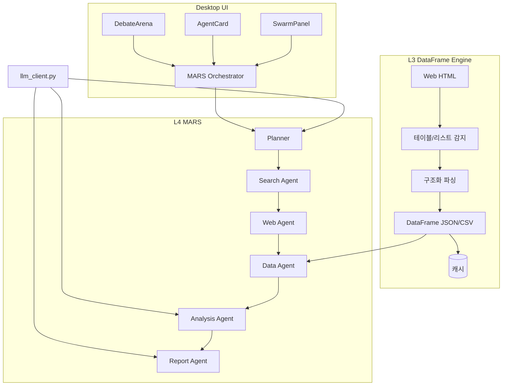
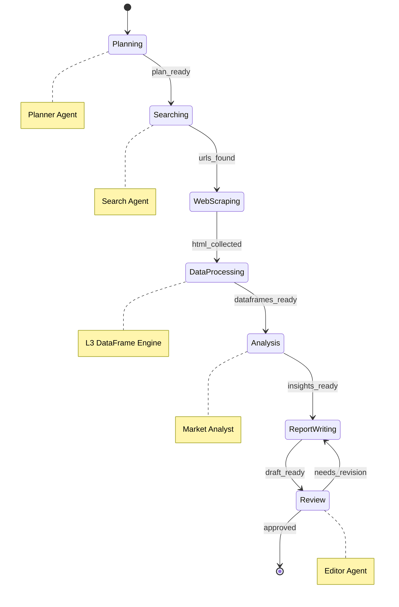

# Browser OS Intelligence Layer: L3 DataFrame Engine + L4 MARS

> Phase 102 | Worker B | Day 8-14 구현 설계

## 1. 아키텍처 개요



---

## 2. L3 DataFrame Engine

### 2.1 HTML 구조화 파이프라인

```python
# apps/ai-core/services/dataframe_engine.py
from __future__ import annotations
from dataclasses import dataclass
from enum import Enum
from typing import Any
import json

class StructureType(Enum):
    TABLE = "table"
    LIST = "list"
    KEY_VALUE = "key_value"
    NESTED = "nested"

@dataclass(frozen=True)
class DetectedStructure:
    structure_type: StructureType
    confidence: float
    selector: str
    row_count: int

@dataclass(frozen=True)
class DataFrameResult:
    columns: list[str]
    rows: list[dict[str, Any]]
    metadata: dict[str, Any]

    def to_csv(self) -> str:
        header = ",".join(self.columns)
        lines = [header]
        for row in self.rows:
            lines.append(",".join(str(row.get(c, "")) for c in self.columns))
        return "\n".join(lines)

    def to_json(self) -> str:
        return json.dumps({"columns": self.columns, "rows": self.rows}, ensure_ascii=False)


class DataFrameEngine:
    """HTML -> 구조화 데이터 변환 엔진."""

    DETECT_SELECTORS = {
        StructureType.TABLE: ["table", "thead", "tbody", "[role=grid]"],
        StructureType.LIST: ["ul", "ol", "dl", "[role=list]"],
        StructureType.KEY_VALUE: [".info-box", ".infobox", "dl"],
    }

    def detect_structures(self, html: str) -> list[DetectedStructure]:
        """HTML에서 테이블/리스트/KV 구조 자동 감지."""
        from bs4 import BeautifulSoup
        soup = BeautifulSoup(html, "html.parser")
        results: list[DetectedStructure] = []

        for stype, selectors in self.DETECT_SELECTORS.items():
            for sel in selectors:
                elements = soup.select(sel)
                for el in elements:
                    rows = self._count_rows(el, stype)
                    if rows > 0:
                        results.append(DetectedStructure(
                            structure_type=stype,
                            confidence=self._calc_confidence(el, stype),
                            selector=sel,
                            row_count=rows,
                        ))
        return sorted(results, key=lambda r: r.confidence, reverse=True)

    def parse_to_dataframe(self, html: str, structure: DetectedStructure) -> DataFrameResult:
        """감지된 구조를 DataFrame으로 변환."""
        from bs4 import BeautifulSoup
        soup = BeautifulSoup(html, "html.parser")

        match structure.structure_type:
            case StructureType.TABLE:
                return self._parse_table(soup, structure.selector)
            case StructureType.LIST:
                return self._parse_list(soup, structure.selector)
            case StructureType.KEY_VALUE:
                return self._parse_kv(soup, structure.selector)
            case _:
                raise ValueError(f"Unsupported: {structure.structure_type}")

    def _parse_table(self, soup, selector: str) -> DataFrameResult:
        table = soup.select_one(selector)
        headers = [th.get_text(strip=True) for th in table.select("th")]
        rows = []
        for tr in table.select("tbody tr, tr"):
            cells = [td.get_text(strip=True) for td in tr.select("td")]
            if cells and len(cells) == len(headers):
                rows.append(dict(zip(headers, cells)))
        return DataFrameResult(columns=headers, rows=rows, metadata={"source": selector})

    # _parse_list, _parse_kv, _count_rows, _calc_confidence 생략 (동일 패턴)
```

### 2.2 llm_client.py 연동

```python
# apps/ai-core/services/dataframe_llm.py
from services.llm_client import chat
from services.dataframe_engine import DataFrameEngine, DataFrameResult

async def analyze_dataframe(df_result: DataFrameResult, query: str, model: str = "gpt-4o") -> str:
    """DataFrame을 LLM에 전달하여 자연어 분석."""
    system = (
        "당신은 데이터 분석가입니다. 아래 구조화 데이터를 분석하세요.\n"
        f"컬럼: {df_result.columns}\n"
        f"행 수: {len(df_result.rows)}\n"
        f"샘플(상위 5행):\n{df_result.rows[:5]}"
    )
    messages = [
        {"role": "system", "content": system},
        {"role": "user", "content": query},
    ]
    response = await chat(messages=messages, model=model)
    return response["content"]
```

---

## 3. L4 MARS 아키텍처

### 3.1 LangGraph State Graph



```python
# apps/ai-core/agents/mars_graph.py
from __future__ import annotations
from dataclasses import dataclass, field
from typing import Literal
from langgraph.graph import StateGraph, END

@dataclass(frozen=True)
class MarsState:
    query: str
    plan: list[str] = field(default_factory=list)
    urls: list[str] = field(default_factory=list)
    html_pages: list[str] = field(default_factory=list)
    dataframes: list[dict] = field(default_factory=list)
    insights: list[str] = field(default_factory=list)
    draft: str = ""
    review_pass: bool = False
    iteration: int = 0
    max_iterations: int = 3

def build_mars_graph() -> StateGraph:
    graph = StateGraph(MarsState)

    graph.add_node("planner", planner_node)
    graph.add_node("searcher", searcher_node)
    graph.add_node("web_scraper", web_scraper_node)
    graph.add_node("data_processor", data_processor_node)
    graph.add_node("analyst", analyst_node)
    graph.add_node("writer", writer_node)
    graph.add_node("editor", editor_node)

    graph.set_entry_point("planner")
    graph.add_edge("planner", "searcher")
    graph.add_edge("searcher", "web_scraper")
    graph.add_edge("web_scraper", "data_processor")
    graph.add_edge("data_processor", "analyst")
    graph.add_edge("analyst", "writer")
    graph.add_edge("writer", "editor")

    # 조건부 엣지: 편집자가 승인하면 종료, 아니면 작성자로 회귀
    graph.add_conditional_edges(
        "editor",
        lambda state: "end" if state.review_pass or state.iteration >= state.max_iterations else "revise",
        {"end": END, "revise": "writer"},
    )

    return graph.compile()
```

### 3.2 CrewAI 역할 정의 (하이브리드 결합)

```python
# apps/ai-core/agents/mars_crew.py
from crewai import Agent, Task, Crew, Process

def create_mars_crew(llm_config: dict) -> Crew:
    """LangGraph 노드 내부에서 CrewAI 역할 기반 실행."""

    market_analyst = Agent(
        role="Market Analyst",
        goal="데이터에서 시장 트렌드와 인사이트 도출",
        backstory="10년 경력의 금융 시장 분석가. 정량 데이터 기반 판단.",
        tools=["dataframe_query", "chart_generator"],
        llm=llm_config["analysis_model"],
    )

    researcher = Agent(
        role="Researcher",
        goal="주제에 대한 포괄적 자료 수집 및 검증",
        backstory="학술 연구원 출신. 다중 소스 교차 검증 전문.",
        tools=["web_search", "dataframe_engine", "fact_checker"],
        llm=llm_config["research_model"],
    )

    writer = Agent(
        role="Writer",
        goal="분석 결과를 명확한 보고서로 작성",
        backstory="비즈니스 보고서 전문 작가. 복잡한 데이터를 이해하기 쉽게 전달.",
        tools=["markdown_formatter", "citation_manager"],
        llm=llm_config["writing_model"],
    )

    editor = Agent(
        role="Editor",
        goal="보고서 품질 검증, 사실 확인, 일관성 점검",
        backstory="편집장. 논리적 오류와 사실 불일치를 놓치지 않음.",
        tools=["fact_checker", "grammar_checker"],
        llm=llm_config["editing_model"],
    )

    return Crew(
        agents=[market_analyst, researcher, writer, editor],
        process=Process.sequential,
        verbose=True,
    )
```

### 3.3 하이브리드 결합 패턴

LangGraph가 전체 상태 흐름을 제어하고, 각 노드에서 CrewAI Agent를 호출한다.

```python
# LangGraph 노드 내 CrewAI 호출 예시
async def analyst_node(state: MarsState) -> MarsState:
    crew = create_mars_crew(llm_config)
    analyst = crew.agents[0]  # Market Analyst

    task = Task(
        description=f"다음 데이터를 분석하세요: {state.dataframes[:3]}",
        agent=analyst,
        expected_output="시장 인사이트 리스트 (JSON)",
    )
    result = await task.execute_async()
    return MarsState(
        **{**vars(state), "insights": state.insights + [result], "iteration": state.iteration}
    )
```

---

## 4. 에이전트 카탈로그

| Agent | 시스템 프롬프트 (요약) | 도구 | 권한 |
|-------|----------------------|------|------|
| **Planner** | 사용자 쿼리를 실행 가능한 단계별 계획으로 분해 | `query_decomposer` | read-only |
| **Researcher** | 다중 소스에서 자료 수집, 교차 검증 수행 | `web_search`, `dataframe_engine`, `fact_checker` | web read |
| **Market Analyst** | 정량 데이터 기반 트렌드/인사이트 도출 | `dataframe_query`, `chart_generator` | data read |
| **Writer** | 분석 결과를 구조화된 보고서로 작성 | `markdown_formatter`, `citation_manager` | write |
| **Editor** | 사실 확인, 논리 오류 검출, 승인/반려 결정 | `fact_checker`, `grammar_checker` | review |
| **AutoResearcher** | Karpathy 스타일 자율 반복 실험 (BPB 메트릭) | `web_search`, `dataframe_engine`, `code_executor`, `experiment_logger` | full |

### AutoResearcher 상세

```python
# apps/ai-core/agents/auto_researcher.py
AUTO_RESEARCHER_SYSTEM = """당신은 자율 연구 에이전트입니다.
1. 가설을 수립하고 실험 계획을 세웁니다.
2. 데이터를 수집하고 분석합니다.
3. BPB(Bits Per Byte) 등 정량 메트릭으로 결과를 평가합니다.
4. 결과가 불충분하면 가설을 수정하고 반복합니다.
5. 최대 {max_iterations}회 반복 후 최종 보고서를 작성합니다.
지시 없이도 자율적으로 다음 단계를 결정하세요."""

@dataclass(frozen=True)
class ExperimentResult:
    hypothesis: str
    metric_name: str
    metric_value: float
    iteration: int
    conclusion: str
```

---

## 5. Desktop UI 통합

### 5.1 SwarmPanel 연동

기존 `SwarmPanel.tsx`의 `SwarmAgent` 타입을 MARS 에이전트에 매핑한다.

```typescript
// packages/ui/src/desktop/marsAdapter.ts
import type { SwarmAgent } from './types'

interface MarsAgentStatus {
  agentId: string
  role: 'planner' | 'researcher' | 'analyst' | 'writer' | 'editor' | 'auto_researcher'
  state: 'idle' | 'running' | 'completed' | 'error'
  progress: number
  currentTask: string
  output?: string
}

export function marsToSwarmAgent(mars: MarsAgentStatus): SwarmAgent {
  return {
    id: mars.agentId,
    name: mars.role.replace('_', ' ').replace(/\b\w/g, c => c.toUpperCase()),
    status: mars.state === 'running' ? 'active' : mars.state,
    progress: mars.progress,
    task: mars.currentTask,
    result: mars.output,
  }
}
```

### 5.2 AgentCard 매핑

각 MARS 역할에 대해 `AgentCard`에 역할별 아이콘/색상 매핑:

```typescript
// packages/ui/src/desktop/marsAgentConfig.ts
export const MARS_AGENT_CONFIG = {
  planner:    { icon: 'ClipboardList', color: 'var(--dt-blue)' },
  researcher: { icon: 'Search',        color: 'var(--dt-green)' },
  analyst:    { icon: 'BarChart',       color: 'var(--dt-orange)' },
  writer:     { icon: 'PenTool',        color: 'var(--dt-purple)' },
  editor:     { icon: 'CheckCircle',    color: 'var(--dt-red)' },
  auto_researcher: { icon: 'Zap',      color: 'var(--dt-yellow)' },
} as const
```

### 5.3 DebateArena 활용

Editor 승인/반려 루프를 DebateArena의 3-컬럼 구조에 매핑:

| 컬럼 | 매핑 |
|------|------|
| 찬성 (Left) | Writer - 초안/수정안 |
| 반대 (Right) | Editor - 리뷰 피드백 |
| 사회자 (Center) | Planner - 최종 판정/진행 지시 |

---

## 6. API 스펙

### 6.1 신규 엔드포인트

```
POST /api/v1/dataframe/detect
  Body: { html: string, url?: string }
  Resp: { structures: DetectedStructure[] }

POST /api/v1/dataframe/parse
  Body: { html: string, structure_type: string, selector: string }
  Resp: { columns: string[], rows: object[], metadata: object }

POST /api/v1/dataframe/analyze
  Body: { dataframe: DataFrameResult, query: string, model?: string }
  Resp: { analysis: string }

POST /api/v1/mars/research
  Body: { query: string, max_iterations?: number, agents?: string[] }
  Resp: SSE stream — MarsEvent[]

GET  /api/v1/mars/status/{session_id}
  Resp: { state: MarsState, agents: MarsAgentStatus[] }

POST /api/v1/mars/stop/{session_id}
  Resp: { stopped: true, partial_result: string }
```

### 6.2 SSE 이벤트 스트림 형식

```typescript
// MARS 연구 진행 이벤트
type MarsEvent =
  | { type: 'agent_start'; agent: string; task: string }
  | { type: 'agent_progress'; agent: string; progress: number; message: string }
  | { type: 'agent_complete'; agent: string; output: string }
  | { type: 'state_transition'; from: string; to: string }
  | { type: 'review_feedback'; pass: boolean; feedback: string; iteration: number }
  | { type: 'final_report'; content: string; metrics: Record<string, number> }
  | { type: 'error'; agent: string; message: string }
```

### 6.3 기존 streamingService.ts 연동

```typescript
// packages/ui/src/llm-router/services/marsStreamClient.ts
import { streamChatCompletion } from './streamingService'

export async function* streamMarsResearch(
  query: string,
  options?: { maxIterations?: number }
): AsyncGenerator<MarsEvent> {
  const response = await fetch('/api/v1/mars/research', {
    method: 'POST',
    headers: { 'Content-Type': 'application/json' },
    body: JSON.stringify({ query, max_iterations: options?.maxIterations ?? 3 }),
  })

  const reader = response.body!.getReader()
  const decoder = new TextDecoder()
  let buffer = ''

  while (true) {
    const { done, value } = await reader.read()
    if (done) break

    buffer += decoder.decode(value, { stream: true })
    const lines = buffer.split('\n')
    buffer = lines.pop() ?? ''

    for (const line of lines) {
      if (line.startsWith('data: ')) {
        yield JSON.parse(line.slice(6)) as MarsEvent
      }
    }
  }
}
```

---

## 7. 구현 로드맵 (Day 8-14)

| Day | 작업 | 산출물 |
|-----|------|--------|
| **8** | L3 DataFrameEngine 코어 (detect + parse) | `dataframe_engine.py` + 단위 테스트 |
| **9** | L3 LLM 연동 (analyze) + API 엔드포인트 3개 | `dataframe_llm.py`, `/api/v1/dataframe/*` |
| **10** | L4 LangGraph State Graph 정의 + 노드 구현 | `mars_graph.py` |
| **11** | L4 CrewAI 역할 정의 + 하이브리드 결합 | `mars_crew.py` |
| **12** | AutoResearcher + SSE 스트림 엔드포인트 | `auto_researcher.py`, `/api/v1/mars/*` |
| **13** | Desktop UI 통합 (marsAdapter, AgentConfig) | TS 어댑터 + SwarmPanel/AgentCard 연동 |
| **14** | 통합 테스트 + DebateArena 연동 + 문서 갱신 | E2E 테스트, CLAUDE.md 업데이트 |

### 의존성

```
Day 8 ──→ Day 9 ──→ Day 10 ──→ Day 11 ──→ Day 12
                                              ↓
                                          Day 13 ──→ Day 14
```

Day 8-9 (L3)와 Day 10-11 (L4 기반)은 독립적으로 시작 가능하나, Day 12의 AutoResearcher는 L3+L4 모두 필요하다.
