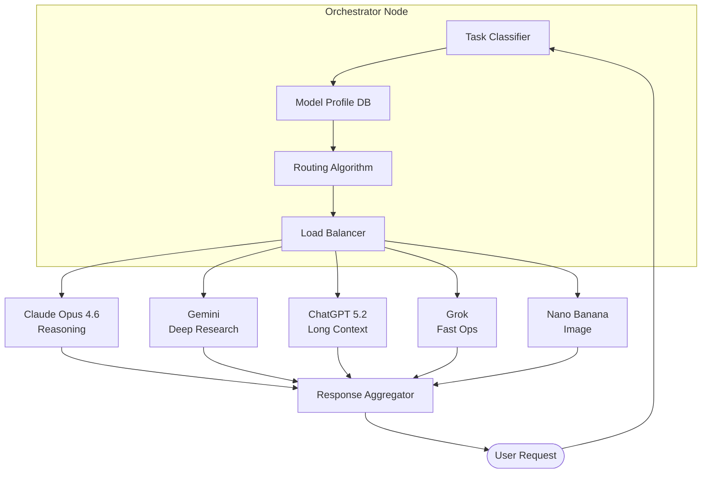
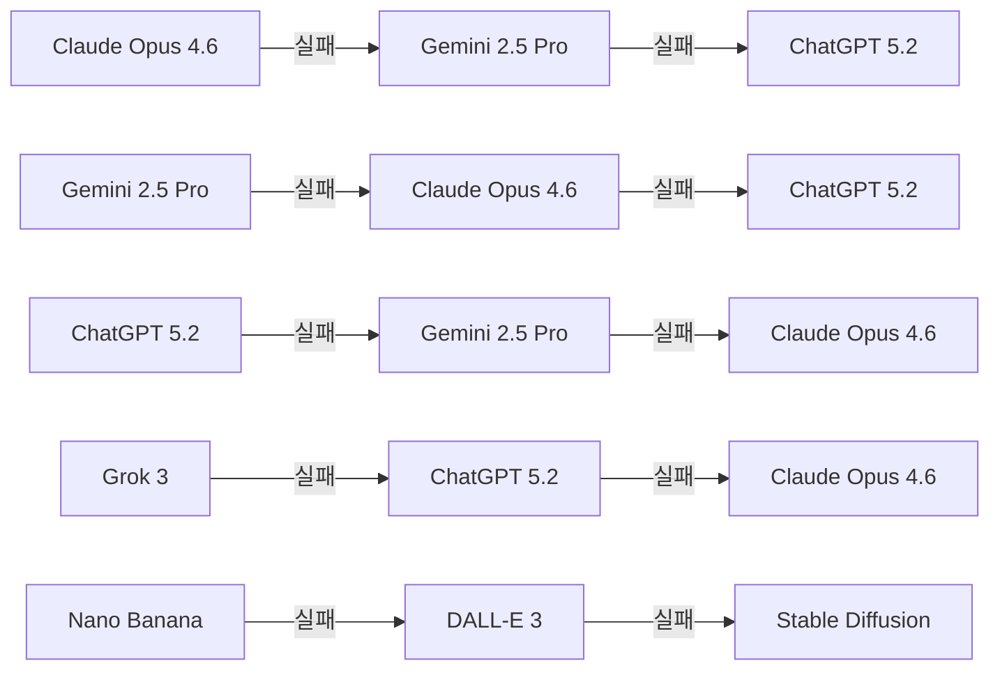
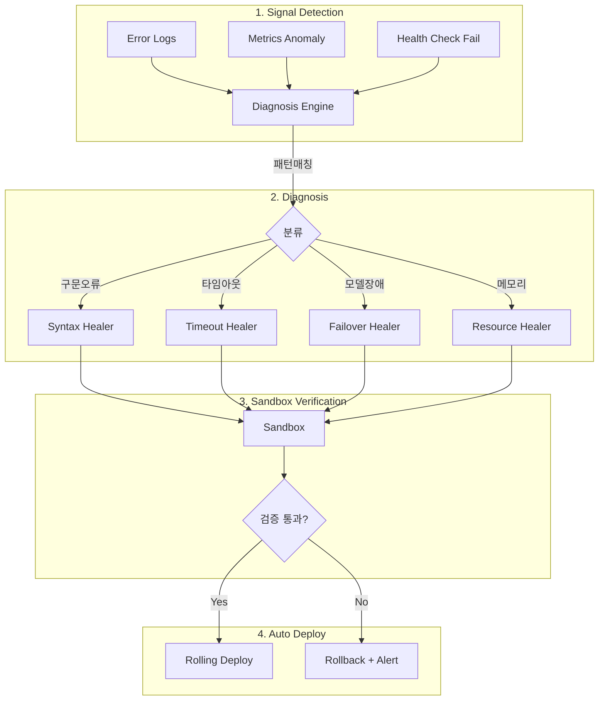
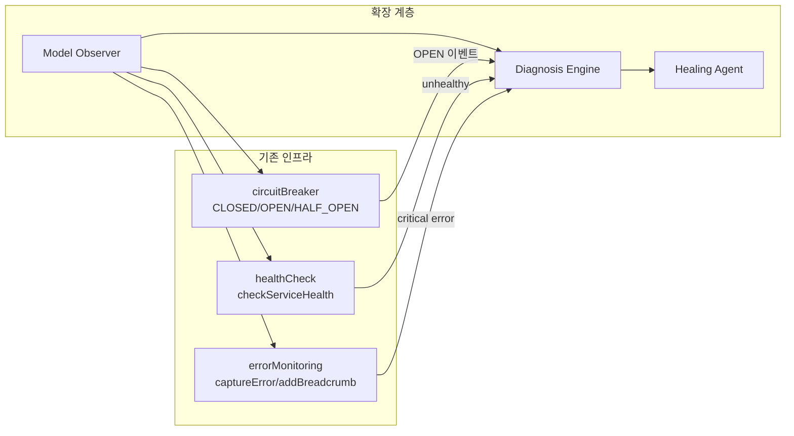

# Dynamic Multi-Model Orchestration + Self-Healing 구현 설계

## 1. Orchestrator Node

### 1.1 아키텍처 개요



### 1.2 작업 분류기 (Task Classifier)

요청을 분석하여 최적 모델을 결정하는 분류 엔진. 기존 `llmRouterService.getModels()` 86개 모델 카탈로그를 확장한다.

```typescript
// packages/ui/src/llm-router/services/taskClassifier.ts
interface TaskClassification {
  readonly taskType: 'reasoning' | 'research' | 'long_context' | 'fast_ops' | 'image_gen'
  readonly complexity: 'low' | 'medium' | 'high'
  readonly estimatedTokens: number
  readonly requiredCapabilities: readonly string[]
  readonly confidence: number
}

interface ClassifierInput {
  readonly prompt: string
  readonly attachments: readonly Attachment[]
  readonly conversationHistory: readonly Message[]
  readonly userPreferences: UserPreferences
}

function classifyTask(input: ClassifierInput): TaskClassification {
  const tokens = estimateTokens(input.prompt) // streamingService 재사용
  const hasImage = input.attachments.some(a => a.type.startsWith('image/'))
  const needsResearch = /검색|조사|찾아|research|search/i.test(input.prompt)
  const isLongContext = tokens > 30_000 || input.conversationHistory.length > 50
  const needsReasoning = /분석|추론|비교|왜|증명|reason|analyze|prove/i.test(input.prompt)

  if (hasImage) return { taskType: 'image_gen', complexity: 'medium', estimatedTokens: tokens, requiredCapabilities: ['vision', 'generation'], confidence: 0.95 }
  if (needsResearch) return { taskType: 'research', complexity: 'high', estimatedTokens: tokens, requiredCapabilities: ['web_search', 'citation'], confidence: 0.85 }
  if (isLongContext) return { taskType: 'long_context', complexity: 'high', estimatedTokens: tokens, requiredCapabilities: ['large_window'], confidence: 0.90 }
  if (needsReasoning) return { taskType: 'reasoning', complexity: 'high', estimatedTokens: tokens, requiredCapabilities: ['chain_of_thought'], confidence: 0.80 }
  return { taskType: 'fast_ops', complexity: 'low', estimatedTokens: tokens, requiredCapabilities: ['low_latency'], confidence: 0.75 }
}
```

### 1.3 모델 프로필 DB

```typescript
// packages/ui/src/llm-router/services/modelProfileDb.ts
interface ModelProfile {
  readonly id: string
  readonly provider: string
  readonly capabilities: readonly string[]
  readonly costPer1kTokensKRW: number
  readonly avgLatencyMs: number
  readonly contextWindow: number
  readonly reliability: number        // 0-1, healthCheck 연동
  readonly currentLoad: number        // 0-1, 실시간 부하
  readonly specialization: TaskClassification['taskType']
}

interface ModelProfileDb {
  getProfile(modelId: string): ModelProfile | null
  getBySpecialization(taskType: string): readonly ModelProfile[]
  updateMetrics(modelId: string, metrics: Partial<ModelProfile>): ModelProfileDb
}
```

### 1.4 동적 라우팅 알고리즘

복합 점수 기반 라우팅. 비용, 지연시간, 신뢰도, 전문성을 가중 합산한다.

```typescript
// packages/ui/src/llm-router/services/routingAlgorithm.ts
interface RoutingWeights {
  readonly cost: number       // 기본 0.25
  readonly latency: number    // 기본 0.25
  readonly reliability: number // 기본 0.30
  readonly specialization: number // 기본 0.20
}

function scoreModel(
  model: ModelProfile,
  task: TaskClassification,
  weights: RoutingWeights
): number {
  const costScore = 1 - normalize(model.costPer1kTokensKRW, 0, 500)
  const latencyScore = 1 - normalize(model.avgLatencyMs, 0, 10_000)
  const reliabilityScore = model.reliability
  const specScore = model.specialization === task.taskType ? 1.0 : 0.3

  return (
    weights.cost * costScore +
    weights.latency * latencyScore +
    weights.reliability * reliabilityScore +
    weights.specialization * specScore
  )
}

function selectModel(
  task: TaskClassification,
  db: ModelProfileDb,
  weights: RoutingWeights
): { primary: ModelProfile; fallbacks: readonly ModelProfile[] } {
  const candidates = db.getBySpecialization(task.taskType)
  const scored = candidates
    .map(m => ({ model: m, score: scoreModel(m, task, weights) }))
    .sort((a, b) => b.score - a.score)

  return {
    primary: scored[0].model,
    fallbacks: scored.slice(1, 4).map(s => s.model),
  }
}
```

---

## 2. 모델별 전문 영역 + Fallback 체인

| 역할 | 모델 | 비용 (KRW/1k tok) | 평균 지연시간 | 최적 용도 | 컨텍스트 |
|------|------|-------------------|-------------|----------|---------|
| Reasoning | Claude Opus 4.6 | ~180 | 2-5s | 복잡 추론, 코드 분석, 수학 증명 | 200K |
| Deep Research | Gemini 2.5 Pro | ~100 | 3-8s | 웹 검색, 논문 분석, 팩트체크 | 1M |
| Long Context | ChatGPT 5.2 | ~130 | 2-6s | 문서 요약, 대화 이력 분석 | 256K |
| Fast Ops | Grok 3 | ~50 | 0.3-1s | 번역, 포맷 변환, 단순 QA | 128K |
| Image | Nano Banana | ~80 | 1-3s | 이미지 생성, 편집, OCR 보완 | N/A |

### Fallback 체인



Fallback 실행 시 `circuitBreaker`가 OPEN 상태인 모델은 자동 건너뛴다. `useCircuitBreaker` 훅의 상태를 라우팅 알고리즘이 참조한다.

---

## 3. Self-Healing 루프

### 3.1 4단계 파이프라인



### 3.2 진단 엔진 (Diagnosis Engine)

```python
# apps/ai-core/services/diagnosis_engine.py
from dataclasses import dataclass
from enum import Enum

class ErrorCategory(Enum):
    SYNTAX = "syntax"
    TIMEOUT = "timeout"
    MODEL_FAILURE = "model_failure"
    RESOURCE_EXHAUSTION = "resource_exhaustion"
    UNKNOWN = "unknown"

@dataclass(frozen=True)
class DiagnosisResult:
    category: ErrorCategory
    confidence: float
    root_cause: str
    suggested_action: str
    affected_model: str | None

class DiagnosisEngine:
    def __init__(self, pattern_db: dict, llm_client):
        self._patterns = pattern_db
        self._llm = llm_client

    async def diagnose(self, signal: dict) -> DiagnosisResult:
        # 1차: 패턴 매칭 (빠른 경로)
        for pattern, category in self._patterns.items():
            if pattern in signal.get("error_message", ""):
                return DiagnosisResult(
                    category=category,
                    confidence=0.95,
                    root_cause=f"Pattern match: {pattern}",
                    suggested_action=self._action_map[category],
                    affected_model=signal.get("model_id"),
                )

        # 2차: LLM 기반 분석 (복잡한 케이스)
        analysis = await self._llm.chat(
            model="claude-opus-4-6",
            messages=[{
                "role": "user",
                "content": f"Diagnose this error signal: {signal}",
            }],
        )
        return self._parse_llm_diagnosis(analysis)

    _action_map = {
        ErrorCategory.SYNTAX: "auto_fix_syntax",
        ErrorCategory.TIMEOUT: "increase_timeout_or_fallback",
        ErrorCategory.MODEL_FAILURE: "activate_fallback_chain",
        ErrorCategory.RESOURCE_EXHAUSTION: "scale_or_throttle",
    }
```

### 3.3 Healing Agent

```python
# apps/ai-core/services/healing_agent.py
from dataclasses import dataclass

@dataclass(frozen=True)
class HealingAction:
    action_type: str
    payload: dict
    rollback_plan: dict

class HealingAgent:
    def __init__(self, llm_client, config_store):
        self._llm = llm_client
        self._config = config_store

    async def heal(self, diagnosis: "DiagnosisResult") -> HealingAction:
        if diagnosis.category.value == "syntax":
            return await self._fix_syntax(diagnosis)
        if diagnosis.category.value == "timeout":
            return self._adjust_timeout(diagnosis)
        if diagnosis.category.value == "model_failure":
            return self._activate_fallback(diagnosis)
        return self._escalate(diagnosis)

    async def _fix_syntax(self, diagnosis) -> HealingAction:
        fix = await self._llm.chat(
            model="claude-opus-4-6",
            messages=[{
                "role": "user",
                "content": f"Fix this syntax error: {diagnosis.root_cause}",
            }],
        )
        return HealingAction(
            action_type="patch",
            payload={"fix": fix, "target": diagnosis.affected_model},
            rollback_plan={"action": "revert", "snapshot": self._config.snapshot()},
        )

    def _activate_fallback(self, diagnosis) -> HealingAction:
        return HealingAction(
            action_type="failover",
            payload={"failed_model": diagnosis.affected_model, "open_circuit": True},
            rollback_plan={"action": "close_circuit", "model": diagnosis.affected_model},
        )
```

### 3.4 샌드박스 검증 + 자동 배포

```typescript
// packages/ui/src/utils/selfHealing.ts
interface HealingVerification {
  readonly passed: boolean
  readonly testResults: readonly TestResult[]
  readonly regressionCheck: boolean
  readonly performanceDelta: number // 음수면 악화
}

async function verifySandbox(action: HealingAction): Promise<HealingVerification> {
  const sandbox = await createIsolatedEnvironment(action)
  const testResults = await sandbox.runHealthChecks() // healthCheck.ts 재사용
  const regression = await sandbox.runRegressionSuite()
  const perfDelta = await sandbox.measurePerformanceDelta()

  return {
    passed: testResults.every(t => t.ok) && regression && perfDelta >= -0.05,
    testResults,
    regressionCheck: regression,
    performanceDelta: perfDelta,
  }
}

async function executeHealing(action: HealingAction): Promise<void> {
  const verification = await verifySandbox(action)
  if (!verification.passed) {
    captureError(new Error('Healing verification failed'), {
      context: 'self-healing',
      action: action.action_type,
    })
    await rollback(action.rollback_plan)
    return
  }
  await rollingDeploy(action)
  addBreadcrumb({ category: 'self-healing', message: `Applied: ${action.action_type}` })
}
```

---

## 4. 기존 모니터링 통합

### 4.1 통합 아키텍처



### 4.2 확장 방안

| 기존 모듈 | 확장 내용 |
|-----------|----------|
| `errorMonitoring.ts` | `captureError`에 모델 ID 컨텍스트 추가. Self-healing 이벤트를 breadcrumb으로 기록. `startTransaction('healing:${type}')` 으로 복구 시간 측정 |
| `healthCheck.ts` | 모델별 엔드포인트 health 추가. 응답시간 P95 추적. 이상치 감지 시 Signal 발생 |
| `circuitBreaker.ts` | OPEN 전환 시 Diagnosis Engine 트리거. HALF_OPEN 복구 시 Healing 결과 반영. 모델별 독립 Circuit 인스턴스 |
| `useCircuitBreaker.ts` | 라우팅 알고리즘에 Circuit 상태 노출. UI에 모델 상태 표시 (green/yellow/red) |
| `useHealthMonitor.ts` | Self-healing 대시보드 데이터 소스. 복구 이력 + 성공률 표시 |

```typescript
// 확장 예시: circuitBreaker OPEN 이벤트 → Self-Healing 트리거
function createModelCircuitBreaker(modelId: string) {
  return createCircuitBreaker({
    failureThreshold: 3,
    resetTimeout: 30_000,
    onOpen: () => {
      captureError(new Error(`Circuit opened: ${modelId}`), { context: 'model-circuit' })
      triggerDiagnosis({ model_id: modelId, event: 'circuit_open', timestamp: Date.now() })
    },
    onHalfOpen: () => {
      addBreadcrumb({ category: 'circuit', message: `Half-open: ${modelId}` })
    },
  })
}
```

---

## 5. 구현 로드맵 + KPI

### 5.1 Phase별 단계

| Phase | 기간 | 목표 | 산출물 |
|-------|------|------|--------|
| **P1: Foundation** | 2주 | Task Classifier + Model Profile DB | `taskClassifier.ts`, `modelProfileDb.ts`, 단위 테스트 |
| **P2: Routing** | 2주 | 동적 라우팅 알고리즘 + Fallback 체인 | `routingAlgorithm.ts`, circuitBreaker 연동 |
| **P3: Diagnosis** | 2주 | 진단 엔진 + 패턴 DB | `diagnosis_engine.py`, 패턴 50개+ |
| **P4: Healing** | 3주 | Healing Agent + 샌드박스 검증 | `healing_agent.py`, `selfHealing.ts` |
| **P5: Integration** | 2주 | 기존 모니터링 통합 + 대시보드 | Admin 페이지, healthMonitor 확장 |
| **P6: Hardening** | 1주 | E2E 테스트 + 부하 테스트 + 문서 | Playwright 시나리오, k6 시나리오 |

### 5.2 KPI 목표

| 지표 | 현재 (추정) | 목표 | 측정 방법 |
|------|------------|------|----------|
| 모델 라우팅 정확도 | N/A | > 90% | 사용자 피드백 + A/B 테스트 |
| 평균 응답 지연시간 | 3-5s | < 2s (Fast Ops < 1s) | `startTransaction` 측정 |
| 장애 자동 복구율 | 0% | > 70% | Healing 성공 / 총 장애 |
| 복구 시간 (MTTR) | 수동 대응 | 55-70% 감소 | Healing 트랜잭션 duration |
| 구문 오류 자동 수정 | 0% | 85-90% | Syntax Healer 성공률 |
| 비용 효율성 | 단일 모델 과금 | 30% 절감 | `calculateCost` 집계 비교 |
| Circuit Breaker 오탐률 | N/A | < 5% | OPEN 후 즉시 성공 비율 |
| Fallback 성공률 | N/A | > 95% | Fallback 체인 완주율 |

### 5.3 모니터링 대시보드 항목

- 실시간 모델별 상태 (Circuit 상태, 응답시간 P50/P95/P99)
- Self-Healing 이벤트 타임라인 (Signal → Diagnosis → Healing → Result)
- 라우팅 분포 히트맵 (시간대별 모델 사용 비율)
- 비용 추적 차트 (모델별 KRW 일간/주간 집계)
- Fallback 발동 빈도 및 체인 깊이 분포
