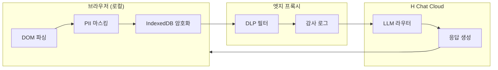
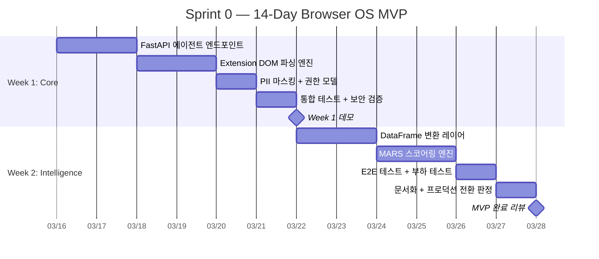
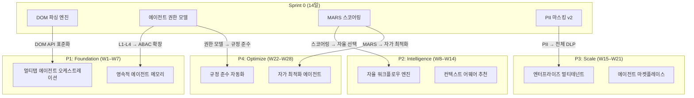

# Browser OS: Enterprise Governance & 14-Day MVP 구현 설계

> Worker D — Zero Trust 거버넌스 + Sprint 0 MVP 상세 설계
> H Chat 기존 보안 자산을 확장하여 Browser OS 에이전트 환경에 적용

---

## 1. Zero Trust for Browser OS

### 1.1 에이전트 권한 모델 (L1–L4)

기존 RBAC/JWT/CSP 체계 위에 에이전트 전용 4단계 권한 레벨을 정의한다.

| Level | 명칭 | 허용 범위 | 승인 방식 |
|-------|------|----------|----------|
| **L1** | Observer | DOM 읽기 전용, 네트워크 요청 불가 | 자동 (기본값) |
| **L2** | Interactor | DOM 조작, 동일 출처 API 호출 | 사용자 1회 승인 |
| **L3** | Operator | 교차 출처 API, 파일 업로드/다운로드, 클립보드 | 세션별 명시적 승인 |
| **L4** | Administrator | 확장 프로그램 설정 변경, 외부 서비스 연동 | MFA + 관리자 승인 |

```typescript
// packages/ui/src/schemas/agentPermission.ts
import { z } from 'zod';

export const AgentPermissionLevel = z.enum(['L1', 'L2', 'L3', 'L4']);

export const AgentPermissionSchema = z.object({
  agentId: z.string().uuid(),
  level: AgentPermissionLevel,
  scopes: z.array(z.string()).min(1),
  grantedBy: z.string().uuid(),
  expiresAt: z.string().datetime(),
  mfaVerified: z.boolean().default(false),
});

export type AgentPermission = z.infer<typeof AgentPermissionSchema>;
```

### 1.2 JWT 확장 — 에이전트 클레임

기존 HMAC-SHA256 JWT에 에이전트 전용 클레임을 추가한다.

```typescript
interface AgentJWTPayload {
  sub: string;           // 사용자 ID
  agent_id: string;      // 에이전트 인스턴스 ID
  perm_level: 'L1' | 'L2' | 'L3' | 'L4';
  scopes: string[];      // ['dom:read', 'api:same-origin', ...]
  session_hash: string;  // 세션 바인딩 (탈취 방지)
  iat: number;
  exp: number;           // L1/L2: 1h, L3: 30m, L4: 15m
}
```

### 1.3 CSP 확장 — 에이전트 샌드박스

기존 7개 보안 헤더 + CSP nonce 체계에 에이전트 실행 컨텍스트를 격리한다.

```
Content-Security-Policy:
  script-src 'nonce-{random}' 'strict-dynamic';
  connect-src 'self' https://api.hchat.ai;
  sandbox allow-scripts allow-same-origin;
  trusted-types agent-policy;
```

에이전트 DOM 조작은 `Trusted Types` 정책을 통해 XSS를 원천 차단한다.

---

## 2. 데이터 주권 — 에이전트 데이터 흐름 통제

### 2.1 데이터 분류 및 흐름 제어



### 2.2 PII 마스킹 강화

기존 7패턴(이메일, 전화, 주민번호 등)에 에이전트 맥락 패턴을 추가한다.

```typescript
// 기존 PII 패턴 확장
const AGENT_PII_PATTERNS = [
  // 기존 7패턴 유지
  { name: 'dom_credential', regex: /(?:password|secret|token)\s*[:=]\s*["'][^"']+["']/gi },
  { name: 'dom_api_key', regex: /(?:api[_-]?key|authorization)\s*[:=]\s*["'][^"']+["']/gi },
  { name: 'cookie_value', regex: /document\.cookie/gi },
  { name: 'storage_access', regex: /localStorage\.getItem\(['"][^'"]*(?:token|auth|session)[^'"]*['"]\)/gi },
] as const;
```

### 2.3 감사 로그 확장

기존 PostgreSQL `audit_logs` 테이블에 에이전트 활동 컬럼을 추가한다.

```sql
-- docker/migrations/004_agent_audit.sql
ALTER TABLE audit_logs
  ADD COLUMN agent_id UUID,
  ADD COLUMN perm_level VARCHAR(2),
  ADD COLUMN dom_target TEXT,
  ADD COLUMN data_classification VARCHAR(20) DEFAULT 'internal';

CREATE INDEX idx_audit_agent ON audit_logs(agent_id, created_at DESC);

-- 보존 정책: 90일 핫, 2년 콜드 (S3 아카이브)
```

---

## 3. 14-Day MVP 상세 일정

### 3.1 Gantt 차트



### 3.2 일별 산출물

| Day | 산출물 | 담당 | 검증 기준 |
|-----|--------|------|----------|
| **1** | FastAPI `/agent/execute` 엔드포인트, Zod 요청 스키마 | Backend | curl 200 OK, 스키마 검증 통과 |
| **2** | 에이전트 JWT 발급/검증, L1–L4 미들웨어 | Backend | 권한별 403/200 분기 테스트 |
| **3** | Chrome Extension content script, DOM 선택기 엔진 | Frontend | 5개 타겟 사이트에서 DOM 추출 성공 |
| **4** | DOM → 정규화 JSON 변환, Trusted Types 적용 | Frontend | XSS 벡터 0건 (CSP 위반 로그 확인) |
| **5** | PII 마스킹 레이어 (기존 7 + 신규 4패턴) | Full-stack | 11개 패턴 정규식 테스트 100% 통과 |
| **6** | 통합 테스트 (Extension → FastAPI → Redis 캐시) | QA | 왕복 레이턴시 < 500ms, 에러율 < 1% |
| **7** | **Week 1 데모** — 실시간 DOM 파싱 + PII 마스킹 시연 | 전체 | 스테이크홀더 승인 |
| **8** | DOM JSON → pandas DataFrame 변환 파이프라인 | Backend | 10개 HTML 테이블 → DataFrame 변환 정확도 95%+ |
| **9** | DataFrame 캐싱 (Redis), 증분 업데이트 로직 | Backend | 캐시 히트율 > 80%, TTL 정책 검증 |
| **10** | MARS 스코어링 (Model, Action, Risk, Scope) 엔진 | Backend | 스코어링 일관성 테스트 통과 |
| **11** | MARS 기반 자동 에이전트 선택 + 폴백 로직 | Full-stack | 86개 모델 중 최적 모델 선택 검증 |
| **12** | E2E 테스트 (Playwright 5개 시나리오), k6 부하 | QA | E2E 100% 통과, p95 < 2s |
| **13** | 감사 로그 대시보드, 운영 문서, 롤백 플레이북 | DevOps | 로그 조회 < 3s, 롤백 RTO < 10min |
| **14** | **MVP 완료 리뷰** — Go/No-Go 판정 | 전체 | 아래 KPI 충족 여부 |

### 3.3 기술 구현 핵심

**FastAPI 에이전트 엔드포인트 (Day 1–2)**

```python
# apps/ai-core/routers/agent.py
from fastapi import APIRouter, Depends, HTTPException
from pydantic import BaseModel, Field
from enum import Enum

class PermLevel(str, Enum):
    L1 = "L1"
    L2 = "L2"
    L3 = "L3"
    L4 = "L4"

class AgentRequest(BaseModel):
    agent_id: str = Field(..., pattern=r'^[0-9a-f-]{36}$')
    action: str = Field(..., max_length=100)
    dom_target: str | None = Field(None, max_length=500)
    perm_level: PermLevel = PermLevel.L1

router = APIRouter(prefix="/agent", tags=["agent"])

@router.post("/execute")
async def execute_agent(
    req: AgentRequest,
    user=Depends(verify_agent_jwt),
):
    if req.perm_level.value > user["perm_level"]:
        raise HTTPException(403, "Insufficient permission level")
    result = await agent_orchestrator.run(req)
    await audit_logger.log_agent_action(user, req, result)
    return {"success": True, "data": result}
```

**DOM 파싱 엔진 (Day 3–4)**

```typescript
// apps/extension/src/content/domParser.ts
interface ParsedElement {
  selector: string;
  tagName: string;
  text: string;
  attributes: Record<string, string>;
  children: ParsedElement[];
}

function parseDOMSafe(root: Element, depth = 0): ParsedElement | null {
  if (depth > 10) return null; // 재귀 깊이 제한

  const sanitized = sanitizeAttributes(root);
  return {
    selector: generateUniqueSelector(root),
    tagName: root.tagName.toLowerCase(),
    text: root.textContent?.slice(0, 1000) ?? '',
    attributes: sanitized,
    children: Array.from(root.children)
      .slice(0, 50) // 자식 노드 제한
      .map(c => parseDOMSafe(c, depth + 1))
      .filter(Boolean) as ParsedElement[],
  };
}
```

---

## 4. Sprint 0 → 28주 블루프린트 연결

### 4.1 MVP 산출물의 Phase 흐름



### 4.2 투트랙 전략 구현

| 트랙 | 목표 | Sprint 0 기여 |
|------|------|--------------|
| **트랙 A**: 기존 시스템 무수정 ROI | 2주 내 가시적 비즈니스 가치 | Extension + DOM 파싱으로 기존 웹앱 위에 에이전트 오버레이 |
| **트랙 B**: 장기 플랫폼 구축 | 28주 Browser OS 완성 | MVP 아키텍처가 P1 Foundation의 골격 역할 |

MVP 결과물은 독립 모듈로 설계하여, 실패 시 롤백 비용을 최소화하고 성공 시 P1에 직접 통합한다.

---

## 5. KPI 및 성공 기준

### 5.1 MVP 완료 판정 기준 (Day 14)

| 카테고리 | 지표 | 목표 | 측정 방법 |
|---------|------|------|----------|
| **기능** | DOM 파싱 정확도 | >= 95% | 10개 타겟 사이트 자동 테스트 |
| **기능** | PII 마스킹 누락률 | 0% | 11개 패턴 퍼징 테스트 |
| **성능** | 에이전트 응답 p95 | < 2s | k6 부하 테스트 |
| **성능** | Extension 메모리 | < 50MB | Chrome DevTools 프로파일링 |
| **보안** | CSP 위반 건수 | 0건 | Report-URI 수집 |
| **보안** | 권한 에스컬레이션 | 0건 | 감사 로그 분석 |
| **품질** | 단위 테스트 커버리지 | >= 80% | Vitest coverage |
| **품질** | E2E 시나리오 통과율 | 100% | Playwright 5개 시나리오 |

### 5.2 프로덕션 전환 기준 (Go/No-Go)

**Go 조건** (모두 충족 시):

- [ ] MVP 판정 기준 8개 항목 전체 통과
- [ ] 보안 리뷰어 승인 (CRITICAL/HIGH 이슈 0건)
- [ ] 스테이크홀더 데모 승인
- [ ] 롤백 플레이북 검증 완료 (RTO < 10분)
- [ ] 모니터링 대시보드 운영 준비 완료

**No-Go 시 대응**:

1. 실패 항목 분류 (기능/성능/보안)
2. 최대 3일 추가 스프린트로 보완
3. 보완 후에도 미달 시 아키텍처 피벗 결정

### 5.3 프로덕션 후 추적 지표

| 지표 | 1주차 목표 | 4주차 목표 | 측정 |
|------|-----------|-----------|------|
| DAU (에이전트 활성 사용자) | 50명 | 200명 | 감사 로그 집계 |
| 에이전트 작업 성공률 | >= 90% | >= 95% | MARS 스코어 분석 |
| 평균 작업 시간 절감 | 30% | 50% | Before/After 비교 |
| 보안 인시던트 | 0건 | 0건 | SIEM 알림 |
| 사용자 NPS | >= 30 | >= 50 | 인앱 서베이 |

---

## 부록: 기존 자산 매핑

| 기존 자산 | MVP 활용 방식 |
|----------|--------------|
| 7 Security Headers + CSP nonce | 에이전트 샌드박스 CSP 확장 |
| HMAC-SHA256 JWT | 에이전트 클레임 추가 (`agent_id`, `perm_level`) |
| Zod 9 schema files | `AgentPermissionSchema`, `AgentRequestSchema` 추가 |
| PII 7패턴 | DOM 맥락 4패턴 추가 (총 11패턴) |
| Blocklist 20+6 | 에이전트 접근 금지 도메인 확장 |
| RBAC + SSO | L1–L4 에이전트 권한과 매핑 |
| PostgreSQL audit_logs | `agent_id`, `perm_level`, `dom_target` 컬럼 추가 |
| Redis 7 | DataFrame 캐싱, 에이전트 세션 스토어 |
| Vitest 5,997 tests | MVP 신규 테스트 ~200건 추가 목표 |
| Playwright E2E 21 files | 에이전트 E2E 5개 시나리오 추가 |
| Docker Compose | ai-core에 에이전트 라우터 추가 배포 |
