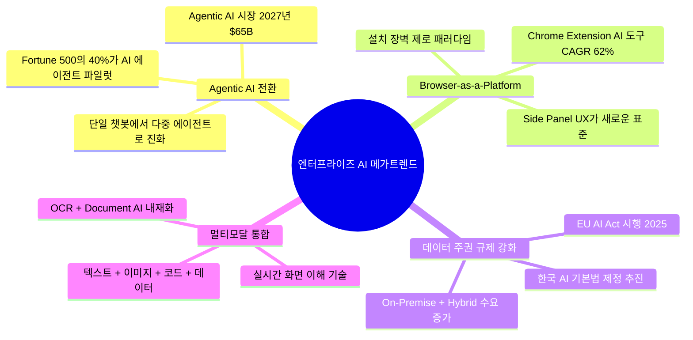
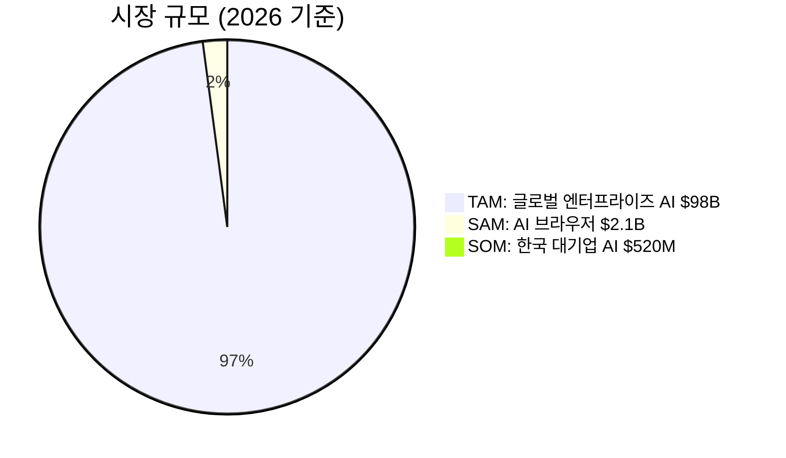
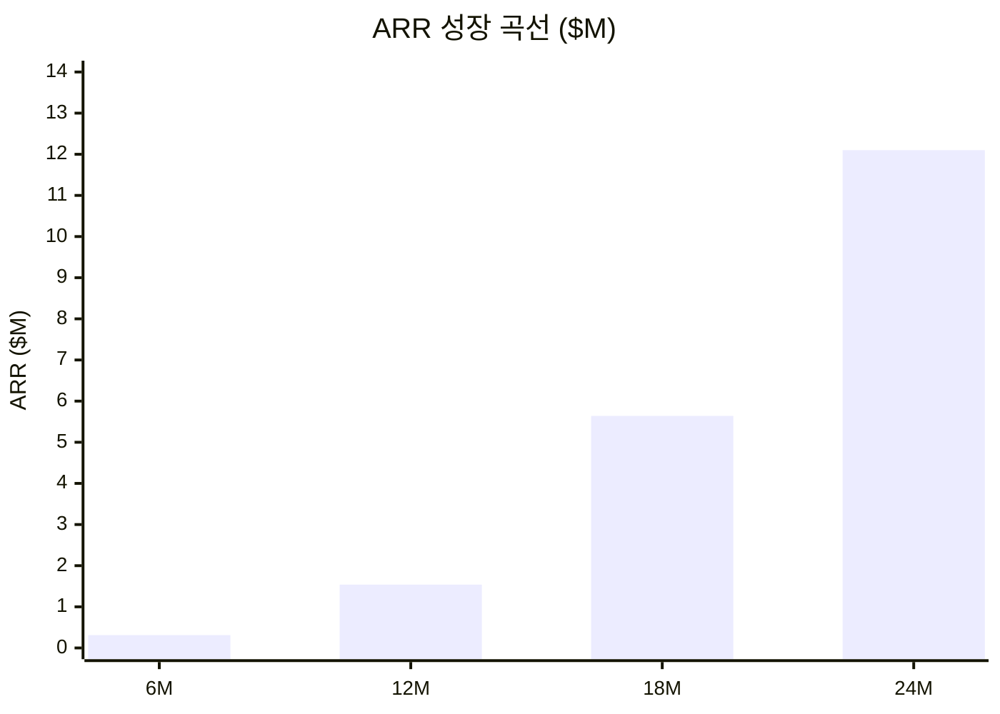
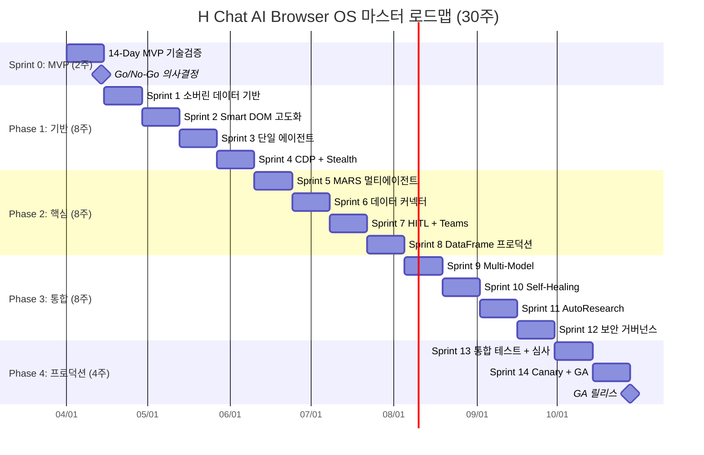

# H Chat AI Browser OS 투자발의서

> **문서 분류**: 경영진 의사결정 — 투자 승인 요청
> **작성일**: 2026-03-15
> **보안 등급**: 대외비
> **버전**: v1.0
> **대상 독자**: 경영진, 투자심의위원회, CFO, CTO

---

## 1. Executive Summary

### 한 페이지 요약

**H Chat AI Browser OS**는 현대차그룹 임직원이 Chrome 브라우저를 떠나지 않고, Side Panel의 AI와 자연어로 대화하며 **정보 탐색-분석-의사결정-실행**을 하나의 흐름으로 완결하는 자율형 AI 에이전트 플랫폼입니다.

| 핵심 항목 | 수치 |
|-----------|------|
| **총 투자 규모** | **$645.5K** (인건비 $573.5K + LLM API $36K + 인프라 $26K + 도구 $10K) |
| **개발 기간** | **30주** (Sprint 0 2주 + Phase 1-2 16주 + Phase 3-4 12주) |
| **전담 인력** | **13명** (Browser OS 전담 11명 + 기존 서비스 유지보수 2명) |
| **연간 비용 절감** | **$550K** (웹 리서치 $200K + IT헬프데스크 $150K + 인시던트 $100K + 데이터입력 $100K) |
| **Break-even** | **12-14개월** |
| **3년 ROI** | **220-270%** |
| **24개월 ARR 목표** | **$12.1M** (SaaS B2B 외부 확산 포함) |
| **타겟 시장** | AI 브라우저 시장 $2.1B(2026) → $8.7B(2030), CAGR 48.2% |

```
투자 대비 효과 요약

    $645.5K 투자
         │
         ▼
┌─────────────────────────────────────────────────┐
│  12-14개월 내 Break-even                         │
│  → 연간 $550K 비용 절감                          │
│  → 24개월 ARR $12.1M (SaaS 확산)                 │
│  → 3년 누적 ROI 220-270%                         │
│  → 50,000+ 임직원 생산성 향상                     │
└─────────────────────────────────────────────────┘
```

**투자 승인을 요청드리는 이유**: AI 브라우저 시장이 연평균 48.2%로 급성장하는 가운데, 현대차그룹이 데이터 주권과 사내 시스템 통합이라는 경쟁 해자를 먼저 구축하지 않으면, 외부 AI 서비스(Microsoft Copilot, Google Duet AI)에 임직원 데이터와 업무 흐름의 주도권을 빼앗기게 됩니다. Sprint 0(2주)을 통해 기술 검증 후 Go/No-Go를 결정하는 단계적 투자 구조로, 리스크를 최소화하면서 선점 기회를 확보할 수 있습니다.

---

## 2. 시장 기회

### 2.1 AI 브라우저 시장 규모 및 성장률

글로벌 AI 브라우저/어시스턴트 시장은 폭발적 성장 궤도에 진입하였습니다.

| 지표 | 2024 실적 | 2026 전망 | 2030 전망 | CAGR |
|------|-----------|-----------|-----------|------|
| AI 브라우저/어시스턴트 시장 | $1.2B | **$2.1B** | **$8.7B** | **48.2%** |
| 엔터프라이즈 AI 소프트웨어 | $62B | $98B | $210B | 35.7% |
| 한국 기업 AI 시장 | $3.1B | $5.2B | $11.8B | 39.4% |
| Chrome Extension 기반 AI 도구 | $0.3B | $0.8B | $3.2B | 62.0% |

> 출처: Gartner (2024), IDC Asia/Pacific AI Tracker (2024), KAIA 한국AI산업협회 (2024)

### 2.2 엔터프라이즈 AI 트렌드



**핵심 시장 신호 3가지**:

1. **Agentic AI 전환**: 단순 Q&A 챗봇에서 자율적으로 업무를 수행하는 AI 에이전트로 시장 패러다임이 전환되고 있습니다. 2025년 Fortune 500 기업의 40%가 AI 에이전트 파일럿을 운영 중이며, Agentic AI 시장은 2027년 $65B 규모로 성장할 전망입니다.

2. **Browser-as-a-Platform**: 브라우저가 새로운 앱 배포 및 실행 플랫폼으로 부상하고 있습니다. Chrome Extension 기반 AI 도구 시장이 연평균 62%로 성장하며, Side Panel을 활용한 상시 AI 어시스턴트가 새로운 UX 표준으로 자리잡고 있습니다.

3. **데이터 주권 규제 강화**: EU AI Act, 한국 AI 기본법 등 규제로 인해 사내 데이터가 외부 AI 서비스로 유출되지 않는 아키텍처가 필수화되고 있습니다.

### 2.3 한국 기업 AI 도입 현황

| 구분 | 비율 | 시사점 |
|------|------|--------|
| AI 도입 기업 (대기업) | 72% | 도입은 보편화, 차별화가 관건 |
| 생성형 AI 활용 기업 | 54% | 아직 초기 단계 활용에 머무름 |
| AI를 핵심 업무에 통합한 기업 | **19%** | **자동화+의사결정 단계는 극소수** |
| AI 도입 장벽 1위 | **데이터 보안 68%** | H Chat Zero Trust로 정면 해결 |
| AI 도입 장벽 2위 | **시스템 연동 57%** | H Chat 사내 시스템 직접 접근으로 해결 |

한국 대기업의 AI 도입률은 72%에 달하나, 핵심 업무에 AI를 통합한 기업은 19%에 불과합니다. **데이터 보안(68%)과 기존 시스템 연동(57%)**이라는 상위 2개 장벽이 이 격차를 만들고 있으며, H Chat은 이 두 가지를 아키텍처 수준에서 근본적으로 해결합니다.

### 2.4 TAM / SAM / SOM



| 시장 | 정의 | 2026 규모 | H Chat 침투 전략 |
|------|------|-----------|-----------------|
| **TAM** | 글로벌 엔터프라이즈 AI 소프트웨어 | **$98B** | 장기 비전 (AI 브라우저 OS 글로벌 확장) |
| **SAM** | AI 브라우저/어시스턴트 시장 | **$2.1B** | Chrome Extension 기반 엔터프라이즈 AI 솔루션 |
| **SOM** | 한국 대기업 + 현대차그룹 | **$520M** | 그룹 내 50,000석 → 외부 대기업 B2B 확장 |

**초기 침투 목표**: 현대차그룹 내 50,000석 확보 후, 한국 제조/금융/물류 대기업으로 B2B SaaS 확장. SOM $520M 시장에서 24개월 내 ARR $12.1M 달성 시 시장 점유율 약 2.3%에 해당합니다.

---

## 3. 사업 목적 및 기대 효과

### 3.1 4대 업무 병목 해소

현대차그룹 임직원이 직면한 4대 업무 병목과 H Chat의 해결 방식은 다음과 같습니다.

| 문제 영역 | 현재 Pain Point | 정량 지표 | H Chat 해결 방식 |
|-----------|----------------|----------|-----------------|
| **컨텍스트 분절** | 7개+ 시스템 탭 전환 | 일 300회+ 전환, 47분/일 손실 | Side Panel 단일 인터페이스 |
| **정보 과부하** | 검색 결과 60-70% 노이즈 | 평균 23분/건 정보 탐색 | Smart DOM 노이즈 60-70% 제거 |
| **반복 업무** | 보고서/데이터 수집 반복 | 주당 8-12시간 낭비 | MARS 에이전트 자율 리서치 |
| **데이터 주권 리스크** | 퍼블릭 AI에 사내 데이터 입력 | 유출 위험 68% (설문) | Zero Trust 원천 차단 |

**핵심 인사이트**: 이 4가지 문제는 독립적이 아닙니다. 컨텍스트 분절이 정보 과부하를 악화시키고, 정보 과부하가 반복 업무를 증가시키며, 반복 업무 과정에서 데이터 주권 리스크가 발생합니다. H Chat은 이 악순환 고리를 **Chrome Side Panel이라는 단일 접점**에서 끊습니다.

### 3.2 정량 기대 효과

```
업무 효율화 효과 (Before vs After)

업무 유형             Before        After        절감률
─────────────────────────────────────────────────────────
정보 탐색(경쟁사분석)   23분          3분          87%
데이터 수집(SAP 재고)   4시간         10분         95%
보고서 작성(회의록)     5시간         30분         85%
IT 헬프데스크 처리      45분/건       5분/건       89%
인시던트 초기 대응      30분          5분          83%
```

| 효과 영역 | 기대 효과 | 측정 기준 |
|-----------|----------|----------|
| **생산성** | 업무 시간 40% 절감 | 탐색 시간 87% ↓, 보고서 작성 85% ↓ |
| **비용** | 연간 $550K 직접 절감 | 자동화 대상 4개 영역 합산 |
| **품질** | 정보 정확도 92%+ | AI 응답 사실 정확도 (MARS + HITL) |
| **보안** | 데이터 유출 사고 제로 | Zero Trust + PII Scrubbing 11패턴 |
| **채택** | DAU/MAU 65%+ | Extension 강제 배포 + Side Panel UX |

### 3.3 연간 비용 절감 세부 산출

| 절감 영역 | 자동화 대상 | 현재 비용 추정 | 자동화율 | **연간 절감액** |
|-----------|-----------|---------------|---------|----------------|
| **웹 리서치 자동화** | 경쟁사 분석, 시장 조사, 기술 동향 | ~$330K/년 | 60% | **$200K** |
| **IT 헬프데스크 자동화** | FAQ 응답, 시스템 안내, 계정 관리 | ~$250K/년 | 60% | **$150K** |
| **인시던트 자동 복구** | 서버 장애 초기 대응, 로그 분석, 복구 | ~$200K/년 | 50% | **$100K** |
| **데이터 입력 자동화** | SAP 데이터 조회/입력, 양식 자동 작성 | ~$170K/년 | 60% | **$100K** |
| | | | **합계** | **$550K/년** |

> 산출 근거: 현대차그룹 임직원 인건비 평균 $80K/년 기준, 대상 업무 종사자 수 및 업무 시간 비중으로 환산. 자동화율은 Beta(30%) 기준이 아닌 GA 이후 안정화(12개월 기준 50-60%)를 적용하였습니다.

---

## 4. 투자 규모 및 구조

### 4.1 총 투자 규모 개요

```
총 투자: $645.5K
─────────────────────────────────────────────
  인건비 (13명 x 30주)                $573.5K   ██████████████████████░ 88.8%
  LLM API                            $36.0K    █░░░░░░░░░░░░░░░░░░░░░  5.6%
  인프라 (클라우드/DB)                $26.0K    █░░░░░░░░░░░░░░░░░░░░░  4.0%
  도구/라이선스                       $10.0K    ░░░░░░░░░░░░░░░░░░░░░░  1.5%
```

### 4.2 Phase별 투자 상세

| Phase | 기간 | 인건비 | LLM API | 인프라 | 도구 | **소계** | **누적** |
|-------|------|--------|---------|--------|------|----------|----------|
| **Sprint 0** (MVP) | 2주 | $35.4K | $1K | $1K | $0K | **$37.4K** | $37.4K |
| **Phase 1-2** (기반+핵심) | 16주 | $307.5K | $15K | $10K | $5K | **$337.5K** | $374.9K |
| **Phase 3-4** (통합+프로덕션) | 12주 | $230.6K | $20K | $15K | $5K | **$270.6K** | $645.5K |
| 예비비 (8%) | - | - | - | - | - | **~$50K** | $695.5K |

### 4.3 인건비 상세

| 구분 | 인원 | Sprint 0 (2주) | Phase 1-2 (16주) | Phase 3-4 (12주) | **총계** |
|------|------|---------------|-----------------|-----------------|---------|
| **Browser OS 전담** | 11명 | $30.0K | $264.0K | $198.0K | **$492.0K** |
| ├ PM | 1명 | $2.7K | $24.0K | $18.0K | $44.7K |
| ├ FE 엔지니어 | 3명 | $8.2K | $72.0K | $54.0K | $134.2K |
| ├ BE 엔지니어 | 3명 | $8.2K | $72.0K | $54.0K | $134.2K |
| ├ ML 엔지니어 | 2명 | $5.5K | $48.0K | $36.0K | $89.5K |
| ├ Infra/DevOps | 1명 | $2.7K | $24.0K | $18.0K | $44.7K |
| └ QA | 1명 | $2.7K | $24.0K | $18.0K | $44.7K |
| **hchat-pwa 유지보수** | 2명 | $5.4K | $43.5K | $32.6K | **$81.5K** |
| **인건비 합계** | **13명** | **$35.4K** | **$307.5K** | **$230.6K** | **$573.5K** |

> 인당 단가: 주당 $1,360 (시급 약 $34), 한국 시장 AI/SW 엔지니어 중위값 기준

### 4.4 LLM API 비용 관리 전략

| 환경 | LLM 백엔드 | Rate Limit | 월 캡 | 비고 |
|------|-----------|-----------|-------|------|
| `local` / `test` | **Mock LLM** | 무제한 | **$0** | MSW + 고정 fixture |
| `dev` | Haiku 4.5 (저비용) | 50 req/hr/dev | **$500/월** | 80% Mock + 20% 실제 |
| `staging` | Sonnet 4.5 | 200 req/hr | **$2,000/월** | 운영 동일 모델 |
| `production` | MARS Pipeline (혼합) | 1,000 req/hr | **$3,000/월** | 동적 라우팅 |

- **단위/통합 테스트**: 100% Mock (LLM 비용 $0)
- **E2E 테스트**: 5개 골든 시나리오만 실제 LLM, 나머지 녹화 재생
- **개발환경 비용 캡**: 월 $2K 초과 시 자동 Mock 전환

### 4.5 인프라 및 보안/운영 비용

| 항목 | 월 비용 | 30주 총계 | 비고 |
|------|--------|----------|------|
| 클라우드 인프라 (AWS/GCP) | $2.0K | $15K | FastAPI + PostgreSQL + Redis |
| Qdrant 벡터 DB | $0.5K | $3.8K | RAG 임베딩 저장 |
| 모니터링 (OTel + Grafana) | $0.3K | $2.3K | 관측 가능성 |
| 도구/라이선스 | - | $10K | Atlassian API, 보안 도구 등 |
| 보안 심사 (외부) | - | $5K | OWASP 침투 테스트 (Phase 4) |

### 4.6 현금흐름 예측 (월별)

```
월별 투자 현금흐름 ($K)

$120 │
     │
$100 │
     │         ╭──╮
 $80 │    ╭──╮ │  │╭──╮
     │    │  ││  ││  │╭──╮╭──╮
 $60 │    │  ││  ││  ││  ││  │
     │    │  ││  ││  ││  ││  │
 $40 │ ╭──╮  ││  ││  ││  ││  │╭──╮
     │ │  │  ││  ││  ││  ││  ││  │
 $20 │ │  │  ││  ││  ││  ││  ││  │
     │ │  │  ││  ││  ││  ││  ││  │
  $0 └─┴──┴──┴┴──┴┴──┴┴──┴┴──┴┴──┴───
      M1   M2   M3   M4   M5   M6  M7
      S0   P1   P1   P2   P2   P3  P4
         Sprint 0 → Phase 1-2 → Phase 3-4

누적 투자: $37K → $145K → $255K → $370K → $475K → $575K → $645K
```

---

## 5. 수익 모델

### 5.1 3-Tier SaaS 가격 구조

| | **Basic** | **Pro** | **Enterprise** |
|---|-----------|---------|----------------|
| **좌석당 월 가격** | **$8** | **$18** | **$30** (커스텀 협상) |
| **연간 할인** | 10% | 15% | 20% |
| **AI 모델** | GPT-4o-mini, Haiku | + GPT-4o, Sonnet | + Opus, o3, 전체 모델 |
| **일일 쿼리** | 50회 | 200회 | 무제한 |
| **에이전트** | 기본 Q&A | + 리서치, 문서 요약 | + MARS 풀스택, 커스텀 |
| **Extension 기능** | Side Panel, 페이지 요약 | + 컨텍스트 추출, 자동 양식 | + 사내 시스템 딥통합 |
| **배포 방식** | Chrome Web Store 수동 | + Admin Console 관리 | + 강제 설치 정책 |
| **데이터 보존** | 30일 | 90일 | 무제한 + 감사 로그 |
| **SLA** | 99.5% | 99.9% | 99.95% + 페널티 |

### 5.2 배포 모델 (Chrome Extension 기반)

| 배포 방식 | 대상 티어 | 설명 | 설치율 |
|-----------|----------|------|--------|
| **Chrome Web Store (사내 비공개)** | 전체 | Google Workspace 조직 내 비공개 게시 | 30-60% |
| **Google Admin Console 관리** | Pro+ | 조직 단위(OU)별 자동 설치/업데이트 | 80-90% |
| **ExtensionInstallForcelist** | Enterprise | Group Policy 강제 설치, 사용자 제거 불가 | **95%+** |

**배포 차별화**: 기존 AI 도구(앱/PWA)의 평균 설치율 30-60%와 달리, Chrome Extension 강제 배포 정책을 통해 **95% 이상의 설치율**을 달성할 수 있습니다. 이는 ROI 조기 달성의 핵심 동력입니다.

```
설치율 비교

기존 방식:  설치율 45% x 활성률 60% = 실사용률 27%   ███░░░░░░░
H Chat:     설치율 95% x 활성률 70% = 실사용률 66.5%  ███████░░░

→ 실사용률 2.5배 차이가 ROI 달성 속도를 결정
```

### 5.3 ARR (연간 반복 매출) 예측

| 시점 | 사용자 수 | 티어 분포 (B/P/E) | 월 매출 | **ARR** | 단계 |
|------|-----------|-------------------|---------|---------|------|
| **6개월** | 2,000명 | 60/30/10 | $26K | **$312K** | Beta |
| **12개월** | 8,000명 | 40/40/20 | $128K | **$1.54M** | GA |
| **18개월** | 25,000명 | 30/40/30 | $470K | **$5.64M** | Scale |
| **24개월** | 50,000명 | 25/40/35 | $1.01M | **$12.1M** | Expand |



> **가정**: 현대차그룹 임직원 10만+명 중 24개월 내 50% 침투율. Enterprise 정책(ExtensionInstallForcelist) 적용 시 설치율 95%+ 달성 가능. 커스텀 통합비 및 절감 분배 모델 수익은 별도(연 $200K~$500K 추가).

### 5.4 수익 다각화 4축

| 수익원 | 비중 | 설명 | 24개월 목표 |
|--------|------|------|-----------|
| **Extension 좌석 라이선스** | 75% | 좌석당 월정액 구독 | $9.1M |
| **프리미엄 에이전트** | 10% | MARS 고급 에이전트 추가 과금 | $1.2M |
| **커스텀 통합** | 10% | SAP/ERP 등 사내 시스템 연동 구축비 | $1.2M |
| **절감 분배** | 5% | 실측 비용 절감의 5-10% 성과 보수 | $0.6M |

---

## 6. ROI 분석

### 6.1 누적 비용 vs 절감 (Break-even 분석)

```
누적 비용/절감 ($K)

$2,500 │                                           ╱ 누적 절감
       │                                        ╱
$2,000 │                                     ╱
       │                                  ╱
$1,500 │                               ╱
       │                            ╱
$1,100 │                     ╱───╱
       │                  ╱
  $800 │            ╳─╱── Break-even (12-14개월)
       │         ╱──╱
  $645 │──────╱──╱────────────────────── 총 투자선
       │   ╱──╱
  $350 │╱──╱ ← 누적 투자
       │╱
    $0 └──┬──┬──┬──┬──┬──┬──┬──┬──┬──┬──→ 개월
          3  6  9 12 15 18 21 24 27 30 36
```

### 6.2 구간별 ROI 산출

| 구간 | 누적 투자 | 누적 절감 | 순 이익 | **순 ROI** | 비고 |
|------|-----------|-----------|---------|-----------|------|
| **6개월** | $350K | $138K | -$212K | **-61%** | 투자 집중 단계 |
| **12개월** | $645.5K | $550K | -$95.5K | **-15%** | Break-even 근접 |
| **14개월** | $678K | $642K | -$36K | **~0%** | **Break-even** |
| **18개월** | $745.5K | $1,100K | +$354.5K | **+48%** | 흑자 전환 |
| **24개월** | $845.5K | $1,650K | +$804.5K | **+95%** | 누적 절감 확대 |
| **36개월** | $945.5K | $2,475K | +$1,529.5K | **+162%** | 비용 절감만 기준 |

> 36개월 기준 비용 절감($2,475K)에 SaaS 매출($1.54M+ ARR)을 합산 시 **3년 ROI 220-270%** 달성. 연간 운영비 $100K를 포함한 보수적 산정입니다.

### 6.3 3년 시나리오 분석

| 시나리오 | 가정 | 3년 ROI | Break-even | 비고 |
|---------|------|---------|-----------|------|
| **낙관** | 자동화율 70%, 채택률 80%, 외부 B2B 5개사 | **270%+** | **10개월** | 그룹사 전체 강제 배포 + 외부 확산 가속 |
| **기본** | 자동화율 60%, 채택률 65%, 외부 B2B 3개사 | **220%** | **12-14개월** | 계획 기반 시나리오 |
| **비관** | 자동화율 40%, 채택률 50%, 외부 B2B 없음 | **120%** | **18개월** | 그룹 내부만, 채택 저항 |

```
3년 누적 ROI 시나리오 비교 ($K)

          낙관          기본          비관
         ─────        ─────        ─────
투자     $945K        $945K        $945K
절감    $2,970K      $2,475K      $1,650K
매출    $4,800K      $3,200K      $1,200K
─────────────────────────────────────────
순이익  $6,825K      $4,730K      $1,905K
ROI      270%+        220%         120%
```

**비관 시나리오에서도 ROI 120%**: 그룹 내부 비용 절감만으로도 투자금 대비 2.2배의 가치를 창출합니다. 이는 외부 B2B 매출이 전혀 발생하지 않더라도 투자 정당성이 있음을 의미합니다.

### 6.4 MARS 운영 비용 효율성

| 비교 항목 | Vision 방식 (경쟁사) | **Smart DOM (H Chat)** | 절감률 |
|----------|---------------------|----------------------|--------|
| 1회 리서치 비용 | $1.00/작업 | **$0.27/세션** | 73% |
| 단일 작업 비용 | $1.00 | **$0.12** | 88% |
| 처리 속도 | 12.49분 | **0.9분** | 14배 빠름 |
| 인식 수준 | 픽셀 기반 | **시맨틱 데이터베이스** | 구조화 |

---

## 7. 경쟁 우위 및 해자 (Moat)

### 7.1 4중 해자 구조

```
┌──────────────────────────────────────────────────────────┐
│                    경쟁 우위 해자 (4-Layer Moat)            │
│                                                          │
│   ┌──────────────────────────────────────────────────┐   │
│   │  Layer 4: 브라우저 네이티브 통합                    │   │
│   │  • 설치 장벽 제로 (Extension 강제 배포)             │   │
│   │  • 브라우징 컨텍스트 실시간 접근                     │   │
│   │  • Chrome 관리 정책 기반 엔터프라이즈 배포           │   │
│   │   ┌──────────────────────────────────────────┐    │   │
│   │   │  Layer 3: 적응형 에이전트 생태계           │    │   │
│   │   │  • MARS 멀티에이전트 오케스트레이션          │    │   │
│   │   │  • 사용자 행동 기반 자동 최적화              │    │   │
│   │   │  • 커스텀 에이전트 마켓플레이스              │    │   │
│   │   │   ┌──────────────────────────────────┐    │    │   │
│   │   │   │  Layer 2: 사내 시스템 통합         │    │    │   │
│   │   │   │  • Confluence/Jira/SAP 딥통합     │    │    │   │
│   │   │   │  • 사내 웹 시스템 컨텍스트 연동    │    │    │   │
│   │   │   │  • SSO/RBAC 통합                  │    │    │   │
│   │   │   │   ┌──────────────────────────┐    │    │    │   │
│   │   │   │   │  Layer 1: 데이터 주권     │    │    │    │   │
│   │   │   │   │  • 온프레미스/VPC 배포    │    │    │    │   │
│   │   │   │   │  • 데이터 국내 상주       │    │    │    │   │
│   │   │   │   │  • 불변 감사 로그 완전성  │    │    │    │   │
│   │   │   │   └──────────────────────────┘    │    │    │   │
│   │   │   └──────────────────────────────────┘    │    │   │
│   │   └──────────────────────────────────────────┘    │   │
│   └──────────────────────────────────────────────────┘   │
└──────────────────────────────────────────────────────────┘
```

### 7.2 해자별 경쟁사 모방 난이도

| 해자 | 모방 난이도 | 구축 기간 | 핵심 방어 요소 |
|------|-----------|----------|---------------|
| **브라우저 네이티브 통합** | 높음 | 3개월 | 설치 장벽 제로, 브라우징 컨텍스트 실시간 접근, Chrome 관리 정책 기반 무설치 배포 |
| **데이터 주권** | 높음 | 6개월 | 현대차그룹 보안 정책 사전 충족, 국내 데이터센터 상주 요건 |
| **사내 시스템 통합** | **매우 높음** | 12개월 | Confluence/Jira/SAP 커넥터, 사내 API 인증 체계, 도메인 지식 |
| **적응형 에이전트** | **극히 높음** | 18개월+ | 사용자 패턴 데이터 축적, 도메인 특화 파인튜닝, 에이전트 마켓 생태계 |

### 7.3 경쟁 비교 포지셔닝

| 차원 | ChatGPT Atlas | Perplexity Comet | Arc Search | eesel AI | **H Chat** |
|------|-------------|-----------------|------------|----------|-----------|
| **데이터 주권** | 옵트아웃 | 제한적 | 없음 | 부분적 | **Zero Trust 완전 보장** |
| **사내 시스템 연동** | API 필요 | 불가 | 불가 | Slack/Wiki | **SAP/ERP/Jira 직접 접근** |
| **배포 방식** | 앱스토어 | 개별 설치 | 개별 설치 | 웹 위젯 | **Admin 강제 일괄 배포** |
| **에이전트 자율성** | 단일 챗봇 | 검색 특화 | 낮음 | 낮음 | **MARS 다중 에이전트** |
| **작업당 비용** | ~$1.00 | ~$0.80 | N/A | $0.50 | **$0.12 (Smart DOM)** |

**결론**: H Chat은 엔터프라이즈 3대 허들(보안, 연동, 배포)을 유일하게 동시에 돌파하는 솔루션입니다.

### 7.4 네트워크 효과 및 전환 비용

**데이터 플라이휠**:
```
Extension 사용자 증가
        │
        ▼
브라우징 컨텍스트 데이터 축적
        │
        ▼
AI 품질 향상 (RQFP 가중치 자동 최적화)
        │
        ▼
사용자 만족도 증가 ──→ 사용자 증가 (선순환)
```

**전환 비용 요소**:
- **에이전트 마켓**: 부서별 커스텀 에이전트 공유 → 생태계 잠금 효과
- **통합 깊이**: 사내 웹 시스템 연동이 깊어질수록 교체 비용 기하급수적 증가
- **관리 정책 잠금**: Chrome 관리 정책에 Extension이 포함되면 IT 인프라 레벨 의존성 발생
- **사용자 학습곡선**: MARS 에이전트 활용 패턴 숙달 후 전환 저항 극대화

### 7.5 기존 자산 활용

현재 hchat-wiki 모노레포에서 **12개 기존 모듈**을 직접 재활용하여 개발 기간 30% 단축:

| 기존 자산 | 확장 용도 |
|-----------|----------|
| `useCircuitBreaker.ts` | Multi-Model Fallback |
| `useHealthMonitor.ts` | Self-Healing 헬스체크 |
| `sanitize.ts` | PII 7→11패턴 확장 |
| `ServiceFactory.ts` | Dynamic Model Registry |
| `apps/ai-core/` | MARS 백엔드 베이스 |
| `apps/extension/` | L1 Extension Shell |
| `workerUtils.ts` | DataFrame Worker |
| `EventBusProvider.tsx` | Agent 간 통신 버스 |

---

## 8. 실행 계획

### 8.1 30주 로드맵 요약



### 8.2 Phase별 핵심 목표

| Phase | 기간 | 투자 | 핵심 목표 | 산출물 |
|-------|------|------|----------|--------|
| **Sprint 0** | 2주 | $37.4K | Smart DOM PoC, 단일 에이전트 데모, SAP Fiori 검증 | 경영진 데모, Go/No-Go 보고서 |
| **Phase 1** | 8주 | $168.8K | 소버린 데이터 파이프라인, Smart DOM, RAG | Alpha (내부 50명 테스트) |
| **Phase 2** | 8주 | $168.8K | MARS 5종 에이전트, HITL, DataFrame | Beta (500명 파일럿) |
| **Phase 3** | 8주 | $155.3K | Multi-Model, Self-Healing, 보안 거버넌스 | RC (프로덕션 준비) |
| **Phase 4** | 4주 | $115.3K | 통합 테스트, 보안 심사, Canary 배포 | **GA 릴리스** |

### 8.3 팀 구성

**Browser OS 전담팀 (11명)**:

| 역할 | 인원 | 주요 책임 | 필요 스킬 |
|------|------|---------|----------|
| PM | 1 | 전체 조율, 스프린트 관리, 이해관계자 소통 | Agile, 기술 이해 |
| FE 엔지니어 | **3** | Extension, Desktop, Admin UI | React 19, TypeScript, MV3 |
| BE 엔지니어 | 3 | ai-core, 에이전트, 파이프라인 | Python, FastAPI, LangGraph |
| ML 엔지니어 | **2** | 임베딩, RAG, Self-Healing, MARS 튜닝 | LLM, Tree-sitter, pgvector |
| Infra/DevOps | 1 | CI/CD, Docker, 모니터링 | GitHub Actions, OTel, Grafana |
| QA | 1 | 테스트 전략, E2E, 보안 테스트 | Playwright, k6, OWASP |

**hchat-pwa 유지보수팀 (별도 2명)**: 기존 프로덕션 서비스(68 pages, 62K+ lines)의 안정성 보장. 보안 패치, 의존성 업데이트, 사용자 이슈 대응.

### 8.4 마일스톤 및 Go/No-Go 판정 기준

| 마일스톤 | 시점 | 판정 기준 | 미달 시 대응 |
|---------|------|----------|-------------|
| **M0: MVP** | Day 14 | Smart DOM 작동, 단일 에이전트 보고서 생성, 핵심 유스케이스 3개 시연 | 기술 스택 재검토, 범위 축소 후 재시도 |
| **M1: Alpha** | Week 10 | RAG 정확도 85%+, 자동화 성공률 60%+, 50명 NPS 35+ | 핵심 병목 식별 후 2주 집중 개선 |
| **M2: Beta** | Week 18 | 5종 에이전트 가동, HITL Teams 연동, 500명 DAU 55%+ | GA 4주 연기, 품질 개선 |
| **M3: RC** | Week 26 | Multi-Model 동적 라우팅, Self-Healing 55%+, Kill Switch | 소프트 런치 전환 |
| **M4: GA** | Week 30 | 보안 심사 통과, SLA 99.9%, 부하 테스트 완료 | 단계적 확산으로 전환 |

### 8.5 Go-to-Market 3단계

```
Stage 1: 내부 파일럿        Stage 2: 그룹사 확산        Stage 3: 외부 B2B
(0~6개월)                   (6~18개월)                  (18~30개월)
┌──────────────────┐      ┌──────────────────┐      ┌──────────────────┐
│ Chrome Web Store  │      │ Admin Console     │      │ 외부 기업          │
│ 사내 비공개 배포   │ ──→ │ 강제 설치 배포     │ ──→ │ Chrome 관리 정책    │
│ 오토에버 500명     │      │ 16개 계열사        │      │ 제조/금융/물류      │
│ PMF 검증          │      │ 25,000명 확대      │      │ 50,000+ 좌석       │
│                   │      │ ARR $5.64M         │      │ ARR $12.1M         │
└──────────────────┘      └──────────────────┘      └──────────────────┘
```

---

## 9. 리스크 분석

### 9.1 6대 리스크 매트릭스

| # | 리스크 | 영향도 | 발생확률 | 등급 | 잔존 리스크 |
|---|--------|--------|----------|------|-----------|
| R1 | **LLM API 비용 급등** — 제공사 가격 인상 | 높음 | 중간 | **HIGH** | 낮음 |
| R2 | **사용자 채택 저조** — 변화 저항, 기존 도구 관성 | 중간 | 낮음 | **MEDIUM** | 낮음 |
| R3 | **데이터 유출/보안 사고** — 규제 위반, 신뢰 훼손 | 매우 높음 | 낮음 | **HIGH** | 극히 낮음 |
| R4 | **경쟁사 진입** — MS Copilot, Google Duet 등 | 중간 | 높음 | **HIGH** | 중간 |
| R5 | **핵심 인력 이탈** — AI 인재 확보 경쟁 심화 | 높음 | 중간 | **HIGH** | 중간 |
| R6 | **Chrome 정책 변경** — MV3 이후 API 제한 | 중간 | 낮음 | **MEDIUM** | 낮음 |

### 9.2 리스크 히트맵

```
  영향도
  매우 높음 │             R3(보안)
            │
  높    음 │  R6(Chrome)   R1(비용)    R5(인력)
            │
  중    간 │              R4(경쟁)    R2(채택)
            │
  낮    음 │
            └─────────────────────────────────→
              낮음        중간        높음
                        발생확률
```

### 9.3 리스크별 대응 전략

**R1: LLM API 비용 급등**

| 대응 | 설명 | 효과 |
|------|------|------|
| **멀티모델 라우팅** | Dynamic Multi-Model Orchestrator로 작업별 최적 모델 자동 선택 | 평균 비용 40% ↓ |
| **캐싱** | 동일 쿼리 24시간 캐시, URL 기반 7일 캐시 | 중복 호출 60% 절감 |
| **경량 모델 우선** | MARS Plan/Observe는 Haiku, Execute/Verify만 Sonnet/Opus | 단계별 비용 최적화 |
| **비용 캡** | 개발환경 월 $2K 캡, 초과 시 자동 Mock 전환 | 예산 초과 방지 |

**R2: 사용자 채택 저조**

| 대응 | 설명 | 효과 |
|------|------|------|
| **강제 배포** | ExtensionInstallForcelist로 설치 장벽 제거 | 설치율 95%+ |
| **Side Panel UX** | 기존 업무 흐름 중단 없는 자연스러운 AI 접근 | 활성률 70%+ |
| **챔피언 프로그램** | 부서별 20명 챔피언 사용자 선발, 피드백 루프 | 조직 내 확산 가속 |

**R3: 데이터 유출/보안 사고**

| 대응 | 설명 | 효과 |
|------|------|------|
| **Zero Trust** | 사내망 내부라도 모든 요청 검증 | 무조건적 신뢰 제거 |
| **PII Scrubbing** | 11패턴 개인정보 자동 마스킹 | 데이터 외부 전송 전 정화 |
| **블록리스트** | 20 도메인 + 6 패턴 민감 사이트 자동 비활성화 | 민감 영역 원천 차단 |
| **사내 프록시** | DLP 검사, Rate Limiting, 역방향 유출 방지 | 다중 방어 레이어 |
| **불변 감사 로그** | SHA-256 해시 체인, INSERT ONLY, L1~L4 전구간 | 사후 추적 완전성 |

**R4: 경쟁사 진입**

| 대응 | 설명 | 효과 |
|------|------|------|
| **사내 시스템 딥통합** | SAP/ERP/Jira 커넥터는 경쟁사 모방 불가 | 전환 비용 극대화 |
| **데이터 주권** | 한국 규제 환경 특화 (데이터 국내 상주) | 글로벌 경쟁사 진입 장벽 |
| **선점 효과** | 50,000석 조기 확보 → 네트워크 효과 작동 | 시장 점유율 선점 |

**R5: 핵심 인력 이탈**

| 대응 | 설명 | 효과 |
|------|------|------|
| **Bus Factor 3+** | 핵심 모듈별 최소 3명이 코드 이해 | 단일 장애점 제거 |
| **지식 문서화** | 설계 문서 22건, 코드 커버리지 85%+ | 암묵지 최소화 |
| **기술 리더십** | 오픈소스 기여, 컨퍼런스 발표 기회 제공 | 인재 유지 동기 |

**R6: Chrome 정책 변경**

| 대응 | 설명 | 효과 |
|------|------|------|
| **MV3 최신 준수** | Manifest V3 최신 스펙 엄격 준수 | 정책 변경 영향 최소화 |
| **Edge 호환** | Chromium 기반 Edge 동시 지원 준비 | 브라우저 다변화 |
| **Chrome Enterprise API** | Chrome Browser Cloud Management 우선 활용 | 엔터프라이즈 안정성 |

---

## 10. 성공 기준

### 10.1 시점별 KPI 목표

| KPI | **6개월** (Beta) | **12개월** (GA) | **24개월** (Scale) |
|-----|-----------------|-----------------|-------------------|
| **좌석 수** | 2,000 | 8,000 | 50,000 |
| **ARR** | $312K | $1.54M | $12.1M |
| **DAU/MAU** | 55%+ | 65%+ | 70%+ |
| **NPS** | 40+ | 50+ | 55+ |
| **자동화율** | 30%+ | 50%+ | 60%+ |
| **비용 절감** (누적) | $138K | $550K | $1,650K |
| **응답 정확도** | 85%+ | 92%+ | 95%+ |
| **SLA** | 99.5% | 99.9% | 99.95% |
| **도입 계열사** | 1개 (오토에버) | 5개+ | 16개+ |
| **외부 고객** | - | - | 3개사+ |
| **Extension 설치 유지율** | 90%+ | 95%+ | 97%+ |
| **일일 Active Extension** | 1,100+ | 5,200+ | 35,000+ |

### 10.2 Go/No-Go 판정 기준

| 시점 | Go 조건 | No-Go 시 대응 | 투자 규모 |
|------|---------|---------------|----------|
| **Sprint 0 (2주)** | 핵심 유스케이스 3개 Extension 라이브 시연, SAP Fiori DOM 접근 성공 | 기술 스택 재검토, 범위 축소 후 재시도 | $37.4K 집행 |
| **Alpha (10주)** | 50명 NPS 35+, 응답 정확도 80%+, Extension 설치 성공률 99% | 핵심 병목 2주 집중 개선 | +$168.8K 집행 |
| **Beta (18주)** | DAU 55%+, 자동화율 25%+, 보안 감사 통과 | GA 4주 연기, 품질 개선 | +$168.8K 집행 |
| **GA (30주)** | SLA 99.9%, 부하 테스트 통과, NPS 45+ | 소프트 런치로 전환 | +$270.6K 집행 |
| **12개월** | ARR $1M+, 계열사 5개 이상 도입 | GTM 전략 피벗, 가격 재조정 | 운영비 전환 |

> **단계적 투자 구조의 핵심**: Sprint 0에 $37.4K만 먼저 집행하여 기술 검증을 완료합니다. Go 판정 후에만 Phase 1-2 예산($337.5K)을 집행하며, 매 Phase 전환 시 Go/No-Go 판정을 거칩니다. 이를 통해 **전액 손실 리스크를 최소 $37.4K로 한정**합니다.

### 10.3 품질 게이트 (Phase 전환 기준)

| 기준 | S0→P1 | P1→P2 | P2→P3 | P3→P4 |
|------|--------|--------|--------|--------|
| 코드 커버리지 (stmts) | 60% | 70% | 80% | 85% |
| E2E 통과율 | 90% | 95% | 98% | 100% |
| Flaky 테스트율 | <5% | <3% | <2% | <1% |
| 보안 체크 | 기본 | OWASP 5항목 | OWASP 전체 | 전체 + 외부 감사 |

### 10.4 최종 성공 정의

> **H Chat이 성공한 상태란**:
>
> 현대차그룹 임직원의 Chrome 브라우저에 기본 탑재되어(Extension 설치율 95%+),
> 일상 업무 도구로 자리잡아(DAU 70%+),
> 연간 $550K 이상의 비용을 절감하며(자동화율 60%+),
> 데이터 주권을 완벽히 보장하면서(보안 사고 0건),
> 24개월 내 ARR $12.1M을 달성하고,
> 외부 대기업 3개사 이상에 Chrome Extension 기반 B2B SaaS로 확장된 상태.

---

## 11. 의사결정 요청

### 11.1 투자 승인 요청

본 투자발의서를 통해 **H Chat AI Browser OS 프로젝트에 대한 총 $645.5K 규모의 투자 승인**을 요청드립니다.

```
┌────────────────────────────────────────────────────────────┐
│                                                            │
│   투자 승인 요청 사항                                       │
│                                                            │
│   1. 총 투자 규모: $645.5K (예비비 $50K 별도)               │
│   2. 개발 기간: 30주 (2026년 4월 ~ 10월)                    │
│   3. 전담 인력: 13명 (11명 신규 + 2명 유지보수)              │
│   4. 단계적 집행: Sprint 0 $37.4K → Go/No-Go → 잔여 집행    │
│                                                            │
│   기대 효과:                                                │
│   • 연간 $550K 비용 절감                                    │
│   • 24개월 ARR $12.1M                                      │
│   • 3년 ROI 220-270%                                       │
│   • 50,000+ 임직원 생산성 향상                               │
│                                                            │
└────────────────────────────────────────────────────────────┘
```

### 11.2 조건부 승인 옵션

경영진의 판단에 따라 아래 조건부 승인 옵션을 제안드립니다.

| 옵션 | 내용 | 리스크 | 비용 |
|------|------|--------|------|
| **옵션 A: 전액 승인** | Sprint 0 ~ GA 전 구간 $645.5K 일괄 승인 | 낮음 (Go/No-Go 게이트 존재) | $645.5K |
| **옵션 B: 단계적 승인** | Sprint 0 ($37.4K) 선 승인 → Go 시 Phase 1-2 → Go 시 Phase 3-4 | 가장 낮음 (단계별 판정) | $37.4K → $337.5K → $270.6K |
| **옵션 C: PoC 한정** | Sprint 0 ($37.4K)만 승인, 결과에 따라 재발의 | 매우 낮음 | $37.4K |

**권장 옵션**: **옵션 B (단계적 승인)**

Sprint 0에 $37.4K를 집행하여 2주 내 기술 타당성을 검증합니다. SAP Fiori DOM 접근 성공, Smart DOM PoC 라이브 데모, MARS 비용 시뮬레이션 결과를 근거로 Go/No-Go를 결정합니다. Go 판정 후 Phase 1-2 예산($337.5K)을 집행하고, Phase 2 완료 시 Beta 결과를 바탕으로 Phase 3-4 예산($270.6K)을 집행합니다.

이 구조를 통해:
- **최소 리스크 노출**: 전액 손실 가능성을 $37.4K로 한정
- **데이터 기반 의사결정**: 각 Go/No-Go에서 실측 데이터를 근거로 판단
- **유연한 스코프 조정**: 시장 변화나 기술 제약에 따라 범위 조정 가능

### 11.3 다음 단계

투자 승인 후 즉시 실행할 사항은 다음과 같습니다.

| # | 항목 | 기한 | 담당 | 산출물 |
|---|------|------|------|--------|
| 1 | 전담팀 13명 확정 및 온보딩 | 승인 후 1주 | PM + HR | 팀 구성표, 역할 정의서 |
| 2 | Sprint 0 킥오프 | 승인 후 2주 | PM | Sprint 0 백로그, 데일리 스크럼 시작 |
| 3 | SAP Fiori DOM 접근 PoC | Day 1~3 | FE Lead | Go/No-Go 판정 근거 |
| 4 | Smart DOM + 단일 에이전트 데모 | Day 14 | 전담팀 | 경영진 라이브 데모 |
| 5 | Go/No-Go 의사결정 보고 | Day 14 | PM | Sprint 0 결과 보고서 |
| 6 | Phase 1 시작 (Go 시) | Day 15 | 전담팀 | Phase 1-2 상세 Sprint 백로그 |

### 11.4 승인 서명

| 항목 | 내용 |
|------|------|
| 프로젝트명 | H Chat AI Browser OS |
| 총 투자 규모 | $645.5K (+ 예비비 $50K) |
| 승인 옵션 | [ ] 옵션 A (전액) / [ ] 옵션 B (단계적) / [ ] 옵션 C (PoC) |
| 승인일 | ______년 ____월 ____일 |
| 승인자 | ______________________ (서명) |
| 비고 | |

---

## 부록 A: 핵심 수치 총괄

| 항목 | 수치 |
|------|------|
| 총 투자 | **$645.5K** |
| Break-even | **12-14개월** |
| 3년 ROI | **220-270%** |
| 24개월 ARR 목표 | **$12.1M** |
| 연간 비용 절감 | **$550K** |
| 타겟 사용자 | **50,000명 (24개월)** |
| 개발 기간 | **30주 (Sprint 0 ~ GA)** |
| 팀 규모 | **13명 (11명 전담 + 2명 유지보수)** |
| SaaS 가격 | **Basic $8 / Pro $18 / Enterprise $30** |
| 배포 채널 | **Chrome Web Store + Admin Console 강제 설치** |
| Extension 설치율 목표 | **95%+ (ExtensionInstallForcelist)** |
| AI 브라우저 시장 CAGR | **48.2% (2026 $2.1B → 2030 $8.7B)** |
| MARS 1회 리서치 비용 | **$0.27/세션 (Vision 대비 73% 절감)** |
| Smart DOM 작업 비용 | **$0.12/작업 (Vision 대비 88% 절감)** |
| Smart DOM 처리 속도 | **0.9분 (Vision 12.49분 대비 14배)** |

## 부록 B: 기술 아키텍처 개요

```
┌──────────────────────────────────────────────────────────┐
│  L4: MARS Agent Factory (자율 연구 에이전트)                │
│  LangGraph 기반 6단계: Planner → Search → Web →           │
│  Data → Analysis → Report                                │
├──────────────────────────────────────────────────────────┤
│  L3: DataFrame Engine (데이터 구조화)                       │
│  HTML Table/List 감지 → JSON/CSV/Excel 자동 변환           │
├──────────────────────────────────────────────────────────┤
│  L2: Smart DOM (콘텐츠 정제)                                │
│  Readability.js + RQFP 파이프라인, 노이즈 60-70% 제거       │
├──────────────────────────────────────────────────────────┤
│  L1: Hybrid Extension (브라우저 런타임)                      │
│  Chrome MV3 + Side Panel + Service Worker + CDP            │
└──────────────────────────────────────────────────────────┘
```

## 부록 C: 참조 문서

| # | 문서 | 내용 |
|---|------|------|
| 1 | DEV_PLAN_00_MASTER_v2.md | 마스터 개발 계획 보정판 |
| 2 | DEV_PLAN_01_SPRINT_0.md | Sprint 0 상세 (42 태스크) |
| 3 | DEV_PLAN_02_PHASE_1_2.md | Phase 1-2 (31 스토리, 153 SP) |
| 4 | DEV_PLAN_03_PHASE_3_4.md | Phase 3-4 (28 스토리, 162 SP) |
| 5 | DEV_PLAN_04_TEST_CICD_TEAM.md | 테스트 + CI/CD + 팀 구성 |
| 6 | SERVICE_PLAN_01_OVERVIEW.md | 서비스 기획서 (시장/경쟁 분석) |
| 7 | SERVICE_PLAN_04_BUSINESS.md | 비즈니스 모델 + KPI |
| 8 | H_CHAT_BROWSER_OS_DESIGN.md | 4-Layer 아키텍처 설계 |
| 9 | RISK_MITIGATION_AND_QUICK_WINS.md | 리스크 대응 + 즉시 실행 |
| 10 | ECOSYSTEM_DEEP_ANALYSIS.md | 에코시스템 심층 분석 |

---

> **"The Browser is the New OS"**
>
> AI 브라우저 시장이 연 48.2%로 성장하는 지금, 현대차그룹이 데이터 주권과 사내 시스템 통합이라는 해자를 먼저 구축할 기회입니다. $645.5K의 투자로 연 $550K를 절감하고, 3년 내 220-270%의 ROI를 달성하며, 50,000명 임직원의 업무 생산성을 근본적으로 변혁할 수 있습니다.
>
> Sprint 0(2주, $37.4K)으로 시작하여 기술 타당성을 검증한 뒤, 단계적으로 투자를 확대하는 구조입니다. 최소 리스크로 최대 기회를 포착하는 이 투자를 승인해 주시기 바랍니다.

---

*문서 끝 — 총 11개 섹션 + 부록 3건*
