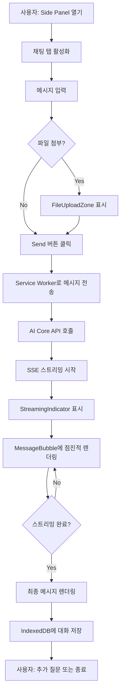
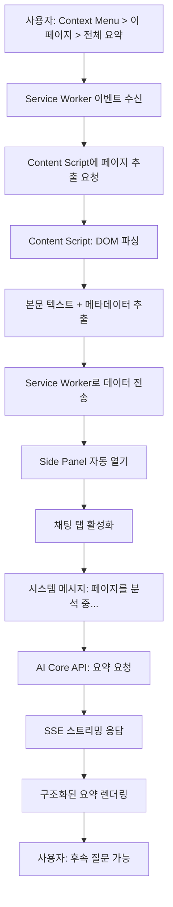
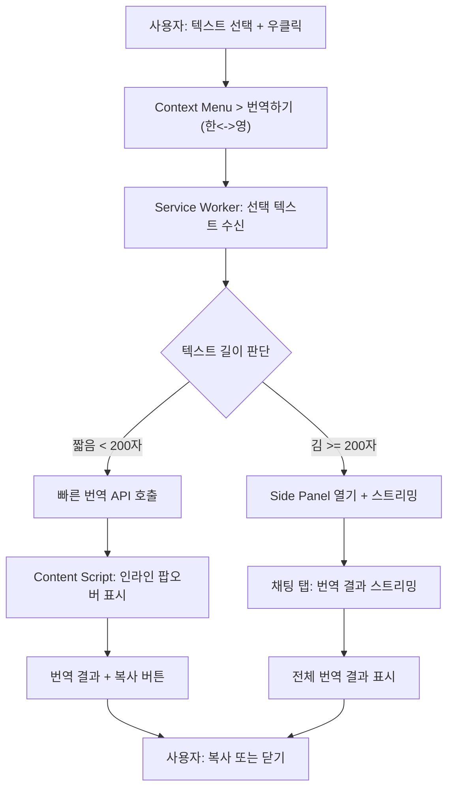
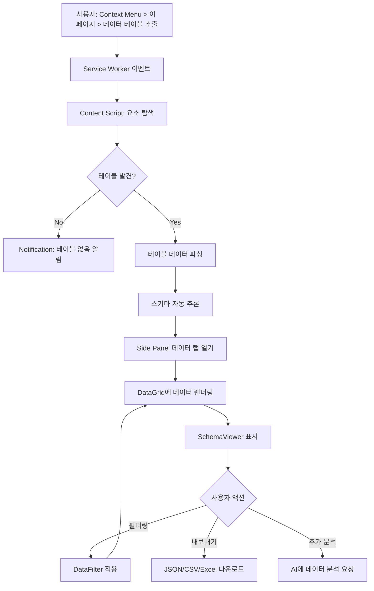
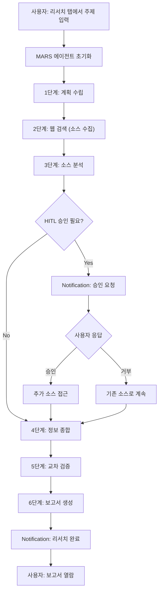
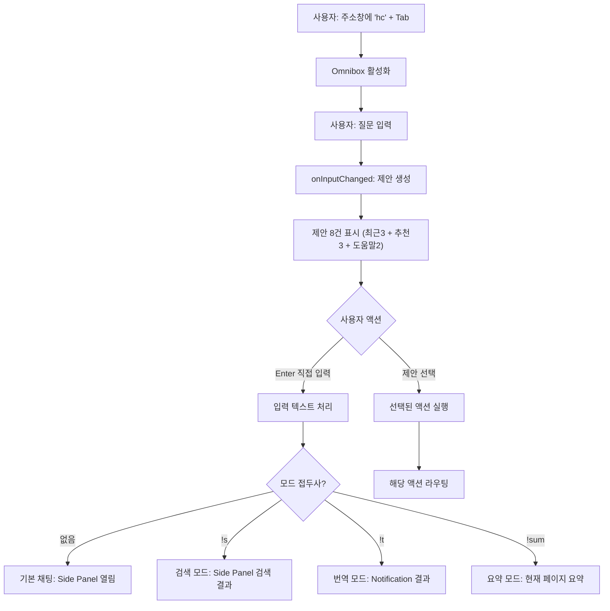
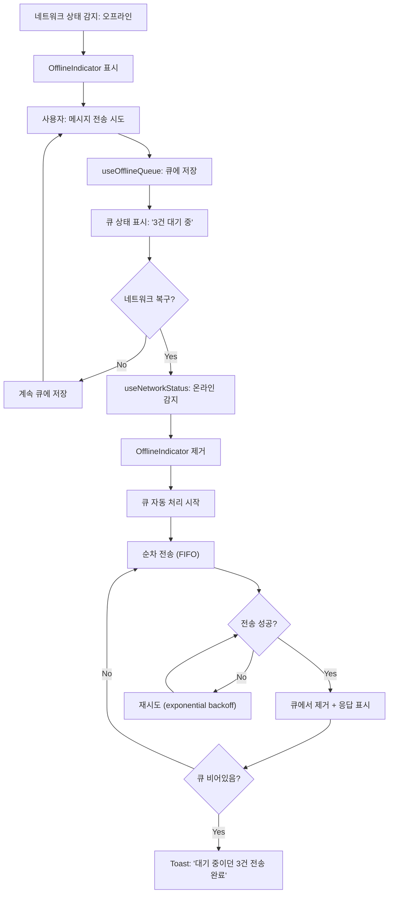
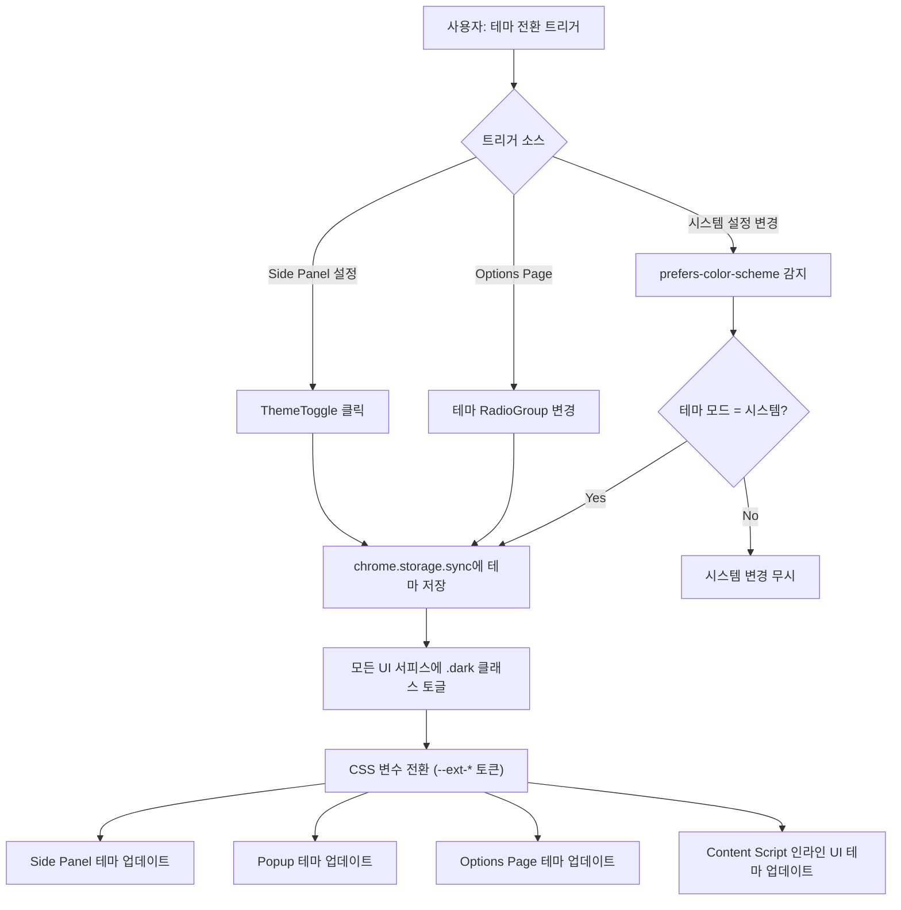

# H Chat AI Chrome Extension -- 화면 설계서

> **문서 버전**: v1.0
> **최종 수정**: 2026-03-15
> **대상**: H Chat AI Chrome Extension (Manifest V3)
> **작성 기준**: Phase 101 모노레포 (`@hchat/extension`)

---

## 목차

1. [Executive Summary](#1-executive-summary)
2. [디자인 시스템](#2-디자인-시스템)
3. [Side Panel 상세 설계](#3-side-panel-상세-설계)
4. [Popup 상세 설계](#4-popup-상세-설계)
5. [Context Menu 상세 설계](#5-context-menu-상세-설계)
6. [Omnibox 상세 설계](#6-omnibox-상세-설계)
7. [Notification 설계](#7-notification-설계)
8. [Options Page 설계](#8-options-page-설계)
9. [인터랙션 흐름](#9-인터랙션-흐름)
10. [반응형/접근성/다크모드](#10-반응형접근성다크모드)
11. [컴포넌트 재사용 매트릭스](#11-컴포넌트-재사용-매트릭스)

---

## 1. Executive Summary

### 1.1 화면 설계 개요

H Chat AI Chrome Extension은 현대자동차그룹 임직원을 위한 생성형 AI 브라우저 도우미로, Chrome의 네이티브 확장 API를 최대한 활용하여 4종의 UI 서피스를 제공한다.

| UI 서피스 | 목적 | 트리거 | 크기 |
|-----------|------|--------|------|
| **Side Panel** | 주 인터페이스 (채팅, 데이터, 리서치, 설정) | 툴바 아이콘 클릭 / Context Menu | 320--600px 너비 |
| **Popup** | 퀵 액션 및 모드 선택 | 툴바 아이콘 클릭 (Side Panel 미지원 시) | 400x600px 고정 |
| **Context Menu** | 우클릭 컨텍스트 액션 | 페이지/선택 텍스트 우클릭 | OS 네이티브 |
| **Omnibox** | 주소창 빠른 명령 | `hc` + Space/Tab | 주소창 드롭다운 |

추가 서피스:

| UI 서피스 | 목적 |
|-----------|------|
| **Notification** | 백그라운드 작업 완료/승인 요청/오류 알림 |
| **Options Page** | 상세 설정 (LLM, 에이전트, 보안, 테마) |

### 1.2 디자인 원칙

```
+-----------------------------------------------------------------------+
|                        H Chat Extension 디자인 원칙                     |
+-----------------------------------------------------------------------+
|                                                                       |
|  1. Context-First       브라우저 컨텍스트를 최대한 활용                   |
|  2. Non-Intrusive       사용자 브라우징을 방해하지 않음                   |
|  3. Progressive         간단 -> 상세로 점진적 정보 노출                  |
|  4. Consistent          @hchat/ui 컴포넌트 재사용으로 일관성 유지         |
|  5. Accessible          WCAG 2.1 AA 준수, 키보드 완전 지원              |
|  6. Performant          Content Script 최소화, 메모리 효율               |
|                                                                       |
+-----------------------------------------------------------------------+
```

### 1.3 전체 아키텍처 개요

```mermaid
flowchart TB
    subgraph Chrome["Chrome Browser"]
        SP["Side Panel<br/>(주 UI)"]
        PU["Popup<br/>(퀵 액션)"]
        CM["Context Menu<br/>(우클릭)"]
        OB["Omnibox<br/>(hc 키워드)"]
        NT["Notification<br/>(알림)"]
        OP["Options Page<br/>(설정)"]
        CS["Content Script<br/>(페이지 주입)"]
        BG["Service Worker<br/>(Background)"]
    end

    SP <--> BG
    PU <--> BG
    CM --> BG
    OB --> BG
    NT <-- BG
    OP <--> BG
    CS <--> BG
    BG <--> API["H Chat AI Core API"]
```

---

## 2. 디자인 시스템

### 2.1 Extension 전용 디자인 토큰

Extension은 `@hchat/tokens`의 전역 토큰 위에 `--ext-*` 접두사 토큰을 오버레이하여 Chrome Extension 환경에 최적화된 스타일을 적용한다.

#### 컬러 팔레트

| 토큰 | Light | Dark | 용도 |
|------|-------|------|------|
| `--ext-bg-primary` | `#ffffff` | `#1a1a2e` | 메인 배경 |
| `--ext-bg-secondary` | `#f8f9fa` | `#16213e` | 보조 배경 (카드, 섹션) |
| `--ext-bg-chat` | `#f0f2f5` | `#0f3460` | 채팅 메시지 배경 |
| `--ext-text-primary` | `#1a1a2e` | `#e8e8e8` | 주 텍스트 |
| `--ext-text-secondary` | `#6c757d` | `#a0a0b0` | 보조 텍스트 |
| `--ext-accent` | `#2563eb` | `#3b82f6` | 강조, 링크, 버튼 |
| `--ext-success` | `#10b981` | `#10b981` | 성공 상태 |
| `--ext-warning` | `#f59e0b` | `#f59e0b` | 경고 상태 |
| `--ext-error` | `#ef4444` | `#ef4444` | 오류 상태 |
| `--ext-border` | `#e5e7eb` | `#2a2a4a` | 테두리 |
| `--ext-radius` | `8px` | `8px` | 기본 라운딩 |
| `--ext-shadow` | `0 2px 8px rgba(0,0,0,0.08)` | `0 2px 8px rgba(0,0,0,0.32)` | 기본 그림자 |

#### 상태 컬러

| 상태 | 컬러 | 배경 (10% opacity) | 용도 |
|------|-------|---------------------|------|
| Info | `#2563eb` | `#2563eb1a` | 일반 알림, 안내 |
| Success | `#10b981` | `#10b9811a` | 완료, 성공 |
| Warning | `#f59e0b` | `#f59e0b1a` | 주의, 대기 |
| Error | `#ef4444` | `#ef44441a` | 오류, 실패 |

### 2.2 타이포그래피

| 레벨 | 크기 | 두께 | 행간 | 용도 |
|------|------|------|------|------|
| H1 | 20px | 700 | 1.3 | Side Panel 제목 |
| H2 | 16px | 600 | 1.4 | 섹션 제목 |
| H3 | 14px | 600 | 1.4 | 카드 제목 |
| Body | 14px | 400 | 1.5 | 본문 텍스트 |
| Body-sm | 12px | 400 | 1.5 | 보조 텍스트, 타임스탬프 |
| Caption | 11px | 400 | 1.4 | 레이블, 힌트 |
| Code | 13px (mono) | 400 | 1.6 | 코드 블록 |

**폰트 스택**: `'Pretendard', -apple-system, BlinkMacSystemFont, 'Segoe UI', sans-serif`
**코드 폰트**: `'JetBrains Mono', 'Fira Code', 'Consolas', monospace`

### 2.3 아이콘 시스템

Lucide Icons (트리셰이킹 지원, 24x24 기본 크기)를 사용한다.

| 카테고리 | 아이콘 | 사용처 |
|----------|--------|--------|
| 내비게이션 | `MessageSquare`, `Database`, `Search`, `Settings` | Side Panel 탭 |
| 액션 | `Send`, `Paperclip`, `Mic`, `Copy`, `Download` | 채팅 입력, 메시지 액션 |
| 상태 | `CheckCircle`, `AlertTriangle`, `XCircle`, `Loader` | 상태 표시 |
| 모드 | `Bot`, `FileText`, `Globe`, `Zap` | 모드 선택기 |
| 데이터 | `Table`, `FileJson`, `FileSpreadsheet` | 데이터 내보내기 |

### 2.4 간격 체계

| 토큰 | 값 | 용도 |
|------|-----|------|
| `--ext-space-xs` | 4px | 인라인 간격 |
| `--ext-space-sm` | 8px | 컴포넌트 내부 간격 |
| `--ext-space-md` | 12px | 컴포넌트 간 간격 |
| `--ext-space-lg` | 16px | 섹션 간격 |
| `--ext-space-xl` | 24px | 영역 간격 |
| `--ext-space-2xl` | 32px | 페이지 패딩 |

---

## 3. Side Panel 상세 설계

Side Panel은 Extension의 주 UI로, 4개의 탭(채팅/데이터/리서치/설정)으로 구성된다.

### 3.1 전체 레이아웃

```
+------------------------------------------+
|  Side Panel (320-600px)                  |
+------------------------------------------+
| [Logo] H Chat AI        [_][Theme][...] |  <- 헤더 (48px)
+------------------------------------------+
| [Chat] [Data] [Research] [Settings]      |  <- 탭 바 (40px)
+==========================================+
|                                          |
|          (탭 콘텐츠 영역)                  |
|          flex-1, overflow-y              |
|                                          |
+==========================================+
|  (탭별 하단 영역 -- 채팅 입력 등)           |  <- 하단 (가변)
+------------------------------------------+
```

**크기 사양**:
- 최소 너비: 320px
- 기본 너비: 400px
- 최대 너비: 600px (사용자 드래그 리사이즈)
- 높이: 브라우저 뷰포트 높이 전체

### 3.2 채팅 탭

#### ASCII 와이어프레임

```
+------------------------------------------+
| [<] 새 대화          [GPT-4o  v] [|||]   |
+------------------------------------------+
| +--------------------------------------+ |
| | [Q] 대화 검색...                      | |
| +--------------------------------------+ |
| | > 이전 대화 1              3분 전     | |
| | > 이전 대화 2              1시간 전   | |
| | > 이전 대화 3              어제       | |
| +--------------------------------------+ |
|                                          |
|   +----------------------------------+   |
|   | [User Avatar]                    |   |
|   | 현재 페이지의 주요 내용을          |   |
|   | 요약해 주세요.                    |   |
|   |                       14:32  [v] |   |
|   +----------------------------------+   |
|                                          |
|   +----------------------------------+   |
|   | [AI Avatar]                      |   |
|   | ## 페이지 요약                    |   |
|   |                                  |   |
|   | 이 페이지는 **H Chat AI**의       |   |
|   | 주요 기능을 소개하며...            |   |
|   |                                  |   |
|   | - 포인트 1                       |   |
|   | - 포인트 2                       |   |
|   | - 포인트 3                       |   |
|   |                                  |   |
|   | [Copy] [Regenerate]    14:33     |   |
|   +----------------------------------+   |
|                                          |
|   +----------------------------------+   |
|   | [AI]  ...typing                  |   |
|   | [||||||||          ] 스트리밍 중   |   |
|   +----------------------------------+   |
|                                          |
+------------------------------------------+
| +--------------------------------------+ |
| | 메시지를 입력하세요...         [Clip] | |
| |                          [Mic][Send] | |
| +--------------------------------------+ |
+------------------------------------------+
```

#### 컴포넌트 트리

```
SidePanelChatTab
├── ChatHeader
│   ├── BackButton
│   ├── ConversationTitle (editable)
│   ├── ModelSelector (dropdown: GPT-4o, Claude, Gemini...)
│   └── ChatSidebarToggle
├── ChatSidebar (collapsible overlay)
│   ├── ChatSearchBar
│   ├── ConversationList
│   │   └── ConversationItem[] (title, timestamp, preview)
│   └── NewChatButton
├── MessageList (virtualized scroll)
│   ├── MessageBubble (user)
│   │   ├── Avatar
│   │   ├── MessageContent (plain text)
│   │   ├── Timestamp
│   │   └── MessageActions [Edit, Delete]
│   ├── MessageBubble (assistant)
│   │   ├── Avatar
│   │   ├── MarkdownRenderer (code blocks, tables, lists)
│   │   ├── Timestamp
│   │   └── MessageActions [Copy, Regenerate, Share]
│   └── StreamingIndicator (typing animation + progress)
├── ChatInput
│   ├── TextArea (auto-resize, max 6 lines)
│   ├── FileUploadZone (drag & drop, click)
│   ├── VoiceInputButton (Web Speech API)
│   └── SendButton (disabled when empty)
└── ContextBanner (optional: "현재 페이지 컨텍스트 포함")
```

#### 상태 관리

| 상태 | 타입 | 설명 |
|------|------|------|
| `conversations` | `Conversation[]` | 대화 목록 (IndexedDB 저장) |
| `activeConversationId` | `string \| null` | 현재 활성 대화 |
| `messages` | `Message[]` | 현재 대화의 메시지 |
| `isStreaming` | `boolean` | SSE 스트리밍 진행 중 |
| `selectedModel` | `string` | 선택된 LLM 모델 ID |
| `pageContext` | `PageContext \| null` | 현재 페이지 메타데이터 |

### 3.3 데이터 탭

#### ASCII 와이어프레임

```
+------------------------------------------+
| 데이터 추출 결과                [Refresh] |
+------------------------------------------+
| 소스: https://example.com/report         |
| 추출 시간: 2026-03-15 14:35             |
+------------------------------------------+
| +--------------------------------------+ |
| | 스키마 뷰어                    [접기] | |
| | ┌─ name: string                      | |
| | ├─ age: number                       | |
| | ├─ department: string                | |
| | └─ salary: number                    | |
| +--------------------------------------+ |
|                                          |
| 필터: [컬럼 선택 v] [조건 v] [값...]    |
|        [+ 필터 추가]      [필터 초기화]  |
|                                          |
| +--------------------------------------+ |
| | # | name   | age | dept   | salary  | |
| +---+--------+-----+--------+---------+ |
| | 1 | 김철수 | 35  | 개발   | 5,500   | |
| | 2 | 이영희 | 28  | 디자인 | 4,800   | |
| | 3 | 박민수 | 42  | 기획   | 6,200   | |
| | 4 | 최지은 | 31  | 개발   | 5,100   | |
| | 5 | 정수진 | 37  | 마케팅 | 5,300   | |
| +--------------------------------------+ |
| << 1 2 3 ... 12 >>     50건 / 페이지   |
|                                          |
+------------------------------------------+
| [JSON] [CSV] [Excel]     [Side Panel 닫기] |
+------------------------------------------+
```

#### 컴포넌트 트리

```
SidePanelDataTab
├── DataHeader
│   ├── Title ("데이터 추출 결과")
│   ├── SourceURL (truncated, tooltip for full)
│   ├── ExtractionTimestamp
│   └── RefreshButton
├── SchemaViewer (collapsible)
│   └── SchemaTree
│       └── SchemaField[] (name, type, icon)
├── DataFilter
│   ├── ColumnSelect
│   ├── ConditionSelect (=, !=, >, <, contains)
│   ├── ValueInput
│   ├── AddFilterButton
│   └── ResetFilterButton
├── DataGrid (virtualized)
│   ├── DataGridHeader (sortable columns)
│   ├── DataGridRow[]
│   │   └── DataGridCell[] (type-aware rendering)
│   └── DataGridFooter
│       └── Pagination
├── ExportBar
│   ├── ExportButton (JSON)
│   ├── ExportButton (CSV)
│   └── ExportButton (Excel)
└── EmptyState (when no data extracted)
```

### 3.4 리서치 탭

#### ASCII 와이어프레임

```
+------------------------------------------+
| MARS 자율 리서치                         |
+------------------------------------------+
| 주제: "전기차 배터리 기술 동향 2026"       |
+------------------------------------------+
|                                          |
| 진행 상태:                               |
| [1.계획] [2.검색] [3.분석] [4.종합]      |
| [5.검증] [6.보고서]                      |
|  (v)      (v)      (>>)    ( )           |
|  완료     완료     진행중   대기           |
|                                          |
| +--------------------------------------+ |
| | 현재 단계: 3. 분석                    | |
| | 진행률: ████████████░░░░░░ 67%        | |
| |                                      | |
| | 수집 소스: 24건                       | |
| | 분석 완료: 16/24건                    | |
| | 핵심 인사이트: 8건 추출               | |
| +--------------------------------------+ |
|                                          |
| +--------------------------------------+ |
| | HITL 승인 요청                       | |
| |                                      | |
| | "배터리 재활용 시장 규모" 데이터에     | |
| | 외부 소스 접근이 필요합니다.           | |
| |                                      | |
| | [승인] [거부] [세부사항 보기]          | |
| +--------------------------------------+ |
|                                          |
| +--------------------------------------+ |
| | 보고서 미리보기                 [접기] | |
| | ## 1. 서론                           | |
| | 전기차 배터리 기술은 2025년...        | |
| |                                      | |
| | ## 2. 주요 트렌드                    | |
| | ...                                  | |
| +--------------------------------------+ |
|                                          |
+------------------------------------------+
| [중단] [일시정지]    [전체 보고서 보기]   |
+------------------------------------------+
```

#### 컴포넌트 트리

```
SidePanelResearchTab
├── ResearchHeader
│   ├── Title ("MARS 자율 리서치")
│   └── TopicBadge (연구 주제)
├── ResearchProgress
│   ├── Stepper (6단계)
│   │   ├── Step ("계획", status: complete/active/pending)
│   │   ├── Step ("검색")
│   │   ├── Step ("분석")
│   │   ├── Step ("종합")
│   │   ├── Step ("검증")
│   │   └── Step ("보고서")
│   └── ProgressBar (현재 단계 내 진행률)
├── ResearchMetrics
│   ├── MetricCard ("수집 소스", count)
│   ├── MetricCard ("분석 완료", progress)
│   └── MetricCard ("핵심 인사이트", count)
├── HITLApproval (conditional)
│   ├── ApprovalDescription
│   ├── ApproveButton
│   ├── RejectButton
│   └── DetailButton
├── ReportPreview (collapsible)
│   └── MarkdownRenderer
└── ResearchActions
    ├── StopButton
    ├── PauseButton
    └── ViewFullReportButton
```

### 3.5 설정 탭

#### ASCII 와이어프레임

```
+------------------------------------------+
| 설정                                     |
+------------------------------------------+
|                                          |
| LLM 모델                                |
| +--------------------------------------+ |
| | 기본 모델: [GPT-4o           v]      | |
| | 빠른 모델: [GPT-4o-mini      v]      | |
| | 코드 모델: [Claude Sonnet    v]      | |
| +--------------------------------------+ |
|                                          |
| 에이전트                                 |
| +--------------------------------------+ |
| | MARS 리서치    [ON ]                 | |
| | 데이터 추출    [ON ]                 | |
| | 양식 자동작성  [OFF]                 | |
| +--------------------------------------+ |
|                                          |
| 보안 / 프라이버시                         |
| +--------------------------------------+ |
| | PII 마스킹     [ON ]                 | |
| | 블록리스트     [20개 도메인]   [편집] | |
| | 데이터 보존    [30일  v]             | |
| +--------------------------------------+ |
|                                          |
| 테마                                     |
| +--------------------------------------+ |
| | ( ) 라이트  (*) 다크  ( ) 시스템     | |
| +--------------------------------------+ |
|                                          |
| [고급 설정 (Options Page)]               |
|                                          |
+------------------------------------------+
```

#### 컴포넌트 트리

```
SidePanelSettingsTab
├── SettingsSection ("LLM 모델")
│   ├── SettingRow ("기본 모델", Select)
│   ├── SettingRow ("빠른 모델", Select)
│   └── SettingRow ("코드 모델", Select)
├── SettingsSection ("에이전트")
│   ├── SettingRow ("MARS 리서치", Toggle)
│   ├── SettingRow ("데이터 추출", Toggle)
│   └── SettingRow ("양식 자동작성", Toggle)
├── SettingsSection ("보안 / 프라이버시")
│   ├── SettingRow ("PII 마스킹", Toggle)
│   ├── SettingRow ("블록리스트", Badge + EditButton)
│   └── SettingRow ("데이터 보존", Select)
├── SettingsSection ("테마")
│   └── ThemeSelector (RadioGroup: light/dark/system)
└── AdvancedSettingsLink (-> Options Page)
```

---

## 4. Popup 상세 설계

### 4.1 레이아웃 사양

Popup은 400x600px 고정 크기의 경량 UI로, 빠른 액션과 Side Panel 진입점 역할을 한다.

### 4.2 ASCII 와이어프레임

```
+========================================+
|  Popup (400 x 600px)                   |
+========================================+
| +------------------------------------+ |
| | [Logo] H Chat AI       [*] 연결됨 | |
| +------------------------------------+ |
|                                        |
| +------------------------------------+ |
| | 모드 선택                          | |
| | +--------+ +--------+ +--------+  | |
| | | [Chat] | | [Sum]  | | [Ext]  |  | |
| | | 채팅   | | 요약   | | 추출   |  | |
| | +--------+ +--------+ +--------+  | |
| | +--------+ +--------+             | |
| | | [Rsch] | | [Tran] |             | |
| | | 리서치 | | 번역   |             | |
| | +--------+ +--------+             | |
| +------------------------------------+ |
|                                        |
| +------------------------------------+ |
| | 빠른 질문                          | |
| | +--------------------------------+ | |
| | | 무엇이든 물어보세요...    [->] | | |
| | +--------------------------------+ | |
| +------------------------------------+ |
|                                        |
| +------------------------------------+ |
| | 퀵 액션                            | |
| | +------+ +------+ +------+        | |
| | |[Sum] | |[Txt] | |[Data]|        | |
| | |페이지| |텍스트| |데이터|         | |
| | |요약  | |분석  | |추출  |         | |
| | +------+ +------+ +------+        | |
| | +------+ +------+                 | |
| | |[Mars]| |[Lang]|                 | |
| | |MARS  | |번역  |                 | |
| | |리서치| |      |                 | |
| | +------+ +------+                 | |
| +------------------------------------+ |
|                                        |
| +------------------------------------+ |
| | 최근 대화                          | |
| | +--------------------------------+ | |
| | | > 배터리 기술 동향 분석  3분전 | | |
| | | > 마케팅 보고서 요약    1시간  | | |
| | | > API 스펙 데이터 추출  어제   | | |
| | +--------------------------------+ | |
| +------------------------------------+ |
|                                        |
| +------------------------------------+ |
| | [  Side Panel에서 열기         ->] | |
| +------------------------------------+ |
+========================================+
```

### 4.3 컴포넌트 트리

```
PopupApp
├── PopupHeader
│   ├── Logo
│   ├── AppTitle ("H Chat AI")
│   └── ConnectionStatus (icon + text: 연결됨/오프라인)
├── ModeSelector
│   ├── ModeCard ("채팅", icon: MessageSquare)
│   ├── ModeCard ("요약", icon: FileText)
│   ├── ModeCard ("추출", icon: Database)
│   ├── ModeCard ("리서치", icon: Search)
│   └── ModeCard ("번역", icon: Globe)
├── QuickQuestion
│   ├── TextInput (placeholder: "무엇이든 물어보세요...")
│   └── SubmitButton (arrow icon)
├── QuickActions
│   ├── ActionButton ("페이지 요약", triggers context summarize)
│   ├── ActionButton ("텍스트 분석", requires selection)
│   ├── ActionButton ("데이터 추출", triggers data extraction)
│   ├── ActionButton ("MARS 리서치", opens research tab)
│   └── ActionButton ("번역", triggers translation)
├── RecentConversations
│   └── ConversationItem[] (max 3)
│       ├── ConversationTitle
│       ├── RelativeTimestamp
│       └── ClickHandler (opens in Side Panel)
└── OpenSidePanelButton
```

### 4.4 퀵 액션 상세

| 액션 | 트리거 | 결과 표시 | 필요 권한 |
|------|--------|-----------|-----------|
| 현재 페이지 요약 | 클릭 즉시 실행 | Side Panel 채팅 탭 | `activeTab` |
| 선택 텍스트 분석 | 텍스트 선택 후 클릭 | Side Panel 채팅 탭 | `activeTab` |
| 데이터 추출 | 클릭 즉시 실행 | Side Panel 데이터 탭 | `activeTab` |
| MARS 리서치 | Side Panel 리서치 탭 열림 | Side Panel 리서치 탭 | `sidePanel` |
| 번역 | 텍스트 선택 or 전체 페이지 | 팝업 내 토스트 or Side Panel | `activeTab` |

### 4.5 상태 표시

```
연결 상태:
  [*] 연결됨 (초록)    - API 서버 정상 연결
  [!] 지연 (노랑)      - 응답 지연 (>3초)
  [x] 오프라인 (빨강)   - 네트워크 없음 / API 비정상
```

---

## 5. Context Menu 상세 설계

### 5.1 메뉴 트리 구조

Context Menu는 Chrome의 `chrome.contextMenus` API를 사용하여 3-depth 계층 메뉴를 구성한다.

```
H Chat AI
├── 선택 텍스트로...          (contexts: ["selection"])
│   ├── 요약하기               -> Side Panel 채팅 (요약 결과)
│   ├── 번역하기 (한<->영)     -> Popup 토스트 (짧은 결과) / Side Panel (긴 결과)
│   ├── 분석하기               -> Side Panel 채팅 (분석 결과)
│   └── 데이터 추출            -> Side Panel 데이터 탭
├── 이 페이지...              (contexts: ["page"])
│   ├── 전체 요약              -> Side Panel 채팅 (전체 페이지 요약)
│   ├── 데이터 테이블 추출      -> Side Panel 데이터 탭
│   ├── MARS 리서치 시작        -> Side Panel 리서치 탭
│   └── 감사 로그 보기          -> Side Panel 설정 > 감사 로그
└── H Chat 설정               (contexts: ["all"])
    -> Options Page 열기
```

### 5.2 우클릭 시나리오 상세

#### 시나리오 1: 선택 텍스트 요약

| 단계 | 사용자 액션 | 시스템 응답 |
|------|------------|------------|
| 1 | 웹 페이지에서 텍스트 드래그 선택 | -- |
| 2 | 우클릭 -> "H Chat AI" -> "선택 텍스트로..." -> "요약하기" | Context Menu 표시 |
| 3 | 메뉴 클릭 | Side Panel 자동 열림 + 채팅 탭 활성화 |
| 4 | -- | 시스템 메시지: "선택된 텍스트를 요약합니다..." |
| 5 | -- | AI 응답 스트리밍 (요약 결과) |
| 6 | 결과 확인, 추가 질문 가능 | 대화 컨텍스트 유지 |

#### 시나리오 2: 선택 텍스트 번역

| 단계 | 사용자 액션 | 시스템 응답 |
|------|------------|------------|
| 1 | 영문 텍스트 드래그 선택 | -- |
| 2 | 우클릭 -> "번역하기 (한<->영)" | Context Menu 표시 |
| 3 | 메뉴 클릭 | 선택 텍스트 길이 판단 |
| 4a | (짧은 텍스트 < 200자) | 페이지 내 인라인 팝오버로 번역 결과 표시 |
| 4b | (긴 텍스트 >= 200자) | Side Panel 열림 + 채팅 탭에 번역 결과 스트리밍 |

#### 시나리오 3: 페이지 전체 요약

| 단계 | 사용자 액션 | 시스템 응답 |
|------|------------|------------|
| 1 | 페이지 아무 곳이나 우클릭 | -- |
| 2 | "H Chat AI" -> "이 페이지..." -> "전체 요약" | Context Menu 표시 |
| 3 | 메뉴 클릭 | Content Script가 페이지 본문 추출 |
| 4 | -- | Side Panel 열림, "페이지를 분석 중..." 표시 |
| 5 | -- | AI 응답 스트리밍 (구조화된 요약) |

#### 시나리오 4: 데이터 테이블 추출

| 단계 | 사용자 액션 | 시스템 응답 |
|------|------------|------------|
| 1 | 테이블이 포함된 페이지에서 우클릭 | -- |
| 2 | "이 페이지..." -> "데이터 테이블 추출" | Context Menu 표시 |
| 3 | 메뉴 클릭 | Content Script가 `<table>` 요소 탐색 |
| 4 | -- | Side Panel 데이터 탭 열림, 추출된 테이블 표시 |
| 5 | 내보내기 버튼 클릭 (JSON/CSV/Excel) | 파일 다운로드 |

#### 시나리오 5: MARS 리서치 시작

| 단계 | 사용자 액션 | 시스템 응답 |
|------|------------|------------|
| 1 | 관심 있는 페이지에서 우클릭 | -- |
| 2 | "이 페이지..." -> "MARS 리서치 시작" | Context Menu 표시 |
| 3 | 메뉴 클릭 | Side Panel 리서치 탭 열림 |
| 4 | -- | 페이지 URL/제목/본문을 시드로 리서치 주제 자동 생성 |
| 5 | 주제 확인/수정 후 "시작" 클릭 | 6단계 MARS 프로세스 시작 |

### 5.3 Context Menu 등록 코드 구조

```
contextMenus/
├── registerMenus.ts      # chrome.contextMenus.create() 일괄 등록
├── handleMenuClick.ts    # onClicked 이벤트 라우터
├── selectionActions.ts   # 선택 텍스트 관련 액션 핸들러
├── pageActions.ts        # 페이지 관련 액션 핸들러
└── types.ts              # MenuItemId enum, ClickData 타입
```

---

## 6. Omnibox 상세 설계

### 6.1 키워드 및 모드

Omnibox는 Chrome 주소창에 `hc` 키워드를 입력한 뒤 Tab/Space를 눌러 활성화한다.

| 모드 | 접두사 | 설명 | 예시 입력 |
|------|--------|------|-----------|
| 기본 (채팅) | (없음) | 자연어 질문 -> AI 응답 | `hc 오늘 날씨 어때?` |
| 검색 | `!s` | 내부 지식 검색 | `hc !s 전기차 배터리 스펙` |
| 번역 | `!t` | 빠른 번역 (한<->영) | `hc !t battery management system` |
| 요약 | `!sum` | 현재 페이지 요약 트리거 | `hc !sum` |

### 6.2 제안(Suggestion) 구성

`hc` 입력 후 드롭다운에 최대 8건의 제안이 표시된다.

```
+----------------------------------------------------+
| hc [입력 텍스트...]                                 |
+----------------------------------------------------+
| 최근 대화                                          |
| ├── [Clock] 배터리 기술 동향 분석          3분 전  |
| ├── [Clock] 마케팅 보고서 요약            1시간 전 |
| └── [Clock] API 스펙 데이터 추출           어제    |
+----------------------------------------------------+
| 추천 액션                                          |
| ├── [Zap]  현재 페이지 요약하기                    |
| ├── [Zap]  선택 텍스트 번역하기                    |
| └── [Zap]  MARS 리서치 시작하기                    |
+----------------------------------------------------+
| 도움말                                             |
| ├── [?]  !s 검색 모드  !t 번역 모드               |
| └── [?]  !sum 요약 모드  도움말 더 보기            |
+----------------------------------------------------+
```

### 6.3 제안 우선순위 로직

```
Suggestion Priority:
1. 입력 텍스트와 매칭되는 최근 대화 (최대 3건)
2. 현재 컨텍스트 기반 추천 액션 (최대 3건)
   - 텍스트 선택됨 -> "선택 텍스트 번역/분석"
   - 테이블 페이지 -> "데이터 추출"
   - 일반 페이지   -> "페이지 요약"
3. 모드 도움말 (최대 2건)
```

### 6.4 입력 처리 흐름

| 입력 | 처리 | 결과 |
|------|------|------|
| `hc 질문 텍스트` | 기본 모드: AI 채팅 | Side Panel 열림 + 채팅 응답 |
| `hc !s 검색어` | 검색 모드 | Side Panel 열림 + 검색 결과 |
| `hc !t 번역 대상` | 번역 모드 | Notification으로 결과 표시 |
| `hc !sum` | 요약 모드 | Side Panel 열림 + 현재 페이지 요약 |
| Enter (제안 선택) | 선택된 제안 실행 | 해당 액션 실행 |

### 6.5 구현 구조

```
omnibox/
├── registerOmnibox.ts     # chrome.omnibox 이벤트 등록
├── suggestionsProvider.ts # onInputChanged: 제안 목록 생성
├── inputHandler.ts        # onInputEntered: 입력 처리 라우팅
├── modeParser.ts          # "!s", "!t", "!sum" 접두사 파싱
└── recentConversations.ts # 최근 대화 목록 조회 (IndexedDB)
```

---

## 7. Notification 설계

### 7.1 알림 템플릿 4종

Extension은 `chrome.notifications` API를 사용하여 4종의 알림 템플릿을 제공한다.

#### 템플릿 1: MARS 리서치 완료

```
+--------------------------------------------------+
| [H Chat Logo]                              [X]   |
| MARS 리서치 완료                                  |
|                                                  |
| "전기차 배터리 기술 동향 2026" 리서치가            |
| 완료되었습니다. 32개 소스에서 12개 인사이트를       |
| 도출했습니다.                                     |
|                                                  |
| [보고서 보기]  [닫기]                             |
+--------------------------------------------------+
```

| 속성 | 값 |
|------|-----|
| type | `basic` |
| iconUrl | H Chat 로고 (128x128) |
| title | "MARS 리서치 완료" |
| message | "{주제} 리서치가 완료되었습니다. {N}개 소스에서 {M}개 인사이트를 도출했습니다." |
| buttons | `[{title: "보고서 보기"}, {title: "닫기"}]` |
| requireInteraction | `true` |

#### 템플릿 2: HITL 승인 요청

```
+--------------------------------------------------+
| [H Chat Logo]                              [X]   |
| 승인 요청                                         |
|                                                  |
| MARS 리서치 중 외부 데이터 소스 접근 승인이         |
| 필요합니다. "Bloomberg 시장 보고서" 접근            |
| 권한을 요청합니다.                                 |
|                                                  |
| [승인]  [거부]                                    |
+--------------------------------------------------+
```

| 속성 | 값 |
|------|-----|
| type | `basic` |
| title | "승인 요청" |
| message | "MARS 리서치 중 {리소스} 접근 승인이 필요합니다." |
| buttons | `[{title: "승인"}, {title: "거부"}]` |
| requireInteraction | `true` |
| priority | `2` (높음) |

#### 템플릿 3: 오류 알림

```
+--------------------------------------------------+
| [H Chat Logo]                              [X]   |
| 오류 발생                                         |
|                                                  |
| API 연결에 실패했습니다. 네트워크 상태를            |
| 확인해 주세요. 오프라인 모드로 전환됩니다.          |
|                                                  |
| [재시도]  [설정 열기]                              |
+--------------------------------------------------+
```

| 속성 | 값 |
|------|-----|
| type | `basic` |
| title | "오류 발생" |
| message | "{오류 메시지}. {복구 안내}" |
| buttons | `[{title: "재시도"}, {title: "설정 열기"}]` |
| requireInteraction | `false` |

#### 템플릿 4: 업데이트 알림

```
+--------------------------------------------------+
| [H Chat Logo]                              [X]   |
| Extension 업데이트                                |
|                                                  |
| H Chat AI v2.1.0이 설치되었습니다.                |
| 새 기능: 양식 자동 작성, 개선된 데이터 추출         |
|                                                  |
| [변경 사항 보기]  [닫기]                           |
+--------------------------------------------------+
```

| 속성 | 값 |
|------|-----|
| type | `basic` |
| title | "Extension 업데이트" |
| message | "H Chat AI v{version}이 설치되었습니다. 새 기능: {features}" |
| buttons | `[{title: "변경 사항 보기"}, {title: "닫기"}]` |
| requireInteraction | `false` |

### 7.2 버튼 액션 매핑

| 알림 타입 | 버튼 1 액션 | 버튼 2 액션 |
|-----------|-------------|-------------|
| MARS 완료 | Side Panel 리서치 탭 열기 + 보고서 표시 | 알림 닫기 |
| 승인 요청 | 승인 API 호출 + Side Panel 리서치 탭 | 거부 API 호출 + 알림 닫기 |
| 오류 | 마지막 실패 요청 재시도 | Options Page 열기 |
| 업데이트 | 변경 로그 페이지 (새 탭) | 알림 닫기 |

### 7.3 알림 규칙

| 규칙 | 설명 |
|------|------|
| 최대 빈도 | 동일 타입 알림: 5분 간격 |
| 자동 닫힘 | 오류/업데이트: 15초, MARS 완료/승인: 사용자 인터랙션 필요 |
| 스택 방지 | 동시 최대 3개 알림, 초과 시 큐에 저장 |
| 방해 금지 | 사용자 설정에 따라 음소거 가능 |

---

## 8. Options Page 설계

### 8.1 전체 레이아웃

Options Page는 `chrome.runtime.openOptionsPage()`로 새 탭에서 열리며, 6개 섹션으로 구성된 풀 페이지 설정 화면이다.

#### ASCII 와이어프레임

```
+======================================================================+
| Options Page (Full Tab)                                              |
+======================================================================+
| +--------+ +------------------------------------------------------+ |
| | 사이드  | | LLM 모델 설정                                       | |
| | 내비    | | +--------------------------------------------------+ | |
| |         | | | 기본 모델                                        | | |
| | [*] LLM | | | +--------------------------------------------+ | | |
| | [ ] Agent| | | | [v] GPT-4o (OpenAI)                        | | | |
| | [ ] 보안 | | | | [ ] Claude 3.5 Sonnet (Anthropic)          | | | |
| | [ ] 테마 | | | | [ ] Gemini 1.5 Pro (Google)                | | | |
| | [ ] 연결 | | | | [ ] Command R+ (Cohere)                   | | | |
| | [ ] 데이터| | | +--------------------------------------------+ | | |
| |         | | |                                                  | | |
| |         | | | 모델별 파라미터                                   | | |
| |         | | | Temperature: [=======|---] 0.7                   | | |
| |         | | | Max Tokens:  [4096        ]                      | | |
| |         | | | Top P:       [=======|---] 0.9                   | | |
| |         | | +--------------------------------------------------+ | |
| |         | |                                                      | |
| |         | | +--------------------------------------------------+ | |
| |         | | | 빠른 모델 (경량 작업용)                            | | |
| |         | | | [GPT-4o-mini  v]                                 | | |
| |         | | +--------------------------------------------------+ | |
| |         | |                                                      | |
| |         | | +--------------------------------------------------+ | |
| |         | | | 코드 전용 모델                                    | | |
| |         | | | [Claude Sonnet 4  v]                             | | |
| |         | | +--------------------------------------------------+ | |
| |         | |                                                      | |
| |         | | [기본값으로 초기화]              [저장]              | |
| +--------+ +------------------------------------------------------+ |
+======================================================================+
```

### 8.2 6개 섹션 상세

#### 섹션 1: LLM 모델 설정

| 항목 | 컨트롤 | 설명 |
|------|--------|------|
| 기본 모델 | Radio List | 주 대화에 사용할 LLM (GPT-4o, Claude, Gemini 등) |
| 빠른 모델 | Select | 경량 작업 (번역, 짧은 요약) |
| 코드 모델 | Select | 코드 관련 작업 전용 |
| Temperature | Slider (0.0--2.0) | 응답 창의성 |
| Max Tokens | NumberInput | 최대 응답 길이 |
| Top P | Slider (0.0--1.0) | 핵심 확률 샘플링 |
| API Key | PasswordInput | 사용자 개인 API 키 (선택사항) |

#### 섹션 2: 에이전트 설정

| 항목 | 컨트롤 | 설명 |
|------|--------|------|
| MARS 리서치 | Toggle + Config | 활성화/비활성화, 최대 소스 수, 시간 제한 |
| 데이터 추출 | Toggle + Config | 활성화/비활성화, 지원 형식 (JSON/CSV/Excel) |
| 양식 자동작성 | Toggle + Config | 활성화/비활성화, 허용 도메인 목록 |
| 자동 번역 | Toggle + Config | 활성화/비활성화, 기본 언어 쌍 |
| 에이전트 동시 실행 | NumberInput | 최대 동시 실행 에이전트 수 (1--5) |

#### 섹션 3: 보안 / 프라이버시

| 항목 | 컨트롤 | 설명 |
|------|--------|------|
| PII 마스킹 | Toggle | 개인 식별 정보 자동 마스킹 |
| 블록리스트 | TextArea + List | 차단 도메인 (기본 20개 + 사용자 추가) |
| 패턴 차단 | TextArea | URL 패턴 기반 차단 (6개 기본 패턴) |
| 데이터 보존 기간 | Select | 7일 / 14일 / 30일 / 90일 / 무기한 |
| 로컬 전용 모드 | Toggle | 데이터 서버 전송 차단, 로컬 처리만 |
| 감사 로그 | ReadOnly Table + Export | 최근 액션 로그 조회 |

#### 섹션 4: 테마 / 외형

| 항목 | 컨트롤 | 설명 |
|------|--------|------|
| 테마 모드 | RadioGroup | 라이트 / 다크 / 시스템 연동 |
| 강조 색상 | ColorPicker | 커스텀 강조 색상 |
| 폰트 크기 | Slider (12--18px) | 기본 폰트 크기 조절 |
| 코드 테마 | Select | 코드 블록 문법 강조 테마 (VS Code, Monokai 등) |
| 채팅 밀도 | RadioGroup | 편안함 / 기본 / 밀집 |

#### 섹션 5: 연결 설정

| 항목 | 컨트롤 | 설명 |
|------|--------|------|
| API 엔드포인트 | TextInput | H Chat AI Core API URL |
| 프록시 | TextInput | (선택) 프록시 서버 URL |
| 타임아웃 | NumberInput | 요청 타임아웃 (초) |
| 재시도 횟수 | NumberInput | 실패 시 자동 재시도 (0--5) |
| WebSocket | Toggle | 실시간 알림용 WebSocket 연결 |
| 연결 테스트 | Button | 현재 설정으로 API 연결 테스트 |

#### 섹션 6: 데이터 관리

| 항목 | 컨트롤 | 설명 |
|------|--------|------|
| 대화 내보내기 | Button | 전체 대화 기록 JSON 내보내기 |
| 대화 가져오기 | FileInput | JSON 파일에서 대화 복원 |
| 캐시 초기화 | Button (위험) | 로컬 캐시 데이터 삭제 |
| 전체 초기화 | Button (위험) | Extension 데이터 전체 삭제 |
| 스토리지 사용량 | ProgressBar + Text | IndexedDB 사용량 표시 |
| 자동 백업 | Toggle + Select | 주기적 자동 백업 (일/주/월) |

### 8.3 컴포넌트 트리

```
OptionsPage
├── OptionsSidebar
│   ├── NavItem ("LLM 모델", icon: Bot, active)
│   ├── NavItem ("에이전트", icon: Cpu)
│   ├── NavItem ("보안", icon: Shield)
│   ├── NavItem ("테마", icon: Palette)
│   ├── NavItem ("연결", icon: Wifi)
│   └── NavItem ("데이터", icon: Database)
├── OptionsContent
│   ├── SectionHeader (title, description)
│   ├── SettingsCard[]
│   │   └── SettingRow[] (label, control, description)
│   ├── DangerZone (destructive actions)
│   └── ActionBar
│       ├── ResetButton ("기본값으로 초기화")
│       └── SaveButton ("저장")
└── Toast (save confirmation)
```

---

## 9. 인터랙션 흐름

### 9.1 일반 채팅 대화



### 9.2 현재 페이지 요약



### 9.3 선택 텍스트 번역



### 9.4 데이터 테이블 추출



### 9.5 MARS 자율 리서치



### 9.6 Omnibox 빠른 질문



### 9.7 양식 자동 작성

```mermaid
flowchart TD
    A[사용자: 양식 페이지 방문] --> B["Content Script: <form> 감지"]
    B --> C{양식 자동작성 활성화?}
    C -->|No| D[아무 동작 없음]
    C -->|Yes| E["플로팅 버튼 표시: 'AI로 작성'"]
    E --> F[사용자: 버튼 클릭]
    F --> G[Content Script: 양식 필드 분석]
    G --> H["필드 목록 추출 (name, type, label)"]
    H --> I[Service Worker: AI에 양식 작성 요청]
    I --> J[AI: 컨텍스트 기반 필드값 생성]
    J --> K[Content Script: 필드에 값 주입]
    K --> L[변경된 필드 하이라이트 표시]
    L --> M[사용자: 검토 후 수정/제출]
```



### 9.8 HITL 승인 플로우

```mermaid
flowchart TD
    A[MARS 에이전트: 승인 필요 이벤트] --> B[Service Worker: Notification 생성]
    B --> C["Notification: '승인 요청' 표시"]
    C --> D{사용자 응답}
    D -->|Notification 승인 버튼| E[즉시 승인 처리]
    D -->|Notification 거부 버튼| F[즉시 거부 처리]
    D -->|클릭 (본문)| G[Side Panel 리서치 탭 열기]
    G --> H[상세 승인 요청 내용 표시]
    H --> I["사용자: [승인] 또는 [거부] 또는 [세부사항 보기]"]
    I -->|승인| E
    I -->|거부| F
    I -->|세부사항| J[승인 대상 상세 정보 모달]
    J --> I
    E --> K[MARS 에이전트 재개]
    F --> L[MARS 에이전트: 대안 경로]
```

### 9.9 오프라인 -> 온라인 큐 처리



### 9.10 다크모드 전환



---

## 10. 반응형/접근성/다크모드

### 10.1 ARIA 레이블 가이드라인

| 컴포넌트 | ARIA 속성 | 값 |
|----------|-----------|-----|
| Side Panel 탭 바 | `role="tablist"` | -- |
| 각 탭 | `role="tab"`, `aria-selected`, `aria-controls` | 탭 ID 연결 |
| 탭 콘텐츠 | `role="tabpanel"`, `aria-labelledby` | 탭 ID 연결 |
| 메시지 목록 | `role="log"`, `aria-live="polite"` | -- |
| 스트리밍 인디케이터 | `aria-live="assertive"`, `aria-label` | "AI 응답 생성 중" |
| 모달/드로어 | `role="dialog"`, `aria-modal="true"`, `aria-labelledby` | 제목 ID |
| 검색 입력 | `role="searchbox"`, `aria-label` | "대화 검색" |
| 토글 스위치 | `role="switch"`, `aria-checked` | true/false |
| 진행률 바 | `role="progressbar"`, `aria-valuenow`, `aria-valuemin`, `aria-valuemax` | 0--100 |
| 알림 토스트 | `role="alert"`, `aria-live="assertive"` | -- |
| DataGrid | `role="grid"`, `aria-rowcount`, `aria-colcount` | 행/열 수 |

### 10.2 키보드 내비게이션

#### Side Panel 키보드 맵

| 키 | 동작 |
|----|------|
| `Tab` | 다음 포커스 가능 요소로 이동 |
| `Shift+Tab` | 이전 포커스 가능 요소로 이동 |
| `Arrow Left/Right` | 탭 전환 (탭 바 포커스 시) |
| `Enter` | 버튼/링크 활성화, 메시지 전송 (입력창 포커스 시) |
| `Escape` | 모달/드로어 닫기, 검색 닫기 |
| `Ctrl+K` / `Cmd+K` | 검색 오버레이 열기 |
| `Ctrl+N` / `Cmd+N` | 새 대화 시작 |
| `Ctrl+Shift+T` | 테마 전환 (라이트 <-> 다크) |
| `Arrow Up/Down` | 메시지 목록 스크롤 (목록 포커스 시) |

#### 포커스 트랩

모달과 드로어가 열릴 때 포커스를 내부에 가둔다:

```
Focus Trap 규칙:
1. 모달/드로어 열림 -> 첫 번째 포커스 가능 요소에 포커스
2. Tab으로 마지막 요소 도달 -> 첫 번째 요소로 순환
3. Shift+Tab으로 첫 번째 요소 도달 -> 마지막 요소로 순환
4. Escape -> 모달/드로어 닫기 + 트리거 요소에 포커스 복귀
5. 배경 클릭 -> 모달/드로어 닫기 (설정 가능)
```

### 10.3 Side Panel 리사이즈

| 속성 | 값 |
|------|-----|
| 최소 너비 | 320px |
| 기본 너비 | 400px |
| 최대 너비 | 600px |
| 리사이즈 핸들 | 왼쪽 가장자리 (4px 드래그 영역) |
| 반응형 브레이크포인트 | 360px (compact), 480px (regular) |

#### Compact 모드 (320--359px)

```
변경 사항:
- 채팅 사이드바: 오버레이 -> 풀스크린 오버레이
- 데이터 탭 필터: 가로 -> 세로 스택
- 리서치 Stepper: 가로 -> 세로 리스트
- 설정: 2열 -> 1열
- 패딩: 16px -> 12px
- 폰트: Body 14px -> 13px
```

#### Regular 모드 (360--600px)

```
변경 사항:
- 기본 레이아웃 사용
- 채팅 사이드바: 오버레이 (사이드 슬라이드)
- 데이터 탭 필터: 가로 배치
- 리서치 Stepper: 가로 배치
```

### 10.4 다크모드 토큰 매핑

#### 전체 토큰 매핑 표

| 토큰 | Light 값 | Dark 값 | CSS 변수 |
|------|----------|---------|----------|
| 메인 배경 | `#ffffff` | `#1a1a2e` | `--ext-bg-primary` |
| 보조 배경 | `#f8f9fa` | `#16213e` | `--ext-bg-secondary` |
| 채팅 배경 | `#f0f2f5` | `#0f3460` | `--ext-bg-chat` |
| 주 텍스트 | `#1a1a2e` | `#e8e8e8` | `--ext-text-primary` |
| 보조 텍스트 | `#6c757d` | `#a0a0b0` | `--ext-text-secondary` |
| 강조 색상 | `#2563eb` | `#3b82f6` | `--ext-accent` |
| 강조 호버 | `#1d4ed8` | `#60a5fa` | `--ext-accent-hover` |
| 테두리 | `#e5e7eb` | `#2a2a4a` | `--ext-border` |
| 그림자 | `rgba(0,0,0,0.08)` | `rgba(0,0,0,0.32)` | `--ext-shadow` |
| 사용자 메시지 배경 | `#2563eb` | `#1e40af` | `--ext-msg-user-bg` |
| 사용자 메시지 텍스트 | `#ffffff` | `#ffffff` | `--ext-msg-user-text` |
| AI 메시지 배경 | `#ffffff` | `#1e293b` | `--ext-msg-ai-bg` |
| AI 메시지 텍스트 | `#1a1a2e` | `#e8e8e8` | `--ext-msg-ai-text` |
| 코드 블록 배경 | `#f8f9fa` | `#0d1117` | `--ext-code-bg` |
| 코드 블록 텍스트 | `#1a1a2e` | `#c9d1d9` | `--ext-code-text` |
| 입력 배경 | `#ffffff` | `#1a1a2e` | `--ext-input-bg` |
| 입력 테두리 | `#d1d5db` | `#374151` | `--ext-input-border` |
| 입력 포커스 | `#2563eb` | `#3b82f6` | `--ext-input-focus` |
| 호버 배경 | `#f3f4f6` | `#1f2937` | `--ext-hover-bg` |
| 선택 배경 | `#dbeafe` | `#1e3a5f` | `--ext-selected-bg` |
| 뱃지 기본 | `#e5e7eb` | `#374151` | `--ext-badge-bg` |
| 스크롤바 | `#d1d5db` | `#4b5563` | `--ext-scrollbar` |
| 구분선 | `#e5e7eb` | `#1f2937` | `--ext-divider` |

#### 다크모드 전환 CSS 구현

```css
/* 라이트 (기본) */
:root {
  --ext-bg-primary: #ffffff;
  --ext-bg-secondary: #f8f9fa;
  --ext-text-primary: #1a1a2e;
  /* ... */
}

/* 다크 */
:root.dark {
  --ext-bg-primary: #1a1a2e;
  --ext-bg-secondary: #16213e;
  --ext-text-primary: #e8e8e8;
  /* ... */
}

/* 시스템 모드 */
@media (prefers-color-scheme: dark) {
  :root.system {
    --ext-bg-primary: #1a1a2e;
    --ext-bg-secondary: #16213e;
    --ext-text-primary: #e8e8e8;
    /* ... */
  }
}
```

### 10.5 고대비 모드

```css
@media (forced-colors: active) {
  .ext-button {
    border: 2px solid ButtonText;
  }
  .ext-badge {
    outline: 1px solid CanvasText;
  }
  .ext-input {
    border: 1px solid FieldText;
  }
}
```

### 10.6 스크린 리더 호환

| 요소 | 처리 |
|------|------|
| 스트리밍 텍스트 | `aria-live="polite"` + 완료 시 "응답 완료" 알림 |
| 로딩 상태 | `aria-busy="true"` + 스피너에 `aria-label="로딩 중"` |
| 아이콘 버튼 | `aria-label` 필수 (예: `aria-label="메시지 전송"`) |
| 이미지 | `alt` 텍스트 필수, 장식 이미지는 `alt=""` |
| 동적 콘텐츠 | `aria-live` 리전 사용 (새 메시지, 알림) |
| 에러 메시지 | `role="alert"` + `aria-live="assertive"` |

---

## 11. 컴포넌트 재사용 매트릭스

### 11.1 @hchat/ui 재사용 맵

Extension은 `@hchat/ui` 패키지(490개 파일)에서 아래 컴포넌트를 재사용한다. 각 컴포넌트의 Extension 내 사용처를 매핑한다.

#### 채팅 컴포넌트

| @hchat/ui 컴포넌트 | Extension 사용처 | 수정 사항 |
|---------------------|------------------|-----------|
| `MessageBubble` | Side Panel 채팅 탭 | 너비 제한 (max 320px), 컴팩트 패딩 |
| `StreamingIndicator` | Side Panel 채팅 탭 | 그대로 사용 |
| `MarkdownRenderer` | Side Panel 채팅 탭 + 리서치 탭 | 코드 블록 축소 기본, 이미지 lazy loading |
| `ChatSidebar` | Side Panel 채팅 탭 | 오버레이 모드 전용, 너비 280px 고정 |
| `ChatSearchPanel` | Side Panel 채팅 탭 | 그대로 사용 |
| `ChatSearchBar` | Side Panel 채팅 탭 | 크기 축소 (height: 36px) |

#### 공통 UI 컴포넌트

| @hchat/ui 컴포넌트 | Extension 사용처 | 수정 사항 |
|---------------------|------------------|-----------|
| `Badge` | 전체 (탭 뱃지, 상태 표시) | 그대로 사용 |
| `Skeleton` | 데이터 로딩, 채팅 로딩 | 그대로 사용 |
| `Toast` | 번역 결과, 성공/실패 알림 | 위치: 상단 중앙 (Side Panel) |
| `ThemeProvider` | 전체 앱 루트 | `--ext-*` 토큰 연결 |
| `ThemeToggle` | 헤더, 설정 탭 | 그대로 사용 |
| `Modal` | HITL 승인 상세, 설정 확인 | max-width: 360px |
| `Drawer` | 채팅 사이드바 (모바일 느낌) | 방향: left, 너비 280px |
| `Tabs` | Side Panel 탭 바 | 커스텀 스타일 (하단 보더 인디케이터) |
| `Tooltip` | 아이콘 버튼 설명 | 그대로 사용 |
| `Pagination` | 데이터 탭 테이블 | 컴팩트 모드 |
| `Select` | 모델 선택, 설정 드롭다운 | 그대로 사용 |

#### 입력 컴포넌트

| @hchat/ui 컴포넌트 | Extension 사용처 | 수정 사항 |
|---------------------|------------------|-----------|
| `FileUploadZone` | 채팅 탭 파일 첨부 | 드래그 영역 축소, 지원 형식 제한 |
| `TagInput` | 설정 > 블록리스트 도메인 | 그대로 사용 |
| `SearchOverlay` | 채팅 검색 (Ctrl+K) | 크기 조정 (Side Panel 맞춤) |

#### 데이터 컴포넌트

| @hchat/ui 컴포넌트 | Extension 사용처 | 수정 사항 |
|---------------------|------------------|-----------|
| `DataGrid` | 데이터 탭 테이블 | 가상 스크롤 활성화, 열 리사이즈 |
| `ExportButton` | 데이터 탭 내보내기 | 3종 (JSON/CSV/Excel) |

#### 상태 컴포넌트

| @hchat/ui 컴포넌트 | Extension 사용처 | 수정 사항 |
|---------------------|------------------|-----------|
| `ErrorBoundary` | 전체 앱 루트 | 그대로 사용 |
| `EmptyState` | 채팅 빈 상태, 데이터 빈 상태 | 커스텀 일러스트 |
| `OfflineIndicator` | 헤더 상태 표시 | 컴팩트 뱃지 형태 |
| `ProgressBar` | 리서치 진행률, 업로드 진행률 | 그대로 사용 |

#### 레이아웃 컴포넌트

| @hchat/ui 컴포넌트 | Extension 사용처 | 수정 사항 |
|---------------------|------------------|-----------|
| `BaseLayout` | Options Page | 그대로 사용 |
| `Breadcrumb` | Options Page 내비게이션 | 그대로 사용 |
| `Stepper` | 리서치 탭 6단계 프로그레스 | 가로/세로 반응형 |

#### 훅 재사용

| @hchat/ui Hook | Extension 사용처 | 비고 |
|----------------|------------------|------|
| `useNetworkStatus` | 연결 상태 모니터링 | 오프라인 큐 트리거 |
| `useOfflineQueue` | 오프라인 메시지 큐잉 | 온라인 복구 시 자동 전송 |
| `useToastQueue` | 토스트 알림 관리 | 최대 3개 스택 |
| `useHotkeys` | 키보드 단축키 | Side Panel 전용 바인딩 |
| `useSearch` | 대화 검색 | ChatSearchBar 연동 |
| `usePersistedState` | 사용자 설정 저장 | chrome.storage.sync 래퍼 |
| `useModal` | 모달 상태 관리 | HITL 승인 모달 |
| `useDrawer` | 채팅 사이드바 | 왼쪽 슬라이드 |
| `useTabs` | Side Panel 탭 전환 | 4탭 관리 |
| `useThemeCustomizer` | 테마 설정 | 강조 색상, 폰트 크기 |
| `usePagination` | 데이터 탭 페이지네이션 | 50건/페이지 |
| `useClipboard` | 메시지 복사, 코드 복사 | 복사 완료 토스트 |
| `useBreakpoint` | Side Panel 리사이즈 반응 | compact/regular 전환 |
| `useCircuitBreaker` | API 호출 보호 | 연속 실패 시 차단 |

### 11.2 재사용 통계 요약

| 카테고리 | @hchat/ui 전체 | Extension 재사용 | 재사용률 |
|----------|----------------|------------------|----------|
| 채팅 컴포넌트 | 21 | 6 | 28.6% |
| 공통 UI | 50+ | 11 | ~22% |
| 입력 컴포넌트 | 10+ | 3 | ~30% |
| 데이터 컴포넌트 | 5+ | 2 | ~40% |
| 상태 컴포넌트 | 5 | 4 | 80% |
| 레이아웃 컴포넌트 | 6 | 3 | 50% |
| 훅 | 63 | 14 | 22.2% |
| **총계** | **~160+** | **43** | **~27%** |

### 11.3 Extension 전용 컴포넌트

아래 컴포넌트는 Extension에서 새로 개발이 필요하다:

| 컴포넌트 | 용도 | 복잡도 |
|----------|------|--------|
| `SidePanelShell` | Side Panel 메인 레이아웃 | 중 |
| `PopupApp` | Popup 메인 레이아웃 | 중 |
| `ModeSelector` | Popup 모드 선택 그리드 | 저 |
| `QuickActionGrid` | Popup 퀵 액션 버튼 그리드 | 저 |
| `ConnectionStatus` | API 연결 상태 인디케이터 | 저 |
| `SchemaViewer` | 데이터 탭 스키마 트리 | 중 |
| `DataFilter` | 데이터 탭 필터 바 | 중 |
| `ResearchProgress` | 리서치 탭 6단계 대시보드 | 높 |
| `HITLApproval` | HITL 승인/거부 카드 | 중 |
| `ReportPreview` | 리서치 보고서 미리보기 | 중 |
| `InlinePopover` | Content Script 인라인 번역 결과 | 중 |
| `FormAutoFillButton` | Content Script 양식 자동작성 버튼 | 저 |
| `OptionsSidebar` | Options Page 사이드 내비게이션 | 중 |
| `SettingsCard` | Options Page 설정 카드 | 저 |
| `ModelSelector` | 채팅 탭 모델 드롭다운 (확장) | 중 |
| `ContextBanner` | 페이지 컨텍스트 배너 | 저 |

### 11.4 컴포넌트 의존성 그래프

```mermaid
flowchart TB
    subgraph ExtNew["Extension 전용 (신규)"]
        SPS[SidePanelShell]
        PA[PopupApp]
        MS[ModeSelector]
        QAG[QuickActionGrid]
        CS_ST[ConnectionStatus]
        SV[SchemaViewer]
        DF[DataFilter]
        RP[ResearchProgress]
        HITL[HITLApproval]
        RPV[ReportPreview]
    end

    subgraph Reused["@hchat/ui 재사용"]
        MB[MessageBubble]
        SI[StreamingIndicator]
        MR[MarkdownRenderer]
        CSB[ChatSidebar]
        DG[DataGrid]
        EB_C[ExportButton]
        BD[Badge]
        TT[Toast]
        MD[Modal]
        TB[Tabs]
        ST[Stepper]
        PB[ProgressBar]
        ES[EmptyState]
    end

    SPS --> TB
    SPS --> BD
    SPS --> TT

    PA --> MS
    PA --> QAG
    PA --> CS_ST

    SPS -->|채팅탭| MB
    SPS -->|채팅탭| SI
    SPS -->|채팅탭| MR
    SPS -->|채팅탭| CSB

    SPS -->|데이터탭| DG
    SPS -->|데이터탭| DF
    SPS -->|데이터탭| SV
    SPS -->|데이터탭| EB_C

    SPS -->|리서치탭| RP
    RP --> ST
    RP --> PB
    SPS -->|리서치탭| HITL
    HITL --> MD
    SPS -->|리서치탭| RPV
    RPV --> MR

    DG -->|빈 상태| ES
    CSB -->|빈 상태| ES
```



---

## 부록 A: 화면별 Chrome API 매핑

| UI 서피스 | Chrome API | 등록 위치 |
|-----------|-----------|-----------|
| Side Panel | `chrome.sidePanel` | `manifest.json` + `background.ts` |
| Popup | `chrome.action.setPopup()` | `manifest.json` |
| Context Menu | `chrome.contextMenus` | `background.ts` (onInstalled) |
| Omnibox | `chrome.omnibox` | `manifest.json` + `background.ts` |
| Notification | `chrome.notifications` | `background.ts` |
| Options Page | `chrome.runtime.openOptionsPage()` | `manifest.json` |
| Content Script | `chrome.scripting.executeScript()` | `manifest.json` + `background.ts` |

## 부록 B: manifest.json UI 관련 설정

```json
{
  "manifest_version": 3,
  "name": "H Chat AI",
  "action": {
    "default_popup": "popup.html",
    "default_icon": {
      "16": "icons/icon-16.png",
      "48": "icons/icon-48.png",
      "128": "icons/icon-128.png"
    }
  },
  "side_panel": {
    "default_path": "sidepanel.html"
  },
  "options_page": "options.html",
  "omnibox": {
    "keyword": "hc"
  },
  "permissions": [
    "sidePanel",
    "contextMenus",
    "notifications",
    "storage",
    "activeTab"
  ],
  "optional_host_permissions": [
    "https://*/*"
  ]
}
```

## 부록 C: 파일 구조

```
apps/extension/
├── src/
│   ├── background/
│   │   ├── index.ts                 # Service Worker 진입점
│   │   ├── contextMenus/            # Context Menu 등록/핸들러
│   │   ├── omnibox/                 # Omnibox 이벤트 핸들러
│   │   └── notifications/           # Notification 관리
│   ├── sidepanel/
│   │   ├── index.tsx                # Side Panel React 진입점
│   │   ├── App.tsx                  # Side Panel 루트 (탭 라우팅)
│   │   ├── tabs/
│   │   │   ├── ChatTab.tsx          # 채팅 탭
│   │   │   ├── DataTab.tsx          # 데이터 탭
│   │   │   ├── ResearchTab.tsx      # 리서치 탭
│   │   │   └── SettingsTab.tsx      # 설정 탭
│   │   └── components/              # Side Panel 전용 컴포넌트
│   ├── popup/
│   │   ├── index.tsx                # Popup React 진입점
│   │   ├── App.tsx                  # Popup 루트
│   │   └── components/              # Popup 전용 컴포넌트
│   ├── options/
│   │   ├── index.tsx                # Options Page React 진입점
│   │   ├── App.tsx                  # Options 루트
│   │   └── sections/               # 6개 설정 섹션
│   ├── content/
│   │   ├── index.ts                 # Content Script 진입점
│   │   ├── pageExtractor.ts         # 페이지 데이터 추출
│   │   ├── formDetector.ts          # 양식 감지
│   │   └── inlineUI/               # 인라인 팝오버, 플로팅 버튼
│   ├── shared/
│   │   ├── hooks/                   # Extension 전용 훅
│   │   ├── services/                # API 클라이언트, 스토리지
│   │   ├── types/                   # TypeScript 타입
│   │   └── utils/                   # 유틸리티
│   └── styles/
│       ├── tokens.css               # --ext-* 토큰 정의
│       └── globals.css              # 전역 스타일
├── public/
│   ├── icons/                       # Extension 아이콘
│   ├── sidepanel.html
│   ├── popup.html
│   └── options.html
├── manifest.json
├── vite.config.ts
└── tsconfig.json
```

---

> **문서 끝** -- H Chat AI Chrome Extension 화면 설계서 v1.0
