# H Chat AI Browser OS - 서비스 기획서

> **문서 버전**: v1.0 | **최종 수정**: 2026-03-15 | **작성**: H Chat 서비스기획팀
> **대상 독자**: 경영진, 사업부, 개발팀, UX팀, 보안팀
> **기밀 등급**: 대외비 (Confidential)

---

## 목차

1. [Executive Summary](#1-executive-summary)
2. [서비스 비전 및 미션](#2-서비스-비전-및-미션)
3. [시장 분석](#3-시장-분석)
4. [타겟 사용자 및 페르소나](#4-타겟-사용자-및-페르소나)
5. [핵심 기능 명세](#5-핵심-기능-명세)
6. [UX 시나리오](#6-ux-시나리오-10개)
7. [정보 구조 (IA)](#7-정보-구조-ia)
8. [비즈니스 모델](#8-비즈니스-모델)
9. [Go-To-Market 전략](#9-go-to-market-전략)
10. [KPI 및 성공 기준](#10-kpi-및-성공-기준)
11. [서비스 운영 계획](#11-서비스-운영-계획)
12. [부록: 기능 우선순위 매트릭스](#12-부록-기능-우선순위-매트릭스)

---

## 1. Executive Summary

### 한 페이지 요약

**H Chat AI Browser OS**는 현대차그룹 임직원 5만명이 Chrome 브라우저를 떠나지 않고, Side Panel의 AI와 대화하며 **정보 탐색 - 분석 - 의사결정 - 실행**을 완결하는 자율형 엔터프라이즈 AI 플랫폼이다.

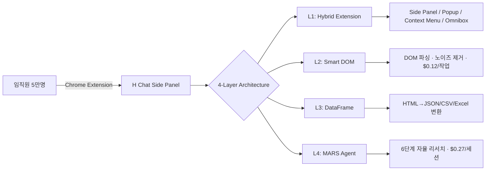

| 핵심 지표 | 목표치 |
|-----------|--------|
| 타겟 사용자 | 50,000+ 석 (현대차그룹 + 외부 대기업) |
| ARR (24개월) | $12.1M |
| 연간 비용 절감 | $550K/년 |
| DAU/MAU | 65%+ |
| 응답 지연 | <1.5s (P95) |
| 가용성 | 99.9%+ |
| 작업 비용 | $0.12/작업 (경쟁사 대비 88% 절감) |

### 4대 핵심 태그

| 태그 | 설명 |
|------|------|
| **Chrome Extension Only** | 별도 앱 불필요, 단일 접점 (MV3 Side Panel, Content Script) |
| **Zero Trust** | 데이터 외부 유출 원천 차단 (PII Scrubbing 11패턴, 블록리스트, 사내 Proxy) |
| **MARS Multi-Agent** | 다중 에이전트 자율 리서치 (LangGraph + CrewAI 6단계) |
| **Dynamic Multi-Model** | 작업별 최적 LLM 동적 할당 (5~19개 모델) |

### 해결하는 4대 업무 병목

| 문제 | 현재 상태 | 정량 지표 | H Chat 해결책 | 절감 효과 |
|------|-----------|-----------|---------------|-----------|
| 컨텍스트 분절 | 7개+ 탭 전환 | 300회/일, 47분/일 | Side Panel 단일 인터페이스 | 87% 시간 절감 |
| 정보 과부하 | 60-70% 노이즈 | 23분/건 탐색 | Smart DOM 노이즈 제거 | 23분→3분 |
| 반복 업무 | 보고서/수집 반복 | 주 8-12시간 | MARS 자율 에이전트 | 95% 자동화 |
| 데이터 주권 | 퍼블릭 AI 유출 | 68% 위험 | Zero Trust 차단 | 유출 0건 |

---

## 2. 서비스 비전 및 미션

### 2.1 비전 선언

> **"브라우저가 곧 OS다 — 모든 업무를 떠나지 않고 AI와 함께 완결한다"**

현대차그룹 임직원이 매일 사용하는 Chrome 브라우저를 AI-Native 업무 환경으로 전환하여, 정보 탐색부터 의사결정까지의 전 과정을 단일 인터페이스에서 완결하는 **엔터프라이즈 AI 오퍼레이팅 시스템**을 구현한다.

### 2.2 미션

```
현대차그룹 5만 임직원의 일하는 방식을 혁신하여,
반복적 정보 노동에서 해방하고 창의적 의사결정에 집중하게 한다.
```

### 2.3 핵심 가치 (Core Values)

```mermaid
mindmap
  root((H Chat<br/>Core Values))
    보안 우선
      Zero Trust 아키텍처
      PII 원천 차단
      사내 Proxy 경유
    사용자 중심
      브라우저 네이티브
      제로 러닝 커브
      컨텍스트 유지
    자율 실행
      MARS 에이전트
      6단계 파이프라인
      Human-in-the-Loop
    비용 효율
      $0.12/작업
      Dynamic Multi-Model
      88% 비용 절감
```

| 가치 | 원칙 | 실행 기준 |
|------|------|-----------|
| **보안 우선 (Security First)** | 데이터는 절대 외부로 나가지 않는다 | PII 11패턴 스크러빙, 블록리스트 20도메인+6패턴, 사내 Proxy 경유 |
| **사용자 중심 (User Centric)** | 새로운 앱이 아니라 기존 워크플로우에 AI를 입힌다 | Side Panel UX, 우클릭 컨텍스트 메뉴, 제로 설치 (Forcelist) |
| **자율 실행 (Autonomous Execution)** | 사용자 지시 한 번으로 복잡한 리서치를 자율 수행한다 | MARS 6단계 파이프라인, 중간 확인점(checkpoint)만 사용자 개입 |
| **비용 효율 (Cost Efficient)** | 작업당 비용을 최소화하되 품질은 극대화한다 | Smart DOM ($0.12) vs Vision API ($1.00), Dynamic Model Routing |

### 2.4 디자인 원칙

1. **Invisible AI**: AI가 드러나지 않고 자연스럽게 업무에 녹아든다
2. **Progressive Disclosure**: 기본은 단순, 필요 시 고급 기능 확장
3. **Context Continuity**: 탭 전환 없이 현재 페이지 맥락 유지
4. **Graceful Degradation**: 네트워크/모델 장애 시에도 기본 기능 보장
5. **Enterprise Grade**: 50,000명 동시 사용에도 흔들리지 않는 안정성

---

## 3. 시장 분석

### 3.1 시장 규모 (TAM / SAM / SOM)

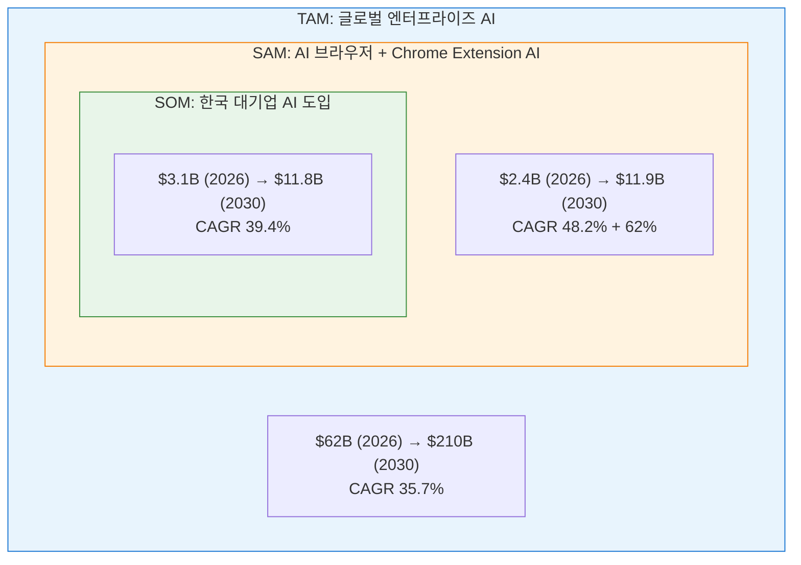

| 시장 세그먼트 | 2026 | 2030 | CAGR |
|---------------|------|------|------|
| 글로벌 엔터프라이즈 AI | $62B | $210B | 35.7% |
| AI 브라우저 시장 | $2.1B | $8.7B | 48.2% |
| Chrome Extension AI | $0.3B | $3.2B | 62.0% |
| 한국 기업 AI | $3.1B | $11.8B | 39.4% |

### 3.2 시장 트렌드 분석

| 트렌드 | 현황 | H Chat 대응 |
|--------|------|-------------|
| AI Agent 자율화 | 단순 챗봇→자율 에이전트 전환 가속 | MARS 6단계 자율 리서치 파이프라인 |
| 브라우저 AI 통합 | Chrome/Arc/Edge에 AI 내장 경쟁 | Extension 기반으로 브라우저 불문 대응 |
| 엔터프라이즈 데이터 보안 | AI 도입 장벽 1위: 데이터 보안 (68%) | Zero Trust + PII Scrubbing + Proxy |
| Multi-Model 전략 | 단일 LLM→다중 LLM 동적 선택 | Dynamic Multi-Model (5~19개) |
| 한국 대기업 AI 내재화 | 도입률 72%, 핵심 업무 통합은 19% | 핵심 업무 통합을 Side Panel에서 실현 |

**핵심 인사이트**: 한국 대기업 AI 도입률은 72%로 높지만, **핵심 업무에 실제 통합된 비율은 19%**에 불과하다. H Chat은 이 52%p 갭을 공략한다.

### 3.3 경쟁 포지셔닝

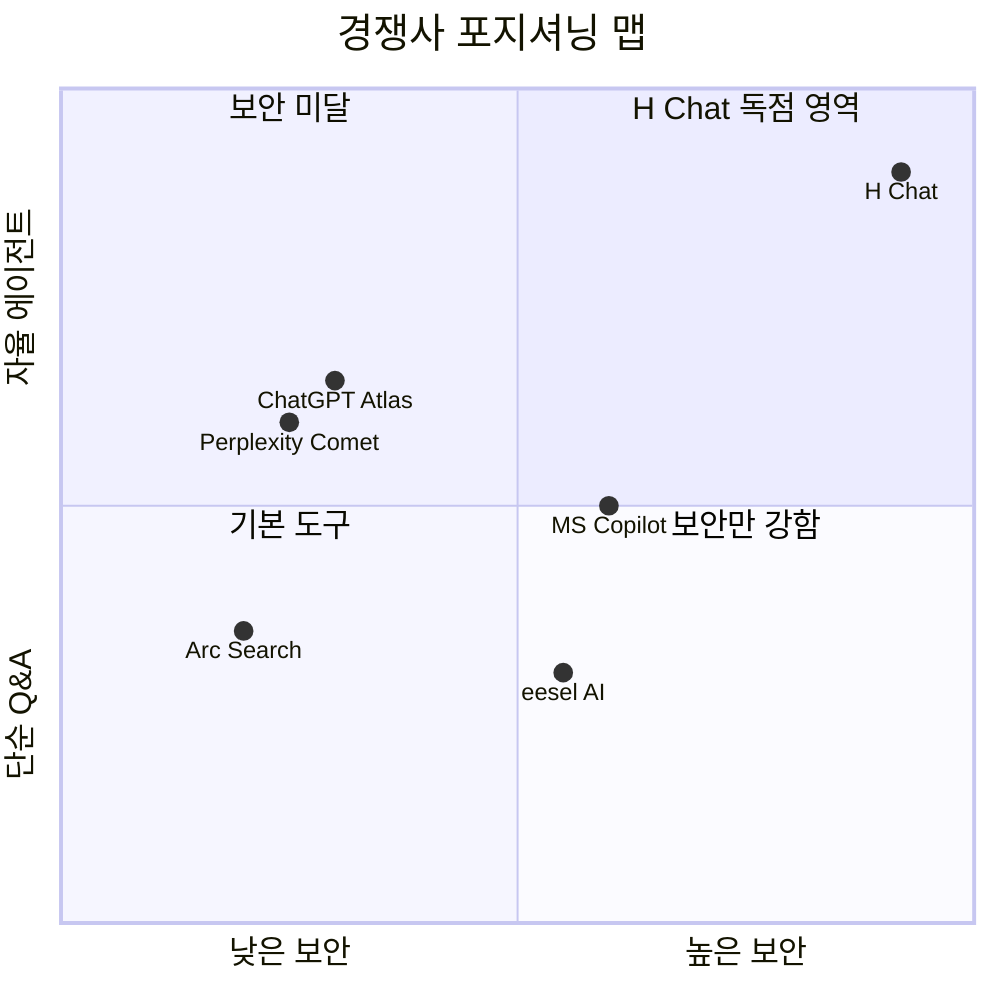

| 차원 | ChatGPT Atlas | Perplexity Comet | Arc Search | eesel AI | **H Chat** |
|------|:------------:|:----------------:|:----------:|:--------:|:----------:|
| **데이터 주권** | 옵트아웃 | 제한적 | 없음 | 부분적 | **Zero Trust** |
| **사내 시스템 접근** | API 필요 | 불가 | 불가 | Slack/Wiki | **직접 접근** |
| **배포 방식** | 앱스토어 | 앱스토어 | 앱스토어 | 웹 | **강제 일괄 (Forcelist)** |
| **에이전트 수준** | 중간 | 중간 | 낮음 | 낮음 | **MARS 자율** |
| **비용/작업** | ~$1.00 | ~$0.80 | N/A | $0.50 | **$0.12** |
| **한국어 최적화** | 부분 | 부분 | 미지원 | 미지원 | **완전 지원** |
| **관리자 통제** | 제한 | 없음 | 없음 | 기본 | **Admin Console 풀 통제** |

**차별화 핵심**: H Chat은 경쟁사 대비 **보안(Zero Trust) + 자율성(MARS) + 비용($0.12)** 3개 축 모두에서 우위를 점한다. 특히 엔터프라이즈 데이터 보안과 Forcelist 일괄 배포는 경쟁사가 구조적으로 모방할 수 없는 해자(moat)이다.

### 3.4 AI 도입 장벽과 H Chat 대응

| 장벽 | 비율 | H Chat 해결 방안 |
|------|------|------------------|
| 데이터 보안 우려 | 68% | Zero Trust (PII 11패턴 스크러빙, 블록리스트, 사내 Proxy) |
| 시스템 연동 복잡 | 57% | Chrome Extension으로 기존 웹 시스템에 즉시 오버레이 |
| ROI 불명확 | 45% | 정량적 비용 절감 $550K/년 산출, ROI 대시보드 제공 |
| 사용자 저항 | 38% | 제로 러닝 커브 (Side Panel + 우클릭), Forcelist 자동 설치 |
| 기술 인력 부족 | 32% | 완전 관리형 SaaS, Admin Console로 비개발자도 운영 |

---

## 4. 타겟 사용자 및 페르소나

### 4.1 사용자 세그먼트

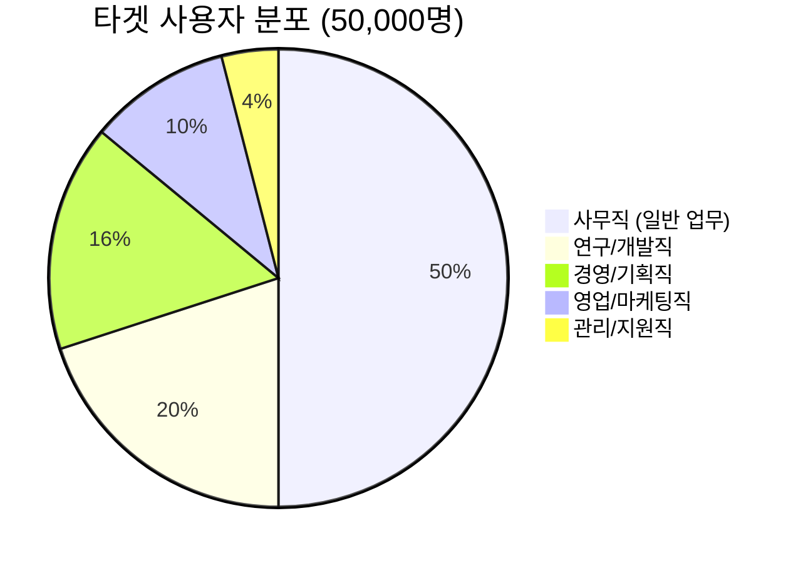

### 4.2 페르소나 상세

#### 페르소나 1: 김서연 — 전략기획 차장

| 항목 | 내용 |
|------|------|
| **이름** | 김서연 |
| **나이/직급** | 38세, 차장 |
| **부서** | 현대자동차 전략기획실 |
| **경력** | 12년 (컨설팅펌 4년 → 현대차 8년) |
| **기술 수준** | 중상 (Excel 고급, Python 기초, ChatGPT 일상 사용) |
| **주요 업무** | 시장 분석 보고서 작성, 경쟁사 동향 추적, 경영진 브리핑 자료 제작 |
| **일일 루틴** | 9시 뉴스 스캔 → 10시 데이터 수집 → 14시 분석 → 16시 보고서 작성 |

**Pain Points**:
- 경쟁사 동향 파악을 위해 매일 15-20개 사이트를 수동으로 확인 (2시간+)
- 수집한 데이터를 Excel로 정리하고 차트로 변환하는 반복 작업 (주 6시간)
- 퍼블릭 ChatGPT에 사내 데이터를 넣을 수 없어 AI 활용이 제한적
- 보고서 템플릿 매번 재작성, 이전 버전과의 일관성 유지 어려움

**H Chat 시나리오**:
> "경쟁사 EV 판매량 데이터를 수집해서 지난 분기 대비 트렌드 분석해줘"
> → MARS Agent가 5개 소스에서 자동 수집 → DataFrame으로 정형화 → 차트 생성 → 보고서 초안 완성
> **Before**: 4시간 / **After**: 10분

---

#### 페르소나 2: 박준혁 — 소프트웨어 엔지니어

| 항목 | 내용 |
|------|------|
| **이름** | 박준혁 |
| **나이/직급** | 31세, 대리 |
| **부서** | 현대오토에버 플랫폼개발팀 |
| **경력** | 6년 (현대오토에버 입사 직후부터) |
| **기술 수준** | 상 (풀스택 개발, Kubernetes, CI/CD 운영) |
| **주요 업무** | 사내 플랫폼 개발, API 설계, 코드 리뷰, 장애 대응 |
| **일일 루틴** | 9시 Jira 확인 → 10시 코드 개발 → 14시 코드 리뷰 → 16시 배포/모니터링 |

**Pain Points**:
- Stack Overflow / GitHub / 공식 문서 사이를 끊임없이 탭 전환 (일 300회+)
- 장애 발생 시 로그 분석에 평균 2시간, 근본 원인 파악에 추가 1시간
- 사내 API 문서가 분산되어 있어 정확한 스펙 확인에 20분+
- 코드 리뷰 시 컨벤션 검토에 시간 소모, 자동화 부재

**H Chat 시나리오**:
> (Kibana 로그 페이지에서 우클릭) "이 에러 로그를 분석하고 근본 원인을 찾아줘"
> → Smart DOM이 로그 페이지 파싱 → 패턴 분석 → 유사 장애 이력 매칭 → 해결 가이드 제시
> **Before**: 2시간 / **After**: 36분 (70% 단축)

---

#### 페르소나 3: 이하은 — 인사기획 과장

| 항목 | 내용 |
|------|------|
| **이름** | 이하은 |
| **나이/직급** | 35세, 과장 |
| **부서** | 현대차그룹 인재개발원 |
| **경력** | 9년 (인사/교육 전문) |
| **기술 수준** | 중 (Office 능숙, 기본 데이터 분석) |
| **주요 업무** | 교육 프로그램 기획, 인력 현황 분석, 성과 리포트 작성 |
| **일일 루틴** | 9시 메일 확인 → 10시 데이터 취합 → 13시 회의 → 15시 보고서 작성 |

**Pain Points**:
- 16개 계열사의 인력 현황 데이터를 수동으로 취합 (월 2일 소요)
- 교육 효과 분석을 위한 설문 데이터 정리에 주 4시간
- 경영진 보고용 대시보드를 매번 Excel로 수작업 제작
- AI 도구 사용 시 직원 개인정보 유출 우려로 활용 제한

**H Chat 시나리오**:
> "이번 분기 계열사별 교육 이수율 데이터를 정리해서 경영진 보고 양식으로 만들어줘"
> → DataFrame이 사내 교육 시스템 페이지 파싱 → 계열사별 집계 → 보고서 템플릿 적용
> **Before**: 8시간 / **After**: 30분 (93% 단축)

---

#### 페르소나 4: 최동원 — 구매팀 부장

| 항목 | 내용 |
|------|------|
| **이름** | 최동원 |
| **나이/직급** | 45세, 부장 |
| **부서** | 현대모비스 글로벌구매팀 |
| **경력** | 20년 (구매/조달 전문) |
| **기술 수준** | 중하 (Excel 기본, 이메일/ERP 위주) |
| **주요 업무** | 글로벌 벤더 관리, 단가 협상, 공급망 리스크 모니터링 |
| **일일 루틴** | 8시 글로벌 뉴스 확인 → 10시 벤더 미팅 → 14시 단가 검토 → 16시 리스크 보고 |

**Pain Points**:
- 글로벌 원자재 가격 변동을 추적하기 위해 10+ 사이트 매일 확인
- 벤더 재무 건전성 분석에 외부 데이터 수집만 3시간+
- 중국어/일본어 벤더 문서 번역에 시간 소모
- 공급망 리스크 징후를 놓치면 수십억 손실 발생 가능

**H Chat 시나리오**:
> "배터리 원자재 리튬/니켈 가격 동향을 분석하고, 주요 공급사 리스크 요인을 정리해줘"
> → MARS Agent가 Bloomberg/Reuters/업계 사이트 크롤링 → 가격 트렌드 + 공급사 재무 데이터 정형화 → 리스크 등급 매핑
> **Before**: 5시간 / **After**: 15분

---

#### 페르소나 5: 정수민 — IT 보안 담당자

| 항목 | 내용 |
|------|------|
| **이름** | 정수민 |
| **나이/직급** | 40세, 차장 |
| **부서** | 현대오토에버 정보보안팀 |
| **경력** | 15년 (보안 아키텍트, CISM 보유) |
| **기술 수준** | 상 (보안 인프라 전문, 클라우드 보안) |
| **주요 업무** | AI 서비스 보안 검증, 데이터 유출 방지 정책 수립, 규정 준수 감사 |
| **일일 루틴** | 9시 보안 대시보드 점검 → 11시 정책 검토 → 14시 보안 평가 → 16시 감사 보고 |

**Pain Points**:
- 임직원의 퍼블릭 AI (ChatGPT, Claude 등) 사용으로 데이터 유출 사고 연 3-5건
- AI 서비스 도입 시 보안 검증 프로세스가 6개월+, 현업 불만 증가
- 새로운 AI 도구가 매월 등장, 블랙리스트 관리 한계
- 보안과 생산성의 균형점을 찾아야 하는 지속적 압박

**H Chat 시나리오**:
> Admin Console에서 보안 정책을 중앙 관리하며 실시간 데이터 유출 모니터링
> → Forcelist로 전사 일괄 배포 → PII 스크러빙 11패턴 실시간 적용 → 블록리스트 20도메인 차단
> **Before**: 수동 블랙리스트 관리 / **After**: 중앙 보안 대시보드 자동화

---

## 5. 핵심 기능 명세

### 5.1 4-Layer 아키텍처 기반 기능 분류

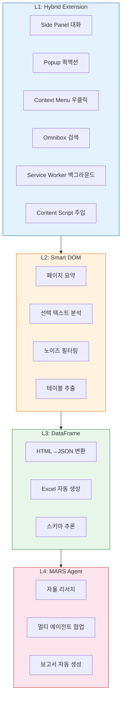

### 5.2 기능 상세 명세 (18개)

#### L1: Hybrid Extension 기능

| # | 기능명 | 설명 | 입력 | 출력 | SLA |
|---|--------|------|------|------|-----|
| F01 | **Side Panel 대화** | Chrome Side Panel에서 AI와 실시간 대화. 현재 탭 컨텍스트 자동 인식 | 자연어 질문 | AI 응답 (스트리밍) | <1.5s P95 |
| F02 | **Popup 퀵액션** | Extension 아이콘 클릭 시 빠른 액션 메뉴. 요약/번역/질문 원클릭 | 클릭 | 액션 결과 | <500ms |
| F03 | **Context Menu 분석** | 텍스트 선택 후 우클릭으로 분석/번역/검색. 5개 프리셋 메뉴 | 선택 텍스트 | 분석 결과 | <2s |
| F04 | **Omnibox 통합검색** | 주소창에 `hc` 입력 후 Tab으로 H Chat 검색 모드 진입 | 검색어 | 검색 결과 + AI 답변 | <1s |
| F05 | **Service Worker 동기화** | 백그라운드에서 알림, 캐시, 오프라인 큐 관리 | 이벤트 | 백그라운드 처리 | 99.9% |
| F06 | **Content Script 오버레이** | 웹 페이지 위에 AI 하이라이트, 주석, 인사이트 오버레이 표시 | 페이지 DOM | 오버레이 UI | <300ms |

#### L2: Smart DOM 기능

| # | 기능명 | 설명 | 입력 | 출력 | SLA |
|---|--------|------|------|------|-----|
| F07 | **페이지 자동 요약** | 현재 페이지 내용을 Smart DOM으로 파싱 후 3단계 요약 제공 | 페이지 URL/DOM | 핵심 요약 (1줄/3줄/전체) | <3s |
| F08 | **선택 텍스트 심층 분석** | 드래그한 텍스트를 컨텍스트와 함께 분석. 용어 설명, 팩트 체크 포함 | 선택 텍스트 + 페이지 컨텍스트 | 분석 리포트 | <2s |
| F09 | **스마트 노이즈 필터** | Readability.js + RQFP로 광고/네비게이션/푸터 등 노이즈 60-70% 제거 | 페이지 DOM | 정제된 콘텐츠 | <500ms |
| F10 | **테이블/차트 추출** | 페이지 내 테이블, 차트 데이터를 구조화하여 추출 | 페이지 DOM | 구조화 데이터 (JSON) | <1s |

#### L3: DataFrame 기능

| # | 기능명 | 설명 | 입력 | 출력 | SLA |
|---|--------|------|------|------|-----|
| F11 | **HTML→JSON/CSV 변환** | 웹 테이블을 JSON/CSV로 자동 변환. 스키마 추론 포함 | HTML 테이블 | JSON / CSV | <1s |
| F12 | **Excel 자동 생성** | 추출 데이터를 서식 포함 Excel 파일로 변환. 차트 자동 삽입 | 구조화 데이터 | .xlsx 파일 | <3s |
| F13 | **크로스 페이지 병합** | 여러 페이지에서 추출한 데이터를 스키마 기반으로 자동 병합 | 다중 페이지 데이터 | 통합 데이터셋 | <5s |

#### L4: MARS Agent 기능

| # | 기능명 | 설명 | 입력 | 출력 | SLA |
|---|--------|------|------|------|-----|
| F14 | **자율 리서치** | 6단계 파이프라인: 계획→수집→분석→종합→검증→보고 | 리서치 질문 | 종합 리포트 | <5min |
| F15 | **멀티 에이전트 협업** | LangGraph + CrewAI 기반 다중 에이전트가 역할 분담 수행 | 복합 작업 지시 | 협업 결과물 | <10min |
| F16 | **보고서 자동 생성** | 수집/분석 데이터를 기업 템플릿에 맞춰 보고서 자동 작성 | 데이터 + 템플릿 | 완성 보고서 | <3min |

#### 공통 기능

| # | 기능명 | 설명 | 입력 | 출력 | SLA |
|---|--------|------|------|------|-----|
| F17 | **Zero Trust 보안** | PII 11패턴 스크러빙, 블록리스트, 사내 Proxy 경유, 감사 로그 | 모든 요청 | 정제된 요청 | <50ms 오버헤드 |
| F18 | **Dynamic Multi-Model** | 작업 복잡도/비용/속도 기준으로 최적 LLM 자동 선택 (5~19개) | 작업 메타데이터 | 최적 모델 선택 | <100ms |

### 5.3 MARS 6단계 파이프라인 상세

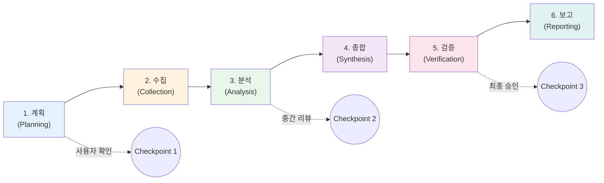

| 단계 | 수행 내용 | 에이전트 | 예상 시간 | 비용 |
|------|-----------|----------|-----------|------|
| 1. 계획 | 리서치 질문 분해, 소스 식별, 전략 수립 | Planner Agent | ~10s | $0.02 |
| 2. 수집 | Smart DOM으로 다중 소스 병렬 크롤링 | Collector Agent (x3) | ~60s | $0.08 |
| 3. 분석 | 수집 데이터 패턴 분석, 인사이트 추출 | Analyst Agent | ~30s | $0.05 |
| 4. 종합 | 분석 결과 통합, 일관된 내러티브 구성 | Synthesizer Agent | ~20s | $0.04 |
| 5. 검증 | 사실 확인, 출처 교차 검증, 편향 탐지 | Verifier Agent | ~15s | $0.04 |
| 6. 보고 | 기업 템플릿에 맞춘 최종 리포트 생성 | Reporter Agent | ~15s | $0.04 |
| **합계** | | **6 에이전트** | **~2.5min** | **$0.27/세션** |

---

## 6. UX 시나리오 (10개)

### 시나리오 1: 경쟁사 동향 리서치

| 항목 | 내용 |
|------|------|
| **사용자** | 김서연 (전략기획 차장) |
| **목표** | 테슬라 Q1 실적 분석 보고서 작성 |
| **트리거** | Side Panel 열기 |

**Step-by-step**:
1. 김서연이 Chrome에서 Side Panel 아이콘 클릭
2. "테슬라 2026년 1분기 실적을 분석하고 현대차와 비교해줘" 입력
3. MARS Planner가 리서치 계획 제시 → 사용자 "확인" 클릭
4. Collector Agent 3개가 병렬로 Reuters, Bloomberg, SEC Filing 크롤링
5. Side Panel에 실시간 수집 진행률 표시 (3/5 소스 완료)
6. Analyst Agent가 핵심 수치 추출: 매출, 인도량, 마진, 가이던스
7. 중간 분석 결과 Side Panel에 표시 → 사용자 "계속" 확인
8. Synthesizer가 현대차 대비 비교 표 생성
9. Reporter가 경영진 브리핑 형식으로 보고서 초안 완성
10. "Excel로 다운로드" 클릭 → 서식 포함 .xlsx 파일 자동 다운로드

| Before | After |
|--------|-------|
| 15개 사이트 수동 검색 (2시간) | MARS 자동 수집 (2.5분) |
| Excel 수작업 정리 (1시간) | DataFrame 자동 변환 |
| 보고서 작성 (1시간) | 템플릿 자동 생성 |
| **총 4시간** | **총 10분** |

---

### 시나리오 2: 장애 로그 분석

| 항목 | 내용 |
|------|------|
| **사용자** | 박준혁 (소프트웨어 엔지니어) |
| **목표** | 프로덕션 에러 근본 원인 파악 |
| **트리거** | Context Menu (우클릭) |

**Step-by-step**:
1. Kibana 대시보드에서 에러 로그 확인
2. 에러 메시지 드래그 후 우클릭 → "H Chat: 이 에러 분석" 선택
3. Smart DOM이 Kibana 페이지 전체 컨텍스트를 파싱 (타임라인, 스택 트레이스)
4. Side Panel이 자동으로 열리며 분석 시작
5. 유사 에러 패턴 3개를 내부 지식베이스에서 매칭
6. 근본 원인 후보 3가지를 확률과 함께 제시
7. 가장 유력한 원인에 대한 해결 코드 스니펫 제시
8. "사내 Confluence에서 관련 문서 확인" 링크 제공
9. 수정 사항 적용 후 "모니터링 알림 설정" 원클릭 제공
10. 장애 리포트 초안 자동 생성

| Before | After |
|--------|-------|
| 로그 수동 분석 (1시간) | Smart DOM 자동 파싱 (30초) |
| 근본 원인 조사 (1시간) | 패턴 매칭 + 후보 제시 (5분) |
| **총 2시간** | **총 36분 (70% 단축)** |

---

### 시나리오 3: 다국어 문서 번역 및 요약

| 항목 | 내용 |
|------|------|
| **사용자** | 최동원 (구매팀 부장) |
| **목표** | 중국 벤더 기술 스펙 문서 이해 |
| **트리거** | Popup 퀵액션 |

**Step-by-step**:
1. 중국어로 된 벤더 기술 스펙 PDF를 브라우저에서 열기
2. Extension 아이콘 클릭 → Popup에서 "페이지 번역 + 요약" 선택
3. Smart DOM이 PDF 뷰어에서 텍스트 추출
4. Dynamic Multi-Model이 중→한 전문 번역에 최적 모델 자동 선택
5. Side Panel에 번역된 전문 표시 (기술 용어 하이라이트)
6. 핵심 스펙 비교표 자동 생성 (기존 벤더 vs 신규 벤더)
7. Content Script가 원문 페이지 위에 한국어 오버레이 표시
8. "Excel로 스펙 비교표 내보내기" 옵션 제공
9. 관련 내부 구매 기준 문서 자동 링크
10. 번역/분석 이력이 Side Panel 히스토리에 저장

| Before | After |
|--------|-------|
| 외부 번역 의뢰 (2일) | 실시간 AI 번역 (30초) |
| 수동 스펙 비교표 작성 (1시간) | 자동 비교표 생성 (1분) |
| **총 2일+** | **총 5분** |

---

### 시나리오 4: 인력 현황 데이터 취합

| 항목 | 내용 |
|------|------|
| **사용자** | 이하은 (인사기획 과장) |
| **목표** | 16개 계열사 교육 이수율 취합 |
| **트리거** | Side Panel 대화 |

**Step-by-step**:
1. Side Panel에서 "계열사별 이번 분기 교육 이수율을 정리해줘" 입력
2. MARS Agent가 사내 교육 시스템(LMS) 접속 계획 수립
3. 사용자가 LMS 페이지를 열면 Content Script가 자동 인식
4. Smart DOM이 16개 계열사 페이지를 순차 파싱 (PII 자동 필터링)
5. DataFrame이 계열사별 데이터를 통합 스키마로 병합
6. 이수율 기준 상위/하위 5개사 하이라이트
7. 전분기 대비 증감률 자동 계산
8. 경영진 보고 템플릿에 맞춘 PowerPoint 형식 제안
9. "Excel 다운로드" + "차트 포함 보고서" 옵션 제공
10. 다음 분기 자동 수집 스케줄 설정 안내

| Before | After |
|--------|-------|
| 16개 계열사 수동 취합 (2일) | 자동 파싱 + 병합 (15분) |
| Excel 정리 + 차트 (4시간) | 자동 보고서 생성 (5분) |
| **총 2일** | **총 30분** |

---

### 시나리오 5: 실시간 뉴스 모니터링

| 항목 | 내용 |
|------|------|
| **사용자** | 김서연 (전략기획 차장) |
| **목표** | EV 배터리 관련 뉴스 실시간 추적 |
| **트리거** | Service Worker 알림 |

**Step-by-step**:
1. Side Panel에서 "EV 배터리 관련 뉴스 모니터링 설정" 입력
2. 키워드, 소스, 알림 빈도 설정 (기본: 주요 뉴스 즉시, 일반 1시간 요약)
3. Service Worker가 백그라운드에서 RSS + 주요 뉴스 사이트 모니터링
4. 중요 뉴스 감지 시 Chrome 알림 발송
5. 알림 클릭 → Side Panel에 뉴스 요약 + 임팩트 분석 표시
6. "관련 이전 보고서"와 자동 연결
7. 일간 종합 뉴스 브리핑 자동 생성 (오전 9시)
8. 주간 트렌드 리포트 자동 발행 (월요일 오전)
9. 키워드별 감성 분석(긍정/부정/중립) 트렌드 차트
10. 경쟁사 언급 빈도 대시보드 제공

| Before | After |
|--------|-------|
| 15-20개 사이트 수동 확인 (2시간/일) | 자동 모니터링 + 알림 |
| 뉴스 요약 수작업 (1시간/일) | AI 자동 요약 + 분석 |
| **총 3시간/일** | **총 5분/일 (확인만)** |

---

### 시나리오 6: 회의록 자동 작성

| 항목 | 내용 |
|------|------|
| **사용자** | 이하은 (인사기획 과장) |
| **목표** | 화상 회의 내용 정리 및 액션 아이템 추출 |
| **트리거** | Content Script 감지 |

**Step-by-step**:
1. Google Meet / MS Teams 화상 회의 페이지 접속
2. Content Script가 화상 회의 플랫폼 자동 감지
3. Side Panel에 "회의록 작성 모드" 자동 제안 팝업
4. 실시간 자막/채팅에서 핵심 내용 자동 캡처
5. 발언자별 주요 포인트 실시간 정리
6. 회의 종료 시 자동 요약 생성 (3줄 핵심 / 상세 버전)
7. 액션 아이템 자동 추출 (담당자, 기한 포함)
8. "사내 일정에 액션 아이템 등록" 원클릭
9. 참석자에게 회의록 공유 링크 생성
10. 이전 회의 대비 진척 사항 자동 비교

| Before | After |
|--------|-------|
| 수기 회의록 (30분) | AI 자동 회의록 (0분) |
| 액션 아이템 수동 정리 (15분) | 자동 추출 + 등록 |
| **총 45분/회의** | **총 2분 (확인만)** |

---

### 시나리오 7: 코드 리뷰 보조

| 항목 | 내용 |
|------|------|
| **사용자** | 박준혁 (소프트웨어 엔지니어) |
| **목표** | GitHub PR 코드 리뷰 효율화 |
| **트리거** | Content Script 자동 감지 |

**Step-by-step**:
1. GitHub PR 페이지 접속 → Content Script가 PR 페이지 자동 감지
2. Side Panel에 "코드 리뷰 어시스턴트" 모드 자동 활성화
3. Smart DOM이 변경된 파일 diff 전체 파싱
4. 보안 취약점 자동 스캔 (SQL Injection, XSS 등)
5. 코드 컨벤션 위반 사항 하이라이트
6. 성능 이슈 가능성 플래그
7. Content Script가 GitHub 페이지 위에 인라인 코멘트 오버레이
8. 리뷰 코멘트 초안 자동 생성
9. "Approve / Request Changes" 추천과 근거 제시
10. 리뷰 완료 후 팀 지식베이스에 패턴 학습

| Before | After |
|--------|-------|
| 코드 전체 수동 리뷰 (1시간) | AI 사전 분석 (2분) |
| 보안 취약점 수동 검토 (30분) | 자동 스캔 (10초) |
| **총 1.5시간** | **총 20분** |

---

### 시나리오 8: 원자재 가격 비교 분석

| 항목 | 내용 |
|------|------|
| **사용자** | 최동원 (구매팀 부장) |
| **목표** | 리튬/니켈/코발트 글로벌 가격 트렌드 분석 |
| **트리거** | Omnibox 검색 |

**Step-by-step**:
1. Chrome 주소창에 `hc` 입력 후 Tab → "배터리 원자재 가격 비교" 입력
2. Omnibox에서 즉시 최근 가격 스냅샷 표시
3. "상세 분석" 클릭 → Side Panel에서 MARS Agent 가동
4. 5개 글로벌 거래소 데이터 병렬 수집 (LME, SHFE, CME 등)
5. 6개월 가격 추이 차트 자동 생성
6. DataFrame으로 거래소별 가격 비교 테이블 구성
7. 환율 변동 반영 원화 환산 가격 자동 계산
8. "가격 하락 시 알림" 설정 옵션 제공
9. 기존 계약 단가 대비 시장가 갭 분석
10. Excel 보고서 + 차트 자동 다운로드

| Before | After |
|--------|-------|
| 5개 거래소 수동 확인 (1시간) | 병렬 자동 수집 (1분) |
| Excel 정리 + 차트 (2시간) | 자동 분석 + 보고서 |
| **총 3시간** | **총 10분** |

---

### 시나리오 9: 보안 감사 보고서 생성

| 항목 | 내용 |
|------|------|
| **사용자** | 정수민 (IT 보안 차장) |
| **목표** | 월간 AI 서비스 보안 감사 리포트 작성 |
| **트리거** | Side Panel 대화 |

**Step-by-step**:
1. Admin Console에서 Side Panel 열기
2. "이번 달 H Chat 보안 감사 리포트를 생성해줘" 입력
3. MARS Agent가 감사 로그 데이터베이스 쿼리
4. PII 스크러빙 통계 집계 (차단 건수, 유형별 분류)
5. 블록리스트 매칭 이벤트 분석 (도메인별, 시간대별)
6. 사용자별 이상 행동 패턴 탐지 (이상치 감지)
7. 전월 대비 보안 지표 변화 트렌드 차트 생성
8. 규정 준수(Compliance) 체크리스트 자동 평가
9. 개선 권고사항 5개 + 우선순위 자동 도출
10. 경영진 보고용 + 상세 기술용 2개 버전 보고서 생성

| Before | After |
|--------|-------|
| 로그 수동 분석 (1일) | 자동 집계 (10분) |
| 보고서 작성 (4시간) | 자동 생성 (5분) |
| **총 1.5일** | **총 30분** |

---

### 시나리오 10: 신규 입사자 온보딩

| 항목 | 내용 |
|------|------|
| **사용자** | 신규 입사자 (사원) |
| **목표** | 사내 시스템 및 업무 프로세스 빠른 적응 |
| **트리거** | Forcelist 자동 설치 후 첫 실행 |

**Step-by-step**:
1. 입사 첫날 Chrome 열면 H Chat Extension 이미 설치됨 (Forcelist)
2. 웰컴 Popup에서 "온보딩 가이드 시작" 안내
3. Side Panel에 맞춤형 온보딩 체크리스트 표시
4. 사내 포털 접속 시 Content Script가 주요 메뉴 하이라이트 + 설명 오버레이
5. "이 페이지가 뭐하는 곳이야?" 질문 → Smart DOM이 페이지 분석 후 설명
6. 부서별 필수 시스템 가이드 제공 (ERP, Confluence, Jira 등)
7. 자주 묻는 질문(FAQ) 자동 추천
8. 선배 직원이 자주 사용하는 기능 추천
9. 온보딩 진행률 트래킹 (Side Panel 대시보드)
10. 2주 후 적응도 자가 평가 + 추가 학습 추천

| Before | After |
|--------|-------|
| 선배에게 반복 질문 (수시) | AI가 즉답 (24/7) |
| 시스템 파악 (2-4주) | 가이드 온보딩 (3-5일) |
| **적응 기간 4주** | **적응 기간 1주** |

---

## 7. 정보 구조 (IA)

### 7.1 Extension 인터페이스 구조

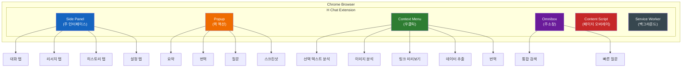

### 7.2 Side Panel 상세 IA

```
Side Panel (480px 고정 너비)
├── 헤더
│   ├── H Chat 로고
│   ├── 모델 선택기 (현재 사용 모델 표시)
│   ├── 새 대화 버튼
│   └── 설정 기어 아이콘
│
├── 탭 네비게이션
│   ├── 💬 대화 (기본)
│   │   ├── 대화 입력창 (하단 고정)
│   │   ├── 메시지 스트림
│   │   │   ├── 사용자 메시지
│   │   │   ├── AI 응답 (스트리밍)
│   │   │   ├── 인라인 코드 블록
│   │   │   ├── 데이터 테이블
│   │   │   └── 파일 첨부 미리보기
│   │   ├── 빠른 프롬프트 추천
│   │   └── 컨텍스트 표시 (현재 페이지 정보)
│   │
│   ├── 🔍 리서치
│   │   ├── 리서치 질문 입력
│   │   ├── MARS 파이프라인 진행 상태
│   │   │   ├── 단계별 프로그레스 바
│   │   │   ├── Checkpoint 확인 버튼
│   │   │   └── 수집 소스 목록
│   │   ├── 결과 미리보기
│   │   └── 보고서 다운로드 (Excel/PDF)
│   │
│   ├── 📋 히스토리
│   │   ├── 검색 필터 (날짜, 키워드)
│   │   ├── 대화 목록 (시간순)
│   │   ├── 즐겨찾기
│   │   └── 내보내기 옵션
│   │
│   └── ⚙️ 설정
│       ├── 모델 기본 설정
│       ├── 언어 설정 (한/영)
│       ├── 알림 설정
│       ├── 보안 설정 (PII 민감도)
│       ├── 단축키 설정
│       └── 데이터 관리 (캐시 삭제)
│
└── 하단 상태바
    ├── 연결 상태 (온라인/오프라인)
    ├── 현재 모델 표시
    ├── 토큰 사용량
    └── 버전 정보
```

### 7.3 Popup 퀵 액션 IA

```
Popup (400x500px)
├── 검색 입력창
├── 퀵 액션 그리드 (2x3)
│   ├── 📝 요약 — 현재 페이지 3줄 요약
│   ├── 🌐 번역 — 전체/선택 번역
│   ├── ❓ 질문 — 빠른 질문
│   ├── 📊 데이터 — 테이블 추출
│   ├── 📸 스크린샷 — 영역 캡처 + 분석
│   └── ⚡ 커스텀 — 사용자 정의 액션
├── 최근 사용 액션 (3개)
└── Side Panel 열기 버튼
```

### 7.4 Context Menu 구조

```
우클릭 메뉴
├── H Chat
│   ├── 이 텍스트 분석
│   ├── 이 텍스트 번역 → [한국어/영어/중국어/일본어]
│   ├── 이 텍스트로 검색
│   ├── ─────────────
│   ├── 이 이미지 분석
│   ├── 이 링크 미리보기 + 요약
│   ├── ─────────────
│   ├── 이 테이블 추출 (CSV)
│   ├── 이 테이블 추출 (Excel)
│   └── ─────────────
│       └── Side Panel에서 계속
```

### 7.5 Omnibox 검색 흐름

```
주소창: "hc" + Tab → H Chat 모드 활성화
├── 입력: "배터리 원자재 가격"
├── 실시간 추천
│   ├── 🔍 "배터리 원자재 가격 비교" (검색)
│   ├── 📊 "배터리 원자재 가격 차트" (데이터)
│   ├── 📋 "배터리 원자재 관련 대화 기록" (히스토리)
│   └── 🤖 "배터리 원자재 리서치 시작" (MARS)
└── Enter → Side Panel에서 결과 표시
```

---

## 8. 비즈니스 모델

### 8.1 Business Model Canvas (BMC)

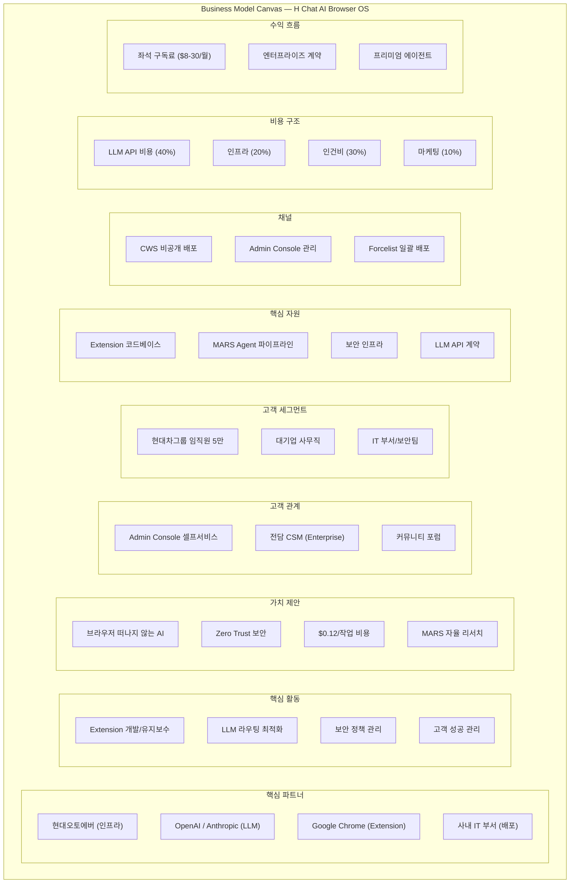

### 8.2 3-Tier 가격 정책

| 항목 | Basic | Pro | Enterprise |
|------|:-----:|:---:|:----------:|
| **월 가격** | **$8/월** | **$18/월** | **$30/월** |
| **연 가격** | $80/년 (17% 할인) | $180/년 (17% 할인) | $300/년 (17% 할인) |
| **LLM 모델** | GPT-4o-mini, Haiku | + GPT-4o, Sonnet | + Opus, o3, 전체 19개 |
| **일일 쿼리** | 50회 | 200회 | 무제한 |
| **기본 Q&A** | O | O | O |
| **페이지 요약** | O | O | O |
| **번역** | O | O | O |
| **리서치 (MARS)** | - | O (기본) | O (풀 스택) |
| **DataFrame** | - | O | O |
| **보고서 생성** | - | O | O |
| **배포 방식** | CWS 수동 설치 | Admin Console | **Forcelist (강제)** |
| **SLA** | 99.5% | 99.9% | **99.95%** |
| **지원** | 커뮤니티 | 이메일 (24h) | **전담 CSM + 4h 응답** |
| **관리자 콘솔** | - | O (기본) | O (풀 기능) |
| **감사 로그** | - | 30일 | **무제한** |
| **SSO/SAML** | - | - | O |
| **커스텀 모델** | - | - | O |

### 8.3 수익 다각화 전략

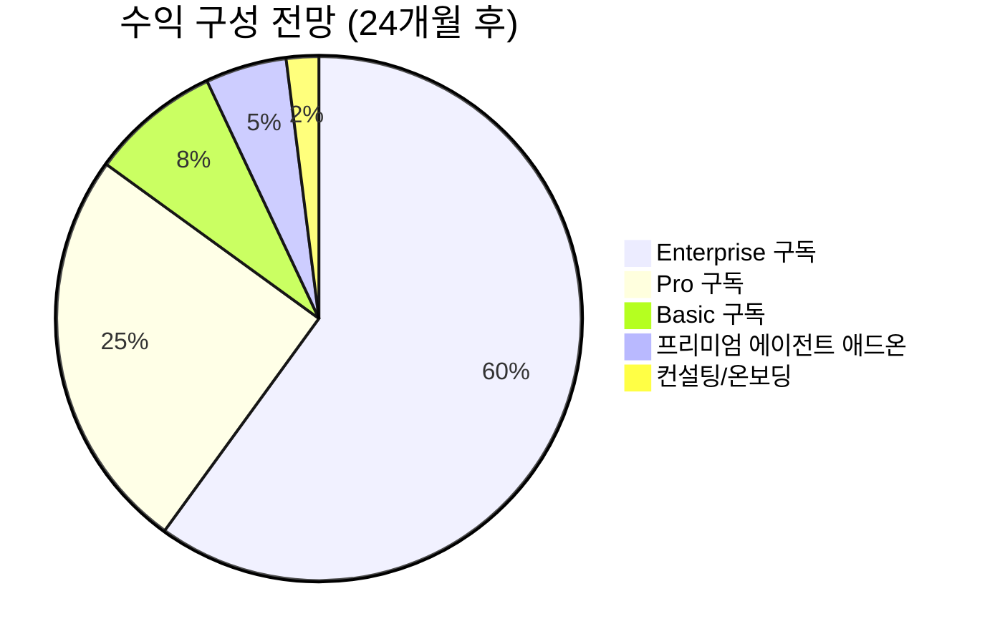

| 수익원 | 비중 | 내용 |
|--------|------|------|
| Enterprise 구독 | 60% | $30/월 x 대규모 계약 (최소 1,000석) |
| Pro 구독 | 25% | $18/월 x 부서 단위 도입 |
| Basic 구독 | 8% | $8/월 x 개인/소규모팀 |
| 프리미엄 에이전트 | 5% | 산업 특화 에이전트 애드온 ($5-10/월) |
| 컨설팅/온보딩 | 2% | 엔터프라이즈 고객 맞춤 설정 |

### 8.4 ARR 전망

| 시점 | 활성 사용자 | ARPU (월) | MRR | **ARR** |
|------|------------|-----------|-----|---------|
| 6개월 | 2,000 | $13 | $26K | **$312K** |
| 12개월 | 8,000 | $16 | $128K | **$1.54M** |
| 18개월 | 25,000 | $19 | $475K | **$5.64M** |
| 24개월 | 50,000 | $20 | $1.0M | **$12.1M** |

### 8.5 단위 경제 (Unit Economics)

| 지표 | 값 | 비고 |
|------|-----|------|
| CAC (고객 획득 비용) | ~$15 | Forcelist 배포로 극히 낮음 |
| ARPU (월) | $20 (Enterprise 기준) | |
| Gross Margin | 65% | LLM API 비용 35% |
| LTV | $720 (36개월 유지) | |
| LTV/CAC | **48x** | 매우 건전한 수준 |
| Payback Period | <1개월 | |

---

## 9. Go-To-Market 전략

### 9.1 3단계 GTM 로드맵

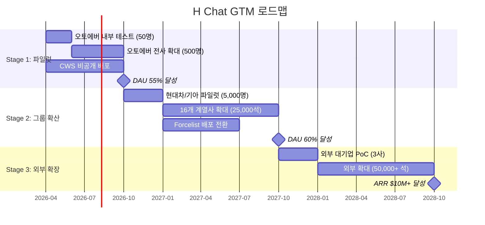

### 9.2 Stage 1: 파일럿 (0-6개월)

| 항목 | 내용 |
|------|------|
| **대상** | 현대오토에버 500명 |
| **배포** | CWS 비공개 배포 (수동 설치) |
| **목표** | DAU 55%+, NPS 40+, 핵심 버그 0 |
| **전략** | 얼리 어답터 발굴 → 챔피언 육성 → 유기적 확산 |

**실행 계획**:

| 월 | 활동 | 목표 지표 |
|----|------|-----------|
| M1 | 핵심 팀 50명 클로즈드 베타 | 설치율 100%, 일일 피드백 수집 |
| M2 | 피드백 반영 v0.2 릴리즈 | 주요 버그 해결, 기능 안정화 |
| M3 | 오토에버 200명 확대 | DAU 40%+, 주간 리포트 시작 |
| M4 | 부서별 챔피언 5명 선정/교육 | 챔피언 NPS 60+ |
| M5 | 오토에버 전사 500명 오픈 | DAU 50%+, 지원 프로세스 안정화 |
| M6 | Stage 1 성과 보고 + Stage 2 승인 | DAU 55%+, NPS 40+, ARR $312K |

### 9.3 Stage 2: 그룹 확산 (6-18개월)

| 항목 | 내용 |
|------|------|
| **대상** | 현대차그룹 16개 계열사 25,000석 |
| **배포** | Admin Console → Forcelist 전환 |
| **목표** | DAU 60%+, NPS 45+, ARR $5.64M |
| **전략** | Forcelist 일괄 배포 + 부서별 온보딩 + 성공 사례 전파 |

**배포 모델 전환**:

| 단계 | 배포 방식 | 예상 설치율 | 대상 |
|------|-----------|-------------|------|
| Phase A | CWS 비공개 | 30-60% | 자발적 얼리 어답터 |
| Phase B | Admin Console 관리 | 80-90% | IT 부서 관리 배포 |
| Phase C | **Forcelist** | **95%+** | 전사 강제 배포 (사용자 제거 불가) |

### 9.4 Stage 3: 외부 확장 (18-30개월)

| 항목 | 내용 |
|------|------|
| **대상** | 외부 대기업 50,000+ 석 |
| **배포** | 엔터프라이즈 계약 |
| **목표** | ARR $10M+, NRR 120%+ |
| **전략** | 성공 사례 기반 영업 + 산업별 특화 에이전트 |

**타겟 산업**:

| 산업 | 잠재 고객 예시 | 특화 기능 | 예상 계약 규모 |
|------|---------------|-----------|---------------|
| 자동차/제조 | 현대차그룹 (이미 확보) | 공급망 에이전트, 품질 리서치 | 25,000석 |
| 금융 | 삼성증권, KB금융 | 시장 분석, 규제 모니터링 | 10,000석 |
| IT/통신 | SK텔레콤, KT | 기술 문서 분석, 코드 리뷰 | 8,000석 |
| 건설/에너지 | 현대건설, 한화에너지 | 프로젝트 관리, 안전 규정 | 5,000석 |
| 유통/서비스 | 롯데, 신세계 | 고객 분석, 트렌드 리서치 | 5,000석 |

### 9.5 마케팅 전략

| 채널 | Stage 1 | Stage 2 | Stage 3 |
|------|---------|---------|---------|
| 내부 포털 공지 | O | O | - |
| 챔피언 프로그램 | O | O | O |
| 부서별 온보딩 세션 | O | O | O |
| 성공 사례 케이스 스터디 | - | O | O |
| 경영진 브리핑 | O | O | O |
| 산업 컨퍼런스 발표 | - | - | O |
| LinkedIn/블로그 콘텐츠 | - | O | O |
| 파트너 채널 (SI) | - | - | O |

---

## 10. KPI 및 성공 기준

### 10.1 KPI 계층 구조

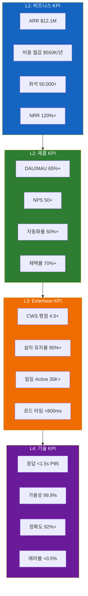

### 10.2 L1: 비즈니스 KPI

| KPI | 6개월 | 12개월 | 18개월 | 24개월 | 측정 방법 |
|-----|--------|--------|--------|--------|-----------|
| ARR | $312K | $1.54M | $5.64M | **$12.1M** | 구독 관리 시스템 |
| 활성 좌석 | 2,000 | 8,000 | 25,000 | **50,000+** | Admin Console |
| 비용 절감 | $50K | $200K | $400K | **$550K/년** | ROI 대시보드 |
| NRR | 100% | 110% | 115% | **120%+** | 구독 갱신율 + 업셀 |
| Gross Margin | 55% | 60% | 63% | **65%** | 재무 시스템 |

### 10.3 L2: 제품 KPI

| KPI | 목표 | 현재 기준 | 측정 주기 |
|-----|------|-----------|-----------|
| DAU/MAU | **65%+** | 업계 평균 40% | 일간 |
| NPS | **50+** | 업계 평균 30 | 분기 |
| 업무 자동화율 | **50%+** | 현재 19% (핵심업무) | 월간 |
| 기능 채택률 | **70%+** | - | 월간 |
| 세션 시간 | 15분+ | - | 일간 |
| 리텐션 (D7) | **85%+** | - | 주간 |
| 리텐션 (D30) | **70%+** | - | 월간 |

### 10.4 L3: Extension KPI

| KPI | 목표 | 측정 방법 |
|-----|------|-----------|
| CWS 평점 | **4.5+** (5점 만점) | Chrome Web Store |
| 설치 유지율 | **95%+** | Extension 상태 모니터링 |
| 일일 Active Users | **35,000+** | Extension Analytics |
| Extension 로드 타임 | **<800ms** | Performance API |
| Side Panel 오픈율 | **60%+** | 사용자 행동 분석 |
| Context Menu 사용률 | **30%+** | 이벤트 트래킹 |
| 크래시율 | **<0.1%** | Error Monitoring |

### 10.5 L4: 기술 KPI

| KPI | 목표 | 알림 기준 | 에스컬레이션 |
|-----|------|-----------|-------------|
| 응답 지연 (P95) | **<1.5s** | >2s 경고 | >3s 즉시 대응 |
| 가용성 | **99.9%** | <99.95% 경고 | <99.9% 인시던트 |
| AI 응답 정확도 | **92%+** | <90% 경고 | <85% 모델 교체 |
| 에러율 | **<0.5%** | >0.3% 경고 | >0.5% 롤백 검토 |
| Smart DOM 파싱 성공률 | **95%+** | <93% 경고 | <90% 핫픽스 |
| PII 스크러빙 정확도 | **99.9%+** | <99.8% 즉시 대응 | <99.5% 서비스 중단 |

### 10.6 비용 절감 KPI 상세

| 업무 영역 | Before | After | 절감률 | 연간 절감액 |
|-----------|--------|-------|--------|-------------|
| 정보 탐색 | 23분/건 | 3분/건 | **87%** | $120K |
| 데이터 수집 | 4시간/건 | 10분/건 | **95%** | $200K |
| 보고서 작성 | 5시간/건 | 30분/건 | **85%** | $150K |
| 인시던트 대응 | 2시간/건 | 36분/건 | **70%** | $80K |
| **합계** | | | | **$550K/년** |

---

## 11. 서비스 운영 계획

### 11.1 SLA (Service Level Agreement)

| SLA 항목 | Basic | Pro | Enterprise |
|----------|:-----:|:---:|:----------:|
| 가용성 | 99.5% | 99.9% | **99.95%** |
| 월간 허용 다운타임 | 3.6시간 | 43분 | **22분** |
| 응답 시간 (P95) | <3s | <2s | **<1.5s** |
| 장애 응답 시간 | 24시간 | 8시간 | **4시간** |
| 장애 해결 시간 | 72시간 | 24시간 | **8시간** |
| 데이터 백업 | 일간 | 일간 | **실시간** |
| SLA 위반 크레딧 | - | 10% | **25%** |

### 11.2 인시던트 대응 프로세스

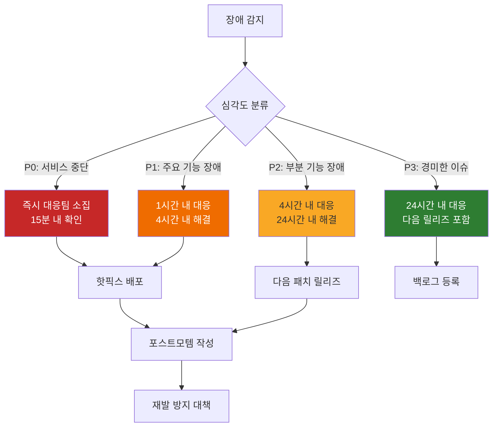

| 심각도 | 정의 | 대응 시간 | 해결 시간 | 에스컬레이션 |
|--------|------|-----------|-----------|-------------|
| **P0 (Critical)** | 전체 서비스 중단 | 15분 | 2시간 | CTO 즉시 보고 |
| **P1 (High)** | 주요 기능 장애 (채팅, MARS) | 1시간 | 4시간 | VP 보고 |
| **P2 (Medium)** | 부분 기능 장애 | 4시간 | 24시간 | 팀 리드 보고 |
| **P3 (Low)** | 경미한 이슈, UI 버그 | 24시간 | 다음 릴리즈 | 백로그 등록 |

### 11.3 고객 지원 체계

| 채널 | Basic | Pro | Enterprise |
|------|:-----:|:---:|:----------:|
| 셀프서비스 FAQ | O | O | O |
| 커뮤니티 포럼 | O | O | O |
| 이메일 지원 | - | O (24h 응답) | O (4h 응답) |
| 채팅 지원 | - | 업무 시간 | **24/7** |
| 전화 지원 | - | - | O |
| 전담 CSM | - | - | **전담 1명** |
| 온보딩 교육 | 온라인 자료 | 웨비나 | **현장 교육** |
| 분기 비즈니스 리뷰 | - | - | O |

### 11.4 모니터링 체계

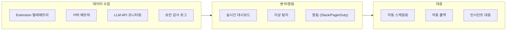

| 모니터링 영역 | 도구 | 주기 | 알림 채널 |
|---------------|------|------|-----------|
| 서버 인프라 | Prometheus + Grafana | 10초 | PagerDuty (P0-P1), Slack (P2-P3) |
| Extension 성능 | Custom Telemetry | 1분 | Slack 알림 |
| LLM API 상태 | Health Check | 30초 | PagerDuty (다운 시) |
| 보안 이벤트 | SIEM (Splunk) | 실시간 | 보안팀 즉시 알림 |
| 사용자 행동 | Analytics | 일간 | 주간 리포트 |
| 비용 모니터링 | Cost Dashboard | 시간 | 예산 90% 초과 시 알림 |

### 11.5 업데이트 주기 및 릴리즈 관리

| 릴리즈 유형 | 주기 | 내용 | 배포 방식 |
|-------------|------|------|-----------|
| **Hotfix** | 수시 (P0/P1) | 긴급 버그/보안 패치 | 즉시 자동 업데이트 |
| **Patch** | 격주 (화요일) | 버그 수정, 소규모 개선 | 자동 업데이트 |
| **Minor** | 월간 (첫째 주 화요일) | 새 기능, UX 개선 | 자동 업데이트 + 변경 로그 |
| **Major** | 분기 | 대규모 기능 추가, 아키텍처 변경 | 단계적 롤아웃 (10%→50%→100%) |

**릴리즈 프로세스**:

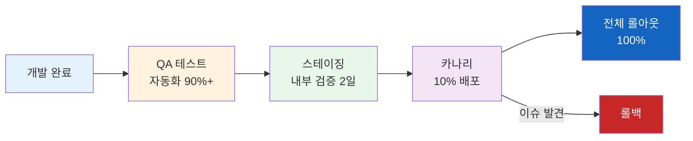

### 11.6 데이터 보안 운영

| 보안 영역 | 운영 정책 | 모니터링 |
|-----------|-----------|----------|
| PII 스크러빙 | 11패턴 실시간 적용 (이름, 전화, 이메일, 주민번호, 계좌, IP 등) | 정확도 99.9%+ 실시간 모니터링 |
| 블록리스트 | 20개 도메인 + 6개 URL 패턴 차단 | 차단 이벤트 실시간 로깅 |
| 사내 Proxy | 모든 LLM API 요청 사내 Proxy 경유 | 트래픽 감사 로그 |
| 감사 로그 | 모든 사용자 액션 기록 | Enterprise: 무제한 보관 |
| 취약점 스캔 | 주간 자동 보안 스캔 (DAST + SAST) | 취약점 발견 시 즉시 알림 |
| 침투 테스트 | 분기별 외부 전문 업체 | 보고서 + 개선 액션 |

### 11.7 재해 복구 (DR) 계획

| 항목 | 목표 | 방안 |
|------|------|------|
| RPO (복구 시점 목표) | <1시간 | 실시간 데이터 복제 |
| RTO (복구 시간 목표) | <4시간 | 멀티 리전 장애 조치 |
| 백업 | 일간 전체 + 실시간 증분 | 3개 리전 분산 저장 |
| DR 훈련 | 반기별 | 시나리오 기반 모의 훈련 |

---

## 12. 부록: 기능 우선순위 매트릭스

### 12.1 Impact-Effort 매트릭스

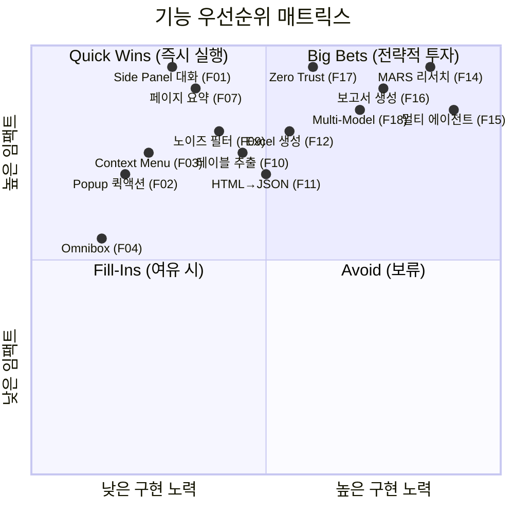

### 12.2 기능 우선순위 상세 표

| 우선순위 | 기능 ID | 기능명 | Impact (1-5) | Effort (1-5) | 스코어 | Phase | 의존성 |
|:--------:|:-------:|--------|:------------:|:------------:|:------:|:-----:|--------|
| **P0** | F01 | Side Panel 대화 | 5 | 3 | **10** | Stage 1 | - |
| **P0** | F17 | Zero Trust 보안 | 5 | 4 | **9** | Stage 1 | - |
| **P0** | F07 | 페이지 자동 요약 | 5 | 2 | **9** | Stage 1 | F01 |
| **P0** | F18 | Dynamic Multi-Model | 5 | 4 | **9** | Stage 1 | F01 |
| **P1** | F03 | Context Menu 분석 | 4 | 2 | **8** | Stage 1 | F01 |
| **P1** | F02 | Popup 퀵액션 | 4 | 1 | **8** | Stage 1 | F01 |
| **P1** | F09 | 스마트 노이즈 필터 | 4 | 3 | **7** | Stage 1 | F07 |
| **P1** | F08 | 선택 텍스트 분석 | 4 | 2 | **7** | Stage 1 | F03 |
| **P2** | F10 | 테이블/차트 추출 | 4 | 3 | **7** | Stage 1-2 | F09 |
| **P2** | F11 | HTML→JSON 변환 | 3 | 3 | **6** | Stage 2 | F10 |
| **P2** | F12 | Excel 자동 생성 | 4 | 3 | **7** | Stage 2 | F11 |
| **P2** | F06 | Content Script 오버레이 | 3 | 3 | **6** | Stage 2 | F01 |
| **P2** | F04 | Omnibox 통합검색 | 3 | 2 | **6** | Stage 2 | F01 |
| **P3** | F14 | MARS 자율 리서치 | 5 | 5 | **8** | Stage 2 | F10, F11 |
| **P3** | F16 | 보고서 자동 생성 | 5 | 4 | **8** | Stage 2 | F14 |
| **P3** | F13 | 크로스 페이지 병합 | 3 | 4 | **5** | Stage 2-3 | F11 |
| **P4** | F15 | 멀티 에이전트 협업 | 5 | 5 | **7** | Stage 3 | F14 |
| **P4** | F05 | Service Worker 동기화 | 3 | 3 | **6** | Stage 2-3 | F01 |

### 12.3 릴리즈 로드맵 요약

| Stage | 기간 | 핵심 기능 | 사용자 가치 |
|-------|------|-----------|-------------|
| **Stage 1** | 0-6M | F01, F02, F03, F07, F08, F09, F17, F18 | "브라우저에서 AI와 대화하며 페이지를 이해한다" |
| **Stage 2** | 6-18M | F04, F05, F06, F10, F11, F12, F14, F16 | "데이터를 추출하고 AI가 자율적으로 리서치한다" |
| **Stage 3** | 18-30M | F13, F15 + 산업 특화 에이전트 | "멀티 에이전트가 복합 업무를 자율 수행한다" |

### 12.4 기술 의존성 다이어그램

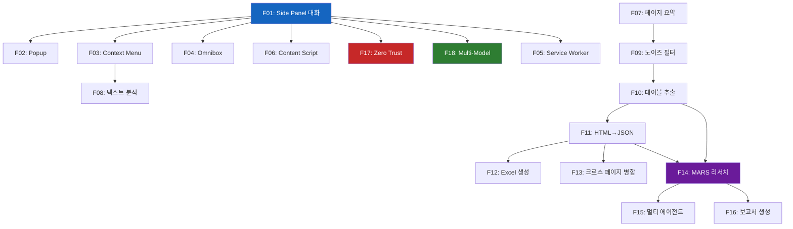

### 12.5 MoSCoW 요약

| 분류 | 기능 | 비율 |
|------|------|------|
| **Must Have** | F01, F02, F03, F07, F08, F09, F17, F18 | 8개 (44%) |
| **Should Have** | F04, F05, F06, F10, F11, F12 | 6개 (33%) |
| **Could Have** | F13, F14, F16 | 3개 (17%) |
| **Won't Have (Now)** | F15 (멀티 에이전트 - Stage 3에서) | 1개 (6%) |

---

## 부록 A: 용어 정의

| 용어 | 정의 |
|------|------|
| **MV3** | Chrome Extension Manifest V3 — Chrome 확장 프로그램의 최신 플랫폼 |
| **Side Panel** | Chrome 브라우저 우측에 고정되는 패널 인터페이스 |
| **Content Script** | 웹 페이지에 주입되어 DOM에 접근하는 Extension 스크립트 |
| **Service Worker** | Extension의 백그라운드 이벤트 처리 스크립트 |
| **MARS** | Multi-Agent Research System — 다중 에이전트 자율 리서치 시스템 |
| **Smart DOM** | Readability.js + RQFP 기반 지능형 DOM 파싱 엔진 |
| **DataFrame** | HTML 데이터를 정형화(JSON/CSV/Excel)하는 변환 레이어 |
| **PII** | Personally Identifiable Information — 개인 식별 정보 |
| **Forcelist** | Chrome 정책 기반 Extension 강제 설치 메커니즘 |
| **RQFP** | Readability Quality Filtering Pipeline — 콘텐츠 품질 필터 파이프라인 |
| **NRR** | Net Revenue Retention — 순수익유지율 (업셀/다운셀/이탈 반영) |
| **CWS** | Chrome Web Store — Chrome 확장 프로그램 배포 플랫폼 |
| **DAU/MAU** | Daily/Monthly Active Users — 일간/월간 활성 사용자 |

## 부록 B: 변경 이력

| 버전 | 날짜 | 변경 내용 | 작성자 |
|------|------|-----------|--------|
| v1.0 | 2026-03-15 | 초안 작성 (12개 섹션 전체) | H Chat 서비스기획팀 |

---

> **Confidential** — 본 문서는 현대차그룹 내부 검토용이며, 외부 유출 시 법적 책임이 따릅니다.
