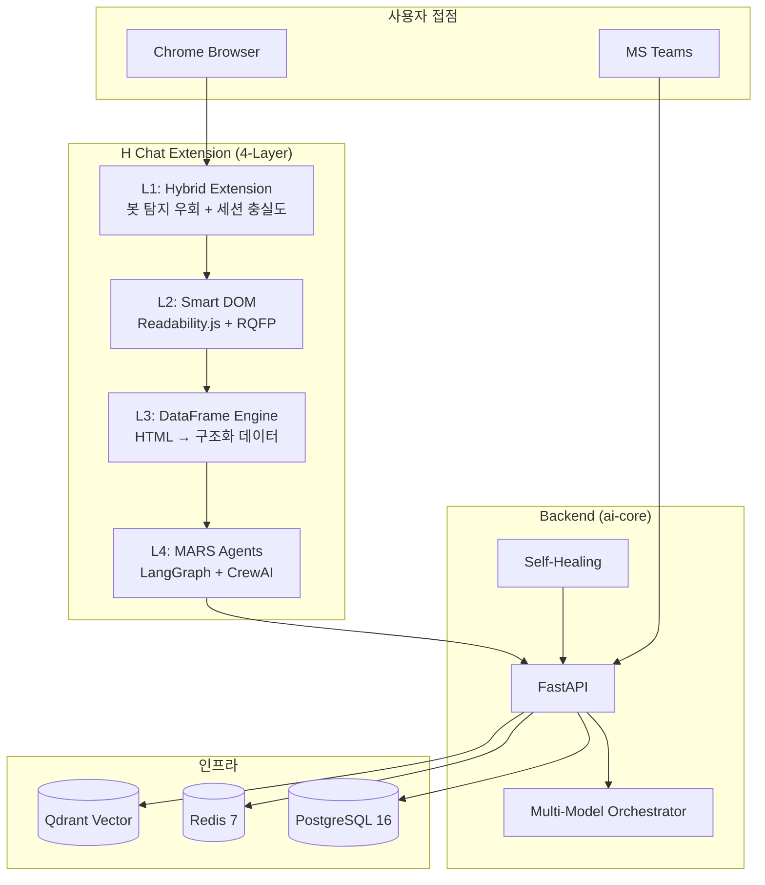

# H Chat AI Browser OS — 서비스 기획서

> **현대오토에버 H Chat** | Chrome Extension 기반 엔터프라이즈 AI 브라우저 서비스
> 작성일: 2026-03-14 | PM 총괄 | Worker A~D 병렬 작성 통합
> 기반 문서: 분석 2건 + 구현 설계 11건 + 개발 계획 6건 + 에코시스템 보정 4건

---

## 서비스 포지셔닝

> **"현대차그룹 임직원을 위한 사내 전용 AI 브라우저 OS.
> 웹을 데이터베이스로 전환하고, AI 에이전트가 자율적으로 조사·분석·실행하는
> 엔터프라이즈 지능형 플랫폼."**

---

## 기획서 구성

```
SERVICE_PLAN_00_MASTER.md (본 문서) ← PM 통합
 ├── Part 1: 서비스 개요 + 시장 분석 + 사용자 페르소나
 ├── Part 2: 핵심 기능 명세 + UX 시나리오
 ├── Part 3: 기술 아키텍처 + 보안 + 인프라
 └── Part 4: 비즈니스 모델 + 로드맵 + KPI
```

| Part | 문서 | 내용 |
|------|------|------|
| 1 | [SERVICE_PLAN_01_OVERVIEW](./SERVICE_PLAN_01_OVERVIEW.md) | 비전, 시장, 경쟁, 페르소나, 여정 맵 |
| 2 | [SERVICE_PLAN_02_FEATURES](./SERVICE_PLAN_02_FEATURES.md) | 기능 명세 15개, UX 시나리오 10개, UI 구성 |
| 3 | [SERVICE_PLAN_03_ARCHITECTURE](./SERVICE_PLAN_03_ARCHITECTURE.md) | 시스템 아키텍처, API, 보안, 인프라 |
| 4 | [SERVICE_PLAN_04_BUSINESS](./SERVICE_PLAN_04_BUSINESS.md) | BMC, 수익, GTM, 로드맵, KPI, ROI |

---

## Executive Summary

### 서비스 개요

| 항목 | 내용 |
|------|------|
| **서비스명** | H Chat AI Browser OS |
| **형태** | Chrome Extension + FastAPI Backend |
| **타겟** | 현대차그룹 임직원 (5만+명) |
| **핵심 가치** | 사내 시스템 AI 자동화, 데이터 주권 보장, 자율형 리서치 |
| **기술 기반** | 4-Layer Stack (Extension → Smart DOM → DataFrame → MARS) |
| **차별점** | 사내 시스템 직접 접근 (Confluence/Jira/SAP), Zero Trust, 봇 탐지 우회 |

### 핵심 수치

```
┌─────────────────────────────────────────────────────┐
│  시장 | AI 브라우저 시장 $2.1B (2026) → $8.7B (2030) │
│  비용 | 총 투자 $645K / 연간 절감 $550K              │
│  ROI  | 12개월 회수 / 3년 220%                       │
│  팀   | 11명 전담 + 2명 유지보수 = 13명               │
│  기간 | Sprint 0 (14일) + Phase 1~4 (28주) = 30주     │
│  기능 | 15개 핵심 기능 / 10개 UX 시나리오              │
│  KPI  | 자동화 81%+ / 비용 $0.12/작업 / 복구 55-70%↓  │
└─────────────────────────────────────────────────────┘
```

### 제품 아키텍처



### 경쟁 포지셔닝

```
                    개인 생산성 ─────────────── 엔터프라이즈 자동화
                         │                              │
  정보 검색              Arc Search                      │
  (passive)              │                              │
                         │         ChatGPT Atlas         │
                         │              │                │
  작업 실행              │    Perplexity Comet           │
  (active)               │              │         ┌─────┴──────┐
                         │              │         │ H Chat OS  │
  자율 연구              │              │         │ (사내 시스템│
  (autonomous)           │              │         │  직접 접근) │
                         │              │         └────────────┘
```

### 출시 로드맵 요약

| 단계 | 시점 | 마일스톤 |
|------|------|---------|
| **Alpha** | Week 2 (Sprint 0 완료) | Smart DOM + 단일 에이전트 데모 |
| **Beta** | Week 18 (Phase 2 완료) | 5종 에이전트, HITL, Teams 연동 |
| **GA** | Week 30 (Phase 4 완료) | Multi-Model, Self-Healing, 보안 심사 통과 |
| **Scale** | Week 30+ | 그룹사 확산, 외부 B2B |

### 성공 기준

| 시점 | 기준 |
|------|------|
| **6개월** | DAU 500+, NPS 40+, 자동화 성공률 75%+ |
| **12개월** | DAU 2,000+, 투자 회수, 3개 그룹사 도입 |
| **24개월** | DAU 5,000+, ARR $1M+, 외부 B2B 1건+ |

---

## 관련 문서 전체 인덱스

### 분석 문서
- [The Agentic Enterprise 분석](./The_Agentic_Enterprise_Analysis.md)
- [Autonomous Browser OS 분석](./Autonomous_Browser_OS_Analysis.md)

### 구현 설계
- [에이전틱 블루프린트](./IMPL_00_AGENTIC_ENTERPRISE_BLUEPRINT.md)
- [소버린 데이터 파이프라인](./IMPL_01_SOVEREIGN_DATA_PIPELINE.md)
- [Self-Healing 시스템](./IMPL_04_SELF_HEALING_SYSTEM.md)
- [보안 거버넌스 프레임워크](./IMPL_05_SECURITY_GOVERNANCE_FRAMEWORK.md)
- [Browser OS 01~04](./IMPL_BROWSER_OS_00_INTEGRATED.md)

### 개발 계획
- [마스터 플랜 v2](./DEV_PLAN_00_MASTER_v2.md)
- [Sprint 0](./DEV_PLAN_01_SPRINT_0.md) / [Phase 1-2](./DEV_PLAN_02_PHASE_1_2.md) / [Phase 3-4](./DEV_PLAN_03_PHASE_3_4.md)
- [테스트/CI/CD/팀](./DEV_PLAN_04_TEST_CICD_TEAM.md)

### 에코시스템
- [에코시스템 심층분석](./ECOSYSTEM_DEEP_ANALYSIS.md)
- [통합 전략](./ECOSYSTEM_INTEGRATION_STRATEGY.md)
- [리스크 완화](./RISK_MITIGATION_AND_QUICK_WINS.md)
- [Extension 설계안](./CHROME_EXTENSION_DESIGN.md) / [구현방안](./CHROME_EXTENSION_IMPLEMENTATION.md)

---

> **"The Browser is the New OS. 웹은 더 이상 읽기 위한 공간이 아닙니다.**
> **AI 에이전트가 활동하는 지능형 환경입니다."**
