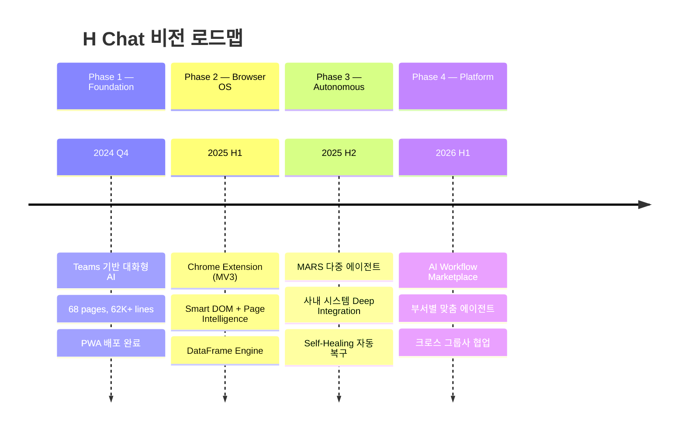
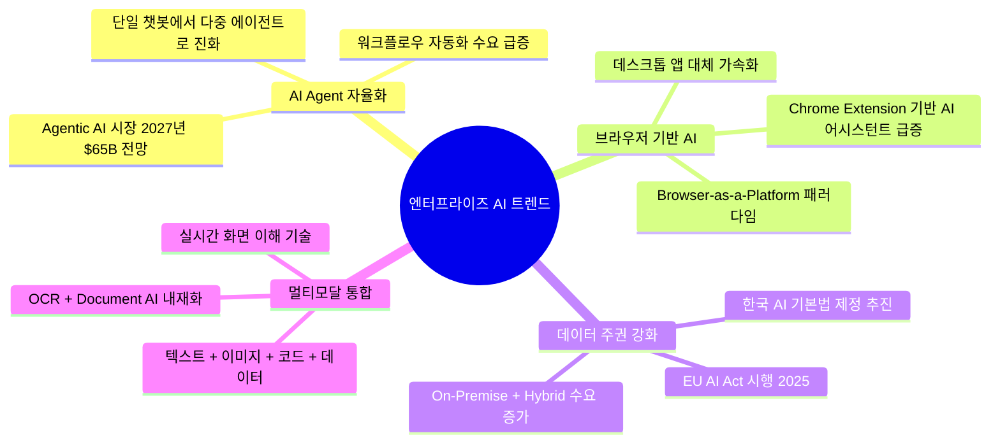
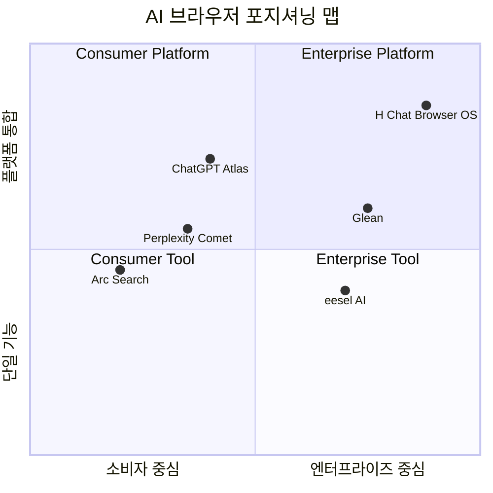
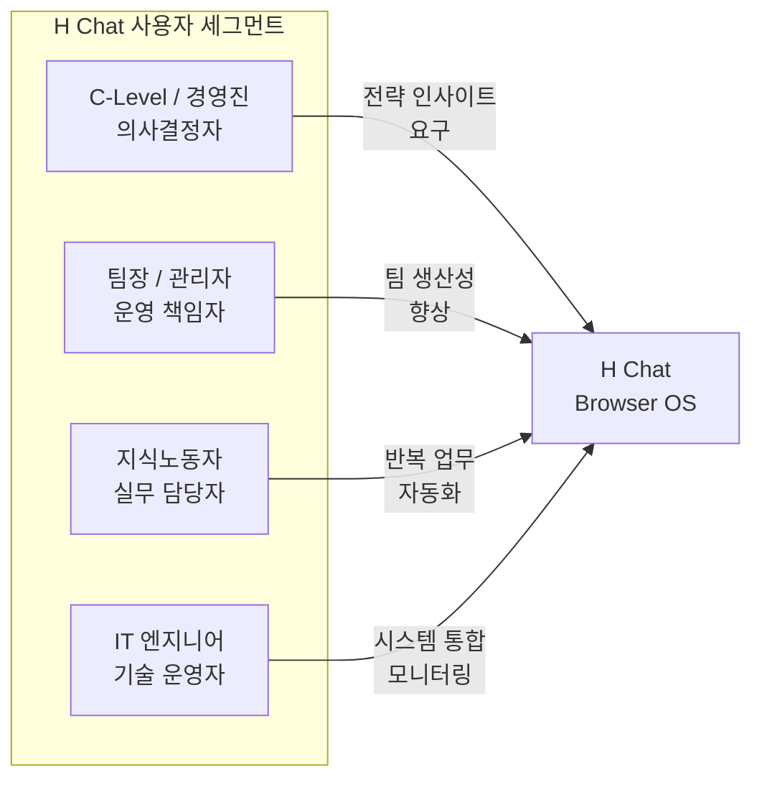
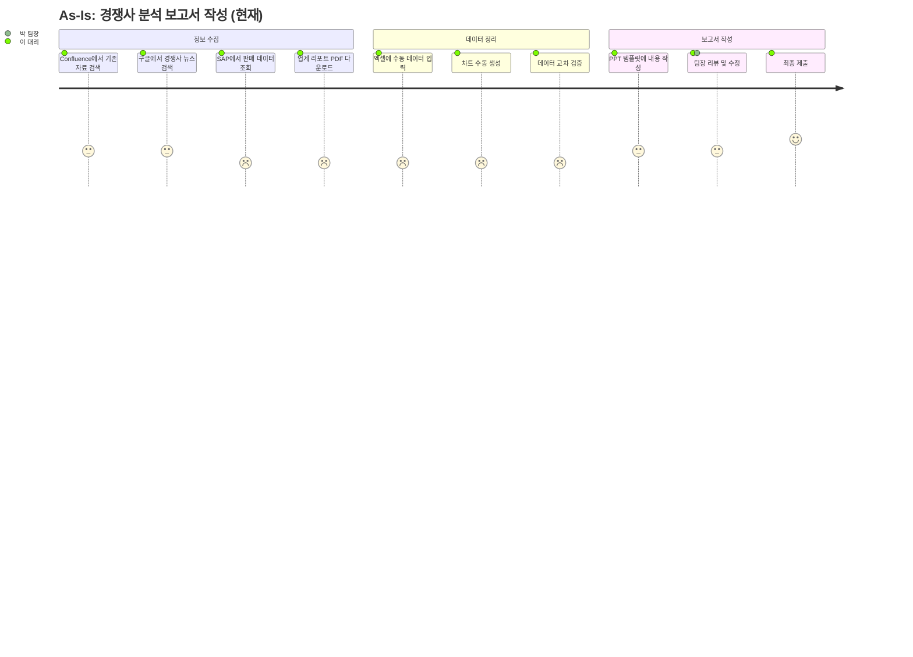
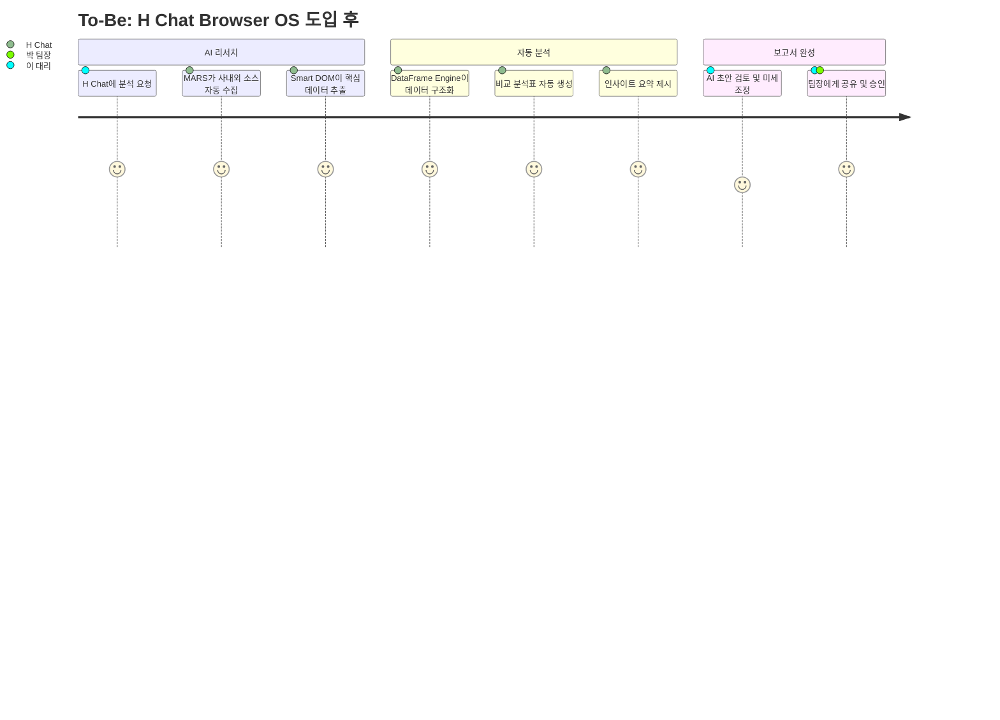
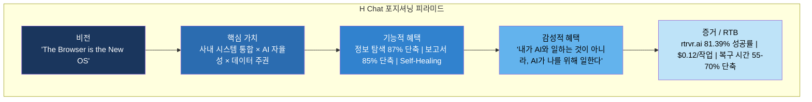

# H Chat 서비스 기획서 Part 1: 서비스 개요, 시장 분석, 사용자 페르소나

> **문서 버전**: v1.0
> **작성일**: 2026-03-14
> **분류**: 서비스 기획 — 전략 개요
> **대상 독자**: 경영진, PO, 서비스 기획팀, 개발 리드

---

## 1. 서비스 비전 및 미션

### 1.1 비전 선언

**"The Browser is the New OS"**

브라우저는 더 이상 웹페이지를 렌더링하는 도구가 아니다. 업무의 90% 이상이 브라우저 위에서 이루어지는 현대 기업 환경에서, 브라우저는 사실상의 운영체제다. H Chat은 이 브라우저 OS 위에서 동작하는 **AI-Native 업무 플랫폼**으로서, 현대차그룹 13만 임직원의 업무 방식을 근본적으로 재설계한다.

### 1.2 미션

> 현대차그룹 임직원이 **사내 시스템의 경계를 의식하지 않고**, AI와 자연어로 대화하며 **정보 탐색-분석-의사결정-실행**을 하나의 흐름으로 완결하는 세계를 만든다.

### 1.3 H Chat이 해결하는 핵심 문제

| 문제 영역 | 현재 상황 (Pain Point) | H Chat 해결 방식 |
|-----------|----------------------|-----------------|
| **컨텍스트 분절** | Confluence, Jira, SAP, Teams 등 평균 7개 이상의 시스템을 오가며 업무 수행 | Browser OS가 모든 시스템을 단일 AI 인터페이스로 통합 |
| **정보 과부하** | 검색 결과의 60-70%가 노이즈, 필요한 정보 도달까지 평균 23분 소요 | Smart DOM + RQFP로 노이즈 60-70% 제거, 핵심 정보만 추출 |
| **반복 업무** | 주간 보고서 작성, 데이터 수집, 비교 분석 등 반복 작업에 주당 8-12시간 소모 | MARS 다중 에이전트가 자율 연구 및 보고서 자동 생성 |
| **데이터 주권** | 퍼블릭 AI 서비스에 사내 데이터 입력 시 유출 리스크 | Zero Trust 아키텍처, 사내 시스템 직접 접근, 데이터 외부 유출 원천 차단 |

### 1.4 비전 로드맵

---

## 2. 시장 분석

### 2.1 AI 브라우저 시장 규모 및 성장률

| 지표 | 2024 | 2025(E) | 2027(E) | CAGR |
|------|------|---------|---------|------|
| 글로벌 AI 브라우저/어시스턴트 시장 | $4.2B | $7.8B | $18.5B | 48.2% |
| 엔터프라이즈 AI 소프트웨어 시장 | $62B | $98B | $210B | 35.7% |
| 한국 기업 AI 시장 | $3.1B | $5.2B | $11.8B | 39.4% |

> **출처**: Gartner (2024), IDC Asia/Pacific AI Tracker (2024), KAIA 한국AI산업협회 (2024)

### 2.2 엔터프라이즈 AI 시장 트렌드

**핵심 트렌드 요약**:
- **Agentic AI 전환**: 단순 Q&A 챗봇에서 자율적으로 업무를 수행하는 AI 에이전트로 시장 패러다임 전환. 2025년 Fortune 500 기업의 40%가 AI 에이전트 파일럿 운영 예상.
- **Browser-as-a-Platform**: 브라우저가 새로운 앱 배포 및 실행 플랫폼으로 부상. Chrome Extension 기반 AI 도구 시장 연평균 62% 성장.
- **데이터 주권 규제 강화**: EU AI Act, 한국 AI 기본법 등 규제로 인해 사내 데이터가 외부 AI 서비스로 유출되지 않는 아키텍처 필수화.

### 2.3 한국 기업 AI 도입 현황

| 구분 | 비율 | 비고 |
|------|------|------|
| AI 도입 기업 (대기업 기준) | 72% | 2024년 기준, 전년 대비 +18%p |
| 생성형 AI 활용 기업 | 54% | 주로 문서 작성, 번역, 요약 |
| AI를 핵심 업무에 통합한 기업 | 19% | 의사결정, 자동화까지 확장한 기업 |
| AI 도입 최대 장벽 1위 | 데이터 보안 | 응답 기업의 68%가 선택 |
| AI 도입 최대 장벽 2위 | 기존 시스템 연동 | 응답 기업의 57%가 선택 |

> H Chat의 **Zero Trust 아키텍처**와 **사내 시스템 직접 연동**은 한국 기업이 겪는 상위 2개 장벽을 정면으로 해결한다.

---

## 3. 경쟁 분석

### 3.1 AI 브라우저 경쟁 지형 맵

### 3.2 경쟁사 상세 비교

| 차원 | ChatGPT Atlas | Perplexity Comet | Arc Search | eesel AI | **H Chat** |
|------|--------------|-----------------|------------|----------|-----------|
| **포지션** | Workflow Co-pilot | Intelligent Researcher | Info Synthesizer | 사내 AI 어시스턴트 | **Enterprise Browser OS** |
| **핵심 강점** | 유연한 워크플로우, 프라이버시 우선 | 실시간 웹 그라운딩, 출처 표기 | 'Browse for Me', 모바일 UX | Confluence/Slack 연동 | **사내 시스템 직접 접근, 4-Layer 아키텍처** |
| **데이터 주권** | 옵트아웃 가능 | 제한적 | 없음 | 부분적 | **Zero Trust 완전 보장** |
| **사내 시스템 연동** | API 연동 필요 | 없음 | 없음 | Confluence/Slack | **Confluence/Jira/SAP/ERP 직접 접근** |
| **에이전트 자율성** | 중간 (GPT Actions) | 중간 (검색 특화) | 낮음 | 낮음 | **높음 (MARS 다중 에이전트)** |
| **DOM 이해도** | 기본 | 기본 | 기본 | N/A | **Smart DOM (노이즈 60-70% 제거)** |
| **자가 복구** | 없음 | 없음 | 없음 | 없음 | **Self-Healing (복구 55-70% 단축)** |
| **멀티모델** | GPT 단일 | 다중 (제한적) | 단일 | 단일 | **Dynamic Multi-Model (5종+)** |
| **대상** | 개인/SMB | 개인/리서처 | 개인 | 중소기업 | **대기업 그룹사** |

### 3.3 H Chat의 차별적 가치 제안 (Value Proposition)

```mermaid
block-beta
    columns 3
    block:pain["고객의 핵심 과제"]
        p1["7+ 시스템 컨텍스트 스위칭"]
        p2["사내 데이터 AI 유출 리스크"]
        p3["반복 업무에 낭비되는 시간"]
    end
    block:solution["H Chat 솔루션"]
        s1["Browser OS 단일 인터페이스"]
        s2["Zero Trust + 데이터 주권"]
        s3["MARS 자율 에이전트"]
    end
    block:value["창출 가치"]
        v1["업무 생산성 40% 향상"]
        v2["보안 컴플라이언스 100% 충족"]
        v3["주당 8-12시간 절감"]
    end
    p1 --> s1
    p2 --> s2
    p3 --> s3
    s1 --> v1
    s2 --> v2
    s3 --> v3
```

**H Chat만의 3가지 결정적 차별점**:

1. **사내 시스템 네이티브 접근**: 경쟁사가 API 연동이나 커넥터에 의존하는 반면, H Chat은 Browser OS의 L1 레이어(Hybrid Chrome Extension & Playwright)를 통해 Confluence, Jira, SAP 등 사내 시스템에 직접 접근한다. 별도의 API 구축 없이 기존 웹 인터페이스 그대로 활용.

2. **4-Layer 지능형 아키텍처**: Smart DOM(L2)이 웹 페이지의 노이즈를 60-70% 제거하고, DataFrame Engine(L3)이 비정형 HTML을 구조화 데이터로 변환하며, MARS(L4)가 다중 에이전트로 복합 연구를 자율 수행한다. 이 수직 통합은 경쟁사에서 찾아볼 수 없다.

3. **Zero Trust 데이터 주권**: 사내 데이터가 외부 AI 서비스 서버를 경유하지 않는 아키텍처. 한국 기업 AI 도입 장벽 1위인 데이터 보안을 구조적으로 해결한다.

---

## 4. 타겟 사용자 페르소나

### 4.1 페르소나 개요

### 4.2 페르소나 상세

#### 페르소나 1: 경영진 — "전략적 의사결정자 김 상무"

| 항목 | 내용 |
|------|------|
| **역할** | 현대자동차 전략기획실 상무, 50대 |
| **업무 패턴** | 주간 경영 회의 준비, 시장 동향 분석, 투자 의사결정 |
| **핵심 니즈** | 복수 소스의 데이터를 통합한 신뢰 가능한 인사이트를 빠르게 확보 |
| **현재 불편** | 팀원에게 자료 요청 후 2-3일 대기, 정보 신선도 저하, 다중 보고서 교차 검증에 과도한 시간 |
| **기대 가치** | AI에게 "지난 분기 EV 시장 점유율 변화와 우리 그룹의 포지션 분석해줘"라고 요청하면, 사내 SAP 데이터 + 외부 시장 리포트를 종합한 브리핑 자동 생성 |
| **성공 지표** | 의사결정 소요 시간 50% 단축, 보고서 요청-수령 리드타임 3일 → 30분 |

#### 페르소나 2: 관리자 — "팀 성과 관리자 박 팀장"

| 항목 | 내용 |
|------|------|
| **역할** | 현대오토에버 클라우드서비스팀 팀장, 40대 |
| **업무 패턴** | 프로젝트 진행 현황 파악, 주간 보고서 작성, 팀원 업무 배분 |
| **핵심 니즈** | 팀 업무 현황을 실시간으로 파악하고, 보고서 작성 시간을 최소화 |
| **현재 불편** | Jira 티켓 수십 개를 일일이 확인, Confluence에서 산재한 문서 취합, 주간 보고서 작성에 매주 3시간 소요 |
| **기대 가치** | "이번 주 우리 팀 Jira 진행 현황과 블로커 정리해줘"라고 하면, Jira + Confluence를 크로스 분석한 주간 보고서 초안 자동 생성 |
| **성공 지표** | 주간 보고서 작성 시간 3시간 → 20분, 프로젝트 리스크 조기 감지율 2배 향상 |

#### 페르소나 3: 지식노동자 — "리서치 실무자 이 대리"

| 항목 | 내용 |
|------|------|
| **역할** | 현대차 상품기획팀 대리, 30대 |
| **업무 패턴** | 경쟁사 분석, 시장 리서치, 기획서 작성, 데이터 시각화 |
| **핵심 니즈** | 다양한 소스에서 정보를 수집-비교-분석하는 리서치 업무의 효율화 |
| **현재 불편** | 평균 7개 시스템을 오가며 정보 수집, 수동 데이터 정리에 하루 4시간, 분석 결과의 일관성 유지 어려움 |
| **기대 가치** | "테슬라/BYD/토요타의 최신 EV 라인업과 가격 정책을 비교 분석하고 표로 정리해줘"라고 하면, 웹 리서치 + 사내 데이터를 결합한 구조화된 비교표 자동 생성 |
| **성공 지표** | 리서치 소요 시간 60% 절감, 정보 수집 범위 3배 확대, 분석 품질 표준화 |

#### 페르소나 4: IT 엔지니어 — "시스템 운영자 최 과장"

| 항목 | 내용 |
|------|------|
| **역할** | 현대오토에버 인프라운영팀 과장, 30대 |
| **업무 패턴** | 시스템 모니터링, 장애 대응, 보안 감사, 인프라 구성 관리 |
| **핵심 니즈** | AI 서비스의 안전한 사내 배포와 운영, 보안 컴플라이언스 확보 |
| **현재 불편** | 퍼블릭 AI 서비스의 데이터 유출 리스크 관리 부담, 신규 AI 도구 보안 검증에 수개월 소요, 사용자 권한 관리 복잡 |
| **기대 가치** | Zero Trust 아키텍처로 보안 검증 기간 대폭 단축, 통합 관리 콘솔에서 사용자별 권한-사용량-비용 일괄 관리 |
| **성공 지표** | 보안 검증 기간 6개월 → 2주, AI 관련 보안 인시던트 제로, 운영 관리 공수 70% 절감 |

---

## 5. 사용자 여정 맵

### 5.1 As-Is vs To-Be 비교

### 5.2 터치포인트별 경험 변화

| 터치포인트 | As-Is 경험 | To-Be 경험 | 개선 효과 |
|-----------|-----------|-----------|----------|
| **정보 탐색** | 7개 시스템 수동 탐색, 평균 23분/건 | H Chat 단일 인터페이스에서 자연어 검색, 평균 3분/건 | **87% 시간 단축** |
| **데이터 수집** | 복사-붙여넣기, 수동 엑셀 정리, 2-4시간 | Smart DOM + DataFrame 자동 수집-구조화, 10분 | **95% 시간 단축** |
| **분석/비교** | 수동 교차 검증, 일관성 유지 어려움 | MARS 에이전트가 다각도 자동 분석, 출처 명시 | **정확도 + 속도 동시 향상** |
| **보고서 작성** | 빈 문서에서 시작, 3-5시간 | AI 초안 기반 검토-수정, 30분 | **85% 시간 단축** |
| **협업/공유** | 이메일/Teams에 파일 첨부, 버전 혼란 | H Chat 내 실시간 공유, 이력 자동 관리 | **협업 마찰 제거** |
| **보안 관리** | IT팀 별도 보안 검토, 사후 모니터링 | Zero Trust 내장, 실시간 감사 로그 | **보안 사각지대 제거** |

---

## 6. 핵심 가치 제안 캔버스

### 6.1 Value Proposition Canvas

```mermaid
block-beta
    columns 2
    block:customer["고객 프로필 (Customer Profile)"]
        columns 1
        block:jobs["고객의 할 일 (Jobs)"]
            j1["사내외 정보 수집 및 분석"]
            j2["보고서/기획서 작성"]
            j3["프로젝트 현황 파악"]
            j4["의사결정을 위한 데이터 확보"]
        end
        block:pains["고통 (Pains)"]
            pa1["7+ 시스템 컨텍스트 스위칭"]
            pa2["정보 노이즈 과부하"]
            pa3["반복 수작업 시간 낭비"]
            pa4["데이터 유출 보안 리스크"]
        end
        block:gains["기대 이득 (Gains)"]
            g1["하나의 인터페이스로 모든 업무"]
            g2["신뢰할 수 있는 AI 분석 결과"]
            g3["주당 8-12시간 확보"]
            g4["보안 컴플라이언스 자동 충족"]
        end
    end
    block:value["가치 맵 (Value Map)"]
        columns 1
        block:products["제품/서비스"]
            pr1["Browser OS (4-Layer)"]
            pr2["MARS 다중 에이전트"]
            pr3["Dynamic Multi-Model"]
            pr4["Zero Trust 아키텍처"]
        end
        block:relievers["고통 해소제 (Pain Relievers)"]
            re1["단일 AI 인터페이스 통합"]
            re2["Smart DOM 노이즈 60-70% 제거"]
            re3["자율 에이전트 업무 위임"]
            re4["사내 데이터 외부 유출 원천 차단"]
        end
        block:creators["이득 창출제 (Gain Creators)"]
            cr1["사내 시스템 네이티브 접근"]
            cr2["구조화 데이터 즉시 분석"]
            cr3["Self-Healing 자동 복구"]
            cr4["부서별 맞춤 에이전트"]
        end
    end
```

### 6.2 비즈니스 모델 요소

| 구성 요소 | 내용 |
|-----------|------|
| **고객 세그먼트** | 현대차그룹 13만 임직원 (1차), 국내 대기업 그룹사 (2차), 글로벌 제조 대기업 (3차) |
| **가치 제안** | 사내 시스템과 AI를 브라우저 위에서 통합하여 업무 생산성 40% 향상 + 데이터 주권 100% 보장 |
| **채널** | Microsoft Teams 내장 (기존), Chrome Extension (확장), 전용 데스크톱 앱 (고급), 모바일 PWA (이동성) |
| **고객 관계** | 셀프서비스 AI (기본), 부서별 전담 CSM (고급), AI Workflow 커뮤니티 (확장) |
| **수익원** | 그룹 내부: IT 서비스 예산 배정, 외부: 사용자 수 기반 SaaS 라이선스 (Standard/Professional/Enterprise) |
| **핵심 자원** | Browser OS 4-Layer 기술 스택, Dynamic Multi-Model 인프라, 사내 시스템 연동 노하우 |
| **핵심 활동** | AI 모델 최적화, 사내 시스템 커넥터 개발, Smart DOM 정확도 향상, 보안 인증 유지 |
| **핵심 파트너** | Anthropic(Claude), Google(Gemini), OpenAI, Microsoft(Teams/Azure), SAP |
| **비용 구조** | LLM API 사용량 과금 (최대 비용), 인프라 운영, 개발 인력, 보안 인증 |

---

## 7. 서비스 포지셔닝 선언문

### 7.1 포지셔닝 스테이트먼트

> **사내 시스템에 흩어진 정보를 하나로 연결하여 더 빠르게 결정하고 싶은** 현대차그룹 임직원을 위해,
> **H Chat은** 브라우저 위에서 동작하는 **AI-Native 업무 플랫폼**입니다.
> ChatGPT Atlas나 Perplexity Comet과 달리,
> H Chat은 **Confluence/Jira/SAP에 직접 접근하는 4-Layer Browser OS 아키텍처**와 **Zero Trust 데이터 주권**을 통해
> **업무 생산성 40% 향상과 보안 컴플라이언스 100% 충족**을 동시에 달성합니다.

### 7.2 한 문장 포지션

> **"H Chat은 현대차그룹의 모든 사내 시스템을 AI로 통합하는 Browser OS이다."**

### 7.3 포지셔닝 피라미드

---

## 부록: 용어 정의

| 용어 | 정의 |
|------|------|
| **Browser OS** | 브라우저를 운영체제처럼 활용하여 AI 에이전트가 웹 기반 시스템을 직접 조작하는 아키텍처 |
| **Smart DOM** | Readability.js + RQFP를 결합하여 웹 페이지에서 핵심 콘텐츠만 추출하는 Page Intelligence 기술 |
| **DataFrame Engine** | 비정형 HTML을 구조화된 테이블/JSON으로 변환하여 즉시 분석 가능하게 하는 엔진 |
| **MARS** | Multi-Agent Research System. LangGraph + CrewAI 기반 다중 에이전트 자율 연구 시스템 |
| **RQFP** | Relevance-Quality Filtering Pipeline. 콘텐츠 관련성과 품질을 평가하여 노이즈를 제거하는 파이프라인 |
| **Zero Trust** | 모든 접근을 신뢰하지 않고 지속적으로 검증하는 보안 모델. 사내 데이터의 외부 유출을 구조적으로 차단 |
| **Self-Healing** | 웹 페이지 구조 변경이나 오류 발생 시 AI가 자동으로 감지하고 복구하는 메커니즘 |
| **Dynamic Multi-Model** | 작업 특성에 따라 Claude Opus 4.6, Gemini, ChatGPT 5.2, Grok, Nano Banana 등을 자동 선택하는 모델 라우팅 |

---

> **다음 문서**: [SERVICE_PLAN_02_ARCHITECTURE.md] — 시스템 아키텍처 및 기술 설계
