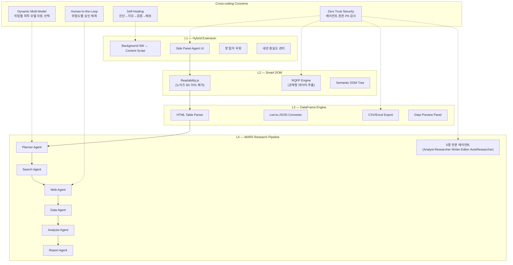
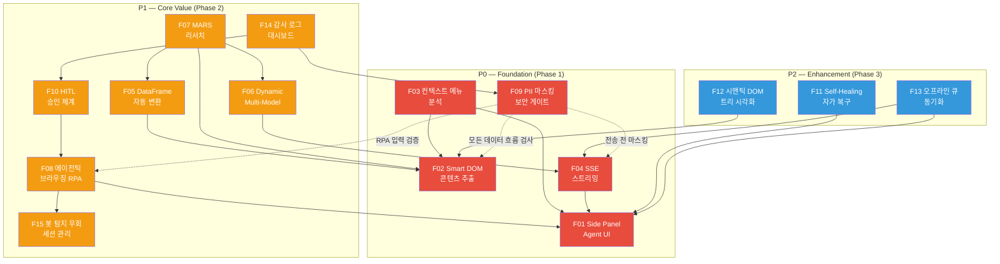

# H Chat Chrome Extension — 서비스 기획서 Part 2: 핵심 기능 명세 + UX 시나리오

| 항목 | 내용 |
|------|------|
| 문서 버전 | v1.0 |
| 작성일 | 2026-03-14 |
| 작성자 | Worker B (기능 명세 + UX 시나리오) |
| 상위 문서 | SERVICE_PLAN_01 (비전/전략), SERVICE_PLAN_03 (기술 아키텍처) |

---

## 1. 기능 아키텍처 개요

### 1.1 4-Layer + Cross-cutting 기능 맵



### 1.2 계층별 역할 요약

| Layer | 명칭 | 핵심 역할 | 주요 산출물 |
|-------|------|-----------|------------|
| L1 | Hybrid Extension | 브라우저 런타임, UI 셸, 메시징 | Side Panel, Context Menu, 알림 |
| L2 | Smart DOM | 웹페이지 구조 분석, 노이즈 제거 | 정제된 텍스트, 시맨틱 트리 |
| L3 | DataFrame | 정형 데이터 추출 및 변환 | JSON, CSV, Excel 파일 |
| L4 | MARS | 멀티 에이전트 리서치 파이프라인 | 분석 보고서, 액션 아이템 |

---

## 2. 핵심 기능 명세 (Feature Specification)

### F01. Side Panel Agent UI

| 항목 | 내용 |
|------|------|
| **Layer** | L1 |
| **우선순위** | P0 |
| **설명** | Chrome Side Panel API 기반 상시 에이전트 인터페이스. 채팅, 분석 결과, 작업 진행률을 브라우저 우측 패널에 표시한다. |
| **사용자 스토리** | 사용자로서 웹 브라우징 중 화면 전환 없이 AI에게 질문하고 결과를 받고 싶다. |
| **수용 기준** | (1) Side Panel 열기/닫기 토글이 0.3초 이내 반응 (2) 채팅 히스토리가 세션 간 유지 (3) 현재 탭 URL/제목이 컨텍스트로 자동 전달 (4) 다크/라이트 테마 지원 |

### F02. Smart DOM 콘텐츠 추출

| 항목 | 내용 |
|------|------|
| **Layer** | L2 |
| **우선순위** | P0 |
| **설명** | Readability.js로 광고·네비게이션·푸터 등 노이즈를 60-70% 제거하고, RQFP 엔진으로 엔티티 관계를 추출한다. |
| **사용자 스토리** | 사용자로서 복잡한 웹페이지에서 핵심 내용만 깔끔하게 추출하고 싶다. |
| **수용 기준** | (1) 뉴스/블로그 본문 추출 정확도 90% 이상 (2) 추출 소요 시간 2초 이내 (3) 이미지·표 포함 구조 보존 (4) 다국어(한/영/일/중) 지원 |

### F03. 컨텍스트 메뉴 분석

| 항목 | 내용 |
|------|------|
| **Layer** | L1 + L2 |
| **우선순위** | P0 |
| **설명** | 텍스트 선택 후 우클릭으로 요약/설명/번역/리서치 4가지 분석을 즉시 실행한다. |
| **사용자 스토리** | 사용자로서 영문 기술 문서의 특정 단락을 선택해 한국어 요약을 즉시 보고 싶다. |
| **수용 기준** | (1) 선택 텍스트 10,000자까지 처리 (2) 결과가 Side Panel에 스트리밍 표시 (3) 결과 복사/공유 버튼 제공 (4) 분석 이력 최근 50건 보관 |

### F04. SSE 스트리밍 응답

| 항목 | 내용 |
|------|------|
| **Layer** | L1 |
| **우선순위** | P0 |
| **설명** | AI Core 백엔드의 SSE 엔드포인트로부터 토큰 단위 스트리밍을 수신하여 실시간 타이핑 효과를 표시한다. |
| **사용자 스토리** | 사용자로서 AI 응답이 한꺼번에가 아닌 실시간으로 출력되어 대기 시간을 체감적으로 줄이고 싶다. |
| **수용 기준** | (1) 첫 토큰 표시까지 TTFT 500ms 이내 (2) 스트리밍 중 중단(Stop) 버튼 동작 (3) 네트워크 끊김 시 자동 재연결 (3회) (4) 마크다운 렌더링 실시간 반영 |

### F05. DataFrame 자동 변환

| 항목 | 내용 |
|------|------|
| **Layer** | L3 |
| **우선순위** | P1 |
| **설명** | 현재 페이지의 HTML 테이블과 리스트를 자동 감지하여 JSON/CSV로 변환하고 미리보기를 제공한다. |
| **사용자 스토리** | 사용자로서 사내 ERP 화면의 재고 테이블을 클릭 한 번으로 Excel 파일로 내려받고 싶다. |
| **수용 기준** | (1) 페이지 내 테이블 자동 감지율 95% (2) 1,000행 이하 테이블 변환 3초 이내 (3) JSON/CSV/XLSX 3종 내보내기 (4) 미리보기에서 열 필터링·정렬 가능 |

### F06. Dynamic Multi-Model 선택

| 항목 | 내용 |
|------|------|
| **Layer** | Cross-cutting |
| **우선순위** | P1 |
| **설명** | 작업 유형(요약/번역/코드/리서치/분석)에 따라 5개 모델 풀에서 최적 모델을 자동 선택한다. |
| **사용자 스토리** | 사용자로서 모델을 수동 선택하지 않아도 작업에 맞는 최적의 AI가 자동 배정되길 원한다. |
| **수용 기준** | (1) 모델 선택 지연 100ms 이내 (2) 사용자가 수동 오버라이드 가능 (3) 선택 근거 툴팁 표시 (4) 비용/성능 통계 대시보드 |

### F07. MARS 리서치 파이프라인

| 항목 | 내용 |
|------|------|
| **Layer** | L4 |
| **우선순위** | P1 |
| **설명** | Planner→Search→Web→Data→Analysis→Report 6단계 파이프라인으로 자율 리서치를 수행한다. |
| **사용자 스토리** | 사용자로서 "2025년 국내 생성형 AI 시장 동향"을 입력하면 10분 내에 구조화된 보고서를 받고 싶다. |
| **수용 기준** | (1) 파이프라인 각 단계 진행률 실시간 표시 (2) 중간 결과 검토 및 방향 수정 가능 (3) 최소 5개 출처 자동 인용 (4) 보고서 Markdown/PDF 내보내기 |

### F08. 에이전틱 브라우징 (RPA)

| 항목 | 내용 |
|------|------|
| **Layer** | L1 + L4 |
| **우선순위** | P1 |
| **설명** | 웹 애플리케이션(Zendesk, Jira, SAP, Confluence 등)에서 폼 입력, 클릭, 데이터 추출을 에이전트가 자동 수행한다. |
| **사용자 스토리** | 사용자로서 "Jira에서 미해결 P1 티켓을 팀별로 분류해줘"라고 말하면 자동으로 처리되길 원한다. |
| **수용 기준** | (1) 지원 SaaS 4종 이상 (2) 각 액션 전 사용자 확인 프롬프트 (3) 실행 로그 전체 기록 (4) 실패 시 자동 롤백 |

### F09. PII 마스킹 및 보안 게이트

| 항목 | 내용 |
|------|------|
| **Layer** | Cross-cutting (Zero Trust) |
| **우선순위** | P0 |
| **설명** | 주민번호, 전화번호, 이메일, 계좌번호 등 7가지 PII 패턴을 실시간 감지·마스킹하고, 블록리스트 도메인 접근을 차단한다. |
| **사용자 스토리** | 보안 담당자로서 직원이 AI에게 전송하는 데이터에서 개인정보가 자동으로 마스킹되길 원한다. |
| **수용 기준** | (1) 7종 PII 패턴 탐지율 99% (2) 마스킹 처리 50ms 이내 (3) 블록리스트 20도메인+6패턴 차단 (4) 마스킹 이벤트 감사 로그 기록 |

### F10. Human-in-the-Loop 승인 체계

| 항목 | 내용 |
|------|------|
| **Layer** | Cross-cutting |
| **우선순위** | P1 |
| **설명** | 에이전트 액션의 위험도를 Low/Medium/High로 분류하여 단계별 승인 프로세스를 적용한다. |
| **사용자 스토리** | 관리자로서 에이전트가 외부 시스템에 데이터를 쓰기 전에 반드시 승인을 받도록 하고 싶다. |
| **수용 기준** | (1) Low=자동 실행, Medium=팀장 승인, High=부서장 승인 (2) 승인 요청 알림 30초 이내 도달 (3) 72시간 미승인 시 자동 만료 (4) 승인 이력 감사 추적 |

### F11. Self-Healing 자가 복구

| 항목 | 내용 |
|------|------|
| **Layer** | Cross-cutting |
| **우선순위** | P2 |
| **설명** | Extension의 오류를 자동 진단하고, 캐시 초기화·서비스 워커 재시작·설정 복원 등으로 자가 치유한다. |
| **사용자 스토리** | 사용자로서 확장 프로그램 오류 시 수동 재설치 없이 자동으로 복구되길 원한다. |
| **수용 기준** | (1) 진단→치유→검증→배포 4단계 루프 (2) 복구 성공률 80% 이상 (3) 복구 실패 시 사용자에게 가이드 표시 (4) 진단 로그 자동 수집 |

### F12. 시맨틱 DOM 트리 시각화

| 항목 | 내용 |
|------|------|
| **Layer** | L2 |
| **우선순위** | P2 |
| **설명** | 추출된 DOM 구조를 트리 형태로 시각화하여 사용자가 데이터 추출 범위를 직관적으로 설정할 수 있다. |
| **사용자 스토리** | 파워 유저로서 추출 대상 DOM 영역을 트리에서 선택하여 정밀하게 데이터를 가져오고 싶다. |
| **수용 기준** | (1) 트리 노드 클릭 시 페이지 해당 영역 하이라이트 (2) 다중 노드 선택 지원 (3) 선택 영역 템플릿 저장 (4) 1,000노드 이하 렌더링 1초 이내 |

### F13. 오프라인 큐 및 동기화

| 항목 | 내용 |
|------|------|
| **Layer** | L1 |
| **우선순위** | P2 |
| **설명** | 네트워크 단절 시 사용자 요청을 IndexedDB에 큐잉하고, 연결 복구 시 자동으로 순차 처리한다. |
| **사용자 스토리** | 사용자로서 네트워크가 불안정한 환경에서도 요청이 유실되지 않고 나중에 처리되길 원한다. |
| **수용 기준** | (1) 오프라인 큐 최대 100건 저장 (2) 연결 복구 후 10초 이내 동기화 시작 (3) 처리 결과 알림 표시 (4) 큐 상태 시각적 표시 |

### F14. 감사 로그 대시보드

| 항목 | 내용 |
|------|------|
| **Layer** | Cross-cutting (Zero Trust) |
| **우선순위** | P1 |
| **설명** | 모든 에이전트 액션, PII 탐지, 승인 이벤트, API 호출을 타임라인으로 기록하고 검색/필터링한다. |
| **사용자 스토리** | 보안 감사자로서 특정 기간의 에이전트 활동을 검색하고 이상 행위를 탐지하고 싶다. |
| **수용 기준** | (1) 로그 항목당 타임스탬프·사용자·액션·대상·결과 기록 (2) 7일간 로컬 보관, 이후 서버 전송 (3) 키워드/날짜/유형별 필터링 (4) CSV 내보내기 |

### F15. 봇 탐지 우회 및 세션 관리

| 항목 | 내용 |
|------|------|
| **Layer** | L1 |
| **우선순위** | P1 |
| **설명** | 에이전틱 브라우징 시 봇 탐지 시스템(Cloudflare, reCAPTCHA 등)을 회피하고, 쿠키/세션을 안정적으로 유지한다. |
| **사용자 스토리** | 사용자로서 에이전트가 사내 시스템을 자동 조작할 때 봇 차단 없이 원활히 동작하길 원한다. |
| **수용 기준** | (1) 인간 행동 패턴 에뮬레이션 (타이핑 딜레이, 마우스 궤적) (2) 쿠키/세션 토큰 자동 갱신 (3) CAPTCHA 발생 시 사용자에게 위임 (4) 세션 만료 30초 전 경고 |

---

## 3. UX 시나리오

### 시나리오 1: 웹페이지 즉석 요약

| 항목 | 내용 |
|------|------|
| **관련 Layer** | L1 + L2 |
| **관련 기능** | F01, F02, F03, F04 |
| **페르소나** | 기획팀 김 과장 — 하루 30개 이상 기사를 모니터링하는 업무 |

**트리거**: 뉴스 기사 페이지에서 키보드 단축키 `Ctrl+Shift+S` 또는 확장 아이콘 클릭

**단계**:
1. Side Panel이 열리며 현재 페이지 URL과 제목이 자동 인식된다.
2. Readability.js가 기사 본문을 추출한다 (광고·사이드바·댓글 제거).
3. Dynamic Multi-Model이 "요약" 작업에 적합한 모델(예: Haiku)을 선택한다.
4. AI가 3문장 요약을 SSE 스트리밍으로 실시간 출력한다.
5. 요약 하단에 "핵심 키워드 3개"와 "원문 링크"가 표시된다.
6. 사용자가 "더 자세히" 버튼을 누르면 5문단 상세 요약으로 확장된다.

**결과**: 3문장 요약 + 핵심 키워드 3개 + 상세 요약 옵션
**소요시간**: 3~5초 (첫 토큰 0.5초 이내)

---

### 시나리오 2: 경쟁사 조사 자동화

| 항목 | 내용 |
|------|------|
| **관련 Layer** | L2 + L3 + L4 |
| **관련 기능** | F02, F05, F07 |
| **페르소나** | 전략기획부 박 차장 — 분기별 경쟁사 동향 보고서 작성 담당 |

**트리거**: Side Panel 채팅에 "현대차 vs 토요타 2025년 전기차 판매량 비교 보고서 작성해줘" 입력

**단계**:
1. **Planner Agent**가 리서치 계획을 수립한다: 검색 쿼리 5개, 데이터 소스 3개, 보고서 구조 제안.
2. 사용자가 계획을 검토하고 "진행" 승인한다.
3. **Search Agent**가 5개 쿼리로 관련 웹페이지 20개를 수집한다.
4. **Web Agent**가 각 페이지를 Smart DOM으로 정제한다.
5. **Data Agent**가 판매량 테이블을 DataFrame으로 변환한다.
6. **Analysis Agent**가 데이터를 비교 분석하고 인사이트를 도출한다.
7. **Report Agent**가 구조화된 보고서(목차/요약/본문/출처)를 생성한다.
8. 진행률 바가 각 단계를 실시간 표시한다 (예: "3/6 데이터 수집 중...").

**결과**: Markdown 보고서 (표/차트 포함, 출처 5개 이상 인용) + PDF 내보내기
**소요시간**: 8~12분

---

### 시나리오 3: Jira 티켓 자동 분류

| 항목 | 내용 |
|------|------|
| **관련 Layer** | L1 + L4 |
| **관련 기능** | F08, F10, F15 |
| **페르소나** | 개발팀 리드 이 팀장 — 주간 50개 이상의 Jira 티켓을 분류·배정 |

**트리거**: Jira 보드 페이지에서 컨텍스트 메뉴 "H Chat > 티켓 자동 분류"

**단계**:
1. Content Script가 Jira 보드의 미분류 티켓 목록을 DOM에서 추출한다.
2. **Analyst Agent**가 각 티켓의 제목·설명을 분석하여 카테고리(Bug/Feature/Task/Improvement)를 판별한다.
3. 우선순위(Critical/High/Medium/Low)를 기존 패턴 기반으로 추천한다.
4. 담당자를 팀원 스킬셋과 현재 워크로드 기준으로 제안한다.
5. 분류 결과가 Side Panel에 테이블로 표시된다.
6. 사용자가 검토 후 "일괄 적용" 클릭 시 Human-in-the-Loop 승인 요청 발생 (Medium 위험도 → 팀장 승인).
7. 승인 후 에이전트가 Jira API를 통해 라벨·우선순위·담당자를 자동 업데이트한다.

**결과**: 50개 티켓 분류/배정 완료 + 변경 로그 기록
**소요시간**: 3~5분 (수동 대비 90% 시간 절감)

---

### 시나리오 4: 회의록에서 액션 아이템 추출

| 항목 | 내용 |
|------|------|
| **관련 Layer** | L1 + L2 + L4 |
| **관련 기능** | F02, F03, F07 |
| **페르소나** | PM 정 대리 — 주 3회 회의 후 액션 아이템 정리 |

**트리거**: Confluence/Notion 회의록 페이지에서 확장 아이콘 클릭 → "액션 아이템 추출"

**단계**:
1. Smart DOM이 회의록 페이지에서 본문 텍스트를 추출한다.
2. AI가 텍스트를 분석하여 의사결정 사항, 액션 아이템, 마감일, 담당자를 식별한다.
3. 결과가 구조화된 테이블로 Side Panel에 표시된다: | 액션 | 담당자 | 마감일 | 우선순위 |
4. 사용자가 항목을 수정/추가/삭제한다.
5. "Jira 티켓 생성" 버튼으로 각 액션 아이템을 티켓으로 일괄 변환한다.
6. "Slack 공유" 버튼으로 정리된 액션 아이템을 채널에 전송한다.

**결과**: 구조화된 액션 아이템 목록 + Jira 연동 + Slack 알림
**소요시간**: 1~2분

---

### 시나리오 5: SAP 재고 데이터를 Excel 보고서로 변환

| 항목 | 내용 |
|------|------|
| **관련 Layer** | L1 + L2 + L3 |
| **관련 기능** | F05, F08, F15 |
| **페르소나** | 구매팀 최 과장 — 일간 재고 현황 보고서 작성 |

**트리거**: SAP 재고 조회 화면에서 컨텍스트 메뉴 "H Chat > 데이터 추출"

**단계**:
1. Content Script가 SAP 화면의 재고 테이블을 감지한다.
2. DataFrame Engine이 HTML 테이블을 JSON으로 변환한다 (열 헤더 자동 인식).
3. 미리보기 패널에서 데이터를 검증한다 (행 수, 열 이름, 샘플 값).
4. 사용자가 필요한 열만 선택하고 필터 조건을 설정한다.
5. "Excel 내보내기" 클릭 시 SheetJS가 XLSX 파일을 생성한다.
6. AI가 재고 부족 품목, 이상치, 전주 대비 변동을 자동 분석하여 요약 시트를 추가한다.

**결과**: 필터링된 재고 데이터 XLSX + AI 분석 요약 시트
**소요시간**: 1~3분

---

### 시나리오 6: IT 헬프데스크 티켓 자동 처리 (Zendesk)

| 항목 | 내용 |
|------|------|
| **관련 Layer** | L1 + L2 + L4 |
| **관련 기능** | F08, F09, F10, F15 |
| **페르소나** | IT 지원팀 한 사원 — 일 100건 이상의 헬프데스크 티켓 처리 |

**트리거**: Zendesk 대시보드에서 "H Chat > 티켓 일괄 처리" 실행

**단계**:
1. 에이전트가 Zendesk 대시보드에서 미처리 티켓 목록을 추출한다.
2. 각 티켓의 제목·본문을 분석하여 카테고리(비밀번호 초기화/VPN/소프트웨어 설치/하드웨어)를 분류한다.
3. 유형별 표준 응답 템플릿을 매칭한다.
4. PII 마스킹이 응답 초안에서 개인정보를 자동 제거한다.
5. 분류 결과 + 응답 초안이 Side Panel에 표시된다.
6. 사용자가 검토 후 "일괄 발송" 승인 (Medium 위험도).
7. 에이전트가 Zendesk에서 각 티켓에 응답을 작성하고 상태를 변경한다.

**결과**: 100건 티켓 분류 + 응답 초안 + 일괄 발송
**소요시간**: 15~20분 (수동 대비 80% 절감)

---

### 시나리오 7: HR 연차 신청 자동 입력

| 항목 | 내용 |
|------|------|
| **관련 Layer** | L1 + L4 |
| **관련 기능** | F08, F10, F15 |
| **페르소나** | 인사팀 윤 대리 — 팀원 20명의 연차 신청을 대리 입력 |

**트리거**: Side Panel 채팅에 "다음 주 월~수 연차 신청해줘" 입력

**단계**:
1. 에이전트가 사내 HR 시스템(예: 워크데이) 연차 신청 페이지로 이동한다.
2. 봇 탐지 우회를 위해 인간 행동 패턴(타이핑 딜레이, 클릭 궤적)을 에뮬레이션한다.
3. 날짜 필드에 다음 주 월~수 날짜를 입력한다.
4. 연차 유형(연차/반차/특별휴가)을 선택한다.
5. 실행 전 Side Panel에 미리보기를 표시한다: "2026-03-16(월) ~ 2026-03-18(수), 연차 3일".
6. 사용자가 확인하면 폼을 제출한다.
7. 결과(신청 번호, 승인 대기 상태)를 알림으로 표시한다.

**결과**: 연차 신청 완료 + 신청 번호 확인
**소요시간**: 30초~1분

---

### 시나리오 8: Confluence 문서 자동 업데이트

| 항목 | 내용 |
|------|------|
| **관련 Layer** | L1 + L2 + L4 |
| **관련 기능** | F02, F08, F10 |
| **페르소나** | 기술문서팀 강 선임 — 분기별 API 문서 업데이트 |

**트리거**: Confluence 문서 페이지에서 "H Chat > 문서 업데이트 제안"

**단계**:
1. Smart DOM이 현재 Confluence 문서의 전체 내용을 추출한다.
2. **Writer Agent**가 문서를 분석하여 오래된 정보, 누락된 섹션, 불일치를 식별한다.
3. 외부 소스(GitHub README, API Swagger 문서)와 비교하여 변경 사항을 목록화한다.
4. 수정 제안을 diff 형태로 Side Panel에 표시한다 (삭제: 빨강, 추가: 초록).
5. 사용자가 항목별로 수락/거부한다.
6. 승인된 변경 사항이 Confluence 편집 모드에서 자동 적용된다.
7. 변경 이력이 감사 로그에 기록된다.

**결과**: 문서 업데이트 diff + 선택적 자동 적용
**소요시간**: 5~10분 (수동 대비 70% 절감)

---

### 시나리오 9: 다국어 이메일 번역 및 회신 초안

| 항목 | 내용 |
|------|------|
| **관련 Layer** | L1 + L2 |
| **관련 기능** | F02, F03, F04, F06 |
| **페르소나** | 해외영업팀 송 과장 — 일 20건 이상의 영문/일문 이메일 처리 |

**트리거**: Gmail/Outlook 이메일 본문에서 텍스트 선택 → 컨텍스트 메뉴 "H Chat > 번역 + 회신"

**단계**:
1. Smart DOM이 이메일 본문을 추출한다 (서명, 이전 스레드 분리).
2. 언어를 자동 감지하고 한국어로 번역한다.
3. 번역 결과와 함께 이메일 요약(요청 사항, 마감일, 핵심 포인트)을 표시한다.
4. 사용자가 "회신 초안" 버튼을 클릭한다.
5. AI가 원문 언어(영어/일본어)로 회신 초안을 생성한다.
6. 사용자가 초안을 수정하고 "이메일에 붙여넣기" 클릭 시 회신 창에 자동 삽입된다.

**결과**: 번역 + 요약 + 회신 초안 (원문 언어)
**소요시간**: 1~2분

---

### 시나리오 10: 보안 감사 — 에이전트 활동 리뷰

| 항목 | 내용 |
|------|------|
| **관련 Layer** | Cross-cutting |
| **관련 기능** | F09, F10, F14 |
| **페르소나** | 정보보안팀 오 팀장 — 월간 AI 에이전트 활동 감사 |

**트리거**: Side Panel → 감사 로그 탭 → 기간 필터 설정

**단계**:
1. 감사 로그 대시보드에서 지난 30일간의 에이전트 활동을 조회한다.
2. 타임라인 뷰에서 PII 탐지 이벤트를 필터링한다.
3. 이상 패턴(비정상 시간대 활동, 과다 API 호출, 블록리스트 접근 시도)을 확인한다.
4. 특정 이벤트 클릭 시 상세 정보(사용자, 액션, 입력 데이터 해시, 결과)를 확인한다.
5. 이상 행위 건에 대해 "조사 보고서 생성" 클릭한다.
6. AI가 해당 이벤트의 전후 맥락을 분석하여 위험도 평가 보고서를 생성한다.
7. 보고서를 CSV/PDF로 내보내어 보안 위원회에 제출한다.

**결과**: 감사 보고서 (이상 행위 목록 + 위험도 평가 + 권고 사항)
**소요시간**: 20~30분 (수동 대비 60% 절감)

---

## 4. UI/UX 화면 구성

### 4.1 Side Panel (주 인터페이스)

```
+------------------------------------------+
|  [H Chat Logo]  [모델 선택 ▼]  [설정 ⚙]  |
+------------------------------------------+
|  [채팅] [데이터] [리서치] [감사로그]  탭   |
+------------------------------------------+
|                                          |
|  채팅 영역                                |
|  ┌────────────────────────────────────┐  |
|  │ 📎 현재 페이지: news.example.com   │  |
|  │                                    │  |
|  │ [User] 이 기사 3줄로 요약해줘      │  |
|  │                                    │  |
|  │ [AI] 요약 결과...                  │  |
|  │      ▌ (스트리밍 커서)             │  |
|  │                                    │  |
|  │ [복사] [공유] [더 자세히]          │  |
|  └────────────────────────────────────┘  |
|                                          |
+------------------------------------------+
|  [+ 파일첨부]  [메시지 입력...]  [전송 ▶] |
+------------------------------------------+
|  [오프라인 큐: 0건]  [PII 마스킹 ON]      |
+------------------------------------------+
```

**구성요소**:
- **헤더**: 로고, 모델 선택 드롭다운 (자동/수동), 설정 버튼
- **탭 바**: 채팅 / 데이터(DataFrame) / 리서치(MARS) / 감사로그
- **채팅 영역**: 메시지 버블, 컨텍스트 배지(현재 페이지), 스트리밍 인디케이터
- **액션 바**: 복사, 공유, 상세 보기, Jira 연동 등 컨텍스트별 버튼
- **입력 바**: 텍스트 입력, 파일 첨부, 전송 버튼
- **상태 바**: 오프라인 큐 카운터, PII 마스킹 토글, 네트워크 상태

### 4.2 Popup (퀵 액션)

```
+------------------------------+
|  H Chat Extension     v2.0   |
+------------------------------+
|  [요약]  [번역]  [분석]      |
|  [데이터 추출]  [리서치]      |
+------------------------------+
|  최근 활동                    |
|  - 기사 요약 (2분 전)        |
|  - 재고 데이터 추출 (1시간)  |
+------------------------------+
|  [Side Panel 열기]            |
|  [설정]  [도움말]            |
+------------------------------+
```

**구성요소**:
- **퀵 액션 그리드**: 5가지 주요 기능 원클릭 실행
- **최근 활동**: 최근 5건의 작업 이력
- **내비게이션**: Side Panel 전환, 설정, 도움말

### 4.3 Context Menu (우클릭)

```
+----------------------------------+
|  H Chat                    ▶     |
|  ├── 선택 텍스트 요약             |
|  ├── 선택 텍스트 번역       ▶    |
|  │   ├── 한국어                   |
|  │   ├── 영어                     |
|  │   └── 일본어                   |
|  ├── 선택 텍스트 설명             |
|  ├── 리서치 시작                  |
|  ├── ──────────────               |
|  ├── 페이지 데이터 추출           |
|  ├── 테이블 → Excel               |
|  └── 에이전트 작업 시작     ▶    |
|      ├── 티켓 분류                |
|      ├── 문서 업데이트            |
|      └── 폼 자동 입력            |
+----------------------------------+
```

**구성요소**:
- **텍스트 분석**: 요약, 번역(하위 메뉴), 설명, 리서치
- **데이터 추출**: 페이지 데이터, 테이블 변환
- **에이전트 작업**: 사전 정의된 자동화 시나리오

### 4.4 Notification (알림)

```
+------------------------------------------+
|  ✅ 리서치 완료                    [닫기] |
|  "경쟁사 분석 보고서"가 생성되었습니다.   |
|  [보고서 열기]  [PDF 다운로드]            |
+------------------------------------------+

+------------------------------------------+
|  ⚠️ 승인 요청                     [닫기] |
|  Jira 티켓 50건 일괄 업데이트 승인 필요   |
|  요청자: 이 팀장 | 위험도: Medium         |
|  [승인]  [거부]  [상세 보기]              |
+------------------------------------------+

+------------------------------------------+
|  🔒 PII 감지                      [닫기] |
|  주민번호 1건이 마스킹 처리되었습니다.    |
|  [감사 로그 보기]                         |
+------------------------------------------+
```

**알림 유형**:
- **완료 알림**: 리서치, 데이터 추출, 에이전트 작업 완료
- **승인 요청**: Human-in-the-Loop 승인 필요 시
- **보안 알림**: PII 감지, 블록리스트 접근 시도
- **시스템 알림**: 오프라인/온라인 전환, Self-Healing 이벤트

---

## 5. 기능 우선순위 매트릭스

### 5.1 Impact vs Effort 2x2 매트릭스

```
                        Impact (사업 가치)
                    Low                High
              ┌─────────────────┬─────────────────┐
              │                 │                 │
         Low  │   P2: Nice     │   P0: Quick     │
              │   to Have      │   Wins          │
   Effort     │                 │                 │
  (구현      │  F11 Self-Heal  │  F01 Side Panel │
   비용)      │  F12 DOM 시각화 │  F03 컨텍스트   │
              │  F13 오프라인큐 │  F04 SSE 스트림 │
              │                 │  F09 PII 마스킹 │
              ├─────────────────┼─────────────────┤
              │                 │                 │
         High │   Deprioritize  │   P1: Strategic │
              │   (검토 후      │   Investment    │
              │    결정)        │                 │
              │                 │  F02 Smart DOM  │
              │                 │  F05 DataFrame  │
              │                 │  F06 Multi-Model│
              │                 │  F07 MARS       │
              │                 │  F08 에이전틱RPA│
              │                 │  F10 HITL 승인  │
              │                 │  F14 감사로그   │
              │                 │  F15 봇탐지우회 │
              └─────────────────┴─────────────────┘
```

### 5.2 우선순위 분류 요약

| 우선순위 | 기능 | 목표 릴리스 | 근거 |
|----------|------|-------------|------|
| **P0** | F01 Side Panel, F03 컨텍스트 메뉴, F04 SSE 스트리밍, F09 PII 마스킹 | Phase 1 (4주) | 핵심 UX 셸 + 보안 기반. 모든 상위 기능의 전제 조건. |
| **P0** | F02 Smart DOM | Phase 1 (4주) | L2 전체의 기반. DataFrame과 MARS 모두 의존. |
| **P1** | F05 DataFrame, F06 Multi-Model, F07 MARS, F08 에이전틱 RPA | Phase 2 (6주) | 차별화 가치. 엔터프라이즈 핵심 유스케이스. |
| **P1** | F10 HITL 승인, F14 감사로그, F15 봇 탐지 우회 | Phase 2 (6주) | 엔터프라이즈 거버넌스 필수 요건. |
| **P2** | F11 Self-Healing, F12 DOM 시각화, F13 오프라인 큐 | Phase 3 (4주) | 안정성·사용성 향상. P0/P1 안정화 후 진행. |

---

## 6. 기능 간 의존성 그래프



### 6.1 의존성 요약

| 기능 | 선행 의존성 | 후행 영향 |
|------|-------------|-----------|
| F01 Side Panel | 없음 (최우선) | F03, F04, F08, F11, F13 |
| F02 Smart DOM | 없음 (최우선) | F03, F05, F07, F12 |
| F03 컨텍스트 메뉴 | F01, F02 | 없음 (리프 노드) |
| F04 SSE 스트리밍 | F01 | F06, F13 |
| F05 DataFrame | F02 | F07 |
| F06 Multi-Model | F04 | F07 |
| F07 MARS | F02, F05, F06 | 없음 (리프 노드) |
| F08 에이전틱 RPA | F01, F15 | F10 |
| F09 PII 마스킹 | 없음 (최우선) | F14, 모든 데이터 흐름 |
| F10 HITL 승인 | F08 | F14 |
| F11 Self-Healing | F01 | 없음 (리프 노드) |
| F12 DOM 시각화 | F02 | 없음 (리프 노드) |
| F13 오프라인 큐 | F01, F04 | 없음 (리프 노드) |
| F14 감사 로그 | F09, F10 | 없음 (리프 노드) |
| F15 봇 탐지 우회 | 없음 | F08 |

### 6.2 크리티컬 패스

Phase 1 최소 구현 경로 (MVP):

```
F01 (Side Panel) → F04 (SSE) → F06 (Multi-Model) → F07 (MARS)
       ↓
F02 (Smart DOM) → F05 (DataFrame) ↗
       ↓
F03 (컨텍스트 메뉴)

F09 (PII) — 병렬 진행, 모든 데이터 흐름에 통합
```

**병렬 진행 가능 그룹**:
- Group A: F01 + F04 (UI 셸 + 스트리밍)
- Group B: F02 + F09 (DOM 추출 + 보안)
- Group C: F15 (봇 탐지 — F08의 선행 조건이므로 Phase 1 말미에 착수)

---

> **다음 문서**: SERVICE_PLAN_03 — 기술 아키텍처 상세 설계 (Layer별 모듈, API 스펙, 데이터 모델)
