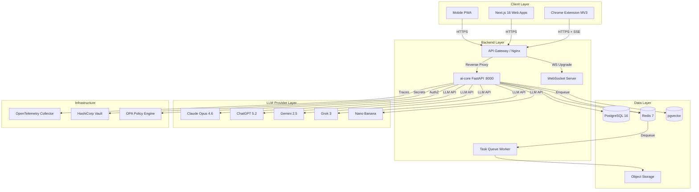
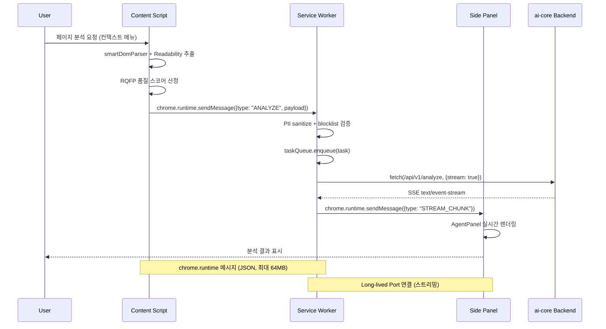
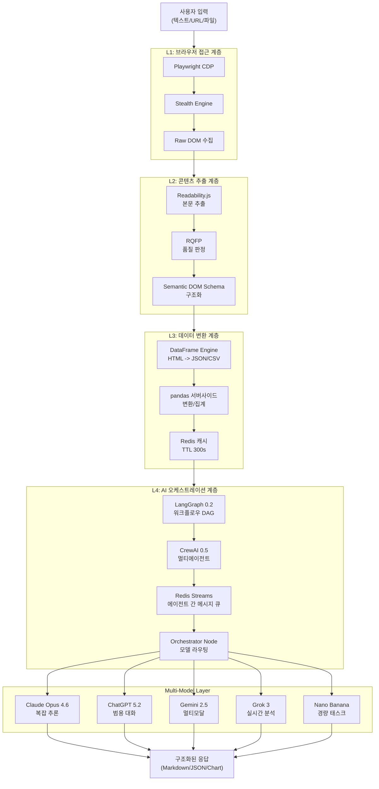
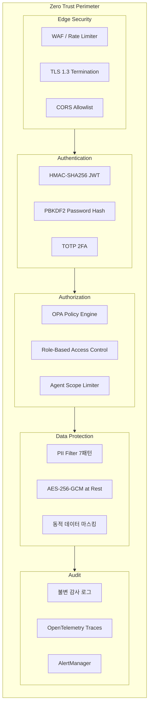

# H Chat Browser OS — 서비스 기획서 Part 3: 기술 아키텍처

> **문서 버전**: v1.0
> **작성일**: 2026-03-14
> **작성자**: Worker C (기술 아키텍처 + 보안 + 인프라)
> **상태**: Draft

---

## 1. 시스템 아키텍처 전체도



### 핵심 통신 경로

| 경로 | 프로토콜 | 인증 | 비고 |
|------|----------|------|------|
| Extension -> Gateway | HTTPS/TLS 1.3 | HMAC-SHA256 JWT | CSP nonce 적용 |
| Gateway -> ai-core | HTTP/2 내부망 | Service Token | mTLS 권장 |
| ai-core -> LLM | HTTPS | Provider API Key | Vault에서 동적 로딩 |
| ai-core -> PostgreSQL | TCP :5432 | SCRAM-SHA-256 | Connection Pool (20) |
| ai-core -> Redis | TCP :6379 | requirepass | Streams + Pub/Sub |
| ai-core -> pgvector | TCP :5432 | 동일 PG 인스턴스 | HNSW 인덱스 |

---

## 2. Extension 내부 아키텍처

### 2.1 MV3 컴포넌트 역할

| 컴포넌트 | 경로 | 역할 |
|----------|------|------|
| **Service Worker** | `background/` | taskQueue 관리, stealthEngine, 알람/이벤트 리스너, LLM 요청 프록시 |
| **Content Script** | `content/` | smartDomParser, Readability.js 추출, RQFP 품질 판정, DOM 이벤트 캡처 |
| **Popup** | `popup/` | ChatPage, AnalyzePage, SettingsPage — 경량 UI 진입점 |
| **Side Panel** | `sidepanel/` | AgentPanel — 멀티 에이전트 워크플로우 모니터링/제어 |
| **Services** | `services/` | extensionChatService (채팅), sseClient (스트리밍) |
| **Utils** | `utils/` | sanitize (PII 제거), blocklist (차단 도메인), messaging (포트 관리) |

### 2.2 내부 통신 프로토콜



### 2.3 Stealth Engine

| 기능 | 구현 | 목적 |
|------|------|------|
| User-Agent 로테이션 | Playwright CDP 프로토콜 | 봇 탐지 회피 |
| Canvas Fingerprint 노이즈 | OffscreenCanvas 오버라이드 | 브라우저 핑거프린트 방어 |
| WebGL 파라미터 스푸핑 | getParameter 인터셉트 | GPU 식별 차단 |
| Navigator 속성 마스킹 | Object.defineProperty | hardwareConcurrency, platform 등 |
| Timing 랜덤화 | requestAnimationFrame 지터 | 타이밍 사이드채널 방어 |

---

## 3. Backend API 설계

### 3.1 기존 라우터 (ai-core)

| 라우터 | 메서드 | 엔드포인트 | 설명 |
|--------|--------|-----------|------|
| chat | POST | `/api/v1/chat` | 단일 턴 대화 |
| chat | POST | `/api/v1/chat/stream` | SSE 스트리밍 대화 |
| analyze | POST | `/api/v1/analyze` | 텍스트/문서 분석 |
| research | POST | `/api/v1/research` | 멀티소스 리서치 |

### 3.2 신규 라우터 (Browser OS 확장)

| 라우터 | 메서드 | 엔드포인트 | 설명 |
|--------|--------|-----------|------|
| **rag** | POST | `/api/v1/rag/ingest` | 문서 임베딩 + pgvector 저장 |
| | POST | `/api/v1/rag/query` | 시맨틱 검색 + 컨텍스트 반환 |
| | DELETE | `/api/v1/rag/documents/{id}` | 임베딩 삭제 |
| **dataframe** | POST | `/api/v1/dataframe/parse` | HTML 테이블 -> JSON/CSV 변환 |
| | POST | `/api/v1/dataframe/transform` | pandas 파이프라인 실행 |
| | GET | `/api/v1/dataframe/schema/{id}` | DataFrame 스키마 조회 |
| **agents** | POST | `/api/v1/agents/execute` | 에이전트 태스크 실행 (LangGraph) |
| | GET | `/api/v1/agents/status/{task_id}` | 실행 상태 조회 |
| | POST | `/api/v1/agents/swarm` | CrewAI 멀티에이전트 실행 |
| | DELETE | `/api/v1/agents/cancel/{task_id}` | 태스크 취소 |
| **healing** | POST | `/api/v1/healing/diagnose` | 장애 패턴 분석 (AST + pgvector) |
| | POST | `/api/v1/healing/patch` | 자동 패치 생성 + 적용 |
| | GET | `/api/v1/healing/history` | 복구 이력 조회 |
| **governance** | GET | `/api/v1/governance/audit` | 불변 감사 로그 조회 |
| | POST | `/api/v1/governance/policy/check` | OPA 정책 평가 |

### 3.3 공통 응답 형식

```typescript
interface ApiResponse<T> {
  success: boolean
  data?: T
  error?: {
    code: string       // "ERR_PII_DETECTED" | "ERR_RATE_LIMIT" | ...
    message: string
    details?: unknown
  }
  meta?: {
    requestId: string
    latencyMs: number
    model?: string
    tokensUsed?: number
  }
}
```

---

## 4. 데이터 흐름도



### 계층별 지연시간 목표

| 계층 | P50 | P95 | P99 |
|------|-----|-----|-----|
| L1 (브라우저 접근) | 200ms | 800ms | 2,000ms |
| L2 (콘텐츠 추출) | 50ms | 150ms | 300ms |
| L3 (데이터 변환) | 100ms | 500ms | 1,000ms |
| L4 (AI 오케스트레이션) | 1,500ms | 5,000ms | 15,000ms |
| **전체 (캐시 미스)** | **2,000ms** | **6,000ms** | **18,000ms** |
| **전체 (캐시 히트)** | **200ms** | **500ms** | **1,000ms** |

---

## 5. 보안 아키텍처

### 5.1 Zero Trust 계층도



### 5.2 PII 처리 흐름

| 단계 | 위치 | 동작 | 패턴 |
|------|------|------|------|
| 1. 클라이언트 전처리 | Extension Content Script | 입력 텍스트 PII 탐지 + 마스킹 | 7패턴 정규식 |
| 2. 전송 전 검증 | Extension Service Worker | blocklist 도메인 차단 + 재검증 | 20 도메인 + 6 URL 패턴 |
| 3. 서버 수신 검증 | ai-core 미들웨어 | Zod 스키마 검증 + PII 재탐지 | 서버사이드 동일 7패턴 |
| 4. LLM 전송 전 | llm_client.py | 최종 PII 스크러빙 | 주민번호, 카드번호, 계좌 등 |
| 5. 응답 후처리 | ai-core 미들웨어 | LLM 응답 내 PII 탐지 + 제거 | 동일 7패턴 |
| 6. 저장 시 | PostgreSQL / pgvector | AES-256-GCM 암호화 저장 | 컬럼 레벨 암호화 |

**7개 PII 패턴**: 주민등록번호, 신용카드번호, 이메일, 전화번호, 사업자등록번호, 여권번호, 계좌번호

### 5.3 에이전트 권한 모델

```
Agent Scope = Role(역할) x Resource(자원) x Action(행위) x Duration(유효기간)
```

| 역할 | 허용 자원 | 허용 행위 | 최대 유효기간 |
|------|----------|----------|-------------|
| reader | 현재 탭 DOM, 캐시 | read | 30분 |
| analyzer | DOM + DataFrame + RAG | read, transform | 1시간 |
| executor | 전체 API + 외부 서비스 | read, write, execute | 15분 |
| admin | 시스템 설정 + 감사 로그 | all | 세션 기반 |

모든 에이전트 행위는 OPA 정책 엔진을 통해 실시간 평가되며, 불변 감사 로그에 기록됩니다.

### 5.4 기존 보안 자산 연계

| 기존 자산 | Browser OS 연계 |
|----------|----------------|
| 7 Security Headers | Extension 관련 CSP에 `extension:` 스킴 추가 |
| CSP nonce (SSR) | Side Panel HTML에 동일 nonce 정책 적용 |
| HMAC-SHA256 JWT | Extension -> Backend 인증 토큰 동일 체계 |
| PBKDF2 | 로컬 설정 암호화 키 파생에 재사용 |
| Zod validation | 모든 신규 엔드포인트 입력 스키마 적용 |
| blocklist (20+6) | Extension Content Script에서 사전 차단 |

---

## 6. 인프라 구성

### 6.1 Docker Compose 확장 (개발 환경)

```yaml
# 기존 서비스: postgresql(16), redis(7), ai-core
# 신규 추가 서비스:
services:
  pgvector:
    image: pgvector/pgvector:0.7.4-pg16  # PG 16 + pgvector 확장
    ports: ["5433:5432"]
    volumes: ["pgvector_data:/var/lib/postgresql/data"]

  otel-collector:
    image: otel/opentelemetry-collector:0.96.0
    ports: ["4317:4317", "4318:4318"]     # gRPC, HTTP

  vault:
    image: hashicorp/vault:1.16
    ports: ["8200:8200"]
    cap_add: ["IPC_LOCK"]

  opa:
    image: openpolicyagent/opa:0.63.0
    ports: ["8181:8181"]
    command: ["run", "--server", "/policies"]
```

### 6.2 프로덕션 아키텍처

```
                    ┌─────────────────────────────────────┐
                    │          CDN (Vercel Edge)           │
                    │   Static: Wiki, HMG, Admin, User    │
                    └──────────────┬──────────────────────┘
                                   │
                    ┌──────────────▼──────────────────────┐
                    │     Load Balancer (Nginx / ALB)      │
                    │   TLS Termination, Rate Limiting     │
                    └───┬──────────┬──────────┬───────────┘
                        │          │          │
               ┌────────▼──┐ ┌────▼────┐ ┌───▼────────┐
               │ ai-core-1 │ │ai-core-2│ │ ai-core-N  │
               │ FastAPI    │ │ FastAPI  │ │ FastAPI    │
               │ (2G RAM)   │ │ (2G RAM) │ │ (2G RAM)  │
               └────┬───────┘ └────┬─────┘ └────┬──────┘
                    │              │              │
          ┌─────────▼──────────────▼──────────────▼──────┐
          │              Internal Network                  │
          ├──────────┬──────────┬──────────┬──────────────┤
          │          │          │          │              │
     ┌────▼───┐ ┌───▼────┐ ┌──▼─────┐ ┌──▼───┐ ┌───────▼──┐
     │ PG 16  │ │Redis 7 │ │pgvector│ │ Vault│ │OPA       │
     │Primary │ │Cluster │ │(PG 16) │ │ HA   │ │(Sidecar) │
     │+Replica│ │3 nodes │ │        │ │      │ │          │
     └────────┘ └────────┘ └────────┘ └──────┘ └──────────┘
```

### 6.3 리소스 제한 (프로덕션)

| 서비스 | CPU | Memory | Replicas | Storage |
|--------|-----|--------|----------|---------|
| ai-core | 2 vCPU | 2 GB | 2-8 (HPA) | — |
| PostgreSQL 16 | 2 vCPU | 4 GB | 1+1 (Primary+Replica) | 100 GB SSD |
| pgvector | 2 vCPU | 4 GB | 1 (PG 내장) | 50 GB SSD |
| Redis 7 | 1 vCPU | 1 GB | 3 (Cluster) | — |
| OPA | 0.5 vCPU | 256 MB | Sidecar | — |
| Vault | 1 vCPU | 512 MB | 2 (HA) | 10 GB |
| OTel Collector | 0.5 vCPU | 512 MB | 2 | — |

### 6.4 스케일링 전략

| 전략 | 대상 | 트리거 | 범위 |
|------|------|--------|------|
| **Horizontal Pod Autoscaler** | ai-core | CPU > 70% 또는 RPS > 100 | 2 -> 8 pods |
| **Redis Cluster** | Redis 7 | 메모리 > 80% | 3 -> 6 shards |
| **PG Read Replica** | PostgreSQL | 읽기 QPS > 500 | 1 -> 3 replicas |
| **Connection Pool** | ai-core -> PG | 동시 연결 > 80% | 20 -> 50 |
| **Circuit Breaker** | LLM Provider 호출 | 에러율 > 30% | 자동 폴백 모델 전환 |
| **Queue Backpressure** | Redis Streams | 큐 길이 > 1,000 | 신규 태스크 거부 (429) |

---

## 7. 기술 스택 총괄 표

| 계층 | 기술 | 버전 | 용도 |
|------|------|------|------|
| **프론트엔드** | | | |
| | Next.js | 16.1.6 | App Router, SSG, 10개 앱 |
| | React | 19.2.3 | UI 렌더링 |
| | TypeScript | 5 | 타입 안전성 |
| | Tailwind CSS | 4 | 유틸리티 스타일링 |
| | Turborepo | 2 | 모노레포 빌드 오케스트레이션 |
| | Storybook | 9 | 컴포넌트 문서화 (209 stories) |
| **Extension** | | | |
| | Chrome MV3 | — | Service Worker 기반 확장 |
| | Vite | 7+ | Extension 번들링 |
| | Playwright CDP | — | 브라우저 자동화 (Stealth) |
| | Readability.js | — | 본문 콘텐츠 추출 |
| **백엔드** | | | |
| | Python | 3.12 | ai-core 런타임 |
| | FastAPI | — | REST API + SSE 스트리밍 |
| | LangGraph | 0.2 | 에이전트 워크플로우 DAG |
| | CrewAI | 0.5 | 멀티에이전트 오케스트레이션 |
| | pandas | — | 서버사이드 DataFrame 변환 |
| | Tree-sitter | — | AST 파싱 (Self-Healing) |
| **데이터** | | | |
| | PostgreSQL | 16 | 관계형 데이터 (대화, 사용자, 감사) |
| | pgvector | 0.7.4 | 벡터 임베딩 (RAG, 장애패턴) |
| | Redis | 7 | 캐시, Streams(메시지 큐), Pub/Sub |
| | IndexedDB (idb) | — | 클라이언트 영속 저장소 |
| **LLM** | | | |
| | Claude Opus | 4.6 | 복잡 추론, 코드 생성 |
| | ChatGPT | 5.2 | 범용 대화, 요약 |
| | Gemini | 2.5 | 멀티모달 분석 |
| | Grok | 3 | 실시간 정보 분석 |
| | Nano Banana | — | 경량 태스크 (분류, 추출) |
| **보안** | | | |
| | OPA | 0.63 | 정책 기반 인가 (Rego) |
| | HashiCorp Vault | 1.16 | 시크릿 관리, 동적 키 로테이션 |
| | Zod | — | 런타임 입력 검증 (40+ 스키마) |
| | HMAC-SHA256 | — | JWT 서명 |
| | PBKDF2 | — | 패스워드 해싱 |
| **관측성** | | | |
| | OpenTelemetry | 0.96 | 분산 트레이싱, 메트릭 수집 |
| | Sentry | — | 에러 모니터링 (errorMonitoring 연계) |
| | AlertManager | — | 알림 규칙 엔진 |
| **인프라** | | | |
| | Docker Compose | — | 로컬/프로덕션 컨테이너 오케스트레이션 |
| | Nginx | — | 리버스 프록시, TLS, 레이트 리미팅 |
| | Vercel | — | 프론트엔드 배포 (8개 앱) |
| | GitHub Actions | — | CI/CD (빌드, 테스트, E2E, Lighthouse) |

---

## 8. 비기능 요구사항

### 8.1 성능

| 지표 | 목표 | 측정 방법 |
|------|------|----------|
| API 응답 시간 (P50) | < 200ms (비-LLM) | OpenTelemetry 히스토그램 |
| API 응답 시간 (P95) | < 1,000ms (비-LLM) | OpenTelemetry 히스토그램 |
| LLM 첫 토큰 (TTFT) | < 800ms | SSE 첫 chunk 타임스탬프 |
| LLM 스트리밍 처리량 | > 30 tokens/sec | 토큰 카운트 / 스트림 시간 |
| Extension 팝업 로드 | < 300ms | Performance.timing |
| Content Script 주입 | < 100ms | chrome.scripting 콜백 |
| DOM 파싱 (L2) | < 150ms (P95) | Readability 실행 시간 |
| DataFrame 변환 (L3) | < 500ms (1MB HTML) | pandas 파이프라인 시간 |
| 동시 사용자 (RPS) | 500 RPS (sustained) | k6 부하 테스트 |
| WebSocket 동시 연결 | 10,000 | 서버 메트릭 |

### 8.2 가용성

| 지표 | 목표 | 비고 |
|------|------|------|
| 서비스 가용성 (SLA) | 99.9% (월간) | 월 43분 이내 다운타임 |
| RTO (복구 목표 시간) | < 15분 | 자동 페일오버 + 헬스체크 |
| RPO (복구 목표 시점) | < 5분 | PG WAL 스트리밍 복제 |
| 헬스체크 간격 | 10초 | /health 엔드포인트 |
| Circuit Breaker 복구 | 30초 half-open | LLM Provider 별 독립 |
| 장애 자동 감지 | < 60초 | AlertManager 규칙 |

### 8.3 확장성

| 차원 | 현재 | 목표 (6개월) | 목표 (12개월) |
|------|------|-------------|-------------|
| ai-core 인스턴스 | 2 | 4 | 8 |
| 동시 에이전트 실행 | 4 | 12 | 24 |
| LLM 프로바이더 | 5 | 8 | 12 |
| RAG 문서 수 | 10K | 100K | 1M |
| pgvector 벡터 수 | 50K | 500K | 5M |
| 일일 요청 수 | 50K | 500K | 2M |

### 8.4 호환성

| 항목 | 요구사항 |
|------|----------|
| Chrome 버전 | >= 120 (MV3 지원 안정 버전) |
| Edge 버전 | >= 120 (Chromium 기반) |
| Node.js | >= 20 (빌드/CI) |
| Python | >= 3.12 (ai-core) |
| PostgreSQL | 16.x |
| Redis | 7.x |
| Docker Engine | >= 24.0 |
| OS (Extension) | Windows 10+, macOS 12+, Ubuntu 22.04+ |
| 해상도 | Extension Popup: 400x600, Side Panel: 가변 |
| 네트워크 | 오프라인 큐 지원 (useOfflineQueue 연계) |

### 8.5 관측성 요구사항

| 항목 | 요구사항 |
|------|----------|
| 분산 트레이싱 | 모든 API 요청에 trace_id 전파 (W3C TraceContext) |
| 로그 수준 | prod: JSON 구조화, dev: console (createLogger 연계) |
| 메트릭 수집 | RED (Rate, Error, Duration) + USE (Utilization, Saturation, Errors) |
| 대시보드 | Grafana: API 레이턴시, LLM 토큰 사용량, 에이전트 성공률 |
| 알림 채널 | Slack, Email, PagerDuty (심각도별 에스컬레이션) |
| 로그 보존 | 90일 (핫), 1년 (콜드 아카이브) |
| 감사 로그 | 불변 저장, 7년 보존 (규정 준수) |

---

> **다음 문서**: SERVICE_PLAN_04 — 개발 로드맵 및 마일스톤
