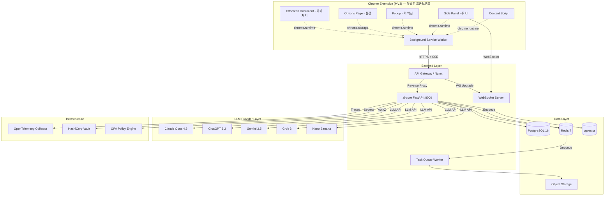
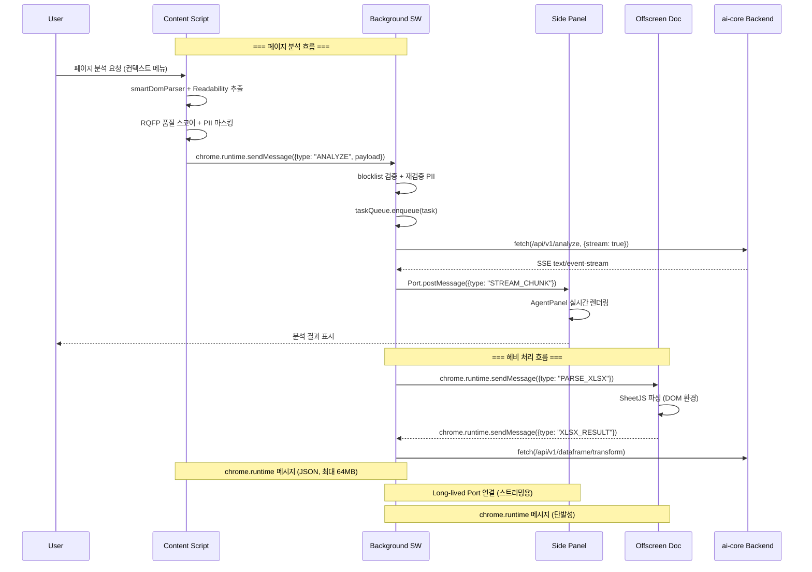
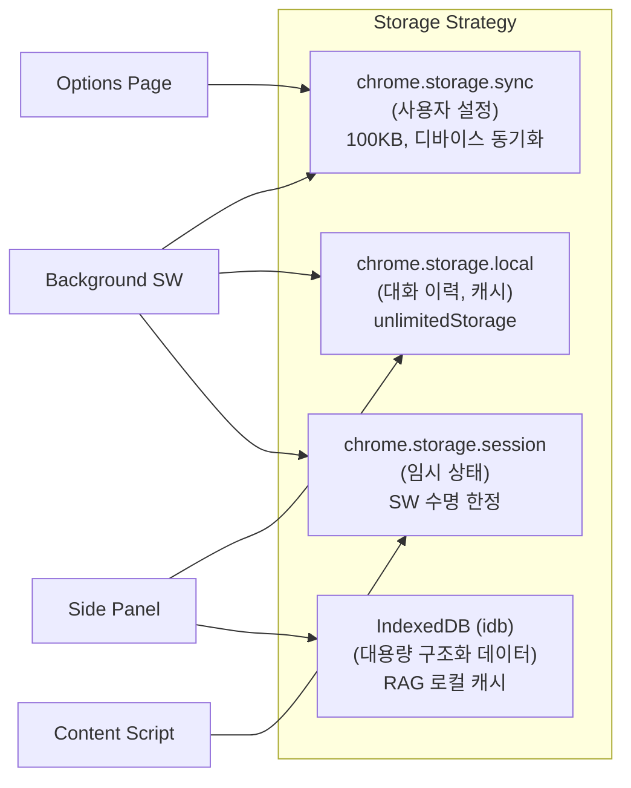
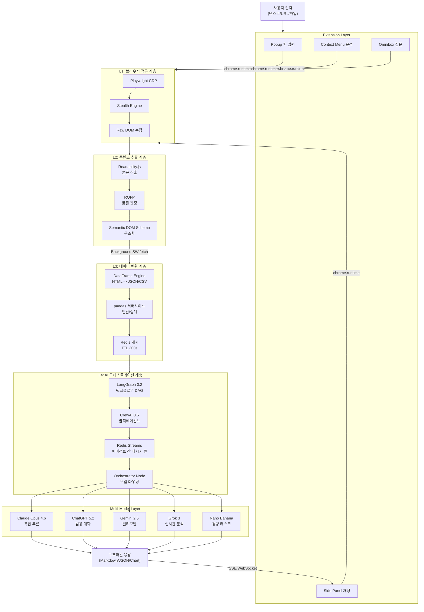
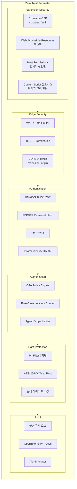

# H Chat Browser OS — 서비스 기획서 Part 3: 기술 아키텍처

> **문서 버전**: v2.0
> **작성일**: 2026-03-14
> **작성자**: Worker C (기술 아키텍처 + 보안 + 인프라)
> **상태**: Draft
> **변경 이력**: v1.0 -> v2.0 — Chrome Extension 단일 프론트엔드 아키텍처로 전환

---

## 1. 시스템 아키텍처 전체도



### 설계 원칙

Chrome Extension을 유일한 프론트엔드로 채택하여 다음을 달성합니다:

1. **단일 진입점**: 모든 사용자 인터랙션이 Extension을 통해 이루어져 인증/인가 경로가 단순화됩니다.
2. **브라우저 네이티브 통합**: `chrome.*` API를 통해 탭, DOM, 스토리지, 알림 등 브라우저 기능에 직접 접근합니다.
3. **통신 단순화**: Extension -> Backend 단방향 통신이 기본이며, WebSocket은 Side Panel에서만 사용합니다.
4. **배포 단순화**: Chrome Web Store 단일 채널로 배포하며, 별도 웹 서버/CDN 없이 운영합니다.

### 핵심 통신 경로

| 경로 | 프로토콜 | 인증 | 비고 |
|------|----------|------|------|
| Extension BG -> Gateway | HTTPS/TLS 1.3 | HMAC-SHA256 JWT | 모든 API 요청의 단일 출구 |
| Side Panel -> WebSocket | WSS/TLS 1.3 | JWT (handshake 시) | 스트리밍 전용, Side Panel에서만 |
| Gateway -> ai-core | HTTP/2 내부망 | Service Token | mTLS 권장 |
| ai-core -> LLM | HTTPS | Provider API Key | Vault에서 동적 로딩 |
| ai-core -> PostgreSQL | TCP :5432 | SCRAM-SHA-256 | Connection Pool (20) |
| ai-core -> Redis | TCP :6379 | requirepass | Streams + Pub/Sub |
| ai-core -> pgvector | TCP :5432 | 동일 PG 인스턴스 | HNSW 인덱스 |

---

## 2. Extension 내부 아키텍처 (주 아키텍처)

### 2.1 MV3 컴포넌트 상세

#### Background Service Worker

Extension의 중앙 허브. 모든 외부 통신과 상태 관리를 담당합니다.

| 기능 | 상세 | chrome.* API |
|------|------|-------------|
| **API 프록시** | 모든 Backend 요청을 Service Worker에서 중앙 처리. Content Script/Side Panel은 직접 fetch하지 않음 | — |
| **장기 실행 관리** | MV3 Service Worker는 30초 유휴 시 종료됨. `chrome.alarms`로 주기적 wake-up, 진행 중인 fetch로 alive 유지 | `chrome.alarms` |
| **taskQueue** | 에이전트 태스크 큐 관리 (우선순위, 재시도, 타임아웃) | `chrome.storage.session` |
| **stealthEngine** | 봇 탐지 회피를 위한 핑거프린트 관리 | `chrome.scripting` |
| **이벤트 리스너** | 탭 이벤트, 메시지, 알람, 설치/업데이트 등 전역 이벤트 핸들링 | `chrome.runtime`, `chrome.tabs` |
| **알림** | 에이전트 완료, 오류, 보안 경고 등 시스템 알림 | `chrome.notifications` |
| **OAuth 인증** | HMG SSO / Google OAuth 플로우 | `chrome.identity` |
| **컨텍스트 메뉴** | 우클릭 메뉴: "이 페이지 분석", "선택 텍스트 질문", "RAG에 추가" | `chrome.contextMenus` |
| **Omnibox 통합** | 주소창 키워드(`hc`) 입력으로 빠른 질문 | `chrome.omnibox` |

```typescript
// background/service-worker.ts — 핵심 구조
chrome.runtime.onInstalled.addListener(handleInstall)
chrome.alarms.create('keepAlive', { periodInMinutes: 0.4 })
chrome.alarms.onAlarm.addListener(handleAlarm)
chrome.contextMenus.create({
  id: 'analyze-page',
  title: 'H Chat: 이 페이지 분석',
  contexts: ['page', 'selection']
})
chrome.contextMenus.onClicked.addListener(handleContextMenu)
chrome.omnibox.onInputEntered.addListener(handleOmniboxQuery)
chrome.runtime.onMessage.addListener(handleMessage)
chrome.runtime.onConnect.addListener(handlePortConnection)
```

#### Content Script

활성 탭의 DOM에 접근하여 콘텐츠를 추출하고 처리합니다.

| 기능 | 상세 | 주입 방식 |
|------|------|----------|
| **smartDomParser** | Readability.js 기반 본문 추출 + 메타데이터 수집 | `chrome.scripting.executeScript` |
| **RQFP 품질 판정** | 추출 콘텐츠 품질 스코어링 (0-100) | 정적 주입 (manifest) |
| **DOM 이벤트 캡처** | 사용자 인터랙션 컨텍스트 (클릭, 스크롤, 선택) | 정적 주입 |
| **PII 전처리** | 전송 전 7패턴 PII 마스킹 | 정적 주입 |
| **블록리스트** | 민감 사이트(은행, 사내 시스템 등) 자동 비활성화 | `chrome.scripting` 조건부 |
| **페이지 컨텍스트** | 현재 URL, 타이틀, 메타 태그, OG 정보 수집 | 정적 주입 |

```typescript
// content/index.ts — 진입점
import { smartDomParser } from './parser'
import { rqfpScore } from './quality'
import { sanitizePII } from '../utils/sanitize'
import { isBlocklisted } from '../utils/blocklist'

if (!isBlocklisted(window.location.href)) {
  chrome.runtime.onMessage.addListener((msg, sender, sendResponse) => {
    if (msg.type === 'EXTRACT_CONTENT') {
      const raw = smartDomParser(document)
      const score = rqfpScore(raw)
      const sanitized = sanitizePII(raw.text)
      sendResponse({ ...raw, text: sanitized, quality: score })
    }
    return true // async sendResponse
  })
}
```

#### Side Panel (주 UI)

Extension의 메인 사용자 인터페이스. 브라우저 측면에 고정되어 웹 탐색과 동시에 사용합니다.

| 기능 | 상세 | chrome.* API |
|------|------|-------------|
| **채팅 인터페이스** | SSE/WebSocket 기반 실시간 대화 UI | `chrome.sidePanel` |
| **에이전트 패널** | 멀티 에이전트 워크플로우 시각화 및 제어 | — |
| **RAG 뷰어** | 검색 결과 + 소스 문서 미리보기 | — |
| **DataFrame 뷰어** | 테이블 데이터 시각화 + 필터/정렬 | — |
| **WebSocket 연결** | 스트리밍 응답용 WebSocket은 Side Panel에서만 관리 | — |
| **탭 연동** | 현재 활성 탭 정보 표시 + 탭 전환 시 컨텍스트 갱신 | `chrome.tabs` |

```typescript
// sidepanel/App.tsx — 주요 라우팅
const routes = [
  { path: '/', component: ChatPage },
  { path: '/agents', component: AgentPanel },
  { path: '/rag', component: RAGViewer },
  { path: '/dataframe', component: DataFrameViewer },
  { path: '/history', component: HistoryPage },
]
```

#### Popup (퀵 액션)

빠른 작업을 위한 경량 UI. 400x600px 팝업 윈도우.

| 기능 | 상세 |
|------|------|
| **Quick Chat** | 한 줄 질문 입력 -> 즉시 응답 |
| **페이지 요약** | 현재 탭 원클릭 요약 |
| **스크린샷 분석** | 현재 탭 캡처 -> 멀티모달 분석 |
| **최근 대화** | 최근 3개 대화 바로가기 |
| **Side Panel 열기** | 전체 UI로 전환 |

```typescript
// popup/App.tsx
function Popup() {
  return (
    <div className="w-[400px] h-[600px]">
      <QuickChatInput onSubmit={handleQuickChat} />
      <QuickActions>
        <SummarizeButton />
        <ScreenshotButton />
        <OpenSidePanelButton />
      </QuickActions>
      <RecentConversations limit={3} />
    </div>
  )
}
```

#### Options Page (설정)

Extension 설정 전용 페이지. `chrome-extension://<id>/options.html`로 접근합니다.

| 기능 | 상세 | chrome.* API |
|------|------|-------------|
| **LLM 모델 선택** | 기본 모델, 폴백 모델, 모델별 파라미터 | `chrome.storage.sync` |
| **에이전트 설정** | 에이전트 역할, 권한, 타임아웃 | `chrome.storage.sync` |
| **보안 설정** | 블록리스트 관리, PII 패턴, 로컬 암호화 키 | `chrome.storage.local` |
| **테마/UI** | 다크모드, 언어, Side Panel 폭 | `chrome.storage.sync` |
| **연결 설정** | Backend URL, OAuth 설정, 프록시 | `chrome.storage.local` |
| **데이터 관리** | 캐시 삭제, 대화 내보내기, 로컬 DB 관리 | `chrome.storage.local` |
| **동기화** | 디바이스 간 설정 동기화 (Chrome Sync) | `chrome.storage.sync` |

#### Offscreen Document (헤비 처리)

DOM이 필요하거나 메인 스레드를 블로킹하는 작업을 격리 실행합니다.

| 기능 | 상세 | 사유 |
|------|------|------|
| **XLSX 파싱** | SheetJS로 대용량 Excel 파싱 | Service Worker에서 DOM API 불가 |
| **HTML 렌더링** | 복잡한 HTML -> 정제된 텍스트 변환 | DOMParser 필요 |
| **이미지 처리** | Canvas 기반 이미지 리사이즈/크롭 | OffscreenCanvas 필요 |
| **오디오 처리** | 음성 인식 (Web Speech API) | MediaStream 필요 |
| **PDF 파싱** | pdf.js로 PDF 텍스트 추출 | Canvas 렌더링 필요 |

```typescript
// background/offscreen-manager.ts
async function createOffscreenDocument(reason: string) {
  const existingContexts = await chrome.runtime.getContexts({
    contextTypes: [chrome.runtime.ContextType.OFFSCREEN_DOCUMENT]
  })
  if (existingContexts.length > 0) return

  await chrome.offscreen.createDocument({
    url: 'offscreen/offscreen.html',
    reasons: [chrome.offscreen.Reason.DOM_PARSER],
    justification: reason,
  })
}
```

### 2.2 chrome.* API 활용 상세

| API | 용도 | 사용 위치 | 권한 |
|-----|------|----------|------|
| `chrome.storage.local` | 대화 이력, 캐시, 보안 설정 (무제한 용량) | BG, SP, OP | `storage`, `unlimitedStorage` |
| `chrome.storage.sync` | 사용자 설정 디바이스 간 동기화 (100KB 제한) | BG, OP | `storage` |
| `chrome.storage.session` | 세션 임시 데이터 (Service Worker 수명) | BG | `storage` |
| `chrome.tabs` | 활성 탭 정보 조회, 탭 생성/업데이트 | BG, SP | `tabs` |
| `chrome.scripting` | Content Script 동적 주입, CSS 주입 | BG | `scripting` |
| `chrome.sidePanel` | Side Panel 열기/닫기, 기본 동작 설정 | BG | `sidePanel` |
| `chrome.contextMenus` | 우클릭 메뉴 등록 (페이지 분석, 선택 질문 등) | BG | `contextMenus` |
| `chrome.omnibox` | 주소창 키워드(`hc`) 통합 | BG | — (manifest 선언) |
| `chrome.alarms` | 주기적 wake-up, 스케줄 태스크, 캐시 정리 | BG | `alarms` |
| `chrome.notifications` | 에이전트 완료 알림, 오류 경고, 보안 알림 | BG | `notifications` |
| `chrome.identity` | OAuth2 플로우 (HMG SSO, Google 인증) | BG | `identity` |
| `chrome.offscreen` | DOM 처리용 Offscreen Document 생성 | BG | `offscreen` |
| `chrome.runtime` | 메시지 패싱, 설치/업데이트 이벤트, Extension ID | 전체 | — |
| `chrome.action` | 배지 텍스트/색상, 팝업 동작 제어 | BG | — |

### 2.3 내부 통신 프로토콜



### 2.4 Extension 상태 관리



| 저장소 | 용량 | 용도 | 동기화 |
|--------|------|------|--------|
| `chrome.storage.sync` | 100KB | LLM 설정, 테마, 언어, 에이전트 설정 | Chrome 계정 동기화 |
| `chrome.storage.local` | 무제한* | 대화 이력, 응답 캐시, 블록리스트, 인증 토큰 | 로컬만 |
| `chrome.storage.session` | 10MB | 진행 중인 태스크 상태, 임시 분석 결과 | SW 수명 한정 |
| IndexedDB (idb) | 무제한* | RAG 로컬 캐시, DataFrame 결과, 대용량 첨부 | 로컬만 |

*`unlimitedStorage` 권한 필요

### 2.5 Stealth Engine

| 기능 | 구현 | 목적 |
|------|------|------|
| User-Agent 로테이션 | Playwright CDP 프로토콜 | 봇 탐지 회피 |
| Canvas Fingerprint 노이즈 | OffscreenCanvas 오버라이드 | 브라우저 핑거프린트 방어 |
| WebGL 파라미터 스푸핑 | getParameter 인터셉트 | GPU 식별 차단 |
| Navigator 속성 마스킹 | Object.defineProperty | hardwareConcurrency, platform 등 |
| Timing 랜덤화 | requestAnimationFrame 지터 | 타이밍 사이드채널 방어 |

---

## 3. Backend API 설계

### 3.1 기존 라우터 (ai-core)

| 라우터 | 메서드 | 엔드포인트 | 설명 |
|--------|--------|-----------|------|
| chat | POST | `/api/v1/chat` | 단일 턴 대화 |
| chat | POST | `/api/v1/chat/stream` | SSE 스트리밍 대화 |
| analyze | POST | `/api/v1/analyze` | 텍스트/문서 분석 |
| research | POST | `/api/v1/research` | 멀티소스 리서치 |

### 3.2 신규 라우터 (Browser OS 확장)

| 라우터 | 메서드 | 엔드포인트 | 설명 |
|--------|--------|-----------|------|
| **rag** | POST | `/api/v1/rag/ingest` | 문서 임베딩 + pgvector 저장 |
| | POST | `/api/v1/rag/query` | 시맨틱 검색 + 컨텍스트 반환 |
| | DELETE | `/api/v1/rag/documents/{id}` | 임베딩 삭제 |
| **dataframe** | POST | `/api/v1/dataframe/parse` | HTML 테이블 -> JSON/CSV 변환 |
| | POST | `/api/v1/dataframe/transform` | pandas 파이프라인 실행 |
| | GET | `/api/v1/dataframe/schema/{id}` | DataFrame 스키마 조회 |
| **agents** | POST | `/api/v1/agents/execute` | 에이전트 태스크 실행 (LangGraph) |
| | GET | `/api/v1/agents/status/{task_id}` | 실행 상태 조회 |
| | POST | `/api/v1/agents/swarm` | CrewAI 멀티에이전트 실행 |
| | DELETE | `/api/v1/agents/cancel/{task_id}` | 태스크 취소 |
| **healing** | POST | `/api/v1/healing/diagnose` | 장애 패턴 분석 (AST + pgvector) |
| | POST | `/api/v1/healing/patch` | 자동 패치 생성 + 적용 |
| | GET | `/api/v1/healing/history` | 복구 이력 조회 |
| **governance** | GET | `/api/v1/governance/audit` | 불변 감사 로그 조회 |
| | POST | `/api/v1/governance/policy/check` | OPA 정책 평가 |

### 3.3 공통 응답 형식

```typescript
interface ApiResponse<T> {
  success: boolean
  data?: T
  error?: {
    code: string       // "ERR_PII_DETECTED" | "ERR_RATE_LIMIT" | ...
    message: string
    details?: unknown
  }
  meta?: {
    requestId: string
    latencyMs: number
    model?: string
    tokensUsed?: number
  }
}
```

---

## 4. 데이터 흐름도



### 계층별 지연시간 목표

| 계층 | P50 | P95 | P99 |
|------|-----|-----|-----|
| L1 (브라우저 접근) | 200ms | 800ms | 2,000ms |
| L2 (콘텐츠 추출) | 50ms | 150ms | 300ms |
| L3 (데이터 변환) | 100ms | 500ms | 1,000ms |
| L4 (AI 오케스트레이션) | 1,500ms | 5,000ms | 15,000ms |
| **전체 (캐시 미스)** | **2,000ms** | **6,000ms** | **18,000ms** |
| **전체 (캐시 히트)** | **200ms** | **500ms** | **1,000ms** |

---

## 5. 보안 아키텍처

### 5.1 Zero Trust 계층도



### 5.2 Extension 보안 강화

#### 5.2.1 CSP (Content Security Policy) for Extension

```json
// manifest.json — content_security_policy
{
  "content_security_policy": {
    "extension_pages": "script-src 'self'; object-src 'none'; style-src 'self' 'unsafe-inline'; connect-src https://*.hchat.ai wss://*.hchat.ai;",
    "sandbox": "sandbox allow-scripts; script-src 'self'; object-src 'none';"
  }
}
```

| 정책 | 값 | 목적 |
|------|-----|------|
| `script-src` | `'self'` | 인라인 스크립트 / eval 완전 차단 |
| `object-src` | `'none'` | Flash/Java 플러그인 차단 |
| `connect-src` | `https://*.hchat.ai wss://*.hchat.ai` | 허용된 Backend만 통신 |
| `style-src` | `'self' 'unsafe-inline'` | Tailwind CSS 인라인 허용 |
| `sandbox` | `allow-scripts` | Offscreen Document 격리 |

#### 5.2.2 Web Accessible Resources 최소화

```json
// manifest.json — web_accessible_resources
{
  "web_accessible_resources": []
}
```

**원칙**: Web Accessible Resources를 비워둡니다. Content Script에서 필요한 리소스는 `chrome.runtime.getURL()`로 내부 접근하며, 웹 페이지에서 Extension 리소스를 직접 참조하지 못하도록 합니다. 이는 Extension ID 노출과 핑거프린팅을 방지합니다.

#### 5.2.3 Host Permissions 관리

```json
// manifest.json — permissions & host_permissions
{
  "permissions": [
    "storage",
    "unlimitedStorage",
    "tabs",
    "scripting",
    "sidePanel",
    "contextMenus",
    "alarms",
    "notifications",
    "identity",
    "offscreen",
    "activeTab"
  ],
  "optional_permissions": [
    "debugger"
  ],
  "host_permissions": [
    "https://*.hchat.ai/*"
  ],
  "optional_host_permissions": [
    "<all_urls>"
  ]
}
```

| 전략 | 상세 |
|------|------|
| **최소 권한 원칙** | 설치 시 `host_permissions`는 `*.hchat.ai`만 요청. 웹 페이지 분석은 `optional_host_permissions`로 사용자가 필요 시 승인 |
| **activeTab 우선** | 컨텍스트 메뉴/팝업 클릭 시 현재 탭만 일시 접근. 영구적 `<all_urls>` 회피 |
| **optional_permissions** | `debugger`(CDP)는 고급 사용자만 선택적 활성화 |
| **런타임 권한 요청** | `chrome.permissions.request()`로 필요 시점에 동적 요청 |

#### 5.2.4 Content Script 격리

| 보호 기법 | 상세 |
|----------|------|
| **격리된 월드** | Content Script는 페이지 JS와 별도 실행 환경 (MV3 기본 동작) |
| **메시지 검증** | `chrome.runtime.sendMessage` 수신 시 `sender.id` 검증 |
| **입력 새니타이즈** | 페이지에서 추출한 모든 데이터에 DOMPurify 적용 |
| **타임아웃** | Content Script 작업에 10초 타임아웃 (무한 루프 방지) |

### 5.3 PII 처리 흐름

| 단계 | 위치 | 동작 | 패턴 |
|------|------|------|------|
| 1. 클라이언트 전처리 | Content Script | 입력 텍스트 PII 탐지 + 마스킹 | 7패턴 정규식 |
| 2. 전송 전 검증 | Background Service Worker | blocklist 도메인 차단 + 재검증 | 20 도메인 + 6 URL 패턴 |
| 3. 서버 수신 검증 | ai-core 미들웨어 | Zod 스키마 검증 + PII 재탐지 | 서버사이드 동일 7패턴 |
| 4. LLM 전송 전 | llm_client.py | 최종 PII 스크러빙 | 주민번호, 카드번호, 계좌 등 |
| 5. 응답 후처리 | ai-core 미들웨어 | LLM 응답 내 PII 탐지 + 제거 | 동일 7패턴 |
| 6. 저장 시 | PostgreSQL / pgvector | AES-256-GCM 암호화 저장 | 컬럼 레벨 암호화 |

**7개 PII 패턴**: 주민등록번호, 신용카드번호, 이메일, 전화번호, 사업자등록번호, 여권번호, 계좌번호

### 5.4 에이전트 권한 모델

```
Agent Scope = Role(역할) x Resource(자원) x Action(행위) x Duration(유효기간)
```

| 역할 | 허용 자원 | 허용 행위 | 최대 유효기간 |
|------|----------|----------|-------------|
| reader | 현재 탭 DOM, 캐시 | read | 30분 |
| analyzer | DOM + DataFrame + RAG | read, transform | 1시간 |
| executor | 전체 API + 외부 서비스 | read, write, execute | 15분 |
| admin | 시스템 설정 + 감사 로그 | all | 세션 기반 |

모든 에이전트 행위는 OPA 정책 엔진을 통해 실시간 평가되며, 불변 감사 로그에 기록됩니다.

### 5.5 기존 보안 자산 연계

| 기존 자산 | Extension 단일 아키텍처 연계 |
|----------|---------------------------|
| 7 Security Headers | Extension CSP로 대체 (`script-src 'self'`, `object-src 'none'` 등) |
| CSP nonce (SSR) | Extension Pages는 `'self'`만 허용하므로 nonce 불필요 |
| HMAC-SHA256 JWT | Background SW에서 JWT 생성/갱신 -> 모든 API 요청에 첨부 |
| PBKDF2 | `chrome.storage.local` 암호화 키 파생에 재사용 |
| Zod validation | 모든 신규 엔드포인트 입력 스키마 적용 |
| blocklist (20+6) | Content Script에서 사전 차단 + Background SW에서 재검증 |

---

## 6. 인프라 구성

### 6.1 Docker Compose 확장 (개발 환경)

```yaml
# 기존 서비스: postgresql(16), redis(7), ai-core
# 신규 추가 서비스:
services:
  pgvector:
    image: pgvector/pgvector:0.7.4-pg16  # PG 16 + pgvector 확장
    ports: ["5433:5432"]
    volumes: ["pgvector_data:/var/lib/postgresql/data"]

  otel-collector:
    image: otel/opentelemetry-collector:0.96.0
    ports: ["4317:4317", "4318:4318"]     # gRPC, HTTP

  vault:
    image: hashicorp/vault:1.16
    ports: ["8200:8200"]
    cap_add: ["IPC_LOCK"]

  opa:
    image: openpolicyagent/opa:0.63.0
    ports: ["8181:8181"]
    command: ["run", "--server", "/policies"]
```

### 6.2 프로덕션 아키텍처

```
    ┌──────────────────────────────────────────────────┐
    │          Chrome Extension (MV3)                   │
    │   Popup / Side Panel / Content Script / BG SW     │
    │   배포: Chrome Web Store                          │
    └─────────────────────┬────────────────────────────┘
                          │ HTTPS / WSS
                          │
             ┌────────────▼───────────────────────┐
             │     Load Balancer (Nginx / ALB)      │
             │   TLS Termination, Rate Limiting     │
             └───┬──────────┬──────────┬───────────┘
                 │          │          │
        ┌────────▼──┐ ┌────▼────┐ ┌───▼────────┐
        │ ai-core-1 │ │ai-core-2│ │ ai-core-N  │
        │ FastAPI    │ │ FastAPI  │ │ FastAPI    │
        │ (2G RAM)   │ │ (2G RAM) │ │ (2G RAM)  │
        └────┬───────┘ └────┬─────┘ └────┬──────┘
             │              │              │
   ┌─────────▼──────────────▼──────────────▼──────┐
   │              Internal Network                  │
   ├──────────┬──────────┬──────────┬──────────────┤
   │          │          │          │              │
┌──▼─────┐ ┌─▼──────┐ ┌▼───────┐ ┌▼──────┐ ┌────▼─────┐
│ PG 16  │ │Redis 7 │ │pgvector│ │ Vault│ │OPA       │
│Primary │ │Cluster │ │(PG 16) │ │ HA   │ │(Sidecar) │
│+Replica│ │3 nodes │ │        │ │      │ │          │
└────────┘ └────────┘ └────────┘ └──────┘ └──────────┘
```

### 6.3 리소스 제한 (프로덕션)

| 서비스 | CPU | Memory | Replicas | Storage |
|--------|-----|--------|----------|---------|
| ai-core | 2 vCPU | 2 GB | 2-8 (HPA) | — |
| PostgreSQL 16 | 2 vCPU | 4 GB | 1+1 (Primary+Replica) | 100 GB SSD |
| pgvector | 2 vCPU | 4 GB | 1 (PG 내장) | 50 GB SSD |
| Redis 7 | 1 vCPU | 1 GB | 3 (Cluster) | — |
| OPA | 0.5 vCPU | 256 MB | Sidecar | — |
| Vault | 1 vCPU | 512 MB | 2 (HA) | 10 GB |
| OTel Collector | 0.5 vCPU | 512 MB | 2 | — |

### 6.4 스케일링 전략

| 전략 | 대상 | 트리거 | 범위 |
|------|------|--------|------|
| **Horizontal Pod Autoscaler** | ai-core | CPU > 70% 또는 RPS > 100 | 2 -> 8 pods |
| **Redis Cluster** | Redis 7 | 메모리 > 80% | 3 -> 6 shards |
| **PG Read Replica** | PostgreSQL | 읽기 QPS > 500 | 1 -> 3 replicas |
| **Connection Pool** | ai-core -> PG | 동시 연결 > 80% | 20 -> 50 |
| **Circuit Breaker** | LLM Provider 호출 | 에러율 > 30% | 자동 폴백 모델 전환 |
| **Queue Backpressure** | Redis Streams | 큐 길이 > 1,000 | 신규 태스크 거부 (429) |

### 6.5 Extension 배포 파이프라인

```mermaid
graph LR
    DEV[개발/PR] -->|CI| BUILD[Vite 빌드\n+ 번들 분석]
    BUILD -->|테스트| TEST[Vitest 단위\n+ Playwright E2E]
    TEST -->|번들 검증| CHECK[크기 < 5MB\nCSP 검증\n권한 감사]
    CHECK -->|패키징| ZIP[extension.zip\n서명]
    ZIP -->|업로드| CWS[Chrome Web Store\nDeveloper Dashboard]
    CWS -->|리뷰| REVIEW[Google 리뷰\n(1-3일)]
    REVIEW -->|승인| PUBLISH[자동 배포\n단계적 롤아웃]

    PUBLISH -->|10%| CANARY[카나리 릴리스\n모니터링 24h]
    CANARY -->|이상 없음| FULL[100% 배포]
```

---

## 7. 기술 스택 총괄 표

| 계층 | 기술 | 버전 | 용도 |
|------|------|------|------|
| **Extension (유일한 프론트엔드)** | | | |
| | Chrome MV3 | — | Service Worker 기반 확장 플랫폼 |
| | React | 19.2.3 | Side Panel / Popup / Options UI |
| | TypeScript | 5 | 타입 안전성 |
| | Tailwind CSS | 4 | 유틸리티 스타일링 |
| | Vite | 7+ | Extension 번들링 |
| | Playwright CDP | — | 브라우저 자동화 (Stealth) |
| | Readability.js | — | 본문 콘텐츠 추출 |
| | SheetJS (xlsx) | — | Offscreen Document에서 Excel 파싱 |
| | idb (IndexedDB) | — | 클라이언트 대용량 영속 저장소 |
| **백엔드** | | | |
| | Python | 3.12 | ai-core 런타임 |
| | FastAPI | — | REST API + SSE 스트리밍 |
| | LangGraph | 0.2 | 에이전트 워크플로우 DAG |
| | CrewAI | 0.5 | 멀티에이전트 오케스트레이션 |
| | pandas | — | 서버사이드 DataFrame 변환 |
| | Tree-sitter | — | AST 파싱 (Self-Healing) |
| **데이터** | | | |
| | PostgreSQL | 16 | 관계형 데이터 (대화, 사용자, 감사) |
| | pgvector | 0.7.4 | 벡터 임베딩 (RAG, 장애패턴) |
| | Redis | 7 | 캐시, Streams(메시지 큐), Pub/Sub |
| **LLM** | | | |
| | Claude Opus | 4.6 | 복잡 추론, 코드 생성 |
| | ChatGPT | 5.2 | 범용 대화, 요약 |
| | Gemini | 2.5 | 멀티모달 분석 |
| | Grok | 3 | 실시간 정보 분석 |
| | Nano Banana | — | 경량 태스크 (분류, 추출) |
| **보안** | | | |
| | OPA | 0.63 | 정책 기반 인가 (Rego) |
| | HashiCorp Vault | 1.16 | 시크릿 관리, 동적 키 로테이션 |
| | Zod | — | 런타임 입력 검증 (40+ 스키마) |
| | HMAC-SHA256 | — | JWT 서명 |
| | PBKDF2 | — | 패스워드 해싱 |
| **관측성** | | | |
| | OpenTelemetry | 0.96 | 분산 트레이싱, 메트릭 수집 |
| | Sentry | — | 에러 모니터링 (errorMonitoring 연계) |
| | AlertManager | — | 알림 규칙 엔진 |
| **인프라** | | | |
| | Docker Compose | — | 로컬/프로덕션 컨테이너 오케스트레이션 |
| | Nginx | — | 리버스 프록시, TLS, 레이트 리미팅 |
| | Chrome Web Store | — | Extension 배포 (유일한 클라이언트 채널) |
| | GitHub Actions | — | CI/CD (빌드, 테스트, E2E, 번들 검증) |

---

## 8. 비기능 요구사항

### 8.1 Extension 특화 요구사항

| 지표 | 목표 | 측정 방법 |
|------|------|----------|
| **번들 크기 (전체)** | < 5MB | Vite 빌드 출력 + `du -sh dist/` |
| **Popup 초기 로드** | < 300ms | Performance.timing |
| **Side Panel 초기 로드** | < 1,000ms | Performance.timing (React hydration 포함) |
| **Content Script 주입** | < 100ms | `chrome.scripting.executeScript` 콜백 |
| **Background SW 시작** | < 500ms | `chrome.runtime.onInstalled` 타임스탬프 |
| **메모리 사용량** | < 100MB | Chrome Task Manager (Extension process) |
| **Storage 사용량** | < 50MB (local) | `chrome.storage.local.getBytesInUse()` |
| **배지 업데이트** | < 50ms | `chrome.action.setBadgeText` 콜백 |
| **Chrome Web Store 정책** | 100% 준수 | 리뷰 통과율 |

#### Chrome Web Store 정책 준수 체크리스트

| 항목 | 요구사항 | 검증 방법 |
|------|----------|----------|
| 단일 목적 | Extension은 "AI 브라우저 어시스턴트" 단일 목적 | Manifest description 리뷰 |
| 최소 권한 | 필수 권한만 요청, 나머지는 `optional_*` | CI에서 manifest 권한 감사 |
| 개인정보 보호 | PII 수집/전송에 대한 명시적 공개 | Privacy Policy 페이지 |
| 원격 코드 금지 | `eval()`, `new Function()`, 원격 JS 로딩 금지 | ESLint no-eval + CSP `'self'` |
| 사용자 동의 | 선택적 권한은 사용 시점에 설명 + 동의 | `chrome.permissions.request` 전 UI 안내 |
| 데이터 삭제 | 사용자 요청 시 모든 로컬 데이터 삭제 가능 | Options Page "데이터 초기화" 기능 |

### 8.2 성능

| 지표 | 목표 | 측정 방법 |
|------|------|----------|
| API 응답 시간 (P50) | < 200ms (비-LLM) | OpenTelemetry 히스토그램 |
| API 응답 시간 (P95) | < 1,000ms (비-LLM) | OpenTelemetry 히스토그램 |
| LLM 첫 토큰 (TTFT) | < 800ms | SSE 첫 chunk 타임스탬프 |
| LLM 스트리밍 처리량 | > 30 tokens/sec | 토큰 카운트 / 스트림 시간 |
| DOM 파싱 (L2) | < 150ms (P95) | Readability 실행 시간 |
| DataFrame 변환 (L3) | < 500ms (1MB HTML) | pandas 파이프라인 시간 |
| 동시 사용자 (RPS) | 500 RPS (sustained) | k6 부하 테스트 |
| WebSocket 동시 연결 | 10,000 | 서버 메트릭 |

### 8.3 가용성

| 지표 | 목표 | 비고 |
|------|------|------|
| 서비스 가용성 (SLA) | 99.9% (월간) | 월 43분 이내 다운타임 |
| RTO (복구 목표 시간) | < 15분 | 자동 페일오버 + 헬스체크 |
| RPO (복구 목표 시점) | < 5분 | PG WAL 스트리밍 복제 |
| 헬스체크 간격 | 10초 | /health 엔드포인트 |
| Circuit Breaker 복구 | 30초 half-open | LLM Provider 별 독립 |
| 장애 자동 감지 | < 60초 | AlertManager 규칙 |
| Extension 오프라인 모드 | 캐시된 대화 조회 가능 | `chrome.storage.local` + IndexedDB |

### 8.4 확장성

| 차원 | 현재 | 목표 (6개월) | 목표 (12개월) |
|------|------|-------------|-------------|
| ai-core 인스턴스 | 2 | 4 | 8 |
| 동시 에이전트 실행 | 4 | 12 | 24 |
| LLM 프로바이더 | 5 | 8 | 12 |
| RAG 문서 수 | 10K | 100K | 1M |
| pgvector 벡터 수 | 50K | 500K | 5M |
| 일일 요청 수 | 50K | 500K | 2M |

### 8.5 호환성

| 항목 | 요구사항 |
|------|----------|
| Chrome 버전 | >= 120 (MV3 Side Panel 안정 버전) |
| Edge 버전 | >= 120 (Chromium 기반, Side Panel 지원) |
| Node.js | >= 20 (빌드/CI) |
| Python | >= 3.12 (ai-core) |
| PostgreSQL | 16.x |
| Redis | 7.x |
| Docker Engine | >= 24.0 |
| OS (Extension) | Windows 10+, macOS 12+, Ubuntu 22.04+ |
| 해상도 | Popup: 400x600, Side Panel: 가변 (min-width 360px) |
| 네트워크 | 오프라인 큐 지원 (chrome.storage + 재시도 큐) |

### 8.6 관측성 요구사항

| 항목 | 요구사항 |
|------|----------|
| 분산 트레이싱 | 모든 API 요청에 trace_id 전파 (W3C TraceContext) |
| Extension 로그 | `chrome.storage.session`에 구조화 로그 버퍼 (최대 100건) |
| 로그 수준 | prod: JSON 구조화, dev: console (createLogger 연계) |
| 메트릭 수집 | RED (Rate, Error, Duration) + USE (Utilization, Saturation, Errors) |
| Extension 메트릭 | Popup 로드 시간, Side Panel 사용 시간, Content Script 주입 성공률 |
| 대시보드 | Grafana: API 레이턴시, LLM 토큰 사용량, 에이전트 성공률 |
| 알림 채널 | Slack, Email, PagerDuty (심각도별 에스컬레이션) |
| 로그 보존 | 90일 (핫), 1년 (콜드 아카이브) |
| 감사 로그 | 불변 저장, 7년 보존 (규정 준수) |
| 크래시 리포트 | Extension 크래시 시 `chrome.runtime.onSuspend`에서 상태 저장 |

---

> **다음 문서**: SERVICE_PLAN_04 — 개발 로드맵 및 마일스톤
