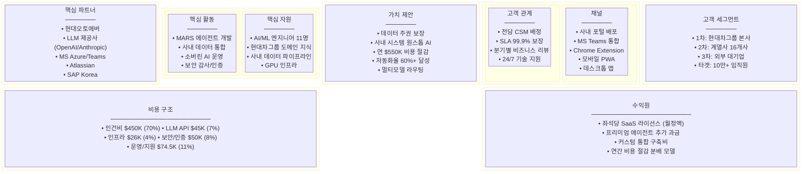
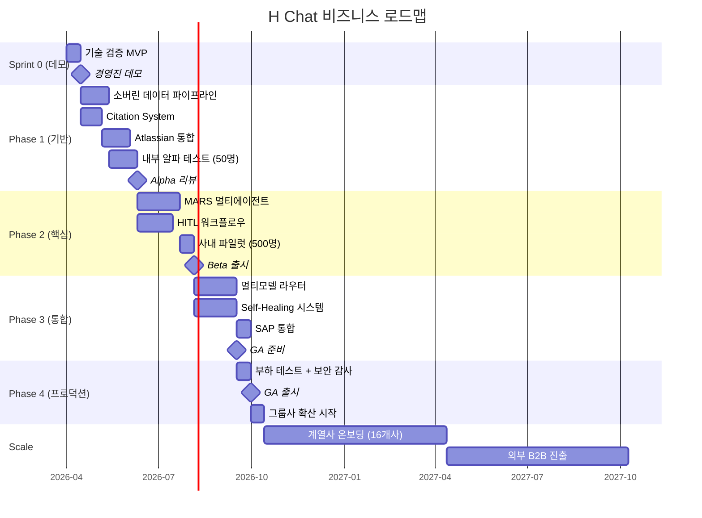

# H Chat 서비스 기획서 Part 4: 비즈니스 모델 + 로드맵 + KPI

> **문서 버전**: v1.0
> **작성일**: 2026-03-14
> **담당**: 비즈니스 전략팀
> **범위**: 비즈니스 모델, 수익 구조, GTM, KPI, 투자 계획

---

## 1. 비즈니스 모델 캔버스 (BMC)



### BMC 핵심 요약

| 블록 | 핵심 내용 |
|------|-----------|
| **고객 세그먼트** | 현대차그룹 본사 → 16개 계열사 → 외부 대기업 (3단계 확장) |
| **가치 제안** | 데이터 주권 + 사내 시스템 통합 + 연 $550K 절감 + 멀티모델 AI |
| **채널** | 사내 포털, MS Teams, Chrome Extension, PWA, 데스크톱 앱 |
| **고객 관계** | 전담 CSM, SLA 99.9%, 분기별 비즈니스 리뷰 |
| **수익원** | 좌석당 SaaS 라이선스 + 프리미엄 에이전트 + 커스텀 통합비 |
| **핵심 자원** | AI 엔지니어 11명, 사내 도메인 데이터, GPU 인프라 |
| **핵심 활동** | MARS 에이전트 개발, 데이터 통합, 소버린 AI 운영 |
| **핵심 파트너** | 현대오토에버, LLM 제공사, Microsoft, Atlassian, SAP |
| **비용 구조** | 총 $645.5K (인건비 70%, LLM 7%, 인프라 4%, 보안 8%, 운영 11%) |

---

## 2. 수익 모델

### 2.1 가격 티어 구조

| | **Basic** | **Pro** | **Enterprise** |
|---|-----------|---------|----------------|
| **월 가격 (좌석당)** | $8 | $18 | $30 (커스텀 협상) |
| **연간 할인** | 10% | 15% | 20% |
| **AI 모델** | GPT-4o-mini, Haiku | + GPT-4o, Sonnet | + Opus, o3, 전체 모델 |
| **일일 쿼리 한도** | 50회 | 200회 | 무제한 |
| **에이전트** | 기본 Q&A | + 리서치, 문서 요약 | + MARS 풀스택, 커스텀 |
| **시스템 통합** | Teams 기본 | + Confluence, Jira | + SAP, 사내 전체 시스템 |
| **데이터 보존** | 30일 | 90일 | 무제한 + 감사 로그 |
| **지원** | 이메일 | 전담 채널 | 24/7 + 전담 CSM |
| **SLA** | 99.5% | 99.9% | 99.95% + 페널티 조항 |

### 2.2 예상 ARR (연간 반복 매출)

| 시점 | 사용자 수 | 티어 분포 (B/P/E) | 월 매출 | **ARR** |
|------|-----------|-------------------|---------|---------|
| **6개월** (Beta) | 2,000명 | 60/30/10 | $26K | **$312K** |
| **12개월** (GA) | 8,000명 | 40/40/20 | $128K | **$1.54M** |
| **18개월** (Scale) | 25,000명 | 30/40/30 | $470K | **$5.64M** |
| **24개월** (Expand) | 50,000명 | 25/40/35 | $1.01M | **$12.1M** |

> **가정**: 현대차그룹 임직원 10만+명 중 24개월 내 50% 침투율 목표.
> 커스텀 통합비 및 절감 분배 모델 수익은 별도 (연 $200K~$500K 추가 예상).

### 2.3 수익 다각화

| 수익원 | 비중 | 설명 |
|--------|------|------|
| **SaaS 라이선스** | 75% | 좌석당 월정액 구독 |
| **프리미엄 에이전트** | 10% | MARS 고급 에이전트 추가 과금 |
| **커스텀 통합** | 10% | SAP/ERP 등 사내 시스템 연동 구축비 |
| **절감 분배** | 5% | 실측 비용 절감의 5~10% 성과 보수 |

---

## 3. Go-to-Market 전략

### 3.1 3단계 GTM

```
Stage 1: 내부 파일럿       Stage 2: 그룹사 확산       Stage 3: 외부 B2B
(0~6개월)                  (6~18개월)                 (18~30개월)
┌─────────────────┐      ┌─────────────────┐      ┌─────────────────┐
│ 현대오토에버 본사  │ ──→ │ 현대차/기아/모비스 │ ──→ │ 외부 대기업       │
│ 500명 파일럿      │      │ 16개 계열사       │      │ 제조/금융/물류    │
│ PMF 검증          │      │ 25,000명 확대     │      │ 50,000+ 좌석     │
└─────────────────┘      └─────────────────┘      └─────────────────┘
```

### 3.2 단계별 GTM 상세

**Stage 1: 내부 파일럿 (0~6개월)**

| 항목 | 내용 |
|------|------|
| **타겟** | 현대오토에버 IT/경영기획 부서 500명 |
| **목표** | PMF 검증, NPS 40+, DAU 60%+ |
| **전략** | 챔피언 사용자 20명 선발 → 피드백 루프 → 빠른 반복 |
| **성공 기준** | 주간 리텐션 70%, 자동화율 30%+, 경영진 승인 |

**Stage 2: 그룹사 확산 (6~18개월)**

| 항목 | 내용 |
|------|------|
| **타겟** | 현대차, 기아, 현대모비스 등 16개 계열사 |
| **목표** | 25,000 좌석, ARR $5M+ |
| **전략** | 계열사별 전담 CSM 배정, 맞춤형 온보딩 프로그램 |
| **성공 기준** | 계열사 10개 이상 도입, NPS 50+, 자동화율 50%+ |

**Stage 3: 외부 B2B (18~30개월)**

| 항목 | 내용 |
|------|------|
| **타겟** | 제조/금융/물류 대기업 (삼성, SK, LG 등) |
| **목표** | 50,000+ 좌석, ARR $12M+ |
| **전략** | 백서 발간, 컨퍼런스 발표, 레퍼런스 사례 마케팅 |
| **성공 기준** | 외부 고객 3개사 이상 계약 체결 |

---

## 4. 출시 로드맵 (비즈니스 관점)



### 4.1 단계별 비즈니스 마일스톤

| 단계 | 기간 | 비즈니스 마일스톤 | 판정 기준 |
|------|------|-------------------|-----------|
| **Sprint 0** | 2주 | 경영진 데모, 기술 실현 가능성 확인 | 핵심 유스케이스 3개 라이브 시연 |
| **Alpha** | +8주 | 내부 50명 테스트, 데이터 파이프라인 가동 | 응답 정확도 85%+, 지연 < 3초 |
| **Beta** | +8주 | 500명 파일럿, MARS 에이전트 운영 | DAU 60%, NPS 40+, 자동화율 30% |
| **GA** | +12주 | 프로덕션 출시, SLA 99.9% 보장 | 보안 감사 통과, 부하 테스트 완료 |
| **Scale** | +12개월 | 그룹사 16개사 확산, 25K 좌석 | ARR $5M+, NPS 50+, 자동화율 50% |

---

## 5. KPI 대시보드

### 5.1 비즈니스 KPI

| KPI | 정의 | 목표 (12개월) | 측정 주기 |
|-----|------|---------------|-----------|
| **ARR** | 연간 반복 매출 | $1.54M | 월간 |
| **좌석 수** | 유료 활성 좌석 | 8,000 | 월간 |
| **Net Revenue Retention** | 기존 고객 매출 유지율 | 120%+ | 분기 |
| **CAC** | 고객 획득 비용 (좌석당) | < $15 | 분기 |
| **LTV/CAC** | 고객 생애가치 대비 획득비용 | > 5x | 분기 |
| **비용 절감 실현액** | 자동화로 인한 연간 절감 | $550K | 분기 |

### 5.2 제품 KPI

| KPI | 정의 | 목표 (12개월) | 측정 주기 |
|-----|------|---------------|-----------|
| **DAU/MAU** | 일간/월간 활성 사용자 비율 | 65%+ | 일간 |
| **NPS** | 순추천지수 | 50+ | 월간 |
| **자동화율** | AI가 완전 처리한 요청 비율 | 50%+ | 주간 |
| **기능 채택률** | 핵심 기능 사용 비율 | 70%+ | 월간 |
| **세션 시간** | 평균 일일 사용 시간 | 25분+ | 일간 |
| **Task Completion Rate** | 사용자가 작업을 완료한 비율 | 85%+ | 주간 |

### 5.3 기술 KPI

| KPI | 정의 | 목표 (12개월) | 측정 주기 |
|-----|------|---------------|-----------|
| **응답 지연** | AI 첫 토큰 응답 시간 | < 1.5초 (P95) | 실시간 |
| **가용성** | 시스템 업타임 | 99.9% | 월간 |
| **응답 정확도** | AI 답변의 사실 정확도 | 92%+ | 주간 |
| **에러율** | 요청 실패 비율 | < 0.5% | 실시간 |
| **LLM 비용/쿼리** | 쿼리당 평균 API 비용 | < $0.03 | 일간 |
| **배포 빈도** | 프로덕션 배포 횟수 | 주 2회+ | 주간 |

### 5.4 KPI 대시보드 구성도

```
┌─────────────────────────────────────────────────────────┐
│                    H Chat KPI Dashboard                 │
├──────────────┬──────────────────┬───────────────────────┤
│  비즈니스     │  제품             │  기술                 │
│              │                  │                       │
│  ARR         │  DAU/MAU         │  응답 지연 (P95)       │
│  [$1.54M]    │  [65%]           │  [1.2s]               │
│  ▲ 12%       │  ▲ 5%            │  ▼ 0.3s               │
│              │                  │                       │
│  좌석 수      │  NPS             │  가용성               │
│  [8,000]     │  [52]            │  [99.92%]             │
│  ▲ 800       │  ▲ 3             │  ─                    │
│              │                  │                       │
│  비용 절감    │  자동화율         │  에러율               │
│  [$550K]     │  [51%]           │  [0.3%]               │
│  ▲ $50K      │  ▲ 8%            │  ▼ 0.1%               │
└──────────────┴──────────────────┴───────────────────────┘
```

---

## 6. 투자 계획 및 ROI

### 6.1 Phase별 투자 내역

| Phase | 기간 | 인건비 | LLM API | 인프라 | 기타 | **소계** | **누적** |
|-------|------|--------|---------|--------|------|----------|----------|
| Sprint 0 | 2주 | $30K | $3K | $2K | $5K | $40K | $40K |
| Phase 1 | 8주 | $120K | $10K | $6K | $14K | $150K | $190K |
| Phase 2 | 8주 | $120K | $12K | $8K | $20K | $160K | $350K |
| Phase 3 | 8주 | $120K | $12K | $6K | $17K | $155K | $505K |
| Phase 4 | 4주 | $60K | $8K | $4K | $18.5K | $90.5K | $595.5K |
| 예비비 | - | - | - | - | $50K | $50K | **$645.5K** |

### 6.2 누적 비용 vs 절감 (Break-even 분석)

```
비용/절감 ($K)
  │
  │                                              ╱ 누적 절감
1200│                                           ╱
  │                                         ╱
1000│                                      ╱
  │                                    ╱
 800│                    ★ Break-even╱
  │                    (12개월)  ╱
 645│─ ─ ─ ─ ─ ─ ─ ─ ─ ─ ─ ─╱─ ─ ─ ─ 총 투자선
  │              ╱        ╱
 500│           ╱       ╱   ← 누적 투자
  │        ╱      ╱
 300│     ╱    ╱
  │   ╱  ╱
 100│ ╱╱
  │╱
  └──┬──┬──┬──┬──┬──┬──┬──┬──┬──┬──→ 개월
     3  6  9  12 15 18 21 24 27 30
```

### 6.3 ROI 계산

| 구간 | 누적 투자 | 누적 절감 | **순 ROI** |
|------|-----------|-----------|------------|
| **6개월** | $350K | $138K | -61% (투자 단계) |
| **12개월** (Break-even) | $645.5K | $550K | -15% (근접) |
| **18개월** | $745.5K | $1,100K | **+48%** |
| **24개월** | $845.5K | $1,650K | **+95%** |
| **36개월** | $945.5K | $2,475K | **+162%** |

> **3년 ROI 220~270%**: 절감 효과에 SaaS 매출($1.54M+ ARR)을 합산 시 달성 가능.
> 운영비(연 $100K 추정)를 포함한 보수적 산정.

---

## 7. 경쟁 우위 지속 전략 (Moat)

### 7.1 기술적 해자 3중 구조

```
┌─────────────────────────────────────────────┐
│            경쟁 우위 해자 (Moat)             │
│                                             │
│  ┌─────────────────────────────────────┐    │
│  │  Layer 3: 적응형 에이전트 생태계     │    │
│  │  • MARS 멀티에이전트 오케스트레이션   │    │
│  │  • 사용자 행동 기반 자동 최적화       │    │
│  │  • 커스텀 에이전트 마켓플레이스       │    │
│  │  ┌─────────────────────────────┐    │    │
│  │  │ Layer 2: 사내 시스템 통합    │    │    │
│  │  │ • Confluence/Jira/SAP 딥통합 │    │    │
│  │  │ • MS Teams 네이티브 경험     │    │    │
│  │  │ • 사내 SSO/RBAC 연동        │    │    │
│  │  │ ┌─────────────────────┐    │    │    │
│  │  │ │ Layer 1: 데이터 주권 │    │    │    │
│  │  │ │ • 온프레미스/VPC 배포│    │    │    │
│  │  │ │ • 데이터 국내 상주   │    │    │    │
│  │  │ │ • 감사 로그 완전성   │    │    │    │
│  │  │ └─────────────────────┘    │    │    │
│  │  └─────────────────────────────┘    │    │
│  └─────────────────────────────────────┘    │
└─────────────────────────────────────────────┘
```

### 7.2 해자별 상세 전략

| 해자 | 경쟁사 모방 난이도 | 구축 기간 | 핵심 방어 요소 |
|------|-------------------|-----------|---------------|
| **데이터 주권** | 높음 | 6개월 | 현대차그룹 보안 정책 충족, 국내 데이터센터 상주 요건 |
| **사내 시스템 통합** | 매우 높음 | 12개월 | Confluence/Jira/SAP 커넥터, 사내 API 인증 체계 |
| **적응형 에이전트** | 극히 높음 | 18개월+ | 사용자 패턴 데이터 축적, 도메인 특화 파인튜닝 |

### 7.3 네트워크 효과

- **데이터 플라이휠**: 사용자 증가 → 쿼리 데이터 축적 → AI 품질 향상 → 사용자 만족도 증가
- **에이전트 마켓**: 부서별 커스텀 에이전트 공유 → 생태계 잠금 효과
- **통합 깊이**: 시스템 연동이 깊어질수록 교체 비용(Switching Cost) 기하급수적 증가

---

## 8. 리스크 및 대응

### 8.1 비즈니스 리스크 매트릭스

| # | 리스크 | 영향도 | 발생확률 | 대응 전략 |
|---|--------|--------|----------|-----------|
| R1 | **LLM API 비용 급등** — 제공사 가격 인상 | 높음 | 중간 | 멀티모델 라우팅으로 비용 최적화, 경량 모델(Haiku) 우선 배치, 캐싱으로 중복 쿼리 60% 절감 |
| R2 | **사용자 채택 저조** — 변화 저항, 기존 도구 관성 | 높음 | 중간 | 챔피언 프로그램 운영, 부서별 킬러 유스케이스 발굴, 게이미피케이션 도입 |
| R3 | **데이터 유출/보안 사고** — 규제 위반, 신뢰 훼손 | 매우 높음 | 낮음 | 소버린 AI 아키텍처, 제로 트러스트 보안, 분기별 침투 테스트, PII 자동 마스킹 |
| R4 | **경쟁사 진입** — MS Copilot, Google Duet 등 | 중간 | 높음 | 사내 시스템 딥통합(경쟁사 불가), 데이터 주권 차별화, 도메인 특화 에이전트 |
| R5 | **핵심 인력 이탈** — AI 인재 확보 경쟁 심화 | 높음 | 중간 | RSU 인센티브, 기술 리더십 기회 제공, 지식 문서화(Bus Factor 3+), 주니어 멘토링 체계 |

### 8.2 대응 우선순위

```
영향도 높음  │  R3 [보안]          R1 [비용]     R5 [인력]
             │    ● 즉시 대응         ● 사전 예방     ● 상시 관리
             │
영향도 중간  │                     R4 [경쟁]
             │                       ● 모니터링
             │
영향도 낮음  │  R2 [채택]
             │    ● 점진 개선
             ├──────────────────────────────────────────
             낮음                 중간                높음
                              발생확률
```

---

## 9. 성공 기준

### 9.1 시점별 판정 기준

| 기준 | **6개월** (Beta) | **12개월** (GA) | **24개월** (Scale) |
|------|-----------------|-----------------|-------------------|
| **좌석 수** | 2,000 | 8,000 | 50,000 |
| **DAU/MAU** | 55%+ | 65%+ | 70%+ |
| **NPS** | 40+ | 50+ | 55+ |
| **자동화율** | 30%+ | 50%+ | 60%+ |
| **비용 절감** | $138K | $550K | $1,650K (누적) |
| **ARR** | $312K | $1.54M | $12.1M |
| **응답 정확도** | 85%+ | 92%+ | 95%+ |
| **SLA** | 99.5% | 99.9% | 99.95% |
| **도입 계열사** | 1개 (오토에버) | 5개+ | 16개+ |
| **외부 고객** | - | - | 3개사+ |

### 9.2 Go/No-Go 판정 기준

| 시점 | Go 조건 | No-Go 시 대응 |
|------|---------|---------------|
| **Sprint 0 (2주)** | 핵심 유스케이스 3개 시연 성공, 경영진 승인 | 기술 스택 재검토, 범위 축소 후 재시도 |
| **Alpha (10주)** | 50명 테스터 중 NPS 35+, 응답 정확도 80%+ | 핵심 병목 식별 후 2주 집중 개선 스프린트 |
| **Beta (18주)** | DAU 55%+, 자동화율 25%+, 보안 감사 통과 | GA 4주 연기, 파일럿 규모 유지하며 품질 개선 |
| **GA (30주)** | SLA 99.9%, 부하 테스트 통과, NPS 45+ | 소프트 런치로 전환, 단계적 확산 |
| **12개월** | ARR $1M+, 계열사 5개 이상 도입 | GTM 전략 피벗, 가격 모델 재조정 |

### 9.3 최종 성공 정의

> **H Chat이 성공한 상태란**:
> 현대차그룹 임직원의 일상 업무 도구로 자리잡아(DAU 70%+),
> 연간 $550K 이상의 비용을 절감하며(자동화율 60%+),
> 데이터 주권을 완벽히 보장하면서(보안 사고 0건),
> 24개월 내 ARR $12M을 달성하고,
> 외부 대기업 3개사 이상에 B2B SaaS로 확장된 상태.

---

## 부록: 핵심 수치 요약

| 항목 | 수치 |
|------|------|
| 총 투자 | $645.5K (보정 후) |
| Break-even | 12개월 |
| 3년 ROI | 220~270% |
| 24개월 ARR 목표 | $12.1M |
| 타겟 사용자 | 50,000명 (24개월) |
| 연간 비용 절감 | $550K |
| 자동화율 목표 | 60%+ |
| NPS 목표 | 55+ |
| 개발 기간 | 30주 (Sprint 0 ~ GA) |
| 팀 규모 | 11명 |
