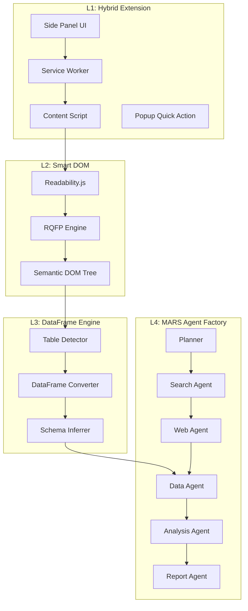
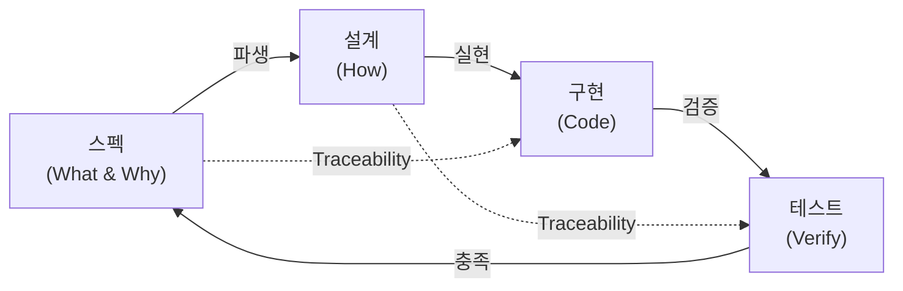
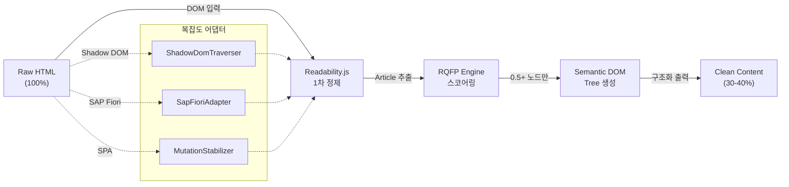
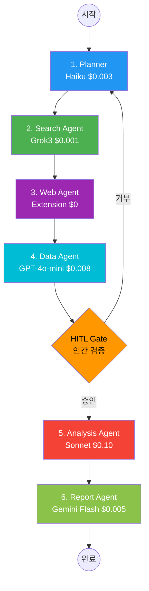
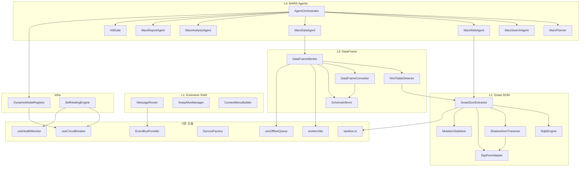

# H Chat AI Browser OS -- Spec-Driven Design

> **문서 버전**: 1.0.0
> **최종 수정**: 2026-03-15
> **상태**: Phase 101 기준 설계 명세
> **대상 독자**: 아키텍트, 테크 리드, 시니어 엔지니어

---

## 목차

1. [Executive Summary](#1-executive-summary)
2. [설계 원칙 및 방법론](#2-설계-원칙-및-방법론)
3. [L1 Extension 스펙-설계 매핑](#3-l1-extension-스펙-설계-매핑)
4. [L2 Smart DOM 스펙-설계 매핑](#4-l2-smart-dom-스펙-설계-매핑)
5. [L3 DataFrame 스펙-설계 매핑](#5-l3-dataframe-스펙-설계-매핑)
6. [L4 MARS Agent 스펙-설계 매핑](#6-l4-mars-agent-스펙-설계-매핑)
7. [Cross-cutting 스펙-설계 매핑](#7-cross-cutting-스펙-설계-매핑)
8. [모듈 인터페이스 카탈로그](#8-모듈-인터페이스-카탈로그)
9. [의존성 그래프 및 테스트 전략](#9-의존성-그래프-및-테스트-전략)
10. [부록: 전체 Traceability Matrix](#10-부록-전체-traceability-matrix)

---

## 1. Executive Summary

### 1.1 프로젝트 비전

H Chat AI Browser OS는 현대차그룹 5만명 임직원이 Chrome Side Panel에서 AI와 대화하며 업무를 완결하는 **자율형 AI 플랫폼**이다. 단순한 챗봇을 넘어 웹 페이지를 지능적으로 해석하고(L2), 데이터를 구조화하며(L3), 자율 리서치를 수행하는(L4) 4계층 아키텍처로 구성된다.

### 1.2 스펙 주도 설계(Spec-Driven Design) 방법론

본 문서는 **스펙 주도 설계(SDD)** 방법론을 채택한다. SDD는 모든 설계 결정이 명시적 스펙에서 파생되고, 모든 구현이 설계 결정으로 추적 가능한 방법론이다.

```
스펙(Spec) ──→ 설계(Design) ──→ 구현(Implementation)
   │                │                    │
   └── 검증 ←───── 추적 ←────────── 테스트
```

### 1.3 핵심 원칙 요약

| 원칙 | 설명 | 적용 |
|------|------|------|
| **검증 가능성(Verifiability)** | 모든 스펙은 테스트로 검증 가능해야 한다 | 9,350+ 테스트 목표 |
| **추적 가능성(Traceability)** | 스펙→설계→구현→테스트 전 구간 추적 | Traceability Matrix |
| **불변성(Invariance)** | 핵심 불변 조건은 어떤 상황에서도 위반 불가 | Zero Trust, PII 99.9%+ |

### 1.4 4-Layer 아키텍처 개요



### 1.5 수량 지표 요약

| 항목 | 현재 (Phase 101) | 목표 |
|------|------------------|------|
| 앱 수 | 10 | 10 |
| 신규 모듈 | 0 | **19** |
| 신규 코드 | 0 | **~6,100줄** |
| 단위 테스트 | 5,997 | **9,350+** |
| 커버리지 | 89.24% stmts | **85%+ 유지** |
| 재활용 모듈 | - | **12** |

---

## 2. 설계 원칙 및 방법론

### 2.1 스펙→설계→구현 삼각형

SDD의 핵심은 **삼각형 관계**이다. 어떤 구현도 설계 없이 존재하지 않고, 어떤 설계도 스펙 없이 존재하지 않는다.



### 2.2 3공리(Three Axioms)

#### 공리 1: 검증 가능성(Verifiability)

> 모든 스펙 항목은 자동화된 테스트로 검증 가능해야 한다.

```typescript
// 검증 불가능한 스펙 (BAD)
// "시스템은 빠르게 응답해야 한다"

// 검증 가능한 스펙 (GOOD)
// SPEC-L2-001: RQFP 점수 0.0-1.0 범위, 노이즈 60-70% 제거
describe('SPEC-L2-001: RQFP Score Range', () => {
  it('should return score between 0.0 and 1.0', () => {
    const score = rqfpEngine.calculate(testDom)
    expect(score).toBeGreaterThanOrEqual(0.0)
    expect(score).toBeLessThanOrEqual(1.0)
  })

  it('should remove 60-70% noise from raw HTML', () => {
    const result = smartDomExtractor.extract(noisyHtml)
    const ratio = 1 - result.content.length / noisyHtml.length
    expect(ratio).toBeGreaterThanOrEqual(0.6)
    expect(ratio).toBeLessThanOrEqual(0.7)
  })
})
```

#### 공리 2: 추적 가능성(Traceability)

> 스펙 ID → 설계 결정 ID → 모듈명 → 테스트 ID 전 구간이 추적 가능해야 한다.

| 구간 | From | To | 매핑 방법 |
|------|------|----|-----------|
| 스펙→설계 | SPEC-XX-NNN | DESIGN-XX-NNN | Traceability Matrix |
| 설계→모듈 | DESIGN-XX-NNN | ModuleName | 모듈 인터페이스 카탈로그 |
| 모듈→테스트 | ModuleName | TEST-XX-NNN | 테스트 파일 매핑 |
| 테스트→스펙 | TEST-XX-NNN | SPEC-XX-NNN | describe 블록 주석 |

#### 공리 3: 불변성(Invariance)

> 핵심 불변 조건은 시스템의 어떤 상태에서도 위반될 수 없다.

| 불변 조건 | 스펙 ID | 임계값 |
|-----------|---------|--------|
| PII 탐지율 | SPEC-ZT-001 | >= 99.9% |
| 보안 사고 | SPEC-ZT-002 | == 0건 |
| 세션 비용 | SPEC-L4-001 | <= $0.27 |
| 3-Strike 제한 | SPEC-SH-001 | MAX_HEAL == 3 |

### 2.3 Traceability Matrix 구조

Traceability Matrix는 스펙에서 테스트까지의 전체 추적 경로를 제공한다. 각 행(row)은 하나의 스펙 항목이며, 다음 열(column)로 구성된다:

| 열 | 설명 | 예시 |
|----|------|------|
| `spec_id` | 고유 스펙 식별자 | SPEC-L2-001 |
| `spec_desc` | 스펙 설명 | RQFP 점수 0.0-1.0 범위 |
| `design_id` | 설계 결정 식별자 | DESIGN-L2-001 |
| `design_desc` | 설계 결정 설명 | 가중 평균 공식 적용 |
| `module` | 구현 모듈명 | RqfpEngine |
| `test_ids` | 관련 테스트 ID 목록 | TEST-L2-001a, TEST-L2-001b |
| `priority` | 우선순위 | P0 / P1 / P2 |
| `phase` | 구현 예정 Phase | P102 |

### 2.4 품질 게이트(Quality Gates)

```
Phase 전환 조건:
├── S0 → P1: 커버리지 60%+ (핵심 경로)
├── P1 → P2: 커버리지 70%+ (에러 핸들링)
├── P2 → P3: 커버리지 80%+ (엣지 케이스)
└── P3 → P4: 커버리지 85%+ (성능 테스트)
```

---

## 3. L1 Extension 스펙-설계 매핑

### 3.1 스펙 정의

L1 Hybrid Extension은 Chrome MV3 기반의 확장 프로그램 셸이다. Side Panel UI, Popup 퀵액션, Context Menu 3-depth, Omnibox `hc` 키워드를 제공한다.

| 스펙 ID | 스펙 항목 | 요구 사항 |
|---------|-----------|-----------|
| SPEC-L1-001 | Side Panel UI | chrome.sidePanel API로 상시 접근 가능 |
| SPEC-L1-002 | Popup Quick Action | chrome.action API, 주요 기능 3개 즉시 접근 |
| SPEC-L1-003 | Context Menu | 3-depth 구조, 텍스트 선택 시 AI 기능 제공 |
| SPEC-L1-004 | Omnibox | `hc` 키워드로 주소창 AI 검색 |
| SPEC-L1-005 | Service Worker | 상태 관리, 5분 keep-alive 전략 |
| SPEC-L1-006 | Content Script | DOM 접근, MutationObserver 기반 변경 감지 |
| SPEC-L1-007 | Stealth Engine | 봇 우회, navigator.webdriver 패치 |
| SPEC-L1-008 | 메시지 라우팅 | Popup↔SW, SW→CS, Port 기반 장기 연결 |

### 3.2 설계 결정

| 설계 ID | 스펙 ID | 설계 결정 | 근거 |
|---------|---------|-----------|------|
| DESIGN-L1-001 | SPEC-L1-001 | Side Panel은 React 19 SPA, 독립 번들 | 메인 페이지와 격리, 번들 크기 최소화 |
| DESIGN-L1-002 | SPEC-L1-002 | Popup은 경량 HTML + 최소 JS | 로딩 속도 200ms 이내 목표 |
| DESIGN-L1-003 | SPEC-L1-003 | Context Menu는 동적 생성, 선택 텍스트 기반 | 문맥 기반 메뉴 구성 |
| DESIGN-L1-004 | SPEC-L1-004 | Omnibox는 chrome.omnibox.onInputChanged 이벤트 | 실시간 자동 완성 제공 |
| DESIGN-L1-005 | SPEC-L1-005 | chrome.alarms(4.5분) + chrome.offscreen keep-alive | MV3 SW 비활성화 방지 |
| DESIGN-L1-006 | SPEC-L1-006 | Content Script는 격리된 world에서 실행, DOM 직접 접근 | XSS 방지, 페이지 JS와 충돌 방지 |
| DESIGN-L1-007 | SPEC-L1-007 | chrome.debugger 대신 CSS 기반 오버레이 | 디버거 탐지 방지 |
| DESIGN-L1-008 | SPEC-L1-008 | MessageRouter 패턴, 타입 안전 메시지 | 런타임 타입 오류 제거 |

### 3.3 Chrome API 매핑표

| Chrome API | 용도 | 스펙 ID | 모듈 |
|------------|------|---------|------|
| `chrome.sidePanel` | Side Panel 열기/닫기 | SPEC-L1-001 | SidePanelManager |
| `chrome.action` | Popup 표시, 배지 업데이트 | SPEC-L1-002 | PopupController |
| `chrome.contextMenus` | 우클릭 메뉴 등록 | SPEC-L1-003 | ContextMenuBuilder |
| `chrome.omnibox` | 주소창 `hc` 키워드 | SPEC-L1-004 | OmniboxHandler |
| `chrome.runtime` | SW↔Popup 메시지 | SPEC-L1-008 | MessageRouter |
| `chrome.tabs` | SW→CS 메시지 | SPEC-L1-008 | MessageRouter |
| `chrome.offscreen` | keep-alive 문서 | SPEC-L1-005 | KeepAliveManager |
| `chrome.scripting` | Content Script 동적 주입 | SPEC-L1-006 | ScriptInjector |
| `chrome.alarms` | 4.5분 주기 알람 | SPEC-L1-005 | KeepAliveManager |

### 3.4 메시지 라우팅 설계

```typescript
// L1 메시지 타입 정의
type MessageType =
  | 'EXTRACT_DOM'      // SW → CS: DOM 추출 요청
  | 'DOM_RESULT'       // CS → SW: DOM 추출 결과
  | 'QUICK_ACTION'     // Popup → SW: 퀵 액션 실행
  | 'CONTEXT_ACTION'   // CS → SW: 컨텍스트 메뉴 액션
  | 'OMNIBOX_QUERY'    // Omnibox → SW: 검색 쿼리
  | 'SIDE_PANEL_CMD'   // SW → SidePanel: UI 명령
  | 'KEEP_ALIVE_PING'  // Offscreen → SW: keep-alive

interface ExtensionMessage<T = unknown> {
  readonly type: MessageType
  readonly payload: T
  readonly timestamp: number
  readonly correlationId: string
}
```

### 3.5 기존 모듈 재활용

L1은 기존 `apps/extension/` (MV3 Shell)을 기반으로 확장한다:

| 기존 모듈 | 위치 | 재활용 방법 |
|-----------|------|-------------|
| MV3 Shell | `apps/extension/` | manifest.json 확장, 권한 추가 |
| sanitize.ts | `packages/ui/src/utils/` | PII 필터링 재사용 |
| EventBusProvider | `packages/ui/src/hooks/` | 컴포넌트 간 이벤트 전달 |

---

## 4. L2 Smart DOM 스펙-설계 매핑

### 4.1 스펙 정의

L2 Smart DOM은 웹 페이지에서 노이즈를 60-70% 제거하고, 의미 있는 콘텐츠만 추출하는 Page Intelligence 레이어이다.

| 스펙 ID | 스펙 항목 | 요구 사항 |
|---------|-----------|-----------|
| SPEC-L2-001 | 노이즈 제거율 | 60-70% 제거 |
| SPEC-L2-002 | 비용 효율 | $0.12/작업 (Vision 대비 88% 절감) |
| SPEC-L2-003 | 처리 속도 | 0.9분/작업 (Vision 대비 14배 빠름) |
| SPEC-L2-004 | RQFP 점수 | 0.0-1.0 범위, 가중 평균 공식 |
| SPEC-L2-005 | 사이트 복잡도 대응 | 정적~Very High 5단계 |
| SPEC-L2-006 | Shadow DOM 지원 | SAP Fiori 등 Shadow DOM 탐색 |
| SPEC-L2-007 | DOM 안정화 | SPA 렌더링 완료 대기 |

### 4.2 설계 결정

| 설계 ID | 스펙 ID | 설계 결정 | 근거 |
|---------|---------|-----------|------|
| DESIGN-L2-001 | SPEC-L2-001 | Readability.js→RQFP→Semantic DOM Tree 3단계 파이프라인 | 단계적 정제로 정확도 극대화 |
| DESIGN-L2-002 | SPEC-L2-002 | 텍스트 기반 추출 (Vision API 미사용) | 비용 88% 절감 |
| DESIGN-L2-003 | SPEC-L2-004 | RQFP = R*0.3 + Q*0.25 + F*0.25 + P*0.2 | 4가지 차원의 균형 잡힌 평가 |
| DESIGN-L2-004 | SPEC-L2-006 | ShadowDomTraverser로 재귀적 Shadow Root 탐색 | 엔터프라이즈 SPA 지원 |
| DESIGN-L2-005 | SPEC-L2-005 | SapFioriAdapter로 SAP 전용 위젯 매핑 | 현대차 SAP 시스템 호환 |
| DESIGN-L2-006 | SPEC-L2-007 | MutationStabilizer로 DOM 변경 수렴 감지 | SPA 렌더링 완료 판단 |

### 4.3 RQFP 엔진 상세 설계

RQFP(Relevance, Quality, Freshness, Proximity) 엔진은 DOM 노드의 중요도를 0.0-1.0으로 스코어링한다.

```
RQFP Score = Relevance * 0.3 + Quality * 0.25 + Freshness * 0.25 + Proximity * 0.2
```

| 차원 | 가중치 | 측정 방법 |
|------|--------|-----------|
| **Relevance** | 0.30 | 쿼리 키워드 매칭, TF-IDF 유사도 |
| **Quality** | 0.25 | 텍스트/HTML 비율, 구조적 일관성 |
| **Freshness** | 0.25 | datetime 속성, 최근 수정 시점 |
| **Proximity** | 0.20 | DOM 트리에서 메인 콘텐츠까지 거리 |

### 4.4 사이트 복잡도 분류 및 전략

| 복잡도 | 예시 | 추출 전략 | 추가 모듈 |
|--------|------|-----------|-----------|
| **Low** | 정적 HTML 블로그 | Readability.js 기본 | - |
| **Medium** | SPA (React/Vue) | Readability.js + MutationStabilizer | MutationStabilizer |
| **High** | Shadow DOM (SAP Fiori) | ShadowDomTraverser + SapFioriAdapter | ShadowDomTraverser, SapFioriAdapter |
| **High** | iframe 임베디드 | cross-origin 프록시 | IframeExtractor |
| **Very High** | 동적 차트/캔버스 | Canvas→텍스트 변환 | ChartExtractor |

### 4.5 파이프라인 플로우



### 4.6 L2 모듈 구성 (~1,500줄)

| 모듈명 | 예상 줄수 | 역할 |
|--------|----------|------|
| SmartDomExtractor | ~400줄 | 전체 파이프라인 오케스트레이터 |
| RqfpEngine | ~350줄 | RQFP 스코어 계산 |
| ShadowDomTraverser | ~300줄 | Shadow DOM 재귀 탐색 |
| SapFioriAdapter | ~250줄 | SAP Fiori 위젯→시맨틱 매핑 |
| MutationStabilizer | ~200줄 | DOM 변경 수렴 감지 |
| **합계** | **~1,500줄** | |

---

## 5. L3 DataFrame 스펙-설계 매핑

### 5.1 스펙 정의

L3 DataFrame Engine은 HTML 테이블/리스트를 자동 감지하고 JSON/CSV/Excel로 변환하며, 스키마를 자동 추론한다.

| 스펙 ID | 스펙 항목 | 요구 사항 |
|---------|-----------|-----------|
| SPEC-L3-001 | 테이블 자동 감지 | HTML table, dl/dt/dd, ul/ol 리스트 |
| SPEC-L3-002 | 데이터 변환 | JSON, CSV, Excel(xlsx) 출력 지원 |
| SPEC-L3-003 | 스키마 추론 | string, number, date, boolean 자동 타입 추론 |
| SPEC-L3-004 | Web Worker | 메인 스레드 블로킹 없이 변환 수행 |
| SPEC-L3-005 | 대용량 지원 | 10,000행 이상 테이블 처리 가능 |

### 5.2 설계 결정

| 설계 ID | 스펙 ID | 설계 결정 | 근거 |
|---------|---------|-----------|------|
| DESIGN-L3-001 | SPEC-L3-001 | 휴리스틱 기반 테이블 감지 + 구조 점수 | 다양한 HTML 패턴 대응 |
| DESIGN-L3-002 | SPEC-L3-002 | SheetJS(xlsx) 라이브러리 활용 | 기존 workerUtils.ts와 통합 |
| DESIGN-L3-003 | SPEC-L3-003 | 정규식 + 패턴 매칭 기반 타입 추론 | 외부 의존성 최소화 |
| DESIGN-L3-004 | SPEC-L3-004 | Web Worker + createWorkerClient() 패턴 | 기존 workerUtils.ts 재사용 |
| DESIGN-L3-005 | SPEC-L3-005 | 청크 단위(1000행) 스트리밍 처리 | 메모리 사용량 제한 |

### 5.3 감지→변환→스키마→Worker 파이프라인

```
HTML Document
    │
    ▼
┌──────────────────┐
│ HtmlTableDetector │  ← <table>, <dl>, <ul/ol> 감지
│ structureScore()  │  ← 0.0-1.0 구조 점수
└────────┬─────────┘
         │ DetectedTable[]
         ▼
┌──────────────────┐
│ SchemaInferrer    │  ← 열별 타입 추론 (string/number/date/boolean)
│ inferSchema()     │  ← confidence 포함
└────────┬─────────┘
         │ InferredSchema
         ▼
┌──────────────────┐
│ DataFrameConverter│  ← JSON/CSV/Excel 변환
│ toJson/toCsv/    │
│ toExcel()        │  ← SheetJS 활용
└────────┬─────────┘
         │
         ▼
┌──────────────────┐
│ DataFrameWorker   │  ← Web Worker에서 실행
│ (off-main-thread) │  ← createWorkerClient()
└──────────────────┘
```

### 5.4 스키마 추론 규칙

| 타입 | 감지 패턴 | 예시 |
|------|-----------|------|
| `number` | `/^-?\d+(\.\d+)?$/` | `42`, `3.14`, `-100` |
| `date` | ISO 8601, `yyyy-mm-dd`, `mm/dd/yyyy` | `2026-03-15`, `03/15/2026` |
| `boolean` | `true/false`, `yes/no`, `Y/N`, `1/0` | `true`, `Yes`, `1` |
| `string` | 위 패턴에 매칭되지 않는 모든 값 | `Hello World` |

추론 신뢰도(confidence)는 열의 전체 값 중 해당 타입에 매칭되는 비율로 계산:

```typescript
// confidence = 매칭 값 수 / 전체 값 수
// confidence >= 0.8이면 해당 타입 확정
// confidence < 0.8이면 string으로 폴백
```

### 5.5 L3 모듈 구성 (~1,150줄)

| 모듈명 | 예상 줄수 | 역할 |
|--------|----------|------|
| HtmlTableDetector | ~350줄 | HTML 테이블/리스트 감지, 구조 점수 |
| DataFrameConverter | ~350줄 | JSON/CSV/Excel 변환 (SheetJS) |
| SchemaInferrer | ~250줄 | 열별 타입 추론, confidence 계산 |
| DataFrameWorker | ~200줄 | Web Worker 래퍼, 청크 처리 |
| **합계** | **~1,150줄** | |

### 5.6 기존 모듈 재활용

| 기존 모듈 | 위치 | 재활용 방법 |
|-----------|------|-------------|
| workerUtils.ts | `packages/ui/src/utils/` | createWorkerClient() 패턴 |
| SheetJS (xlsx) | npm 의존성 | Excel 생성/파싱 |
| xlsxWorker.ts | `packages/ui/src/` | Worker 패턴 참조 |

---

## 6. L4 MARS Agent 스펙-설계 매핑

### 6.1 스펙 정의

L4 MARS(Multi-Agent Research System) Agent Factory는 6단계 자율 리서치 파이프라인으로, $0.27/세션 비용으로 엔터프라이즈급 리서치를 수행한다.

| 스펙 ID | 스펙 항목 | 요구 사항 |
|---------|-----------|-----------|
| SPEC-L4-001 | 세션 비용 | <= $0.27/세션 |
| SPEC-L4-002 | 6단계 파이프라인 | Plan→Search→Web→Data→Analysis→Report |
| SPEC-L4-003 | HITL Gate | 인간 검증 게이트 (Human-in-the-Loop) |
| SPEC-L4-004 | 모델 분배 | 단계별 최적 LLM 할당 |
| SPEC-L4-005 | 상태 관리 | LangGraph StateGraph 기반 |
| SPEC-L4-006 | 에이전트 협업 | CrewAI 0.5 기반 역할 분담 |

### 6.2 설계 결정

| 설계 ID | 스펙 ID | 설계 결정 | 근거 |
|---------|---------|-----------|------|
| DESIGN-L4-001 | SPEC-L4-001 | 단계별 차등 모델 배치로 비용 최적화 | Haiku~Sonnet 혼합 |
| DESIGN-L4-002 | SPEC-L4-002 | LangGraph 0.2 StateGraph 기반 DAG 파이프라인 | 조건부 분기, 재시도 지원 |
| DESIGN-L4-003 | SPEC-L4-003 | HitlGate 클래스, Analysis 전 필수 검증 | 잘못된 분석 방지 |
| DESIGN-L4-004 | SPEC-L4-004 | DynamicModelRegistry 연동 | Cross-cutting 모듈 재사용 |
| DESIGN-L4-005 | SPEC-L4-005 | ResearchState TypedDict, 불변 업데이트 | 상태 추적 및 디버깅 |
| DESIGN-L4-006 | SPEC-L4-006 | CrewAI Task/Agent 패턴 | 역할 기반 책임 분리 |

### 6.3 6단계 파이프라인 상세



### 6.4 단계별 비용 분석

| 단계 | 모델 | 단가/세션 | 비율 |
|------|------|-----------|------|
| 1. Planner | Haiku 4.5 | $0.003 | 1.1% |
| 2. Search | Grok 3 | $0.001 | 0.4% |
| 3. Web | Extension (로컬) | $0.000 | 0.0% |
| 4. Data | GPT-4o-mini | $0.008 | 3.0% |
| 5. Analysis | Sonnet 4.6 | $0.100 | 37.0% |
| 6. Report | Gemini Flash | $0.005 | 1.9% |
| **Overhead** | 오케스트레이션 | $0.153 | 56.7% |
| **합계** | | **$0.270** | **100%** |

### 6.5 LangGraph 상태 설계

```python
from typing import TypedDict, Annotated
from langgraph.graph import StateGraph

class ResearchState(TypedDict):
    query: str                          # 원본 리서치 쿼리
    plan: dict                          # Planner 출력
    search_results: list[dict]          # 검색 결과
    web_content: list[dict]             # 웹 추출 콘텐츠
    structured_data: list[dict]         # 구조화된 데이터
    hitl_approved: bool                 # HITL 승인 여부
    analysis: dict                      # 분석 결과
    report: str                         # 최종 리포트
    cost_tracker: dict                  # 단계별 비용 추적
    error_log: list[str]                # 에러 로그
    iteration: int                      # 현재 반복 횟수

graph = StateGraph(ResearchState)
graph.add_node("planner", mars_planner)
graph.add_node("search", mars_search_agent)
graph.add_node("web", mars_web_agent)
graph.add_node("data", mars_data_agent)
graph.add_node("hitl", hitl_gate)
graph.add_node("analysis", mars_analysis_agent)
graph.add_node("report", mars_report_agent)

graph.add_edge("planner", "search")
graph.add_edge("search", "web")
graph.add_edge("web", "data")
graph.add_edge("data", "hitl")
graph.add_conditional_edges("hitl", check_approval, {
    True: "analysis",
    False: "planner"
})
graph.add_edge("analysis", "report")
```

### 6.6 L4 모듈 구성 (~2,700줄 Python)

| 모듈명 | 예상 줄수 | 역할 |
|--------|----------|------|
| MarsPlanner | ~350줄 | 리서치 계획 수립, 서브태스크 분해 |
| MarsSearchAgent | ~300줄 | 외부 검색 API 호출, 결과 랭킹 |
| MarsWebAgent | ~350줄 | Extension 연동, 웹 페이지 추출 |
| MarsDataAgent | ~300줄 | 데이터 정제, DataFrame 변환 |
| MarsAnalysisAgent | ~400줄 | 심층 분석, 인사이트 도출 |
| MarsReportAgent | ~300줄 | 보고서 생성, 포맷팅 |
| HitlGate | ~200줄 | HITL 검증, 승인/거부 처리 |
| AgentOrchestrator | ~500줄 | LangGraph 파이프라인 구성, 비용 추적 |
| **합계** | **~2,700줄** | |

---

## 7. Cross-cutting 스펙-설계 매핑

### 7.1 Dynamic Multi-Model Orchestrator

#### 7.1.1 스펙

| 스펙 ID | 스펙 항목 | 요구 사항 |
|---------|-----------|-----------|
| SPEC-MM-001 | 동적 모델 할당 | 작업별 최적 LLM 동적 선택 |
| SPEC-MM-002 | 5프로바이더 지원 | Anthropic, OpenAI, Google, xAI, Local |
| SPEC-MM-003 | 스코어링 공식 | quality*0.4 + latency*0.3 + cost*0.2 + availability*0.1 |
| SPEC-MM-004 | Rate Limiter | getWaitTime() 30초 이상 모델 제외 |
| SPEC-MM-005 | Circuit Breaker | 에러율 30% → OPEN, 30초 후 HALF-OPEN |

#### 7.1.2 설계 결정

| 설계 ID | 스펙 ID | 설계 결정 | 근거 |
|---------|---------|-----------|------|
| DESIGN-MM-001 | SPEC-MM-003 | 가중 평균 스코어링 + 실시간 메트릭 | 다차원 평가 |
| DESIGN-MM-002 | SPEC-MM-004 | 토큰 버킷 Rate Limiter | 균일한 요청 분배 |
| DESIGN-MM-003 | SPEC-MM-005 | 3-상태 Circuit Breaker (CLOSED→OPEN→HALF-OPEN) | 장애 전파 차단 |

#### 7.1.3 프로바이더 카탈로그

| 프로바이더 | 대표 모델 | 강점 | 적합 단계 |
|-----------|-----------|------|-----------|
| Anthropic | Opus 4.6 | 깊은 추론, 안전성 | L4 Analysis |
| OpenAI | GPT-5.2 | 범용, 코드 생성 | L4 Data |
| Google | Gemini 2.5 | 대용량 컨텍스트 | L4 Report |
| xAI | Grok 3 | 실시간 검색 | L4 Search |
| Local | Nano | 오프라인, 저비용 | L1 분류 |

#### 7.1.4 스코어링 공식 상세

```
ModelScore = quality * 0.4 + latency * 0.3 + cost * 0.2 + availability * 0.1

where:
  quality     = ELO 점수 정규화 (0.0-1.0)
  latency     = 1 - (응답시간ms / MAX_LATENCY_MS)  // 빠를수록 높음
  cost        = 1 - (비용 / MAX_COST)               // 저렴할수록 높음
  availability = Circuit Breaker 상태에 따른 가용성
    - CLOSED: 1.0
    - HALF_OPEN: 0.5
    - OPEN: 0.0
```

#### 7.1.5 Circuit Breaker 상태 전이

```
CLOSED ──[에러율 >= 30%]──→ OPEN ──[30초 경과]──→ HALF_OPEN
   ↑                                                    │
   └──────────[성공]──────────────────────────────────────┘
                                                         │
   OPEN ←─────────[실패]────────────────────────────────┘
```

### 7.2 Self-Healing System

#### 7.2.1 스펙

| 스펙 ID | 스펙 항목 | 요구 사항 |
|---------|-----------|-----------|
| SPEC-SH-001 | 3-Strike 제한 | MAX_HEAL=3, 초과 시 OPEN |
| SPEC-SH-002 | 복구 시간 단축 | 55-70% 단축 |
| SPEC-SH-003 | 구문 오류 수정 | 85-90% 자동 수정 |
| SPEC-SH-004 | 쿨다운 백오프 | 5→15→45분 지수 백오프 |
| SPEC-SH-005 | OPEN 상태 지속 | 3600초 (1시간) |

#### 7.2.2 설계 결정

| 설계 ID | 스펙 ID | 설계 결정 | 근거 |
|---------|---------|-----------|------|
| DESIGN-SH-001 | SPEC-SH-001 | 3-Strike 패턴 + Circuit Breaker 통합 | 무한 루프 방지 |
| DESIGN-SH-002 | SPEC-SH-003 | Tree-sitter AST 파싱 + LLM 진단 | 구조적 오류 감지 |
| DESIGN-SH-003 | SPEC-SH-003 | Unified Diff 기반 패치 적용 | 최소 변경 원칙 |
| DESIGN-SH-004 | SPEC-SH-004 | 지수 백오프 타이머 | 시스템 안정화 시간 확보 |

#### 7.2.3 Self-Healing 파이프라인

```
Signal Detection
    │ 오류 신호 감지
    ▼
Diagnosis (Tree-sitter AST + LLM)
    │ 원인 분석
    ▼
Healing (Unified Diffs 생성)
    │ 패치 적용
    ▼
Verification (테스트 실행)
    │ 검증 결과
    ├── 성공 → CLOSED (카운터 리셋)
    └── 실패 → Strike +1
              ├── Strike < 3 → 쿨다운 후 재시도
              └── Strike >= 3 → OPEN (1시간)
```

#### 7.2.4 쿨다운 백오프 계산

```typescript
// COOLDOWN_BASE = 300초 (5분)
// 지수 백오프: 5분 → 15분 → 45분
function getCooldownMs(strike: number): number {
  return COOLDOWN_BASE * Math.pow(3, strike - 1) * 1000
}
// strike 1: 300 * 1 = 300초 (5분)
// strike 2: 300 * 3 = 900초 (15분)
// strike 3: 300 * 9 = 2700초 (45분) → OPEN 전이
```

#### 7.2.5 기존 모듈 재활용

| 기존 모듈 | 위치 | 재활용 방법 |
|-----------|------|-------------|
| useCircuitBreaker | `packages/ui/src/hooks/` | CLOSED/OPEN/HALF-OPEN 상태 관리 |
| useHealthMonitor | `packages/ui/src/hooks/` | 서비스 헬스 체크 |

### 7.3 Zero Trust Security

#### 7.3.1 스펙

| 스펙 ID | 스펙 항목 | 요구 사항 |
|---------|-----------|-----------|
| SPEC-ZT-001 | PII 탐지율 | >= 99.9% |
| SPEC-ZT-002 | 보안 사고 | == 0건 |
| SPEC-ZT-003 | 6계층 방어 | PII→블록리스트→감사→프록시→OPA→Vault |
| SPEC-ZT-004 | PII 패턴 | 11개 패턴 (기존 7 + 신규 4) |
| SPEC-ZT-005 | 감사 로그 | SHA-256 해시 체인, INSERT ONLY |
| SPEC-ZT-006 | 블록리스트 | 20 도메인 + 6 패턴 (기존) |

#### 7.3.2 설계 결정

| 설계 ID | 스펙 ID | 설계 결정 | 근거 |
|---------|---------|-----------|------|
| DESIGN-ZT-001 | SPEC-ZT-003 | 6계층 방어 심층 방어(Defense in Depth) | 단일 계층 실패 시 보호 |
| DESIGN-ZT-002 | SPEC-ZT-004 | 기존 sanitize.ts 확장 (7→11 패턴) | 코드 재사용 |
| DESIGN-ZT-003 | SPEC-ZT-005 | PostgreSQL + SHA-256 해시 체인 | 변조 불가 감사 추적 |
| DESIGN-ZT-004 | SPEC-ZT-003 | OPA(Open Policy Agent) 기반 정책 엔진 | 선언적 정책 관리 |

#### 7.3.3 6계층 방어 구조

```
Layer 1: PII Scrubbing (sanitize.ts, 11패턴)
    │
Layer 2: 블록리스트 (20 도메인 + 6 패턴)
    │
Layer 3: 감사 로그 (SHA-256 해시 체인, INSERT ONLY)
    │
Layer 4: API 프록시 (서버 사이드 API 키 보호)
    │
Layer 5: OPA (Open Policy Agent, 정책 엔진)
    │
Layer 6: Vault (시크릿 관리, 키 로테이션)
```

#### 7.3.4 PII 11패턴 정의

| # | 패턴명 | 정규식 개요 | 상태 |
|---|--------|-------------|------|
| 1 | 주민등록번호 | `\d{6}-[1-4]\d{6}` | 기존 |
| 2 | 전화번호 | `01[016789]-\d{3,4}-\d{4}` | 기존 |
| 3 | 이메일 | RFC 5322 패턴 | 기존 |
| 4 | 신용카드 | Luhn 체크 + 4자리 그룹 | 기존 |
| 5 | 여권번호 | `[A-Z]\d{8}` | 기존 |
| 6 | 운전면허 | `\d{2}-\d{2}-\d{6}-\d{2}` | 기존 |
| 7 | 계좌번호 | 은행별 패턴 (10-16자리) | 기존 |
| 8 | 건강보험번호 | `\d{10}` (10자리) | **신규** |
| 9 | 사업자등록번호 | `\d{3}-\d{2}-\d{5}` | **신규** |
| 10 | 외국인등록번호 | `\d{6}-[5-8]\d{6}` | **신규** |
| 11 | 법인등록번호 | `\d{6}-\d{7}` | **신규** |

#### 7.3.5 감사 로그 해시 체인

```sql
-- INSERT ONLY (UPDATE/DELETE 금지)
CREATE TABLE audit_logs (
    id            BIGSERIAL PRIMARY KEY,
    timestamp     TIMESTAMPTZ NOT NULL DEFAULT NOW(),
    actor_id      UUID NOT NULL,
    action        VARCHAR(50) NOT NULL,
    resource_type VARCHAR(50) NOT NULL,
    resource_id   VARCHAR(255),
    payload       JSONB,
    prev_hash     CHAR(64) NOT NULL,         -- 이전 로그의 SHA-256
    hash          CHAR(64) NOT NULL UNIQUE    -- SHA-256(id + timestamp + actor + action + prev_hash)
);

-- 해시 체인 무결성 검증
-- hash = SHA-256(id || timestamp || actor_id || action || prev_hash)
```

---

## 8. 모듈 인터페이스 카탈로그

### 8.1 L2 Smart DOM 모듈 (TypeScript)

#### 8.1.1 SmartDomExtractor

```typescript
interface ExtractOptions {
  readonly url: string
  readonly complexity: 'low' | 'medium' | 'high' | 'very-high'
  readonly rqfpThreshold: number      // 기본 0.5
  readonly maxDepth: number           // DOM 탐색 최대 깊이, 기본 20
  readonly timeout: number            // ms, 기본 30000
}

interface ExtractResult {
  readonly content: string            // 정제된 텍스트
  readonly semanticTree: SemanticNode // 구조화된 DOM 트리
  readonly metadata: PageMetadata     // 페이지 메타데이터
  readonly rqfpScores: RqfpScore[]    // 노드별 RQFP 점수
  readonly stats: ExtractionStats     // 추출 통계
}

interface ExtractionStats {
  readonly originalSize: number       // 원본 HTML 크기 (bytes)
  readonly extractedSize: number      // 추출 결과 크기 (bytes)
  readonly noiseRatio: number         // 제거된 노이즈 비율 (0.0-1.0)
  readonly processingTimeMs: number   // 처리 시간 (ms)
  readonly nodeCount: number          // 처리된 노드 수
}

interface SmartDomExtractor {
  extract(html: string, options: ExtractOptions): Promise<ExtractResult>
  extractFromTab(tabId: number, options: Omit<ExtractOptions, 'url'>): Promise<ExtractResult>
  detectComplexity(html: string): Promise<ExtractOptions['complexity']>
}
```

#### 8.1.2 RqfpEngine

```typescript
interface RqfpScore {
  readonly nodeId: string
  readonly relevance: number          // 0.0-1.0
  readonly quality: number            // 0.0-1.0
  readonly freshness: number          // 0.0-1.0
  readonly proximity: number          // 0.0-1.0
  readonly total: number              // 가중 평균 (0.0-1.0)
}

interface RqfpConfig {
  readonly weights: {
    readonly relevance: number        // 기본 0.30
    readonly quality: number          // 기본 0.25
    readonly freshness: number        // 기본 0.25
    readonly proximity: number        // 기본 0.20
  }
  readonly query?: string             // 관련성 평가용 쿼리
}

interface RqfpEngine {
  calculate(node: SemanticNode, config: RqfpConfig): RqfpScore
  calculateBatch(nodes: SemanticNode[], config: RqfpConfig): RqfpScore[]
  filter(nodes: SemanticNode[], threshold: number, config: RqfpConfig): SemanticNode[]
}
```

#### 8.1.3 ShadowDomTraverser

```typescript
interface TraversalResult {
  readonly flatNodes: SemanticNode[]  // 평탄화된 노드 목록
  readonly shadowRoots: number        // 발견된 Shadow Root 수
  readonly maxDepth: number           // 최대 탐색 깊이
}

interface ShadowDomTraverser {
  traverse(root: Element, maxDepth?: number): TraversalResult
  hasShadowDom(element: Element): boolean
  flattenShadowTree(root: Element): SemanticNode[]
}
```

#### 8.1.4 SapFioriAdapter

```typescript
interface FioriWidget {
  readonly type: string               // sap.m.Table, sap.ui.table.Table 등
  readonly data: unknown              // 추출된 데이터
  readonly metadata: Record<string, string>
}

interface SapFioriAdapter {
  detect(document: Document): boolean
  extractWidgets(root: Element): FioriWidget[]
  mapToSemantic(widget: FioriWidget): SemanticNode
}
```

#### 8.1.5 MutationStabilizer

```typescript
interface StabilizationConfig {
  readonly maxWaitMs: number          // 최대 대기 시간, 기본 10000
  readonly debounceMs: number         // 디바운스 간격, 기본 500
  readonly mutationThreshold: number  // 수렴 판단 임계값, 기본 3
}

interface MutationStabilizer {
  waitForStable(target: Element, config?: StabilizationConfig): Promise<void>
  isStable(target: Element): boolean
  observe(target: Element, callback: () => void): () => void  // unsubscribe 반환
}
```

### 8.2 L3 DataFrame 모듈 (TypeScript)

#### 8.2.1 HtmlTableDetector

```typescript
interface DetectedTable {
  readonly element: Element
  readonly type: 'table' | 'definition-list' | 'ordered-list' | 'unordered-list'
  readonly rows: number
  readonly columns: number
  readonly structureScore: number     // 0.0-1.0
  readonly headers: string[]
  readonly hasHeader: boolean
}

interface HtmlTableDetector {
  detect(root: Element): DetectedTable[]
  getStructureScore(element: Element): number
  isDataTable(element: Element): boolean  // 레이아웃 테이블 제외
}
```

#### 8.2.2 DataFrameConverter

```typescript
type OutputFormat = 'json' | 'csv' | 'excel'

interface ConvertOptions {
  readonly format: OutputFormat
  readonly schema?: InferredSchema
  readonly includeHeaders: boolean    // 기본 true
  readonly sheetName?: string         // Excel용
  readonly delimiter?: string         // CSV용, 기본 ','
}

interface ConvertResult {
  readonly data: ArrayBuffer | string // Excel은 ArrayBuffer, 나머지는 string
  readonly format: OutputFormat
  readonly rowCount: number
  readonly columnCount: number
  readonly schema: InferredSchema
}

interface DataFrameConverter {
  toJson(table: DetectedTable): string
  toCsv(table: DetectedTable, delimiter?: string): string
  toExcel(table: DetectedTable, sheetName?: string): ArrayBuffer
  convert(table: DetectedTable, options: ConvertOptions): ConvertResult
}
```

#### 8.2.3 SchemaInferrer

```typescript
type ColumnType = 'string' | 'number' | 'date' | 'boolean'

interface ColumnSchema {
  readonly name: string
  readonly type: ColumnType
  readonly confidence: number         // 0.0-1.0
  readonly nullable: boolean
  readonly uniqueCount: number
  readonly sampleValues: string[]     // 최대 5개
}

interface InferredSchema {
  readonly columns: ColumnSchema[]
  readonly rowCount: number
  readonly inferredAt: number         // timestamp
}

interface SchemaInferrer {
  infer(table: DetectedTable): InferredSchema
  inferColumn(values: string[]): ColumnSchema
  validateValue(value: string, type: ColumnType): boolean
}
```

#### 8.2.4 DataFrameWorker

```typescript
interface WorkerMessage {
  readonly type: 'DETECT' | 'CONVERT' | 'INFER_SCHEMA'
  readonly payload: unknown
  readonly chunkIndex?: number
  readonly totalChunks?: number
}

interface WorkerResult {
  readonly type: 'RESULT' | 'PROGRESS' | 'ERROR'
  readonly data: unknown
  readonly progress?: number          // 0-100
}

// Web Worker 인터페이스 (createWorkerClient 패턴)
interface DataFrameWorker {
  detect(html: string): Promise<DetectedTable[]>
  convert(table: DetectedTable, options: ConvertOptions): Promise<ConvertResult>
  inferSchema(table: DetectedTable): Promise<InferredSchema>
  terminate(): void
}
```

### 8.3 L4 MARS Agent 모듈 (Python)

#### 8.3.1 MarsPlanner

```python
from typing import Protocol
from dataclasses import dataclass

@dataclass(frozen=True)
class ResearchPlan:
    query: str
    sub_tasks: list[SubTask]
    estimated_cost: float
    estimated_time_seconds: int
    model_assignments: dict[str, str]  # step_name → model_name

@dataclass(frozen=True)
class SubTask:
    id: str
    description: str
    step: str                          # 'search' | 'web' | 'data' | 'analysis' | 'report'
    dependencies: list[str]            # 의존 SubTask ID
    priority: int                      # 1 (highest) - 5 (lowest)

class MarsPlanner(Protocol):
    async def create_plan(self, query: str, context: dict) -> ResearchPlan: ...
    async def refine_plan(self, plan: ResearchPlan, feedback: str) -> ResearchPlan: ...
    def estimate_cost(self, plan: ResearchPlan) -> float: ...
```

#### 8.3.2 MarsSearchAgent

```python
@dataclass(frozen=True)
class SearchResult:
    url: str
    title: str
    snippet: str
    relevance_score: float             # 0.0-1.0
    source: str                        # 'google' | 'bing' | 'arxiv' | 'internal'

class MarsSearchAgent(Protocol):
    async def search(self, query: str, max_results: int = 10) -> list[SearchResult]: ...
    async def rank(self, results: list[SearchResult], query: str) -> list[SearchResult]: ...
    async def deduplicate(self, results: list[SearchResult]) -> list[SearchResult]: ...
```

#### 8.3.3 MarsWebAgent

```python
@dataclass(frozen=True)
class WebContent:
    url: str
    title: str
    content: str                       # L2 SmartDOM 추출 결과
    extracted_at: str                  # ISO 8601
    content_type: str                  # 'article' | 'table' | 'mixed'
    metadata: dict

class MarsWebAgent(Protocol):
    async def fetch(self, urls: list[str]) -> list[WebContent]: ...
    async def extract_via_extension(self, tab_id: int) -> WebContent: ...
    async def batch_extract(self, urls: list[str], concurrency: int = 3) -> list[WebContent]: ...
```

#### 8.3.4 MarsDataAgent

```python
@dataclass(frozen=True)
class StructuredData:
    source_url: str
    format: str                        # 'json' | 'csv' | 'dataframe'
    schema: dict                       # 열 이름 → 타입
    rows: list[dict]
    row_count: int
    column_count: int

class MarsDataAgent(Protocol):
    async def structure(self, content: WebContent) -> StructuredData: ...
    async def merge(self, datasets: list[StructuredData]) -> StructuredData: ...
    async def validate(self, data: StructuredData) -> list[str]: ...  # 검증 이슈 목록
```

#### 8.3.5 MarsAnalysisAgent

```python
@dataclass(frozen=True)
class AnalysisResult:
    summary: str
    key_findings: list[str]
    data_insights: list[dict]
    confidence_score: float            # 0.0-1.0
    methodology: str
    limitations: list[str]
    references: list[str]

class MarsAnalysisAgent(Protocol):
    async def analyze(
        self,
        data: list[StructuredData],
        plan: ResearchPlan,
        query: str
    ) -> AnalysisResult: ...

    async def cross_validate(
        self,
        analysis: AnalysisResult,
        sources: list[WebContent]
    ) -> float: ...  # 검증 점수 0.0-1.0
```

#### 8.3.6 MarsReportAgent

```python
@dataclass(frozen=True)
class ResearchReport:
    title: str
    executive_summary: str
    sections: list[ReportSection]
    appendix: list[dict]
    metadata: ReportMetadata
    format: str                        # 'markdown' | 'html' | 'pdf'
    total_cost: float

@dataclass(frozen=True)
class ReportSection:
    heading: str
    content: str
    charts: list[dict]                 # 차트 데이터
    tables: list[dict]                 # 테이블 데이터

class MarsReportAgent(Protocol):
    async def generate(
        self,
        analysis: AnalysisResult,
        plan: ResearchPlan,
        format: str = 'markdown'
    ) -> ResearchReport: ...
```

#### 8.3.7 HitlGate

```python
from enum import Enum

class HitlDecision(Enum):
    APPROVED = "approved"
    REJECTED = "rejected"
    NEEDS_REVISION = "needs_revision"

@dataclass(frozen=True)
class HitlRequest:
    stage: str                         # 현재 단계명
    data_summary: str                  # 데이터 요약
    cost_so_far: float
    estimated_remaining_cost: float
    quality_metrics: dict

@dataclass(frozen=True)
class HitlResponse:
    decision: HitlDecision
    feedback: str
    revised_parameters: dict | None

class HitlGate(Protocol):
    async def request_approval(self, request: HitlRequest) -> HitlResponse: ...
    def is_auto_approvable(self, request: HitlRequest) -> bool: ...
    def get_timeout_seconds(self) -> int: ...  # 기본 300초
```

#### 8.3.8 AgentOrchestrator

```python
@dataclass(frozen=True)
class OrchestratorConfig:
    max_iterations: int = 3            # 최대 HITL 루프 횟수
    max_cost: float = 0.27             # 최대 세션 비용
    timeout_seconds: int = 600         # 전체 타임아웃
    enable_hitl: bool = True

class AgentOrchestrator(Protocol):
    async def run(
        self,
        query: str,
        config: OrchestratorConfig | None = None
    ) -> ResearchReport: ...

    async def get_status(self, session_id: str) -> dict: ...
    async def cancel(self, session_id: str) -> bool: ...
    def get_cost_breakdown(self, session_id: str) -> dict[str, float]: ...
```

### 8.4 Infra 모듈 (~750줄)

#### 8.4.1 DynamicModelRegistry (~400줄, TypeScript)

```typescript
interface ModelEntry {
  readonly id: string
  readonly provider: 'anthropic' | 'openai' | 'google' | 'xai' | 'local'
  readonly name: string
  readonly costPer1kTokens: number
  readonly maxContextTokens: number
  readonly avgLatencyMs: number
  readonly qualityScore: number        // ELO 정규화 0.0-1.0
}

interface ModelSelection {
  readonly model: ModelEntry
  readonly score: number               // 종합 점수
  readonly reason: string              // 선택 이유
}

interface ModelMetrics {
  readonly errorRate: number           // 0.0-1.0
  readonly avgLatencyMs: number
  readonly requestCount: number
  readonly lastErrorAt: number | null
}

interface CircuitBreakerState {
  readonly state: 'CLOSED' | 'OPEN' | 'HALF_OPEN'
  readonly errorCount: number
  readonly lastTransitionAt: number
}

interface DynamicModelRegistry {
  select(task: string, constraints?: {
    maxCost?: number
    maxLatency?: number
    preferredProvider?: string
  }): ModelSelection

  getMetrics(modelId: string): ModelMetrics
  getCircuitBreaker(modelId: string): CircuitBreakerState
  reportSuccess(modelId: string, latencyMs: number): void
  reportFailure(modelId: string, error: string): void

  getWaitTime(modelId: string): number  // Rate Limiter: 30초 이상 → 모델 제외
  isAvailable(modelId: string): boolean
}
```

#### 8.4.2 SelfHealingEngine (~350줄, TypeScript)

```typescript
interface HealingResult {
  readonly success: boolean
  readonly patch: string               // Unified Diff
  readonly diagnosisMethod: 'ast' | 'llm' | 'pattern'
  readonly strikeCount: number
  readonly cooldownMs: number
}

interface HealingConfig {
  readonly maxHeal: number             // 기본 3 (3-Strike)
  readonly cooldownBaseMs: number      // 기본 300000 (5분)
  readonly openDurationMs: number      // 기본 3600000 (1시간)
  readonly backoffMultiplier: number   // 기본 3 (지수 백오프)
}

interface SelfHealingEngine {
  diagnose(error: Error, context: {
    sourceCode: string
    stackTrace: string
  }): Promise<{
    cause: string
    suggestedFix: string
  }>

  heal(error: Error, context: {
    sourceCode: string
    stackTrace: string
  }): Promise<HealingResult>

  getStrikeCount(moduleId: string): number
  getState(moduleId: string): 'CLOSED' | 'OPEN' | 'COOLDOWN'
  resetStrikes(moduleId: string): void
}
```

---

## 9. 의존성 그래프 및 테스트 전략

### 9.1 모듈 간 의존성 그래프



### 9.2 테스트 피라미드

```
                    ╱╲
                   ╱  ╲
                  ╱ E2E╲         10% (~935 테스트)
                 ╱ Tests╲        Playwright
                ╱────────╲
               ╱Integration╲     20% (~1,870 테스트)
              ╱   Tests     ╲    API + 모듈 간 통합
             ╱────────────────╲
            ╱   Unit Tests     ╲  70% (~6,545 테스트)
           ╱                    ╲  Vitest
          ╱══════════════════════╲
                                    합계: ~9,350+ 테스트
```

### 9.3 레이어별 테스트 전략

| 레이어 | 단위 테스트 | 통합 테스트 | E2E 테스트 | 예상 수 |
|--------|------------|------------|-----------|---------|
| L1 Extension | 메시지 라우팅, Context Menu | SW↔CS 통신 | Side Panel 시나리오 | ~450 |
| L2 Smart DOM | RQFP 계산, DOM 파싱 | 파이프라인 전체 | 실제 웹사이트 추출 | ~800 |
| L3 DataFrame | 스키마 추론, 타입 변환 | 감지→변환 체인 | Excel 다운로드 | ~600 |
| L4 MARS | 각 Agent 개별 | 6단계 파이프라인 | 전체 리서치 시나리오 | ~950 |
| Cross-cutting | 스코어링, PII 패턴 | Circuit Breaker 전이 | 장애 복구 시나리오 | ~550 |
| **신규 합계** | | | | **~3,350** |
| **기존** | | | | **5,997** |
| **전체 목표** | | | | **~9,350+** |

### 9.4 레이어별 커버리지 목표

| 레이어 | Statements | Branches | Functions | Lines |
|--------|-----------|----------|-----------|-------|
| L2 Smart DOM | 90%+ | 85%+ | 90%+ | 90%+ |
| L3 DataFrame | 90%+ | 85%+ | 90%+ | 90%+ |
| L4 MARS | 85%+ | 80%+ | 85%+ | 85%+ |
| Infra | 90%+ | 85%+ | 90%+ | 90%+ |
| **전체 목표** | **85%+** | **80%+** | **85%+** | **85%+** |

### 9.5 모킹 전략

| 대상 | 모킹 방법 | 위치 |
|------|-----------|------|
| Chrome API | sinon-chrome / jest-chrome | `packages/ui/__tests__/extension/` |
| LLM API | MSW handlers | `packages/ui/src/mocks/handlers/` |
| DOM | jsdom + 샘플 HTML | `packages/ui/__tests__/fixtures/` |
| Web Worker | Worker mock (vitest) | `packages/ui/__tests__/workers/` |
| PostgreSQL | Docker test container | `docker/docker-compose.test.yml` |

### 9.6 성능 테스트 기준

| 항목 | 임계값 | 측정 방법 |
|------|--------|-----------|
| L2 추출 시간 | < 2초 (정적), < 5초 (SPA) | k6 시나리오 |
| L3 변환 시간 | < 1초 (1000행 이하) | 단위 테스트 |
| L4 전체 세션 | < 120초 | E2E 테스트 |
| L4 세션 비용 | <= $0.27 | 비용 추적 로그 |
| Side Panel 로딩 | < 500ms | Lighthouse CI |

---

## 10. 부록: 전체 Traceability Matrix

### 10.1 L1 Extension Traceability

| Spec ID | 스펙 설명 | Design ID | 설계 결정 | 모듈 | Test IDs | Priority |
|---------|-----------|-----------|-----------|------|----------|----------|
| SPEC-L1-001 | Side Panel UI | DESIGN-L1-001 | React SPA 독립 번들 | SidePanelManager | TEST-L1-001a~c | P0 |
| SPEC-L1-002 | Popup Quick Action | DESIGN-L1-002 | 경량 HTML | PopupController | TEST-L1-002a~b | P1 |
| SPEC-L1-003 | Context Menu 3-depth | DESIGN-L1-003 | 동적 생성 | ContextMenuBuilder | TEST-L1-003a~d | P1 |
| SPEC-L1-004 | Omnibox `hc` | DESIGN-L1-004 | onInputChanged | OmniboxHandler | TEST-L1-004a~b | P2 |
| SPEC-L1-005 | SW 5분 keep-alive | DESIGN-L1-005 | alarms + offscreen | KeepAliveManager | TEST-L1-005a~c | P0 |
| SPEC-L1-006 | Content Script DOM | DESIGN-L1-006 | 격리 world 실행 | ScriptInjector | TEST-L1-006a~b | P0 |
| SPEC-L1-007 | Stealth Engine | DESIGN-L1-007 | CSS 기반 오버레이 | StealthEngine | TEST-L1-007a~b | P2 |
| SPEC-L1-008 | 메시지 라우팅 | DESIGN-L1-008 | MessageRouter 패턴 | MessageRouter | TEST-L1-008a~e | P0 |

### 10.2 L2 Smart DOM Traceability

| Spec ID | 스펙 설명 | Design ID | 설계 결정 | 모듈 | Test IDs | Priority |
|---------|-----------|-----------|-----------|------|----------|----------|
| SPEC-L2-001 | 노이즈 60-70% 제거 | DESIGN-L2-001 | 3단계 파이프라인 | SmartDomExtractor | TEST-L2-001a~f | P0 |
| SPEC-L2-002 | $0.12/작업 비용 | DESIGN-L2-002 | 텍스트 기반 추출 | SmartDomExtractor | TEST-L2-002a~b | P0 |
| SPEC-L2-003 | 0.9분 처리 속도 | DESIGN-L2-001 | 파이프라인 최적화 | SmartDomExtractor | TEST-L2-003a~c | P1 |
| SPEC-L2-004 | RQFP 0.0-1.0 | DESIGN-L2-003 | 가중 평균 공식 | RqfpEngine | TEST-L2-004a~h | P0 |
| SPEC-L2-005 | 사이트 복잡도 5단계 | DESIGN-L2-004, 005, 006 | 어댑터 패턴 | ShadowDomTraverser, SapFioriAdapter, MutationStabilizer | TEST-L2-005a~j | P1 |
| SPEC-L2-006 | Shadow DOM 지원 | DESIGN-L2-004 | 재귀적 탐색 | ShadowDomTraverser | TEST-L2-006a~d | P1 |
| SPEC-L2-007 | DOM 안정화 | DESIGN-L2-006 | 변경 수렴 감지 | MutationStabilizer | TEST-L2-007a~c | P1 |

### 10.3 L3 DataFrame Traceability

| Spec ID | 스펙 설명 | Design ID | 설계 결정 | 모듈 | Test IDs | Priority |
|---------|-----------|-----------|-----------|------|----------|----------|
| SPEC-L3-001 | 테이블 자동 감지 | DESIGN-L3-001 | 휴리스틱 + 구조 점수 | HtmlTableDetector | TEST-L3-001a~f | P0 |
| SPEC-L3-002 | JSON/CSV/Excel 변환 | DESIGN-L3-002 | SheetJS 활용 | DataFrameConverter | TEST-L3-002a~i | P0 |
| SPEC-L3-003 | 스키마 자동 추론 | DESIGN-L3-003 | 정규식 + 패턴 매칭 | SchemaInferrer | TEST-L3-003a~h | P0 |
| SPEC-L3-004 | Web Worker 실행 | DESIGN-L3-004 | createWorkerClient() | DataFrameWorker | TEST-L3-004a~d | P1 |
| SPEC-L3-005 | 10,000행 이상 지원 | DESIGN-L3-005 | 청크 스트리밍 | DataFrameWorker | TEST-L3-005a~c | P1 |

### 10.4 L4 MARS Agent Traceability

| Spec ID | 스펙 설명 | Design ID | 설계 결정 | 모듈 | Test IDs | Priority |
|---------|-----------|-----------|-----------|------|----------|----------|
| SPEC-L4-001 | <= $0.27/세션 | DESIGN-L4-001 | 차등 모델 배치 | AgentOrchestrator | TEST-L4-001a~d | P0 |
| SPEC-L4-002 | 6단계 파이프라인 | DESIGN-L4-002 | LangGraph StateGraph | AgentOrchestrator | TEST-L4-002a~f | P0 |
| SPEC-L4-003 | HITL Gate | DESIGN-L4-003 | Analysis 전 필수 검증 | HitlGate | TEST-L4-003a~e | P0 |
| SPEC-L4-004 | 단계별 모델 할당 | DESIGN-L4-004 | DynamicModelRegistry 연동 | AgentOrchestrator, DynamicModelRegistry | TEST-L4-004a~c | P1 |
| SPEC-L4-005 | 상태 관리 | DESIGN-L4-005 | ResearchState TypedDict | AgentOrchestrator | TEST-L4-005a~c | P1 |
| SPEC-L4-006 | 에이전트 협업 | DESIGN-L4-006 | CrewAI Task/Agent 패턴 | All MARS Agents | TEST-L4-006a~d | P1 |

### 10.5 Cross-cutting Traceability

| Spec ID | 스펙 설명 | Design ID | 설계 결정 | 모듈 | Test IDs | Priority |
|---------|-----------|-----------|-----------|------|----------|----------|
| SPEC-MM-001 | 동적 모델 할당 | DESIGN-MM-001 | 가중 평균 스코어링 | DynamicModelRegistry | TEST-MM-001a~f | P0 |
| SPEC-MM-002 | 5프로바이더 지원 | DESIGN-MM-001 | 프로바이더 어댑터 | DynamicModelRegistry | TEST-MM-002a~e | P0 |
| SPEC-MM-003 | 스코어링 공식 | DESIGN-MM-001 | q*0.4+l*0.3+c*0.2+a*0.1 | DynamicModelRegistry | TEST-MM-003a~d | P0 |
| SPEC-MM-004 | Rate Limiter 30초 | DESIGN-MM-002 | 토큰 버킷 | DynamicModelRegistry | TEST-MM-004a~c | P0 |
| SPEC-MM-005 | Circuit Breaker 30% | DESIGN-MM-003 | 3-상태 전이 | DynamicModelRegistry, useCircuitBreaker | TEST-MM-005a~f | P0 |
| SPEC-SH-001 | 3-Strike MAX_HEAL=3 | DESIGN-SH-001 | 3-Strike + CB 통합 | SelfHealingEngine | TEST-SH-001a~d | P0 |
| SPEC-SH-002 | 복구 55-70% 단축 | DESIGN-SH-002 | AST + LLM 진단 | SelfHealingEngine | TEST-SH-002a~c | P1 |
| SPEC-SH-003 | 구문 오류 85-90% 수정 | DESIGN-SH-003 | Unified Diff 패치 | SelfHealingEngine | TEST-SH-003a~e | P0 |
| SPEC-SH-004 | 쿨다운 5→15→45분 | DESIGN-SH-004 | 지수 백오프 타이머 | SelfHealingEngine | TEST-SH-004a~c | P1 |
| SPEC-SH-005 | OPEN 3600초 | DESIGN-SH-001 | OPEN 지속 시간 | SelfHealingEngine, useCircuitBreaker | TEST-SH-005a~b | P1 |
| SPEC-ZT-001 | PII >= 99.9% | DESIGN-ZT-002 | sanitize.ts 확장 | sanitize.ts (확장) | TEST-ZT-001a~k | P0 |
| SPEC-ZT-002 | 보안 사고 0건 | DESIGN-ZT-001 | 6계층 방어 | All Security Modules | TEST-ZT-002a~f | P0 |
| SPEC-ZT-003 | 6계층 방어 | DESIGN-ZT-001 | Defense in Depth | PII + 블록리스트 + 감사 + 프록시 + OPA + Vault | TEST-ZT-003a~f | P0 |
| SPEC-ZT-004 | PII 11패턴 | DESIGN-ZT-002 | 7→11 패턴 확장 | sanitize.ts | TEST-ZT-004a~k | P0 |
| SPEC-ZT-005 | 감사 SHA-256 체인 | DESIGN-ZT-003 | PostgreSQL + 해시 체인 | audit_logs 테이블 | TEST-ZT-005a~d | P0 |
| SPEC-ZT-006 | 블록리스트 | DESIGN-ZT-001 | 20 도메인 + 6 패턴 | sanitize.ts | TEST-ZT-006a~c | P1 |

### 10.6 종합 통계

| 항목 | 수량 |
|------|------|
| 총 스펙 항목 | **32** |
| 총 설계 결정 | **30** |
| 총 모듈 (신규) | **19** |
| 총 모듈 (기존 재활용) | **12** |
| 총 테스트 ID | **~160** |
| P0 (Critical) | **20** (62.5%) |
| P1 (High) | **10** (31.3%) |
| P2 (Medium) | **2** (6.3%) |

### 10.7 모듈 재활용 매핑

| 기존 모듈 | 사용처 | 재활용 방법 |
|-----------|--------|-------------|
| useCircuitBreaker | DynamicModelRegistry, SelfHealingEngine | CLOSED/OPEN/HALF-OPEN 상태 관리 |
| useHealthMonitor | SelfHealingEngine | 서비스 헬스 체크 |
| sanitize.ts | Zero Trust Layer 1 | 7→11 PII 패턴 확장 |
| ServiceFactory | 전체 API 호출 | Mock/Real 전환 |
| apps/ai-core | L4 MARS | FastAPI 라우터 확장 |
| apps/extension | L1 Extension | MV3 Shell 기반 확장 |
| workerUtils.ts | L3 DataFrameWorker | createWorkerClient() 패턴 |
| EventBusProvider | L1 MessageRouter | 컴포넌트 간 이벤트 |
| useOfflineQueue | L3 DataFrameWorker | 오프라인 시 변환 큐잉 |
| mocks/handlers | 전체 테스트 | MSW 핸들러 확장 |
| schemas/ | L3 SchemaInferrer | Zod 스키마 참조 |
| docker/init.sql | Zero Trust 감사 로그 | audit_logs 테이블 확장 |

---

> **문서 끝** | SPEC-DRIVEN-DESIGN v1.0.0 | 2026-03-15
