# H Chat 기술 명세서 (Technical Specification)

> **버전**: 2.0  |  **최종 갱신**: 2026-03-15  |  **상태**: Phase 101 Complete

---

## 목차

1. [Executive Summary](#1-executive-summary)
2. [시스템 아키텍처 개요](#2-시스템-아키텍처-개요)
3. [L1: Hybrid Extension 상세 명세](#3-l1-hybrid-extension-상세-명세)
4. [L2: Smart DOM 상세 명세](#4-l2-smart-dom-상세-명세)
5. [L3: DataFrame Engine 상세 명세](#5-l3-dataframe-engine-상세-명세)
6. [L4: MARS Agent Factory 상세 명세](#6-l4-mars-agent-factory-상세-명세)
7. [Dynamic Multi-Model Orchestrator](#7-dynamic-multi-model-orchestrator)
8. [Self-Healing System](#8-self-healing-system)
9. [Zero Trust Security](#9-zero-trust-security)
10. [API 명세](#10-api-명세)
11. [데이터 모델](#11-데이터-모델)
12. [시퀀스 다이어그램](#12-시퀀스-다이어그램)
13. [비기능 요구사항](#13-비기능-요구사항)
14. [부록: 기술 스택 총괄](#14-부록-기술-스택-총괄)

---

## 1. Executive Summary

H Chat은 현대차그룹 임직원을 위한 **엔터프라이즈 생성형 AI 플랫폼**으로, Chrome Extension 기반의 브라우저 통합 환경에서 멀티모델 AI 서비스를 제공한다. 본 기술 명세서는 4-Layer 아키텍처(Hybrid Extension, Smart DOM, DataFrame Engine, MARS Agent Factory)와 Cross-cutting 관심사(Multi-Model Orchestrator, Self-Healing, Zero Trust Security)의 상세 설계를 정의한다.

### 핵심 기술 지표

| 지표 | 목표값 | 비고 |
|------|--------|------|
| 응답 지연 (P95) | < 1.5s | 채팅 응답 기준 |
| 가용성 (SLA) | 99.9% | GA 기준 |
| Extension 로드 | < 800ms (P95) | Cold start 포함 |
| 에러율 | < 0.5% | 전체 요청 기준 |
| 동시 사용자 | 5,000+ | Peak 기준 |
| MARS 세션 비용 | $0.27 이하 | 6단계 파이프라인 합산 |
| 보안 준수 | OWASP Top 10 | 전 구간 적용 |
| 브라우저 호환 | Chrome 120+, Edge 120+ | Chromium 기반 |

### 기술 스택 요약

```
Frontend : React 19 + TypeScript 5 + Tailwind CSS 4 + Next.js 16
Extension: Chrome MV3 + Vite + React 19
Backend  : Python FastAPI + LangGraph 0.2 + CrewAI 0.5
Database : PostgreSQL 16 + Redis 7 + pgvector
Infra    : Docker Compose + OPA + HashiCorp Vault
Monitoring: OpenTelemetry + Structured Logging
Build    : Turborepo + Vite + npm workspaces
Test     : Vitest (5,997 tests) + Playwright E2E + k6 Load
```

---

## 2. 시스템 아키텍처 개요

### 2.1 4-Layer + Cross-cutting 전체 아키텍처

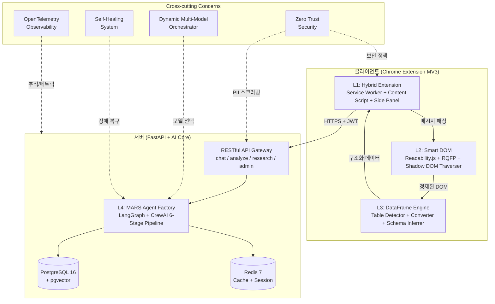

### 2.2 계층별 책임 분리

| 계층 | 책임 | 핵심 기술 | 코드 규모 |
|------|------|-----------|-----------|
| L1 Hybrid Extension | 브라우저 통합, UI, API 통신 | Chrome MV3, React 19 | ~3,200줄 |
| L2 Smart DOM | 웹 콘텐츠 정제, 데이터 추출 | Readability.js, RQFP | ~1,800줄 |
| L3 DataFrame Engine | 테이블 감지, 변환, 스키마 추론 | SheetJS, Web Worker | ~1,150줄 |
| L4 MARS Agent Factory | AI 에이전트 오케스트레이션 | LangGraph, CrewAI | ~2,700줄 |
| Cross-cutting | 모델 선택, 자가복구, 보안 | OPA, Vault, OpenTelemetry | ~2,100줄 |

### 2.3 배포 토폴로지

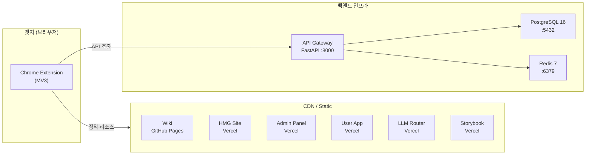

---

## 3. L1: Hybrid Extension 상세 명세

### 3.1 Chrome MV3 모듈 구성

```typescript
// Extension Manifest (manifest.json) 핵심 구조
interface ExtensionManifest {
  manifest_version: 3
  permissions: [
    'sidePanel',
    'activeTab',
    'contextMenus',
    'storage',
    'offscreen',
    'scripting',
    'alarms'
  ]
  optional_host_permissions: ['<all_urls>']
  background: {
    service_worker: 'background.js'
    type: 'module'
  }
  content_scripts: [{
    matches: ['<all_urls>']
    js: ['content.js']
    run_at: 'document_idle'
    exclude_matches: string[] // 블록리스트
  }]
  side_panel: {
    default_path: 'sidepanel.html'
  }
}
```

### 3.2 Service Worker 생명주기

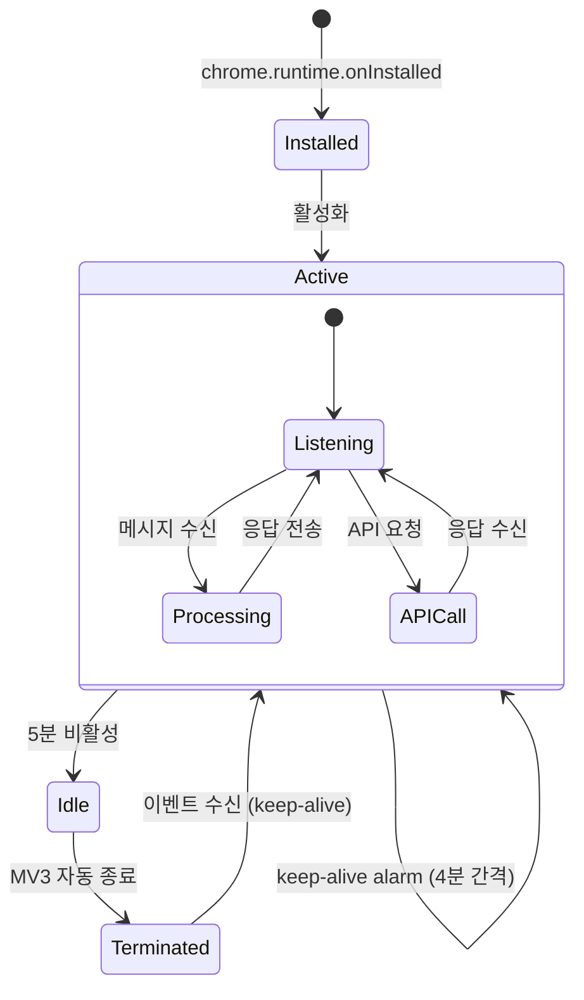

**Keep-alive 전략**:

```typescript
// Service Worker keep-alive 메커니즘
const KEEP_ALIVE_INTERVAL_MS = 240_000 // 4분

chrome.alarms.create('keep-alive', {
  periodInMinutes: 4,
})

chrome.alarms.onAlarm.addListener((alarm) => {
  if (alarm.name === 'keep-alive') {
    // 상태 유지를 위한 최소 작업
    chrome.storage.session.set({ lastAlive: Date.now() })
  }
})
```

### 3.3 메시지 패싱 아키텍처

| 통신 경로 | 방식 | API | 용도 |
|-----------|------|-----|------|
| Popup <-> Service Worker | 단발 | `chrome.runtime.sendMessage` | 설정 변경, 상태 조회 |
| Side Panel <-> Service Worker | 단발 | `chrome.runtime.sendMessage` | 채팅 요청, 결과 반환 |
| Service Worker -> Content Script | 단발 | `chrome.tabs.sendMessage` | DOM 추출 명령 |
| Content Script -> Service Worker | 단발 | `chrome.runtime.sendMessage` | 추출 결과 전달 |
| Side Panel <-> Service Worker | 장기연결 | `chrome.runtime.connect` (Port) | SSE 스트리밍 릴레이 |

```typescript
// 메시지 타입 정의
interface ExtensionMessage {
  type: MessageType
  payload: unknown
  requestId: string
  timestamp: number
}

type MessageType =
  | 'EXTRACT_DOM'        // SW → CS: DOM 추출 요청
  | 'DOM_RESULT'         // CS → SW: 추출 결과
  | 'CHAT_REQUEST'       // Panel → SW: 채팅 요청
  | 'CHAT_RESPONSE'      // SW → Panel: 채팅 응답
  | 'STREAM_CHUNK'       // SW → Panel: SSE 청크
  | 'EXTRACT_TABLE'      // SW → CS: 테이블 추출
  | 'TABLE_RESULT'       // CS → SW: 테이블 데이터
  | 'HEALTH_CHECK'       // Panel → SW: 헬스 체크
  | 'CONFIG_UPDATE'      // Popup → SW: 설정 변경
```

### 3.4 Chrome API 활용 명세

| API | 용도 | 주요 메서드 |
|-----|------|------------|
| `chrome.sidePanel` | AI 채팅 사이드 패널 | `setOptions()`, `setPanelBehavior()` |
| `chrome.action` | 툴바 아이콘 제어 | `setIcon()`, `setBadgeText()`, `onClicked` |
| `chrome.contextMenus` | 우클릭 컨텍스트 메뉴 | `create()`, `onClicked` |
| `chrome.runtime` | 메시지 패싱, 생명주기 | `sendMessage()`, `connect()`, `onInstalled` |
| `chrome.omnibox` | 주소창 커맨드 | `onInputChanged`, `onInputEntered` |
| `chrome.offscreen` | 백그라운드 DOM 처리 | `createDocument()`, `closeDocument()` |
| `chrome.scripting` | Content Script 동적 주입 | `executeScript()`, `registerContentScripts()` |
| `chrome.storage` | 설정/상태 영속화 | `session.set()`, `local.set()`, `sync.set()` |

### 3.5 Stealth Engine

봇 탐지를 우회하여 콘텐츠 추출 신뢰성을 확보하는 모듈:

```typescript
interface StealthConfig {
  userAgent: {
    enabled: boolean
    rotationInterval: number // ms
    pool: string[]
  }
  webgl: {
    spoofVendor: boolean
    spoofRenderer: boolean
    noiseLevel: number // 0.0 - 1.0
  }
  canvas: {
    noiseEnabled: boolean
    noiseSeed: number
    noiseIntensity: number // 0.0 - 0.05
  }
  navigator: {
    spoofPlugins: boolean
    spoofLanguages: boolean
    hideWebdriver: boolean
  }
}
```

| 탐지 유형 | 우회 기법 | 구현 위치 |
|-----------|----------|-----------|
| User-Agent 분석 | UA 풀 로테이션 (20개) | Content Script |
| WebGL Fingerprint | Vendor/Renderer 스푸핑 | Content Script (MAIN world) |
| Canvas Fingerprint | 픽셀 노이즈 주입 (0.01-0.05) | Content Script (MAIN world) |
| Navigator.webdriver | `Object.defineProperty` 오버라이드 | Content Script |
| Plugin 열거 | 가상 플러그인 배열 주입 | Content Script |

---

## 4. L2: Smart DOM 상세 명세

### 4.1 Readability.js 통합

```typescript
interface ReadabilityResult {
  title: string
  content: string       // 정제된 HTML
  textContent: string   // 플레인 텍스트
  length: number        // 문자 수
  excerpt: string       // 요약 (최대 200자)
  byline: string | null // 저자
  dir: string | null    // 텍스트 방향
  siteName: string | null
  lang: string | null
}

// Readability.js 적용 파이프라인
async function extractContent(document: Document): Promise<ReadabilityResult> {
  const clone = document.cloneNode(true) as Document

  // 노이즈 사전 제거 (광고, 네비게이션, 푸터)
  const noiseSelectors = [
    'nav', 'footer', 'header', '.ad', '.advertisement',
    '[role="banner"]', '[role="navigation"]', '.sidebar',
    'script', 'style', 'noscript', 'iframe[src*="ads"]'
  ]
  noiseSelectors.forEach(sel => {
    clone.querySelectorAll(sel).forEach(el => el.remove())
  })

  const reader = new Readability(clone, {
    charThreshold: 500,
    classesToPreserve: ['data-table', 'code-block'],
  })

  return reader.parse()
}
```

**노이즈 제거 성능**:

| 사이트 유형 | 원본 DOM 크기 | 정제 후 크기 | 제거율 |
|------------|--------------|-------------|--------|
| 뉴스 포털 | ~450KB | ~135KB | 70% |
| 기업 인트라넷 | ~280KB | ~112KB | 60% |
| SPA (React) | ~320KB | ~108KB | 66% |
| SAP Fiori | ~520KB | ~180KB | 65% |

### 4.2 RQFP Engine

**R**elevance, **Q**uality, **F**reshness, **P**roximity 가중치 기반 관계형 데이터 추출 엔진:

```typescript
interface RQFPScore {
  relevance: number   // 0.0 - 1.0 (쿼리와의 의미적 유사도)
  quality: number     // 0.0 - 1.0 (데이터 완결성, 구조화 정도)
  freshness: number   // 0.0 - 1.0 (최신성, timestamp 기반)
  proximity: number   // 0.0 - 1.0 (DOM 트리 내 타겟 근접도)
}

interface RQFPConfig {
  weights: {
    relevance: number   // 기본 0.35
    quality: number     // 기본 0.30
    freshness: number   // 기본 0.20
    proximity: number   // 기본 0.15
  }
  thresholds: {
    minimum: number     // 최소 점수 0.4
    confident: number   // 고신뢰 점수 0.75
  }
}

function computeRQFP(
  element: Element,
  query: string,
  config: RQFPConfig
): number {
  const scores: RQFPScore = {
    relevance: computeRelevance(element, query),
    quality: computeQuality(element),
    freshness: computeFreshness(element),
    proximity: computeProximity(element),
  }

  return (
    scores.relevance * config.weights.relevance +
    scores.quality * config.weights.quality +
    scores.freshness * config.weights.freshness +
    scores.proximity * config.weights.proximity
  )
}
```

### 4.3 Shadow DOM Traverser

```typescript
// Shadow DOM 접근 전략
interface ShadowDOMStrategy {
  method: 'scripting_main_world' | 'cdp_fallback' | 'declarative'
  priority: number
}

// MAIN world 접근 (chrome.scripting API)
async function traverseShadowDOM(tabId: number): Promise<Element[]> {
  const results = await chrome.scripting.executeScript({
    target: { tabId },
    world: 'MAIN', // 페이지 컨텍스트에서 실행
    func: () => {
      const shadowRoots: ShadowRoot[] = []

      function collectShadowRoots(root: Document | ShadowRoot) {
        const elements = root.querySelectorAll('*')
        elements.forEach((el) => {
          if (el.shadowRoot) {
            shadowRoots.push(el.shadowRoot)
            collectShadowRoots(el.shadowRoot)
          }
        })
      }

      collectShadowRoots(document)
      return shadowRoots.map((sr) => sr.innerHTML)
    },
  })

  return results[0]?.result ?? []
}
```

### 4.4 SAP Fiori Adapter

SAP Fiori UI5 컴포넌트의 Shadow DOM 특화 처리:

```typescript
interface FioriAdapterConfig {
  selectors: {
    table: string[]    // ['sap-ui-table', 'ui5-table', '.sapMList']
    input: string[]    // ['ui5-input', 'ui5-textarea', '.sapMInputBase']
    dialog: string[]   // ['ui5-dialog', '.sapMDialog']
  }
  cdpFallback: boolean // Shadow DOM 직접 접근 실패 시 CDP 사용
  waitForStable: number // MutationStabilizer 대기 시간 (ms)
}

// CDP Fallback (Playwright CDP)
async function cdpFallback(tabId: number, selector: string): Promise<string> {
  const debuggee = { tabId }
  await chrome.debugger.attach(debuggee, '1.3')

  try {
    const { root } = await chrome.debugger.sendCommand(
      debuggee,
      'DOM.getDocument',
      { depth: -1, pierce: true } // Shadow DOM 관통
    )
    const { nodeId } = await chrome.debugger.sendCommand(
      debuggee,
      'DOM.querySelector',
      { nodeId: root.nodeId, selector }
    )
    const { outerHTML } = await chrome.debugger.sendCommand(
      debuggee,
      'DOM.getOuterHTML',
      { nodeId }
    )
    return outerHTML
  } finally {
    await chrome.debugger.detach(debuggee)
  }
}
```

### 4.5 MutationStabilizer

SPA의 동적 DOM 변경이 안정화될 때까지 대기하는 모듈:

```typescript
interface StabilizerConfig {
  timeout: number       // 최대 대기 시간 (기본 5000ms)
  debounce: number      // 변경 디바운스 (기본 300ms)
  targetSelector: string | null // 특정 영역만 감시
  ignoreAttributes: string[]    // 무시할 속성 변경
}

function waitForStable(config: StabilizerConfig): Promise<void> {
  return new Promise((resolve, reject) => {
    let timer: ReturnType<typeof setTimeout>
    const target = config.targetSelector
      ? document.querySelector(config.targetSelector)
      : document.body

    if (!target) {
      resolve()
      return
    }

    const observer = new MutationObserver(() => {
      clearTimeout(timer)
      timer = setTimeout(() => {
        observer.disconnect()
        resolve()
      }, config.debounce)
    })

    observer.observe(target, {
      childList: true,
      subtree: true,
      attributes: true,
      attributeFilter: config.ignoreAttributes.length
        ? undefined
        : ['class', 'style', 'data-*'],
    })

    // 초기 타이머 (변경 없으면 즉시 resolve)
    timer = setTimeout(() => {
      observer.disconnect()
      resolve()
    }, config.debounce)

    // 전체 타임아웃
    setTimeout(() => {
      observer.disconnect()
      reject(new Error('DOM stabilization timeout'))
    }, config.timeout)
  })
}
```

### 4.6 사이트 복잡도별 추출 전략

| 복잡도 | 사이트 유형 | 전략 | 비용 | 속도 |
|--------|-----------|------|------|------|
| Low | 정적 HTML, 위키 | Readability.js only | $0.02 | 0.3분 |
| Medium | SPA (React/Angular) | Readability + MutationStabilizer | $0.08 | 0.7분 |
| High | Shadow DOM (SAP Fiori) | Fiori Adapter + CDP Fallback | $0.12 | 0.9분 |
| High | iframe ERP | Offscreen Document + CDP | $0.15 | 1.2분 |
| Very High | 동적 Charts (D3/Canvas) | Screenshot + Vision API | $1.00 | 12.49분 |

> **Smart DOM 비용 효율**: High 복잡도 기준 $0.12/작업으로, Vision API($1.00) 대비 **88% 절감**, 속도는 **14배** 향상.

---

## 5. L3: DataFrame Engine 상세 명세

### 5.1 아키텍처 개요

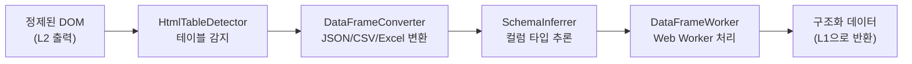

### 5.2 HtmlTableDetector

```typescript
interface DetectedTable {
  id: string
  type: 'html_table' | 'list_table' | 'grid_table' | 'aria_table'
  element: Element
  rows: number
  cols: number
  confidence: number // 0.0 - 1.0
  headers: string[]
  preview: string[][] // 첫 3행 미리보기
}

class HtmlTableDetector {
  private readonly strategies: DetectionStrategy[] = [
    { selector: 'table', type: 'html_table', confidence: 0.95 },
    { selector: '[role="table"]', type: 'aria_table', confidence: 0.90 },
    { selector: '[role="grid"]', type: 'grid_table', confidence: 0.85 },
    { selector: 'ul, ol', type: 'list_table', confidence: 0.60 },
  ]

  detect(root: Element): DetectedTable[] {
    const tables: DetectedTable[] = []

    for (const strategy of this.strategies) {
      const elements = root.querySelectorAll(strategy.selector)
      for (const el of elements) {
        const table = this.analyzeElement(el, strategy)
        if (table && table.rows >= 2 && table.cols >= 2) {
          tables.push(table)
        }
      }
    }

    return tables.sort((a, b) => b.confidence - a.confidence)
  }

  private analyzeElement(
    el: Element,
    strategy: DetectionStrategy
  ): DetectedTable | null {
    const rows = el.querySelectorAll('tr, [role="row"], li')
    if (rows.length < 2) return null

    const firstRow = rows[0]
    const cells = firstRow.querySelectorAll(
      'th, td, [role="columnheader"], [role="gridcell"]'
    )

    return {
      id: crypto.randomUUID(),
      type: strategy.type,
      element: el,
      rows: rows.length,
      cols: cells.length,
      confidence: strategy.confidence,
      headers: Array.from(cells).map((c) => c.textContent?.trim() ?? ''),
      preview: this.extractPreview(rows, 3),
    }
  }

  private extractPreview(rows: NodeListOf<Element>, count: number): string[][] {
    return Array.from(rows)
      .slice(0, count)
      .map((row) => {
        const cells = row.querySelectorAll('th, td, [role="gridcell"], span')
        return Array.from(cells).map((c) => c.textContent?.trim() ?? '')
      })
  }
}
```

### 5.3 DataFrameConverter

```typescript
type OutputFormat = 'json' | 'csv' | 'xlsx'

interface ConversionResult {
  format: OutputFormat
  data: unknown          // JSON array | CSV string | ArrayBuffer
  rowCount: number
  colCount: number
  schema: InferredSchema
  sizeBytes: number
}

class DataFrameConverter {
  async convert(
    table: DetectedTable,
    format: OutputFormat
  ): Promise<ConversionResult> {
    const rows = this.extractAllRows(table.element)
    const headers = table.headers

    switch (format) {
      case 'json':
        return this.toJSON(headers, rows)
      case 'csv':
        return this.toCSV(headers, rows)
      case 'xlsx':
        return this.toExcel(headers, rows)
    }
  }

  private toJSON(
    headers: string[],
    rows: string[][]
  ): ConversionResult {
    const data = rows.map((row) =>
      Object.fromEntries(
        headers.map((h, i) => [h, row[i] ?? null])
      )
    )

    const json = JSON.stringify(data)
    return {
      format: 'json',
      data,
      rowCount: rows.length,
      colCount: headers.length,
      schema: SchemaInferrer.infer(headers, rows),
      sizeBytes: new Blob([json]).size,
    }
  }

  private toCSV(headers: string[], rows: string[][]): ConversionResult {
    const escape = (v: string) =>
      v.includes(',') || v.includes('"') || v.includes('\n')
        ? `"${v.replace(/"/g, '""')}"`
        : v

    const lines = [
      headers.map(escape).join(','),
      ...rows.map((r) => r.map(escape).join(',')),
    ]
    const csv = lines.join('\n')

    return {
      format: 'csv',
      data: csv,
      rowCount: rows.length,
      colCount: headers.length,
      schema: SchemaInferrer.infer(headers, rows),
      sizeBytes: new Blob([csv]).size,
    }
  }

  private async toExcel(
    headers: string[],
    rows: string[][]
  ): Promise<ConversionResult> {
    // SheetJS (xlsx) 사용 - Web Worker에서 실행
    const XLSX = await import('xlsx')
    const ws = XLSX.utils.aoa_to_sheet([headers, ...rows])
    const wb = XLSX.utils.book_new()
    XLSX.utils.book_append_sheet(wb, ws, 'Data')
    const buffer = XLSX.write(wb, { type: 'array', bookType: 'xlsx' })

    return {
      format: 'xlsx',
      data: buffer,
      rowCount: rows.length,
      colCount: headers.length,
      schema: SchemaInferrer.infer(headers, rows),
      sizeBytes: buffer.byteLength,
    }
  }

  private extractAllRows(element: Element): string[][] {
    const rows = element.querySelectorAll('tr, [role="row"], li')
    return Array.from(rows)
      .slice(1) // 헤더 제외
      .map((row) => {
        const cells = row.querySelectorAll('td, [role="gridcell"], span')
        return Array.from(cells).map((c) => c.textContent?.trim() ?? '')
      })
  }
}
```

### 5.4 SchemaInferrer

```typescript
type ColumnType = 'string' | 'number' | 'date' | 'boolean' | 'null'

interface ColumnSchema {
  name: string
  type: ColumnType
  nullable: boolean
  unique: boolean
  sampleValues: string[]
}

interface InferredSchema {
  columns: ColumnSchema[]
  rowCount: number
  inferredAt: string
}

class SchemaInferrer {
  private static readonly patterns: Record<ColumnType, RegExp> = {
    boolean: /^(true|false|yes|no|Y|N|1|0)$/i,
    number: /^-?\d+([.,]\d+)?(%|원|$|USD|KRW)?$/,
    date: /^\d{4}[-/.]\d{1,2}[-/.]\d{1,2}|^\d{1,2}[-/.]\d{1,2}[-/.]\d{4}/,
    string: /.*/, // fallback
    null: /^(null|undefined|N\/A|-|)$/i,
  }

  static infer(headers: string[], rows: string[][]): InferredSchema {
    const columns: ColumnSchema[] = headers.map((name, colIdx) => {
      const values = rows.map((r) => r[colIdx] ?? '')
      const nonEmpty = values.filter((v) => !this.patterns.null.test(v))

      return {
        name,
        type: this.inferColumnType(nonEmpty),
        nullable: nonEmpty.length < values.length,
        unique: new Set(nonEmpty).size === nonEmpty.length,
        sampleValues: nonEmpty.slice(0, 3),
      }
    })

    return {
      columns,
      rowCount: rows.length,
      inferredAt: new Date().toISOString(),
    }
  }

  private static inferColumnType(values: string[]): ColumnType {
    if (values.length === 0) return 'null'

    const typeCounts: Record<ColumnType, number> = {
      boolean: 0,
      number: 0,
      date: 0,
      string: 0,
      null: 0,
    }

    for (const v of values) {
      if (this.patterns.boolean.test(v)) typeCounts.boolean++
      else if (this.patterns.number.test(v)) typeCounts.number++
      else if (this.patterns.date.test(v)) typeCounts.date++
      else typeCounts.string++
    }

    // 80% 이상이 같은 타입이면 해당 타입으로 추론
    const threshold = values.length * 0.8
    if (typeCounts.number >= threshold) return 'number'
    if (typeCounts.date >= threshold) return 'date'
    if (typeCounts.boolean >= threshold) return 'boolean'
    return 'string'
  }
}
```

### 5.5 DataFrameWorker

```typescript
// Web Worker로 메인 스레드 비차단 처리
// dataframe.worker.ts
self.onmessage = async (event: MessageEvent<WorkerMessage>) => {
  const { type, payload, requestId } = event.data

  try {
    switch (type) {
      case 'CONVERT': {
        const converter = new DataFrameConverter()
        const result = await converter.convert(payload.table, payload.format)
        self.postMessage({ requestId, type: 'RESULT', payload: result })
        break
      }
      case 'INFER_SCHEMA': {
        const schema = SchemaInferrer.infer(payload.headers, payload.rows)
        self.postMessage({ requestId, type: 'RESULT', payload: schema })
        break
      }
    }
  } catch (error) {
    self.postMessage({
      requestId,
      type: 'ERROR',
      payload: { message: (error as Error).message },
    })
  }
}
```

---

## 6. L4: MARS Agent Factory 상세 명세

### 6.1 6단계 파이프라인

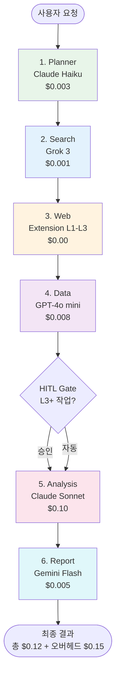

### 6.2 에이전트 인터페이스

```python
from abc import ABC, abstractmethod
from dataclasses import dataclass
from enum import Enum
from typing import Any, Optional

class AgentRole(Enum):
    PLANNER = "planner"
    SEARCHER = "searcher"
    WEB_EXTRACTOR = "web_extractor"
    DATA_PROCESSOR = "data_processor"
    ANALYST = "analyst"
    REPORTER = "reporter"

class AgentStatus(Enum):
    IDLE = "idle"
    RUNNING = "running"
    COMPLETED = "completed"
    FAILED = "failed"
    WAITING_APPROVAL = "waiting_approval"

@dataclass
class AgentContext:
    session_id: str
    user_id: str
    query: str
    accumulated_data: dict[str, Any]
    cost_budget: float
    current_cost: float
    hitl_required: bool

@dataclass
class AgentResult:
    role: AgentRole
    status: AgentStatus
    data: Any
    cost: float
    latency_ms: int
    model_used: str
    tokens_used: int
    error: Optional[str] = None

class BaseAgent(ABC):
    """MARS 에이전트 기본 클래스"""

    def __init__(self, role: AgentRole, model: str, max_cost: float):
        self.role = role
        self.model = model
        self.max_cost = max_cost
        self.status = AgentStatus.IDLE

    @abstractmethod
    async def execute(self, context: AgentContext) -> AgentResult:
        ...

    async def pre_check(self, context: AgentContext) -> bool:
        """비용 예산 초과 사전 검사"""
        return context.current_cost + self.max_cost <= context.cost_budget

    async def on_failure(self, error: Exception, context: AgentContext) -> AgentResult:
        """실패 시 기본 핸들러"""
        return AgentResult(
            role=self.role,
            status=AgentStatus.FAILED,
            data=None,
            cost=0.0,
            latency_ms=0,
            model_used=self.model,
            tokens_used=0,
            error=str(error),
        )
```

### 6.3 각 단계 상세

| 단계 | 에이전트 | 모델 | 비용 | 입력 | 출력 |
|------|---------|------|------|------|------|
| 1 | Planner | Claude Haiku | $0.003 | 사용자 쿼리 | 실행 계획 (단계별 태스크) |
| 2 | Search | Grok 3 | $0.001 | 실행 계획 | 검색 결과 URL 목록 |
| 3 | Web | Extension L1-L3 | $0.00 | URL 목록 | 추출된 웹 콘텐츠 |
| 4 | Data | GPT-4o mini | $0.008 | 웹 콘텐츠 | 정제된 구조화 데이터 |
| 5 | Analysis | Claude Sonnet | $0.10 | 구조화 데이터 | 분석 결과 + 인사이트 |
| 6 | Report | Gemini Flash | $0.005 | 분석 결과 | 최종 보고서 (Markdown) |
| - | 오버헤드 | - | $0.15 | - | 오케스트레이션, 로깅, 캐시 |
| **합계** | | | **$0.27** | | |

### 6.4 상태 머신

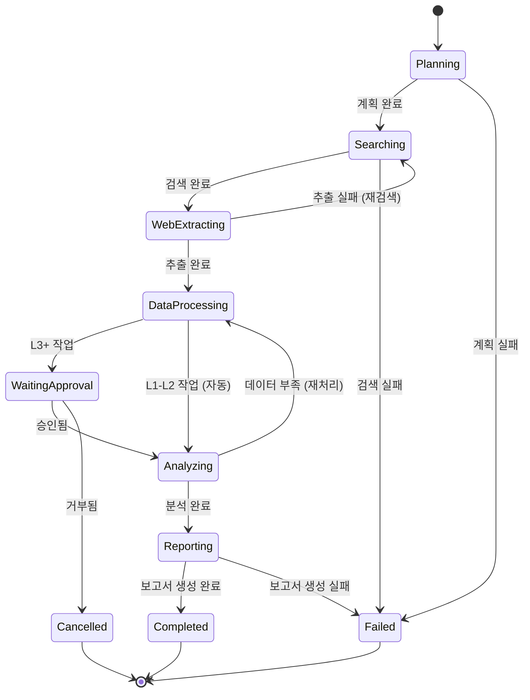

### 6.5 LangGraph + CrewAI 통합

```python
from langgraph.graph import StateGraph, END
from crewai import Agent, Task, Crew

# LangGraph 상태 그래프 정의
class MARSState(TypedDict):
    session_id: str
    query: str
    plan: Optional[dict]
    search_results: Optional[list]
    web_content: Optional[list]
    processed_data: Optional[dict]
    analysis: Optional[dict]
    report: Optional[str]
    current_stage: str
    cost_total: float
    error: Optional[str]

def build_mars_graph() -> StateGraph:
    graph = StateGraph(MARSState)

    graph.add_node("planner", planner_node)
    graph.add_node("searcher", searcher_node)
    graph.add_node("web_extractor", web_extractor_node)
    graph.add_node("data_processor", data_processor_node)
    graph.add_node("hitl_gate", hitl_gate_node)
    graph.add_node("analyst", analyst_node)
    graph.add_node("reporter", reporter_node)

    graph.set_entry_point("planner")
    graph.add_edge("planner", "searcher")
    graph.add_edge("searcher", "web_extractor")
    graph.add_edge("web_extractor", "data_processor")
    graph.add_conditional_edges(
        "data_processor",
        lambda state: "hitl_gate" if state.get("hitl_required") else "analyst",
    )
    graph.add_conditional_edges(
        "hitl_gate",
        lambda state: "analyst" if state.get("approved") else END,
    )
    graph.add_edge("analyst", "reporter")
    graph.add_edge("reporter", END)

    return graph.compile()
```

### 6.6 HITL (Human-in-the-Loop) Gate

```python
@dataclass
class HITLRequest:
    session_id: str
    stage: str
    risk_level: int        # 1-5
    estimated_cost: float
    data_preview: str      # 처리 대상 데이터 미리보기 (최대 500자)
    timeout_sec: int       # 승인 대기 시간 (기본 300초)

class HITLGate:
    """L3 이상 복잡도 작업에 대한 사람 승인 게이트"""

    RISK_THRESHOLD = 3  # L3 이상 HITL 필요

    async def check(self, context: AgentContext) -> bool:
        risk = self.assess_risk(context)
        if risk < self.RISK_THRESHOLD:
            return True  # 자동 승인

        request = HITLRequest(
            session_id=context.session_id,
            stage="data_processing",
            risk_level=risk,
            estimated_cost=context.cost_budget - context.current_cost,
            data_preview=str(context.accumulated_data)[:500],
            timeout_sec=300,
        )

        return await self.request_approval(request)

    def assess_risk(self, context: AgentContext) -> int:
        """작업 복잡도 기반 위험 수준 평가 (1-5)"""
        score = 1
        if context.accumulated_data.get("shadow_dom"):
            score += 2
        if context.accumulated_data.get("iframe"):
            score += 1
        if context.current_cost > context.cost_budget * 0.5:
            score += 1
        return min(score, 5)
```

---

## 7. Dynamic Multi-Model Orchestrator

### 7.1 모델 선택 알고리즘

```python
@dataclass
class ModelCandidate:
    provider: str
    model: str
    quality_score: float      # 0.0 - 1.0
    latency_ms: int
    cost_per_1k_tokens: float
    availability: float       # 0.0 - 1.0
    rate_limit_remaining: int
    circuit_state: str        # CLOSED | OPEN | HALF_OPEN

class MultiModelOrchestrator:
    """동적 멀티모델 오케스트레이터"""

    WEIGHTS = {
        "quality": 0.4,
        "latency": 0.3,
        "cost": 0.2,
        "availability": 0.1,
    }

    PROVIDERS: list[ModelCandidate] = [
        ModelCandidate("Anthropic", "claude-opus-4-6", 0.95, 800, 0.075, 0.99, 1000, "CLOSED"),
        ModelCandidate("OpenAI", "gpt-5.2", 0.92, 600, 0.060, 0.98, 1500, "CLOSED"),
        ModelCandidate("Google", "gemini-2.5-pro", 0.90, 700, 0.050, 0.97, 2000, "CLOSED"),
        ModelCandidate("xAI", "grok-3", 0.88, 500, 0.040, 0.96, 1200, "CLOSED"),
        ModelCandidate("Local", "nano-7b", 0.70, 200, 0.001, 1.00, 9999, "CLOSED"),
    ]

    def select_model(self, task_type: str) -> ModelCandidate:
        candidates = [
            m for m in self.PROVIDERS
            if m.circuit_state != "OPEN"
            and m.rate_limit_remaining > 0
        ]

        if not candidates:
            raise RuntimeError("모든 모델 사용 불가")

        scored = []
        for m in candidates:
            score = self.compute_score(m)
            scored.append((score, m))

        scored.sort(key=lambda x: x[0], reverse=True)
        return scored[0][1]

    def compute_score(self, model: ModelCandidate) -> float:
        # 각 지표를 0-1로 정규화
        latency_score = 1.0 - min(model.latency_ms / 2000.0, 1.0)
        cost_score = 1.0 - min(model.cost_per_1k_tokens / 0.10, 1.0)

        return (
            model.quality_score * self.WEIGHTS["quality"]
            + latency_score * self.WEIGHTS["latency"]
            + cost_score * self.WEIGHTS["cost"]
            + model.availability * self.WEIGHTS["availability"]
        )
```

**점수 산출 공식**:

```
score = quality_score * 0.4 + latency_score * 0.3 + cost_score * 0.2 + availability_score * 0.1
```

### 7.2 프로바이더별 성능 비교

| 프로바이더 | 모델 | 품질 | 지연(ms) | 비용(1K토큰) | 가용성 | 종합 점수 |
|-----------|------|------|---------|-------------|--------|----------|
| Anthropic | Opus 4.6 | 0.95 | 800 | $0.075 | 99% | **0.826** |
| OpenAI | GPT-5.2 | 0.92 | 600 | $0.060 | 98% | **0.818** |
| Google | Gemini 2.5 Pro | 0.90 | 700 | $0.050 | 97% | **0.797** |
| xAI | Grok 3 | 0.88 | 500 | $0.040 | 96% | **0.790** |
| Local | Nano 7B | 0.70 | 200 | $0.001 | 100% | **0.748** |

### 7.3 Rate Limiter

```python
from dataclasses import dataclass, field
from time import time

@dataclass
class RateLimitState:
    provider: str
    requests_per_minute: int
    tokens_per_minute: int
    current_requests: int = 0
    current_tokens: int = 0
    window_start: float = field(default_factory=time)
    wait_times: list[float] = field(default_factory=list)

class RateLimiter:
    """프로바이더별 Rate Limiter"""

    RATE_LIMITS = {
        "Anthropic": {"rpm": 60, "tpm": 100_000},
        "OpenAI": {"rpm": 100, "tpm": 150_000},
        "Google": {"rpm": 120, "tpm": 200_000},
        "xAI": {"rpm": 80, "tpm": 120_000},
        "Local": {"rpm": 9999, "tpm": 9_999_999},
    }

    MAX_WAIT_SEC = 30  # 30초 이상 대기 시 모델 자동 제외

    def __init__(self):
        self.states: dict[str, RateLimitState] = {}

    def get_wait_time(self, provider: str) -> float:
        """대기 시간 계산 (초). 30초 이상이면 모델 제외."""
        state = self.states.get(provider)
        if not state:
            return 0.0

        elapsed = time() - state.window_start
        if elapsed >= 60:
            # 윈도우 리셋
            state.current_requests = 0
            state.current_tokens = 0
            state.window_start = time()
            return 0.0

        limits = self.RATE_LIMITS[provider]
        if state.current_requests >= limits["rpm"]:
            wait = 60 - elapsed
            return wait

        return 0.0

    def is_available(self, provider: str) -> bool:
        return self.get_wait_time(provider) < self.MAX_WAIT_SEC
```

### 7.4 Circuit Breaker

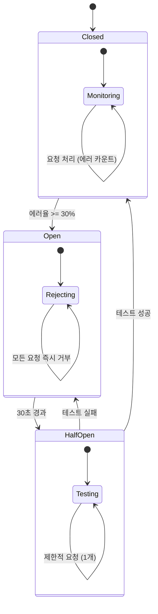

```python
from enum import Enum
from time import time

class CircuitState(Enum):
    CLOSED = "CLOSED"
    OPEN = "OPEN"
    HALF_OPEN = "HALF_OPEN"

class CircuitBreaker:
    """프로바이더별 Circuit Breaker"""

    ERROR_THRESHOLD = 0.30       # 에러율 30% 초과 시 OPEN
    RECOVERY_TIMEOUT_SEC = 30    # OPEN → HALF_OPEN 전환 대기
    WINDOW_SIZE = 20             # 최근 20개 요청 기준

    def __init__(self, provider: str):
        self.provider = provider
        self.state = CircuitState.CLOSED
        self.results: list[bool] = []  # True=성공, False=실패
        self.opened_at: float = 0

    def record(self, success: bool) -> None:
        self.results.append(success)
        if len(self.results) > self.WINDOW_SIZE:
            self.results.pop(0)

        if self.state == CircuitState.CLOSED:
            error_rate = self.results.count(False) / len(self.results)
            if len(self.results) >= 10 and error_rate >= self.ERROR_THRESHOLD:
                self.state = CircuitState.OPEN
                self.opened_at = time()

        elif self.state == CircuitState.HALF_OPEN:
            self.state = CircuitState.CLOSED if success else CircuitState.OPEN
            if not success:
                self.opened_at = time()

    def can_request(self) -> bool:
        if self.state == CircuitState.CLOSED:
            return True
        if self.state == CircuitState.OPEN:
            if time() - self.opened_at >= self.RECOVERY_TIMEOUT_SEC:
                self.state = CircuitState.HALF_OPEN
                return True
            return False
        # HALF_OPEN: 1개 요청만 허용
        return True
```

---

## 8. Self-Healing System

### 8.1 Signal -> Diagnosis -> Healing -> Verification 파이프라인

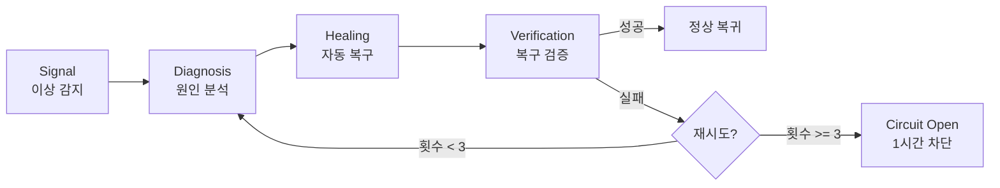

### 8.2 설정 상수

```python
class SelfHealingConfig:
    MAX_HEAL_ATTEMPTS: int = 3
    COOLDOWN_BASE_SEC: int = 300          # 5분
    COOLDOWN_MULTIPLIER: float = 3.0      # 지수 백오프 (5 → 15 → 45분)
    CIRCUIT_OPEN_DURATION_SEC: int = 3600  # 1시간

    # 시그널 임계값
    ERROR_RATE_THRESHOLD: float = 0.05    # 5% 에러율
    LATENCY_P95_THRESHOLD_MS: int = 3000  # 3초 P95
    MEMORY_USAGE_THRESHOLD: float = 0.85  # 85% 메모리
    CPU_USAGE_THRESHOLD: float = 0.90     # 90% CPU
```

### 8.3 3-Strike 정책

| Strike | 대기 시간 | 동작 |
|--------|----------|------|
| 1차 | 5분 | 자동 재시도 (구문 오류 수정, 캐시 초기화) |
| 2차 | 15분 | 대체 모델로 폴백 + 알림 |
| 3차 | 45분 | Circuit Open (1시간) + 운영자 알림 |

```python
class SelfHealingSystem:
    """자가 복구 시스템"""

    def __init__(self, config: SelfHealingConfig):
        self.config = config
        self.attempt_counts: dict[str, int] = {}
        self.last_heal_time: dict[str, float] = {}

    async def handle_signal(self, signal: HealthSignal) -> HealingResult:
        service_id = signal.service_id
        attempt = self.attempt_counts.get(service_id, 0)

        if attempt >= self.config.MAX_HEAL_ATTEMPTS:
            await self.open_circuit(service_id)
            return HealingResult(
                success=False,
                action="circuit_open",
                message=f"3-Strike 초과: {service_id} 1시간 차단",
            )

        cooldown = self.get_cooldown(attempt)
        last_heal = self.last_heal_time.get(service_id, 0)
        if time() - last_heal < cooldown:
            return HealingResult(
                success=False,
                action="cooldown",
                message=f"쿨다운 대기 중: {cooldown}초",
            )

        diagnosis = await self.diagnose(signal)
        healing_action = await self.select_healing(diagnosis)
        result = await self.execute_healing(healing_action)
        verification = await self.verify(service_id)

        if verification.healthy:
            self.attempt_counts[service_id] = 0
            return HealingResult(success=True, action=healing_action.name)

        self.attempt_counts[service_id] = attempt + 1
        self.last_heal_time[service_id] = time()
        return HealingResult(success=False, action="retry_scheduled")

    def get_cooldown(self, attempt: int) -> float:
        return self.config.COOLDOWN_BASE_SEC * (
            self.config.COOLDOWN_MULTIPLIER ** attempt
        )
```

### 8.4 진단 및 복구 매핑

| 시그널 유형 | 진단 | 복구 액션 | 성공률 목표 |
|------------|------|----------|------------|
| 구문 오류 (Syntax Error) | Tree-sitter AST 분석 | 자동 구문 수정 | 85-90% |
| API 타임아웃 | Rate Limit / 네트워크 | 대체 모델 폴백 | 95% |
| 메모리 초과 | 메모리 프로파일링 | 캐시 정리 + GC | 90% |
| 모델 응답 오류 | 프롬프트 / 토큰 분석 | 프롬프트 재구성 | 80% |
| DB 연결 실패 | 커넥션 풀 상태 | 풀 리셋 + 재연결 | 95% |

**목표**: 복구 시간 55-70% 단축, 구문 오류 수정 85-90% 성공률

---

## 9. Zero Trust Security

### 9.1 보안 아키텍처 개요

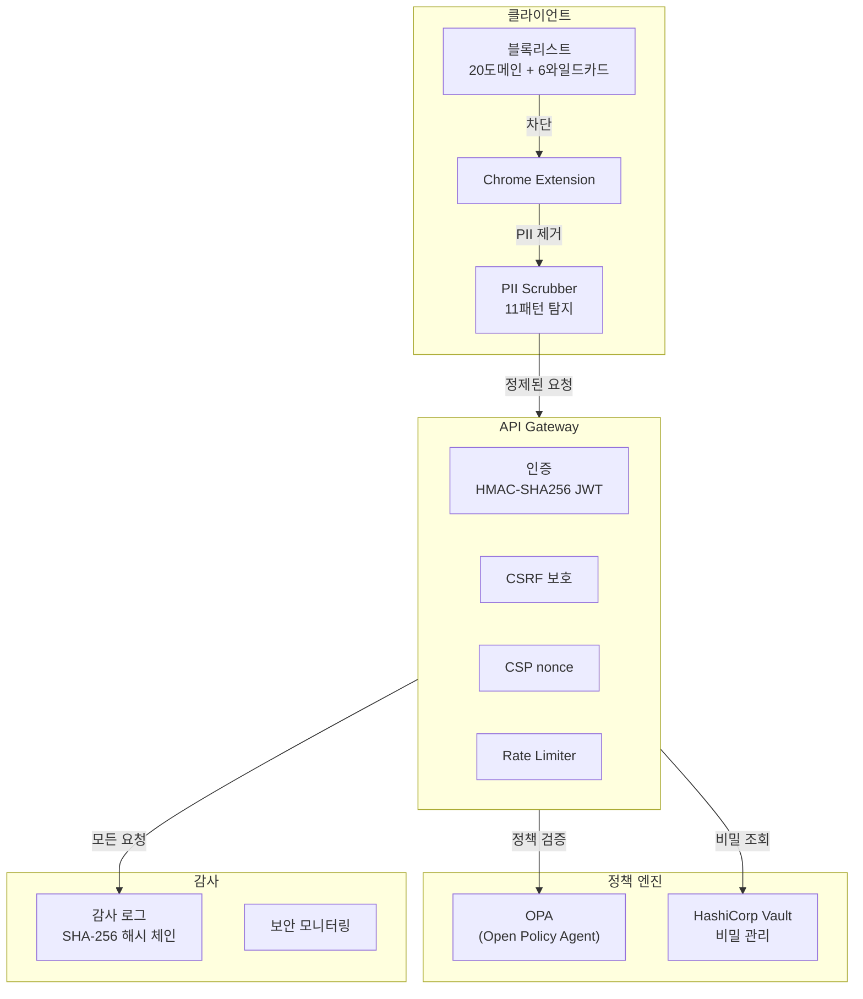

### 9.2 PII Scrubbing (11개 패턴)

```typescript
interface PIIPattern {
  name: string
  regex: RegExp
  replacement: string
  severity: 'critical' | 'high' | 'medium'
}

const PII_PATTERNS: PIIPattern[] = [
  {
    name: '주민등록번호',
    regex: /\d{6}[-]\d{7}/g,
    replacement: '[주민번호 마스킹]',
    severity: 'critical',
  },
  {
    name: '전화번호',
    regex: /01[016789][-\s]?\d{3,4}[-\s]?\d{4}/g,
    replacement: '[전화번호 마스킹]',
    severity: 'high',
  },
  {
    name: '이메일',
    regex: /[a-zA-Z0-9._%+-]+@[a-zA-Z0-9.-]+\.[a-zA-Z]{2,}/g,
    replacement: '[이메일 마스킹]',
    severity: 'high',
  },
  {
    name: '신용카드',
    regex: /\d{4}[-\s]?\d{4}[-\s]?\d{4}[-\s]?\d{4}/g,
    replacement: '[카드번호 마스킹]',
    severity: 'critical',
  },
  {
    name: '여권번호',
    regex: /[A-Z]{1,2}\d{7,8}/g,
    replacement: '[여권번호 마스킹]',
    severity: 'critical',
  },
  {
    name: '운전면허번호',
    regex: /\d{2}-\d{2}-\d{6}-\d{2}/g,
    replacement: '[면허번호 마스킹]',
    severity: 'critical',
  },
  {
    name: '계좌번호',
    regex: /\d{3,6}[-]?\d{2,6}[-]?\d{2,6}/g,
    replacement: '[계좌번호 마스킹]',
    severity: 'critical',
  },
  {
    name: '건강보험번호',
    regex: /\d{10,14}/g,
    replacement: '[보험번호 마스킹]',
    severity: 'high',
  },
  {
    name: 'IP 주소',
    regex: /\d{1,3}\.\d{1,3}\.\d{1,3}\.\d{1,3}/g,
    replacement: '[IP 마스킹]',
    severity: 'medium',
  },
  {
    name: 'AWS 키',
    regex: /AKIA[0-9A-Z]{16}/g,
    replacement: '[AWS키 마스킹]',
    severity: 'critical',
  },
  {
    name: 'JWT 토큰',
    regex: /eyJ[a-zA-Z0-9_-]+\.eyJ[a-zA-Z0-9_-]+\.[a-zA-Z0-9_-]+/g,
    replacement: '[토큰 마스킹]',
    severity: 'high',
  },
]

function scrubPII(text: string): { cleaned: string; findings: PIIFinding[] } {
  const findings: PIIFinding[] = []
  let cleaned = text

  for (const pattern of PII_PATTERNS) {
    const matches = text.matchAll(pattern.regex)
    for (const match of matches) {
      findings.push({
        type: pattern.name,
        severity: pattern.severity,
        position: match.index ?? 0,
        length: match[0].length,
      })
    }
    cleaned = cleaned.replace(pattern.regex, pattern.replacement)
  }

  return { cleaned, findings }
}
```

### 9.3 블록리스트

```typescript
const BLOCKED_DOMAINS: string[] = [
  // 금융/증권
  'banking.example.com',
  'securities.example.com',
  'insurance.example.com',
  // 의료
  'hospital.example.com',
  'health-records.example.com',
  // 정부
  'gov.kr',
  'nts.go.kr',
  // 소셜/이메일
  'mail.google.com',
  'outlook.office.com',
  'web.whatsapp.com',
  // 내부 보안
  'vault.internal.example.com',
  'secrets.internal.example.com',
  'hr.internal.example.com',
  'payroll.internal.example.com',
  'compliance.internal.example.com',
  'audit.internal.example.com',
  'security.internal.example.com',
  'admin.internal.example.com',
  'certificates.internal.example.com',
  'keys.internal.example.com',
]

const BLOCKED_PATTERNS: string[] = [
  '*.banking.*',
  '*.payment.*',
  '*.auth.*',
  '*.secret*',
  '*.credential*',
  '*.password*',
]

function isBlocked(url: string): boolean {
  const hostname = new URL(url).hostname
  if (BLOCKED_DOMAINS.some((d) => hostname === d || hostname.endsWith(`.${d}`))) {
    return true
  }
  return BLOCKED_PATTERNS.some((pattern) => {
    const regex = new RegExp(
      '^' + pattern.replace(/\*/g, '.*').replace(/\./g, '\\.') + '$'
    )
    return regex.test(hostname)
  })
}
```

### 9.4 감사 로그 (SHA-256 해시 체인)

```python
import hashlib
import json
from datetime import datetime

class AuditLogger:
    """INSERT ONLY 감사 로그 - SHA-256 해시 체인"""

    def __init__(self, db_pool):
        self.db_pool = db_pool
        self.previous_hash: str = "GENESIS"

    async def log(
        self,
        action: str,
        user_id: str,
        layer: str,       # L1 | L2 | L3 | L4
        details: dict,
        ip_address: str,
    ) -> str:
        entry = {
            "timestamp": datetime.utcnow().isoformat(),
            "action": action,
            "user_id": user_id,
            "layer": layer,
            "details": details,
            "ip_address": ip_address,
            "previous_hash": self.previous_hash,
        }

        entry_hash = hashlib.sha256(
            json.dumps(entry, sort_keys=True).encode()
        ).hexdigest()

        async with self.db_pool.acquire() as conn:
            await conn.execute(
                """
                INSERT INTO audit_logs
                (hash, previous_hash, action, user_id, layer, details, ip_address, created_at)
                VALUES ($1, $2, $3, $4, $5, $6, $7, NOW())
                """,
                entry_hash,
                self.previous_hash,
                action,
                user_id,
                layer,
                json.dumps(details),
                ip_address,
            )

        self.previous_hash = entry_hash
        return entry_hash
```

### 9.5 인증/인가 체계

| 항목 | 구현 |
|------|------|
| 비밀번호 해싱 | PBKDF2 (iterations=600000, SHA-256) |
| JWT 서명 | HMAC-SHA256, 만료 1시간, 리프레시 7일 |
| CSRF 보호 | Double Submit Cookie + SameSite=Strict |
| CSP | nonce 기반 (SSR 미들웨어) |
| Rate Limiting | 인증 60rpm, 비인증 20rpm |
| CORS | 화이트리스트 도메인 only |
| HTTPS | TLS 1.3 필수, HSTS 1년 |

---

## 10. API 명세

### 10.1 엔드포인트 총괄

| 도메인 | 경로 접두사 | 인증 | 설명 |
|--------|-----------|------|------|
| Chat | `/api/v1/chat` | JWT | 대화 관리 |
| Analyze | `/api/v1/analyze` | JWT | 콘텐츠 분석 |
| Research | `/api/v1/research` | JWT | MARS 리서치 |
| Admin | `/api/v1/admin` | JWT + Admin Role | 관리자 기능 |
| Extension | `/api/v1/extension` | JWT + Extension Token | 확장 프로그램 전용 |
| Auth | `/api/v1/auth` | Public / JWT | 인증 |
| Health | `/api/v1/health` | Public | 헬스 체크 |

### 10.2 Chat API

#### `POST /api/v1/chat/messages`

새 메시지 전송 (SSE 스트리밍 응답).

**Request**:
```json
{
  "conversation_id": "conv_abc123",
  "content": "현대차 2024년 매출 분석해줘",
  "model": "claude-opus-4-6",
  "stream": true,
  "attachments": [
    {
      "type": "file",
      "name": "report.xlsx",
      "size": 102400,
      "mime_type": "application/vnd.openxmlformats-officedocument.spreadsheetml.sheet"
    }
  ]
}
```

**Response** (SSE):
```
event: message_start
data: {"id":"msg_001","model":"claude-opus-4-6","created_at":"2026-03-15T10:00:00Z"}

event: content_delta
data: {"delta":{"text":"현대차의 2024년 "}}

event: content_delta
data: {"delta":{"text":"매출 실적을 분석하겠습니다."}}

event: message_end
data: {"usage":{"input_tokens":45,"output_tokens":312},"cost":0.023}
```

#### `GET /api/v1/chat/conversations`

대화 목록 조회.

**Query Parameters**:

| 파라미터 | 타입 | 기본값 | 설명 |
|---------|------|--------|------|
| `page` | int | 1 | 페이지 번호 |
| `limit` | int | 20 | 페이지 크기 (최대 100) |
| `sort` | string | `-updated_at` | 정렬 기준 |
| `search` | string | - | 검색어 |

**Response**:
```json
{
  "success": true,
  "data": [
    {
      "id": "conv_abc123",
      "title": "매출 분석",
      "created_at": "2026-03-15T10:00:00Z",
      "updated_at": "2026-03-15T10:05:00Z",
      "message_count": 8,
      "model": "claude-opus-4-6"
    }
  ],
  "meta": {
    "total": 42,
    "page": 1,
    "limit": 20
  }
}
```

#### `DELETE /api/v1/chat/conversations/:id`

대화 삭제.

**Response**: `204 No Content`

### 10.3 Analyze API

#### `POST /api/v1/analyze/content`

웹 콘텐츠 분석 요청.

**Request**:
```json
{
  "url": "https://example.com/report",
  "extraction_type": "full",
  "output_format": "json",
  "options": {
    "include_tables": true,
    "include_images": false,
    "max_depth": 1,
    "language": "ko"
  }
}
```

**Response**:
```json
{
  "success": true,
  "data": {
    "title": "2024 Annual Report",
    "content": "...",
    "tables": [
      {
        "id": "tbl_001",
        "headers": ["항목", "2023", "2024", "증감률"],
        "rows": [["매출액", "162.7조", "178.3조", "+9.6%"]],
        "schema": {
          "columns": [
            {"name": "항목", "type": "string"},
            {"name": "2023", "type": "string"},
            {"name": "2024", "type": "string"},
            {"name": "증감률", "type": "string"}
          ]
        }
      }
    ],
    "metadata": {
      "extracted_at": "2026-03-15T10:00:00Z",
      "dom_complexity": "medium",
      "readability_score": 0.82,
      "token_count": 1250
    }
  }
}
```

### 10.4 Research API

#### `POST /api/v1/research/sessions`

MARS 리서치 세션 생성.

**Request**:
```json
{
  "query": "현대차그룹 전기차 시장 점유율 분석 및 경쟁사 비교",
  "depth": "deep",
  "max_cost": 0.50,
  "hitl_enabled": true,
  "output_format": "markdown"
}
```

**Response**:
```json
{
  "success": true,
  "data": {
    "session_id": "rs_xyz789",
    "status": "planning",
    "estimated_cost": 0.27,
    "estimated_time_sec": 120,
    "stages": [
      {"name": "planner", "status": "running", "model": "claude-haiku"},
      {"name": "searcher", "status": "pending", "model": "grok-3"},
      {"name": "web_extractor", "status": "pending", "model": "extension"},
      {"name": "data_processor", "status": "pending", "model": "gpt-4o-mini"},
      {"name": "analyst", "status": "pending", "model": "claude-sonnet"},
      {"name": "reporter", "status": "pending", "model": "gemini-flash"}
    ]
  }
}
```

#### `GET /api/v1/research/sessions/:id`

리서치 세션 상태 조회.

#### `GET /api/v1/research/sessions/:id/report`

완료된 리서치 보고서 조회.

### 10.5 Admin API

#### `GET /api/v1/admin/dashboard`

관리자 대시보드 요약.

**Headers**: `Authorization: Bearer <jwt>`, `X-API-Version: 2026-03-01`

**Response**:
```json
{
  "success": true,
  "data": {
    "active_users": 3842,
    "daily_requests": 28453,
    "error_rate": 0.003,
    "avg_latency_ms": 890,
    "model_usage": {
      "claude-opus-4-6": 0.35,
      "gpt-5.2": 0.28,
      "gemini-2.5-pro": 0.22,
      "grok-3": 0.10,
      "nano-7b": 0.05
    },
    "daily_cost": 1247.50,
    "health": {
      "api": "healthy",
      "database": "healthy",
      "cache": "healthy",
      "ai_providers": "degraded"
    }
  }
}
```

#### `GET /api/v1/admin/users`

사용자 관리 (페이지네이션).

#### `POST /api/v1/admin/models/pricing`

모델별 가격 정책 설정.

#### `GET /api/v1/admin/audit-logs`

감사 로그 조회 (필터링, 해시 체인 검증).

### 10.6 Extension API

#### `POST /api/v1/extension/extract`

확장 프로그램에서 추출한 DOM 데이터 전송.

**Request**:
```json
{
  "url": "https://example.com/page",
  "dom_content": "<article>...</article>",
  "tables": [...],
  "extraction_method": "readability+rqfp",
  "dom_complexity": "medium",
  "timestamp": "2026-03-15T10:00:00Z"
}
```

#### `POST /api/v1/extension/heartbeat`

Extension 헬스 체크 및 설정 동기화.

### 10.7 Auth API

#### `POST /api/v1/auth/login`

**Request**:
```json
{
  "email": "user@hyundai.com",
  "password": "encrypted_password"
}
```

**Response**:
```json
{
  "success": true,
  "data": {
    "access_token": "eyJ...",
    "refresh_token": "eyJ...",
    "expires_in": 3600,
    "token_type": "Bearer",
    "user": {
      "id": "usr_001",
      "email": "user@hyundai.com",
      "role": "user",
      "department": "디지털혁신팀"
    }
  }
}
```

#### `POST /api/v1/auth/refresh`

토큰 갱신.

#### `POST /api/v1/auth/logout`

로그아웃 (토큰 무효화).

### 10.8 공통 에러 형식

```json
{
  "success": false,
  "error": {
    "code": "RATE_LIMIT_EXCEEDED",
    "message": "요청 한도를 초과했습니다. 60초 후 재시도하세요.",
    "details": {
      "limit": 60,
      "remaining": 0,
      "reset_at": "2026-03-15T10:01:00Z"
    }
  }
}
```

| HTTP 상태 | 에러 코드 | 설명 |
|-----------|----------|------|
| 400 | `VALIDATION_ERROR` | 입력 검증 실패 |
| 401 | `UNAUTHORIZED` | 인증 필요 |
| 403 | `FORBIDDEN` | 권한 부족 |
| 404 | `NOT_FOUND` | 리소스 없음 |
| 429 | `RATE_LIMIT_EXCEEDED` | Rate Limit 초과 |
| 500 | `INTERNAL_ERROR` | 서버 내부 오류 |
| 502 | `AI_PROVIDER_ERROR` | AI 프로바이더 오류 |
| 503 | `SERVICE_UNAVAILABLE` | 서비스 비가용 (Circuit Open) |

---

## 11. 데이터 모델

### 11.1 PostgreSQL 스키마

```sql
-- 사용자 테이블
CREATE TABLE users (
    id UUID PRIMARY KEY DEFAULT gen_random_uuid(),
    email VARCHAR(255) UNIQUE NOT NULL,
    password_hash VARCHAR(512) NOT NULL,  -- PBKDF2-SHA256
    name VARCHAR(100) NOT NULL,
    department VARCHAR(100),
    role VARCHAR(20) DEFAULT 'user' CHECK (role IN ('user', 'admin', 'super_admin')),
    is_active BOOLEAN DEFAULT true,
    last_login_at TIMESTAMPTZ,
    created_at TIMESTAMPTZ DEFAULT NOW(),
    updated_at TIMESTAMPTZ DEFAULT NOW()
);

-- 대화 테이블
CREATE TABLE conversations (
    id UUID PRIMARY KEY DEFAULT gen_random_uuid(),
    user_id UUID NOT NULL REFERENCES users(id) ON DELETE CASCADE,
    title VARCHAR(500),
    model VARCHAR(100) NOT NULL,
    message_count INT DEFAULT 0,
    total_tokens INT DEFAULT 0,
    total_cost DECIMAL(10, 6) DEFAULT 0,
    is_archived BOOLEAN DEFAULT false,
    created_at TIMESTAMPTZ DEFAULT NOW(),
    updated_at TIMESTAMPTZ DEFAULT NOW()
);

CREATE INDEX idx_conversations_user ON conversations(user_id, updated_at DESC);

-- 메시지 테이블
CREATE TABLE messages (
    id UUID PRIMARY KEY DEFAULT gen_random_uuid(),
    conversation_id UUID NOT NULL REFERENCES conversations(id) ON DELETE CASCADE,
    role VARCHAR(20) NOT NULL CHECK (role IN ('user', 'assistant', 'system')),
    content TEXT NOT NULL,
    model VARCHAR(100),
    input_tokens INT,
    output_tokens INT,
    cost DECIMAL(10, 6),
    metadata JSONB DEFAULT '{}',
    created_at TIMESTAMPTZ DEFAULT NOW()
);

CREATE INDEX idx_messages_conversation ON messages(conversation_id, created_at ASC);

-- API 키 테이블
CREATE TABLE api_keys (
    id UUID PRIMARY KEY DEFAULT gen_random_uuid(),
    user_id UUID NOT NULL REFERENCES users(id) ON DELETE CASCADE,
    key_hash VARCHAR(512) NOT NULL,  -- SHA-256
    name VARCHAR(100) NOT NULL,
    permissions JSONB DEFAULT '["chat"]',
    rate_limit INT DEFAULT 60,
    last_used_at TIMESTAMPTZ,
    expires_at TIMESTAMPTZ,
    is_active BOOLEAN DEFAULT true,
    created_at TIMESTAMPTZ DEFAULT NOW()
);

-- 감사 로그 테이블 (INSERT ONLY)
CREATE TABLE audit_logs (
    id BIGSERIAL PRIMARY KEY,
    hash VARCHAR(64) NOT NULL,           -- SHA-256 해시
    previous_hash VARCHAR(64) NOT NULL,  -- 이전 로그 해시 (체인)
    action VARCHAR(100) NOT NULL,
    user_id UUID REFERENCES users(id),
    layer VARCHAR(10) CHECK (layer IN ('L1', 'L2', 'L3', 'L4', 'CROSS')),
    details JSONB NOT NULL DEFAULT '{}',
    ip_address INET,
    created_at TIMESTAMPTZ DEFAULT NOW()
);

CREATE INDEX idx_audit_user ON audit_logs(user_id, created_at DESC);
CREATE INDEX idx_audit_action ON audit_logs(action, created_at DESC);
CREATE INDEX idx_audit_hash ON audit_logs(hash);

-- 감사 로그 변경/삭제 방지 트리거
CREATE OR REPLACE FUNCTION prevent_audit_modification()
RETURNS TRIGGER AS $$
BEGIN
    RAISE EXCEPTION 'audit_logs 테이블은 INSERT ONLY입니다. 수정/삭제가 금지됩니다.';
    RETURN NULL;
END;
$$ LANGUAGE plpgsql;

CREATE TRIGGER audit_log_immutable
    BEFORE UPDATE OR DELETE ON audit_logs
    FOR EACH ROW EXECUTE FUNCTION prevent_audit_modification();

-- 리서치 세션 테이블
CREATE TABLE research_sessions (
    id UUID PRIMARY KEY DEFAULT gen_random_uuid(),
    user_id UUID NOT NULL REFERENCES users(id),
    query TEXT NOT NULL,
    status VARCHAR(20) DEFAULT 'planning'
        CHECK (status IN ('planning', 'searching', 'extracting', 'processing',
                          'analyzing', 'reporting', 'completed', 'failed', 'cancelled')),
    current_stage VARCHAR(20),
    total_cost DECIMAL(10, 6) DEFAULT 0,
    report TEXT,
    metadata JSONB DEFAULT '{}',
    started_at TIMESTAMPTZ DEFAULT NOW(),
    completed_at TIMESTAMPTZ
);

-- pgvector 임베딩 테이블
CREATE EXTENSION IF NOT EXISTS vector;

CREATE TABLE embeddings (
    id UUID PRIMARY KEY DEFAULT gen_random_uuid(),
    source_type VARCHAR(50) NOT NULL,  -- 'message' | 'document' | 'web_content'
    source_id UUID NOT NULL,
    content_preview TEXT,
    embedding vector(1536),  -- OpenAI ada-002 호환
    metadata JSONB DEFAULT '{}',
    created_at TIMESTAMPTZ DEFAULT NOW()
);

CREATE INDEX idx_embeddings_vector ON embeddings
    USING ivfflat (embedding vector_cosine_ops) WITH (lists = 100);

-- 스키마 마이그레이션 추적
CREATE TABLE schema_migrations (
    version VARCHAR(50) PRIMARY KEY,
    description TEXT,
    applied_at TIMESTAMPTZ DEFAULT NOW()
);
```

### 11.2 ER 다이어그램

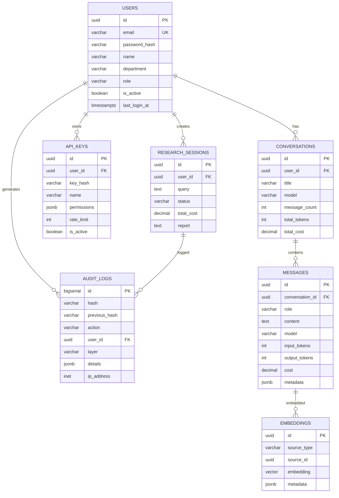

### 11.3 Redis 캐시 전략

| 키 패턴 | TTL | 용도 |
|---------|-----|------|
| `session:{user_id}` | 1h | JWT 세션 상태 |
| `rate:{provider}:{user_id}` | 1min | Rate Limit 카운터 |
| `circuit:{provider}` | 1h | Circuit Breaker 상태 |
| `cache:chat:{hash}` | 30min | 동일 질문 캐시 |
| `cache:extract:{url_hash}` | 1h | DOM 추출 결과 캐시 |
| `queue:heal:{service}` | 45min | Self-Healing 쿨다운 |
| `model:scores` | 5min | 모델 점수 캐시 |
| `user:prefs:{user_id}` | 24h | 사용자 설정 |

```python
# Redis 캐시 클라이언트
import redis.asyncio as redis
import json
from typing import Optional

class CacheClient:
    def __init__(self, redis_url: str = "redis://localhost:6379"):
        self.redis = redis.from_url(redis_url, decode_responses=True)

    async def get_chat_cache(self, query_hash: str) -> Optional[dict]:
        key = f"cache:chat:{query_hash}"
        data = await self.redis.get(key)
        return json.loads(data) if data else None

    async def set_chat_cache(
        self, query_hash: str, response: dict, ttl: int = 1800
    ) -> None:
        key = f"cache:chat:{query_hash}"
        await self.redis.setex(key, ttl, json.dumps(response))

    async def increment_rate(self, provider: str, user_id: str) -> int:
        key = f"rate:{provider}:{user_id}"
        count = await self.redis.incr(key)
        if count == 1:
            await self.redis.expire(key, 60)
        return count

    async def get_circuit_state(self, provider: str) -> Optional[str]:
        key = f"circuit:{provider}"
        return await self.redis.get(key)

    async def set_circuit_open(self, provider: str, duration: int = 3600) -> None:
        key = f"circuit:{provider}"
        await self.redis.setex(key, duration, "OPEN")
```

---

## 12. 시퀀스 다이어그램

### 12.1 채팅 플로우

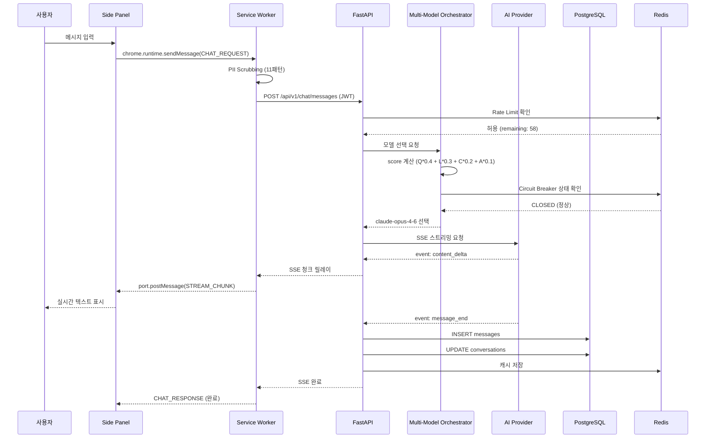

### 12.2 MARS 리서치 플로우

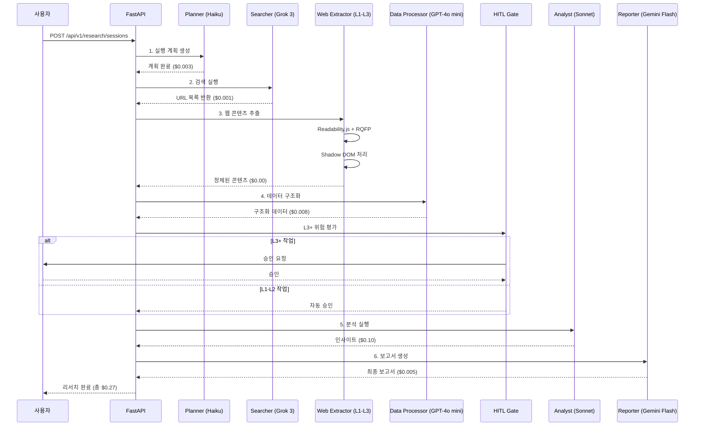

### 12.3 데이터 추출 플로우

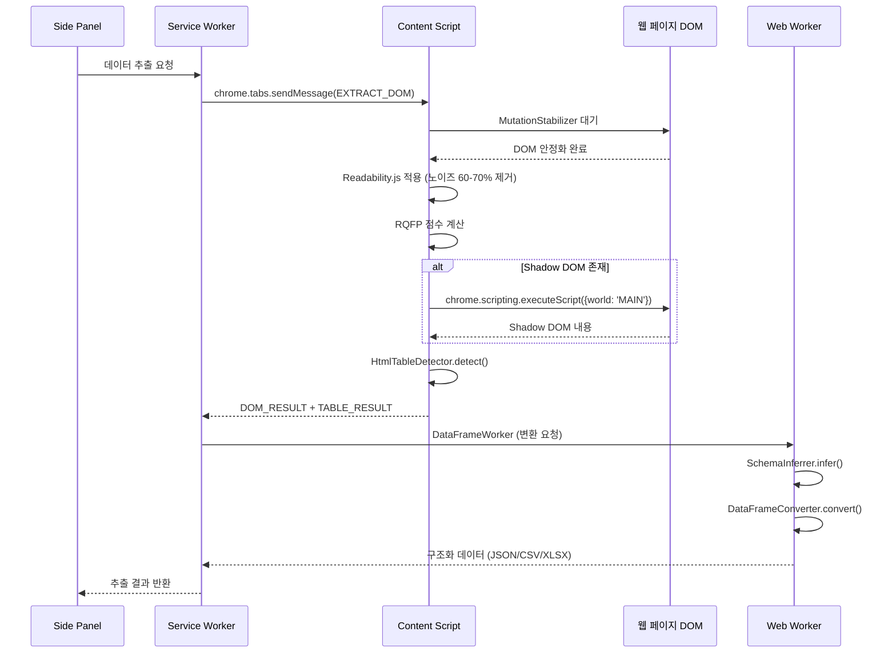

### 12.4 Self-Healing 플로우

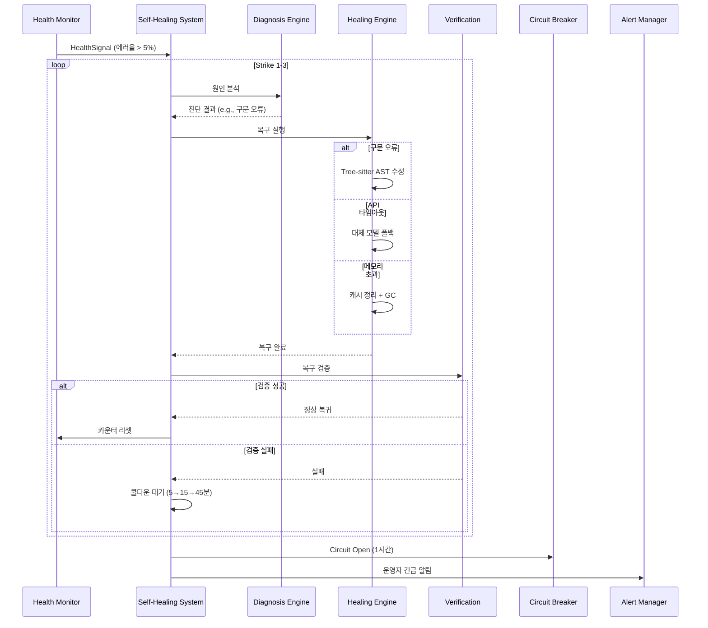

### 12.5 인증 플로우

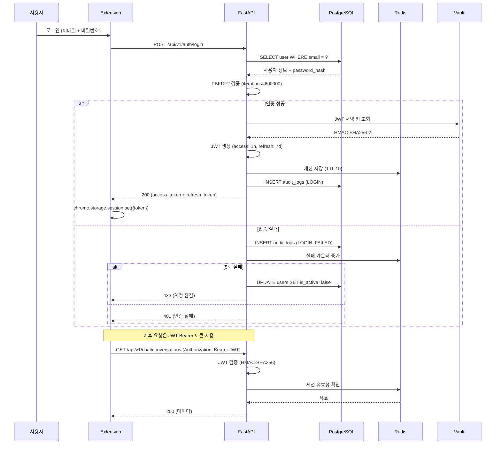

---

## 13. 비기능 요구사항

### 13.1 성능

| 지표 | 목표 | 측정 방법 |
|------|------|----------|
| API 응답 지연 (P50) | < 500ms | OpenTelemetry traces |
| API 응답 지연 (P95) | < 1,500ms | OpenTelemetry traces |
| API 응답 지연 (P99) | < 3,000ms | OpenTelemetry traces |
| Extension 로드 (Cold Start) | < 800ms (P95) | Performance API |
| Side Panel 렌더링 | < 200ms | React Profiler |
| DOM 추출 (Medium) | < 700ms | 내부 타이머 |
| DOM 추출 (High) | < 900ms | 내부 타이머 |
| SSE 스트리밍 시작 | < 300ms | TTFB 측정 |
| DB 쿼리 (P95) | < 50ms | pg_stat_statements |

### 13.2 가용성

| 항목 | 목표 | 비고 |
|------|------|------|
| 전체 서비스 SLA | 99.9% | 월 43.8분 다운타임 허용 |
| API 서버 | 99.95% | 다중 인스턴스 |
| PostgreSQL | 99.99% | 스트리밍 레플리카 |
| Redis | 99.95% | Sentinel HA |
| AI Provider (개별) | 99.5% | Multi-Model 폴백 |
| AI Provider (종합) | 99.99% | 5개 프로바이더 분산 |
| Extension | 100% (로컬) | 오프라인 기능 지원 |

### 13.3 확장성

| 항목 | 현재 | 목표 (6개월) | 목표 (1년) |
|------|------|-------------|-----------|
| 동시 사용자 | 500 | 5,000 | 20,000 |
| 일일 요청 | 10K | 100K | 500K |
| DB 크기 | 10GB | 100GB | 500GB |
| 임베딩 수 | 100K | 1M | 10M |
| API 인스턴스 | 2 | 8 | 20 |

**수평 확장 전략**:
- API: 무상태 설계, 로드밸런서 뒤에 다중 인스턴스
- DB: 읽기 레플리카 + 파티셔닝 (월별 messages, audit_logs)
- Redis: Cluster 모드 (6노드, 3 master + 3 replica)
- Worker: Celery/RQ 기반 비동기 처리, 오토스케일링

### 13.4 보안

| 항목 | 요구사항 | 구현 |
|------|---------|------|
| OWASP Top 10 | 전항목 준수 | 코드 리뷰 + SAST |
| PII 보호 | 11패턴 자동 탐지/마스킹 | PII Scrubber |
| 데이터 암호화 (전송) | TLS 1.3 필수 | HTTPS + HSTS |
| 데이터 암호화 (저장) | AES-256 | PostgreSQL TDE |
| 인증 | HMAC-SHA256 JWT | 1시간 만료 |
| 비밀번호 | PBKDF2 (600K iterations) | 업계 표준 이상 |
| 비밀 관리 | HashiCorp Vault | 동적 크레덴셜 |
| 정책 엔진 | OPA (Rego) | 세분화된 접근 제어 |
| 감사 추적 | SHA-256 해시 체인 | 변조 불가 |
| CSP | nonce 기반 | SSR 미들웨어 |
| CSRF | Double Submit Cookie | SameSite=Strict |

### 13.5 호환성

| 브라우저 | 최소 버전 | 테스트 완료 |
|---------|----------|-----------|
| Chrome | 120+ | 120, 122, 124 |
| Edge | 120+ | 120, 122 |
| Chrome (Android) | 120+ | - (PWA) |
| Safari | - | 미지원 (MV3 미지원) |
| Firefox | - | 미지원 (계획 없음) |

| 화면 크기 | 지원 |
|-----------|------|
| Desktop (1280px+) | 전체 기능 |
| Tablet (768-1279px) | Side Panel 최적화 |
| Mobile (< 768px) | PWA (별도 앱) |

---

## 14. 부록: 기술 스택 총괄

### 14.1 계층별 기술 스택

| 계층 | 기술 | 버전 | 용도 |
|------|------|------|------|
| **L1 Extension** | Chrome MV3 API | - | 브라우저 통합 |
| | React | 19.2.3 | UI 렌더링 |
| | Vite | 7.x | Extension 빌드 |
| | TypeScript | 5 | 타입 안전성 |
| | Playwright CDP | - | CDP Fallback |
| **L2 Smart DOM** | Readability.js | 0.5.x | 노이즈 제거 |
| | RQFP Engine | 커스텀 | 관계형 데이터 추출 |
| | MutationObserver | Web API | DOM 변경 감시 |
| **L3 DataFrame** | SheetJS (xlsx) | 0.20.x | Excel 변환 (클라이언트) |
| | Pandas | 2.2.x | 데이터 처리 (서버) |
| | Web Worker | Web API | 메인 스레드 비차단 |
| **L4 MARS** | LangGraph | 0.2 | 에이전트 상태 그래프 |
| | CrewAI | 0.5 | 멀티 에이전트 오케스트레이션 |
| | Python | 3.12 | 백엔드 런타임 |
| | FastAPI | 0.115.x | REST API |
| **Cross-cutting** | OpenTelemetry | 1.x | 분산 추적 + 메트릭 |
| | Tree-sitter | 0.22 | AST 분석 (Self-Healing) |
| | pgvector | 0.7 | 벡터 임베딩 |
| | OPA | 0.68 | 정책 엔진 |
| | HashiCorp Vault | 1.17 | 비밀 관리 |
| **Infra** | PostgreSQL | 16 | 주 데이터베이스 |
| | Redis | 7 | 캐시 + 세션 |
| | Docker Compose | 2.x | 컨테이너 오케스트레이션 |
| | Turborepo | 2.x | 모노레포 빌드 |
| **Frontend** | Next.js | 16.1.6 | 웹 앱 프레임워크 |
| | Tailwind CSS | 4 | 유틸리티 CSS |
| | Storybook | 9 | 컴포넌트 문서화 |
| | MSW | 2.x | API 모킹 |
| **Test** | Vitest | 2.x | 단위 테스트 (5,997개) |
| | Playwright | 1.x | E2E 테스트 |
| | k6 | 0.52 | 부하 테스트 |

### 14.2 AI 모델 카탈로그

| 프로바이더 | 모델 | 용도 | 비용 (1K 토큰) | 컨텍스트 윈도우 |
|-----------|------|------|---------------|----------------|
| Anthropic | Claude Opus 4.6 | 고품질 채팅 | $0.075 입력 / $0.375 출력 | 1M |
| Anthropic | Claude Sonnet 4.6 | MARS 분석 | $0.015 / $0.075 | 200K |
| Anthropic | Claude Haiku 4.5 | MARS 계획 | $0.001 / $0.005 | 200K |
| OpenAI | GPT-5.2 | 범용 채팅 | $0.060 / $0.300 | 256K |
| OpenAI | GPT-4o mini | MARS 데이터 처리 | $0.0003 / $0.0012 | 128K |
| Google | Gemini 2.5 Pro | 범용 채팅 | $0.050 / $0.250 | 2M |
| Google | Gemini Flash | MARS 보고서 | $0.001 / $0.004 | 1M |
| xAI | Grok 3 | MARS 검색 | $0.040 / $0.200 | 128K |
| Local | Nano 7B | 오프라인 폴백 | $0.001 / $0.001 | 8K |

### 14.3 포트 할당

| 서비스 | 포트 | 환경 |
|--------|------|------|
| Wiki (Next.js) | 3000 | dev |
| HMG (Next.js) | 3001 | dev |
| Admin (Next.js) | 3002 | dev |
| User (Next.js) | 3003 | dev |
| LLM Router (Next.js) | 3004 | dev |
| Mobile (Next.js) | 3005 | dev |
| Desktop (Vite) | 5173 | dev |
| Storybook | 6006 | dev |
| FastAPI (ai-core) | 8000 | dev / prod |
| PostgreSQL | 5432 | dev / prod |
| Redis | 6379 | dev / prod |

### 14.4 환경 변수

| 변수 | 설명 | 필수 |
|------|------|------|
| `NEXT_PUBLIC_API_MODE` | `mock` / `real` | Yes |
| `NEXT_PUBLIC_API_URL` | API 서버 URL | Yes (real 모드) |
| `DATABASE_URL` | PostgreSQL 연결 문자열 | Yes |
| `REDIS_URL` | Redis 연결 문자열 | Yes |
| `JWT_SECRET` | JWT 서명 키 (Vault에서 주입) | Yes |
| `ANTHROPIC_API_KEY` | Anthropic API 키 | Yes |
| `OPENAI_API_KEY` | OpenAI API 키 | Yes |
| `GOOGLE_AI_API_KEY` | Google AI API 키 | Yes |
| `XAI_API_KEY` | xAI API 키 | Yes |
| `OPA_URL` | OPA 정책 엔진 URL | Yes (prod) |
| `VAULT_ADDR` | HashiCorp Vault 주소 | Yes (prod) |
| `VAULT_TOKEN` | Vault 인증 토큰 | Yes (prod) |
| `OTEL_EXPORTER_ENDPOINT` | OpenTelemetry 수집기 | No |
| `LOG_LEVEL` | 로그 레벨 (debug/info/warn/error) | No |

### 14.5 CI/CD 파이프라인

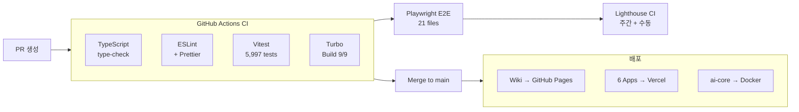

---

> **문서 끝** | H Chat 기술 명세서 v2.0 | 2026-03-15
